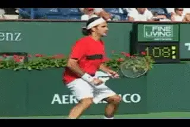
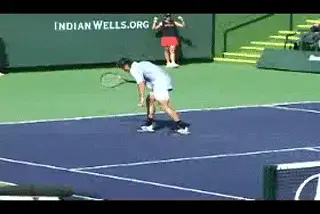

# Momentum

### Nick Wheatley

**Understanding momentum can be a key benefit in developing Marginal
Gains.**

Here is a final important issue to understand as we close our series on
Marginal Gains. Momentum. Understanding momentum can offer a final
marginal gain that can be very beneficial to you at key moments in a
match.

I sometimes hear players say that a slow start isn't the end of the
world when they are playing best of 3 full sets, they've got plenty of
time to work their way back. What they fail to understand is they have
made their task doubly difficult. First, they have to get the score back
level, and if they manage that, then they have to find a way to win.

**The Myth**

There is a myth about momentum. Many people believe that if a player is
behind and then levels the score that player then becomes a strong
favorite to push on for the win. This seems even more likely to when the
player levels the score more easily.

However, there is often big danger lurking for the player that levels
the score. We've all seen score lines like 6-4, 1-6, 7-5. If you win
the second set easily and presumably have the momentum, what does that
really mean in terms of outcome?

I personally collected data of Top 100 ATP players in 2018 and 2019,
where an easy set is defined as a 6-0 or 6-1 or 6-2.

In 2018, when a player won the first set but then lost an easy second
set they still won the match 50% of the time. In 2019, that figure was
about the same 48%. So, the momentum their opponents allegedly had from
winning a relatively easy second set only translated into an overall win
around half of the time.

 

 

**Top professionals know that matches can have endless ups and downs.**

**It's important to note that these are high level professionals,
skilled at dealing with the endless ups and downs in
matches.** But for lower levels, having momentum
can actually be dangerous if not fully understood.

I strongly believe the player who initially has the lead should always
still hold the upper hand once the scores are level. Let's examine why
this could be the case.

**Humans are naturally wired to obtain satisfaction from success. But
the satisfaction gained from recovering to 5-5 in a set from 2-5 down,
could easily lead to a little lull of intensity during the next game, as
we congratulate ourselves on the comeback, and perhaps expect that
pushing on to win the set is now a formality.**

**Meanwhile, think of the opponent who has lost the 5-2 lead. As long
as he hasn't imploded mentally, he will be extra determined at the
start of the next game to stop the slide.**

**[At 5-5, you therefore have one player who is determined and focused,
against one player who may just have relaxed a little. Often, such sets
are then won 7-5 by the player who had the 5-2 lead.]**

**Making a comeback requires a period of continuous mental and
physical effort.** You're fighting to win those 3
games in a row, and at 5-5, the exertion of making the comeback can
often then lead to a little slump in intensity due to the relative
safety of the 5-5 score line compared to the danger of being 2-5 down.

**Losing momentum can be dangerous if you don't really understand it.**

This kind of mini comeback happens all the time in tennis. It could be
3-0 and then 3-3. It could 40-0 to deuce, or even 30-0 to 30-30. It
might be a 1 set lead being cancelled out at 1 set all, or a tie-breaker
that has gone from 6-3 to 6-6.

For the player who has lost the lead, there is a huge opportunity at
these moments. Their opponent is only human, and no matter their
awareness of the situation, they will find it a little harder to keep
their foot on the gas.

I always tell my players to gain confidence and reassurance from this
knowledge, and not to panic when they have been pegged back in the
score. If the player who has lost the lead, can stay focused and
positive, and stick to their game plan, they can often quite easily
regain the lead straight away, and this awareness is another marginal
gain.

The danger for the player who has just clawed the scores back to level
should now be apparent, and if that's the situation you find yourself
in, you must try and suppress any feelings of satisfaction with the
comeback and be aware to the danger that now lurks is an opponent who is
ready to regain their lead straight away.

For more on momentum I recommend Alistair Higham's amazing series of
articles on Tennisplayer. ([link](https://www.tennisplayer.net/members/mentalgame/alistair_higham/Higham_Momentum_Intro_5_Stages_images/Higham_Momentum_Intro_5_Stages.html)
to see the first one.)

So that's it for my series! Good luck applying the concept of marginal
gains to your tennis game, and it would be great to hear of any success
stories that have come from it.

Nick Wheatley is an LTA Performance Coach and

His junior teams, the Hawker Jets, have won 44

competitions since formation, and over the last 2

years alone, his junior players have won 19

singles tournaments between them at county level.

He has been ranked in the top 75 nationally in 35

and over singles and in the top 5 in Surrey

county. Nick has done video analysis for numerous

players at all levels, including former British

Top 10 player Marcus Willis.

His unique teaching video series, covering every

aspect of the game, is available on his website

[www.nickwtennis.com](http://www.nickwtennis.com)

You can also contact Nick directly via the

homepage of his website.
