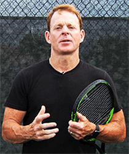

# Opening the Court:  
Pattern 12

### George Zink

Pattern 12 in George's awesome series has two variations. The first
variation starts with a backhand crosscourt. Follow that with an inside
out forehand. Then attack the open court\! The second variation also
starts with a backhand crosscourt. But this is followed by an inside in
forehand. Again the third shot is an attack into the open court. Based
on the response to the first crosscourt, the player can go either inside
out or inside in.

|  |
|  |
|  |

George Zink is a master tennis professional with over 25 years of
teaching experience. After competing on the ATP Future Tour, George won
9 national championships in singles and doubles, and has coached junior
players who have won 5. A former college coach at Franklin and Marshall,
George has managed clubs with large teaching staffs and also owned gyms
in Pennsylvania and Florida where he exponentially expanded membership.
Over the last 15 years, thousands of junior players have attended his GZ
Tennis Camps. Based in Bradenton, Florida, George has two children who
are currently highly ranked national juniors.
