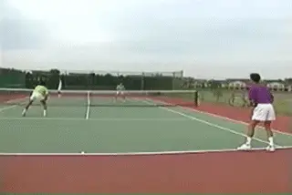
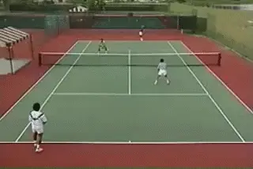
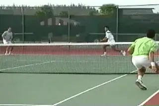
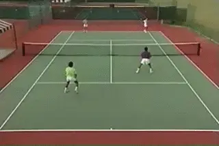
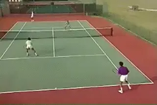
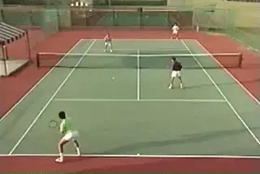

# Playing Winning Doubles: The Return Game

**By Allen Fox, Ph.D.**

In the first article we analyzed the basic geometry of the doubles
court, saw how doubles is fundamentally different than singles, and
analyzed the patterns and strategy for your team's serving games. Now
let's look at the other half of doubles: the return game.

**Attack or Defend?**

When your team is receiving in doubles, you should make a conscious
decision whether to attack or to defend. If you choose to attack, the
partner not receiving serve should stand just inside the service line,
but this is a temporary situation.

**The receiver should join his partner at net as soon as possible if
your strategy is to attack.**

The purpose of this one up, one back position is to allow the receiver
to join his partner at the net as soon as possible. He can do this by
hitting an approach on his return of serve or by taking a short ball.
The third option is to lob over the opposing net player's head and
follow it in.

Another reason for starting one up, one back is to allow the partner at
the net to poach. If the return of serve is good, the partner at the net
can go across and pick off the server's first volley. He can do the
same if the server stays back and gets into a crosscourt rally.

**A good return means you can poach the first volley.**

If the receiving team stays in this one up, one back formation and the
serving team can establish itself at the net it gives the serving team
the best of all worlds. They can hit difficult volleys back to the
opponent on the baseline, but as soon as they get an easy ball they can
blast it at the opposing net player, who has been standing around doing
nothing but now makes a convenient target.

**Defend**

If you and your partner are returning serve against a strong serving
team and aren't able to establish yourselves at the net, it's better
to both stay on the baseline and defend. This eliminates the net partner
on the receiving team as a target.

**If can't take over the net, it's better to change strategy and
defend playing 2 back.**

**Instead, the serving team has to hit through two entrenched
defenders. From the defender's position there are two high-percentage
plays.** **The first is down the middle, over the
low part of the net. It leaves the volleying team with no angle. It also
tends to pull the net players together and this opens up the sidelines
for passing shots on subsequent balls.**

**The other key play from the defending position is to lob. Most
people at the recreational level simply do not have overheads that are
reliable enough to overpower determined lobbers,**

**Few recreational players have the overheads to defeat determined
lobbers.**

**Lobs fall into two categories: defensive and
offensive.** **Defensive lobs should be hit as
high as possible. Good defensive lobs test your opponent's overhead and
their nerves.** Usually, they will produce errors
from the attacking team. In addition, they'll drive your opponents back
off the net and this will open up the court for passing shots.

**If the volleyers move in close to the net, hit offensive lobs with a
lower trajectory and a higher velocity.** **If
you can get an offensive lob over your opponent's head, you and your
partner should immediately go on the offense and both rush to the
net.** Now you have the advantage, and your
opponents must defend.

**Returning down the line early will usually pay off later in the
match.**

**Another element in your receiving strategy should be to hit a few
crisp returns right down the line, either past or directly at the net
person.**

**Do this at the beginning of the match just to show that you are
willing and able to go down the line, and also that you don't fear the
net player's volley.**

**This will pay off later in the match by making your opponents more
hesitant to poach on important points. Be aware not to over hit when you
go down the line. The ball has to go in the court to have the desired
effect.**

**Finally, if the second serve is weak and short, the down the line
return can be a point winner. It may be the easiest shot you get at the
net player.**

**When you advance to the net, avoid getting caught in the no-man's
land between the service line and the baseline. Here you're vulnerable
to both the pass and the low ball at your feet, and there's nothing you
can do to hurt your opponents by staying there.**

**When going to the net move forward quickly and decisively. Make sure
you get inside the service line.**

**One Up One Back**

**If the object of smart doubles is to take over the net, why do so
many teams play with one player at the net and one player in the back
court? The answer is that it can be effective so long as both teams stay
in this formation.**

**If you opponent's play 1 up one back, hit deep cross-courts and
follow them to the net.**

**Typically, the points develop into crosscourt ground stroke
exchanges between the two back court players, with the volleyers doing
little or nothing until a ball drifts close to the center. Then one of
them moves across, poaches, and hits a winner.**

**If your opponents play one up, one back, you can get a decided
advantage if you can bring both players on your team to the net. If
you're on the baseline, try to get to net as soon as possible. Hit your
cross-courts deep to force a short reply and hit an approach that you
can follow in.**

**Another alternative is to hit a lob over the opposing net player's
head and follow it in. If you're unwilling or unable to go in, your
partner should look for the first opportunity to poach. Move across the
center and hit the volley at the opposing net
player.**

Read More From Allen!

Visit him at [www.allenfoxtennis.net](http://www.allenfoxtennis.net) 

**Winning the Mental Match Dr. Allen Fox**

Tennis is mentally the most difficult sport due to it's personal nature which makes winning and losing feel more important than

they are. In this new book, Allen offers his proven solutions to problems such as choking, reducing stress, finishing matches, and

developing confidence. Based on a lifetime of high level play and coaching success, it's a must for all competitive players.

[[ to

Order]](http://www.amazon.com/Tennis-Winning-Mental-Allen-Fox/dp/0615407765/ref=sr_1_1?ie=UTF8&qid=1336083459&sr=8-1).

Winning may not be everything, but Dr. Allen Fox points out that, if we

losing. In his new book, The Winner's Mind, Allen lays out an original

step-by-step plan for succeeding at any of life's endeavors, based on

his first hand and very personal observations of the careers of both

world-class tennis players and successful businessman. The bottom line

is that even if you are not a born champion--and only a tiny percentage

of us are--you can still use the success strategies of champions to

tilt the odds in your favor. Writing with brutal honesty and dry humor,

Fox lays out the common mental characteristics of winners in sports and

in life. He explains the critical role of intellect over emotion. He

analyzes the struggle between ambition and fear and the insidious and

pervasive fear of failure that undermines so many of us. He then outline

how to confront and overcome these fears in your life and career, even

when they are initially subconscious. Must reading from one of the great

thinkers in tennis, and a Renaissance Man in life. [[ to

Order]](http://www.tennis-warehouse.com/descpage-MIND.html).

To purchase this book you can also send a check for $17.95 to Allen

Fox, 1120 Inverness Place, San Luis Obispo, CA. 93401. The price

includes shipping.

                                                                                                                                                          insightful analysts in modern tennis. A top 10 American
player from the glory days before Open tennis, Fox
played many of the legendary greats, among them Roy
Emerson, Rod Laver, Stan Smith, and Arthur Ashe. At
Pepperdine he developed the men's tennis program into
an elite contender for national titles, and gave Brad
Gilbert the insights that became the foundation for
"Winning Ugly". His book Think to Win is a modern
classic. He has also starred in a series of acclaimed
videos, including Pro Secrets of Match Play and Allen
Fox's Ultimate Tennis Lesson.
