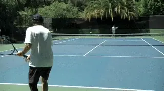
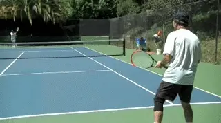
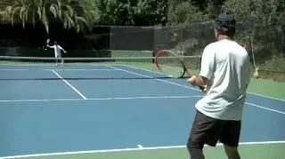
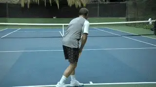
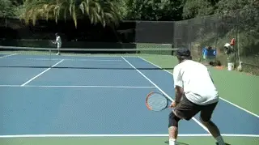

# Marginal Gains:

# Preparing for Competition

### Nick Wheatley

**Start your pre-match warmup with a limited number of easy rallies.**

In this series, we have looked in depth at the way you can use to
strengths of your game in matches in ways that lead to winning that
extra handful of critical points that are the difference in close
matches. In this article, let's see how you can create additional
marginal gains during your preparation for those matches. As the saying
goes "If you fail to prepare, then prepare to fail."

We could at this point delve deep into things like physical fitness,
diet, and nutrition. This is not my area of expertise, and should you
want to embark on a longer-term plan to make progress in these areas,
there is a wealth of information elsewhere on this site and in the
larger coaching world to help you do that.

Instead, my focus is on ideas that you can adopt tomorrow, to be better
prepared than your opponent, and achieve a marginal gain that will help
boost your chances of success.

Preparation before matches is almost all about your pre-match warm-up.
I'm not talking about the 5 minutes you'll get with your opponent(s).
To me preparation means warming up for 30-45 minutes at some point prior
to the match.

**The Down the Line Live game---start crosscourt and the point begins
when the first player takes the ball down the line.**

It's not so important if there are a few hours gap between your
pre-match warm-up and the match itself. What is important is that your
body and mind have gone through this process on the same day as your
match, so the feelings will be fresh, and you will then get the benefit
of this dress rehearsal.'

Let's say you've allocated 30 minutes for the pre-match warmup.
Here's an example of how you can make best use of this time based on
some of the drills and practices already covered in this series.

Start with no more than 3-4 minutes of hitting. Then move onto "down
the line live" game we outlined in a previous article. 
You may only get to play first to 5 points on each cross-court pattern,
but it will be invaluable.

Then it's time for some specific volley practice, and how this is done
will depend on whether you are playing singles or doubles. If singles,
you will want to incorporate your approach to the net in the practice.

**Practice your approaches and volleys for either singles or doubles.**

In doubles, you'll need to do the same using half the court. You will
also want to do some practice from the net position on the side you will
be returning from, once again using half a court, and perhaps with the
option to put easy balls away to the other half.

Your practice time is precious and often limited, so only spend a minute
or so warming up your volleys before starting your chosen drill. Once
volleys are done, it's time for some specific serve and return practice
also detailed in a previous article. ([link](Return%20of%20Serve%20Points.docx).)

Hit only a handful of warm-up serves, and then set yourself up to
practice serves and first split step on either the singles or doubles
court, and then returns on their own. You'll probably be running out of
time at this stage, but if not, you can finish by playing out a few
points.

If time is more restricted, a shorter pre-match warm-up is still far
better than none at all. You may want to focus on what is most relevant
to your game. Serve and return will always be included, but as a
baseliner playing singles, you could cut out the volley practice, and as
a serve and volleyer playing doubles, you could leave out "down the
line live."

**Practice the serve and the split step.**

If you have more time, then you can extend some of the drills. You can
also add in the "first 4 shot" drill to transition from serve and
return practice to playing full points. In first 4 shots practice, you
play only the first 4 shots, or however many shots the rally lasts if it
doesn't reach 4. If the 4th shot is in, the point is awarded to the
player who was in control of the rally at that moment.

Around 40 minutes of specific practice would be ideal to get yourself
fully ready to compete, and at least a 15 minute break before the match
is due to begin.

If you can schedule this into your pre-match routine, you will notice
and appreciate the benefits of being fully prepared, especially if your
opponents haven't matched your commitment.

Most importantly, feeling ready and being properly prepared is a great
source of confidence. Confidence is the holy grail for tennis players.
Nothing beats feeling confident on the court as you go about executing
your game. A proper warm-up will build your confidence because you know
that you have made a marginal gain by being fully prepared when the
match gets underway.

**If you have time play a series of 4 shot games.**

The final ingredient for proper preparation is full knowledge of the
environment you will be competing in. This includes knowledge of the
venue, the court surface, any weather factors, your opponent, and the
scoring format.

Being clear in your mind about these factors means you don't have to
waste any energy worrying or wondering about how things might be.
Picture the environment in your mind, and imagine yourself in it and
feeling comfortable.

Take visualisation techniques a step further if you wish, they are a
great way to prepare for a tennis match. ([link](https://www.tennisplayer.net/members/teaching_systems/john_yandell/off_court_visualizations/)
for John Yandell's article on that.) If travelling is involved, plan
ahead to arrive 15-20 minutes early at least, and take away any
unnecessary stress involved with running late, or unexpected traffic
delays.

The combination of a specific warmup with this mental preparation can
make a huge difference. In the next article I will detail how it worked
for my club team in a match we won against a very strong rival.

Nick Wheatley is an LTA Performance Coach and

His junior teams, the Hawker Jets, have won 44

competitions since formation, and over the last 2

years alone, his junior players have won 19

singles tournaments between them at county level.

He has been ranked in the top 75 nationally in 35

and over singles and in the top 5 in Surrey

county. Nick has done video analysis for numerous

players at all levels, including former British

Top 10 player Marcus Willis.

His unique teaching video series, covering every

aspect of the game, is available on his website

[www.nickwtennis.com](http://www.nickwtennis.com)

You can also contact Nick directly via the

homepage of his website.
