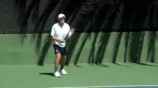

# Marginal Gains: Return of Serve Points

### Nick Wheatley

------------------------------------------------------------------------

**It's obvious\--though not to a lot of players\--move back to return a
big first serve.**

Let's now move onto the start of point scenario where you are returning
serves. If you read the last article on serving ([link](Increasing%20Your%20Chances%20of%20Winning%20Points%20on%20Serve.docx)),
you have an understanding of what an intelligent server is trying to do.
This is a great starting point for making marginal gains in return
points.

If your opponent makes a first serve, the percentage chance of winning
the point is the lowest of the 4 start of point scenarios. But there are
still ways to find marginal gains and win a higher percentage of these
points. And we know just a few more points won over the course of a
match can prove critical in determining the winner.

Ultimately, you want your opponent to have to do more than just make the
first serve to earn the point. So, getting returns in is crucial.
**Trying risky returns on first serves can lead to cheap points for
the server. Even strong servers will struggle to serve accurately enough
that you can't get your racket to the ball a decent amount of the
times.**

**Depth!**

Depth is the key to making marginal gains on first serve returns.
Positioning can be the difference. If you are struggling to make returns
back in play, then take a few steps further back to give you a little
more time to see the ball and make your return.

**A deep return should land in the back third of the court.**

This is a point that sounds simple, but I'm amazed by how often players
fail to adjust their positioning when struggling with the pace of a
powerful server.

I say keep things simple and move further back. Taking the ball early
requires a lot of skill and is usually too difficult to do effectively
as a primary option.

To achieve depth, you are looking to control the ball back crosscourt or
up the middle, to land in the back third of the court. This is best
achieved by taking a short abbreviated swing at the ball, and trying for
a contact point out in front which allows you to use the pace of the
incoming serve, and have better control on your return.

In any case, it's better to look for that depth than to settle for
simply getting the ball back in. Even if your goal is to make every
return, good players will take control of the point if you drop the ball
short. If this is happening it's often better to miss a few more
returns over the course of the match trying to get depth, than to
consistently set the server up with short returns.

**Versus the Serve and Volley**

If your opponent is following up their serve by coming to the net, then
the challenge on returns changes. In this case deep returns will lead to
higher shot trajectories that play into the hands of the server coming
in. In this case you will be looking to keep your returns lower, and
perhaps risk taking the ball earlier to reduce the time your opponent
has to close down the net.

**Make a serve and volley player hit a low volley off your return.**

In any case, you are always up against it when facing good first serves.
The ideas to increase your chances a little are simple ones, but not
always easy to execute.

The final piece is to make a well-timed split step your best friend.
Couple this with sharp eyes to pick up the direction of the incoming
ball as early as you can.

Split step timing is one of the most neglected areas of the game in my
opinion, and when I use high speed video to really see how well my
students are timing their split steps, I find that they are late.

They are initiating their split too late, landing too late, and losing
precious time that often makes the difference between a successful
return and a missed one. So, when returning fast serves, keep evaluating
your split step timing, experiment with starting your split step
earlier, and increasing your concentration to pick up the direction of
the ball a fraction earlier.

These skills take time to develop, but with a little added concentration
you will develop them faster. I promise you'll like the results when
you get it right!

**Work to make your split step a fraction earlier.**

That concludes the start of point scenarios involving first serves going
in, and they may have provoked a question. What if my opponent isn't
skilful enough to trouble me with fast accurate serves? Next, we are
going to look at second serve returns. And the marginal gains ideas and
solutions will also apply to weaker first serves.

**Second Serve**

When your opponent misses their first serve, this can lead to a world of
opportunity, but how aware are you of this opportunity, and how to take
advantage of it?

Let's start by thinking about your stronger side, which is probably
your forehand. When returning strong first serves, the opportunity to
hit your forehand aggressively can be restricted, due to the direction
of your opponent's serve, as well as the lack of time you have to make
your return. That often changes for second serves, sometimes greatly at
lower levels where players may have a bullet first serve that rarely
goes in, and a powder-puff second serve.

The first thing to do is adjust your positioning, based on your
understanding of your own game, and the game itself. Let's say you're
a right-handed player who favours his forehand. On the deuce side, you
can afford to move to the left a step or two, and perhaps forwards a
little bit too.

**On a second serve, try starting further left in the deuce court.**

This opens up space on your forehand side and makes getting the serve to
your backhand a tougher task for the server. If your opponent isn't
highly skilled, they will have neither the confidence or perhaps the
skill to send their second serve to the open forehand side in a way that
will exploit the space. Y

You are therefore taking minimal risk in leaving that space open, while
increasing the chances that the first shot you hit in the point, will be
with your strength. If you also make a run around move for any second
serves that come down the T area, you could find you can hit your
stronger forehand on return almost every single time your opponent
misses their first serve.

As the match goes on, you should keep a mental note of what your
opponent does in response to your second serve positioning, if anything?
Does he try to exploit the space on the forehand side, and is he at all
successful? If you aren't being troubled, then you can stand even
another step to your left to return.

**Another deuce court option---run around the serve to hit forehands.**

**Ad Side**

Things change a little when you're returning on the Ad side, because as
a right-hander, a move to your left to increase your chances of getting
to return with your forehand but takes you further away from the center
of the court. The beauty of this move on the deuce side is that you are
nicely positioned for an easy recovery after playing the return. On the
Ad side, there is more ground to cover to achieve best positioning for
the server's 2nd shot.

This is where you would be wise to consider your top shot and other fav
shots. Perhaps backhand crosscourt is on your fav's list, in which case
there is less reason to move to your left for second serves in the Ad
court, as you can trust your skills to make a good return with that
shot.

Perhaps your top shot is inside out or inside in? In this case, it may
be worth making the move left and hitting a strong enough return with
your best shot, that your opponent won't be able to take advantage of
the open space you are leaving. Or you will have enough time to recover
as your opponent will be forced into a defensive reply from your return.

**Down the Middle**

**Consider hitting backhand crosscourt returns in the ad court.**

If you stick with the 6 main shots that we identified earlier in the
series, you will surely enjoy much success returning second serves. But
one thing the 6 main shots don't cover is hitting a ball straight up
the middle of the court.

When you have time on the ball in a rally, this option isn't commonly
used because you are turning down the opportunity to hurt your opponent
by running them to one side or the other. However, there are certainly
situations where using an attacking shot down the middle could be a wise
choice and returning second serve is at the top of the list!

**On the serve, as opposed to a regular groundstroke, it takes a
fraction longer to recover your balance. Therefore, the server is
vulnerable to being rushed by an early aggressive
return.** **If this return is struck right up the
middle of the court, it's also an awkward move to get the body out of
the way to make room for your next shot, and an error from the server on
their next shot can often arise as a result.**

**A deep down the middle return can produce errors, even from Roger
Federer.**

This was the return option that Djokovic intentionally used against
Federer, to successfully save the first of Federer's 2 match points in
the incredible Wimbledon final of 2019.

Hopefully you can see the advantages of having set plans and ideas in
your mind for when your opponent misses his first serve. This is already
a favourable situation for you, but by adjusting your positioning based
on your understanding of your game, and the game itself, you will be
able to use your stronger shots more often for the first shot of the
rally. Having further intent in your mind regards where to aim your
returns, based on the desired pattern you would like and/or your
opponent's weaknesses, will allow you to exploit the second serve
return opportunity like never before. Over the course of a match, that
can easily lead to quite a few percentage points increase in your
success rate.

Finally for returning second serves, what about players who are skilled
enough to hit a fearsome kick? These players can often get the ball to
kick so much, that aggressive returns are very difficult. With a potent
mixture of side and top spin, the ball becomes very hard to read after
the bounce.

**Moving back on second serves as Nadal sometimes does can neutralize
the effect of a strong kick serve.**

The answer to this is what we often see Thiem and Nadal doing, as well
as many others on tour. When a first serve is missed, they will often
adjust their positioning significantly backwards in the court. This is
to allow all that work on the ball to die down a bit and give the
returner a bit more time to read the ball.

This tactic may take away the option to rush your opponent with an early
hit, but does neutralise the quality of the serve, and allow the
returner to hit a strong return that will get them into the rally. This
option doesn't have to be restricted to dealing with deadly kick
serves.

**Your game style may be suited to having more time on the ball,
rather than trying to take the ball early, in which case holding back a
little more on the second serve return will allow you to use your
strengths.**

**On the other hand, if your skills lie more with early hitting,
standing even closer into the court for second serves is a great option,
and another tactic often used by tour players.**
The court surface will also play a factor, with faster lower bouncing
courts favouring an early strike, and higher bouncing courts favouring
standing even further back.

|  | His junior teams, the Hawker Jets, have won 44 |
|  | competitions since formation, and over the last 2 |
|  | years alone, his junior players have won 19 |
|  | singles tournaments between them at county level. |
|  |  |
|  | He has been ranked in the top 75 nationally in 35 |
|  | and over singles and in the top 5 in Surrey |
|  | county. Nick has done video analysis for numerous |
|  | players at all levels, including former British |
|  | Top 10 player Marcus Willis. |
|  |  |
|  | His unique teaching video series, covering every |
|  | aspect of the game, is available on his website |
|  | [www.nickwtennis.com](http://www.nickwtennis.com) |
|  |  |
|  | You can also contact Nick directly via the |
|  | homepage of his website. |

------------------------------------------------------------------------
