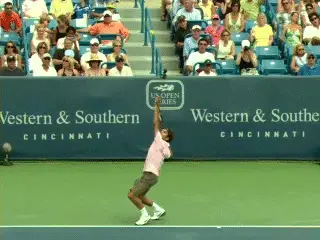
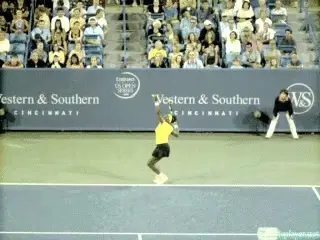
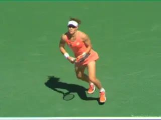
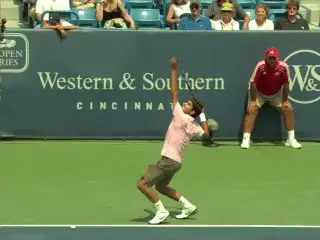
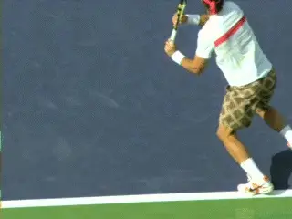
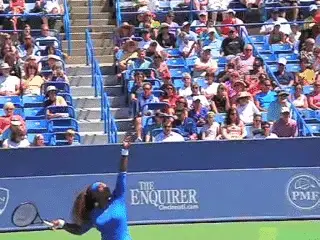
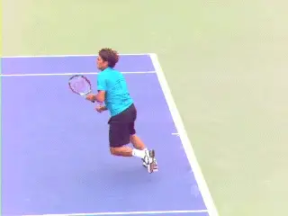

# Swinging Volleys: The New Future of Attacking Tennis?

### By John Yandell

**Is the serve and swinging volley game the future of attacking
tennis--or is that crazy?**

**The modern pro era is dominated by huge serves and heavy, high
velocity groundstrokes**. Although the statistics
show that players can still win points when they go to the net, the
serve and volley game seems effectively dead. By that I mean pure all
the time serve and volley, coming in behind every first serve and even
most second serves--plus coming in on second serve returns and short
groundstrokes.

**Is that death the consequence of the evolution of rackets, strings,
and the athleticism of the players? Or is it somehow possible top
players will find new ways to win a majority of their points at the
net?**

**[The reality is that they may already have found it. They just don't
realize the full implications, and the commentators are too busy
rehashing how great they were in the old days to realize it
either.]**

**What?**

**What am I talking about? The swinging volley**.
Yes we all know it exists. We see it in women's tennis. We see it in
men's tennis. If you pay attention, you have also seen Andy Murray,
Novak Djokovic, Serena Williams, and Roger Federer, among others, play
serve and swinging volley tennis.

**[This means a first serve or even a second serve backed up with a
swinging volley. Usually, the swinging volley is a clean winner, but it
can also set up a conventional volley to finish the point.]**

**Did Serena win match point with an anomaly--or a glimpse of the
future?**

But in general, the swinging volley is treated almost as an
anomaly--something that somehow just happens in some situations. And I
think maybe the top players think about it that way too, if they think
about it.

The sequences don't seem planned. The players sense the return is a
little high, or slow or floating. Or same for a ball hit in a rally.

Suddenly there is a ball in front of them and they know/feel they can
swing. So they jump on it.

Regardless of actual intent, the reality is that a swinging volley is a
huge shot with more pace and spin that any conventional volley ever hit
in the history of tennis. Could this become the basis for a new,
deliberate attacking style?

Yes it could. And I believe it will. Some player or players are going to
figure it out and use swinging volleys more systematically and
intentionally.

That's the way the advances usually occur in tennis. Players find ways
to hit the ball better. Think of the wiper now universal on the modern
forehand.

Or they find new ways to win points. Think of the shift to playing
inside out forehand from the baseline.

And when change occurs, then the coaches will learn from the
players--and start to train those new elements. And then the innovative
becomes conventional wisdom.

I say this is what is going to happen with swinging volleys--and
specifically serve and swinging volleys.

**Research History**

**A Sam Stosur forehand swinging volley hit for a winner with 3500rpm.**

But why would a swinging volley be a more effective shot than a
traditional volley? Three reasons. Pace, spin, and court position.

This claim isn't just observational. In the late 90s we did the first
ever studies of ball speed in tennis--beyond the initial serve
velocities recorded by the radar guns--quantifying the ball speeds on
the shots of the great Pete Sampras. ([link](https://www.tennisplayer.net/members/mystheavyball/john_yandell/ball_speed_pro_tennis/ball_speed_pro_tennis_page1.html).)

We found his average forehand mph was in the high 70s. We filmed one
forehand that was 85mph. Today of course the forehands are hit with that
speed and more--and with almost double the spin of Sampras's forehand.
([link](https://www.tennisplayer.net/members/mystheavyball/john_yandell/ball_speed_pro_tennis/ball_speed_pro_tennis_page2.html)
for more on that.)

We were also able to measure the speeds on a handful of volleys. Not
surprisingly, those speed were significantly lower than the
groundstrokes, average in the mid to high 40mphs, with an occasionally
volley moving over 50mph.

In a related study we also measured volley spin. Forehand volleys were
spinning at less than 1000rpm, while backhand volleys were slightly more
on average. ([link](https://www.tennisplayer.net/members/mystheavyball/john_yandell/spintest_part2/spintest_part2.html).)

And that data right there probably explains a big part of the decline of
pure serve and volley tennis--and how the attacking game has changed.
Conventional volleys are simply not consistently powerful enough to be
hit for winners ball after ball given the changes in the speed and spin
of the groundstrokes.

Besides speed and spin a related part of the explanation is court
position. With serve speeds now in the mid 120s and higher, a serve and
volley player has time only to land, take one step and split before
hitting a first volley. If he is lucky that puts him about halfway
between the baseline and the service line--maybe not that close.

**The swinging volley can change the significance of court position.**

And from there he can hit a conventional first volley with only about
half the speed and half the spin of a modern groundstroke. That seems
like suicide. **So instead, players let the ball bounce and take a
swing.**

[**[Swing is a key word here]**. **[In today's game, the
swinging volley is essentially the same technical motion as a
groundstroke.]**] **A swinging volley can also be
hit from 10 feet inside the baseline or more. This is a position where
groundstrokes are regularly hit for clean winners. And you just can't
do that in most cases with conventional volleys.**

**More Data**

It would be great to know from all that secret Hawkeye data that the ATP
releases only sporadically, what the average speeds of a few dozen or
hundred volleys and swinging volleys really are.

**But chances are the swinging volleys reach the same speeds--70mph,
80mph, or faster as the groundstrokes. And maybe the swinging volleys
actually have more velocity.**

**Why? Because the ball loses significant speed when bounces--roughly
a third of the total velocity is lost due to the friction of the court
surface at the bounce. But a ball hit in the air before it bounces
hasn't lost that speed and likely some of that speed is reflected in
the speed of the swinging volley itself.**

**How hard is it to develop a swinging volley technically?**

Although we don't have anything like comprehensive data on spin
either--again the ATP could really clarify things--what we do have
shows that the spin levels on the swinging volleys are also comparable
to the groundstrokes--or even higher. Take a look at the gorgeous Sam
Stosur forehand swinging volley in this article.

That ball is spinning at over 3000rpm! The swinging forehand volley in
the Roger Federer serve and volley sequence? Over 5000rpm! More than any
groundstroke of Roger's we have ever measured.

Why so much spin? Again, it's a hypothesis that needs more
substantiation, but it would make sense that if the velocity of swinging
volleys was as high or higher than the groundstrokes, then the spin
levels would be as high or higher as well.

**A New Class?**

**So, is the swinging volley some new class of shot in terms of speed
and spin in the pro game? Maybe! But even if not, it's still faster and
heavier that a volley could ever be.**

So how hard would it be for more players to incorporate more swinging
volleys--or even go to so far as to make it a predominant style? Go in
on the serve. Go in on the first short ball. Go in on weak second
serves.

**Not hard. In fact, players already know the mechanics intimately.**

**A forehand swinging volley is hit with a full body turn. It's hit
with great extension. It's hit with full wiper action. All the things
that for elite players are already natural and
automatic.**

**The swinging volley works on either side and can be followed with a
conventional volley.**

There isn't a new shot to learn here. It's simply the decision to
apply that same swing to a ball in the air--which also typically has
the same range of contact heights as the groundstrokes themselves.

**Backhands?**

But an obvious question, we have been talking so far about forehand
swinging volleys. What about the backhand?

The answer is you see swinging two-handed backhand volleys all the time,
especially on the women's side. It's the same adaptation.

But what about one-handers? I don't believe there is any reason it
wouldn't work. It's the same technical swing as the one-handed topspin
groundstroke.

I haven't personally seen an elite one hander hit the shot yet--but
probably I missed it so if you did let me know. But I did an experiment
with some high level Norcal NTRP players.

**Guess what? It was an easy adaptation.**

And, using the pocket radar gun ([link](https://www.tennisplayer.net/members/technology_in_teaching/john_yandell/measuring_change_radar_technology/)
for more on that), we found that the speed increased significantly
compared to the classical backhand volley. Just like on the forehand
swinging volley.

But maybe the strategic play here is not to hit many backhand swinging
volleys and get around the ball when possible and hit inside out or
inside in swinging forehand volleys. Like off the ground? It's a little
explored option. But maybe not unexplored forever.

**Is the next Roger Federer out there right now--practicing difficult
swinging volleys with total confidence?**

Personally, I can imagine a young player who hasn't been told it's a
low percentage to hit a swinging topspin volley at the level of his shoe
laces--or one that is high over his shoulder. He just believes and
swings--at those and all the heights in between.

And, possibly, the case of the swinging volley could even be the
exception in which a coach might get ahead of the players in introducing
an innovation that changes the game tactically.

Maybe that coach is even a Tennisplayer subscriber reading this article.
Or maybe he is a young player doing the same.

I am not the first person, by the way, to consider this possibility.
Remember the "spaghetti" strings? They made the spin increases from
poly seem insignificant and they were banned in 1977 after Illie Nastase
used them to snap Guillermo Vilas' 53-match clay-court winning streak.
([link](https://www.tennisplayer.net/members/physics_of_tennis/josh_speakman/spaghetti_strings/).)

But not before the tortured genius who invented them, a German
horticulturist named Werner Fischer, predicted that heavy topspin
volleys were the future of serve and volley tennis. It's 40 years
later, but maybe that prediction will still come true. And should it,
just remember you read about it first here on Tennisplayer.

John Yandell is widely acknowledged as one of the leading videographers
and students of the modern game of professional tennis. His high speed
filming for Advanced Tennis and Tennisplayer have provided new visual
resources that have changed the way the game is studied and understood
by both players and coaches. He has done personal video analysis for
hundreds of high level competitive players, including Justine
Henin-Hardenne, Taylor Dent and John McEnroe, among others.

In addition to his role as Editor of Tennisplayer he is the author of
the critically acclaimed book Visual Tennis. The John Yandell Tennis
School is located in San Francisco, California.
