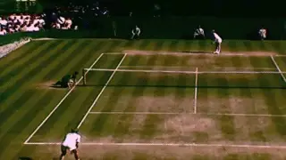
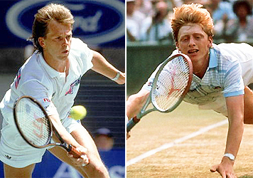
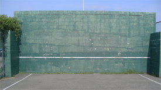
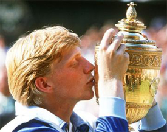
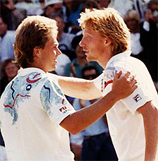

# The Inspiration to Serve and Volley

### Kyle LaCroix 

**In 1990, Stefan Edberg and Boris Becker contested the Wimbledon final
with Edberg winning in 5 sets.**

What first inspired you to become a tennis player? Not long ago, I asked
that question to a group of young teaching professionals at a coaching
conference where I was presenting.

Many mentioned famous players such as Pete Sampras or Andre Agassi, or
Roger Federer. One named James Blake. Others named less famous players
with names like "My Mother or "My Father."

As I pondered the responses my thoughts went back to my own first
inspiration from a different era when matches were won and lost at the
net.

I had played tennis a few times as a kid leading up to 1992, since every
residential development in the suburbs of Tampa where I grew up had
tennis courts. Then on a random summer day in late June, the family TV
happened to be tuned to Wimbledon.

During a rain delay, the network showed highlights from a match two
years earlier, the Gentleman's Singles Final between Stefan Edberg and
Boris Becker.

I was 10 years old at the time and I had never really sat down to watch
a tennis match. Almost immediately I became fascinated by the grace and
the power of game and of these two great champions.

The white clothing contrasting with the green grass turning brown. The
sound of the ball striking on center court. The dead silence of the
English spectators during play.

**From the first time I saw them I was immediately fascinated by the
attacking styles of Edberg and Becker.**

Most of all I was fascinated by the attacking styles of Edberg and
Becker. It may sound strange but I found a symbolism that connected
powerfully to my life.

Serve and volley was an adventure. It had daring, uncertainty, drama,
triumph. All the things that seemed missing from my young life.

At the time I was working after school in my father's restaurant. Long
hours. As a kid, naturally I hated it. It was a tough business. The
margins were thin. But as the son of the owner, my Dad needed my free
labor.

So that became the metaphor. My family's restaurant was the baseline and
I wanted to attack the net. I decided that I would become a serve and
volley tennis player.

Tennis was not my first sport. That was swimming. I gained enough
recognition during my aquatic years to earn some trophies and mentions
in the local newspaper.

For a kid my age I had abnormally large feet (size 16 today). On dry
land, they could be awkward. In the water, they were marine propulsion
weapons.

But the early morning practices, constant whistle blowing, and the taste
of chlorine was not inspiring. Nor did I find inspiration in baseball
(too boring), basketball (too much yelling from coaches) or football
(too violent).

My first opponent: serving and volleying against the wall.

From that fateful day watching Wimbledon, I decided to put my heart into
tennis. I played as much tennis as I could. I watched even more on TV. I
read Tennis magazine religiously.

The joy of finding a sport I loved gave me a sense of emotional freedom
from the restaurant. When I was playing tennis, I was miles away from
dish washing or chopping and dicing vegetables.

I was completely and utterly hooked, and I knew tennis would be a part
of my life forever.

At first, I played daily matches with the hitting wall that got more and
more competitive. Recreational players would stop between sets to watch
this young kid serve and volley...against the hitting wall.

The images of Edberg's volleys were etched in his mind. But I never had
a formal tennis lesson before or during my junior career. Lessons would
have cost money, which would have meant less money to enter tournaments.

Sadly, it was money and time that were not in abundance for the LaCroix
family. We relied on work ethic, determination and sheer stubbornness.

I knew I had to do on my own. I tried to duplicate what I saw in Tennis
magazine and on TV. But I did develop one other unique training method.

**Trees surrounded the courts where I developed a unique learning
technique.**

I would ride my bike through the gates of the East Lake Woodlands
Country Club where we were not members. The club had a great tennis
facility, a very successful junior program, and a handful of widely
known coaches.

The pine trees were thick and towered over the outside of the court
fences. I couldn't get a clear look at the teaching pro or the student
but I could hear them.

So I'd crouch down next to a teaching court and just listen. I'd
listen to the sound of the ball being struck, the coach's inflection
when he spoke, the student's feedback, the laughs and the jokes.

But I was often disturbed by the shallow compliments, the clichés, and
the generic tips. Sometimes I felt my understanding the game was higher
learning the way I had on my own.

Eventually I got some wins that supported that conclusion. I beat
several players on my high school team who had trained at that
club---much to their dismay.

My game developed nicely and was gaining attention from some coaches and
fellow juniors who asked what teaching pro I was working with. My answer
usually surprised them. "No one."

My tennis grew through my endless repetition on the wall and an
obsessive willingness to play anyone and everyone. More than once I
stood up hard earned and very cute dates because I had to read the
latest issue of Tennis magazine cover to cover when it came in the mail
earlier in the day.

**Like Boris Becker, I fully planned on winning Wimbledon at age 17.**

I was a literal tennis junkie, shaking without my tennis fix every few
hours. Selling my family's furniture might have been the next step if I
felt I could have gained more knowledge.

Boris Becker had won Wimbledon at the age of 17. If the "Lion from
Leimen" could do it, so could I. I would be 17 in 1999, and I told
anyone who would listen that the Wimbledon title would be mine that
year.

I'd have a weekday afternoon match lined up with one of my teammates
from high school. After that I'd play another match with a 5.0 male
player.

**Then I'd play an evening of doubles with 60 and 70 year old
teammates and opponents, even one guy who was 84 and still loved to
play. I never turned down an invitation to fill in for ladies doubles
when the fourth didn't show.**

My ranking stayed within the Top 50 in Florida for every age group I
played in since my first tournament when I was 12 to my last when I was
18. A very respectable achievement that could have been greater if I had
the money and time to enter more events and therefore acquire more
points.

**Watching his success over the years made me feel better about a junior
loss to David Nalbandian.**

The events I did enter I always competed well in, gaining a few trophies
along the way and fueling my fire for learning more and traveling to
bigger events.

In junior tournaments I could impose my will against many players.
Against the elite Florida juniors I was sometimes target practice.

But I told myself that Stefan Edberg would be happy with my efforts.
Like Edberg himself, I would clap for a great passing shot by my
opponent.

But as I played serve and volley against more and more top juniors,
especially the robotic baseline grinders from the academies, I gradually
came to the conclusion I was probably never going to win Wimbledon at
17.

That point was driven home in a match I played as a warm up to famed
Eddie Herr tournament in Southern Florida. For the first time ever, I
was beaten 6-0, 6-0.

I couldn't believe it. Despite my Edberg like volleys with Becker like
confidence, I got double bageled. My opponent was half my size but
seemed twice as strong and infinitely more polished.

He was a blond kid from South America named David Nalbandian. Over time,
as he went on to beat a few other players on the big tour, I began to
feel better about that loss.

From that point I knew Wimbledon was likely to be a tough ask. But I
knew that I was going to make this game a part of my life forever.

**I still think about the first time I saw Edberg and Becker.**

The game was so freeing, magical, extraordinary. And it all happened in
a 36 feet by 78 feet area known as a tennis court.

I never did receive that Wimbledon trophy at 17, but my game was good
enough to earn me a spot on my college team. The courts at the indoor
facility in Michigan were lightning fast and perfectly suited to my
game, a different world from the humid clay courts of Florida.

I loved playing in college. But all along I knew a greater calling --
teaching the game. Funny how the kid who insisted on learning without a
tennis coach always wanted to become one.

I still think about Edberg and Becker and how a big moment in their
careers was the impetus for the rest of my life. As a tennis teaching
professional today at a private club, I often imagine a young junior
hiding in the trees and hedges next to my courts. I try to make sure
every word I say to my students means something, for fear that I'm
cheating that driven child so hungry to learn.

Kyle LaCroix is a USPTA and PTR Certified Professional as well as
receiving his United States Center For Coaching Excellence (USCCE)
Certification. He has been a featured speaking at numerous Industry
Conferences.

Kyle has experience working with ATP/WTA and NCAA collegiate players at
each level of their competitive careers and at every stage of their
professional and personal development. He is recognized throughout the
industry as a reliable, hardworking, genuine presence. Kyle utilizes
great people skills and is an exceptional communicator. He understands
the important roles and responsibilities that federations, coaches and
players carry with them on a daily basis.

He holds an MBA from the University of Michigan and a M.Ed in
Educational Leadership from Stanford University

To find out more please visit
[setsconsult.org](https://setsconsult.org/) 
