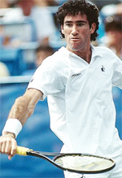
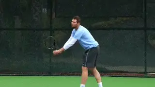
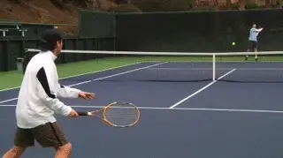
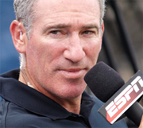
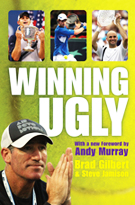

# The Set-up Point

### Brad Gilbert

**What's the Set Up point? Learn the secret directly from Brad.**

For some pros (the ones not making any money) and most recreational
players there are two kinds of points: ad points and all the rest.
Wrong.

I treat the point that can get me or my opponent to an ad point as a
major moment because it offers a major reward. That reward is the
opportunity to win (or convert) a game.

**I call any point that precedes an ad point a Set-up
Point.** The point played at love-30, 30-love,
15-30, 30-15, 30-30, and deuce are all Set-up Points for one or both
players.

When I'm looking at one of those scores, bells are ringing inside me,
especially at 30-30 (or at deuce) when we both have a chance to step up
and get to an ad point. Those are the points that really get the juices
going.

Each one is a big swing because it decides who gets a chance to cash in
on the game. And if the set or match comes with winning that game the
Set-up Point's value is multiplied (I think of those moments as Super
Set-up Points).

If I win a Set-up Point at 30-30 or deuce, I'm only one point away from
winning the game. My opponent is three points away. A big difference. If
I win a point at 30-15 (to go up 40-15) the spread is ever bigger.

Psychologically it's all positive. **Winning a set up point allows me
to move into a strong position mentally whether I'm serving or
receiving.**

Often at the club level if your opponent is serving and you win your
Set-up Point (moving to ad out) it may be all you need to do. A double
fault can give you the game.

**Winning enough Set-up points in your return game creates pressure that
can lead to opponent double faults.**

I know if I get enough ad points opportunities (while limiting those of
my opponent) I'll probably win the match. And the Set-up Point is where
those opportunities are created.

In baseball you can't get a hit until you come up to the plate with a
bat in your hands. In tennis you can't win a game without a convert
opportunity. The Set-up Point can give you the chance to come up to the
plate (or to keep your opponent from doing so). It's very important and
it gets my respect.

What's best about Set-up points at the club level is that your opponent
is usually unaware of the weight they carry. They tend to play a Set-up
point just like any other point, without a great deal of thought or
focus.

30-15 just doesn't get their attention, 30-30 doesn't alert them.
Their wake-up call is the ad point, not the point preceding it, the
Set-up Point.

The Set-up point is when you make sure your mind is focused, your body
prepared, and your plan is in place. It's when you can catch them
unaware.

**Rule 1**

The Set-up point gets you up to the plate when it counts.

When a Set-up Point arrives (either for me or the other player) I pay
attention. The primary goal I have in mind is this: Get it in or get it
back!

That means if I'm serving, I want to get the ball in. If I'm
receiving, I want to get the ball back, and preferably to a spot that
forces my opponent to hit a weaker shot.

And it's even more important at 30-30 or deuce. These points require
more caution. Or, to put it another way, they require less casualness or
carelessness.

Serving at 40-love you might want to try busting one in, going for your
annual ace. If you're receiving, may be you'll try a spectacular
return. Not at 30-30 or deuce. Let your opponent go for the glory.

Serving at 30-love the server tends to get careless because that score
feels like it's bigger than it is. Pay attention! Win that point and
you get three straight convert opportunities. Get that first serve in.
Don't double-fault.

What's surprising is how often club players will double-fault or
carelessly slam a service return long or into the net on a Set-up Point.
They've just given their opponent a convert opportunity (or denied it
to themselves) free of charge because they didn't understand the
significance of the point and what it can mean to the dynamics of the
match.

**That's unintelligent tennis.**

**Rule 2**

Once the point is under way, be sensible. Don't get fancy. Don't get
brilliant. No stupid errors.

**Let your opponent go for the glory trying unrealistic shots.**

It's amazing how often recreational players will try for the "miracle
shot" in the middle of a rally when neither player has any advantage.
That may be okay with a big lead, although even then I dislike seeing it
and absolutely hate doing it.

At crucial moments a risky shot is a sign of a player who doesn't
understand the game. Let your opponent play brain-dead when it counts.

This doesn't mean you should play patty cake tennis. It means you
should manage your shots, avoiding low-percentage shots that carry
unnecessary risk at inappropriate times.

Pressure Paralyzes

Winning the Set-up Point can create pressure. All players are most tense
when something is at risk. Losing that Set-up Point can put your game,
set, or match at risk.

Pressure will be layered on your strokes and confidence, and to some
degree pressure paralyzes most recreational players. Recognizing the
importance of winning a Set-up Point and approaching it correctly will
consistently keep pressure off you and place it on your opponent.

Brad Gilbert is widely recognized as one of the top coaching minds, as
well as one of the most direct and insightful television commentators in
tennis. As a coach Brad has worked with numerous elite pro players
including Grand Slam champions Andre Agassi, Andy Roddick, and Andy
Murray. Ranked in the world top 5 in his playing career, Brad had wins
over legendary champions including Boris Becker and John McEnroe and won
20 ATP titles. Brad is also the owner of Tennis Nation, one of the top
tennis pro shops in the country for the true enthusiast, located in San
Rafael, California.

**Brad Gilbert: Winning Ugly**

Brad Gilbert's Winning Ugly is one of the most highly regarded and
valuable tennis books ever written. Covering the strategic and mental
realities of competitive play from the tour to the club level, Winning
Ugly is packed with Brad's original insights about how matches are
really won, and strategies any player can apply to dramatically improve
their match results. A classic, must read for all tennis players,
Winning Ugly is now available as an ebook, an audio book, as well as in
the second print edition with a new forward by Andy Murray.

[ to
Order!](https://www.amazon.com/Winning-Ugly-Brad-Gilbert/dp/1847390579/ref=sr_1_2?ie=UTF8&qid=1372444229&sr=8-2&keywords=winning+ugly+new+edition)
