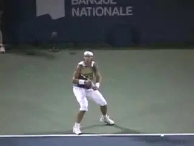
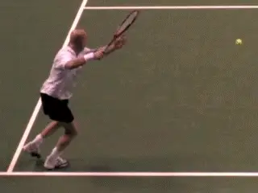
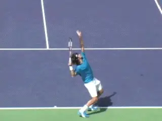
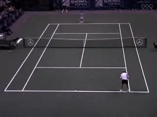
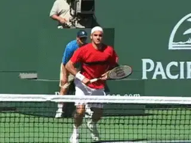
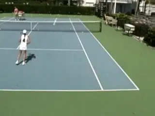
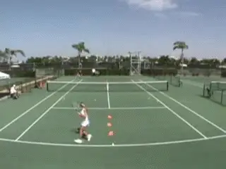
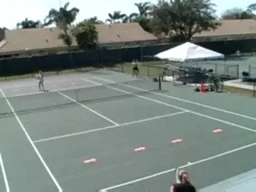
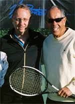

# The Strategy Zone:

### Groundstroke Finishes

### Nick Bollettierri with Lance Luciani

**The top players make up their minds and then finish. But how?**

The final component in the Strategy Zone system is called "Finish."
How do you hit winners in match play against a wide variety of
opponents?

I've been very fortunate to work with many of the best players in the
world. Andre Agassi, Monica Seles, Venus Williams, Serena Williams,
Tommy Haas, and Maria Sharapova, among many others. These players know
when to finish. They make up their mind, and that's it. But how do they
know when to and how do they execute> Those are the key questions.

**3 Components**

In previous articles we've looked at how to establish the first two
components of winning strategy "Control" and "Hurt." You can learn
to create Control with your groundstrokes, with your return, and with
your serve. ([link](The%20Strategy%20Zone%20-%20Introduction.docx).)

Control leads directly to Hurt. Hurt means learning how to hit various
shot combinations once you are in control of the point, shot
combinations that punish your opponent and/or keep him on the run.

**Agassi demonstrates a simple change of direction to Finish.**

**These first two steps--Control and Hurt--set you up to Finish. You
can't jump over the steps.** I can't stress too
strongly that for top players, winners are part of a sequence that you
build over the course of the point.

**The goal is not to hit a highlight winner. The goal is to use a
pattern to illicit a weak reply.** The goal to
generate that golden opportunity all good players live for: the short
ball, and the chance to hit it into the open court for a winner.

**The goal of the Finish shot is to hit a winner, but a well-placed
Finish shot may also force the opponent to make an
error.** **But whichever, these finishing shots
don't occur randomly. The key point to understand is that they are the
outcome of a strategic pattern or process.**

At the Academy we work on hitting the finishing or put away shot
everyday. But your understanding of the Control and Hurt phases is what
leads to better choices about when to hit the winning shot.

**Federer hits a wide serve, then moves forward to finish.**

**[[Top players hit a high percentages of winners, and/or shots that
force errors. When] [these shots are totaled, they substantially
exceed the number of unforced errors.] [They can do this because
they know how to work patterns based on their own
capabilities.]]**

Roger Federer for example, hits a wide serve and then moves quickly
forward to hit the finish shot into the open court. Andre Agassi hurts
the opponent with a drive to the open court, then changes direction for
the winning Finish shot.

Both players make the process look effortless because they have mastered
the Control and Hurt Phases. That's what we want to help you do as
well. Build the point, and create you own unique patterns.

In this article we'll start by exploring the basic finishing shots off
the ground. In upcoming articles, we'll also look at the various
finishing strategies at the net.

**A drive to the open court court and a change of direction to finish.**

**Success Factors**

**The success of the groundstroke finishes depends on many factors,
including ball recognition, footwork and spin.**

**A fundamental problem at the lower levels of play is ball
recognition. Most players only recognize the oncoming shot at the time
it bounces on their side of the court. Then they react. The failure to
recognize opportunities prevents them from hitting winners that would
otherwise be possible and routine.**

**Higher level players recognize the oncoming shot as it comes off the
opponent's racket. But at the top levels of the game, it's a different
world.** **Top players actually base their
movement and preparation on how well they hit the previous ball. They
choose the correct shot instinctively and without hesitation based on
their sense of what is about to happen.**

A second factor in finishing points is footwork. Tenniplayer contributor
David Bailey has done a brilliant job in analyzing for the first timeall
the various combinations of aggressive footwork used by pro players.
[link](../Footwork/Footwork%20TOC.docx) You can get more
details on the specific patterns in his articles.

**Instant recognition, explosive forward movement, and a forehand
finish.**

**Top players recognize what shot they need to hit, move to the ball,
and execute the footwork and shot patterns they need to finish the
point.** **A key to this is to the ability to get
up inside the court very quickly when they recognize the short
ball.** **The first step has to be explosive and
timed to begin as soon as the player reads the oncoming
shot.**

**Speed and Spin**

**The third factor in successful finishing shots is
spin.** **All groundstrokes are hit with a
balance of pace and spin. What combination of pace and spin is ideal in
a particular finishing shot? Great players understand how to mix these
two factors.**

**If the opponent is clearly out of position and the court is open,
the player can finish with a controlled amount of pace and a higher spin
component.** **When the opponent is in the
process of recovering closer to a good neutral position, it's a
different situation.**

**Now you have a smaller target area to hit into in order to finish.
Great players sense this and hit with more pace and less spin in order
to make sure the winner really gets past the
opponent.**

**[[But the main point for players at lower levels is this].
[If you are effective in the first two phases, you don't necessarily
have to hit the ball hard to finish.]]** **The
first two phases are designed to illicit a weak reply so that we can hit
the Finish shot into a large target area when possible. Placement is
actually much more important than power.**

**Test your basic ability to hit finishing shots to the target areas.**

**The Test**

**In order to learn to finish, you must develop the ability to take
short balls and hit them into target areas with accuracy and
consistency.** **But, as we saw with the basic
patterns in the Control and Hurt phase, most players have surprising
difficulty hitting these basic placements with any
consistency.**

**In general players obsess over the minutiae of stroke technique at
the expense of the geometric construction of winning
points.** **This may sound harsh but it's true.
Unless you can effectively hit the patterns outlined in this series, all
the information you believe you have mastered about technique is has
very little value--at least if you goal is to win
matches.**

The animation shows the drills you should use to evaluate the current
state of your accuracy in the Finish phase. Can you move up into the
court and hit accurately down the line? On the forehand side? On the
backhand? Can you do the same thing hitting crosscourt? How about
hitting inside out and inside in? Can you do it in high balls? Low
Balls?

Set up and targets and test yourself by seeing how many times you can
hit the target areas out of 5 balls, or 10 balls. Do it for all the
shots and variations above. if you want to win points you should be able
very comfortable hitting the targets 8 of 10 times on a regular basis.

**Finishing shots off the ground come when half the court is open.**

**Half Court Finish**

Now let's look at two other drills that help players learn how to
execute the basic groundstroke finish. We've said that when players
establish control and then are able to hurt the opponent, they create a
large target area to finish.

**The reality is this. If you watch pro players you'll see that they
can only finish successfully when they have half a court to hit
into.** **This means the opponent has been pushed
far enough out of position that they cannot recover to a neutral
position near the center of the court.**

The first drill helps you feel when you have that target area and allows
you to practice finishing into it. As the animation shows, you divide
the court down the middle with arrows or cones.

Now play out backcourt points and work to get the player wide and off
the court to either side. The key to finishing in this drill is to only
attempt the winner when you have half the court to hit into. If your
opponent can recover close to the middle, you continue to work to open
the court.

**Too many players are mesmerized by the spectacular highlight
winners. What you are really looking for is a weak reply, usually a
short ball, that allows you to strike the finishing shot when half the
court is open.** **Finishing into large target
areas of the open court is the bread and butter for winning point after
point at all levels, and ultimately, winning
matches.**

**To finish on the short ball, the player needs to come forward into the
court at least halfway between the baseline and the service line.**

**Depth Drill**

A second live ball drill to work on this is to place the arrows or cones
across the court roughly halfway between the service line and the
baseline. This drill helps the player feel when to actually attempt a
winner. Basically you should not attempt to finish until you can move
forward and end up inside of the line.

**Again, players confuse power with winning points and typically try
far too many low percentage winners from positions that are too deep in
the court.** This game teaches you to associate the
finishing shot with a ball on which you can come forward.

So that's it for the basics of groundstroke finishes. There are many,
many patterns that can lead to winners off the ground. Just remember
that they are set up by your ability to control the point, and open the
court.

Next we'll start to look at the other possible Finish combinations at
the net, including the swinging volleys.

                                                                                                                                                           Seles, Andre Agassi, Jim Courier, and Maria
Sharapova. Nick is the creator of the tennis
academy concept and has watched his vision grow
for over 30 years into the world's premier
tennis training ground at IMG Bollettieri in
Bradenton, Florida. Over the years Nick has
collaborated with many of the leading innovators
in coaching, introducing and incorporating their
concepts into training programs at the Academy.\
\
Lance Luciani (left), the founder of Strategy
Zone, is one of the world's leading analysts of
statistics and strategy, and the Head of
Strategy and Tactics at IMG/Bollettieri
Academies. Lance was a pioneer in the video
analysis of match play at all levels of the
game. At the Academy he has created the cutting
edge system used by players to study the
patterns of their points from real time play.
This system is revolutionizing how competitors
develop and improve their strategic style.
