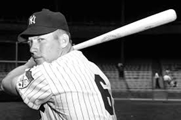
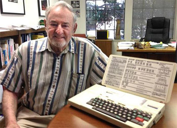
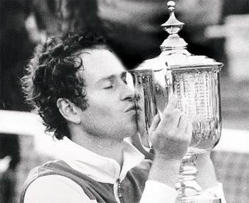
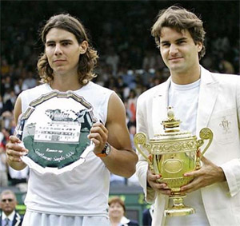
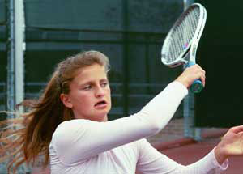
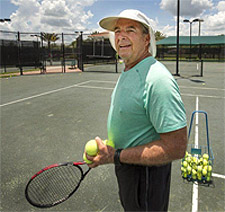

# Using Statistics in Coaching Part 1

### Andy Durham

**What didn't Mickey Mantle understand about baseball?**

Over the last 70 years, statistics have exploded in sports at all
levels--in high school, in college and especially in professional
sports. Where would baseball, the NFL, all the other sports leagues, and
the pro golf tours be without all the data they collect?

In tennis we have Roger Federer, Novak Djokovic, Alexander Zverev, Andy
Murray and many WTA players paying companies like Tennis Analytics,
Golden Set Analytics, or Craig O'Shannessy, and others to study both
their own and their opponent's statistics.

Data collection can be important for every level of athlete no matter
what sport. As Mickey Mantle once said about baseball when he began to
learn about statistics: "It's unbelievable how much you don't know
about a game you've played all your life."

**The Same Page**

Parents, players and coaches can all benefit if statistics put them all
on the same page. Statistics should not dominate the conversation but
can quantify it. This way the whole team has solid data to help make
decisions.

**Statistics in junior tennis can put the whole team on the same page.**

But most young athletes do not have access to these expensive data
services. Many coaches use past experiences that were successful to mold
students. But how do we really know that the player is maximizing
improvement?

Early on in an athlete's career, it is more important than ever to make
sure that they are on a path to succeed. Data collection can support
decisions regarding strokes, tactics, and fitness.

Data collection can give the player an understanding of their strengths
and weaknesses based on objective information rather than opinion, which
makes it easier for players to accept. It puts the player, parents and
coach on the same page.

The team can immediately see if a change is working. It takes
indecisiveness out of shot selection. The team can measure long term
trends in the player's game. It improves communication in the team.
Furthermore scouting with statistics eliminates hunches and guessing
about opponents. Everyone learns why a player wins or loses a specific
match.

**The History**

Let's take a look at the history of data collection in tennis. Then I
will introduce a new app I have created that can allow any player and
coach at any level to develop a statistical picture, either for free or
a more detailed picture for minimal additional cost.

**Bill Jacobson with the original CompuTennis scoring computer.**

I know that John Yandell has believed in the use of statistics for many
years, so I want to thank him for allowing me to talk about the subject
and to introduce my new app on Tennisplayer. We'll also talk about what
his match charting showed in pro tennis and junior tennis.

In tennis the beginning of the statistics revolution goes back to a
gentleman named Bruce S. Old and his work after World War II. Old, an
avid player and scientist, would bring huge notebooks to tennis matches
and chart every shot of every point to figure out the best way to play,
eventually teaming up with Bill Talbert to write books on singles and
doubles tactics. ([link](https://www.amazon.com/Tennis-Singles-Doubles-Production-3/dp/B009QHXGJK/ref=sr_1_1?dchild=1&keywords=William+Talbert+Bruce+Old&qid=1602974497&sr=8-1).)

Old was meticulous about keeping track of shots and after the match,
dove into the statistics that those lines on paper produced. He was
actively accumulating match information by hand from 1950 until 1980
after which he sat back and enjoyed watching the game and his favorite
player, Roger Federer.

**CompuTennis**

Soon after Old retired, a South African tennis player turned geophysical
engineer, Bill Jacobson, started hand charting his son's tennis game.
The advent of portable computers was just coming about and he designed a
four pound laptop to allow a scorer to enter key match information. He
founded a company based on this new technology and named it CompuTennis.

**CompuTennis tracked every John McEnroe match when he won the U.S. Open
in 1984.**

Eventually top players, colleges, tennis associations, and coaches
started using Bill's information. Dennis Ralston and John Newcombe,
among others, used CompuTennis in coaching to evaluate players'
strengths and weaknesses.

In August 1983, for the first time, live match data was fed online to a
TV booth at the Bay Area pro tour event for the commentators to use in
matches for players including Jimmy Connors, John McEnroe and Ivan
Lendl. Thereafter Volvo Grand Prix statistician, Ross Schneiderman used
CompuTennis at every Grand Prix event.

Eventually all the TV networks began feeding commentators these
statistical insights from CompuTennis. They eventually became the stats
that most of us see on TV, used universally by the WTA and ATP.

In 1984, NBC used CompuTennis to score the French Open and Wimbledon for
TV. Arthur Ashe used CompuTennis with his Davis Cup team. All of John
McEnroe's matches were charted at the U.S. Open the same year.

At this point the number of tennis players using CompuTennis passed the
1000 mark. Starting in 1985 the TV networks used CompuTennis for 4
straight years at the French Open and at Wimbledon. Colleges such as
Stanford, USC and Pepperdine followed suit.

**Aggressive Margin**

In that same year Bill developed a concept he called the Aggressive
Margin. For each player this was the combination of winners and forced
errors less unforced errors.

**How did Federer really win the historic 2006 Wimbledon final?**

By adding this critical statistic of Forced Errors, the Aggressive
Margin made sense of sometimes confusing pro statistics. In many
matches, the winning player could hit more winners, have fewer unforced
errors, and still lose.

Why? Because the match winner may have elicited more forced errors from
opponents---errors caused by pressure of various sorts. If a player can
force his opponent into an error, that forced error, obviously, counts
the same as a winner in terms of the total points won.

In a series of Tennisplayer articles, Yandell showed how the forced
error was the key to understanding several historic finals played
between Roger Federer and Rafael Nadal.

To give one example: the 2006 Wimbledon final. ([link](https://www.tennisplayer.net/members/strategy/john_yandell/how_roger_federer_won_wimbledon_2006/how_roger_federer_won_wimbledon_2006.html).)
This match was won by Federer in 4 sets. What did the statistics show?
Federer had 43 winners. Nadal made 29 unforced errors. That accounts for
72 points Federer won.

Nadal in comparison hit 42 winners while Federer made 33 unforced
errors. That totals 75 points for Nadal, 3 more than Fed. From that you
might conclude Rafa was the winner.

So how did Roger win in 4 sets? Forced Errors. Nadal pressured Federer
into 38 forced errors. But Roger pressured Rafa into 61 unforced errors.
That's a huge 23 point difference.

This difference is the key to understanding the match. When you add in
the forced errors, Federer actually won a total of 133 points---20 more
total points than Nadal.

**Statistics are important or more important at all levels below pro
tennis.**

If we look at the Aggressive Margin for the match, adding together
winners and forced errors and then subtracting unforced errors, Roger's
Aggressive Margin for the match was +71. Rafa's was +51.

This explains the 20 point difference. Without knowing the unforced
errors and how that affected the Aggressive Margin, the results based on
statistics can be incomplete and puzzling.

To this day, television statistics don't reflect forced errors. Craig
O'Shannessy recently published a piece on Tennisplayer about the
importance of this overlooked statistic. ([link](https://www.tennisplayer.net/members/strategy/craig_o_shannessy/forced_error/).)

That compliments the article by John published several years previously.
([link](https://www.tennisplayer.net/members/strategy/john_yandell/understanding_statistics/Yandell_Statistics_Forced_Error_images/Yandell_Statistics_Forced_Error.html).)
Another article by John breaks down the Aggressive Margin stroke by
stroke in the classic 2001 U.S. Open final between Pete Sampras and
Andre Agassi. ([link](https://www.tennisplayer.net/members/strategy/john_yandell/understanding_statistics/Yandell_Aggressive_Margin_images/Yandell_Aggressive_Margin.html).)

But the Aggressive Margin isn't just a statistic that's relevant in
pro matches. It's as important, if not more important at all lower
levels, where players are often clueless about how they win and lose
points. In a final article in his series on statistics, John showed this
by breaking down matches won and lost for a top player on his high
school team in San Francisco. ([link](https://www.tennisplayer.net/members/strategy/john_yandell/understanding_statistics/Yandell_Going_Insiede_Matches_images/Yandell_Going_Insiede_Matches.html).)

**CompuTennis Continued**

Living in England at the time I showed teaching pros how to use Bill's
CompuTennis scoring system, and worked personally with many players at
all levels, including a player named Sara Gomer, helping her to reach #2
in the United Kingdom.

**In 2015 Bill Jacobson's contributions were recognized when he was
voted in the USTA Norcal Hall of Fame.**

At about this time, Bill had gotten contracts to do TV stats for
Wimbledon and asked me to assemble a team of scorers to handle the
event. Imagine eating strawberries and creme while scoring matches!

The scoring took place in portacabins on site with video links to the
courts we were scoring. We sat with a monitor and charted each match
that the network was covering, then sent data to commentators including
Arthur Ashe and Barry MacKay.

That deal lasted for 4 years. In 1991, IBM, now a major TV sponsor,
looked at CompuTennis and some competitors to continue doing stats at
the Grand Slam tournaments. But for reasons that weren't clear, IBM
didn't choose to continue with Bill and instead IBM ended up doing a
deal with one of Bill's scorers, Leo Levin, who incorrectly claimed to
be the father of modern tennis statistics.

CompuTennis ended up closing in the mid 90s, and Bill Jacobson began
focusing on his business in commercial real estate. Today few people
remember Bill and the incredible innovations he brought to the sport. In
2015, however, Bill was inducted into the USTA Norcal Hall of Fame, at
least some recognition for his incredible contribution to understanding
the game.

The inspiration for my work is to carry on the revolution Bill Jacobson
started and to help players at all levels benefit from the same
information used by the world's best players. To do this I have created
an app called RacketStats, with both a free and a paid version. ([link](https://racketstats.com/).)

To show how RacketStats works, next month I will present and analyze the
statistics from the recent French Open women's final between Sofia
Kenin and Iga Swiatek. I will also explain how this kind of analysis can
apply to all the other levels.

Andy Durham is the founder of RacketStats.com, an app allowing parents,
players and coaches an easy system to chart and get access to vital
statistics. He is a member of the USPTA, PTR and has been teaching for
48 years, many of his students rising to college, WTA and ATP levels.
Currently he is the Director of Tennis at the Cindy Hummel Tennis Center
in Auburndale, Florida. You can reach Andy at <info@racketstats.com>
