# Wimbledon 2008: A Different Story

### John Yandell

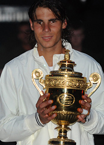

**What story did the numbers tell about the outcome of this match?**

So after about 7 and a half hours, Roger and Rafa started the decisive
fifth set in the 2008 Wimbledon final. At that point, the total number
of points won by both players was exactly even: 151 points each.

They say that statistics tell the story, but which statistics and what
story? No one knew at that point that the 5th set would go 9-7. Or that
they would play over a hundred tense and sometimes brilliant points.

We know Rafa won, but how close was it really in that fifth set? In 16
games, Nadal won 58 points and Roger won 53. That's a 5-point
difference. So, about every 3 games in that fifth set, Rafa won one more
point than Roger. One more point every 3 games. That was the difference.

They say that "big points" determine matches. And it's hard to argue
that because we have all seen dramatic turning points and how a tight
match can shift on one shot. But what determines who wins the big
points?

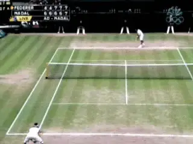

**Unforced errors--yes, but what else determined this match?**

In virtually every match I've ever charted from Grand Slam finals down
to 4.0 club matches consider this. The player who won the most total
points won the match. Yes, you can find turning points. But every
individual point you win or lose counts in the physical, and especially,
the emotional battle, in a closely contested match. In my opinion, it's
usually the cumulative effect of all those individual points that leads
to the key moments that turn matches.

The 2008 Wimbledon final may or may not have been the greatest pro match
of all time--more on that later--but in that respect it wasn't any
different than the hundreds of other matches I've charted. The player
who won the most total points won the match. In the end Federer and
Nadal played 413 points. Rafa won 209 and Roger won 204.

**How Many Points Won How?**

So, if Nadal won 209 points, and Federer won 204, the next question is
how? Winners and unforced errors, right? Or is that wrong? If you try
explaining the match in terms of the official statistics on the
Wimbledon site or in the New York Times, you might come away thinking
you got the winner wrong.

This is what the "official" stat line showed. Nadal hit 66 winners.
Federer made 54 unforced errors. So, add those together that's 120
points for Nadal.

Federer hit 114 winners. Nadal made 30 unforced errors. So that's 144
points for Roger. So according to those numbers, Roger won 24 more
points. If you were the only tennis fan on the planet who didn't know
the outcome and someone showed you these numbers, who would you say won?

|  | Roger's Points | Rafael's Points |
| --- | --- | --- |
| Player's Own Winners | 114 | 66 |
| Opponent's Unforced Errors | 30 | 54 |
| Total | 144 | 120 |
| Do These Numbers Make Sense? |  |  |

So, the so-called key statistics of winners and unforced errors don't
square with the point totals. Nadal won 209 total points. 120 of them
are reflected in the stat line. What about the other 89 points--almost
a third of his total? How did he win those? Roger won 204 points, and
only 144 are accounted for by official statistics. What about his other
60 points?

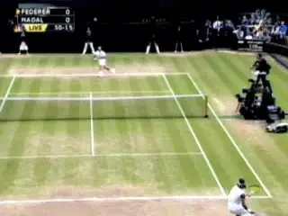

**How could Roger hit 50 more winners and still lose the match?**

**The Unknown Statistic--Again**

If you've read my previous articles on match statistics, you already
know where I am going with all this. Right to the undisclosed gray area
in official match numbers, what I've called the "Unknown Statistic."
And that's the Forced Error.

Forced errors are what explain the discrepancies. A forced error is a
shot hit by either player that creates enough pressure to draw a mistake
from the opponent. This is different than an unforced error on a routine
ball. ([link](The%20Unknown%20Statistics%20-The%20Forced%20Error.docx).)

Forced Errors, unfortunately, aren't in the Wimbledon stat sheets, or
any tour stat sheets. But forced errors accounted for 149 points in the
Wimbledon final. Think about it, 149 points that aren't really
explained. That's almost 40% of the total points played in this match.
And that isn't unusual. Forced errors play a similar role in all pro
matches and matches at every other level. When you add in the forced
errors, now you can see how Nadal won more total points.

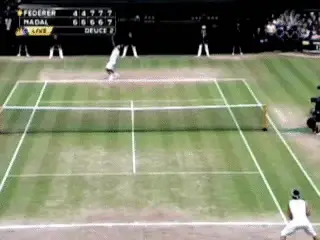

**Forced errors: one key to understanding Nadal's victory.**

So, understanding them is critical in understanding why Nadal won
Wimbledon in 2008. Not to mention understanding how and why you win or
lose matches yourself. I've written about this extensively on the site,
but if you don't already know about forced errors, this could be new
and amazing information.

The problem is that to determine the actual forced errors, someone has
to go back and rechart the whole 5 sets. And yes, that lucky person is
me. And yes, it does take a lot longer than just watching the match the
first time, pondering all those gray areas.

And one more thing, it can also lead to some discrepancies with the
"official" statistics. Why? Because the difference between a forced
error and an unforced error is often a matter of judgment. So, in
charting this match, I had to decide these often subtle differences on
dozens and dozens of points.

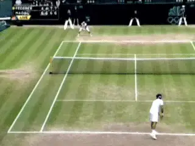

**How would you score this point? I say a Forced Error.**

**You Decide**

Take the amazing first point of the fifth set as an example and decide
what you think. Federer hit a routine second serve to Nadal's backhand
and Nadal hit a short return down the middle. Federer hit a short
crosscourt forehand and Nadal jumped on it and unleashed a flat, high
velocity, short angled crosscourt backhand. Amazingly, Federer caught up
to the ball, and on the dead run hit a hard forehand deep down the
middle to Nadal's backhand that looked like it clipped the line. Nadal
may have gotten a weird bounce, barely got around on his swing, and hit
a high, looping moonball to Federer's backhand.

They traded backhands down the line, and then Federer miss hit a second
down the line backhand that landed inside the service box. Nadal covered
it easily and hit a drop shot. Roger made it to the ball and, with the
players standing less than 10 feet apart, tried to lift a touch lob over
Nadal's head. Moving back, Nadal easily got his racket on the ball, but
hit a backhand overhead a foot wide to Roger's left.

How do you score that one? Nadal could have put that ball somewhere in
the court for sure but Federer was standing right there, so he tried to
thread the needle behind Federer by going back down the line, and he
missed. I say in the context of that point, that's a Forced Error.

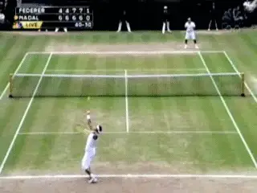

**Two returns. I called the first one unforced and the second forced.**

**What About These Returns?**

Here are two other examples. In the second game of the fifth set,
Federer made two forehand return errors on second serves in the ad
court. In the first one, he tried to get around the ball but Rafa hit
the serve well to his backhand side.

The ball was tougher than Federer expected, and it got on top of him
just slightly and he missed. That one I called a Forced Error.

But on the second forehand return, Rafa hit a second serve that was
closer to the middle of the box. Roger easily got around this one, but
he over hit the ball a couple of feet long. That one I called an
Unforced Error. Decide for yourself, but you get the idea about the gray
area.

My overall numbers, because of these types of judgments, turned out a
little different than the official stat sheet. For one thing I was
harder on Roger on his unforced errors. But interestingly my Forced
Error total was still pretty close to the unaccounted points in the
official statistics. Remember there were 149 points unaccounted in the
official stats. Presumably these were all Forced Errors. The number I
came up with by actual count was 159 Forced Errors. So that's a few
more than the official stats, but it makes sense that the number was in
that ballpark. If anything it might show forced errors were even more
important in this match than the holes in the official stats show.

|  | Roger's Points | Rafael's Points |
| --- | --- | --- |
| Player's Own Winners | 91 | 58 |
| Player's Forced Errors | 81 | 78 |
| Opponent's Unforced Errors | 32 | 73 |
| Total | 204 | 209 |
| When I charted the entire match with the forced errors, it looked like this. |  |  |

So now the statistics finally make sense. Roger had almost as many
forced errors as winners--obviously the forced errors he was able to
generate were huge for him. But they were even bigger for Nadal. Nadal
had significantly fewer winners than Federer, but almost exactly the
same number of forced errors. And for the purposes of judging aggressive
play (as we'll see below)--not to mention winning matches--a forced
error is as good as a winner. Nadal hit only 58 winners, but his
whopping 78 forced errors showed how many points he really won through
aggressive play.

And yeah, then there's that other category with the most discrepancy
between the players: the unforced errors. Roger made 73 unforced errors
by my count, which was quite a few more than in the official stats. This
was 32 more unforced errors than Nadal. Obviously, this was also
critical and more on that toward the end.

OK but what did all these numbers mean in the context of this really
long match with all these complex points and swings? Here is what I
think the numbers actually showed about this titantic, heart wrenching
match, set by set.

But first a brief and possibly equally critical psychological interlude.

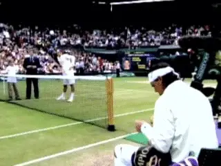

**Rafa controlled the tempo of the match beginning with the coin flip.**

**Psych Interlude**

If you have read the previous articles I've written on the
confrontations between these very different players, you know that Nadal
has continually used subtle (or sometimes not so subtle) gamesmanship to
try to intimidate Roger. You also know that I think that at times it
appears to have worked, but at other times Roger seems to have
successfully countered it with his own psychological strategies. ([link](http://www.tennisplayer.net/members/notes_on_tour/john_yandell/wimby_2007/wimby_2007.html).)
Part of this back and forth is stuff that happens before the matches
start.

Guess what? This year at Wimbledon was no different. Did you see the
coin flip? Although I had it on DVR, I didn't pay attention to it until
my friend the Sports Illustrated writer Jon Wertheim pointed it out to
me. He'd read what I had written about other Nadal pre-match
tactics--and I have to thank him for pointing out something equally
significant I missed the first time around.

When I looked at the coin flip again, I amazed to see what happened.
With a very excited young kid out there to flip the coin, and with the
umpire and Roger both already out there, Rafa made everyone wait. This
kid was waiting for his moment in history and so were the umpire and
defending champion.

And where was Rafa? Instead of going out there with everyone else, he
sat down, had some water, then calmly ate part of an energy bar. Then he
took the time to arrange his water bottles. Then he took off his warmup
jacket and folded it very carefully. Finally, he joined them at the net.
So Rafa made the kid, the umpire and Federer--and the 15,000 fans and
the international TV audience--all wait for over a minute. That's
pretty much an eternity--not to mention the price of that minute of
network time he monopolized.

If you were Roger would have that pissed you off? You have to think yes.
Did it affect anything that happened in the first two sets or the match
in general? Who knows? But it's definitely part of the whole Nadal
mystique. The guy was determined (that's too mild a word) to control
the tempo of this match, starting from the coin flip, and he succeeded.
Long term, I think his control of tempo had an impact.

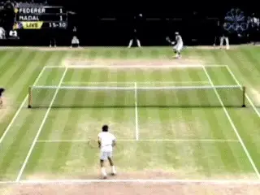

**Roger started out hitting some confident forehands.**

**1st Set**

Ok, let me confess right from the start that I'm a huge Federer fan and
I wanted him to have this record and so I was looking for signs of hope
right from the start of the match. And there were some. Despite a huge
Nadal forehand winner on the first point, Roger held easily in the first
game and was already hitting some confident, dominating forehands of his
own.

And then in Rafa's first service game. I was further encouraged when
Roger came forward and hit a forehand volley into the open court off a
dipping Nadal pass. Rafa held in that game, but serving at 1-1, Roger
also hit another forehand volley winner. I thought that was a good
trend.

But there was no early payoff--in fact the opposite--because at 30 all
in the next game, Roger made a backhand unforced error, then missed
another backhand on a near whiff on what was probably a bad bounce.
Bang, Nadal had the first break.

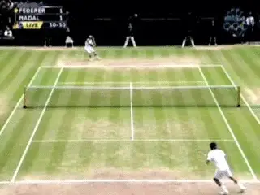

**Two missed backhands and the first break.**

And despite some tough, beautiful backcourt points on both sides in the
ensuing games, that was basically the end of the first set. Federer had
a break point in the next game, but Rafa held for 3-1.

Then when Rafa was serving for the set at 5-4, Federer played an awesome
game and got to break point twice. But Rafa fought him to a standstill
both times.

Then Roger made two more backhand errors, Nadal held and that was the
set, 6-4. And you had to wonder about those missed break points. All
that effort on Roger's part but no payoff. Would he have been better
off emotionally in the long run if Rafa had just held routinely? I
thought back to that again when they got to the fifth set.

And the numbers? There was exactly one point difference in the set. Rafa
won 34 points, Roger 33. Rafa had only 7 winners--but he created 11
forced errors. So that was key. The unknown statistic was critical as
usual. But another more obvious number also stood out. Rafa also won 11
points on unforced errors from Federer's backhand. That wasn't a good
omen for Roger fans.

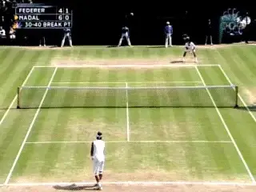

**A great passing shot and Roger had a break in the second.**

**Set 2**

Federer held to start the second, then got up 30-0 on Nadal's serve and
made it out to break point. He hit a great off balance crosscourt
forehand passing shot winner to break. It felt like that could be the
second set. In the next game, Federer started ripping forehands and
serves and held for 3-0. The next three games stayed on serve, so now
Roger was serving at 4-2.

At 15 all Roger hit a big forehand and came in and Rafa hit an amazing
running forehand pass. He just nailed the ball at Roger's feet and
forced a forehand volley error. But then Roger hit a great forehand of
his own to get to 30 all.

Then on the next point Roger hit a short inside out forehand about two
feet wide. Suddenly it was break point. Roger hit a second serve and
then hit a short backhand approach. Rafa drilled a backhand down the
line and Roger couldn't handle the high backhand volley. Suddenly it
was back on serve at 3-4.

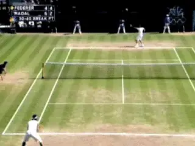

**When Rafa broke back it seemed to deflate Federer.**

Roger seemed deflated by that, but in a long next game on Nadal's
serve, he still got to break point at 30-40. In retrospect, how huge
would that have been to convert? But Nadal erased it with a first serve
down the middle.

Then Federer had a great second chance for the break but missed a
swinging forehand volley. That was brutal. A good Nadal first serve and
it was 4-4.

Roger now looked very frustrated or maybe even angry. At 0-15 he hit a
short backhand that Nadal pounded for a forehand winner. After another
Nadal backhand winner it was 0-40. They played a tough backcourt point
and Nadal hit forehand winner. Just like that Nadal had the break
advantage instead and was serving for the set.

**The Puzzle of the Slice**

What a next game. Nadal had a set point. But Roger erased it with the
hardest, lowest, slice crosscourt backhand I've ever seen him hit,
drawing an error from Nadal, who tried to hit up on that ultra low ball
with that extreme grip--but couldn't. It was gorgeous--and probably
bounced no higher than a foot off the court.

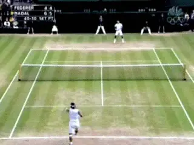

**The puzzle of the slice backhand: tremendous asset or inconsistent
liability?**

Then Roger had a break point but couldn't get it in an incredible
scrambling point for both players. At one point it loked as if Roger had
hit a forehand winner for sure--but no, it came back. Then another
Federer backhand error, and suddenly, it was 2 sets for Nadal and
looking very bleak for Federer fans.

The puzzle of the slice backhand! How may coaches and fans out there
think Roger should hit a few hundred of those against Rafa every time?
But in the end that one incredible shot didn't lead to results in the
score, because Nadal served out the game to go up two sets to zero. The
slice issue re-emerged later on though, as we'll see.

And again the numbers. In set 2 Rafa had 8 winners, but 16 forced
errors. Fully 9 were on serves Federer couldn't handle, and 6 were
forehands. Rafa won two more total points, 32 to 30 for Roger. And half
those had come on the "unknown statistic."

You could really feel how close the first two sets were, and that Roger
had been in them, and that definitely he could have or maybe even should
have won the second. But now what? Was it going to be Nadal in three?

**3rd Set**

Anyone who doubts Federer's heart is going to have a very hard time
explaining how this guy stormed back and took the next two sets.

The third set had a few potential turning points early on that didn't
materialize. Federer had break points with Nadal serving at 2-3 but
couldn't convert. Then at 3-3, Federer got down love 40 on his own
serve. But Roger got out of it with some clutch serving and a missed
forehand return from Rafa. They traded holds, but then the rain came
with Rafa serving at 4-5.

Rafa came out after the break and immediately ran it to 40-0 in the
first game after the delay, but Roger got back to deuce with a backhand
return and a Rafa double fault. There was another deuce, so twice Roger
was two points from winning the set. But Rafa held to get to 5 all. Then
Roger held, finishing with an ace to get to 6-5. Then Rafa held at love
to get to the tiebreaker, hitting a 126mph ace on the last point.

So, the breaker started. Serving at 1-2 on serve, Roger hits two big
unreturnable serves. So, Nadal was now serving at 2-3 when Roger jumped
on a second serve and hit a forehand return Rafa couldn't handle. Now
for the first time you really thought Roger was going to win the third
set.

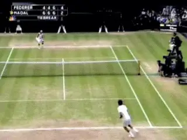

*Video demonstration — the original video for this article was hosted on TennisPlayer.net.*

**An amazing inside out winner while moving the other way.**

With Rafa serving at 2-4, Roger hit another amazing forehand winner
moving to his left, but hitting the ball inside out the other way. At
5-2, Roger hit a forehand 1/2 inch out. But then he hit a great wide
serve to get to 6-3. Rafa saved one point with a forehand volley, and
another with a good wide serve. But serving at 6-5, Federer hit a clean
ace to force a fourth set. This time Roger had 23 forced errors, 6 on
his forehand and 11 on serve. That was virtually half of his total of 47
points.

**4th Set**

It's strange to say with so much on the line, but the fourth set was in
many ways routine until they got to the breaker. The only real drama was
when Roger got down 0-30 serving at 4-5. But a great serve, two big
forehands and a rare Nadal unforced error got him out of it. And they
stayed on serve all the way to 6 all.

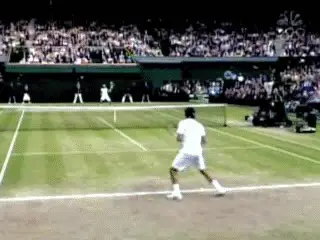

*Video demonstration — the original video for this article was hosted on TennisPlayer.net.*

**The slice backhand reappeared with mixed results.**

But there were some fascinating exchanges in this set that once again
raised tactical questions about how Federer plays Nadal--or how he
doesn't. And you couldn't help but wonder if Roger was flirting with
the magic missing piece to improving his results.

The game Nadal served at 1-1 saw the mysterious reappearance--followed
shortly thereafter by the disappearance--of Roger's backhand slice. On
the first two points, seemingly out of nowhere, Roger decided to hit two
slice backhands returns, and it worked on the second point as he drew
Nadal in and passed him. Then in the next point, Roger hit three slice
backhands in a row and got a Nadal forehand error.

He hit another slice return, a slice groundstroke, then tried a slice
drop shot, followed it in, and got passed. He hit another slice return
but this one sat up and Nadal hammered a forehand Roger couldn't
handle. Then Roger missed a backhand slice return. It was like he had
decided to conduct an experiment right there in the middle of the
Wimbledon final.

In Rafa's next service game, he made another foray into slice land with
an approach, but Nadal passed him easily. Then serving at 4-5 he hit a
short angled crosscourt slice that was almost a drop shot, but Rafa got
there easily and hit a drop shot of his own that Federer was not able to
get back up over the net.

What did it all mean? **[Obviously, the results were mixed. The slice
points that worked--as in the case of the one hard slice drive, he hit
in the second set--looked really, really good.] [As in good
enough to be the difference. The one's that didn't work looked almost
equally bad. Could he perfect that tactic? Maybe. And maybe the final
outcome of this historic match will make him think about it--or
not.]**

More on all this below, because that discussion is getting ahead of the
story, and the fourth set tiebreaker was about as tense as it can get in
pro tennis.

With Nadal serving, they played an unbelievable first point that ended
with Nadal hitting a backhand overhead and Federer rifling a forehand
passing shot down the line. Then Rafa hit a short forehand winner to
make it 1-1.

Roger missed an inside in forehand from deep in the court. Now Nadal had
two service points with a 2-1 lead. He hit a rare ace, then a service
winner to run it to 4-1. Federer came back with a gorgeous inside in
forehand, 4-2. They played a long backcourt point that included one
Nadal forehand that was probably out, but Nadal won the point when Roger
couldn't handle a backhand down the line.

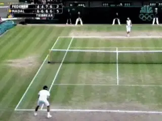

**How many players can laugh off a double fault at 5-2 in the breaker?**

So now Nadal had the match on his racket, as they say, serving at 5-2.
And you're thinking how can Roger possibly get out of this? And maybe
he needed help. And he got it. Nadal hit a double fault, only his third
of the match. Then he missed what for him was a routine backhand. Nadal
(and his dad) seemed to laugh off the double. But he did show just a
hint of negative emotion after the backhand error.

So now Roger was suddenly back on serve at 4-5. He hit a gorgeous wide
serve, backed up by a clean forehand crosscourt winner to make it 5-5.
One more big first serve Nadal couldn't handle and suddenly it was 6-5
Roger.

On the next point they had a long, relatively cautious exchange and
Roger hit a forehand well wide of the sideline. That made it 6 all. On
the second Nadal service point, Federer made another forehand error,
this time about 1 inch long over the baseline.

So match point Rafa, but on Roger's serve. Roger saved it with an
unbelievably clutch first serve that Nadal barely touched. 7all. On the
next point, Nadal hit an clean running forehand pass off a great,
seemingly unreturnable Federer forehand approach. Nadal was so far away
from the ball it seemed there was no way he could catch up with it, but
not only did he somehow get there, he hit a dominating pass that Federer
didn't touch. Match point number 2, and this time with Rafa serving.

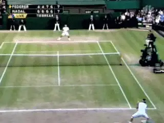

**The two best back to back passing shots ever in a Slam Final?**

Now it was Roger's turn to come up with an almost equally stunning
pass. Nadal hit a crosscourt forehand approach and Roger hit a perfect
backhand down the line pass, making it look as casual as could be. Were
those the two best clutch passing shots ever hit back-to-back in a Grand
Slam final?

So now Rafa was serving at 8 all. But Federer worked his forehand inside
out and set up a clean crosscourt forehand winner. And that was it. At
9-8, Rafa missed a second serve return. 2 sets all.

**5th Set**

So, as we said at the start, after all that tremendous tennis drama, the
fifth set starts with the total number of points dead even at 151. No
one could know at that point that it would go 9-7 or that over a third
of the total points in the match had yet to be played.

Federer held to start, hitting a dominating backhand volley on game
point. Rafa held with no drama. Federer missed a swinging volley to make
it 30 all in his next service game, then hit a double fault at ad in to
give Rafa a deuce point. Federer had another ad but Rafa forced a second
deuce with a drop shot. But two Nadal errors kept it on serve, with Rafa
now serving at 1-2. Nadal held losing only one point for 2 all.

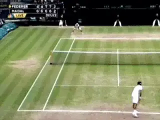

**Two aces after the rain delay? Amazing.**

In the next game Federer was pushed to 30 all, hit an ace, but then lost
the next point on a Nadal drop shot, with the rain falling and play
suspended. So they went into the delay with Federer serving at 2 all,
Deuce.

Unbelievably Roger came out and calmly hit 2 aces to hold. Rafa held no
problem for 3 all. Then Roger held at love.

Then, with Nadal serving at 3-4, there was a moment where it looked like
Roger was finally going to break through. At 30 all, he absolutely
tagged a down the line forehand winner to get a break point to serve for
the match. The look on his face just before Rafa served was that
familiar, quiet confidence you see when he thinks he is in control or
about to take control--something that had been absent for most the day.

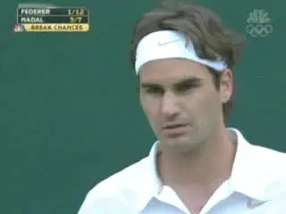

**Break point at 3-4 and unbelievable determination.**

But if you looked across the net at Nadal's face you saw a look of
superhuman determination to not let this happen. On Roger's return he
hit an absolutely monstrous inside out forehand, and then crushed an
overhead. You could see what that point took out of Roger. Roger made a
forehand unforced error, and then Nadal held with a forehand inside in
winner. Those three points must have felt like a knife in Roger's
heart.

Again, they exchanged holds. Then at 5-5, it looked like the tipping
point had again arrived, but this time for Rafa. Rafa hit a vicious
dipping passing shot and a huge down the line forehand to get to double
break point. But Roger answered with an ace and a great forehand to get
back to deuce and he eventually held.

Still my feeling at this point was Roger's lost break opportunity and
the near escape on serve had added to the cumulative strain of playing
from behind the whole match. He had been fighting his way back into the
match for hours, and even the best player in the world can only do that
for so long.

Rafa held again. Then in the next game, there was a moment that didn't
seem that important at the time, but may have decided the mental battle
in Rafa's favor, even though Roger actually eventually held in the game
to get to 7-6.

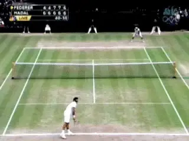

**What if Roger had made this volley?**

Roger quickly got down on his serve with a bad forehand unforced error
on the first point, followed by a backhand error to make it 0-30. Once
again, the serve rescued him as he hit an ace, then got a forced error,
and hit a great forehand to get back on top 40-30.

On the next point, after a long, amazing exchange, Federer hit a
relatively easy forehand volley into the tape with the court wide open.
Anywhere over the net would have been an uncontested winner at the end
of a tough point.

It was the kind of gift neither player had been giving and it must have
been a big relief to Nadal. So instead of the game being over, it went
on for another deuce with Roger eventually holding, but it turned into
another gritty escape for Roger.

And as events showed, Roger's emotional reserves were now near
exhaustion. I honestly believe if he had made that volley, he would have
inflicted some pain on Nadal and at the same time, have saved some
fight, maybe even enough to have that sixth title in hand today.

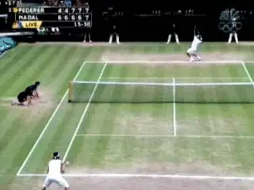

**Part of the emotional tipping point in the first point of game 15?**

At 6-7, Rafa held once again in a game that featured a couple of
incredible, exhausting all court points--both won by Nadal. Then with
Roger serving 7-7, Rafa hit a huge forehand winner and you saw Roger's
head go down. Then Roger missed another forehand. At 15-30, Nadal
blasted one of those flat backhand lasers crosscourt behind Federer to
get to double break point at 15-40. Once again you saw Roger look down
in discouragement.

Roger pulled himself together one more time though with another ace and
a great forehand. Rafa got another ad on a crosscourt backhand, but
Roger erased that to get back to deuce with a service winner.

But that was it. Two quick forehand errors from Roger and Nadal was
serving for the match, with new balls. And now Nadal stepped it up that
final notch. At 0-15 Nadal served and volleyed for the first time in 5
sets.

What kind of courage or confidence or insanity leads a player to do
that? And he hit a forehand volley winner. Then he worked his way in on
the next point and did it again. 2 forehand volley winners in a row to
get to 30-15 at 8-7 in the fifth.

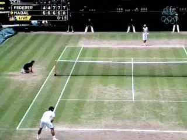

**Rafa's first serve and volley--at 8-7 in the fifth.**

Rafa hit a high backhand volley in the next point on a ball that looked
like it was going out, missed and it was 30 all. But then Roger made a
bad backhand error. Match point.

Now there was one more magical moment--one of the greatest clutch shots
I have ever seen, period--Roger's gorgeous, fluid, backhand crosscourt
return winner to get back to deuce. But you just could feel that he had
been fighting for too long. Two good Nadal serves and it was over.
Rafael Nadal, Wimby champ 2008.

**The Numbers**

Again, in the 5th set the forced errors were the key. Nadal forced 19
errors, including 8 with his forehand, 6 with his backhand, plus 4 off
his serve. That was almost equal to his 21 clean winners.

As I said, for the entire match my numbers were a little different than
the official states. But for both players I had a total of 162 Forced
Errors out of 413 total points. In fact, more points were decided in
this way than on clean winners or unforced errors. And that's kind of
the point.

What you see when you look at it is that, in the exchanges, Nadal was
able to pressure Federer off the ground off both sides. He didn't hit
the aces Roger did, but his serve had the same effect, forcing Roger
into errors on his forehand and especially his backhand return. Yes,
Roger hit more clean winners, but Nadal more than equalized that by
giving Roger difficult balls he was able to touch or hit but not
control.

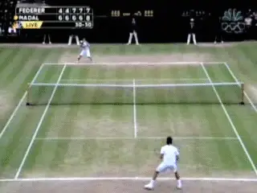

**A backhand that Roger loves to hit--maybe too much.**

And then there is the issue of Roger's backhand. Is there something
wrong with it? In my opinion it's one of the most technically pure
stroke patterns in the history of the game. The problem isn't
technical. The problem is that no matter how well Roger hits it, it
doesn't hurt Nadal in most circumstances. Neither basic exchange
pattern is to his advantage. Crosscourt is to Nadal's forehand. And
down the line is to Nadal's improved, vicious backhand.

The fact is Roger has a gorgeous backhand, likes to hit it, is used to
doing damage with it, but that doesn't work against Nadal. So he gets
frustrated or discouraged, and then he makes errors, errors that seem
random or unexpected.

In 5 sets he hit 30 unforced errors on his backhand. Nadal had 13
backhand errors. That's a 17 point differential--more than 3 times the
point margin in the whole match. Theoretically if Roger had just
eliminated a handful of those errors, he would have won more total
points, and maybe the match. So yeah, you could say he lost the
Wimbledon record on that wing. But what should he or could he do
different?

Roger likes to attack. He likes to crush people from the baseline.
He'll play defense for sure, but he doesn't like to play defense to
win points through attrition. He likes to play defense to transit back
to offense. And when he hits solid backhand drive after backhand drive
and can't make a dent in Rafael Nadal, well that's where the errors
start.

And then there's the slice thing. He's proved that he can change it up
and use the slice very effectively. But not consistently. And the
question is whether he will adapt and try to do this over time--learn
to hit the slice at the right time and put the ball in the right place
where it causes Nadal real difficulties. Or is that even really
possible? Is that just one more adaptation Nadal will make when and if
it happens? And of course, no one can answer that question.

**The Greatest?**

So was it the greatest or one of the greatest matches ever played? There
are several ways to address that question. Compared to the final in 2007
the match was off the charts statistically.

Those of you who've followed my analysis over the last few years know
that there another statistic I compile that tells the story in matches.
Once you have the Forced Errors, you can compute the big picture.

Wimbledon 2008                                                      
Aggressive Margin By Set      1      2      3      4      5     Average

Roger Federer                +13    +13    +26    +20    +24     +19.8

Rafael Nadal                 +14    +18    +23    +22    +29     +21.2

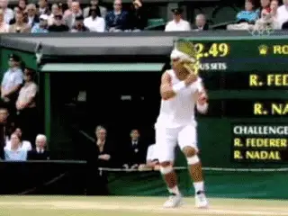

*Video demonstration — the original video for this article was hosted on TennisPlayer.net.*

**Was it the greatest--and what does that mean?**

This is the "Aggressive Margin." You add up a player's winners and
forced errors, and then subtract his unforced errors. That gives you a
hard measure of how aggressive each player was, and how successful.
([link](http://www.tennisplayer.net/members/strategy/john_yandell/understanding_statistics/Yandell_Aggressive_Margin_images/Yandell_Aggressive_Margin.html).)

Last year at Wimbledon in the final, Roger averaged an Aggressive Margin
of +10.8 per set. Nadal averaged +8.6. This year both players' numbers
were more than double. Roger had an average Aggressive Margin for the
match of +19.8. But Nadal was a whopping +21.2. That's up there with
the highest numbers in any pro match I've ever charted. Compare it with
the Sampras / Agassi confrontation at the U.S. Open in 2001 which was
the highest quality statistical match I've studied.

And in terms of drama, it was up there as well. If Roger had actually
won that 5th set I would have said it was the greatest match I'd ever
seen--for the simple fact that he had to come from so far down.

But because Nadal was so far ahead so early, the whole match had an
anti-climatic feel. Realistically, we were all just waiting for the
inevitable to occur and admiring Roger's incredibly valiant struggle
against the Nadal victory.

If Roger had won the second set of course, the whole dynamic might have
changed. As it was, aren't we all lucky to have just witnessed it, and
all the other confrontations between them in the last few years? I said
it last year and I'll say it again. How fantastic if the next rematch
was in the U.S. Open final.

*Video demonstration — the original video for this article was hosted on TennisPlayer.net.*

John Yandell is widely acknowledged as one of the leading videographers
and students of the modern game of professional tennis. His high speed
filming for Advanced Tennis and Tennisplayer have provided new visual
resources that have changed the way the game is studied and understood
by both players and coaches. He has done personal video analysis for
hundreds of high level competitive players, including Justine
Henin-Hardenne, Taylor Dent and John McEnroe, among others.

In addition to his role as Editor of Tennisplayer he is the author of
the critically acclaimed book Visual Tennis. The John Yandell Tennis
School is located in San Francisco, California.
