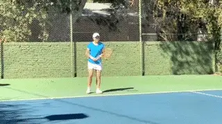
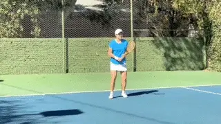
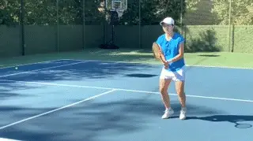
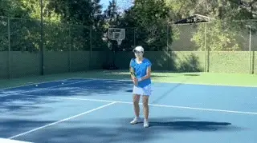

# Ultimate Drill Games -Drills for Developing Touch-Part4

**Drills for Developing Touch:\
Part 4**

**Dave Hagler**

There is a reason you kept those wood racquets in your closet! They are
fantastic for developing touch.

Here are three drills for mastering slice on all the shots. In just a
few minutes you often see drastic improvement.

Do these drills regularly until the player is comfortable with wood
slice, wood drop shots and wood volleys. The work will carry over when
the player uses their own racquet, as the last animation shows.

Start with all slice groundstrokes. Then progress to drop shots, then
volleys. I wonder if Ash Barty did any drills similar to these?

Wood Racquet Slices

Wood Racquet Drop Shots

Wood Racquet Volleys

Slice Medley with a regular racquet.

More drills to come! Stay Tuned!

                                                                                                                                                                                     players of all ages, but he has a special
passion for junior development. He has
coached numerous sectionally and nationally
ranked junior players and several national
champions. Dave is a USPTA Master
Professional and National Tester, a PTR
Master of Tennis -- Performance, and was one
of the first 100 coaches to complete the
USTA's High Performance Coaching Program.
He has been the USPTA California Division
Pro of the Year and one of 5 National
Recipients of the "Pro of the Year" award
from Head and the PTR.

+-------------------------------------------------------------------------------------------------------------------------------------+---------------------------------------------------------------------------------------------------------------------------------------------------------------------------------------------------------------+

+-------------------------------------------------------------------------------------------------------------------------------------+

+=====================================================================================================================================+===============================================================================================================================================================================================================+

**Tennisplayer Forum**

**Let's Talk About this Article!\

\

Share Your Thoughts with our Subscribers and Authors!\

\

[[Click

Here]](https://www.tennisplayer.net/bulletin/forum/tennisplayer/93622-drills-for-developing-touch-part-1?view=stream)**

