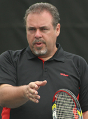

# Ultimate Drill Games - Horse

**Ultimate Drill Games:\
Horse**

**Jorge Capestany**

Last month I presented the Service Box 6 Target Game [link](https://www.tennisplayer.net/members/ultimate_drillgames/jorge_capestany/the_serve_box_6_targets)
Now let's use those same 6 boxes to play another serve drill game:
Horse! As a kid you may have played this in basketball. One player takes
a shot from somewhere on the court. If he makes it the other play has to
do the same, or he gets the first letter, "H." When the first shooter
misses it's the second shooter's turn to pick the spot. It goes back
and forth until one player spells Horse.

It's the same with the serve game. The first server picks one of the 6
boxes. If he hits it the second server has to make the same box or he
gets the H. This game creates more pressure than the simple 6 box game
and helps players identify their strengths and weaknesses in placing the
serve as well as giving them another way to work on improving their
control serving to all areas of both boxes.

Jorge Capestany is one of eleven people worldwide that have earned the
distinction of Master Professional with the USPTA and International
Master Professional with the PTR. Jorge is also a certified Mental
Toughness Specialist through the Human Performance Institute based on
the life work of the legendary Dr. Jim Loehr.

He is the founder of Capestany Tennis Inc. which runs tennis websites
for players and coaches. His website TennisDrillsTV ([link](https://tennisdrills.tv/)) has thousands of
subscribers in more than 65 countries worldwide and features over 1,000
videos of tennis drills that can be viewed online and also printed off
in diagram form. His teaching website ([link](https://www.jorgecapestany.com/)) features free
video lessons for players of all levels as well as a free Mental
Toughness Video Course and eBook. Jorge is also the director of the Hope
College Professional Tennis Management (PTM) program.

Jorge is a 6 time Michigan Pro of the Year and 2 time Midwest Pro of the
Year. He is a member of the USPTA Midwest Hall of Fame and was named
national pro of the year by the USPTA in 2015. Jorge's programs have
developed more than 180 High School State Tennis Champions in Michigan
and Jorge has been the personal coach to many nationally ranked juniors
in the US including three national champions. He speaks regularly at
coaching conventions around the world.

**Tennisplayer Forum**

**Let's Talk About this Article!\

\

Share Your Thoughts with our Subscribers and Authors!\

\

[[Click

Here]](https://www.tennisplayer.net/bulletin/forum/tennisplayer/79971-ultimate-drill-games-horse?view=stream)**

© Tennisplayer 2019. All Rights Reserved.\
\
Contact Tennisplayer directly: jyandell@tennisplayer.net

Jorge Capestany is one of eleven people worldwide that have earned the
distinction of Master Professional with the USPTA and International
Master Professional with the PTR. Jorge is also a certified Mental
Toughness Specialist through the Human Performance Institute based on
the life work of the legendary Dr. Jim Loehr.

He is the founder of Capestany Tennis Inc. which runs tennis websites
for players and coaches. His website TennisDrillsTV ([link](https://tennisdrills.tv/)) has thousands of
subscribers in more than 65 countries worldwide and features over 1,000
videos of tennis drills that can be viewed online and also printed off
in diagram form. His teaching website ([link](https://www.jorgecapestany.com/)) features free
video lessons for players of all levels as well as a free Mental
Toughness Video Course and eBook. Jorge is also the director of the Hope
College Professional Tennis Management (PTM) program.

Jorge is a 6 time Michigan Pro of the Year and 2 time Midwest Pro of the
Year. He is a member of the USPTA Midwest Hall of Fame and was named
national pro of the year by the USPTA in 2015. Jorge's programs have
developed more than 180 High School State Tennis Champions in Michigan
and Jorge has been the personal coach to many nationally ranked juniors
in the US including three national champions. He speaks regularly at
coaching conventions around the world.

**Tennisplayer Forum**

**Let's Talk About this Article!\

\

Share Your Thoughts with our Subscribers and Authors!\

\

[[Click

Here]](https://www.tennisplayer.net/bulletin/forum/tennisplayer/80586-ultimate-drill-games-the-magic-box?view=stream)**

© Tennisplayer 2019. All Rights Reserved.\
\
Contact Tennisplayer directly: jyandell@tennisplayer.net

Can you make 6 out of 6 boxes routinely? Many players find it can take
twice or three times as many serves to hit all six boxes. You can also
use pick any box where you struggle and hit 10 serves to that box. How
many of 10 hit the box?

Work back and forth between the boxes. If you can routinely make all 6
in a row, that's world class accuracy.

Jorge Capestany is one of eleven people worldwide that have earned the
distinction of Master Professional with the USPTA and International
Master Professional with the PTR. Jorge is also a certified Mental
Toughness Specialist through the Human Performance Institute based on
the life work of the legendary Dr. Jim Loehr.

He is the founder of Capestany Tennis Inc. which runs tennis websites
for players and coaches. His website TennisDrillsTV ([link](https://tennisdrills.tv/)) has thousands of
subscribers in more than 65 countries worldwide and features over 1,000
videos of tennis drills that can be viewed online and also printed off
in diagram form. His teaching website ([link](https://www.jorgecapestany.com/)) features free
video lessons for players of all levels as well as a free Mental
Toughness Video Course and eBook. Jorge is also the director of the Hope
College Professional Tennis Management (PTM) program.

Jorge is a 6 time Michigan Pro of the Year and 2 time Midwest Pro of the
Year. He is a member of the USPTA Midwest Hall of Fame and was named
national pro of the year by the USPTA in 2015. Jorge's programs have
developed more than 180 High School State Tennis Champions in Michigan
and Jorge has been the personal coach to many nationally ranked juniors
in the US including three national champions. He speaks regularly at
coaching conventions around the world.

**Tennisplayer Forum**

**Let's Talk About this Article!\

\

Share Your Thoughts with our Subscribers and Authors!\

\

[[Click

Here]](https://www.tennisplayer.net/bulletin/forum/tennisplayer/81726-ultimate-drill-games-cuban-davis-cup?view=stream)**

© Tennisplayer 2019. All Rights Reserved.\
\
Contact Tennisplayer directly: jyandell@tennisplayer.net
