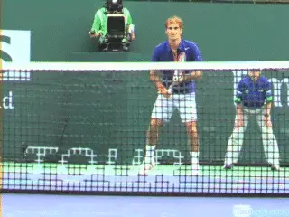
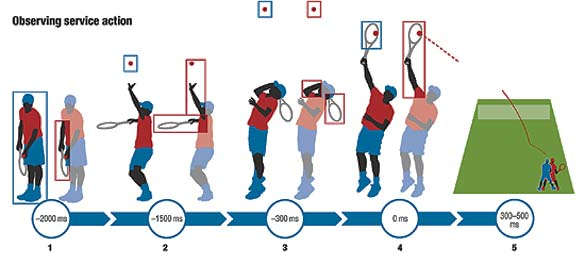
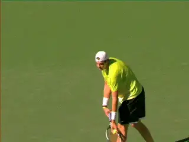
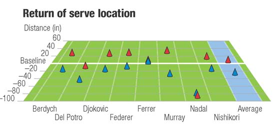
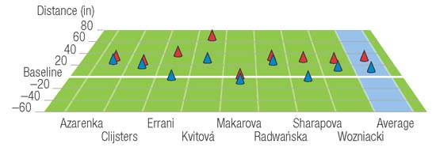
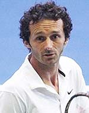
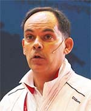

# Anticipating the serve

**Anticipating the Serve**

**Machar Reid, Miguel Crespo, Damian Farrow**

*Video demonstration — the original video for this article was hosted on TennisPlayer.net.*

**What strategies do great returners use to anticipate a 125mph serve?**

Many elite players, particularly in the men's game, are able to direct
serves in excess of 125 mph to all parts of the service box. This
presents a considerable challenge to their opponents, standing some 78
feet away, **who have approximately one third of a second between the
hit and the ball bounce to assess the ball's flight and begin a
well-timed return.**

The battle between the server and returner has attracted the interest of
researchers for more than 20 years. Various researchers have focused on
what information or cues returners can use in that third of a second of
ball flight---as well as the split seconds prior to the hit --to help
determine the serve's likely direction, allowing for an improved motor
response.

**Skilled players have been shown to use two forms of advance
information.** First, situational probability
information, such as strategic insights based on known preferences of
the server. Second the mechanics of the service action.

**Situational Probability**

Situational probability means that skilled players are sensitive to
tactical patterns that occur and reoccur throughout a match. Awareness
of these specific event probabilities buys the returners additional time
to prepare a response.

**Highly skilled players access information to help predict serve
location from the movement of the server's racket and arm (red boxes)
with the 300 milliseconds before impact up until impact particularly
informative. On the other hand, less-skilled players almost exclusively
track the ball toss (blue boxes) and have no systematic search pattern,
so assume less favorable positions to return the ball.**

In an attempt to analyze this phenomenon, researchers presented skilled
and less-skilled tennis players with video sequences of a simulated
match where the direction and type of serve in the first point of each
game were controlled. The serve on the first point was always to the
"T" in the deuce court.

The serve direction of all other points was randomly assigned. Skilled
players picked up this cue by the end of the first set, while
less-skilled players were unable to detect it at all.

**Studying the server's biomechanics can help the returner gain 300
milliseconds.**

**Bio-Mechanical Elements**

The biomechanical elements of the server's action are also thought to
provide anticipatory information that has been shown to help skilled
players accurately predict service direction some 300 milliseconds
before the ball is struck.

With so little time available to respond to the serve, players need to
extract every bit of information that they can to most effectively
return serve. Highly skilled players can generally interpret where the
ball is going to be hit based on the mechanics of their opponent's
service action.

**These players pick up cues well before the racket meets the ball,
providing them with more time to plan their serve return. The location
or height of the ball toss and the angle of the
racket during its forward swing to impact seem to
provide the most information.**

In contrast, less skilled players are reliant on ball flight information
and consequently are left with little time to prepare an appropriate
response, resulting in being "aced" or, at best, making a rushed
return.

**Positioning**

Often players will also do something as simple as adjusting their
position on return to buy themselves more time to perceive and respond.
In the graphic, with the distance in inches, we see the average return
of serve position on both first and second serves of 16 of the game's
best male and female players during a recent Australian Open tournament.

The charts show return positions of the game's best players on first
and second serves, measured in inches relative to the baseline.

Machar Reid is the innovation catalyst at Tennis Australia. He
established the Sports Science and Medicine Unit there in 2008. He is
the coauthor of several books on tennis sports science and coaching.

Damian Farrow holds a joint appointment within the College of Sport &
Exercise Science, and the Australian Institute of Sport, where he
responsible for research and support of coaches seeking to develop the
skills of Australian athletes. A former tennis coach and physical
education teacher, he has worked with Cricket Australia, Tennis
Australia, Netball Australia, Surfing Australia, the Australian Rugby
Union and Swimming Australia.

Miguel Crespo is the research officer at the International Tennis
Federation Development Department, Spain. He oversees the ITF's coach
education program and has coauthored and edited many ITF publications.
