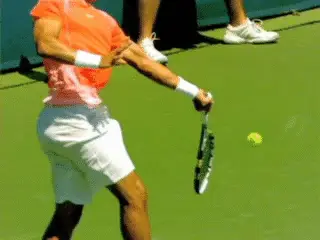
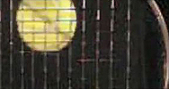

# Copoly Strings: How Do They Really Work?

### Joshua Speckman

------------------------------------------------------------------------

**It's been almost 15 years since Guga first won the French using
\"copoly\" strings.**

Since Gustavo Kuerten won the French Open in 1997 with the aid of
Luxilon copoly strings, the material has gradually displaced traditional
natural gut and other synthetic strings in nearly every racket on the
ATP tour.

The strings are essentially polyester with various-often
slippery\--chemical additives, and most accurately described as
copolymers. The \"luxilon shot,\" the characteristic, diving flight path
associated with heavy topspin, has now become a characteristic of the
professional game itself. There is no doubt that copoly strings have
taken their place amongst the most important equipment innovations in
the history of tennis.

**Fundamental Change**

Following his victory in the 2007 US Open final, Roger Federer explained
that copoly strings had forced a tactical shift in the men's game,
pushing attacking players away from the net and back onto the baseline.

\"If you come into the net you're dead these days,\" says Nate
Ferguson, who famously strung Pete Sampras' rackets for many years and
is now the personal racquet and string technician for Federer, Djokovic,
Murray and 13 of the ATP's top 30 players.

**The incoming spin from players like Rafa makes volleying far more
difficult.**

\"Whether or not the ball ends up diving at your feet -- like everyone
who comes in against Rafa -- it's too hard to volley with the spin
coming into your racket.\"

According to Ferguson, it's not just the pace and trajectory of heavy
topspin balls. The other problem is the way the net rusher's own
strings react.

\"Let's say the net rusher is now playing with Luxilon. The ball coming
in reacts differently on your strings, because of their 'grabbiness.'
It makes a volley harder to hit it where you want to.\"

Unfortunately for attacking players, the rise of copoly strings and
heavy spin coincided with the attempts of tennis authorities to counter
the ascendancy of 130+ mph first serves in the 1990s. Slower court
surfaces and heavier balls have helped players get more returns in play.
But they also made it harder to put away volleys.

**The Last Nail?**

The new strings seem to be the last nail in the coffin. The combination
of court surface, balls, and copoly give baseliners more time, more
spin, better angles, and therefore more options, making serve and volley
play all but extinct.

**Is copoly pushing serve and volley toward extinction?**

In 2003, a group of former pros, including McEnroe, Navratilova and
Becker, sent the game's rules-making body, the International Tennis
Federation, a letter expressing concern about the state of the game.
**[\"The sport has lost something, lost some subtlety, some strategy,
some of the nuance,\" they said, and argued for a return to smaller
racket head sizes.]**

Many former pros believe the effect of copoly strings has been just as
profound on the state of the game. But despite the consensus in the
playing community, until recently scientists have had no evidence that
the new strings really did generate more spin than traditional natural
gut or synthetic gut and \"multifilament\" nylon strings.

Now that has changed, as high speed videography has unlocked another
invisible mystery in the pro game, similar to the insights into stroke
mechanics that have evolved from the high speed stroke footage on
Tennisplayer. So how exactly do these strings work, and how much
additional spin is it possible to generate?

**Physics of Spin**

The physics of spin are in one sense very straightforward. **The
steeper the swing plane and the faster the swing, the more
spin.** And at one level that really is the bottom
line.

**The simple part: a fast steep swing creates more spin.**

But there is no doubt that racket frame technology\--large-headed,
wide-faced graphite composite rackets\--started the trend toward the
modern, fast and steep swing technique and dramatically increased the
amount of spin in the game compared to the days of wood frames.

Now the copoly string technology has taken it to another level. But the
physics of how the new strings really generate extra spin has proven
much more complicated and difficult to understand.

**When the ball enters the string bed on a topspin shot, when it stops
sliding it will \"bite\" the strings. At this point the back of the ball
is embedded in the strings and therefore is actually moving at the same
speed and in the same direction as the racket - forwards and upwards.
Keep in mind this is an event occurring in only a few milliseconds, but
the result is that the ball is launched from the strings spinning with
topspin.**

The effect is similar to what happens when a ball bounces on a court.
**As the bottom of the ball hits the court, it slides, slows down, and
then bites. But the top of the ball is still moving forward. The result
is that the ball bounces off the court rotating forward, with
topspin.**

**The ball bites the strings, then launches with topspin.**

**Why Straight?**

That's the basic physics of the ball string interaction, but it turns
out something more happens with copoly. Players have long noticed that
the new strings don't need to be straightened between points and
posited that this explained the extra spin.

The common sense explanation is simply that poly strings are sticky and
don't move out of place. This notion, which many people still believe
today, led to the theory that because the strings \"don't move\" they
offer a more solid surface, and thus more friction and spin.

**But there is one big difference between strings and tennis courts
that illustrates why this view is incorrect. Shots hit onto a tennis
court often arrive at very acute angles, in which case the ball will
slide throughout the impact and the bottom of the ball will not
bite.** If that happens, the ball will have less
spin and speed. But at the more obtuse or shallower angles a ball
bounces off strings this almost never happens.

Another explanation is that copoly strings are stiff and \"dead\" and
therefore less powerful than nylon and natural gut. So balls hit with
them, the theory goes, tend to drop shorter in the court. This in turn
encourages players to take bigger cuts.

**Reality**

But is it really true that copoly doesn't move? To see if this was
true, it was necessary to slow down some very fast events to understand
what was really happening during the 4 or 5 milliseconds that the ball
is contact with the strings.

**Conventional nylon strings slide, then get stuck.**

**Courtesy Yoshihiko Kawazoe**

In 2004, a Japanese professor of human robotics, Yoshihiko Kawazoe,
trained his ultra-high-speed, 10,000 frame-per-second camera on worn,
notched nylon strings. This allowed him to see 40 to 50 frames during
the impact.

He next filmed impacts on the same strings after they had been coated
with a lubricant. Able to observe 40 or 50 frames of each ball/string
impact, he solved the mystery of string movement and spin. It turns out
that some strings generate more spin than others not because of more
friction, but because of less. Incredibly, the strings that generate
more spin are not really staying still.

| Unlubricated Strings |  |  |
| --- | --- | --- |
|  |  |  |
| **Note the alignment of the unlubricated strings before contact, basically all aligned and parallel.** | **The unlubricated strings slide down at contact displaced by the ball, as the ball embeds in the string bed.** | **The unlubricated strings after contact. With the fifth and sixth strings from the bottom still misaligned or stuck.** |

As the click through video show, as the ball impacts the normal
unlubricated strings, a few of the main strings slide with it. But on
the rebound, one string gets stuck out of line and doesn't return to
position. And that's what all players find with traditional
strings\--they quite quickly get displaced and stuck out of position.

**The lubricated strings slide but then kick back.**

**Courtesy Yoshihiko Kawazoe**

Now compare that to the video of the lubricated strings. In contrast,
the lubricated strings move more quickly and in greater number as the
ball embeds into the strings. Then, as the ball begins to rebound, the
main strings spring back into line, recovering to their original
position.

Kawazoe found that this snap-back of the main strings actually gives the
ball an extra kick, which puts extra spin on the ball. Amazingly, the
lubricated strings generated 40% more spin.

| Lubricated Strings |  |  |
| --- | --- | --- |
|  |  |  |
| **The alignment of the lubricated strings before contact is similar to the unlubricated, aligned, straight and parallel.** | **The lubricated strings also slide down at contact displaced by the ball, as the ball embeds in the string bed.** | **The lubricated strings snap back into alignment, again look at the fifth and sixth strings from the bottom.** |

**Relation to Copoly?**

OK, fine but what is the relevance of this discussion of lubricated
strings to copoly? The answer is that copoly strings, which are both
slippery and stiff, behave much as lubricated strings do. They slide
with the ball and then snap back quickly enough to exert a spin-boosting
torque.

Copoly strings add spin not because they stay still, but because they
move more freely in both directions.

**Copoly strings displace but then snap back into alignment.**

The International Tennis Federation reached the same conclusions in its
own experiments. But these results have remained obscure and most
players and coaches are unaware of them. As with Kawazoe's work, the
ITF papers were published only in technical journals and in the ITF's
own publications, eluding the attention of the general tennis community
and press.

  ------------------------------------------------------------------------------------------------------------------------------------------------------------------------------------
                                                                          
  ------------------------------------------------------------------------------------------------------------------------------------------------------------------------------------
                                                                   **Luxilon Power Rough-35% more spin than nylon.**

  ------------------------------------------------------------------------------------------------------------------------------------------------------------------------------------

That changed in April 2010, when two well known tennis scientists, Rod
Cross and Crawford Lindsey published their own carefully controlled
experiments. Their studies showed that the average copoly string
generated 25% more spin than the average nylon string, and 8% more spin
than natural gut.

Cross and Lindsey tested only a small sample of strings. But Stuart
Miller of the ITF told me that the ITF's broader test results are
comparable to theirs. In fact the ITF now attempts to test every string
that hits the market for spin potential, although that data is not
available to the public.

The best copoly Cross and Lindsey tested, the venerable Luxilon ALU
Power Rough, which many pro players still pay for out of pocket,
generated 35% more spin than the nylon average. Miller says that the
best string the ITF has tested generates about 5% more than ALU.
Crunching the numbers tells us that the best copoly they've tested
generates around 42% more spin than the average nylon.

Early just this year, Crawford Lindsey published a series of papers
providing a wealth of evidence for the slippery string theory.
\"Lowering the friction of the strings, if you think about it (and I'm
surprised that none of the scientists thought of it before), that's how
strings move: they store elastic energy and return it,\" says Lindsey.

\"And if you can get the strings to move sideways and store elastic
energy and then return it, you'll get more spin. It makes perfect
sense,\" he adds.

| Copoly Strings |  |  |
| --- | --- | --- |
|  | generated](media_copoly-strings-how-do-they-really-work/media/image17.jpg) |  |
| **You can see, as with the other clips above the alignment of the strings pre contact.** | **This still shows the displacement of the strings sliding downward at contact.** | **This still shows the copoly snap back to the original position. How would a player know they even moved?** |

Lindsey believes that the timing of the snapback is crucial, and his
recent research is beginning to reveal the string characteristics that
optimize this mechanism. The ITF believes that the stiffness of copoly
strings is the most important factor, which relates back to ease of
sliding.

If the cross strings are stiff, they may act much like high-tension
rails for the main strings to glide upon. This makes sense because
copoly strings are, on average, about 1.4 times as stiff as nylon, and
about 2.8 times stiffer than natural gut.

In Lindsey's lab, stiffness has shown to be important, not only in
facilitating sliding, but also in preventing too much movement. The
snapback mechanism will fail to produce extra spin if the strings are
too loose and don't have enough stored energy to return quickly enough,
or if the strings are too sticky, and get stuck before they can snap
back. The optimal string, it seems, has just the right combination of
stiffness and slickness.

  ------------------------------------------------------------------------------------------------------------------------------------------------------------------------------------
                                                                
  ------------------------------------------------------------------------------------------------------------------------------------------------------------------------------------
                                                        **RPM Blast, a Babolat copoly used Rafa and Shiavone to win in Paris.**

  ------------------------------------------------------------------------------------------------------------------------------------------------------------------------------------

Lindsey says the snapback mechanism is extremely complicated. The
duration of this effect is about two milliseconds, or half or less of
the total time the ball is on the strings. This makes it very difficult
to study. Later this year, he and Cross plan to measure the spin
potential of many more strings, with the aim to correlate spin
production with string characteristics.

It appears that some manufacturers are well aware of the current
science, and are now doing their own research to maximize the snapback
effect. In the summer of 2010, Babolat, which, unlike Luxilon, tests
their products for spin potential in the lab, introduced their new RPM
Blast string.

Featuring a slick, \"cross-linked silicone\" coating and a pentagonal
profile, the new string raised eyebrows when three of four finalists at
the 2010 French Open used it, including Rafael Nadal and surprise
champion Francesca Shiavone.

\"I think all the manufacturers have started to realize that slippery
strings work better in terms of spin generation,\" says Cross.

In 2008 Prince introduced a PTFE (aka Teflon) wrapped nylon-string. Then
In January 2011 the company introduced a new copoly string that Prince
says was developed using \"military-grade\" video equipment to analyze
and identify the characteristics that optimize spin potential. They
claim the new string features \"optimized dynamics and friction,
displacing and returning within two milliseconds,\" referring directly
to the timing and facility of the snapback mechanism.

**Could copoly affect the launch angle off the strings as well as the
spin?**

Additionally, Prince is the first company to claim that their string
reduces the angle at which the ball bounces off the strings - the launch
angle. They say that a lower launch angle will result in less depth,
encouraging faster swings and thus more spin. This claim is debatable,
as a higher launch angle could also increase spin by requiring a player
to close the racket face to compensate. But time may tell whether this
string has the desired effect.

Prince claims their new slippery string generates 9% more spin than any
other copoly they've tested. If true, the string may generate as much
as 55% more spin than the average nylon. We'll have to wait for
independent tests to validate Prince's claim, but it does appear that
science has finally caught up with the players, who said all along that
copoly strings generate more spin.

Has more spin added even more power to the pro game? \"If you can
generate more spin, then the aerodynamic effects will bring the ball
down sooner, therefore you can hit the ball harder at the same time,
which is an obvious advantage,\" observes Stuart Miller at ITF.

**\"So, that's why, if you can generate more spin you can keep on
swinging at the ball harder and it becomes
faster.** So, if somebody were to produce a string
that has a step-change in spin-generating capacity then you have to
assume that players would take advantage of that. And you get them
swinging the racket faster, generating more spin, \[with the ball\]
still landing in the court.\"

**Who knows what kind of spin this guy is really capable of?**

We will probably never know how much of Rafa's enormous spin results
from his incredible technique and athleticism and how much from copoly
strings. What we do know is that Nadal hits with more spin than any
other player, with forehands in the range of 1800-4900 rpms of total
spin, and an average of 3200rpm. Rafa's heaviest forehands have nearly
as much total spin as Pete Sampras' legendarily heavy second serve.

Additionally, because copoly strings generate more spin from a given
swingplane, Rafa does not have to swing as steep or as fast as he would
with other strings.

The copoly effect may help explain how Roger Federer, with an eastern
grip and 90-inch headsize, can hit forehands that spin up to 4500
revolutions per minute\--although his average forehand rpms are 20% less
than Rafa's.

Federer might still be capable of hitting that shot with nylon string -
who knows what that guy is capable of-but to do so would require major
changes in the shape of his swing.

In any case there is no longer any doubt that the effect of copoly is
real\--and that the intent of the string manufacturers is to make it
even more effective, potentially adding even more spin to the pro game,
and at all levels.

**Next**: Copoly was not the first string innovation to generate
incredible spin. That happened over 40 years ago. The infamous
\"spaghetti strings\" of the 1970s actually generated more spin than
copoly, but were banned by the tennis establishment. Stay tuned for that
story.

**Want to Investigate More About Copoly for Yourself?**

Y. Kawazoe and K. Okimoto, \"Super high speed video analysis of tennis
top spin and its performance improvement by string lubrication,\" The
Impact of Technology on Sport, Edited by A. Subic and S. Ujihashi, ASTA
Publishing, (2005).

S. Goodwill, J. Douglas, S. Miller and S. Haake, \"Measuring ball spin
off a tennis racket,\" In Proc. of the 6th Int. Conf. on the Engineering
of Sport (ed. F. Moritz and S.J.Haake), Springer, New York (2006). Vol.
1, 379-384.

[C. Lindsey's Tennis Warehouse
University](http://twu.tennis-warehouse.com/learning_center/index.php)

[\"What Strings Generate the Most
Spin?\"](http://twu.tennis-warehouse.com/learning_center/spinexperiment.php)

[\"Spin and String
Pattern\"](http://twu.tennis-warehouse.com/learning_center/COFreporter.php)

[\"String Friction
Database\"](http://twu.tennis-warehouse.com/learning_center/COFreporter.php)

[\"String Snap-back and
Spin\"](http://twu.tennis-warehouse.com/learning_center/stringmovementPart2.php)

[\"Spin and String
Stiffness\"](http://twu.tennis-warehouse.com/learning_center/spinandstiffness.php)

[\"String Lubrication & Movement in
Spin\"](http://twu.tennis-warehouse.com/learning_center/spinandlube.php)

[R. Cross, \"The Inch that Changed Tennis
Forever\"](http://www.racquetsportsindustry.com/articles/2006/01/the_inch_that_changed_tennis_f.html)

R. Cross and C. Lindsey, Technical Tennis, Racquet Tech Publishing,
Vista, California (2005).

  ---------------------------------------------------------------------------------------------------------------------------------------------------------------------------------------------------------------------------------------------
                                                                                                                                                          particular interest in the influence of technology on
                                                                                                                                                                                        tennis. His January 2011 article in The Atlantic, \"The
                                                                                                                                                                                        New Physics of Tennis\", brought the impact of copoly
                                                                                                                                                                                        strings on professional tennis to the attention of the
                                                                                                                                                                                        general public and rekindled discussion about the topic
                                                                                                                                                                                        in the tennis community. Joshua lives in Kunming, China
                                                                                                                                                                                        with his wife, a photojournalist.
  ------------------------------------------------------------------------------------------------------------------------------------------------------------------------------------- -------------------------------------------------------

  ---------------------------------------------------------------------------------------------------------------------------------------------------------------------------------------------------------------------------------------------
