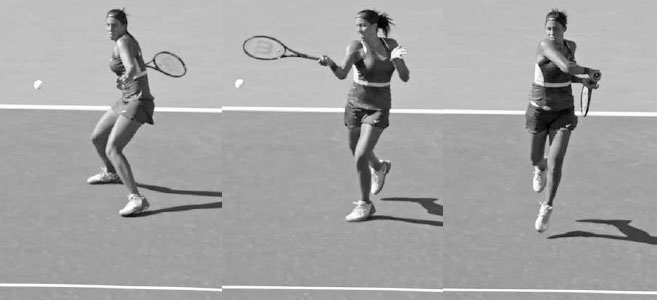
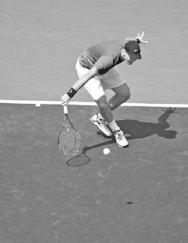
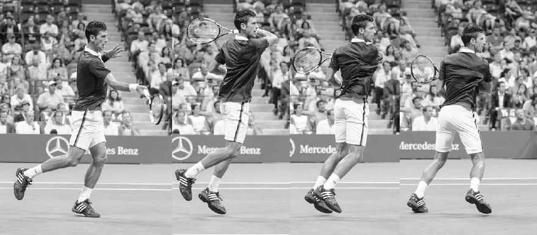
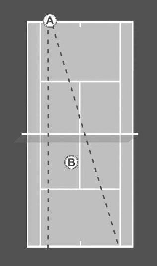

# Approach Shot

This favorable positioning on the approach shot then allowed him to set up closer to the net for his volley, resulting in him hitting his first volley one foot closer to the net and five inches higher than his average. As a result, Federer controlled play from the front court lifting his winning percentage at net to as high as 75% in some of his matches during that tournament. (1) In this chapter, I begin by going through the different types of approach shots. I then discuss the qualities of the approach shot that help you win at the net, the proper movement forward, and optimal court positioning following the approach shot. Next, I explain two other more immediate ways of attacking the net: the serve-and-volley and chip-and-charge plays. I then end the chapter with drills to improve your skills transitioning forward in the court.

*Madison Keys drives her approach shot to the backhand corner.*

**I. Types of Approach Shots**

THE APPROACH SHOT USUALLY IS HIT from several feet inside the baseline and placed deep in the opposite side of the court. If the ball is above your waist and you have some time to set up, a powerful flat or topspin approach shot is generally the best choice (above). In today's power game, this type of approach shot has become the predominant way to attack the net, however, there are several other types of approach shots to consider.

**1. SLICE**

The slice approach shot can be performed quickly, so it often makes sense when time is limited. Also, because the racquet is open, it is often used on low balls. The advantages of the slice approach shot are that the ball stays low, forcing your opponent to hit up on the passing shot, and its slower speed allows you more time to get closer to the net and set up good positioning for the volley.

**2. THE SWINGING VOLLEY**

The swinging volley (see page 180) is increasingly common in modern net play.

It is typically used on high floating balls that would otherwise land near the middle of the court. The power of the swinging volley rushes opponents, mak- ing it difficult for them to hit accurate passing shots.

**3. HIGH TOPSPIN**

A high topspin shot hit deep to the corner can be an effective approach shot, especially at the recreational level. This shot allows you time to move close to the net for the volley and pushes your opponent deep behind the baseline into a defensive position.

**4. DROP SHOT**

The drop shot is not a "classic" approach shot but certainly is a stroke that can allow you move forward to the net and use your volley skills. A good drop shot will make your opponent scramble forward, leaving a large unprotected area of the court within which to place your volley.

Keep in mind, the court surface is important when choosing the most effective type of approach shot. On faster surfaces, where attacking the net is a strategic focus, the quick set-up of the slice approach shot allows you to move forward to volley more often. In contrast, on slower clay courts, where the ball bounces high more frequently, the high topspin approach shot can be a productive choice. Remember the court surface will also affect the amount of time your opponent has to prepare for their passing shot. Therefore, you must be more selective with your approach shots on slower clay courts than when playing on faster hard courts.

**II. Approach Shot Qualities**

FIRST, HITTING THE BALL DEEP towards the baseline is a high priority when playing an approach shot (unless you are using a drop shot). The deeper you hit the approach shot, the less time your opponent will have to line up their passing shot following the bounce of the ball. Second, the approach shot is usually best directed to the weaker groundstroke of your opponent. Third, it often makes sense to hit the approach shot to the side that forces your opponent to run the greatest distance. This will not only force your opponent to hit their passing shot off balance, but also open up the other side of the court for a winning volley. Fourth, if your opponent is hurting you with angled passing shots, an approach shot hit deep towards the middle of the court can be an effective tactic. By hitting towards the middle of the court, you limit the angles available to your opponent and almost guarantee a play on your volley following the approach shot.

**III. Approach Shot Movement**

YOUR MOVEMENT TO THE BALL will be an integral part of your approach shot's success. A strong first step is key to moving well, so prior to the approach shot you should be leaning slightly forward and looking for opportunities to attack the net. If your first steps are explosive, you will have more time to help ensure good positioning for your approach shot.

After making a strong first move, on most approach shots your body will need to decelerate as you prepare to swing. However, as with any groundstroke, the approach shot involves dynamic, variable footwork. Off a high ball, you may have time to stop, load the legs in a semi-open stance, and hit an aggressive topspin approach shot. In contrast, on a topspin approach shot off a ball with a shorter location and lower height, the front leg will step forward, plant, and then hop during the follow through (below). Moving through the approach shot this way will get you closer to the net for your volley.

  -------------------------------------------------------------------------------------------------------------------------------------------------------------------------------------------------------------------------------------------------------------------------------------------------------------------------------------------------------------------------------------------------------------------------------------------------------------------------------------------------------------------------------------------------------------------------------------------------------------------------------------------------------------------------------------------------
  **COACH'S BOX:**
  **If you have the time, measure your steps as you move forward and establish the same stance on your approach shot as you would use if hitting a groundstroke from the baseline. For example, on the forehand approach shot, if the ball is low, use the neutral stance. If the ball is higher, an open-type stance will work better. Too often players tighten up when they move forward and their footwork suffers. Spend time during practice working specifically on the approach shot to learn the footwork and build confidence. This will help you avoid hitting the approach shot in an unfamiliar stance that lacks the balance and hip alignment necessary to execute a strong one.**
  -------------------------------------------------------------------------------------------------------------------------------------------------------------------------------------------------------------------------------------------------------------------------------------------------------------------------------------------------------------------------------------------------------------------------------------------------------------------------------------------------------------------------------------------------------------------------------------------------------------------------------------------------------------------------------------------------

When hitting a slice approach shot, the correct movement is to glide through the shot with your feet remaining close to the ground and the body low and balanced. The slice shot needs little ground force reaction, so you can move forward during the swing more than if you were hitting a topspin approach shot. The carioca step is often used on the slice approach shot, particularly on the backhand side. This step sees the back foot moving behind and in front of the front foot during the swing (right). Using this footwork allows you to turn your body fully and make contact with good positioning and balance.

*On this approach shot, Djokovic uses the forward hop step and then moves his back foot over and in front to speed his movement to the net.*

*Tomáš Berdych uses the carioca step to keep his body sideways during contact on this slice approach shot.*

**IV. Court Positioning**

AFTER FINISHING ANY APPROACH SHOT, it's important to move forward quickly. The closer you set up at the net, the easier and more aggressive your volley can be. While moving forward, track the ball, favoring the side to which you hit the approach shot. For example, if you hit the approach shot towards the deuce side singles line, you should do your split step a couple of feet left of the center line (left). This will position you at the midpoint of the down-the-line and cross-court passing shot angles.

When attacking the net you should favor the side of the court from where your opponent is hitting their passing shot. Above, by being positioned slightly to the left of the center line, we see that Player B is in the midpoint of Player A's passing shot angles.

Most approach shots should be hit down the line because then you are on the correct side of the court to split the angles of your opponent's possible passing shots. Cross-court approach shots can be dangerous because of the extra distance you'll need to cover to reach the midpoint of your opponent's passing shot angles.

Once you have done your split step and established good positioning at the net, get your mind and body ready for action and try to anticipate your opponent's passing shot attempt by reading their body alignment and taking into account their favorite shots. Always be on the balls of your feet and have an aggressive presence at the net. Let your opponents know that you enjoy being there and that you are ready to quickly pounce on any misdirected lobs or passing shots.

**V. Other Ways of Attacking the Net**

THE SERVE-AND-VOLLEY and the chip-and-charge allow you to attack the net more immediately than the approach shot. Using these two tactics makes your game more versatile and gives you additional options to expose your opponent's weaknesses and utilize your strengths.

**1. SERVE-AND-VOLLEY**

The serve-and-volley play, whereby a player serves and immediately runs forward to volley, was once the dominant serving tactic on the ATP. This is not the case anymore. In the 2001 Wimbledon men's final, the players served and volleyed 243 times.(2) In contrast, there were not 150 serve and volleys in all the men's Wimbledon finals combined from 2004-2013.(3) The main reason for the change is that new equipment has improved the quality of returns of serve and passing shots, making the serve and volley a surprise tactic rather than the staple it had been in the past.

With that said, the serve-and-volley can be a successful part of your game plan. If volleys are a strength in your game, or if your groundstrokes don't match up favorably with your opponent, then coming forward after a strong serve to knock off an easy volley can give you an advantage in the match.

Additionally, mixing in some serve-and-volley plays can place doubt in your opponent's mind as to the best type of return of serve. **When a server comes to the net, the best returns are low and wide; however, when a server stays on the baseline, the best returns are higher and deeper. These are two opposite returns, and if you vary up your play, you can confuse your opponent and force more mistakes. If you always stay on the baseline after the serve, you allow your opponent to return high over the net without immediate negative consequences. By serving and volleying occasionally, you will force your opponent to hit lower and riskier returns.**

After Taylor Dent serves, he moves forward, split steps, and pushes off his right leg to move left and volley.

**A. MOVEMENT AND FIRST VOLLEY PLACEMENT**

When you serve-and-volley, toss the ball slightly farther in front of you on the serve. This will produce good forward momentum for your movement to the net. After you hit the serve and your left foot lands on the ground, push off with that foot and step forward with the right leg (far left). Continue to move forward and split step to gather your balance an instant before your opponent hits their return (center). After the split step, push off your left leg to move right and right leg to go left (far right). Also, remember that because court positioning on the first volley is important, fast serves are not always best. Some of the best serve-and-volley players of the past, like Patrick Rafter and Stefan Edberg, used spin serves rather than powerful flat serves. This allowed them to get closer to the net on the first volley.

The placement of your serve and first volley should be coordinated. Placing your serve wide opens up the other side of the court for your first volley. Alternatively, serving down the "T" often makes the short angled volley towards where the service line meets the singles line a smart choice. If you find yourself off balance or rushed on the volley after a strong return, play the volley deep towards the middle of the court in order to limit your opponent's angles on their next shot and allow yourself time to recover and set up for a second volley. If you are balanced, move forward to meet the ball and hit the volley with authority to the open court or to the wing of your opponent's weaker groundstroke.

**2. CHIP-AND-CHARGE**

The chip-and-charge, in which you rush the net immediately after returning a serve, is another good way to quickly attack the net. This type of return is difficult to execute against big serving opponents, but for most recreational players, it can be a frequently used or effective surprise tactic.

Begin the chip-and-charge play by positioning yourself three or four feet inside the baseline and setting the racquet in the continental grip. As your opponent tosses the ball, start moving forward and hit the return early using a volley-type swing technique. Glide through the swing and then hustle forward quickly and split step at the midpoint of your opponent's passing shot angles.

**VI. Approach Shot Practice**

**1. APPROACH AND VOLLEY**

Goal: Learn to transition well from the baseline to the net.

Feed a short ball to your practice partner positioned on the baseline. They hit the feed as an approach shot and move forward to volley. Play out the point down the line in the half court. Repeat until one player reaches 11 points and then switch roles.

Variation: After the first volley is hit, the whole court becomes available to play out the rest of the point.

**2. SWINGING VOLLEY**

Goal: To hone your technique and timing on the swinging volley.

Feed a high ball to your practice partner, who moves forward from the baseline, hits a swinging volley, and continues forward to volley. Play out the point. First player to 15 wins the game and then switch roles.

**3. CHIP AND CHARGE**

Goal: To practice the return of serve and immediately attack the net.

Serve to your practice partner and they hit the return and immediately move forward to volley. Your practice partner wins two points if they win the point after receiving a first serve, and one point if they take the point following a second serve. First player to 15 wins the game and then switch roles.

Variation: Allow one serve only or designate a side of the court the return must be hit into.

*Djokovic is an example of a player who learned to approach the net more as his professional career progressed.*
