# Backhand

Generally speaking, the higher the level of play, the more likely it is that the two-handed backhand is used. However, two-handed backhand players still need the use of the one-handed backhand sometimes for the added reach, finesse, and defense the shot provides. Notably, the one-handed backhand's less restrictive nature lends it to being the most common way of holding the racquet among recreational players.

This chapter covers the two-handed and one-handed topspin backhands, as well as the slice backhand. I begin by exploring the advantages and disadvantages of the two-handed versus the one-handed topspin backhand and suggest why the hybrid backhand may emerge as a new shot in the future. Then I discuss backhand technique, starting with the various stances. Next, I detail the upper body movements that will help you hit the three different types of backhands with power and control: the unit turn, backswing, forward swing to contact, contact, and follow through. The chapter concludes with a set of backhand drills.

**I. The Advantages of the Two-Handed and One-Handed Backhand**

THE TWO-HANDED TOPSPIN BACKHAND has several advantages over the one-handed version. The extra hand on the grip adds strength and stability. This is particularly useful when returning a serve or fast, high-bouncing topspin groundstrokes. The extra hand on the grip also keeps the swing more compact and regular, allows you to catch up to the ball if you are rushed, and enables you to hold your shot longer to better disguise your intentions. The two-handed backhand is also quicker to perform. You need more time to hit a good one-handed backhand topspin backhand given the larger backswing and earlier contact point required. Lastly, the two-handed backhand depends less on the stance. The open stances don't work particularly well on one-handed backhands, while on the two-handed backhand, you can use these stances for better balance, quicker positioning, and faster recovery.

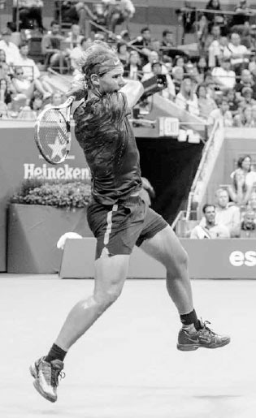

*Two-handed backhand players like Nadal don't require the forward leg push for power like one-handed backhand players do.*

Novak Djokovic and Andy Murray owe much of their success to their strong two-handed backhands. Whereas most players are limited to their forehand to take control of a baseline rally, Djokovic and Murray can also use their backhands to begin offensive shot patterns, especially with their down-the-line backhand. However, it is on the return of serve that their two-handed backhands probably have the most impact; both players have ranked near the top of the ATP return of serve statistics for almost a decade now.(1) The extra hand on the racquet allows them to effectively negate the force behind powerful serves and hit aggressive returns. In contrast, one-handed backhand players are often forced to chip or block the return and start the point in a less advantageous position.

Done correctly, the one-handed backhand is a beautiful shot and it does possess some advantages over the two-handed backhand. Since the slice backhand is a one-handed shot, one-handed backhand players usually have a stronger slice backhand because they develop more strength and coordination in their hitting arm. The backhand volley, drop shot, and defensive lob are slice backhand derivatives, and therefore, are shots often performed better by one-handed backhand players. Also, one hand can swing faster than two; as a result, the one-handed backhand often can be hit with more topspin than the two-hander. And while the majority of touring pros hit a two-handed backhand, there are star players like Stan Wawrinka and Richard Gasquet who use the one-handed version and are considered amongst the best backhand players ever to play the game.

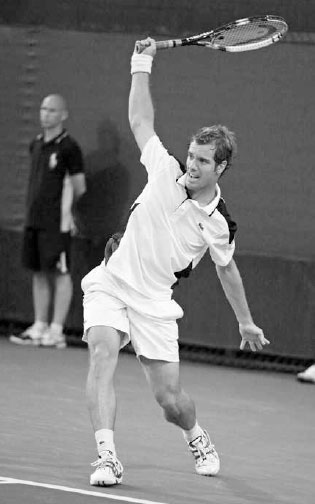

*As Richard Gasquet showcases, when done correctly the one-handed backhand is a beautiful shot.*

**1. THE HYBRID BACKHAND .**

The different advantages of the two-handed and one-handed backhand raises an interesting question: could the game evolve such that we see some players begin to use the two-handed backhand to return serve and then the one-handed backhand after the return? The introduction of a dual-purpose, or "hybrid" backhand, in the future does seem like a distinct possibility. For some players, the hybrid backhand might represent the best of both worlds --- using the two-hander to handle the speed of the serve on the return and then the extra racquet speed and variety of the onehander during the rally.

**2. WHICH BACKHAND IS BEST FOR YOU?**

Since both the one-handed and two-handed backhands have advantages, the question becomes determining which style suits you. It depends partly on age. Most juniors aren't going to be strong enough to hit a strong one-handed topspin backhand until their early teens. Therefore, the two-handed backhand is usually the shot first taught to kids.

Due to the longer development horizon, juniors who pursue the one-handed topspin backhand must be patient and have a clear long term vision of their future. Pete Sampras famously switched from a two-hander to a one-hander as a junior, recognizing that it would eventually suit the aggressive style of play he envisioned for himself. He lost some junior matches initially because of that change but certainly more than made up for it later with his seven Wimbledon singles titles. In contrast, former ATP player Paul McNamee switched from a one-hander to a two-hander at age 24. He saw his singles ranking soar soon afterwards and become the number one world ranked doubles player.

You can take game style and physical characteristics into account, but ultimately the backhand you choose is a matter of what feels more natural and reliable. Some players feel less flexible and fluent with both hands on the racquet, while others feel they need two hands to hit a dependable topspin backhand. If you are new to the game, experiment using both styles and learn from experience what works best for you.

Regardless of what type of backhand you use, because the backhand has the hitting shoulder facing the incoming ball instead of behind the body as on the forehand, several parts of the swing are different from the forehand. First, the backhand backswing is shorter and the contact is made farther in front of the body. Second, the backhand typically requires the front foot stepping into the shot to achieve good power and thus, has different guidelines on the stances. Third, the backhand hip rotation is later and smaller, resulting in the racquet taking a longer, straighter path towards the target during extension. Fourth, because the backhand is a physically weaker swing it is usually a less aggressive shot than the forehand and often takes on a different strategic role.

**II. Backhand Stances**

I will explain backhand technique starting with the legs and then working up through the body. Like the forehand, a great backhand starts with good footwork and positioning the legs well in the best stance. You will need numerous stances for the various backhand shots, especially the closed and neutral stance, and to a lesser degree, the open stance.

*Envisioning an aggressive net-rushing game style in the pros, Pete Sampras switched from a two-handed backhand to a one-handed backhand while still in the junior ranks.*

**1. THE CLOSED AND NEUTRAL STANCE**

The most powerful leg positioning on the backhand is the closed stance. In the closed stance, the front leg takes a large diagonal step forward across the body at roughly a 45 degree angle (opposite top). There are four main reasons why the closed stance generates the most power. First, the larger step produces increased force. Second, the larger step widens the base and deepens the knee bend so you can create more energy pushing up from the ground. Third, the closed stance creates a good shoulder turn that allows for a strong uncoiling of the body later in the swing. Fourth, the closed stance aligns the hips in a good position to move the racquet forward in a powerful inside-outside path towards the ball. The neutral stance, where the step forward is straighter in the direction of the net (bottom), is less powerful than the closed stance but is often needed on faster balls hit to the middle of the court.

*Nadal's closed stance produces a large, powerful step into the backhand.*

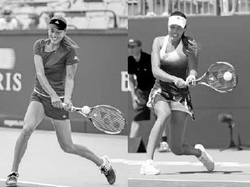

*Hitting in a neutral stance, Ana Ivanovic's cross-court backhand (left) sees her front foot less turned and back foot less behind the body than on her down-the-line backhand (right).*

TECHNIQUE In both stances, the body weight that was loaded over your left foot at the end of the backswing begins to transfer up the body as you step forward with your right foot and swing forward to meet the ball. The right foot should hit the ground a split second before contact to secure the forward momentum, push up from the ground, and stabilize the body to help the arm or arms control the racquet at ball impact.

Keep in mind, the step forward with the right foot into the shot should be more towards the net when hitting cross-court than when hitting down-the-line. This will help push your momentum towards your target. Also, the right foot on the cross-court backhand will point towards a 10 to 11 o'clock angle (bottom left) while on the down-the-line backhand, the right foot will point more around a nine to 10 o'clock angle (bottom right). These guidelines will help you attain optimal body weight transfer forward into the swing and align your hips well at contact.

The left foot will pivot in a controlled manner to the left during the forward swing. This will rotate the hips slightly and help move the kinetic energy up the body towards the racquet. The trick is not to pivot the left foot too much or too little. If the left foot pivots too much, the hips will open too soon and cause the arm or arms to bend too much at contact. If the left foot remains stationary, the hips will lock and reduce momentum into the shot.

Your balance at the end of the shot will indicate whether you hit the ball in the right position. At the end of the stroke, your weight should be solely on your right foot; after your left foot pivots to the left, your left heel should be raised up off the ground.

With the stroke complete, your left foot continues to move left and perform the recovery step. As mentioned in Chapter Seven when describing the neutral stance forehand, if you have moved quickly sideways prior to the stroke or are swinging the racquet aggressively, the recovery step will happen naturally during the follow through (opposite top). On backhands that require less movement before the swing or are more conservative, the recovery step will be later and more deliberate (opposite bottom). For recreational players who move and swing more slowly than the professionals, I prefer to see a higher level of body stability during the swing to better control the racquet at contact; therefore, the recovery step should be later and more deliberate.

Again, we can see how great strokes have similarities in technique, even as preswing movement can change body positioning and footwork. Compare Simona Halep and Murray's left leg positioning on their backhand swings (frames three and seven). Halep's sideways movement before the shot (frame one) produces an earlier recovery step (frame four) than Murray's more stationary backhand.

**2. OPEN STANCE**

While the closed or neutral stance is ideal, it is not always possible during a heated point. Sometimes you need the semi-open or open stance backhand. While rarely used by one-handed players, the semi-open and open stance backhands are important strokes for two-handed players when rushed or on wider and higher balls when stepping forward into the shot is a difficult proposition.

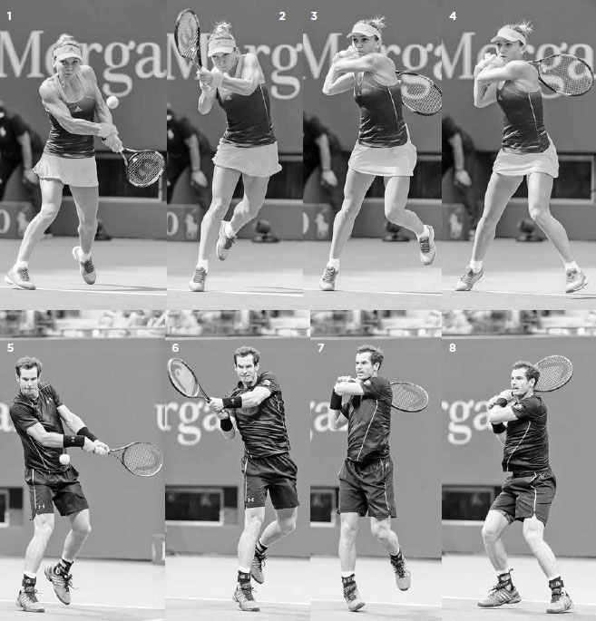

*Serena Williams plants her left leg and then unloads on this open stance backhand.*

TECHNIQUE The keys to the open and semi-open stance backhands are a big shoulder turn and planting your left foot firmly and level with, or slightly behind, your right foot (center left). The left foot establishes a strong base to transfer power into the shot. Once your left foot hits the ground, your hips and shoulders will uncoil and your weight will shift across to your right foot as the racquet swings towards the ball. After the contact and extension, you continue to rotate and finish with your weight mostly on your right foot (far right).

With the backhand stances explained, let's turn to the five upper-body phases for two-handed, one-handed, and slice backhands. Since many of the same principles of the forehand discussed in Chapter Seven apply to the backhand, the five phases are presented in shorter form.

**III. The Five Phases of the Two-Handed Backhand**

**1. UNIT TURN**

Start the two-handed backhand by pivoting with the left foot, lifting the heel of the right foot, and turning the shoulders (below). The elbows should be bent and relaxed with the racquet head pointed up at an approximately 45 degree angle above the wrists.

As you do this, prepare the grip. Most players wait with the left hand on the throat of the racquet and move it down to join the right hand on the grip during the unit turn. As outlined in Chapter Four, I recommend a continental grip with the right hand and an eastern to strong eastern grip with the left hand.

*Murray begins his backhand with the unit turn.*

  ------------------------------------------------------------------------------------------------------------------------------------------------------------------------------------------------------------------------------------------------------------------------------------------------------------------------------
  **COACH'S BOX:**
  **In Chapter Four, we discussed the importance of grips and how they affect technique; on the two-handed backhand, this impact is particularly noteworthy. Regardless of your form, you will use many different stances over the course of a match, but you should use some more often than others depending on your grip.**
  ------------------------------------------------------------------------------------------------------------------------------------------------------------------------------------------------------------------------------------------------------------------------------------------------------------------------------

On the two-handed backhand, the grip you use with the hitting hand will affect the amount of bend in your arms, which will in turn impact the contact point and stance. A weak continental grip will cause the arms to bend more and move the contact point less in front of the body (below left). In this case, the closed stance may be more comfortable. On the other hand, a strong continental grip will cause the arms to bend less and move the contact point further in front of the body (below right). In this case, the open stances may be more comfortable.

*Simona Halep and Nadal use different backhand grips, resulting in different degrees of arm bend and stance preferences.*

**2. BACKSWING**

Once the unit turn is done, use your arms and a continued shoulder turn to get the racquet to the end of the backswing. As you perform the backswing, remember to keep your arms and shoulders relaxed. The less tension in your shoulders the longer your backswing is likely to be and the more the racquet can lag and accelerate on the forward swing.

A full backswing should result in your chin resting near your right shoulder. Even though your shoulders are relaxed, your full backswing should place some tension in the back of your right shoulder to spring the racquet forward faster. The end of your backswing should be synchronized with loading weight on your back leg and moving your body into a crouched position ready to unleash the power stored in your body forward into the shot (right).

There are two main types of backswings on the backhand: the banana and the loop.

*Using the banana backswing, Djokovic drops his hands below his waist before raising them again at the end of the backswing.*

**A. BANANA BACKSWING**

The banana backswing starts with the hands going down past the waist and then backwards in a straight line before rising up slightly at the end of the backswing (below). The racquet ends the backswing slightly to the left, or "outside" of the body (next page, right), placing the wrists in a powerful position to lag the racquet when the hips rotate and perform the windshield wiper motion for additional racquet head speed and topspin.

Players who use the banana backswing typically use a strong continental or continental grip with their hitting hand. The power on this backhand is mostly generated by using the legs to push up from the ground and swinging the racquet more as a unit rather than primarily using the arms. It is the predominant backswing style on the ATP Tour and has the advantages of being compact, keeping the shoulders loose, and providing good topspin.

**B. LOOP BACKSWING**

The loop backswing starts with the hands going back in a circular fashion (below left) and ending further behind the body (below right), or "inside," than in the banana backswing. Also, as compared to the banana backswing, the arms bend more at contact and the wrists move more forward and less upwards, resulting in a flatter shot.

Players who use the loop backswing typically use a weak continental or continental grip with their hitting hand. The power on this backhand is generated more from the longer movement of the arms and hips rather than from moving the body as a unit and using the legs to push up from the ground. The loop backswing produces a powerful, flatter shot and is frequently used on the WTA.

Regardless of what style of backswing you use, at the end of the backswing the racquet should be just above waist-high and pointing slightly upward and towards the back fence (right). The edge of your racquet head should be approximately perpendicular to the ground to simplify timing and help keep the arms loose. This is the backhand equivalent of the forehand's power position. With this position established, the racquet is in a powerful slot to transition from the backswing into the forward swing.

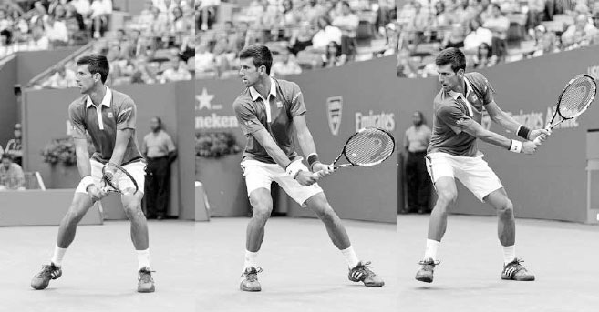

*In the loop backswing, Maria Sharapova takes the racquet back in a circular fashion (left) and "inside" (right) to end the backswing in the power position.*

*Djokovic keeps the racquet to the left, or "outside," to end his banana backswing in the power position.*

**3. FORWARD SWING TO CONTACT**

With the backswing complete, the forward swing starts by dropping the racquet down and the right foot ending its step forward by hitting the ground (opposite, far left). After the right foot hits the ground, the left shoulder and hips begin to rotate, releasing the energy stored in the legs and transferring it towards the torso, the arms, and ultimately to the racquet.

The hip rotation will allow the forearm muscles to stretch, leading the tip of the racquet to lag behind (center left). Then the right arm pulls the racquet butt cap forward towards the ball to lag the racquet for a second time.

After the right arm pulls the butt cap forward, the left arm starts to take over by turning the butt cap towards the body and releasing the racquet head forward to meet the ball (center, and far right). It is the left arm that creates most of the spin and racquet speed while the right arm's main responsibility is to help direct the shot.

The arms and wrists combine to move the racquet head in an inside-outside path towards the ball. If hitting topspin, the wrists move upward to "windshield wiper" the racquet and slightly forward as well to add power and square up the racquet at contact. As with the forehand, the swing needs to have the proper combination of the racquet head moving forward (for power) and upward (for topspin) in a single effort to produce a powerful and consistent shot.

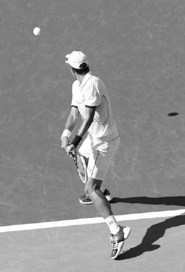

*Flavia Pennetta grounds her right foot to secure forward momentum and then accelerates a slightly closed racquet from low-to-high to drive through the ball.*

Once the wrists move upward and forward before contact, they continue upward to create topspin, but their movement forward slows down an instant before contact to control ball impact and direct the shot.

**4. CONTACT**

With your head still and eyes looking down at the ball, make contact with the ball in front of your body. Keeping your head still as you rotate your shoulders through the shot steadies your chest and provides strength and stability to your arms (left). Unless the contact point is high, your shoulders should be fairly level at contact for good balance.

  ----------------------------------------------------------------------------------------------------------------------------------------------------------------------------------------------------------------------------------------------------------------------------
  **COACH'S BOX:**
  **If you lack good extension on your two-handed backhand, practice hitting a weighted beach ball in the air from the service line. You'll find if you don't drive "through" the ball and extend fully, the beach ball won't travel the distance needed to cross the net.**
  ----------------------------------------------------------------------------------------------------------------------------------------------------------------------------------------------------------------------------------------------------------------------------

At contact, your right arm should be slightly more bent than your left arm. Slightly bent arms provide good leverage for the power created from the legs and hips. It also allows your left arm to straighten slightly and drive the racquet through the ball, helping you to hit with good extension (right). Arms that are too bent at contact will detrimentally shorten your extension, while arms that are too straight will produce a contact point too far away from your body to effectively control the racquet.

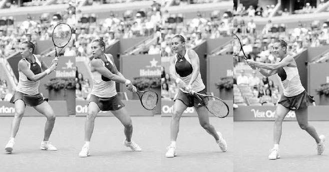

*Nadal keeps his head still and shoulders level as he makes contact in front of his body.*

Because the hitting shoulder is in the front on the backhand, the racquet takes a longer, straighter path towards the target following contact than on the forehand. If the mental image of the forehand imagines you hitting through three balls lined up in a row, the backhand increases that number to five to lengthen the hitting zone. To help you achieve this, imagine you are hitting down a bowling lane and the front pin is your target.

**5. FOLLOW THROUGH**

After hitting through the five imaginary balls, the follow through begins with the elbows bending as the racquet goes upward, to the right, backwards, and finally ends by wrapping around your right shoulder in a smooth and relaxed motion (below). Thus, the swing completes a full circuit with the left shoulder ending under the chin after beginning with than your right elbow under the chin at the end of the backswing.

On the flat to moderate topspin backhands, your should end the stroke with your left knuckles resting near your right ear, and your left elbow shoulder-high pointing towards your target and slightly higher than your right elbow.

If you're hitting the ball with extra topspin, the racquet will finish lower, with the elbows closer to the body due to the rainbow arc of the racquet head as it fans across the body.

*Immediately following contact, Kei Nishikori's left arm straightens and the racquet continues to move forward parallel to his target.*

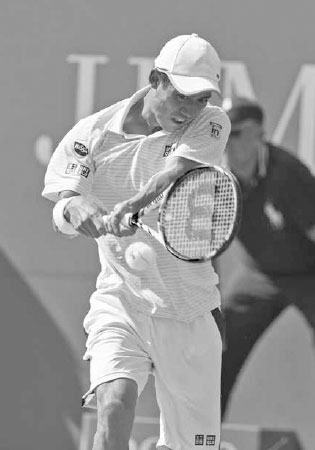

*Victoria Azarenka follows through by wrapping her racquet over her right shoulder with her left elbow shoulder-high and pointing towards her target.*

**IV. The Five Phases**

  ----------------------------------------------------------------------------------------------------------------------------------------------------------------------------------------------
  **COACH'S BOX:**
  **Imagine you are wearing a watch on your left wrist. If your two-handed backhand follow through is done correctly, you should be able to glance at your wrist and easily read your watch.**
  ----------------------------------------------------------------------------------------------------------------------------------------------------------------------------------------------

ANDY MURRAY HAS ONE OF BEST TWO-HANDED BACKHANDS the game has ever seen. It is a flat, fast, and extremely accurate shot that is very difficult to anticipate.

In the first frame, we see him set up in the perfect pose at the end of the backswing: chin above the shoulder, racquet edge pointing upward, with a wide stance for added strength and stability. He has his hitting hand in the continental grip, providing quick access to one of his favorite shots: the drop shot.

In frame two, his hips rotate to lag and his wrists drop the racquet head to initiate the low-to-high swing. In frame three, he makes contact in front of his body and drives through the ball with his head still. In frame four, we see the result of Murray's pronounced use of his left arm to increase racquet speed. Some two-handed backhand players use more left arm than others, and Murray certainly uses more than most. Here, we see how his right arm defers to his left as his left arm snaps the racquet forward to add power to his penetrating backhand. The dominance of his left arm permits him to keep his hips more steady and add disguise and deception to his shot. In frame five, Murray ends his leg drive and finishes the swing balanced with his weight fully over his right foot and left foot resting lightly on the toe. In frame six, the racquet finishes wrapped around his right shoulder with the left elbow pointing towards his target. His body ends in perfect position to perform the recovery step and return quickly to the middle of the baseline.

*Federer tilts the racquet head up and keeps his elbows bent and relaxed during the unit turn.*

Of the One-Handed Topspin Backhand

**1. UNIT TURN**

The one-handed swing is longer than the two-handed swing, so it is important to start the unit turn earlier so the backswing is full and the forward swing fluent. The left hand holds the throat of the racquet, guides the racquet back, and helps turn the shoulders. The right hand holds the racquet lightly, allowing the left hand to turn the racquet into your preferred backhand grip.

The racquet head points upward with the hands around chest-high and the elbows bent and relaxed (above). It is important to point the racquet head upward during the unit turn because it increases racquet speed when it drops down later. Many of the top pros like to point the racquet head up at around 90 degrees during the unit turn, but for recreational players I prefer to see the racquet tilted up at around 45 degrees to simplify timing.

**2. BACKSWING**

After setting up in the unit turn, the racquet begins the backswing with your hands staying around chest-high and the elbows still bent (opposite, top left). The racquet should be slightly open in order to relax the arm and get the wrist in to a powerful position to accelerate the racquet on the forward swing. At the end of the backswing, the racquet face closes and loops down (opposite, top right).

Your shoulders should turn more than your hips during the backswing, and this full shoulder turn is largely dependent on taking a full backswing. Good check points to ensure a full backswing are making sure your hands are past your hips and your chin is resting near your shoulder (below left). As mentioned with the two-handed backhand, if your backswing is full, you should feel some resistance in the back of your right shoulder; this resistance helps spring the racquet forward faster.

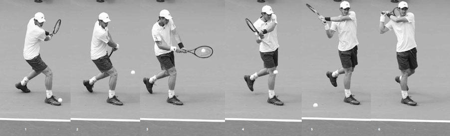

*Stan Wawrinka turns his shoulders and begins to loop the racquet down at the end of his backswing.*

**3. FORWARD SWING TO CONTACT**

As the racquet ends its loop down to begin the forward swing, the right foot hits the ground to secure forward momentum. Next, the hips rotate a small amount, causing the racquet to lag. Then the racquet butt cap is briefly pulled forward pointing towards the ball (below center) to lag the racquet some more and set it up in a powerful position to accelerate forward to meet the ball.

*Stan Wawrinka grounds his right foot to secure forward momentum and then straightens his hitting arm and swings forward, keeping his head down and still.*

As the racquet moves forward to the contact point, the wrist moves forward as well to turn the butt cap towards the body, squaring up the racquet face to the target. The wrist also moves the racquet upward to brush the ball and produce topspin (below right). Keep in mind, unlike the topspin on the forehand, which is generated largely by the wrist and forearm, a backhand's topspin is generated mainly by the rising motion of the wrist and lifting of the arm.

The arm straightens as it moves the racquet forward. Here, it is important that the elbow stays low and passes close to the torso. The dreaded "flying elbow," whereby the elbow lifts and bends on the forward swing, will cause the racquet head to drop below the wrist, limiting racquet speed and topspin. If your elbow stays low, the racquet can take a powerful inside-to-outside swing (below), and the arm will be in a comfortable position to lift the racquet head to add topspin to your shot.

**4. CONTACT**

You should make contact with the ball approximately two feet in front of your right foot with your head still and hitting arm fully extended (right). After contact, the racquet head continues to rotate upward and extend forward facing parallel to your target and remaining on the left side of your body.

As your right arm moves forward after contact, your left arm is going backward and remains behind the body in order to enhance balance and slow down and limit the hip rotation. The hips can rotate slightly, but any excessive movement of the hips will shorten extension and result in a shot that lacks power and control. The hip rotation is small, especially when striking a backhand down the line. On the cross-court backhand, the contact point is farther out in front of you and the hips will rotate more.

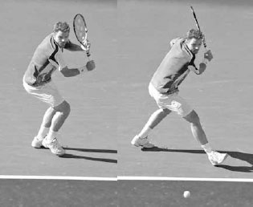

*Federer's low-and-close-to-the-body elbow positioning produces a powerful inside-to-out-side swing and helps him add topspin to his backhand.*

*Richard Gasquet makes contact well in front of his body with his racquet moving forward parallel to his target.*

**5. FOLLOW THROUGH**

After the racquet extends parallel to the target, it closes and fans up and across to the right (left). Here, a straight right arm indicates good extension and racquet speed through contact. At the end of the stroke, your right hand should finish slightly above eye level with the butt cap facing towards the net and your left arm behind the body (right). The racquet should stop to the right of your head between a one o'clock and two o'clock position, depending on the direction and power of your backhand.

**V. Slice Backhand**

DESPITE THE DOMINANCE OF TOPSPIN in the modern power game, the slice backhand remains an essential shot. In today's game, many players are most comfortable when they are in a routine of hammering chest high topspin balls. The slice backhand can keep the ball low and out of an opponent's preferred strike zone, upsetting their rhythm by changing the speed and trajectory of the ball from previous topspin shots.

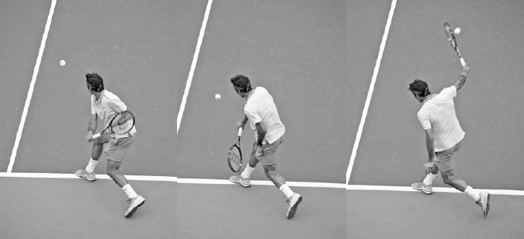

*The best one-handed backhands are long, sweeping motions. Here, Federer finishes his one-handed backhand with his hitting arm high and fully extended.*

  ------------------------------------------------------------------------------------------------------------------------------------------------------------------------------------------------------------------------------------------------------------------------------------------------------------------------------------------------------------------------------------------------------------------------------------------------------------------------------------------------------------------------------------------------------------------------------------------------------------------------------------------------------------------------------------------------------------------------------------------------------------
  **COACH'S BOX:**
  **Every topspin groundstroke involves some "release" (or lag) for power as well as some "hold" for control at contact. A stiff swing that doesn't release will lack good acceleration, while an overzealous swing is an inconsistent one. Strong baseline players are able to use the right amount of each depending on their intentions and the situation. When hitting aggressively on a slow ball or using heavy topspin, their swing will involve more release, and when receiving a fast ball or using less topspin, their swing will be more deliberate. Evaluating the circumstances and finding the correct release/ hold ratio on groundstrokes is a key factor in hitting with controlled aggression --- a winning style of play at any level.**
  ------------------------------------------------------------------------------------------------------------------------------------------------------------------------------------------------------------------------------------------------------------------------------------------------------------------------------------------------------------------------------------------------------------------------------------------------------------------------------------------------------------------------------------------------------------------------------------------------------------------------------------------------------------------------------------------------------------------------------------------------------------

IT IS RARE THAT A PLAYER HAS THE ONE-HANDED BACKHAND as their main weapon, but this is the case with Richard Gasquet. His one-handed backhand has tremendous power and spin, allowing him to dictate baseline rallies and bringing him a top ten world ranking.

Gasquet ends his backswing higher than most pros. This can complicate timing, but for players as skilled as Gasquet, it leads to greater racquet acceleration due to the racquet dropping faster into the beginning of the forward swing. In the first frame, his full backswing pulls his right shoulder back and correctly places his chin resting over his right shoulder. In the second frame, Gasquet's right foot hits the ground to secure the momentum attained from stepping forward. Notice how his right foot is positioned at a 45 degree angle to the net to place his hips in a perfect position for a cross-court backhand. His wide stance not only makes the forward step longer and more powerful, but also adds support to the torso, allowing the arms to swing with greater force. In the third frame, his arm continues to straighten and stays close to the body. His racquet gathers more speed as it drops and begins its inside-to-outside path to the ball. In frame four, we see Gasquet's racquet head lag his hand before contact. From this point of the swing the shoulder will move the racquet forward, but it is primarily the movement of wrist and forearm that accelerate the racquet head with explosive speed towards contact. In frame five, Gasquet keeps the racquet on the left side of his body and extends the racquet forward to his target. Notice how his racquet has rotated up between frames four and five, adding topspin to his shot for better control. In frame six, Gasquet's racquet fans to the right with his arm fully extended as he performs the follow through. As his shoulder continues to uncoil, he keeps his hips stationary by moving his left arm backwards. It is only with the stroke completed that Gasquet looks up to see his shot and begin the recovery process.

More importantly, unlike the topspin backhand, a good slice backhand can still be hit with the front leg doing a sideways step parallel to the baseline (opposite). This is why this shot is such an effective defensive shot; it can be hit well while moving sideways with little or no forward momentum. Additionally, on a wide, difficult shot, the later contact point of the slice backhand allows more time to hit the ball, and because the backspin gives the shot less pace, it also provides more time to recover. A slice backhand is useful in many other situations. It can be utilized as an aggressive approach shot that creates a low skidding ball, forcing your opponent to attempt a difficult passing shot, or to draw your opponent forward inside the baseline to open the court for your next shot. It can also lead to well-disguised drop shots. After setting up in the regular slice backhand backswing, you can quickly change the arc of the forward swing to play a camouflaged drop shot. It is not just a versatile shot; it also requires less strength, timing, and set up time than the topspin backhand. This makes it an easier shot to execute in many ways. As a result, slice backhands are hit more often than topspin backhands at the recreational level.

Because the slice backhand is used a great deal, unlike the infrequently utilized slice forehand, a thorough explanation of the five phases of its swing is warranted. This shot has a great deal of uniformity with regard to style and there is little controversy in regards to recommended technique. For instance, players like Djokovic and Federer may have noticeable differences in their topspin forehand technique, but the differentiation in their slice backhands is more nuanced.

Feliciano Lopez sets up for his slice backhand by turning his shoulders and preparing the racquet.

**1. UNIT TURN**

Begin the slice backhand by placing your right hand in the continental grip and your left hand on the throat of the racquet. Like any shot, the grip is key. If you use an eastern forehand grip, the racquet face will be too open and the shot will lack power. If you use the eastern backhand grip, your elbow will lift on the forward swing and cause your racquet head to drop too much at contact. After establishing the continental grip, turn your shoulders, open the racquet face, and place it around shoulder height (opposite).

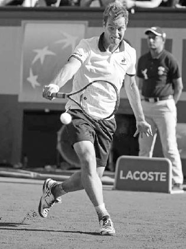

*Federer ends his slice backhand backswing with his arm slightly bent and racquet shoulder-high.*

**2. BACKSWING**

After setting up in the unit turn, take the racquet back and rotate your body so that your chest is facing towards the side fence and your head is looking over your right shoulder as you line up the shot. The racquet should be around shoulder height at the end of the backswing with your right arm bending slightly, forming a V-type shape. Your racquet face should be open, while the racquet itself should form an L-shape with the forearm and be roughly parallel to the baseline (above).

**3. FORWARD SWING TO CONTACT**

With the racquet face open and positioned above the contact at the end of the backswing (left), drive the racquet forward with the front of your shoulder while straightening your arm and keeping your wrist firm (center). If you are too close to the ball, your elbow will bend and the racquet head will drop below your wrist, causing a loss of power and control. Unless the ball is low, keep the racquet head above the wrist at contact and aim to hit slightly around the outside of the ball.

Unlike the low-to-high arc of the topspin backhand, the arc of the slice backhand swing mimics a hammer-like shape moving from high-to-low and back to high again (below). However, if you are trying to hit with greater spin, the racquet will start higher and the downswing will take a sharper angle. The height of the ball will also have an effect on the racquet path. The higher the ball, the sharper the decline; lower balls will have a more level swing path.

Besides the arc of the swing, there are two other significant differences to consider when comparing the forward swing on the slice backhand to the topspin backhand. First, in contrast to the topspin backhand, as the racquet moves forward, the power derived from the hip rotation and the stretching and contraction of arm muscles are needed much less. Here, the hips remain still and the wrist and forearm move very little as the arm goes forward to hit the ball. Second, the topspin backhand requires time after the foot hits the ground to unload energy upward from the legs into the swing. The slice backhand doesn't require the same unloading of energy, therefore, the forward step should be slightly later and make greater use of forward linear, rather than upward angular, momentum.

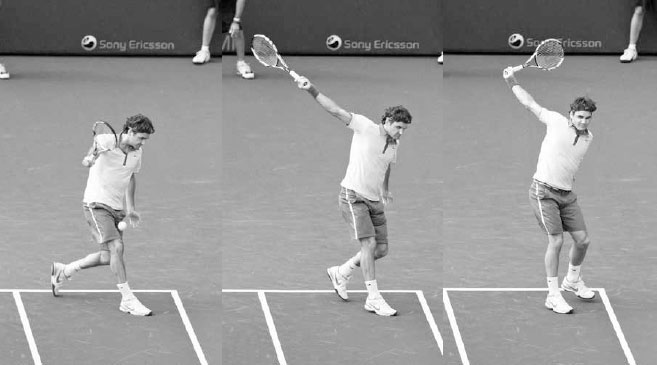

*Richard Gasquet's racquet follows a hammock-shaped path on this slice backhand.*

**4. CONTACT**

The racquet face that was open to begin the forward swing (opposite left) squares up to the ball, becoming almost perpendicular to the ground at contact (right). Opening the racquet too much at contact is a mistake I commonly see players make, causing them to pop the ball up without much pace and control. It is important to understand that you don't have to force the backspin with a sharp swing down and a very open racquet face. The backspin will happen naturally with a gentle angle down and slightly open racquet face.

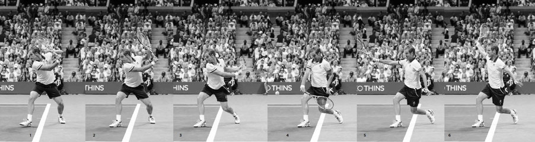

*Roberta Vinci drives the racquet forward with her shoulder by straightening her arm and keeping a firm wrist.*

The contact point on the slice backhand will be less in front and farther away from the body than the contact point for the topspin backhand. The contact point will vary depending on the direction of the shot, but generally speaking, it should occur a foot or less in front of the right leg, compared to the approximately two feet in front when hitting a one-handed topspin backhand.

After contact, the racquet head opens and drops as it continues its high-to-low path forward (above). The left arm moves backwards for balance and helps you push the racquet towards your target. If your left hand comes forward, your hips will swivel and the racquet will pull too quickly across to the right. Your head should stay steady and should move only after driving through the ball, when it comes up to see the location of your shot.

  ----------------------------------------------------------------------------------------------------------------------------------------------------------------------------------------------------------------------------------------------------------------------------------------------------
  **COACH'S BOX:**
  **A common issue on the slice backhand is chopping down too sharply through contact. To help players who swing this way, I ask them to imagine they have a glass table underneath their slice backhand swing path and perform their swing in a more level way that skims, not breaks, the table.**
  ----------------------------------------------------------------------------------------------------------------------------------------------------------------------------------------------------------------------------------------------------------------------------------------------------

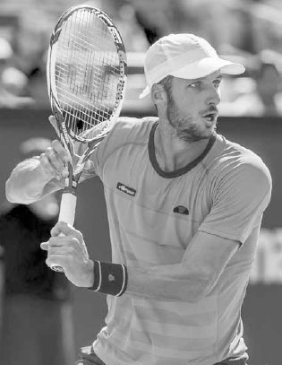

*Djokovic squares up his racquet face for contact and moves his left arm backwards to assist balance.*

FEW PLAYERS HAVE EVER HIT THE SLICE BACKHAND with as much speed and spin as Roger Federer. His slice backhand has even more ball revolutions than his feared topspin forehand.(2) Use of this shot often leads to short balls that allow him to move forward and attack.

Federer defends this wide ball with a long, powerful stride parallel to the baseline. One of the big advantages of the slice backhand is that you can step sideways and still hit a great shot. In frame one, he sets up with his shoulders turned, elbows bent and relaxed, and the racquet open and shoulder-high. Notice how he maintains good balance by keeping his head upright, back straight, and shoulders level. In the second frame, the racquet begins its forward and downward movement to the ball. In the third frame, his foot hits the ground and he leans into the shot to add power to his swing. In frame four, driving the racquet forward with his shoulder, he makes contact with his arm straight and hips perpendicular to the net. The racquet that was very open at the end of the backswing is now substantially less so. Federer hits his slice backhand with tremendous spin and therefore his racquet must rotate sharply. Between frames three and five, his racquet head has rotated down over 180 degrees; for recreational players, I recommend a smaller racquet rotation to simplify timing and improve shot depth and consistency. In frame five, the ball is gone but his eyes are still focused on the contact point; no one watches the ball better than the Swiss champ. Federer finishes the swing with his right and left hand in the same position on opposite sides of his body, enhancing balance and expediting the recovery process.

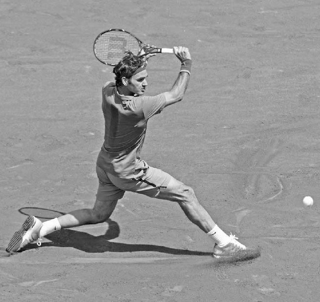

*Grigor Dimitrov's racquet opens and continues to drop after contact.*

**5. FOLLOW THROUGH**

There is a natural grace to the follow through as the arms lift along a perpendicular axis and end pointing in opposite directions. The racquet should finish shoulder-high and point outward towards your target (below). Due to the later contact and compact nature of the slice backhand swing, your hips and back foot will stay fairly steady during the follow through. Your weight should be resting solely on your right foot, and after finishing the swing, step around with your left foot and begin the recovery.

**VI. Backhand Practice**

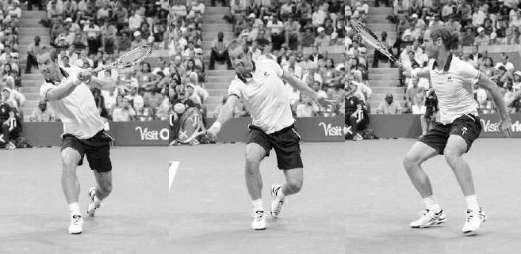

*Grigor Dimitrov finishes his slice backhand with his racquet shoulder-high and pointing towards his target.*

**1. BACKHAND HOLD**

Goal: Improve the down-the-line backhand to defend against the inside-out forehand.

Feed a ball to your practice partner from the baseline to the backhand side of the court. Your practice partner must return the ball with an inside-out forehand. Respond by hitting your backhand down the line, and then play out the point. The first player to 11 points wins the game, and then switch roles.

**2. SPANISH DRILL**

Goal: Learn to fight and succeed in long baseline rallies.

Begin with a deep feed to your practice partner then play out the point, counting how many times the ball crosses the net. When the point ends, the winner of the point gets as many points as the number of times the ball crossed the net. The longer the rally goes, the more intense the point will become. The first player to 50, 75, or 100 points (depending on skill level) wins the game. If a player makes an error with their backhand, the other player scores an additional five points.

BACKHAND NUTSHELL SUMMARY: COMMIT THESE FOUR IMAGES TO MEMORY

**3. ZIG ZAG**

Goal: Improve the ability to change stroke direction during a baseline rally.

From the baseline, hit only cross court while your practice partner hits only down the line. Play a game to 15 points where each of you must hit the ball into the correct half of the court or you lose the point. Then switch roles. Variation: If a player hits their ball into the wrong half of the court, the other player has the option to stop play and win one point or continue the point using the full court, with the winner receiving two points.

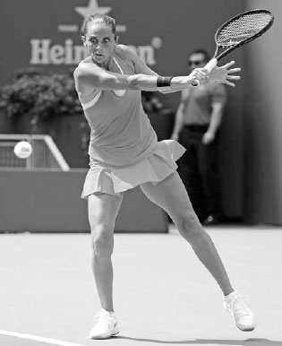

*Murray frequently uses the drop shot to draw his opponent out of position.*
