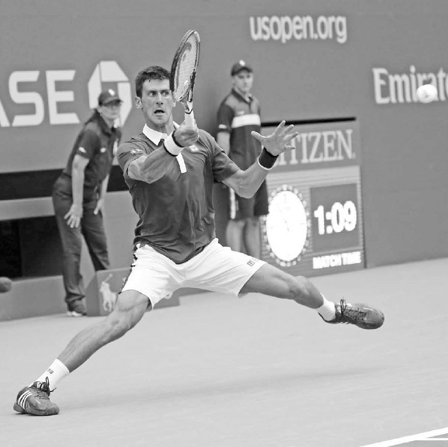
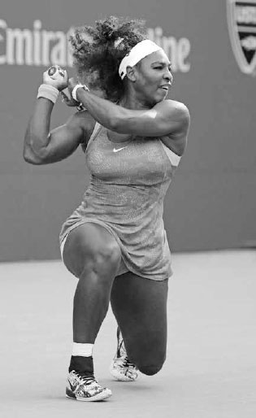
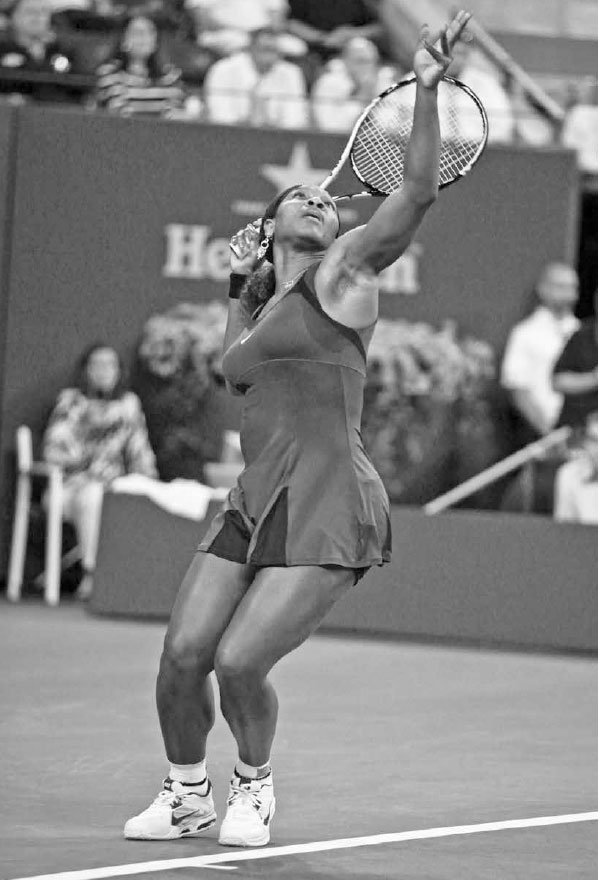

# Balance

Over the course of a match, you will sprint, jog, skip, shuffle, lunge, and jump in a variety of directions before, during, and after swinging the racquet. Certainly, tennis is a very athletic sport and knowing how to properly use your body to make your game as powerful and precise as possible is key. Thus, before discussing the strokes, the first three chapters are dedicated to the "anatomy" behind the strokes --- balance, the kinetic chain, and movement.

A strong and reliable stroke starts with establishing good balance --- keeping your back reasonably straight, shoulders level, and head upright --- as you play the shot. Legendary coach Welby Van Horn said it well when he wrote, "Balance is the picture frame in which the picture (the stroke) is placed."¹ I believe it is important to conceptualize stroke production in this manner and understand that good balance leads to a rhythmic, consistent, and powerful stroke with less strain on the body. Of course, tennis is a game of near-constant movement, so you must learn dynamic balance, that is, establishing balance on the move.

*Novak Djokovic is famous for the near leg splits he does during difficult situations to secure the balance needed to hit a forceful and controlled shot.*

While balance may not be your first concern on the court, professional players know that to have superb racquet skills and movement, they must possess it --- even under duress. Novak Djokovic, for example, is famous for the near leg splits he does during difficult situations to secure the balance needed to hit a forceful and controlled shot (opposite). He spends many hours each week working on his flexibility, partly to enhance his ability to establish good posture during a challenging rally. He knows, even as talented and skilled as he is, that he is likely to hit a weak shot if he fails to get balanced during the stroke.

In this chapter, I describe the various ways balance impacts your play and the important link between your center of gravity and balance. Next, I explain how your leg, arm, and head positioning influence your equilibrium and finish with exercises designed to improve your balance.

**I. How Does Balance Impact Your Game?**

Your degree of balance will impact many facets of your game, including rally ascendancy, stroke power, racquet control, vision, and recovery.

**1. RALLY ASCENDANCY**

The degree of balance you and your opponent have while hitting the ball will largely determine who is ahead in the rally. Your primary goal during baseline play is to move your opponent around the court and force them to hit off balance and defensively while you hit in a poised position and control the point.

**2. STROKE POWER**

As will be explained in greater detail in Chapter Two, it's very difficult to generate stroke power with your legs if you are off balance. Leaning too far forward, backward, right, or left during your swing limits your ability to set your feet and push forcefully from the ground.

**3. RACQUET CONTROL**

**It is challenging to obtain a precise racquet head angle when you are off balance. When you lean, the angle of your hand in the grip stays consistent, but the angle of the racquet in relation to the ground changes. Therefore, if you lean backwards the racquet will open, often causing the shot to sail long. Or, if you lean forward the racquet will close, often sending the ball into the net. Similarly, tilting to the right or left can make the ball veer too far in that direction.**

*Even when Serena Williams is forced to hit with one leg either near or well off the ground, she still maintains good posture, helping her hit the ball with power and control.*

Not only does being off-balance alter the angle of the racquet relative to the ground, but it also pushes body weight in unintended directions, a change that must be taken into account and adjusted for quickly during the swing in order to salvage the shot.

**4. VISION**

**The more upright and steady your head is, the better your visual tracking will be. If your head tilts from being off balance, it can cause a miscalculation of the height, speed, and distance of the incoming ball and hurt your ability to position yourself well and time your swing. Watch the top players and observe how they keep their head upright and still when preparing for their shots (right). This head position assists their vision and judgment, helping them establish correct positioning to the ball and good timing on their stroke.**

**5. RECOVERY**

Tennis is a game centered on movement and time management. The more balanced you are during the follow-through, the better you will be at resisting the forces of momentum, allowing you to change direction and recover more quickly for the next shot. **For example, leaning to the right while finishing a wide forehand, instead of being balanced and having your weight neutral, will slow down your movement to the left and your ability to get back to the middle of the court.**

*Jo-Wilfried Tsonga's good balance sees his head upright and steady as he sets up for this forehand. This helps his eyes feed good information to his brain regarding the incoming ball's speed and trajectory.*

  -------------------------------------------------------------------------------------------------------------------------------------------------------------------------------------------------------------------------------------------------------------------------
  ***NOTE:** For the sake of simplicity, when describing footwork, swings, and grips throughout the book, I will be using the words "right" and "left" in the context of a right-handed player. Left-handers, please switch "right" with "left" and "left" with "right."*
  -------------------------------------------------------------------------------------------------------------------------------------------------------------------------------------------------------------------------------------------------------------------------

*Rafael Nadal widens his stance and stretches his arms in opposite directions, helping him keep his center of gravity between his feet and maintain balance on this challenging shot.*

**II. Balance and Your Center of Gravity**

To put it in scientific terms, attaining good balance is dependent on placing your center of gravity (COG) over the middle of your base of support.

**What does that mean? Your COG is the point in your body where your body weight is evenly distributed. Because we have a little more weight in the top half of our bodies, our COG is located just above the waist. Your legs provide your base of support. Therefore, establishing good balance means keeping your torso aligned with the middle of your legs. And how do you do that? By adjusting the width of your stance, moving your arms in different directions, and keeping your head upright. Let's discuss in greater detail.**

**1. LEG POSITIONING**

The best leg positioning depends in large part on the height of the incoming shot. The lower the ball, the wider your stance should be to keep your COG positioned above the middle of your legs and support equilibrium during the swing (opposite). As you widen your stance, you lower your COG and your base of support becomes larger and stronger. On balls hit above your head, the opposite should occur and your stance should narrow.

Bending your knees is also important for balance, especially on low balls. If you don't bend your knees and bend at the waist instead, your COG will move in front of your legs on low balls, causing you to tilt forward and stumble.

Keep in mind, your right and left leg will take on different roles during the swing to enhance balance. Many shots in tennis require one leg to anchor the stroke while the other leg pivots to balance out the body. **For example, on most backhand groundstrokes, the right leg will anchor the body while the left leg swings around to the left for balance (below). The movement of the left leg also allows the hips to rotate and weight transfer to happen fluently, as well as expediting the return to the center of the court.**

  -------------------------------------------------------------------------------------------------------------------------------------------------------------------------------------------------------------------------------------------------------------------------------------------------------------------------------------------------------------------------------------------------------------------------------------------------------------------------------------------------------------------------------------------------------------------------------------------------------------
  **COACH'S BOX:**
  **In tennis, it is important to know how to use your body to maximize strength and balance. I sometimes illustrate the strength and balance that can be gained from using a wide stance by doing the "push" test with my students. To do the push test, stand with your feet side by side. Then, have someone push your shoulder firmly from the side; you will quickly lose your balance. Next, place your feet well outside your shoulders and have the person push your shoulder from the side again. This time, because you have a lower center of gravity and stronger base, you will remain stable.**
  -------------------------------------------------------------------------------------------------------------------------------------------------------------------------------------------------------------------------------------------------------------------------------------------------------------------------------------------------------------------------------------------------------------------------------------------------------------------------------------------------------------------------------------------------------------------------------------------------------------

*Stan Wawrinka's backhand sees him anchor his right foot while his left foot pivots to secure balance.*

*\[Photo not present in the extracted image set --- caption kept for reference\]*

+---------------------------------------------------------------------------------------------------------------------------------------------------------------------------------+
| **Pivot**                                                                                                                                                                       |
+---------------------------------------------------------------------------------------------------------------------------------------------------------------------------------+
| ***noun** the central point, pin, or shaft on which a mechanism turns or oscillates. Similar: fulcrum, axis, axle, swivel, pin, hub, spindle, hinge, pintle, gudgeon, trunnion* |
|                                                                                                                                                                                 |
| ***verb** turn on or as if on a pivot. "He swung around, pivoting on his heel." Similar: rotate, turn, revolve, spin, swivel, twirl, whirl, wheel, oscillate*                   |
+---------------------------------------------------------------------------------------------------------------------------------------------------------------------------------+

***The non-hitting arm plays an important role in establishing balance. Federer raises and drops his left arm on his serve, and Caroline Wozniacki moves her left arm right-to-left on her forehand.***

*\[Photo not present in the extracted image set --- caption kept for reference\]*

**2. TORSO POSITIONING**

**The torso is both the heaviest part of your body and the location of your COG, so its positioning is crucial to your balance. Because the torso itself is immobile, it is necessary to rely on the positioning of the legs and arms to get it in equilibrium.**

Just as tightrope walkers use their arms for balance, so too should tennis players. For example, on the one-handed backhand, as you swing forward with the right arm, the left hand should move backward to equalize the body's weight distribution (see Wawrinka, previous page). This not only enhances good posture in the torso, but also supplies anchoring counterpoint strength, or a base, for the right arm to push off, giving the shot more power and accuracy.

*On the serve, the left arm moves up to toss the ball and then moves down as the racquet swings up at the ball. This motion balances the body as well as acting as a source of counterpoint strength.*

On the forehand, the left arm moves to the right during the backswing and then to the left on the forward swing. This equalizes weight distribution to help keep the torso upright as well as coil and uncoil the body to create power.

**3. HEAD POSITIONING**

While the head may only weigh 8 to 12 pounds, a 30-degree tilt makes it feel like a 40-pound weight, significantly affecting your balance. Therefore, **it is important that your head remains upright and aligned correctly with your COG during the swing.**

**III. Balance Practice**

It takes extensive practice to be able to move quickly while maintaining the balance that allows you to strike the ball well. In Chapter 16, I provide some agility and flexibility exercises that will help your balance. For now, here are four on-court training exercises.

**1. MODIFIED MINI-TENNIS**

Either place a pencil behind your ear or hold a small cup of water in your left hand. Then, hit slowly with a partner inside the service boxes. Gently hit the ball back and forth with good posture, trying not to allow the pencil to fall to the ground or the water to spill.

**2. LOOSE HAT CATCH**

Put your racquet aside. With a hat sitting loosely on top of your head, stand 15 feet from your partner. Have your partner throw a ball in various directions. Catch the ball after one bounce and then toss it back. The goal is to keep the hat from falling off your head by moving smoothly and keeping your head upright. After successfully catching 15 throws, switch roles with your partner.

**3. FREEZE TECHNIQUE**

The freeze technique helps analyze balance and highlight what may need to be rectified to improve it. Ask your practice partner to feed a ball once every five seconds to random locations around the court. End each swing in a motionless position and hold, or "freeze," for three seconds. If you are wobbly or uncomfortable while "freezing," you either didn't pivot your back foot correctly during the swing or were positioned too far away from or too close to the ball.

**4. ONE-HANDED VOLLEYS**

With you and your practice partner standing 12 to 15 feet from the net, hit volleys back and forth with your left arm resting behind your back. Without the help of the left arm to assist balance, this drill will emphasize the importance of bending your knees and widening your stance to keep your equilibrium.

Please note there are many off-court fitness exercises that can improve your balance. Performing gym exercises on unstable surfaces (like doing squats on a BOSU ball or sit-ups on a stability ball) will improve your balance by activating the small stabilizer muscles in your ankles, knees, and core. Also, doing gym exercises that increase the range of motion in your muscles with flexibility exercises will help condition your body to maintain balance, especially when stretching for challenging shots.

*Serena Williams coils her body on her serve before uncoiling it and unleashing the kinetic chain --- the subject of Chapter Two.*

*\[Photo not present in the extracted image set --- caption kept for reference\]*
