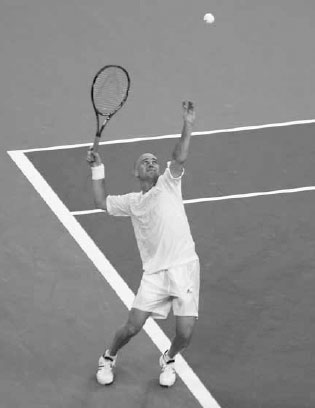
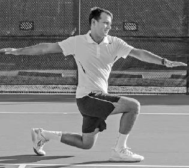
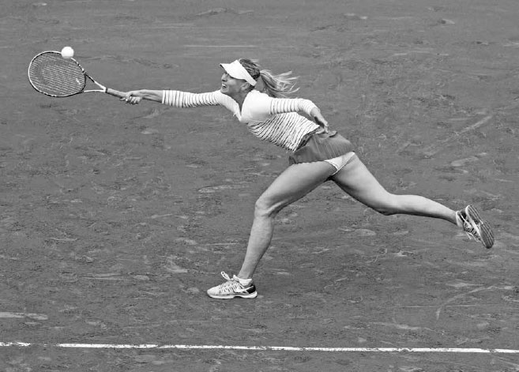

# Fitness

Fitness underpins every aspect of tennis, and while it has always been a crucial part of the game, in the modern era it has become even more important. This is especially true on the professional tour. The pros are using their incredible fitness to cover the court and extend points like never before. ATP player Janko Tipsarevic spoke of how difficult it can be to win a rally, "It takes five winners to finish a point. One point now seems like a full work-out."(1) The grueling rallies have made a long professional singles match one of the most physically and mentally exhausting experiences in all sports. Take the six-hour 2012 Australian Open Final between Nadal and Djokovic, in which chairs were carried onto the court for the trophy presentation because both players were so fatigued they could barely stand. The pros fully understand the increased physicality of the game and now spend almost as much time working out off the court as they do on the court hitting balls. Some top players even hire teams of fitness experts that include a conditioning coach, nutritionist, and physiotherapist in a effort to gain an advantage over their competitors.

There are many examples of professional players whose rankings have soared after taking their fitness to new heights. After experiencing a mid-career slump, Andre Agassi took to the gym daily and ran up hills in Las Vegas' searing heat in between tournaments. He went on to win five of his eight Grand Slam titles after he turned 28, an age typically associated with a decline in a player's skills and speed.

Agassi attributed his late career success to his improved fitness. He knew his faster movement permitted him to reach more shots balanced and his improved endurance allowed him to remain energetic even at the end of a very long match. This meant he could win points by encouragingextended rallies and exhausting his opponents, leading them to resort to low percentage shots. He said, "If your body is weak, it tells you what to do. If your body is strong, it will actually listen to you when you tell it to do something."(2) Obviously, recreational players don't need to dedicate their lives to fitness the way Agassi did, but there is a good lesson to be learned for players of all abilities: improving your fitness will significantly improve your performance.

Tennis is a uniquely athletic sport that requires a special type of fitness. Tennis players need agility to maintain balance on a difficult volley or wide ball, quick bursts of speed to run down shots hit all over the court, and the endurance to last a long match. In addition, they need to be flexible and strong from head to toe. On most shots, the energy is transferred up the body, building such that each body segment benefits from the movements and power of the previous body segment, utilizing the kinetic chain. Being inflexible or weak in one body part will reduce the power gathering and moving to the next body part and result in a less forceful shot.

*Andre Agassi won most of his Grand Slam titles after devoting himself to improving his fitness late in his career.*

It is not surprising then, knowing the full body nature of tennis and the variety in type and intensity of movements it requires, that tennis is considered one of the best sports to play to improve one's overall health and fitness. A study released by the British Journal of Sports Medicine found that people who played racquet sports had the lowest risk of death of all sports participants surveyed in the study.(3) As former U.S. Open Champion Samantha Stosur once said, "Tennis takes care of everything. It requires agility and quickness to get to the ball, core strength to get power into your shots, and stamina to last for an entire match. In addition to toning your arms and shoulders, it's a total body workout for your legs and abs, and works your heart and core unlike any other sport."(4) In this chapter, I will explain six components of fitness that are crucial to tennis players: flexibility, agility, quickness, core stability, strength, and endurance. I share exercises that will help you improve these components, including 15 flexibility exercises and four exercises each for the other five components. There are hundreds of exercises that can help you improve your fitness in these areas: I have provided some samples that have worked well for my students. Your job is to mix up your workout routine with an assortment of exercises and to tailor your fitness regime to your age andfitness level. As with any fitness program, please consult your physician before using the exercises listed in this book. After explaining the six components of fitness, the chapter concludes with a section on nutrition and hydration that will help you choose the right fuel for your body to feel energetic all match long.

**I. Flexibility**

NOVAK DJOKOVIC'S FLEXIBILITY sets him apart from other top ATP players. He stretches throughout the day and sometimes spends more than two hours stretching, knowing it helps him recover more quickly after matches and increases the chances of him having a long career. On the court, the benefits are immediate and obvious. His flexibility allows him to contort his body into different shapes under duress while still maintaining balance, enhancing his ability to control the racquet and hit an effective shot. His flexibility also allows him to hug the baseline during the point and "shrink" the court; he achieves this by doing near splits to cover his opponents' best shots and extend rallies, pushing his opponents to hit harder and harder and aim closer to the lines, ultimately forcing errors. The role of Djokovic's flexibility in his success has highlighted the value of being limber and motivated many of his peers to become as physically elastic as possible.

*Djokovic prides himself on being extremely flexible and works on it constantly. He has been known to continue casual conversations with friends while resting his leg on their shoulder to stretch.*

Flexibility is not only crucial for the top professionals; it is necessary for players of all levels. I'll discuss the advantages of flexibility in greater detail before moving on to different types of stretching.

**1. ADVANTAGES OF FLEXIBILITY**

**A. MORE POWER**

Any restrictions in elasticity will limit your range of motion and the amount of power your muscles can generate during the swing. The serve is a good case in point. The longer the shoulder muscles can stretch on the serve, the stronger the force produced when the muscle contracts. Also, greater shoulder joint flexibility will produce a longer swing path to build up racquet speed from the bottom of the racquet drop to contact.

**B. IMPROVED BALANCE**

Greater flexibility allows you to stay balanced in challenging situations. For example, when reaching for a low, wide shot, being flexible through your core will allow you to widen your stance, keep your balance, and thus control the racquet well. After playing that low, wide shot, it will also allow you to drop your body down and load up good power in the legs to change directions and recover quickly back to the middle of the court.

*Serena Williams' dedication to stretching is plain to see at the end of this point at the 2015 U.S. Open.*

**C. LESS INJURIES**

Flexibility is also important in reducing injuries, lessening the likelihood of tears and pulls by lengthening the muscles and providing a good framework for strengthening the muscles and joints that experience extreme motions. Tennis involves a wide range of movements, such as hip rotations on groundstrokes, abdominal and back twisting on the serve, start and stop movements that put pressure on the knees and groin, explosive running using the various leg muscles, and elbow extensions and wrist flexions during the swinging of the racquet. Therefore, players need to be flexible throughout their whole body to reduce the chance of injuries.

Flexibility also reduces the strain of opposing muscle groups. Tight muscles cause limited range of motion, and when a primary muscle can't move properly, other muscles must work harder to support it. In the short term this means muscle tension and fatigue. More seriously, over the long run this often turns into muscle imbalances, inflammation, and injuries. Another consideration specific to tennis players is that the constant use of the racquet arm can cause imbalances in the muscle structure. Consequently, tennis players must maintain elasticity equally throughout their bodies to keep the potential problems associated with muscle imbalances to a minimum.

**D. SPEEDS RECOVERY PROCESS**

Stretching after your match or practice session will reduce inflammation, lengthen and relax your muscles, and leave you feeling less sore and stiff the following day.

**2. DYNAMIC AND STATIC STRETCHING**

There are two basic types of stretching that contribute to increased flexibility. Both have an important place in a tennis player's warm up and cool down. The first type of stretching is "dynamic stretching," or exercises that increase blood flow and range of motion before you play. Dynamic stretching should be done only after some general activity that raises the body temperature. A good example of this sequence would be to jog lightly for three to five minutes, then do eight to 10 minutes of dynamic stretching.

The second type is "static stretching." Static stretching is done as part of your cool down and involves stretching a muscle or group of muscles to a point of tension and holding the stretch. After a practice session or a match, you should dedicate some time to static stretching to prevent injury, increase flexibility, and prevent muscle soreness.

For your static stretching to be safe and effective, there are several points to remember. First,emphasize slow, smooth movements and coordinated deep breathing. Inhale deeply through your nose and exhale through your mouth as you stretch, then ease back gradually. Hold the static stretch position for 20-25 seconds as you breathe normally. Second, you should feel no pain. If it hurts or if you feel intense burning, you are stretching too far. Third, do not lock your joints and do not bounce. Instead, keep a nice steady stretch. Lastly, try to make stretching a daily routine and stay consistent to achieve the best results and maximum flexibility of your body.

  ---------------------------------------------------------------------------------------------------------------------------------------------------------------------------------------------------------------------------------------------------------------------------------------------------------------------------------------------------------------------------------------------------------
  **COACH'S BOX:**
  **Too many recreational players jump onto the court for a practice session and spend little time getting their body prepared for the rigors of playing tennis. Make sure that before you hit your first ball, your heart rate is slightly elevated and you are sweating lightly. Also, I recommend doing shadow swings for all the shots for a minute or two to warm up the arm and shoulder muscles.**
  ---------------------------------------------------------------------------------------------------------------------------------------------------------------------------------------------------------------------------------------------------------------------------------------------------------------------------------------------------------------------------------------------------------

**A. DYNAMIC STRETCHES**

**1. CARIOCA STEPS:**

Your left foot crosses in front of your right, then your right foot steps right, then your left foot crosses behind your right, then your right foot steps right. Move across the court several times from doubles alley to doubles alley. Next, face the opposite direction and repeat.

**2. POWER SKIPS:**

Skip across the court several times lifting the opposite arm and leg on each step, i.e. raise your right knee towards your chest and left arm in the air and right arm in the air when you lift your left knee.

Carioca step

**3. LUNGE AND TWIST:**

Take a large step with the leading leg and drop the trailing leg towards the ground until both knees are at around 90 degrees. Raise your arms up to shoulder and rotate upper body in a circular fashion. Stand up, progress to the next lunge and move back and forth across the court two or three times.

Lunge and twist

**4. ARM CIRCLES:**

Stand up and lift your right arm straight out to your sides at shoulder height. Move your right arm forward in small circular motion for 15 seconds. Gradually allow the circle to get bigger until you are making as big of a circle as you can for another 15 seconds. Repeat with the left arm. Next, moving both arms simultaneously, do the same build up of circles from small to large over 30 seconds.

**B. STATIC STRETCHES**

**1. WRIST FLEXION:**

Straighten your elbow and hold your arm out parallel to the ground. With your right palm facing up, use the left hand to push the fingers of the right hand backwards towards your body. Switch arms and repeat.

Wrist flexion

**2. FOREARM EXTENSION:**

Straighten your elbow and hold your arm out parallel to the ground. With your right palm facing down towards the floor, use your left hand to pull the back of the right hand gently down. Switch arms and repeat.

**3. TRICEPS STRETCH:**

Extend one hand down the center of your back and use the other hand to grasp the elbow. Exhale slowly and gently pull your elbow downward. Switch arms and repeat.

**4. SHOULDER STRETCH:**

Straighten your left arm across your right shoulder. Hold the left arm with your right arm above the elbow and gently pull it backwards. Switch arms and repeat.

**5. QUADRICEPS STRETCH:**

Stand near a wall or table for support. Grasp your ankle and gently pull your heel up and back towards your buttock until you feel a stretch in the front of your thigh. Keep your back straight and knees close together. Switch legs and repeat.

Quadriceps stretch

**6. HAMSTRING STRETCH:**

Lie on the floor near the outer corner of a wall or a door frame. Raise one leg and the heel against the wall and keep your knee slightly bent. Gently straighten that leg until you feel a stretch in the back of the leg. Switch legs and repeat.

**7. CALF STRETCH:**

Stand at arm's length from a wall. With your feet facing the wall, place your right foot behind your left foot wider than shoulder width apart. Lean forward slowly and bend your left foot, keeping your right knee straight and your right heel on the floor. Hold your back straight and your hips forward. Switch legs and repeat.

**8. SEATED GROIN STRETCH:**

Sit on the floor with the soles of your feet together close to your body. Grasp your feet with both hands and position your elbows on the inside of your lower legs. Press your knees towards the floor with your elbows and hold the stretch.

**9. KNEE TO CHEST STRETCH:**

Lie on your back on a firm surface and gently pull one knee up to your chest until you feel a stretch in your lower back. Keep the opposite leg relaxed in a comfortable position. Switch legs and repeat.

**10. HIP FLEXOR STRETCH:**

Kneel on your right knee and place your left foot in front of you, bending your left knee and placing your left hand on your left thigh for support. Place your right hand on your right hip and keep your back straight. Lean forward and feel the stretch in your right thigh. Switch legs and repeat.

**11. COBRA STRETCH:**

Lay on your stomach, put your hands and arms next to your chest and stretch your arms so they are perpendicular to the floor. Relax your body and let your arms support your weight. You should feel the stretch in your lower back and abdomen.

*Maria Sharapova's improved agility helped her win the French Open.*

**II. Agility**

PLAYING TENNIS WELL REQUIRES good agility. Tennis is a sport of continual adjustments because every shot hit by your opponent arrives with varying velocities, heights, and spins and lands in different parts of the court. Therefore, you must be agile enough to stop and start quickly after moving in a variety of directions, all while maintaining balance to hit the ball effectively.

Even the pros must work to improve their agility, as Maria Sharapova discovered when stymied by clay courts early in her career. She famously described her lack of agility on clay courts as mimicking a "cow on ice." To remedy that, she worked hard on her agility, developing her ability to slide ad move with increased assurance and hit more of her shots with good balance on the clay courts. Her dedication to improving her agility was a big reason why she finally won the French Open in 2012 and again in 2014.

\# AGILITY EXERCISES

**1. LATERAL ALLEY DRILL**

Start outside the doubles alley facing the net. Shuffle with side steps into the court getting both feet over the singles line. Quickly reverse direction and side step until both feet are over the doubles sideline. Do this for 20 seconds, rest, and repeat several times depending on your fitness level.

**2. CONE SLALOMS**

Line up 10 cones along the baseline about three feet apart. Start at one end of the cones facing the net and weave in and out of the cones using small steps until you reach the end of the cones. Jog back to the starting position and repeat several times depending on your fitness level. Add a variation and face the side fence and weave in and out of the cones running forward with small steps until you reach the end of the cones.

**3. BALL DROPS**

Stand 15 feet away from your training partner and have them throw the ball in different directions. You run and try to catch the ball before it bounces a second time. After 15 catches, switch roles. Add a variation and throw two balls in the air at different heights for you or your partner to catch. Alternatively, have the player catching stand with their back facing the player tossing. The thrower tosses and then says "go" when the ball they toss hits the ground.

**4. AGILITY LADDER**

Place the agility ladder on the ground and go through a series of movements as fast as you can to decrease your contact time on the court while still maintaining your balance. Move forward up the ladder with one foot stepping in each ladder step and then do it with both feet stepping individually in each ladder step. Then do the same two movements skipping across sideways. Add a variation by doing one forward or backward step outside the ladder before moving sideways up the ladder.

*Murray uses his anticipation and foot speed to extend points and frustrate his opponents.*

**III. Quickness**

QUICKNESS IS BEING ABLE to anticipate, react, and then move with speed to maximize the time you have to set up for the stroke. Any extra time you have to hit your shot allows you to swing in a more balanced state and hit with more power and accuracy. Quickness will also help you reach more balls and extend more rallies. Using your speed to force your opponent to hit one, two, three, or more shots often results in you winning the point either by their mistake or by changing a defensive situation into an offensive one.

Quickness is not all about foot speed. It starts with anticipation and reaction time. The first key to developing anticipation starts with focusing on your opponent's body positioning during their backswing. For example, if your opponent sets up with a large shoulder turn, there is a good chance they are hitting down the line. The second key is knowing the possible shots your opponent can hit based on their racquet face and the amount of time they have to prepare for their shot. For example, if your opponent has an open racquet face on the backswing and is rushed, you can move forward to anticipate a slow or short reply. In contrast, if they have a closed racquet face and are not rushed, you can expect a fast and deep shot. Third, it's important to pick up on your opponent's tendencies. Some players like to drop shot frequently while others like to hit cross court or down the line. You can anticipate and adjust your position accordingly. After you have positioned yourself in the best location on the court based on these observations, perform a strong split step and react as quickly as possible when the ball leaves your opponent's racquet.

\# QUICKNESS EXERCISES

**1. FIGURE EIGHT**

Place two cones about five feet apart along the baseline. Start behind one of the cones facing the net. Move around the cones laterally and diagonally, always facing the net and tracing a figure eight around the two cones. Complete as many figure eights as you can in 30 seconds. Rest for a minute and repeat several times. Add a variation and place the two cones five feet apart along the center line and trace the figure eights while facing the net.

  ------------------------------------------------------------------------------------------------------------------------------------------------------------------------------------------------------------------------------------------------------------------------------------------------------------------------------------------------------------------------------------------------------------------------------------------------------
  **COACH'S BOX:**
  **The key to quickness is not just acceleration, but also deceleration. Therefore, avoid quickness drills which only involve running in one direction. Running straight or in one direction can develop speed and cardiovascular strength but won't improve all the skills needed to be a good mover on the court. Instead, train your body for explosive movement with short multi-directional sprints and by activating the fast twitch muscles.**
  ------------------------------------------------------------------------------------------------------------------------------------------------------------------------------------------------------------------------------------------------------------------------------------------------------------------------------------------------------------------------------------------------------------------------------------------------------

**2. RACQUET TOUCHES**

Standing on the center line, sprint and touch the singles line with the racquet, and then sprint back and touch the center line with the racquet. Use the cross over step to reach out and touch the lines with your racquet. See how many lines you can touch in 30 seconds and then rest for a minute. Repeat several times. Add a variation by touching the line using open stances instead of cross over steps.

**3. BOX JUMPS**

To perform the box jump, you will need a sturdy box that is 12 to 30 inches high depending on your ability. Stand approximately one to two feet in front of it, with your feet slightly wider than shoulder width apart. Swing your elbows towards your hips and jump up onto the box. Maintain your balance and absorb the jump by bending your knees at impact. Do two to three sets of 15 jumps with a 30 second break between sets.

**4. SPIDER RUN**

Place three balls evenly spaced out along the service line, three by the net and two at the baseline corners. Set a racquet on the ground by the center mark of the baseline. Starting at the center mark on the baseline, sprint around the court and collect the eight balls. Place the balls one at a time on the strings of the racquet. Use a stopwatch to time your spider run and try to decrease your time with practice.

**IV. Core Stability**

ONE OF THE MOST IMPORTANT PARTS of the body for tennis players is the core, that is, the central third of the body including the lower back, hips, and abdomen. The core is the central pillar of strength in the body; if your core is strong, it sets the foundation for your legs and arms to be strong too.

Rotational core strength is key to transferring power into your shots. For example, the forehand groundstroke uses rotational core strength to store energy during the backswing as the shoulders coil and subsequently releases that energy during the forward swing as they uncoil. Similarly, on the serve, your abdominal muscles lengthen to stabilize the spine as it extends back during the trophy position, and then following the trophy position, your oblique muscles assist with the upward rotation of the torso as you reach up to hit the ball.

Core training not only helps your strokes, but also improves your movement. Players who are strong in their core can change directions more quickly. When you change direction your upper body tilts against the momentum. Being strong through the torso provides the body with strength to lean against the momentum, stop quickly, and begin to change direction as the legs then match the upper body tilt and push off in that direction (below).

A strong core can also speed up your first movement following the split step in a more stationary situation. After the split step, the upper body leans in the direction of the ball and the legs and arms begin to pump. If you are strong in your core, you provide your legs and arms with a sturdy foundation from which they can pump, thus improving your first step and, as a result, your subsequent steps as well.

*Djokovic's core muscles help him to stop quickly after running down a wide forehand.*

\# CORE STABILITY EXERCISES

**1. OBLIQUE CRUNCHES**

Begin the oblique crunch exercise by lying on your back with your knees bent and feet flat on the floor. Slowly drop your legs to the left and let your knees rest near the floor. Place your fingertips to the side of your head, just behind your ears. Push your lower back into the floor and curl up slowly so both your shoulders lift off the floor a few inches. Hold for two seconds and return to the start position. Use your obliques to lift you up rather than using your hands to pull you up from behind your head. Repeat for 10 to 12 repetitions for three to four sets using both sides of the body.

**2. MEDICINE BALL THROWS**

Place your legs in a forehand neutral stance. Then throw the medicine ball 15 times against a wall or with a partner using a two-handed forehand swing. Next, switch into a backhand neutral stance and do the same thing using a two-handed backhand swing, then rest for a minute. Repeat three times.

**3. SUPERMAN**

Lay flat on your stomach with your arms straight out in front of you and your legs straight out behind you. Keep your arms and legs about shoulder width apart. Lift your legs and arms simultaneously several inches off the ground, hold for a few seconds, and lower your arms and legs back to the ground. Or do the exercise by raising your left arm and right leg simultaneously and switch. Complete three sets of 10.

**4. THE PLANK**

Begin by getting into the pushup position on the floor. Then bend your elbows 90 degrees and rest your weight on your forearms. Your elbows should be directly beneath your shoulders, and your body should form a straight line from your head to your heels. Hold the position for as long as you can and perform three to five times. If regular plank is too difficult, begin the plank resting on your knees.

The plank

**V. Strength**

IN THE PAST, there were a significant number of teenagers ranked in the top 100 on the ATP tour; today there are less than a handful. Most tennis experts agree that this change is attributable to the increased physicality of the game and players needing more time to develop the strength now required to be successful.

Strength for tennis must not only be explosive, but also long-lasting; you must have the endurance to perform explosively for the hundreds of movements needed to win a match. Leg strength is vital to be able to accelerate and decelerate well in various directions as well as to store energy that is released upward throughout the upper body during the swing. Similarly, you need strength in the core,shoulders, and arms to generate power on the various strokes.

There are two main types of strength exercises. Single-joint exercises, where one primary muscle is worked, are especially beneficial when strengthening a particular muscle group to alleviate a muscle imbalance. For instance, hitting thousands of balls can lead to an over-development in the muscles in the front of the body; strengthening the upper back muscles balances out this over-development and reduces the chance of injuries.

The other type of exercise is the multi-joint form, which works several muscles and joints at once. These are more relevant to tennis players. The squat is an example of a multi-joint exercise that works primarily the gluteal muscles, quadriceps, hamstrings, and calf muscles with movement occurring at the hip, knee, and ankle. These exercises can help strengthen the muscles in a "kinetic chain" approach that helps the serve and groundstrokes.

Strength training should also involve some isotonic resistance. Isotonic resistance is a constant weight or tension where shortening and lengthening of the muscle occurs along with joint movement. These types of muscle movements are required on the various swings and while running around the court. Isotonic exercises can be performed with free weights, body weight, medicine balls, and many types of weight machines. Any isotonic exercise that involves standing up or forcing you to keep balanced are particularly good for tennis because that is the way the game is played. Also, because many shots rely on the dominance of one leg, step-ups and lunge variations should be a significant part of your leg strength training.

*Nadal uses a resistance band to warm up his shoulder before a practice session.*

Body weight, free weights, and machines are all useful in building strength, but your work-out regime should utilize resistance bands as well. Resistance bands rightly have become a very popular form of isotonic exercise for tennis players; they are light and portable and can be easily used to mimic tennis strokes. Also, they are a low impact exercise that reduces the incidence of injury in addition to providing constant tension to strengthen and stretch the muscles.

With any strength exercise, gradual increase in weight is the best way to achieve results and avoid injury. It's always better to start with less weight and focus on proper form before increasing the weight. Additionally, by doing exercises at a faster speed using lighter weights, you can work on increasing your rate of force production, that is, your ability to create maximum force in the least amount of time. Enhanced force production will help you gain explosiveness. Of course, your strength training should not be confined to using light weights. A well-balanced workout schedule also should employ exercises that involve lifting heavy loads to add power to your swings and movement.

\# STRENGTH EXERCISES

**1. PUSH-UPS**

Assume the high plank position and place your hands slightly wider than your shoulders. Keep your body in a flat plank and lower your torso until your chest hovers just above the ground with your elbows forming a 90 degree angle. Raise yourself up, continuing to push until your arms are almost straight (but not locked). Repeat lowering and raising yourself at a steady pace in a controlled manner. Complete the number of repetitions and sets appropriate to your level of strength.

**2. HIGH CABLE WOOD CHOP**

Using a cable machine, hold the cable handle with both hands and arms outstretched slightly above your head. With your arms in this position, keep your shoulder blades flat against your back. From here, pull the cable down across the front of the body, then return to the start. The goal is to maintain your back angle while completing the exercise, using your torso and not your arms for momentum. Complete three sets of 12 to 15 repetitions doing the right side followed by the left side.

**3. WALKING LUNGES**

Stand tall with good posture while holding the dumbbell pair in your hands. Step forward with one leg keeping back straight. Then bend your knees and drop your hips downwards straight towards the ground. Push up with your front leg and bring your back foot forward. Take another step forward with the opposite leg and repeat the lunge. Complete 20 steps, rest, and repeat three times.

**4. ONE ARM/ONE LEG CABLE ROW**

Using a cable machine, set up in the single squat position with your left leg on the ground and reach down for the lower cable with your right hand. Raise your right leg in the air behind you to balance out the body. Drive your body up from a single squat position to a standing position and pull the cable backwards to your side in a rowing motion with your shoulders back and down.

Finish the motion by flexing the extended knee and hip forward into the ending position. Complete two or three sets of ten repetitions on both sides of the body.

**VI. Endurance**

MANY MATCHES, especially longer matches, boil down to the player who has the better endurance being victorious. At the end of a long match, fit players can still move quickly and stabilize their feet before swinging and uncorking the kinetic chain. In contrast, tired players will more frequently hit the ball off balance as they are unable to commit to the movement necessary to get into the correct position to hit the ball well. They often will play a low percentage shot to end the point quickly. It is very reassuring to feel fit late in a match and look over the net to see your opponent hunched over and breathing heavily. That type of body language is usually a signal that the match is about to be your victory.

Tennis is a sport that requires both aerobic and anaerobic endurance. The body's aerobic energy system supplies fuel to muscles for endurance and the anaerobic energy system provides power for bursts of activity. Therefore, endurance training should be a mix of running drills that build lung capacity and short, high intensity footwork and agility drills.

Endurance training should also be geared to tennis' unique pacing. Each match is different, but an approximate timeline for an average point is around five seconds and the average rest time taken between points is approximately fifteen seconds. This means there is a work-to-rest ratio of 1:3, and consequently, tennis training should be geared to this ratio.

Tennis drills and activities used to improve aerobic fitness and anaerobic power should follow a 1:3 work-to-rest cycle and include relatively short, multidirectional movement patterns, decelerations, and strength exercises. While going out and running five miles may improve your cardiovascular endurance, there are better and more specific ways to improve your tennis fitness without subjecting your hips, knees, and ankles to added prolonged stress. Running two or three miles of interval sprints at high intensity and jogging slowly in between the sprints following an approximate 1:3 work-to-rest ratio is a much better tennis conditioning exercise than running five miles at a steady pace.

*Murray breathes heavily after an intense point. His superior cardiovascular endurance allows his body to recover quickly and be ready for the next point.*

\# ENDURANCE EXERCISES

**1. 50, 40, 30 DRILL**

Start at a given point and put markers down 30, 40, and 50 yards away from you. Sprint from the start point to the 30 yard line and back. Rest for 15 seconds. Next, sprint from the start point to the 40 yard line and back. Rest for 30 seconds. Lastly, sprint from the start point to the 50 yard line and back, and then rest for 45 seconds. Repeat three to five times.

**2. TWO, FOUR, SIX, EIGHTS**

Begin standing on the baseline. Sprint to the net and back (this counts as "two") and rest for 15 seconds. Next, run from the baseline to net and back twice (this counts as "four") and rest for 30 seconds. Continue going from baseline to the net and back three times, then four times, and resting 45 seconds in between each set. Repeat two or three times.

**3. 20 MINUTE INTERVAL TRAINING**

On a bike, treadmill, or track perform a 20 minute cardio interval workout following these guidelines. Start with a five minute warm up. For a total of 20 minutes start with a fast pace for 30 seconds followed by a medium-to-slow pace for 60 seconds. Finish with a three minute cool down.

  ----------------------------------------------------------------------------------------------------------------------------------------------------------------------------------------------------------------------------------------------------------------------------------------------------------------------------------------------------------------------------------------------------------------------------------------
  **COACH'S BOX:**
  **The elite players map out their fitness training to closely mimic what happens on the court. Rafael Nadal, for example, has been known to watch an entire set or more he played on television while working out on a stationary bike. Whenever the point was in progress, he would ride the bike hard until the point was over and then rest until the next point began, thereby following his match work-to-rest ratio perfectly.**
  ----------------------------------------------------------------------------------------------------------------------------------------------------------------------------------------------------------------------------------------------------------------------------------------------------------------------------------------------------------------------------------------------------------------------------------------

**4. SERGEANT DRILL**

On the court, have your training partner shout the directions, "Right, left, forward, and back" at varying time intervals. Follow his or her directions skipping sideways right and left and running forward and backwards. Do sets of 60, 45, and 30 seconds with 15 second breaks in between and then switch roles with your partner. Repeat several times.

Sergeant drill

**VII. Nutrition**

THE FITNESS COMPONENT of your game isn't complete without a good nutritional base. Nutrition has become an integral part of tennis, and at the elite levels, it has become a science. Touring pros are now getting groundbreaking blood tests that analyze how their body digests certain types of food. Many drink personalized powdered sports beverages in order to direct their diet to improve performance. Novak Djokovic, for example, discovered through blood tests that he was highly intolerant to wheat and dairy products. He changed to a gluten-free diet and his endurance reversed from being an obvious weakness to a well-recognized strength.

Eating a meal consisting of some lean protein and vegetables or salad is a wise choice three or four hours before your match.

You may not go so far as to take blood tests or brew your own personalized shake, but you should recognize that a well-nourished and hydrated body can give you a competitive edge. It can mean the difference between feeling strong and energetic for the entire match or feeling sluggish throughout and faltering at the end. Also, poorly nourished players take longer to recover and muscle aches and stiffness are common post-match conditions for such competitors.

A good tennis diet includes a balance of carbohydrates for energy, proteins for muscle recovery and strength, a small amount of healthy fats for slow-release energy, vitamins, minerals, and water. Many unhealthy foods, especially processed foods like high fructose corn syrup, hydrogenated fats, and chemical additives should be restricted from your diet.

**1. EATING SCHEDULE**

The timing of when and how you eat before the match is important. Breakfast is key for building strength as muscles are depleted of glycogen after the body fasts through the night. It is important to choose a breakfast that is substantial enough to get your body ready for the day. Some great breakfast foods are whole grain cereals, Greek yogurt, egg whites, and fruit. On match days, breakfasts should be a bit larger than normal and have more carbohydrates.

Three or four hours before the match eat a meal that's high in complex carbohydrates, moderate in protein, and low in fat. Fruits, vegetables, and grains should make up approximately seventy percent of your plate, with the rest devoted to proteins like dairy products or lean meats. Your pre-match meal should be something that you are familiar with so choose a nutritious meal that has worked for you in the past. Carbohydrates are stored in our muscles and liver, and they are the first fuel used in a match. Therefore, the closer you get to match time, the smaller the amount you should eat and the purer the carbohydrates consumed.

One hour before the match eat a snack like a banana or an energy bar and drink some water. Once the match starts, there is only a short time during changeovers to refuel. Here, energy bars or gels are very convenient products to consume to keep your energy up. Be careful of the ingredients and avoid energy bars or gels that are high in sugar. Sugary foods can give you a small burst of energy followed by a sudden crash when your blood sugar spikes and then quickly falls. An energy bar or gel with a good level of carbohydrates can effectively provide the 30 to 60 grams of carbohydrates needed for every hour of tennis exercise. To help speed up the muscle recovery, replenish the nutrients within two hours of the completion of the match and eat a high carbohydrate meal with a lean source of protein, like chicken with steamed brown rice and vegetables.

The pros monitor their fluid consumption to ensure they stay sufficiently hydrated during their matches.

**2. HYDRATION**

Hydration should begin the night before a match. Make sure to drink plenty of water the night before and 10 to 15 ounces in the hour leading up to the match. Plain water is the best choice just prior to the match. Once the match starts, however, and especially if it is hot or humid, sports drinks are a good choice because they not only have carbohydrates, but also a good ratio of sodium to potassium to replenish the electrolytes you have lost. Remember to be consistent with your fluid intake during the match and set a schedule of consuming two to four ounces of water or sports drink at every change over. You should continue to consume water or sports drink after the match to replenish any fluids and salts that may have been lost during the match, especially if another match is a short time away.
