# Forehand

The forehand is so dominant as compared to the backhand largely because of the superior physical force applied to the ball. The forehand uses the stronger chest and shoulder muscles as well as a more vigorous leg drive and hip rotation. Also, because the hitting shoulder lags on the forehand instead of leading as it does on the backhand, the forehand backswing is longer, allowing for a greater build-up of racquet speed. Furthermore, unlike the backhand, the body alignment on the forehand allows players to move quickly away from the middle of the baseline while still hitting a well-balanced shot. Players like Federer and Nadal like to move away from the middle of the baseline and control play with their forehand, often dividing baseline play into two-thirds forehands and one-third backhands. If they take control of the point, the division of the court can grow to be three-quarters forehands or even more.

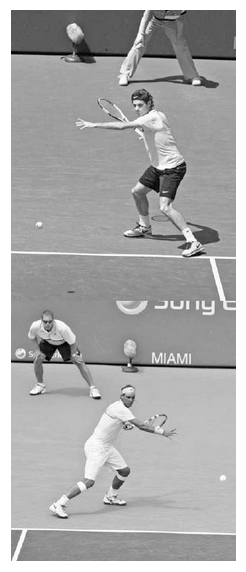

*Federer and Nadal often move towards the doubles alley to use their forehand. Note the similarities in the way they establish balance, position their racquet and non-hitting arm, and flex their legs to store power.*

Federer and Nadal not only share the desire to dictate play with their forehand, but also share commonalities that all great forehand players possess (left) and that are discussed in this chapter. Briefly, they draw on each body part to establish balance and strong kinetic chain power. They use a circular backswing and lag the racquet before the forward swing to maximize racquet head speed. For consistent shot depth, they use good extension through contact and "windshield wiper" racquet movement to control their powerful strokes with topspin. And they follow through in a manner that decelerates the racquet smoothly and facilitates quick recovery. These are the fundamentals of a great forehand. While Federer and Nadal make a range of creative choices on their forehand --- their individuality is evident when you dissect their strokes and observe differences in style and technique --- all is within the parameters of the fundamentals. This chapter has four main sections. I begin with the advantages and techniques of the three main stances. I then explain the upper body phases of the forehand swing: the unit turn, backswing, forward swing to contact, contact, and follow through. Next, I go through the different types of forehand and then finish the chapter with some suggestions for groundstroke practice and forehand drills.

**I. Forehand Stances**

A GREAT FOREHAND BEGINS with good positioning. **To obtain proper positioning, you must utilize the best stance for the given circumstance and align your legs to provide balance and power for the swing in the least amount of time.** While certain stances are recommended for specific shots, the choice of stance is dynamic. It will depend mostly on the height but also the width, depth, spin, and speed of the incoming ball. As Nadal once wrote: "From the moment the ball is motion, it comes at you in an infinitesimal number of angles and spins; with more topspin or backspin or flatter or higher. The difference might be minute, microscopic, but so are the variations your body makes --- shoulders, elbows, wrists, hips, ankles, knees --- in every shot."(2) This unpredictable nature of tennis means you must have adaptable footwork and make use of all the stances.

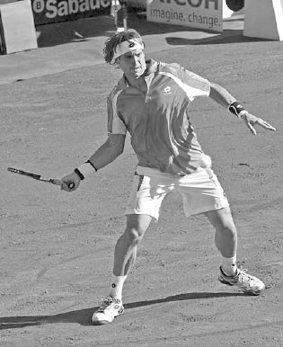

*The shorter and more defensive David Ferrer is predominately an open stance forehand player.*

Because the height of the ball is a key factor, your height will play a role in what stance you use. Your style of play will also have an influence. For example, players who like to rally from deep in the court will use the open stance more often than players who enjoy moving forward and attacking the ball. These intricacies influence forehand stances on the ATP Tour. For the same ball, David Ferrer, Novak Djokovic, and Tomas Berdych may each use a different forehand stance. The shorter, more defensive Ferrer likes the open stance (left), Djokovic, a counter-puncher, prefers the semi-open stance (next page, left), and the taller, more aggressive Berdych uses the neutral stance more than most players (next page, right), Their stances are a function of their height and style of play, as well as their natural proclivity.

Which forehand stance should you favor? As you will learn below, the open stances are quick and explosive while the neutral stance has the advantages of simple weight transfer, compact swing structure, and straighter extension through contact (see page 102). And while you may favor some stances more than others, because tennis is such a dynamic game, you will need them all. By using the guidelines, and through practice, you will learn how to make use of the best stance for all the shots.

**1. THE OPEN STANCES**

The two predominant stances used on the forehand at the higher levels are the open and semi-open stances. The open stance sees your feet parallel to the baseline (opposite top) whereas in the semi-open stance your feet are staggered at roughly a 45-degree angle with your left foot in front of your right foot (opposite bottom). In both stances, your feet should be wider than your shoulders with your knees bent and back fairly straight. This wide stance and good balance distributes body weight up towards the hips and makes for a sturdy balanced position. You need this strong foundation to effectively handle the large amount of force and momentum generated by pushing up from the ground during an aggressive forehand swing.

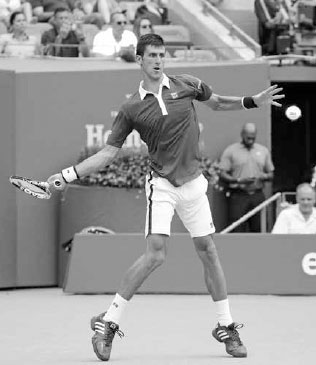

*Djokovic's semi-open forehand stance is well-suited to his aggressive counter-punching style of play.*

The open stances have three main advantages. First, tremendous power is produced from the kinetic energy generated by the legs pushing up from the ground and the torque created by the "corkscrew" swivel of the hips and shoulders. Second, the execution is quicker because fewer steps are required compared to other stances. Third, they produce a comfortable body position for playing balls above the waist.

*The taller and more aggressive Berdych uses the neutral stance frequently.*

The open stance is typically used on balls that are wide, high, or fast, while the semi-open stance is normally used on balls that are above the waist and hit towards the middle of the court and on inside-out and inside-in forehands (see page 110). If you have time, use the semi-open stance rather than the open stance because it will produce greater power. Although your chest will face the net at contact in either stance, in the semi-open stance your hips begin more sideways to the net and therefore uncoil more for increased power. Moreover, because the left foot is in front of the right foot, there is more fotward weight distribution into the swing than on an open stance stroke.

*On this wide ball, Serena Williams' open stance forehand sees her loading up weight on her right leg before pushing off it, adding power to her swing.*

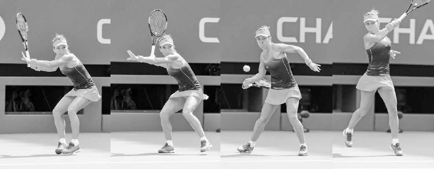

*On this middle ball, Simona Halep moves left before establishing a strong base in a semi-open stance, loads up weight in both legs, and pushes off, mostly from the left leg, up and forward into the shot.*

TECHNIQUE During the backswing, the open stance loads up energy in the right leg before releasing it up the body on the forward swing (previous page, top), while the semi-open stance loads up energy more evenly between the legs before pushing forward and up mostly off the left leg and into the shot (previous page, bottom). On the majority of semi-open and open stance forehands, your left foot finishes pointing towards your target, while your right foot ends resting lightly on the toe with the heel off the ground. On defensive swings, your feet will stay more grounded, but when hitting a powerful forehand, your feet will pivot and elevate to allow the body to rotate fully through the shot.

It is best not to lock your feet down during semi-open or open stance forehands, especially your right foot, but instead let them rise and flow to a natural position. The pivoting of the feet not only lets the power flow naturally and helps you maintain balance for a speedy recovery, but also places less stress on the leg joints as the shoulders rotate against the hips during the swing. It is the release of energy from the legs, combined with the aggressive upward arc of the swing, that result in the pros sometimes hitting these shots in an airborne fashion.

*Maria Sharapova uses the neutral stance on this low ball towards the middle of the court.*

**2. THE NEUTRAL STANCE**

Not all balls should be hit with an open or semi-open stance; sometimes it is best to use the neutral stance. In a neutral stance, your left foot will be positioned in front of your right foot with your feet set slightly wider than shoulder width apart and your body aligned in a sideways position perpendicular to the net (below). There are several reasons why the neutral stance is a good choice, especially for recreational players. First, the forward transfer of weight from the back foot to the front foot adds power. This forward linear power is less complicated to perform than the open stance's upward angular build-up of power. Second, it guarantees that the key fundamental of the shoulder turn happens. Third, because the arc of the swing is more compact and stays closer to the body, it keeps the swing structure more consistent. Fourth, having the body sideways to the net naturally produces a straighter and longer extension to hit "through" the ball during the critical contact phase. There is a reason why other sports like baseball and golf use the neutral stance --- the stance provides a straight, long extension through contact to the target as well as reliable weight transference. Fifth, by stepping down the court, you hit your shot earlier, robbing time from your opponent, and have better court positioning to launch an attack to the net.

The neutral stance is typically used on slow, low balls hit towards the middle of the court. For example, if the incoming ball is hit with backspin, then the neutral stance is probably the best option due to the slower and lower bounce of the ball. Recreational players can use the neutral stance more often because of the slower speed of the game and less frequent use of high-bouncing, heavy topspin balls. This is particularly true in doubles, where the reduced court area a player must cover makes for fewer wide balls, and therefore, less need for the open stances.

TECHNIQUE When using the neutral stance, it is important to line up your back foot almost behind the flight of the incoming ball (opposite, far left) because you want your front foot's forward momentum to push towards your target (opposite, center left). If you are stepping across the court with your front foot, then it probably means you should have used a semi-open or open stance.

The front foot should be angled towards the right net post (opposite, center right) to keep the upper body in correct alignment during the swing. If the front foot is perpendicular to the net, your hips will open too much (your hips should be at a roughly 45 degree angle to the net at contact). If your front foot is parallel to the to the net, you will hinder the forward momentum of the weight transfer through the shot. As you swing, your front foot should hit the ground a moment before contact to secure forward momentum (opposite, far right). At contact, the front foot stays still to anchor the stroke and your back foot slides to the right. This movement of the back foot allows the hips to rotate and produces a contact point in front of the body. While finishing the stroke, swing your back foot around level with your front foot (right). This is the recovery step.

  -----------------------------------------------------------------------------------------------------------------------------------------------------------------------------------------------------------------------------------------------------------------------------------------------------------------------------------------------------------------------------------------------------------------------------------------------------------------------------------------------------------------------------------------------------------------------------------------------------------------------------------------------------------------------------------------------------------------------------------------
  **COACH'S BOX:**
  **The neutral stance has returned to favor after being in the tennis teaching doghouse for a period. In the 1990s, while working at a renowned tennis facility, I was told by the tennis director to teach students to use the open stance only, even when receiving lower and slower balls. This was during the time when the Williams sisters were dominating with their open stance style, and many top coaches were taking heed. This tunnel vision focus of using only open stance groundstrokes is an example of instruction being influenced by the "flavor of the month" mentality, instead of instruction being logically responsive to the game's dynamic nature and forged in sound fundamentals and optimal biomechanics.**
  -----------------------------------------------------------------------------------------------------------------------------------------------------------------------------------------------------------------------------------------------------------------------------------------------------------------------------------------------------------------------------------------------------------------------------------------------------------------------------------------------------------------------------------------------------------------------------------------------------------------------------------------------------------------------------------------------------------------------------------------

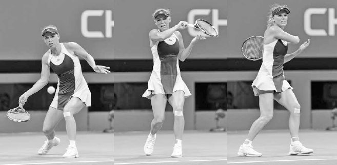

*Today, there is agreement in the coaching community that the neutral stance is the best choice in certain circumstances. Interestingly, I've seen the Williams sisters hit more neutral stance groundstrokes later in their careers.*

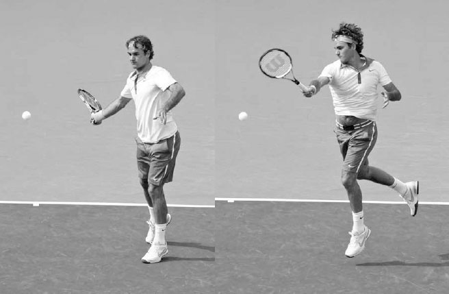

*Caroline Wozniacki performs her recovery step as she swings on this aggressive neutral stance forehand.*

Tennis is a changeable game, so the timing of the recovery step will vary. Sometimes a deliberate recovery step is not needed because it happens naturally. For example, if you need to move quickly sideways to play a neutral stance forehand, your back foot will pivot around to the right from the body's momentum. Or, on a powerful swing, the fast movement of your racquet to the left on the follow through will naturally pull your back foot to the right (above).

However, if your forehand requires less movement to the ball or is less aggressive, which is often the case at the recreational level, your recovery step can be later and more deliberate. The later recovery step has the advantage of both stabilizing the hips and helping balance the racquet correctly at contact.

**3. THE HOP STEPS**

Most groundstrokes will be hit with your feet in one of the regular open or neutral stances; however, there are other times when your feet should move and pivot in less conventional ways to establish balance, power, and recovery in the most efficient way. If you focus on learning the three main stances in a static form only, you are leaving out a substantial part of the vital footwork component of the game. It is important to learn the dynamic derivatives of the regular stances: the hop steps.

Hop steps, where one foot hops through contact while the other foot lifts in different directions to balance out the body, are used in various situations when time is limited and the shot is best hit with only one foot on the ground.

**A. FORWARD HOP**

A forward hop is used when moving forward to respond to a short ball. Here, the front foot is grounded during the backswing as it steps towards the net in a neutral stance. It then lifts and hops forward during the swing and follow through while the back foot remains in the air (opposite, above). This hop happens naturally due to the momentum from the forward movement combined with the low-to-high arc of the topspin swing. After the follow through, continue the forward momentum so that the back foot ends up in front of the front foot. This will help you gain speed to move quickly to the net to volley.

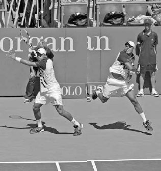

*Federer uses the forward hop before attacking the net.*

**B. FOREHAND SEMI-OPEN HOP**

After moving quickly left to play a semi-open stance forehand, the weight transfer into the shot usually will begin from the left foot and, due to the sideways movement, propel the body sideways in an airborne fashion during the swing (right). As the racquet moves forward to meet the ball, the left foot hops sideways to the left as the right leg kicks back behind to balance out the body.

*Jo-Wilfried Tsonga moves left, sets up in the semi-open stance, and hops through the swing.*

*Marin Cilic uses the open stance hop, ending well to the right of where he began the swing.*

**C. OPEN STANCE HOP**

The open stance lateral hop is used on wide shots where the energy created by the sideways movement lifts the outside foot during the swing, landing it some distance away from the inside foot. While airborne and finishing the swing, you lean your legs to the left on the forehand and to the right on the backhand as the upper body stays upright (left). This helps reverse the directional momentum and facilitates quick recovery.

**D. FOREHAND BACKWARD HOP**

The forehand backward hop can be useful on a deep, high bouncing topspin shot. From the semi-open stance, the right foot will push off and move backwards through the shot while the left leg lifts and moves backwards behind the right foot (top right). After the left leg lands, the body pushes forward towards the baseline to recover.

**E. FOREHAND LUNGE HOP**

There are times when a ball is too wide and you are unable to set your feet for an open stance shot. When this happens, an elevated, lunging crossover hop is best. When using the lunge hop on the forehand, the last step before contact loads up the weight on the right leg, which thrusts the left leg forward with a large powerful step as you swing the racquet (bottom). During the swing, the right foot lifts and the left arm pulls backwards to balance the body. As you follow through, the right foot hits the ground, slowing down the body and beginning your recovery.

*Jo-Wilfried Tsonga defends against a high-bouncing ball by employing the backward hop.*

*Caroline Wozniacki uses a foreward lunge hop to power through a wide forehand.*

**II. The Five Phases of the Forehand**

NOW THAT WE HAVE COVERED the stances, let's discuss the forehand swing in regards to the upper body. There are five main phases of the swing: the unit turn, backswing, forward swing to contact, contact, and follow through.

**1. UNIT TURN**

To maximize power and consistency on the forehand, it is important to use the larger muscle groups of the hips, chest, and shoulders effectively. The best way to efficiently use these muscles is to start the swing well with a unit turn. You do this by turning your body as a unit, keeping your arms relatively still while pivoting your right foot, lifting your left heel, and turning your shoulders with your left hand holding the throat of the racquet (right).

There are four reasons for your left hand to stay on the throat of the racquet during the unit turn. First, it forces your shoulders to turn so your body can uncoil powerfully later in the swing. Second, it guides your racquet into the correct path for the rest of your backswing. Letting go with your left hand too early allows the racquet to enter swing paths that may be higher, lower, shorter, or longer than ideal. Third, your left hand can turn the racquet as you place your right hand in your preferred forehand grip. Fourth, your left arm feeds information about the racquet's height and angle to your brain during the backswing, freeing your mind to focus on the ball. As you set up in the unit turn, point the racquet upward with the strings around eye level and your hitting elbow comfortably bent a few inches lower than ninety degrees. Pointing the racquet upward like this creates more racquet speed into the end of the backswing as compared to lower backswings. This is analogous to a ball dropped off a table having greater energy than a ball rolling down a ramp.

*Maria Sharapova starts her forehand with the unit turn.*

Unless the ball is wide, thus requiring you to pump your arms to run fast, you should do the unit turn quickly and prepare as early as possible for your forehand. The backswing will begin at different times, but the timing of the unit turn to initiate the swing should occur quickly and with a more consistent timing.

Once you have prepared your arms in the unit turn, move your feet and set your stance for the swing. After setting their stance, some players pause the racquet and lock their hips to end the unit turn. Nadal (below) and Federer do this, while others like Djokovic and Murray are more fluid. For advanced players, I recommend the pause method because I feel it loads up energy in the legs more powerfully and disguises the drop shot better. For less advanced players, it is simpler to keep the racquet moving during the unit turn. As long as the shoulders are turning and the racquet head is pointing upwards, the unit turn can be executed well either way.

  -----------------------------------------------------------------------------------------------------------------------------------------------------------------------------------------------------------------------------------------------------------------------------------------------------------------
  **COACH'S BOX:**
  **It is important to begin the swing well --- this coaching mantra holds true for every stroke. Without a strong unit turn to begin your forehand, the steps that follow will be less effective and powerful. Fortunately, it is a movement every player can do; we can all start our forehand like the pros.**
  -----------------------------------------------------------------------------------------------------------------------------------------------------------------------------------------------------------------------------------------------------------------------------------------------------------------

Below in frames one and five, we see Federer and Djokovic start their swings with a strong unit turn. Now their racquets are in good alignment to end the backswing in the power position (see page 97) and lag the racquet (frames two and six). Next, their hitting shoulders combine to drive the racquet forward to contact as their wrists lift the racquet head to create topspin (frames three and seven). Their swings end with a full follow through and good balance (frames four and eight) and it all started with and flowed from a technically sound beginning.

After his forehand deserted him for much of 2015, Nadal said he spent many hours on the practice court working on a stronger unit turn to produce a more technically sound stroke.(3) In the spring of 2016, his improved forehand helped him clinch tournament victories in Barcelona and Monte Carlo.

**2. BACKSWING**

After setting up with the unit turn, the backswing begins. Most backswings will be similar, but it is important to remember that the backswing on the forehand will vary depending on the situation and purpose of the shot. The backswing on a powerful forehand off a short ball will be longer, while if the shot received is fast or your balance is compromised, a shorter backswing will be more appropriate.

**A. TIMING**

When you begin the backswing is a key factor in establishing good timing for the shot. If you start too early, it will reduce your potential to accelerate the racquet on the forward swing. If you begin the backswing too late, your ability to gather power will be limited and negatively impact your racquet control.

When do the top players start their backswing? During a baseline rally on clay courts, most players delay the start of their backswing until just before the bounce of the ball. This is the timing that permits the greatest racquet acceleration and allows them to make last second adjustments that would be difficult if the backswing began earlier and their left hand was off the racquet. On the faster hard courts, they prepare sooner. Recreational players have a much slower swing and should begin the backswing well before the bounce of the ball while still preparing the racquet in a way that keeps the swing fluid.

**B. THE LEFT ARM AND RACQUET POSITIONING**

After determining the timing of your backswing, the backswing itself begins with your left hand separating from the racquet and moving to the right, ending parallel to the net. This left arm positioning ensures that the shoulders turn more than the hips, allowing the upper body to uncoil more powerfully during the forward swing.

*Federer starts his "outside" backswing with his left arm parallel to the net and his strings facing towards the right side fence.*

As your left arm moves across, the right arm moves the racquet back in a circular fashion with the strings of the racquet facing towards the right side fence (above). Having the strings face this way during the first half of the backswing places your wrist at a comfortable angle to drop the racquet efficiently into the power position at the end of the backswing.

**C. THE OUTSIDE BACKSWING**

As the racquet goes back in a circular fashion, it should stay to the right or to the "outside" (above). This gains time by having the racquet take a shorter path to the end of the backswing versus the longer path taken by larger, more "inside" (or to the left) backswings. Even though the outside backswing is shorter, it is more powerful because the wrist can flex back more at the end of the backswing. It also results in a straighter path to contact, creating a longer extension for increased accuracy.

*Nadal and Federer end their backswing in the power position, a commonality of all great forehands.*

**D. THE POWER POSITION**

At the end of the backswing, your hitting arm straightens and your racquet should point towards the right side of the back fence with the racquet head above the wrist and strings facing towards the ground (above). This is referred to as the "power position." It is a commonality seen in all great forehands. With this position established, you have the body fully coiled and the racquet in a powerful slot to transition from the backswing into the forward swing.

  --------------------------------------------------------------------------------------------------------------------------------------------------------------------------------------------------------------------------------------------------------------------------------------------------------------------------------------------------------------------------------------------------------------
  **COACH'S BOX:**
  **On the professional tour, the emphasis on the forehand shot has evolved from creating power with a longer backswing to handling and returning shots with power using a shorter, outside backswing. It is partly for this reason that players like Federer have plenty of time to play their forehand. It also allows them to play closer to the baseline and move quickly forward to attack short balls.**
  --------------------------------------------------------------------------------------------------------------------------------------------------------------------------------------------------------------------------------------------------------------------------------------------------------------------------------------------------------------------------------------------------------------

Some players have adjusted their backswing over time and adopted this technique. Early in his career, Nadal struggled to win big tournaments on the faster court surfaces. Then he began taking the racquet back slightly lower and preparing the racquet more to the outside of the body. This change reduced the time he needed to execute a powerful forehand and allowed him to play more aggressively and closer to the baseline. Since then, he has won several Grand Slams on the faster surfaces.

*Following the power position, Djokovic rotates his hips and lags the racquet.*

As the racquet sets in the power position, the left arm straightens, providing anchoring counterpoint strength for the hitting arm to move the racquet forward with greater force. It also stretches the oblique muscles, preparing them for the hip rotation that follows. The hip rotation adds power through leverage; the force it creates multiplies as it is transferred to the arms, much like the lever system that allows a toy propeller to fly.

**3. FORWARD SWING TO CONTACT**

With the backswing and the setting of the power position complete, the left arm that was stretched at the end of the backswing begins to bend and pull left, and the hips rotate causing the racquet to lag (above right). The word "lag" usually has negative connotations, however in tennis, it means extra "sling shot" power. Racquet lag stretches your shoulder and arm muscles, generating extra momentum to thrust the racquet powerfully towards contact.

During the racquet lag, the forearm and wrist will circle around in a clockwise direction. The more topspin desired, the larger the circle. This circling of the racquet turbocharges the swing and occurs without conscious muscle manipulation. It happens naturally from establishing the power position with an outside backswing and your hitting elbow holding its position as your hips rotate. Following the racquet lag, your forward swing continues with hips rotating and the racquet head dropping below the ball. After the racquet head drops, the racquet butt cap moves forward to point towards the ball, lagging the racquet for a second time.

The path the racquet takes on the forward swing will vary depending whether you are hitting a topspin or flat forehand.

*On Jo-Wilfried Tsonga's topspin forehand (top), his racquet lifts at roughly a 45 degree angle, while on his flat forehand (bottom), his racquet takes an almost level path to the ball.*

The decision to hit a flat forehand versus a topspin forehand is largely dependent on your desired level of aggressiveness and court positioning. For example, if you are looking to take control of the point and are positioned near or in front of the baseline, the flat forehand is likely the right shot choice. On the other hand, if you wish to stay in the neutral phase of the rally and are positioned beyond the baseline, then using the topspin forehand often makes strategic sense.

Djokovic's racquet butt points towards the ball before it turns towards the body to square up the racquet for contact. The forehand swing sequence is outside for quick preparation, inside to lag the racquet (left), and outside again to meet the ball (right).

  ---------------------------------------------------------------------------------------------------------------------------------------------------------------------------------------------------------------------------------------------------------------------------------------------------------------------------------------------------------------------------------------------------------------------------------------------------------------------------------------------------------------------------------------------------------------------------------------------------------------
  **COACH'S BOX:**
  **Always remember that because your wrist is your body's closest joint to the racquet, how it aligns and moves through contact has a huge influence on the success of every shot. When you break it down, tennis technique is quite simple. You have three main shots --- serves, topspin groundstrokes, and volleys --- with three different wrist movements. Of course, there's a lot more to it than that, but basically if you can learn to pronate your wrist on the serve, lift your wrist on topspin groundstrokes, and hold your wrist steady on volleys, you can play a very good level of tennis.**
  ---------------------------------------------------------------------------------------------------------------------------------------------------------------------------------------------------------------------------------------------------------------------------------------------------------------------------------------------------------------------------------------------------------------------------------------------------------------------------------------------------------------------------------------------------------------------------------------------------------------

After the racquet butt cap moves forward, it turns towards the body, causing the racquet head to move closer to the body and then away, or inside-to-outside (above), as it gets closer to contact. It's natural to think, because the ball moves in a linear fashion, that the forehand should be linear type swing. However, to maximize kinesthetic power, the forehand swing should arc and curve; arc up on the backswing, and then curve forward to meet the ball. As the racquet moves towards the ball, your wrist moves forward from a 60 to 70 degree angle to the forearm (left) to around a 45 degree angle at contact (right). This forward movement (or "catching up") of your wrist to your forearm adds racquet speed and squares up the racquet face to your target. Keep in mind, the wrist is the final moving part of the body to influence the speed and direction of the racquet. Its motion is the crucial final link of the forehand's kinetic chain, whereby the build-up of energy throughout the body reaches a final crescendo.

*Djokovic moves his wrist forward slightly for power and then steadies it at contact to direct and control his shot.*

As the arm and wrist move the racquet forward, the wrist also moves slightly upward to lift the racquet head and add topspin to the shot. From a front view on a waist-high ball, the racquet head that was below the ball at around an eight o'clock angle before contact (next page) moves upward to meet the ball at a nine o'clock (or horizontal) angle to start the windshield wiper motion discussed next in the contact section. While the wrist moves upward and forward, that forward motion slows down an instant before contact, allowing you to master ball impact and direct the shot.

**4. CONTACT**

At this point, you are roughly halfway through your forward swing and it's time for for the moment of truth --- the contact point and its three main considerations: the "windshield wiper motion," the point of contact, and extension.

**A. THE WINDSHIELD WIPER MOTION**

As mentioned, the racquet head moves forward and tilts upward to meet the ball at a nine o'clock angle. It continues to move forward and tilt upward following contact before finishing across the body at a three o'clock angle (opposite top). This upward rotation of the racquet is commonly referred to as the "windshield wiper" motion because the racquet takes a path that somewhat mimics car windshield wipers as the top edge of the racquet on the forward swing becomes the bottom edge on the follow through.

The windshield wiper motion allows the strings to brush up the back of the ball and makes the ball rotate forward, giving it topspin after it leaves the racquet. The amount of topspin you produce is determined by the steepness of the racquet's low-to-high gradient and the speed of the racquet head --- a sharp upward brushing of the ball with a fast racquet will produce a lot of topspin. Or, put in windshield wiper terms, strokes with heavy topspin will rotate the racquet head more quickly than flatter shots.

  -----------------------------------------------------------------------------------------------------------------------------------------------------------------------------------------------------------------------------------------------------------------------------------------------------------------------------------------------------------------------------------------------------------------------------------------------------------------------------------------
  **COACH'S BOX:**
  **The correct combination of windshield wiper motion for topspin and forward movement of the arm from the shoulder for good extension is essential to hitting a great forehand. A forehand that uses mostly windshield wiper motion will create topspin but lack power, while a forehand that uses good extension without the windshield wiper motion will create power but lack the topspin to control the shot. You need both components of the swing to hit with controlled power.**
  -----------------------------------------------------------------------------------------------------------------------------------------------------------------------------------------------------------------------------------------------------------------------------------------------------------------------------------------------------------------------------------------------------------------------------------------------------------------------------------------

*Stan Wawrinka begins the windshield wiper motion with the racquet head below the ball just before contact.*

**B. POINT OF CONTACT**

At contact, you must match the ball up correctly with the strings. To do this consistently, contact must occur in front of your body (opposite bottom). A contact point in front of your body allows you the time and space to build up to optimal racquet speed, and you can see the ball well. Moreover, it's here that your body is best positioned to have the physical strength to command the ball's impact. How far in front of the body will depend largely on the direction of your shot. Cross-court shots should be hit farther in front of the body than down-the-line ones.

**C. EXTENSION**

It is important to hit with good extension at contact. To do this, you must reach forward with the racquet through contact, as if hitting through three balls lined up in a row. Here, the racquet face should remain steady at a slightly closed angle (left) --- don't let it slip open or shake forward and close around the contours of the ball.

*Djokovic's windshield wiper motion sees his racquet rotate over 180 degrees following contact. He combines the use of the windshield wiper motion with good extension to hit his forehand with power and control.*

*Kei Nishikori makes contact in front of his body where his physical strength, swing momentum, and vision are best served.*

Remember, the reality of every tennis stroke is that it involves a compressible ball pushing into tightly wound strings on a racquet. Therefore, it is only by using good extension that you can effectively control the collision of the ball and hit with power, depth, and accuracy. An issue some players have is that they "lose" the collision, causing their racquet to stop short during the extension, and consequently, their forehand lacks these desirable qualities.

As you perform the extension, your wrist, forearm, and elbow will remain fairly steady as your shoulder drives the racquet forward. If this movement is done correctly, the racquet should face parallel to your target and stay on the right side of your body, creating good space between the racquet and the left shoulder (above).

*Serena Williams displays good extension as her racquet remains on her right side and moves parallel to her target after contact.*

The extension is easier to do well if your head and chest are still. Lifting your head and chest during extension will cause the racquet to veer left instead of extending straight towards your target. A good tip to keep your head and chest still is to look down at the ball through the back of your strings at con- tact. Keep in mind that the ball only stays on your strings for a few milliseconds, which is not long enough to register in your brain, so while you may not actually see the ball clearly on the strings, the point is that watching the ball helps keeps your chest still for a straighter racquet path and longer extension.

Additionally, at this stage of the swing, the moving of body parts to build kinetic chain power is almost over, and the emphasis shifts to keeping the body still to maximize racquet control. Even though modern swings are very explosive, elite players still keep their head and chest stationary at contact to help set the racquet face at the precise angle needed to hit their powerful shots in the court.

  ---------------------------------------------------------------------------------------------------------------------------------------------------------------------------------------------------------------------------------------------------------------------------------------------------------------------------------------------------------------------------------------------------------------------------------------------------------------------------------------------------------------------------------------------------------------------------------------------------
  **COACH'S BOX:**
  **Why is the windshield wiper motion an important technique to learn? It creates topspin, which produces air pressure above the ball that pushes it downward. Thus, topspin allows you to hit well above the net knowing the ball's dipping trajectory is going to bring it down into the court before the baseline. In coaching parlance, topspin gives a powerful baseline shot shape, and shape provides consistency. Topspin not only produces a favorable trajectory, but also opens up more acute cross-court angles and a higher and "heavier" ball for your opponent to defend against.**
  ---------------------------------------------------------------------------------------------------------------------------------------------------------------------------------------------------------------------------------------------------------------------------------------------------------------------------------------------------------------------------------------------------------------------------------------------------------------------------------------------------------------------------------------------------------------------------------------------------

**If you are unfamiliar with the racquet movement for a topspin forehand, try this exercise. Stand approximately one foot from the net in your forehand stance, match the middle of your racquet face up with the head band of the net, and gently "brush" up the net. Next, trap a ball with your strings against the headband of the net, and do the same motion while rolling the ball over the net. This exercise can help can help you gain a better understanding of how the ball's forward rotation (i.e. topspin) is achieved.**

**5. FOLLOW THROUGH**

Following contact and extension, the racquet releases forward and fans across to the left to complete the windshield wiper motion. As the racquet fans across, the racquet face will close (below). The degree to which the racquet face closes will depend on the amount of topspin used as well as the ball's height. The racquet will close more on flatter shots and higher contact points and less on heavy topspin shots and lower contact points.

With the windshield wiper motion complete, the elbow bends and the racquet moves upward, to the left, and backwards to finish the stroke. As this occurs, the left arm continues to move left to clear a path for your body to finish the hip rotation.

*Following extension, Federer closes the racquet as it fans across to the left.*

A good follow through is an indication that your swing had solid contact, proper extension, and good racquet speed. And while a good follow through won't guarantee these stroke qualities, committing one to muscle memory will help them happen more consistently. I've found in my teaching that when students are conscious of following through fully, the extension part of their swing often improves too, adding velocity and depth to their shot.

The length and arc of the follow through will vary depending on the type of shot. There are three main types of follow through: elevated, horizontal, and reverse.

*A flat hitter, Maria Sharapova often uses the elevated follow through.*

*Here, Murray's horizontal follow through indicates he likely used heavy topspin on this forehand.*

**A. ELEVATED FOLLOW THROUGH**

The elevated follow through is typically used when hitting flat to moderate topspin groundstrokes. In this finish, the racquet ends behind your head with your knuckles stopping near your left ear and your elbow at shoulder height and pointing towards your target (left). For recreational players who typically use moderate topspin, the elevated follow through is the correct one to commit to muscle memory.

**B. HORIZONTAL FOLLOW THROUGH**

*The horizontal follow through typically is used on higher balls or balls hit with moderate to heavy topspin (below).*

*Nadal uses the reverse follow through on most shots, but for other pros, this follow through is used only under certain circumstances.*

  ---------------------------------------------------------------------------------------------------------------------------------------------------------------------------------------------------------------------------------------------------------------------------------------------------------------------------------------------------------------------------------------------------------------------------------------------------------------------------------------------------------------------------------------------------------------------------------------------------------
  **COACH'S BOX:**
  **Nadal uses the reverse follow through on most of his forehands, but this wasn't always the case. If you watch Nadal as a junior on video, you will see that he rarely used the reverse follow through on his forehand. However, he realized over a period of time --- and after hitting thousands of balls --- that his straight-arm technique and lean-back style resulted in the reverse follow through being the finish that worked best for his forehand. One of the talents of great players is their intuitive ability to figure out the technique that works best for them and commit to it.**
  ---------------------------------------------------------------------------------------------------------------------------------------------------------------------------------------------------------------------------------------------------------------------------------------------------------------------------------------------------------------------------------------------------------------------------------------------------------------------------------------------------------------------------------------------------------------------------------------------------------

**C. REVERSE FOLLOW THROUGH**

The reverse follow through is sometimes used by high-level players when rushed, running for a wide shot, or desiring extra topspin on their forehand. In the reverse follow through, the racquet swings almost vertically and releases above and then behind the head (above) instead of the traditional across the body finish. By ending this way, players can accelerate and hit an effective shot even though they may be hurrying through the stroke. The increased speed and spin of today's game has made the reverse follow through more popular because its later contact point allows a split second more time and its steep gradient assists spin.

RAFAEL NADAL'S HALL OF FAME CAREER can largely be attributed to his amazing heavy topspin forehand. Usually, when a player uses tremendous topspin, their shot's velocity suffers. However, Nadal's incredible racquet head speed allows him to have both explosive spin and power on his forehand.

In the first frame Nadal's forehand looks orthodox with his shoulders turning and his legs "digging" into the court to load up energy. In frame two, his racquet head is above the wrist and facing towards the ground in the power position, and his non-hitting arm is moving to the right to activate his core and rotate his hips. Here, Nadal's forehand begins to differentiate itself from most players, with his hitting arm becoming completely straight (versus slightly bent) at the end of the backswing. This technique stretches the arm muscles more and lengthens the swing path for greater racquet speed. In frame three, he drops the racquet head below the ball as the racquet begins its low-to-high path to the ball. Between frames three and four, we can see the lag and explosive release of the racquet and how the racquet has rotated from a 5 o'clock to an 11 o'clock position. This 180 degree racquet rotation produces incredible topspin. In frame four, we see Nadal's straight-arm technique permits long extension, and his explosive release leads to a larger than average forward wrist movement following contact. The wrist is the closest part of the body to the racquet, and Nadal knows that moving it forward like this adds power to his stroke. Recreational players who don't enjoy 3200 rpms on their forehand like Rafa should move their wrist forward only slightly during this phase of the swing.

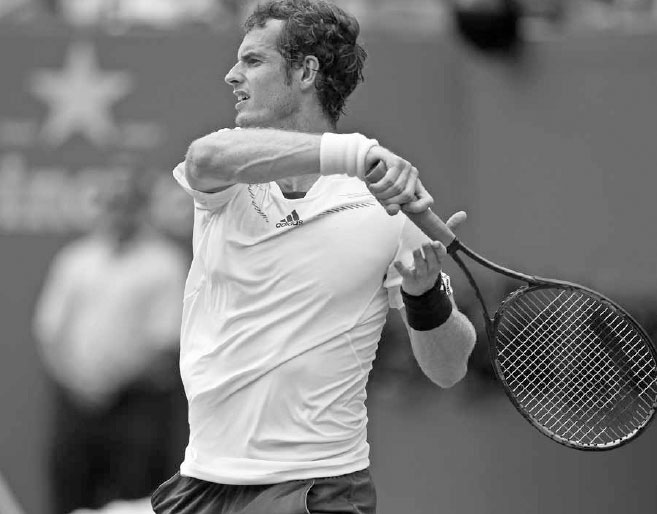

*Frames five and six show Nadal's signature reverse follow through with the racquet ending behind his head to finish his "buggy whip" motion.*

**III. Types of Forehands**

NEXT, I WILL COVER THE TECHNIQUE and advantage of two important forehand shots, the inside-out and inside-in forehands. Then I will describe five other types of topspin forehands. Finally, I will conclude this section by discussing the slice forehand.

**1. THE INSIDE-OUT AND INSIDE-IN FOREHAND**

The game's two most feared shots from the baseline are the inside-out and inside-in forehands. If you have a strong forehand, these are shots you should use frequently; they represent one of the best chances to seize control of the point or force an error from your opponent.

In both, the player making the shot moves left into the backhand side of the court. From this position, a forehand hit cross court to the backhand side of a right-handed opponent is an "inside-out" forehand, while a forehand hit down the line is an "inside-in" forehand (below).

The inside-out and inside-in forehands have several advantages. First, the movement to the left side of the court adds momentum and power to the shot, and the body alignment on the forehand allows you to move left and still hit a well-balanced shot. Second, if your forehand is your strength and your opponent's weakness is their backhand, the inside-out forehand will help you set up a rally pattern that pits your strength against their weakness. In this scenario, your opponent will feel pressure and may take risks that lead them to hit low percentage shots. Third, by dominating play from the middle of the court, you "shrink" the playing surface, leaving only a small space in the backhand corner for your opponent to hit their shot without damaging repercussions. Giving your opponent a small space to aim for will cause them to miss shots wide.

Fourth, the inside-out forehand is hit over the lowest part of the net, into the longest court, and has the added positive effect of moving your opponent wider off the court than most other forehands will. Fifth, if the forehand is your strength, dominating play with the forehand will give you more confidence in your backhand. When you hit a majority of groundstrokes with your superior forehand, you no longer feel pressure to do something special with your backhand, knowing that there will be a forehand to unload on a shot or two ahead. This leads to a higher percentage shot selection on backhands and overall a more patient and smarter crafting of the point.

*Madison Keys enjoys moving left along the baseline and dominating play with her forehand.*

**2. OTHER TYPES OF TOPSPIN FOREHANDS**

There are five main other types of topspin forehands. Players with the versatility to use different forehands gain a large advantage over those players who do not. Having options allows you to use the most effective tactical response for the specific circumstance. Sometimes it makes sense to drive the topspin forehand fast with little spin low over the net, while at other times the correct choice of shot is to hit the ball slower with heavy spin high over the net. Also, each opponent you face will have different weaknesses, and exposing these shortcomings is easier if you have different ways of hitting from the baseline.

There are five main types of topspin forehands.

**A. THE ARC**

This shot is hit from a few feet behind the baseline with good topspin three or four feet over the net and lands well inside the lines. It is typically used as a neutral or somewhat aggressive stroke to move your opponent around the court and put you on the offensive. The arc is the forehand used most frequently on clay courts.

**B. THE DRIVE**

The drive is hit from close to the baseline with moderate topspin one or two feet over the net and should land three to five feet inside the lines. This forehand's good speed and moderate topspin will leave your opponent scrambling. It is commonly used on hard courts when you have a good amount of time and balance to play your shot.

DESPITE HOW GOOD HIS BACKHAND IS, NOVAK DJOKOVIC OFTEN moves into the backhand side of the court to attack with his inside-out forehand. He has said, "The inside-out forehand is one of the most important shots in the game. I look for every opportunity to do it."(4) In the first frame, Djokovic shuffles leftward in a semi-circle path to get into position for this inside-out forehand. He makes sure that he allows plenty of space to hit the ball so he can push forward into the shot. As he moves, he prepares his racquet and turns his shoulders in the unit turn position. This early preparation allows him to take a full wind-up and not rush the forward swing. In frames two and three, he places the racquet in the power position and grounds his feet, setting up a strong ground force reaction to initiate the kinetic chain. In frame four, he unloads the energy by springing mostly off his left foot. We see how his hips have rotated from the frame before, allowing him to make contact in the most powerful location --- in front of his body. In frame five, his right foot lifts in the air to balance out the body and his racquet closes after rotating upward to create topspin.

It can be a little deceiving watching the pros play from a frontal view on television because it looks like the sideways windshield wiper motion dominates the forward swing, however from a side view, we can see how much they extend forward to master ball impact and drive the ball deep in the court. In the last frame, he follows through with his head upright, shoulders level, and his right elbow shoulder-high and pointing down the court to his target.

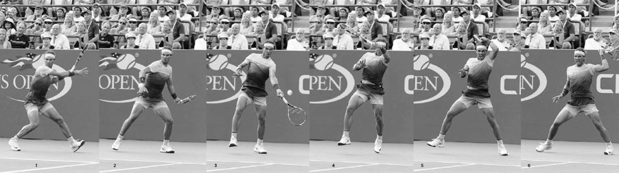

*Agnieszka Radwanska's ability to mix up her forehand with different angles, spins, and speeds frustrates her opponents and gives her many strategic options.*

**C. THE LOOP**

There will be occasions when your opponent has you pushed out wide and the loop shot can buy time to recover. This defensive shot is hit six to eight feet above the net from a position well behind the baseline. It is best to aim the loop forehand deep towards the middle of the court to reduce the angles available to your opponent.

**D. THE ANGLE**

The angle shot is hit with heavy topspin, one or two feet over the net and short in the court. It can pull your opponent wide off the court, leading to an opportunity to go on the offensive. The extra spin and control stemming from the new poly strings has made the angle forehand a more popular shot during baseline rallies in the modern era.

**E. THE KILL**

The kill shot is hit from inside the baseline with the incoming ball moving slowly and bouncing above the net. It is a power stroke hit toward the corners of the baseline with a limited amount of topspin. The inside-out and inside-in power forehands are examples of the kill shot where you are trying to end the point with a winner or unreturnable shot.

On the ATP Tour, you see players with varying degrees of versatility on their forehand. One of the strengths of Djokovic's game is the way he can arc, drive, loop, angle, and kill his forehand. He can do each of these forehands well, and importantly, he almost always makes the right choice of when to use each one. Sometimes when a talented player has many options, they can be prone to making the wrong shot choice. One criticism of Nadal's game is that while he has one of the best arc and loop forehands the game has ever seen, his drive and kill forehands lack the velocity other top pros possess on their aggressive forehands. As a result, Nadal's career title tally is heavily lopsided with clay court victories (53 on clay courts and 16 on hard courts as of June 2017) even though most tournaments on the ATP tour are played on hard courts. On the other hand, the more forehand-versa-tile Djokovic has won 51 titles on hard courts versus 13 on clay - a statistic more representative of the ATP hard court-to-clay court tournament ratio.

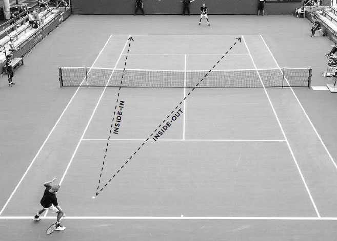

*Murray uses the slice forehand, or "squash shot," to defend against this difficult, wide ball.*

**3. SLICE FOREHAND**

The forehand is predominantly a topspin shot, but it is also important to learn a slice forehand. Unlike most topspin forehands, the slice forehand can be hit well without the feet being grounded before the swing, and the compact nature of the swing allows you to hit an effective shot even if you are rushed. It is often needed when your opponent's shot is too low or short to hit comfortably with topspin. It can also be used strategically to force your opponent to hit their shot from a low, difficult height or to draw an opponent up to the net, forcing them out of their comfort zone at the baseline.

In desperate wide ball situations, the later contact of the slice forehand buys you more time to reach the shot. Also, the backspin of the slice forehand carries the ball farther in the air, so even when you are stretching or off balance, you can still hit the ball deep in the court. The past decade has seen the wide forehand slice shot, now dubbed the "squash shot," become more widely used due to the extra reach and time this shot permits (above). The squash shot has repurposed the stretching wide forehand from a defensive lob to an aggressive rally extender. In this era of stronger and fitter athletes, the extra court coverage this emergency stroke gives the players has made it an increasingly familiar defensive weapon.

The slice forehand is also a useful approach shot, particularly in doubles. The slower and lower bounce of the slice approach shot gives you time to set up for a good net position and causes an awkward, low contact point for your opponent's passing shot. The slice forehand is also used to block fast serves or to hit the ball low at a net player's feet when in trouble. Lastly, it can be used for lobs to defend the point or force your opponents to play difficult overheads deep in the court.

TECHNIQUE The slice forehand is typically played with a neutral stance, but like the topspin forehand, a variety of stances are appropriate depending on the circumstances. Begin the swing with the continental grip and take the racquet back above the height of the ball with the racquet face open (previous page, left). The racquet ends the backswing pointing to the back fence with the racquet head above the wrist and the racquet butt cap pointing towards the ball.

The racquet moves forward with a downward arc and a slightly open racquet face (previous page, center). The strings make contact with the bottom half of the ball, causing the ball to spin backwards. The greater the backspin desired, the sharper the decline on the forward swing, and the more open the racquet face will be at contact.

The wrist should be firm and the elbow slightly bent during the forward swing before straightening slightly through contact. Keep the head and chest still and follow through with the arm extended below shoulder height (previous page, right). For a fuller explanation regarding the technique needed for strong slice groundstrokes, please refer to the slice backhand section in Chapter Eight.

**IV. Groundstroke Practice**

NOW THAT YOU UNDERSTAND the mechanics of the various forehand groundstrokes, and with instruction on the backhand to follow in the next chapter, it is time to commit these techniques to muscle memory through repetition. Groundstroke practice sessions should incorporate a combination of drills and point play. Drills will allow you to hit many balls in a short amount of time, honing timing and technique, and point play will give you practice moving and reacting to all the different situations that may arise during a rally.

  --------------------------------------------------------------------------------------------------------------------------------------------------------------------------------------------------------------------------------------------------------------------------------------------------------------------------------------------------------------------------------------------------------------------------------------------------------------------------------------------------------------------------------------------------------------------------------------------------------------------------------------------------------------------------------------------------------------------------------------------------------------------------------------------------------------------------------------------------------------------------
  **COACH'S BOX:**
  **At the recreational level, it takes roughly 1.5 seconds for the ball to travel across the length of the court. When it comes to learning stroke technique, that is not enough time to use phrases to help you perform the stroke correctly; instead use imagery. Besides being quicker, imagery has been proven to be more effective. On topspin forehand and backhand groundstrokes and the serve, there are four key stages (power position, racquet lag, contact, and follow through) which I recommend committing to memory. You can print the photos I have at the end of chapters five, seven, and eight, or go online and download similar images of your favorite professional and file it away on your phone. Remember the saying "out of sight, out of mind" holds true in learning tennis. Use imagery to help cement good technique in all your strokes.**
  --------------------------------------------------------------------------------------------------------------------------------------------------------------------------------------------------------------------------------------------------------------------------------------------------------------------------------------------------------------------------------------------------------------------------------------------------------------------------------------------------------------------------------------------------------------------------------------------------------------------------------------------------------------------------------------------------------------------------------------------------------------------------------------------------------------------------------------------------------------------------

If you have an hour to practice groundstrokes, I recommend spending roughly 30 minutes drilling and 30 minutes playing points. Come prepared with drills that focus on improving your weakness and sharpening your strengths, as well as a variety of games that will keep your practice sessions fresh and interesting. Also, don't forget to do drills that practice offensive and defensive situations from the baseline; you need to able to play well in both phases to win consistently.

**1. SHORT BALL RECOGNITION**

Goal: Recognize short balls and take control of the point.

Using only half of the court at first, rally the ball cross-court with your practice partner. If the ball lands in the service box, players must hit down the line and play out the point using the full court. Play a game up to 11 points hitting cross-court forehands, and then repeat the game hitting cross-court backhands.

Variation: Play a drop shot instead of hitting down the line when the ball lands in the service box and finish the point using the service line as the baseline.

**2. FOREHAND TARGET PRACTICE**

Goal: Hitting offensive forehands from a balanced position.

Set up three cones four to six feet apart in a triangle formation deep on the forehand side of both sides of the court. Rally using cross-court forehands with your practice partner. Players score one point if their shot lands in the triangle and two points if a cone is struck. First player to score 15 points wins the game.

Variation: Set up cones deep in the backhand side of the court and both players hit inside-out forehands.

FOREHAND NUTSHELL SUMMARY: COMMIT THESE FOUR IMAGES TO MEMORY

**3. OFFENSE/DEFENSE**

Goal: Learn to play offense and defense well.

Set up two cones on one side of the court about 12 to 14 feet apart in the middle of the baseline. You will hit aggressively using the whole court, while your practice partner defends, aiming their shots between the two cones. If your practice partner hits outside the cones they lose the point. For each point won, you score one point, while your practice partner scores two points. The first player to 15 points wins the game and then switch roles. You can adjust the width of the cones to make the game competitive or appropriate to your skill level.

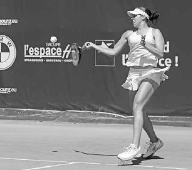

*Former World No. 1 Victoria Azarenka launches into her favorite groundstroke --- the two-handed backhand.*
