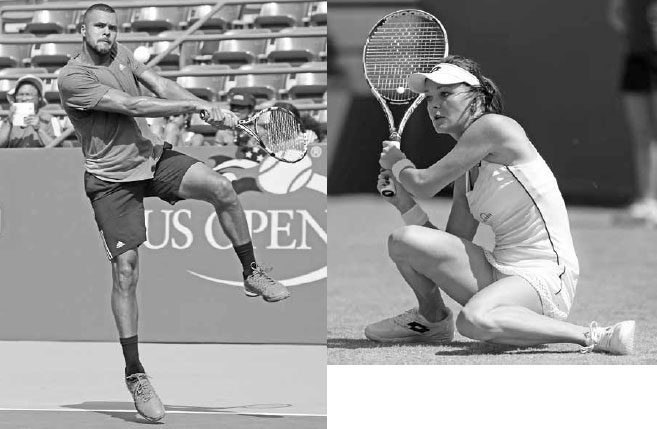
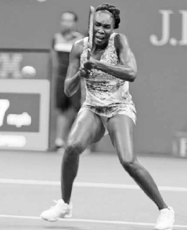
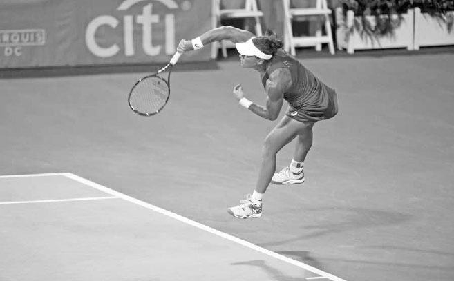
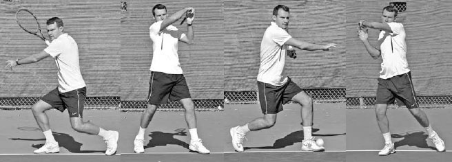
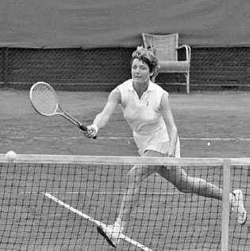

# Future Strokes

Sports are not static. This is particularly so in the increasingly powerful game of tennis. In fact, the rallies on the professional tour are now so fast that the game sometimes resembles table tennis more than it does the tennis of long ago. As the game has sped up, methods of play have been modified, even though initially these changes were often resisted. In this chapter, I will outline three strokes that could produce superior results as the game continues to evolve: the overlapping dual forehand (ODF), the reverse serve (RS), and the volleyball serve (VS).

**I. Learning from Tennis History**

"All truth passes through three stages. First, it is ridiculed. Second, it is violently opposed. Third, it is accepted as being self-evident." - German philosopher Arthur Schopenhauer TENNIS HAS SEEN MANY stroke innovations, such as the two-handed backhand and the "flamingo" and "squat" versions of that stroke, the open stance groundstrokes, the inside forehand, the reverse forehand, the swinging volley, and the "jump" serve --- all strokes discussed earlier in the book. Some of these strokes evolved because new equipment increased the speed and spin of the ball, while others resulted from player's improved athleticism and size. Off court training methods are far superior to yesteryear, and WTA players above six feet tall are now common, while ATP players below that height are seen less and less. Some changes were born out of necessity, while others were just good ideas that previously were not examined fully due to our natural reluctance to enter the less safe domain of new ideas. Interestingly many of these changes only became cemented or "accepted" after their consistent and successful use by a top professional. It seems we often need proof from excellence before we decide that different is indeed better. Let's discuss how these stroke innovations occurred.

*Jo-Wilfried Tsonga's flamingo backhand and Agnieszka Radwanska's squat backhand are relatively new shots to the game.*

Before the two-handed backhand became popular, tennis legend Jack Kramer wrote, "The use of two hands not only weakens your stroke but also robs you of confidence and gives your opponent a psychological advantage."(1) However, Kramer was proven wrong because the game sped up and having a second hand on the backhand grip proved helpful for absorbing the more powerful strokes. In the 1970s, after two-handed backhand players Bjorn Borg and Jimmy Connors dominated theprofessional tour, it became the main way to hit the backhand.

The two-handed backhand shot itself has evolved with the game. For instance, the flamingo two-handed backhand entered the sport in the 1990s, emerging as the use of increased topspin made higher balls more common. This shot sees a player jump up with the front foot and hit the ball while the body is in mid-air in a flamingo-type pose (left). By adding the jump, players raise their body to obtain a more comfortable contact point on higher balls, thereby approximating the swing that would occur on a waist-high ball. More recently, the pros adopted another new two-handed backhand groundstroke named the squat backhand. Used on shots hit fast and deep, the squat backhand sees players swinging with both knees almost touching the ground (opposite right), again to position the body at a height that makes the contact point more comfortable. Watching their students hit either of these backhands would have raised a coach's blood pressure in the not too distant past.

Bjorn Borg often receives credit for speeding up the forehand revolution as well. When he began winning major titles with his open stance forehand some experts told him that his forehand's lack of forward weight transfer would result in great stress on his shoulder and injury to his arm. His arm was fine, he went on to win 11 majors, and the open stance forehand fast became a standard technique. The same occurred later with the open stance backhand, with the Williams sisters helping that shot evolve from being frowned upon to required (below).

*Venus Williams helped the open stance backhand become a common shot.*

They say necessity is the mother of all invention and this proverb holds true with the origins of the inside forehand and swinging volley. The inside forehand became a recognized shot in the late 1980s when the sage coaching of Nick Bollettieri teamed up first with Jimmy Arias and later (and more importantly) with Jim Courier. Bollettieri met Courier when the player was a talented junior equipped with an unorthodox backhand. Bollettieri worked around this weakness, smartly devising a game plan in which Courier avoided his backhand and hit as many forehands as possible, especially inside-out forehands. Courier's world number one ranking shined a spotlight on this stroke and it quickly became the most devastating baseline shot in the game.

On the swinging volley, it was again Nick Bollettieri --- this time teaming with Andre Agassi --- who is largely credited with kick starting a new shot's influence on the game. After identifying the swinging volley's potential and considering the discrepancy between Agassi's outstanding groundstrokes and less natural volleys, Bollettieri advised Agassi to use the groundstroke swing on his volleys as much as possible. Agassi's great timing made his swinging volley a feared shot and the stroke caught on. In the past, the volley was always taught as a short motion, where over-swinging and follow through were considered bad form. Juniors are now trained that when they are inside the base-line and the ball is slow and above the net, the swinging volley is the correct shot to use. The advantage of the the swinging volley is clear: the ball can be hit with much greater speed than with a traditional volley.

*Players of the past did not elevate high above the ground on the serve as Samantha Stosur does here.*

The reverse forehand is another more recent addition to the tennis player's repertoire. Rarely seen in the past, it is now frequently used to cope with the increased speed of the ball and to facilitate the sharp vertical lift of the racquet required for added topspin on certain shots. When Rafael Nadal first made this stroke popular, many pundits considered it a fad and expressed concern that it would increase mishits on groundstrokes. Now, it is the concern, rather than the reverse follow through technique, that has faded away.

Serve technique has also changed, literally taking to the air. In the wooden racquet era, most players' feet barely left the ground on the serve, and the back foot moved forward ahead of the front foot during the follow through. The common serving strategy back then was to serve and volley, and this type of footwork gave the server a quicker start for the forward move to the net. Today, when the serve is more commonly followed by a rally from the baseline, players execute the serve by elevating many inches off the ground at contact and move into the court with the front foot leading and the back foot lagging behind (above). Thus, the emphasis has changed from mostly forward power with some vertical lift to mostly vertical lift with some forward power.

Even elements of the game like doubles serving formations and movement have transformed. It is only in the last 20 years that the "I" formation (see page 246) has become a well-used doubles strategy, and touring pros are now doing something that only ankle surgeons would have recommended in the past: sliding into shots on hard courts.

I could continue with more examples, but my point is that there have been many changes in tennis, some of which were resisted for years. So the question becomes, are there any shots that will one day make us wonder why they didn't become commonplace earlier? Having thought deeply about the game and its evolution --- and using the template of biomechanics coupled with my lifelong experiences of coaching and playing --- I believe there are three strokes that could help players in the years ahead: the overlapping dual forehand (ODF), the reverse serve (RS), and the volleyball serve (VS).

Of course, these strokes are not for everyone. Tennis is too individualistic and idiosyncratic to ever have just one style of play. But perhaps the ODF, RS, and VS could become established techniques just as the strokes mentioned above are today. At the very least, they are ideas that are interesting to contemplate and explore. Let's examine these three shots in depth, beginning with the ODF.

The ODF, demonstrated by Kirill Azovtsev, takes advantage of the forehand's superior strength, timing, and reach from both sides of the court.

**II. The Overlapping Dual Forehand**

WHAT MAY FOR SOME become a superior way of playing groundstrokes is using the ODF and a style of play I call "Ambitennis."**\<Ambidextrous = the ability to use oth forehand and backhand\> In this stroke, or style of play, players use an overlapping grip technique paired with a forehand swing that uses both the right arm and the left arm, thus eliminating the backhand (below).**

Why adopt this stroke? Mainly because of the forehand's superior physical qualities (see page 194) over the backhand. At the professional and recreational levels, the forehand is typically stronger than the backhand. For most of you, when the ball comes to your forehand, your mind lifts in anticipation of an offensive situation about to unfold. When the ball comes to your backhand, your offensive expectations are lowered. If you, like most players, favor your forehand, Ambitennis could have you looking forward to every ball crossing the net.

Has the dual forehand been used before? Yes, in fact there have been a handful of professional players in the past, like 1955 Wimbledon singles runner-up Beverly Baker Fletz, who used the dual forehand method. However, none of these players combined it with my recommended overlapping grip technique (opposite left). In the past, dual forehand players set up with both hands on the grip and hit their left-handed forehand using one of two grip methods: moving the left hand down a few inches on the grip, which takes time, or leaving the left hand in place and choking up on the grip, which re stricts power. In contrast, the overlapping grip sees the left hand move down the grip very little if at all, making it a quick and powerful way to hold the racquet for dual forehand players.

**1. THE STORY OF NADAL AND OTHERS**

Before discussing the advantages of Ambitennis, I'd like to address the main argument against it: that players can't hit the forehand well with their non-dominant hand. This argument doesn't hold, however, when you consider the number of players who have become champions using their non-dominant hand.

The story of Rafael Nadal is a powerfully persuading case in point: Rafa is naturally right-handed. As a young kid, he played with both hands gripping the racquet on the forehand and backhand. Recognizing the limitations of that style of play, his coach asked him to change and hit his forehand with only his left hand and his backhand with both hands on the racquet. Ironically, it is his forehand --- the shot with no right hand in it --- that is his strongest shot and one of the greatest forehands ever.

Beside Nadal, there are many other famous examples of tennis champions playing with their non-dominant hand. Margaret Court (above), who has won the major singles titles in history, played right-handed even though she was naturally left-handed. Former world number one players Carlos Moya and Maria Sharapova are also left-handed but play right-handed. ATP former topten player Jurgen Melzer and world number one Angelique Kerber, like Nadal, are right-handed and play left-handed. And the list goes on. These examples demonstrate that a player can be successful --- even legendary --- while hitting their forehand with the "opposite" arm.

Margaret Court won the most Grand Slam singles titles in history playing with her non-dominant hand.

**2. OVERLAPPING DUAL FOREHAND GRIP**

The way you hold the racquet while waiting in the ready position is a key component of a successful dual forehand. **In the ODF, you wait in the ready position with your right hand in your preferred forehand grip. Then, place your left hand angled in your preferred left-handed forehand grip almost halfway above your right hand with your left middle, ring, and pinky fingers placed on top, or overlapping, your right middle and ring fingers (above).**

**All your fingers are touching the grip except for your left middle, ring, and pinky fingers. Both hands should be placed together as closely as possible to position the left hand low on the grip.**

The ODF grip sees the left middle, ring, and pinky fingers overlap the right hand.

When using the ODF, there is no turning of the hitting hand on the grip to the right or to the left as is currently done when changing from a forehand to backhand. Instead, because both hands are already angled in the forehand grip, one hand simply releases off the grip to play the shot. After the non- hitting hand releases, moving it up towards the throat of the racquet to conduct a strong unit turn is recommended but not mandatory. The length of hand movement here is similar to the length that two-handed backhand players move their non-hitting hand down from the throat of the racquet to the grip to hit their backhand.

**3. ADVANTAGES OF THE OVERLAPPING DUAL FOREHAND**

Although there are genetic and neurological reasons for playing with your dominant arm, the physical advantages of the forehand over the backhand along with other rationales make the case for using the ODF an interesting one nonetheless. Let me explain why.

**A. THE FOREHAND PROVIDES INCREASED POWER.**

There is a significant difference in physical strength between the forehand and one-handed backhand. First, the forehand has the hitting shoulder lagging the front shoulder and uses the stronger "pull" motion across the body, while the backhand has the hitting shoulder facing the ball and uses the weaker "push" motion of the arm away from the body. In addition, the forehand swing uses the stronger pectorals, anterior deltoids, and biceps, in contrast to the backhand swing, which uses the weaker trapezius, posterior and middle deltoids, and triceps. When compared to the one-handed or two-handed backhand, the forehand also makes greater use of the big muscles of the lower body and core than the backhand. On the forehand, the legs push more aggressively from the ground, creating more upward angular momentum (previous page, right), and the hips rotate faster and longer compared to the backhand. Lastly, because the forehand is hit with the back shoulder, the forehand backswing is longer than the backhand backswing, allowing it to build up greater swing momentum to accelerate the racquet.

*The forehand's powerful upward angular momentum often causes Federer to lift off the ground.*

**B. THE FOREHAND TAKES LESS TIME TO EXECUTE.**

When uncoiling to hit a topspin forehand you have the benefit of having the hitting shoulder behind the body, whereas when hitting a backhand your hitting shoulder is in front of the body. This means you have more time to play a forehand versus a backhand; with time becoming more precious in this era of power tennis, this is a very important consideration.

Moreover, a good backhand typically requires the power created from the forward step into the shot. This is not necessary on the forehand. A forehand can be hit very well or even better without the forward step and hit with a quickly arranged semi-open or open stance instead. It is true that the backhand can be hit with an open stance, but there is a reason why the closed stance is used much more often on the backhand than the open stance; the open stance is inferior. At the higher levels, open stance forehands outnumber closed stance forehands in a similar way that closed stance backhands outnumber open stance backhands.

*Nadal bends his wrist forward and flicks the ball back into the court; this shot would not have been possible with the backhand.*

**C. THE FOREHAND PROVIDES EXTRA COURT COVERAGE.**

In difficult defensive situations, it is well known that once the ball gets behind you on the backhand, the shot becomes almost impossible to hit back in the court. However, if the ball gets behind you on the forehand, you can bend your wrist forward with some strength and flick an effective shot back in the court (above). Therefore, having the ability to use the forehand motion from both sides of the body increases your court coverage significantly. This allows you to extend some rallies that would not be possible if playing in the traditional manner.

**D. AMBITENNIS PROVIDES A STRONG AND FAST CHANGING GRIP.**

oN the forehand, most of your palm and four fingers are behind the grip at ball impact, while on the one-handed backhand, it is only the thumb and a small part of the palm. Having a bigger part of the palm and more fingers behind the grip allows you to better handle the collision of the ball and control the shot.

  -------------------------------------------------------------------------------------------------------------------------------------------------------------------------------------------------------------------------------------------------------------------------------------------------------------------------------------------------------------------------------------------------------------------------------------------------------------------------------------------------------------------------------------------------------------------------------------------------------------------------------------------------------------------------------------------------------------------------------------------------------------------------------------------------------------------------------------------------------------------------------------------------------------------------------------------------------------------------------------------------
  **COACH'S BOX:**
  **It is interesting to note that because Nadal is so right-hand dominant on his two-handed backhand (because he is naturally right-handed), he can use the open stance two-handed backhand more frequently, almost like a right-handed forehand (below), and therefore, take some advantage of the ODF benefit of time. Federer made an interesting observation about Nadal's game after losing to him at the 2008 French Open saying, "He plays like two fore-hands from the baseline because he has an open stance on both sides. I can't do that, so I lose a meter or two here and there from the baseline. So he's got a huge advantage in this aspect, you know."(¹) When using a two-handed backhand, you have a strong grip, but there is an issue of time, with the left hand moving down from the throat of the racquet to join the right hand on the grip. Additionally, you have the problems associated with correctly positioning two hands, rather than only one, on the grip.**
  -------------------------------------------------------------------------------------------------------------------------------------------------------------------------------------------------------------------------------------------------------------------------------------------------------------------------------------------------------------------------------------------------------------------------------------------------------------------------------------------------------------------------------------------------------------------------------------------------------------------------------------------------------------------------------------------------------------------------------------------------------------------------------------------------------------------------------------------------------------------------------------------------------------------------------------------------------------------------------------------------

With the ODF, both hands are always set in the forehand grip and all that is required is to release one hand off the grip. This advantage of quickly setting the grip is especially significant on a crucial shot: the return of serve. It is partly the grip change that makes the return of serve challenging, especially when you are up against a fast serve. The grip change on the return of serve leads to over-anticipation to the direction of the serve and favoring one stroke to the detriment of the other stroke. Players with a one-handed backhand definitely have issues with grip changes, but even two-handed backhand players have to change grips between the forehand and backhand. Ambitennis players have fewer grip issues on the return of serve since both hands are already in the forehand grip and therefore can quickly handle all types of serves whether hit to the left or right side of the body. Plus, you have the ODF advantages of additional power, time, and reach to help you play a strong return.

**E. AMBITENNIS HELPS NEUTRALIZE AN OPPONENT'S TACTIC OF HIT- TING WIDE OR HIGH TO GAIN AN ADVANTAGE IN THE POINT.**

Because the forehand is hit with the back shoulder, it permits a good wind up when rushed on a wide ball. This is not the case with the backhand. In fact, the running forehand can be a dangerous weapon, while the running backhand is usually a defensive shot. Thus, because the ODF gives you the ability to be aggressive on wide balls from both sides of the court using a forehand swing (below), it negates the common tactic of taking control of the point by hitting wide to the backhand. Additionally, while the high forehand is not an easy stroke, it is certainly much easier than the high backhand. Therefore, Ambitennis helps you thwart an opponent's tactic of hitting high topspin shots to your backhand to gain the upper hand. By neutralizing these two tactics, your opponents will have to find new shot patterns that are unfamiliar and underdeveloped and, consequently, less effective.

Unlike the wide backhand, the wide forehand can be a dangerous shot.

**F. AMBITENNIS SIMPLIFIES MECHANICS.**

Currently, players switch hundreds of times every match from the forehand motion to the backhand motion. These two swings require not only different upper body mechanics, but also different stances and contact points. This can be challenging to do quickly and successfully during a long match or even an extended rally. It is a well-known tactic in tennis to hit several balls to one wing and then hit to the other wing, knowing that the change in mechanics required between the two groundstrokes will sometimes lead to a weak shot or error from your opponent. Ambitennis, on the other hand, uses the same forehand pull motion on both sides, simplifying the upper body mechanics, producing greater uniformity of stances and contact points, and making the switch between swings easier.

**G. AMBITENNIS IMPROVES SHOT SELECTION.**

There is a usually a different tactical approach taken on the forehand versus the backhand. The forehand is generally the aggressive stroke and the backhand the more conservative one. This difference can make shot selection problematic because it brings into question exactly how aggressive to be on the forehand and how conservative to be on the backhand. This can lead to overly ambitious errors or missed opportunities. With Ambitennis the level of aggression is more even on both the right and left sides of the court, making for more coherent decision making on how to hit the ball.

**H. AMBITENNIS IMPROVES COURT POSITIONING.**

Moving to the left of center in the court to dictate play with your forehand or protect your backhand exposes the right side of the court and risks losing court positioning (opposite). If you move left of the center to hit your forehand, you need to hit a strong shot, otherwise you may pay heavily for leaving two-thirds or more of the court open. Also, constantly moving left to hit your forehand or avoid your backhand expends a lot of energy. Over the course of a long match, this can prove costly.

Moving left to play a forehand opens up the right side of the court for your opponent to exploit.

Furthermore, because the backhand has less reach and requires more time, players must position themselves left of the midpoint of their opponents' angles. This positioning makes the opponent's down-the-line backhand and cross-court forehand particularly damaging shots. ODF players, on the other hand, can position themselves in the midpoint of their opponents' angles and be less troubled by these two shots.

**I. AMBITENNIS REDUCES BODY POSITIONING ISSUES.**

If you have misjudged the location, speed, or spin of the ball on the backhand, you are almost guaranteed a weak shot. The strength and power of the backhand usually depend on an accurate launching forward with the front foot in a closed stance; therefore, there is very little margin for error on body positioning. Additionally, on the two-handed backhand, because there are two hands on the racquet, any misjudgment of the ball will lurch your upper body in different directions and cause a loss of power and racquet control.

In contrast, the forehand often uses an open stance and is a one-handed shot. This means you can usually still hit an effective, if not ideal, shot even if you have slightly misjudged the ball. Also, the forehand uses the non-hitting hand in front of the body to help measure the shot and secure good positioning.

**J. AMBITENNIS DECREASES RISK OF INJURIES AND INCREASES MENTAL STIMULATION.**

The constant swinging of the racquet by the hitting arm and the impact force incurred at contact in those swings can overdevelop and fatigue muscles as well as wear down the joints in that arm. This can lead to injuries. Ambitennis reduces the likelihood of such injuries, as the impact of swing repetition does not fall all on one arm.

Studies have shown that learning a new way of playing a sport has positive effects on the brain.

Additionally, research suggests that using your non-dominant hand stimulates the mind and helps the brain to better integrate its two hemispheres. We are "cross-wired," meaning that playing the forehand with the left hand gives the mind greater access to the brain's right hemispheric functions, such as intuition and creativity. The right side of the brain is more responsible for three dimensional perception --- an important factor in good hand-eye coordination and successful tennis. Furthermore, neurological studies have shown that learning a new motor skill, like the ODF, increases the myelination of neurons in the motor cortex. (2) The myelination process insulates the brain cells so that the messages between neurons can move more quickly, improving brain performance. Even if the mental improvement is subtle, any improvement that does occur is a wonderful side benefit of Ambitennis.

**4. THE OVERLAPPING DUAL FOREHAND VERSUS THE TWO-HANDED BACKHAND**

It is interesting to note that the two-handed backhand is often described as being essentially a left-handed forehand. Certainly, the left arm contributes much more to the power and spin of the two-handed backhand than the right arm. And, while the hip rotation is later and the swing more compact on the two-handed backhand compared to the left-handed forehand, the left arm follows a similar path on both shots.

In comparing the ODF to the two-handed backhand, there are four advantages of the ODF over the two-handed backhand that can be added to the general benefits discussed above.

**First, the ODF is less restrictive. Some players find the two-handed backhand awkward. Such players have difficulty taking a full rhythmic swing and accelerating the racquet fluently with two hands on the racquet. With the ODF, only one hand is on the racquet at contact, avoiding these issues.**

**Second, the ODF provides greater topspin. One arm can swing faster than two and this means more topspin.**

**Third, the ODF requires less energy. Swinging the racquet with two arms on the backhand expends more energy.**

**Fourth, the ODF allows you to handle low balls better. On a low ball, the two-handed backhand player may be forced to take the left hand off the racquet and hit a defensive one-handed backhand slice shot; on the same ball the ODF player may be able to hit an offensive topspin shot with the left-handed forehand.**

**5. HOW TO PRACTICE THE OVERLAPPING DUAL FOREHAND**

The key to learning a motor skill well, especially a new one, is to slow things down and increase the difficulty gradually, step by step. If you try to learn the ODF by hitting baseline to baseline with regular tennis balls, you will learn much more slowly than if you follow the progressions I recommend below.

**A. OFF-COURT TRAINING**

Before you go to the courts to work on your ODF, you can familiarize yourself with the grip at home. Keep a racquet near your TV or computer and practice flipping your hands in and out of theoverlapping grip. Obviously, becoming fast at releasing and replacing your hands on the grip is an important component of Ambitennis.

Shadow swings will also help your ODF and they can be done at home too. Shadow swings are highly effective for reinforcing muscle memory of correct technique, as well as developing the strength needed to swing the racquet with control and power. It is a great way to groove your lefty forehand and learn the different footwork, stances, and swing paths efficiently, all without needing a court or a hitting partner.

  -------------------------------------------------------------------------------------------------------------------------------------------------------------------------------------------------------------------------------------------------------------------------------------------------------------------------------------------------------------------------------------------------------------------------------------------------------------------------------------------------------------------------------
  **COACH'S BOX:**
  **As Nick Bollettieri wrote in Tennis Magazine, Andre Agassi (below) would often spend time hitting left-handed forehands during practice to help his two-handed backhand. "He would do this every day. This forces you to accelerate your top hand and make it your dominant hand at contact."A wonderful feature of the ODF is that, even if you eventually decide to play with a two-handed backhand, practicing a left-handed forehand will make your two-handed backhand a stronger and more technically sound stroke.**
  -------------------------------------------------------------------------------------------------------------------------------------------------------------------------------------------------------------------------------------------------------------------------------------------------------------------------------------------------------------------------------------------------------------------------------------------------------------------------------------------------------------------------------

ON-COURT ODF TRAINING PROGRESSIONS Set aside 15 minutes a day to do the following ODF shadow swing session: start by using the three main forehand stances --- neutral, semi-open and open. Complete about 100 left-handed forehand swings using the three stances roughly the same number of times in a random sequence. Following these 100 swings, play 25 random imaginary points of various lengths where you are swinging both offensively and defensively and moving in different directions around the court. Begin five points where you are serving and the next five points where you are receiving serve. Follow that sequence until the 25 points are finished. Be sure to include some right-handed forehand swings during these imaginary points to practice moving your hands in and out of the overlapping grip.

**B. ON-COURT TRAINING**

While doing the grip change and shadow swing training at home, you can start practicing Ambitennis on the court by using low-compression balls. Named QuickStart balls in the United States, these balls are lighter and move more slowly than regular balls, making them easier to hit. Importantly, they lead to longer rallies and greater repetition. These balls come in different sizes and weights, so begin by using the slower balls and move up gradually to the faster balls.

Begin by having a practice partner feed you QuickStart balls from a basket. Start on the service line and spend around a total of 15 minutes doing left-handed forehand swings in the four following feed progressions.

**1. ABBREVIATED SWING:**

First, familiarize yourself with correctly balancing the racquet at contact. Standing on the service line, establish the neutral stance and begin with the racquet aligned with your back foot (above left). Using this abbreviated backswing, swing at the ball with your left-handed forehand and follow through fully. During this stage of the progression you are focusing on learning the contact point slightly in front of the front foot and keeping the angle of the racquet face steady through the contact zone. Use this abbreviated backswing to hit the ball for 25 shots.

**2. POWER POSITION:**

Next, begin the swing in the power position (opposite center) and hit 25 shots slowly. Use a low-to-high swing and brush up the ball with a moderate amount of topspin.

**3. FULL SWING:**

Now use a full swing starting from the ready position. Hit 25 shots slowly with moderate topspin and hold the swing at the end of the stroke to ensure you follow through fully with good balance. Remember to always return back to the ready position and place your hands in the overlapping grip after each stroke.

**4. FOOTWORK AND FULL SWING:**

Lastly, introduce some footwork and different stances. Bounce on your feet while waiting for the feed, step out to the left with the left foot, take two or three small adjustment steps, and step forward with the right foot as you swing using the neutral stance for 25 shots. Then have your practice partner feed the ball higher and down the middle and hit 25 shots using the semi-open stance (opposite right). Then have your practice partner feed the ball wide and hit 25 open stance shots for a total of 75 full swings with variable footwork. At this stage, it is a good idea to set up targets on the court to help improve accuracy and concentration.

After working on your ODF with feeds, rally slowly with your righty and lefty forehand using QuickStart balls. Stand five feet behind the service line and rally using the service line as the baseline. This smaller court allows you to focus on using the correct leg and arm movement of the lefty forehand swing. By using the full court too early in the learning process, the focus on the correct swing can be lost in the complications that arise from moving and hitting long distances. As you rally, focus on the upper body fundamentals discussed previously in Chapter Seven (unit turn, backswing, forward swing to contact, contact, and follow through) and transfer those principles from the right side to the left.

Spend approximately 10 minutes rallying from five feet behind the service line, 10 minutes rallying positioned 10 feet behind the service line, and 10 minutes rallying from the baseline for a total of 30 minutes of rally practice. Hit most of the balls slowly to best learn the correct contact point and body balance.

If you can be disciplined and follow this one hour training routine that includes 15 minutes of shadow swings, 15 minutes of feeds, and 30 minutes of rallying, you will reach your Ambitennis goals more quickly. Keep in mind, hitting against a wall or using a ball machine can provide helpful repetition too. Naturally, the use of these progressions will change over time as you become more and more familiar with the ODF. Once you reach a reasonably comfortable level with your ODF, you can end the shadow swings, use of QuickStart balls, and the feeding progression and start your practice sessions by rallying with regular balls.

**6. OVERLAPPING DUAL FOREHAND CONCLUSION**

The physical advantages of the forehand over the backhand make a compelling case for the ODF in the modern game. As players become more athletic --- making the increased use of the left hand more possible and wise --- and the game continues to speed up, the tennis community may greater appreciate the increased power, time, reach, and other advantages of the forehand swing and view the current perspective that the game can only be played with a forehand and backhand as an antiquated one. The game is finely balanced and sometimes small improvements lead to tectonic shifts in how it is played. The upgrade in racquet strings in the 1990s almost wiped out ATP serve and volley tennis in the 2000s. What kind of impact will slightly faster and stronger athletes and a marginally quicker game have on baseline play?

  ----------------------------------------------------------------------------------------------------------------------------------------------------------------------------------------------------------------------------------------------------------------------------------------------------------------------------------------------------------------------------------------------------------------------------------------------------------------------------------------------------------------------------------------------------------------------------------------------------------------------------------------------------------------------------------------------------------------------------------------------------------------------------------------------------------------------------------------------------------------------------------------------------------------------------------------------------------------------------------
  **COACH'S BOX:**
  **Everyone needs the mental components of motivation and confidence to make changes in life or start something new like Ambitennis. Your motivation can stem from making the connection between the ODF and the joy of reaching shots previously out of reach, attacking second serves more aggressively, or defeating an old nemesis for the first time. Your confidence in the ODF can come from understanding the forehand's kinesthetic superiority when compared to thebackhand. Besides motivation and confidence, you will also need patience and perseverance to overcome the hurdles you will encounter along the way. Spend time visualizing Ambitennis success in your mind and remember that your goals are more attainable if you write them down on a weekly basis and include three things you need to do to help make it happen. This structured approach will deepen your focus and provide resiliency to the process of achieving your Ambitennis ambitions.**
  ----------------------------------------------------------------------------------------------------------------------------------------------------------------------------------------------------------------------------------------------------------------------------------------------------------------------------------------------------------------------------------------------------------------------------------------------------------------------------------------------------------------------------------------------------------------------------------------------------------------------------------------------------------------------------------------------------------------------------------------------------------------------------------------------------------------------------------------------------------------------------------------------------------------------------------------------------------------------------------

As mentioned earlier, I suppose the main question is how skilled we can become with our non-dominant hand. Studies done on handedness run into a "chicken-or-egg" question in regards to skill and preference. Does a person's handedness happen because one hand is more skilled, or is that hand more skilled because it is preferred and, therefore, used more? It seems likely that handedness begins to some extent as a preference rather than as a notable skill difference. Certainly, the tremendous success attained by players like Nadal, Court, Moya, Sharapova, Melzer, Kerber, and others support this belief.

As modern players become increasingly athletic and the game becomes faster, maybe the use of the ODF will become more advantageous and justifiable.

Scientists don't categorize us as exclusively right-handed or left-handed, but instead place us along a handedness spectrum. Along this spectrum, there is a small percentage of the population at the ends of the spectrum who are very right-handed or very left-handed. For those towards the middle of the handedness spectrum, maybe Ambitennis is the right choice. Conceivably in the not too distant future, we may be able to measure handedness in children through genetics, and from that information, the children that fall towards the middle of the spectrum might be encouraged to learn the ODF method, while the children that fall towards the ends of the spectrum are not.

**III. The Reverse Serve**

**1. ADVANTAGES OF THE REVERSE SERVE**

Many of the most successful doubles teams in history --- Mike and Bob Bryan, Todd Wood-bridge and Mark Woodforde, Martina Navratilova and Pam Shriver, and John McEnroe and Peter Fleming --- have one important trait in common: they are a right handed/left-handed combination. Why is this combi- nation so advantageous? For one, players competing against such a doubles combination must make the adjustment of returning a serve that cures right and then, on the very next returning game, a serve that curves left, in each case crossing the net at a different angle.

A good spin serve in singles is always a weapon and is particularly effective at the beginning of a match. But once the returner has seen the serve for several games, they begin to read the spin and time their returns progressively better. However, if you are able to hit righty and lefty spin serves, you can disrupt your opponent's rhythm and make returning serve frustrating all match long.

Right-handed and left-handed doubles combinations like the Bryan brothers make it difficult for opponents to find a rhythm returning serve.

In addition to disrupting your opponent's rhythm by adding an unpredictable dimension to your serve, there are three other reasons why being able serve with both righty and lefty spin can make your service games easier to win.

**A. ONLY AROUND 10% OF PLAYERS ARE LEFT-HANDED. (3)**

The lefty serve is an enigma to many players because left-handed people represent a small part of the population, and thus, the chance to compete against them is infrequent. The ball's flight, spin, and bounce run counter to what players are used to returning the vast majority of the time.

**B. YOU CAN GAIN COURT POSITIONING ADVANTAGE EVERY TIME YOU SERVE.**

If you can curve your serve right or left you can move your opponent off the court serving to both the deuce and ad side, instead of being limited to just the deuce side as is traditionally the case. This skill gains importance when considering the advantage gained serving on the ad side, which is the side on which many important game points are held --- 30-15, 15-30, 40-30, 30-40, ad-in, and ad-out.

**C. YOU CAN ATTACK YOUR OPPONENT'S BACKHAND MORE EASILY.**

The rightward curve of the lefty spin makes it easier to place your serve to a right-handed opponent's backhand, often their weaker groundstroke.

The benefits of being able to serve with both the right-handed and left-handed spin are clear, but how do you acquire the advantage of the left-handed spin if you are right-handed, or the right-handed spin if you are left-handed? It's by developing the reverse serve (RS).

**2. THE REVERSE SERVE TECHNIQUE FOR ADVANCED PLAYERS**

For advanced players, the RS begins with the continental grip. There is no need to use a different grip from your regular serve or change your ball toss to the left and lose the element of surprise. By disguising the serve, you leave your opponent without time to shift their return of serve positioning to cover the RS's ball curve.

Advanced players should keep the ball toss in the same alignment as a flat serve, but shift the toss approximately a foot further in front than usual. Remember your opponent can see right to left variations in the toss but not slight changes forward. Interestingly, because the toss is in the same direction as the flat serve, the RS may be easier to disguise than the traditional slice serve, which is hit with a ball toss slightly to the right.

On the reverse serve, the leading edge of the racquet moves towards the left net post through contact. The RS begins the same way as a regular serve (next page, top left). Then, once you enter the trophy position, move the grip slightly to the weak continental or eastern grip position (next page, top right). This grip adjustment allows the racquet face to break more easily around the left side of the ball. Next, drop the racquet down your back and swing up at the ball with the leading edge of the racquet moving towards the left net post (below). Brush the strings around the left side of the ball. The serve finishes with the hips rotating fully, and due to the racquet's leftward movement, the RS moves the server more to the left during the follow through. This places the server in good position to use their forehand on the third shot of the rally (next page, bottom right).

The RS creates the same spin as the left-handed serve by brushing the strings from right to left across the ball, instead of the usual left to right direction of right-handed spin serves. The type of serve you wish to hit will determine what part of the ball the strings brush over. If you wish to hit a reverse slice serve, the strings will brush around the 10 o'clock edge of the ball. If the reverse slice-topspin is your goal, the strings will impact the middle of the ball and then brush over the 11 o'clock part of the ball.

Although using the weak continental grip slightly reduces the wrist pronation compared to the flat serve, the RS does have a bigger wrist pronation than the slice serve. In fact, because the wrist pronation on the RS is more similar to the flat serve than the slice serve, I actually serve my RS several miles an hou faster than my regular slice serve. I also find the RS is easier on my arm, especially on my elbow. This is because the wrist pronation of the RS stretches the forearm muscles, taking pressure off the elbow, while the slice serve places more strain on the elbow with its smaller wrist pronation.

The RS begins the same way as a regular flat serve. In the third frame, Kirill moves his hitting hand out of the continental grip and into the eastern forehand grip. In the fourth frame, his left arm moves left earlier and faster than it would on a flat serve to open up a path for the racquet to travel left. Between frames four and five, we see the racquet move up and to the left before making contact with the 10 o'clock part of the ball. In the sixth frame, the leading racquet edge continues its movement towards the left net post following contact. In the final frame, Kirill follows through and will end more to the left on the court than in the regular serves. This places him in good position to use his forehand to dominate the baseline rally.

\_\_\_\_\_\_\_\_\_\_\_\_\_\_\_\_\_\_\_\_\_\_\_\_\_\_\_\_\_\_\_\_\_\_\_\_\_\_\_\_\_\_\_\_\_\_\_\_\_\_\_\_\_\_\_\_\_\_\_\_\_\_\_\_\_\_\_\_\_\_\_\_\_\_\_\_\_\_\_\_\_\_ The RS is not without its imperfections. Two negatives of the RS as compared to the traditional serves are that the hand alignment on the grip to the forearm is not as strong at contact, and the contact point is slightly lower and more in front of the body than ideal. But these are minor drawbacks when matched against the benefits of occasionally surprising your opponents with a menacing left-handed type curve on your serve.

**3. THE REVERSE SERVE TECHNIQUE FOR RECREATIONAL PLAYERS**

The RS instruction above applies to recreational players, except to make it easier to perform, there are differences in the grip and the ball toss. Recreational players should begin the RS in the eastern forehand grip and the ball toss should be approximately a foot more to the left and a foot further in front than a flat serve ball toss. Because the toss is in a different position, an additional advantage of the RS is that the negative impact of the sun being in your eyes during the ball toss can be avoided on both sides of the court by serving the RS from one side and a traditional type serve from the other.

**4. REVERSE SERVE CONCLUSION**

There are other sports where athletes routinely curve the ball both right and left. The action that most correlates to the service motion in tennis is the baseball pitch. Like the serve, pitching requires high speed and precision, and involves mixing up the type of deliveries with different wrist movements to keep the opponent off rhythm. In pitching, you have the slider, which makes the ball move right to left much like a slice serve in tennis, and the screwball, which makes the ball break left to right much like a RS. If a pitcher can throw a ball 60 feet over a plate that is 17 inches wide with a variety of wrist motions, I see little reason why a tennis player can't learn to hit the RS over a three foot net into the 283 square-foot service box. Also, keep in mind that the serve is the one shot in tennis that you have 100% control over. This characteristic of the serve makes it easier to learn a variety of racquet movements and assortment of spins.

Federer finishes his serve well above the ground. The volleyball serve helps players elevate higher, improving the ball's trajectory into the service box. Almost anyone who has played a high level of tennis has experimented with the RS. It is not a new idea. I have coaching friends who, without practicing it conscientiously at all, can ace me with their RS. Knowing its effectiveness, it is perplexing to me why the RS hasn't become a well-recognized occasional serve used to surprise opponents. But then again, as explained earlier in the chapter, there are several shots that are common today that took time to evolve and become established --- maybe I shouldn't be so surprised.

**IV. The Volleyball Serve**

WHY DO HIGH JUMPERS take a long run up before planting and elevating over the bar? It's because the forward momentum of the run up allows them to jump higher. It is for this reason that I believe the volleyball serve (VS) may some day be part of the tennis lexicon. You begin the VS by establishing your regular serving stance but standing 12 to 18 inches behind the behind the baseline (opposite left). After initiating your backswing, step forward with your left foot 12 to 18 inches before per- forming a regular pinpoint serve (opposite center and right). This step forward with the left foot not only increases racquet speed but also produces a longer and higher lift off the ground.

This stronger lift upwards improves the serve in two important ways: it raises your contact height and and shortens the court. As discussed in Chapter Five, a higher contact point improves the ball trajectory into the service box by increasing the margin for error above the net and inside the service line. There's a reason why 6'11'' Ivo Karlovic has served the most aces ever on the ATP Tour. The longer jump also shortens the court, stealing reaction time away from your opponent. If you have ever received serve from a practice partner standing slightly inside the baseline, you know how much a split second of reduced time can adversely affect your return of serve.

I start the VS in my regular serving stance but a little over a foot behind the baseline (left). Next, I step forward with my left foot during the backswing (center) and then enter the trophy position (right) with extra forward momentum to increase the contact height and power on my serve.

**V. Another Serving Option**

THERE IS ANOTHER SERVING STANCE option that may enhance your serve. It makes use of the different advantages offered by the platform and pinpoint serves (see pages 40--41) to help all servers in different ways.

In any strong serve, you push your body both upward and forward. The leg drive of the platform stance is better than the pinpoint stance on the upward push, whereas the pinpoint stance has stronger forward momentum. The platform stance is more stable, but less vigorous in other ways, whereas the pinpoint stance has a more powerful hip movement and surge of energy but requires superior body control.

These advantages and disadvantages can help or hurt your ability to hit effective first and second serves. The explosive power of the pinpoint stance is particularly useful on the first serve, but the second serve demands consistency with less emphasis on speed. This is why the stability of the platform stance often makes it a good choice for the second serve. Not only is there a difference in purpose between the first and second serve, but the ball toss is also different. The ball toss on the second serve is less in front of the body than the first serve, and therefore, both serves warrant a slightly different leg stance.

Moving the back foot forward, but leaving a gap between the feet, can add power to a platform server's first serve and consistency to a pinpoint server's second serve.

Is there a technique that can solve the dilemma of stance on the serve? Moving the back foot foot forward during the backswing and leaving a small gap between the feet at the trophy position could be helpful (above). This technique combines positive elements of the pinpoint stance (forward momentum and hip movement) together with positive elements of the platform stance (leg drive and stability). These qualities can improve a platform server's first serve, and a pinpoint server's second serve.

**VI. Conclusion**

THROUGHOUT THE HISTORY OF TENNIS, players and coaches have created innovative techniques that were initially met with resistance before being embraced as superior methods. The ODF, RS, and VS are not currently taught, but just as tennis has adopted many changes in technique in the past, these strokes too may become familiar to us in the future. The hybrid backhand mentioned in Chapter Eight, that is, using the two-handed backhand on the return of serve and the one-handed backhand during the rally, is another shot that may take hold as well. Certainly, tennis is now more athletic, aggressive, and scientific than it has ever been, and the tennis community is more open to these alternative ideas than in the past.

I say, be bold and remember the great players who ignored the skeptics, pioneered new strokes, and reaped great rewards. Just as Courier established the inside forehand, Agassi the swinging volley, the Williams sisters the open stance backhand, and Nadal, the reverse forehand, the ODF, RS, and VS may need to be adopted by a highly ranked touring professional before gaining wide acceptance. But even if these strokes are a decade or more away from being taught, you don't have to wait --- you can be a trailblazer and start today.

  --------------------------------------------------------------------------------------------------------------------------------------------------------------------------------------------------------------------------------------------------------------------------------------------------------------------------------------------------------------------------------------------------------------------------------------------------------------------------------------------------------------------------------------------------------------------------------------------------------------------------------------------------------------------------------------------------------------------------------------------------------------------------------------------------------------------------------------------------------------------------------------------------------------------------------------------------------------------------------------------------------------------------------------------------------------------------------------------------------
  **COACH'S BOX:**
  **There are many examples in sports where the traditional has given way to change, even though at the time it was a controversial decision. The case of Seattle Seahawks football punter Jon Ryan illustrates both the resistance to and benefits of a new idea. At the beginning of the 2013 season, after seven years in the NFL, Ryan altered his style of punting, adopting what he calls the "Aussie style approach" in short punt situations and began kicking the ball using end-over-end spin instead using the traditional "torpedo" spin. This change made his punts more accurate and resulted in only 28.4% of Ryan's punts being returned that year, the second best percentage in the league.(4) Olympic sports have also changed their technique for the better --- and sometimes radically --- like for example in high jumping. Dick Fosbury was initially ridiculed when he changed the way of high jumping by inventing the "Fosbury Flop." The Fosbury Flop uses a head-first, back-to-bar method of high jumping that he pioneered and used to win the 1968 Olympic gold medal.**
  --------------------------------------------------------------------------------------------------------------------------------------------------------------------------------------------------------------------------------------------------------------------------------------------------------------------------------------------------------------------------------------------------------------------------------------------------------------------------------------------------------------------------------------------------------------------------------------------------------------------------------------------------------------------------------------------------------------------------------------------------------------------------------------------------------------------------------------------------------------------------------------------------------------------------------------------------------------------------------------------------------------------------------------------------------------------------------------------------------

Fosbury wasn't given a chance to win, but his courageous adoption of a new idea gave him an edge to capture the gold medal that year. He said, "I guess it did look weird at first, but it felt so natural that, like all good ideas, you just wonder why no one thought of it before me."(5) It is a testimony to society's unwillingness to change and take risks, as well as its general belief that time tested techniques must be optimal and, therefore, rarely challenged. To spectators in 1968, the Fosbury Flop was bizarre, but looking back, it is his competitors using the scissors jump that look odd.

Here at the U.S. Open, like all the Grand Slams, the singles tournament is the marquee event for tennis fans. A closely contested professional singles match highlights not only the players' fitness and skills, but also their personalities and minds, making for a true physical and cerebral drama.
