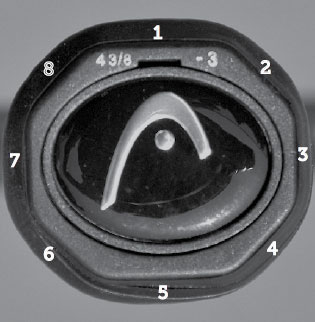
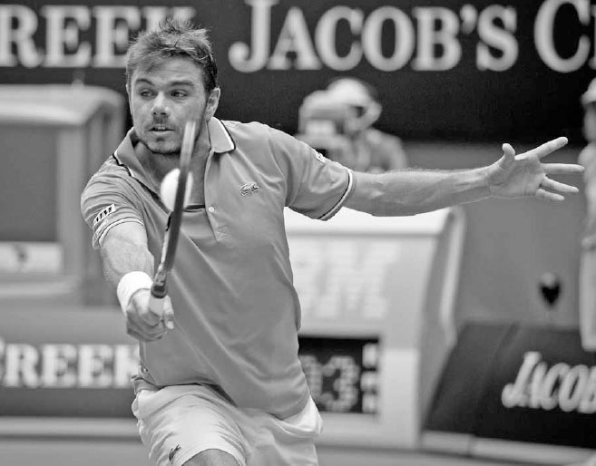

# Grips

Grips are the foundation of every tennis swing, or, as the great Rod Laver once put it, "The grip determines everything."(1) Your grip will influence the amount of speed and spin on each ball you hit. Some grips make it easier to angle the racquet face down, or be "closed," which is helpful for producing topspin on powerful groundstrokes. Other grips make it easier to angle the racquet face up, or be "open," which is helpful for creating backspin and controlling volleys and finesse shots. Your grip also affects where you make contact with the ball, and therefore, your body positioning and timing of your swing.

On some shots, like the serve, there is a very tight range of variability in how you should hold the racquet. On other shots, like the forehand topspin groundstroke, players have a wider range of choice in the grip used, with advantages and disadvantages to each. For example, Roger Federer and Novak Djokovic both have tremendous forehands, but each uses a different forehand grip (opposite).

**I. Grip Tension**

Before discussing the alignment of your hand on the grip, it's important to stress that holding the racquet too tightly will hurt your game. Your grip should be firm but not tight. Control of the racquet comes mostly from the palm of the hand, not from the excessive squeezing pressure of the fingers.

This is a subtle but important distinction.

If you feel your forearm and not the racquet head when you hit the ball, you are holding the grip too tightly and losing racquet speed, "feel" (sensitivity for the ball on the strings), and coordination. Using a slightly relaxed grip has the opposite effects. Let's discuss how grip tension affects power, feel, and coordination.

**1. POWER**

It is a common misconception in tennis to equate muscle tension with power because that is generally the case in other physical activities. If you wanted to lift a heavy object you would tense your muscles and lift. However, tennis --- in which a two-ounce ball is hit by a 27-inch-long swinging racquet --- involves completely different physics.

The formula for kinetic energy is KE = ½ mv2 (kinetic energy equals one-half mass multiplied by velocity squared). Therefore, doubling the velocity (racquet speed) will have a much larger effect on the energy delivered to the ball than doubling the mass. This is why a young junior can hit a tennis ball harder than some muscle-bound adults. The goal is to swing with speed, which can be done better with a relaxed arm. Additionally, on many shots, especially the serve and topspin groundstrokes, the racquet should lag slightly behind body movement, thus creating a strong "slingshot" effect for extra racquet head speed. This can only be done well if the muscles are relaxed.

**2. FEEL**

The way our body is designed results in our sense of touch being heightened when our muscles are looser. A surgeon, a concert pianist, a sharp shooter --- occupations that require fine fine motor skills - will all tell you that to perform well they need their muscles to be slightly relaxed. Tennis is a fine motor skill sport and not being tense will improve your feel for the ball on your strings.

**3. COORDINATION**

When our muscles are tight, our coordination is adversely affected, and this leads to poor timing and more mishits.

Keep in mind, you will squeeze the grip to varying degrees at contact depending on the shot played. On a power volley, you squeeze more than on finesse shots. Regardless of the stroke, the grip should be relaxed during the preparation phase to allow your muscles to perform best.

  --------------------------------------------------------------------------------------------------------------------------------------------------------------------------------------------------------------------------------------------------------------------
  **COACH'S BOX:**
  **Try rolling a ball around the edge of the racquet head while squeezing the grip tightly. Then do it while relaxing the thumb and index finger. You will notice how your feel for the ball and coordination improves when your hand is in a more relaxed state.**
  --------------------------------------------------------------------------------------------------------------------------------------------------------------------------------------------------------------------------------------------------------------------

**II. Types of Grips**

A tennis grip is octagonal with four main sides and four narrower bevels between the four main sides. I find the simplest way to explain how to find different grips is to assign a number to each of the eight sides of the racquet or racquet's grip (below).

I will use whole numbers to describe where to place the base knuckle of the index finger for most of the grips, but there is leeway to add or subtract half a bevel to find the grip most comfortable for you.

Moving the knuckle half a bevel up or down from the original bevel makes the grip a stronger or weaker version, respectively, of that grip. With every grip hold the racquet low in the handle and sequence your fingers so your index finger is above your thumb.

Grip bevels

**1. CONTINENTAL GRIP**

You can find the continental grip by putting the base knuckle of your index finger on bevel \#2. The continental grip is versatile and is used on the serve, volleys, slice groundstrokes, finesse shots, and when defending low and wide balls.

*Stan Wawrinka uses the continental grip on his slice backhand.*

The continental grip is used on the serve because it allows your wrist to pronate and accelerate the racquet best. It also gives you the ability to maximize contact height, take a full wind up, and hit heavy spins on the serve. By using the continental grip for volleys, where play at the net is fast, you are able to hit both the forehand and backhand volley without changing your grip. On slice groundstrokes (above) and finesse shots like the drop shot and lob, the continental grip increases the likelihood of accurate ball placement by allowing you to comfortably open the racquet face and "cradle" the ball on the strings for better control. Lastly, the way the continental grip naturally opens the racquet face makes it a preferable grip for low balls, and its later contact point can help you when rushed for a wide shot.

Because the continental grip is used on many shots, it is vital to master. If you are not acquainted with the continental grip, commit to the exercises at the end of this chapter because a lack of familiarity with this grip can negatively impact your performance on many strokes.

Continental Grip Eastern Forehand Grip Eastern Backhand Grip Semi-Western Forehand Grip Western Forhand Grip Two-handed backhand grip

**2. TOPSPIN GROUNDSTROKE GRIPS**

There are three topspin forehand grips (eastern, semi-western, and western) and three topspin backhand grips (eastern, semi-western, and two-handed) and they all have pros and cons. Spend time on the practice court to see which forehand and backhand grips work best for you.

**A. EASTERN GRIPS**

The eastern forehand grip (bevel \#3) and eastern backhand grip (bevel \#1) allow you to brush up the back of the ball to add topspin or easily flatten out your groundstroke for more aggressive intentions. The eastern forehand grip places the palm at the same angle as the strings, making it a suitable grip for recreational players to use as compared to the more closed western grips. The eastern grips are also good for net rushing players; since the change from the eastern to the continental grip is small, volleying is easier for these players than for other players who require a larger grip change. The negatives of the eastern grips are that high-bouncing balls are more difficult to return and groundstrokes may be less consistent because there is a smaller amount of topspin produced as compared to the western grips.

*Serena Williams' use of the semi-western grip allows her to change easily from hitting her forehand flat or with heavy topspin.*

**B. SEMI-WESTERN GRIPS**

Many consider the semi-western forehand grip (bevel \#3.5 - 4) to be the ultimate topspin forehand grip, and it is the grip most used by today's professionals. The semi-western backhand grip (bevel \#8) is for one-handed backhand players only. Although semi-western grips add more topspin to a shot than eastern grips, they still provide a racquet face that allows the ball to be hit with less topspin when a flatter, faster shot makes strategic sense. It is also a comfortable grip for a wide range of contact heights, particularly on the highbouncing balls common in the modern era.

**C. WESTERN FOREHAND GRIP**

The western forehand grip (bevel \#4 - 4.5) is the one that closes the racquet face the most and produces the greatest topspin. It is a comfortable grip to use on balls hit above the chest. The negatives are that it is a difficult grip on fast, low, or wide balls, and it is more challenging to hit flatter shots to produce winners.

**D. THE TWO-HANDED BACKHAND GRIP**

The two-handed backhand is the most popular way to hit the backhand at the higher levels of the game. The pros and cons of the two-handed backhand are discussed at length in Chapter Eight. There are different ways to grip the racquet for the two-handed backhand, but I recommend a continental grip (bevel \#2) on the right hand and an eastern to strong eastern forehand grip (left index finger base knuckle at bevels \#6 - 6.5) with the left hand. These grips allow the wrists to move freely and create good racquet head speed. Some players prefer an eastern backhand grip with the right hand, but I recommend the continental grip because it moves the contact point back slightly, allowing a precious split second longer to execute the shot. It is also easier to disguise a drop shot or hit a regular slice backhand because no grip change is necessary.

*Murray uses the two-handed backhand grip favored by most professionals: a continental grip with the right hand and eastern grip with the left hand.*

  ----------------------------------------------------------------------------------------------------------------------------------------------------------------------------------------------------------------------------------------------------------------------------------------------------------------------------------------------------------------------------------------------------------------------------------------------------------------------------------------------------------------------------------------------------------------------------------------------------------------------------
  **COACH'S BOX:**
  **Young children sometimes begin using the western grip on the forehand because it feels more comfortable on balls hit above the chest, a shot they encounter frequently. However, this can lead young players to develop poor stroke mechanics, causing them to lean back, bend their hitting elbow too much, and cut their swing short. Although the eastern grip or semi-western grip may initially feel more awkward on the higher balls for young players, using these grips will help them in the long run as it encourages fuller swings. If they naturally gravitate to the western grip later on, that is fine.**
  ----------------------------------------------------------------------------------------------------------------------------------------------------------------------------------------------------------------------------------------------------------------------------------------------------------------------------------------------------------------------------------------------------------------------------------------------------------------------------------------------------------------------------------------------------------------------------------------------------------------------------

**III. Grip Practice**

Learning anything new, including a new grip, should be done progressively. You don't learn algebra without first learning how to count. Similarly, in tennis it's best to start small and build up. If you are learning a topspin grip, start by hitting from the service line and move backwards towards the baseline three feet at a time as you become more comfortable with it. Learning the continental grip for slice groundstrokes can be done the same way. Due to the strong impact of the ball when hitting volleys, I recommend you first learn the continental grip off the bounce from the service line before you volley the ball out of the air. Learning this way also provides more time to turn the shoulders and develop good body positioning habits for the volley.

Ball taps.

**1. BALL TAPS**

Using the continental grip, place the racquet in front of you at a 10 o'clock angle and dribble the ball down from a waist high position like a basketball player (left). This ball tap exercise will help you get familiar with the continental grip for the serve. Next, tap the ball up two to three feet in the air with the palm up and the racquet positioned at a two o'clock angle, and then do the same with the palm down and the racquet positioned at a nine o'clock angle. These two ball tap exercises will help your forehand and backhand volleys.

**2. THE WALL**

Hitting against the wall provides helpful repetition, which can quickly get you accustomed to any type of grip. If working on the continental grip, position yourself about 10 to 15 feet from the wall and hit gentle shots allowing the ball to bounce before you hit it. Serve practice with the continental grip can also be done against the wall. If you're learning a new topspin groundstroke grip, stand far enough away from the wall to allow the ball to bounce two or three times before hitting the ball. This will give you time to perform a full follow through.

**Balance** "Your degree of balance will impact many facets of your game, including rally ascendancy, stroke power, racquet control, vision, and recovery."

**Kinetic Chain** "The energy generated by the legs is transferred and increased up the body, culminating in an end point power surge."

**Movement** "Simply put, tennis revolves around movement and every player should work hard to ensure it is an asset."

**Grip** "Grips are the foundation of every tennis swing."

BALANCE (Chapter One) underpins stroke control, THE KINETIC CHAIN (Chapter Two) boosts stroke power, MOVEMENT (Chapter Three) provides the time and positioning to get balanced and ignite the kinetic chain, and GRIP (Chapter Four) impacts not only stroke power and control, but also spin and technique. Now that the athletic principles and grips of tennis --- the bedrocks of every great shot --- have been covered, it's time to learn strokes, starting with arguably the most important one: the serve.

*Pete Sampras' powerful serve was the cornerstone of his game.*
