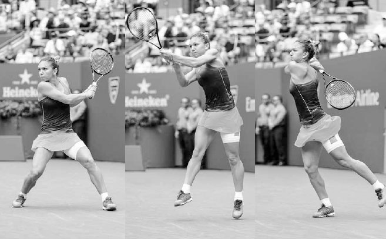
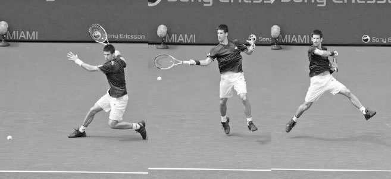

# Kinetic Chain

This incredible alignment and coordination is the foundation of Serena Williams' serving technique and the foundation of contemporary tennis: a full body windup designed to deliver a striking blow. It is known as the kinetic chain. The kinetic chain reimagines the body as a system of chain links, whereby the energy generated by the legs is transferred and increased up the body, culminating in an end point power surge as you hit the ball. In this chapter, I will explain the benefits of the kinetic chain, including improved shot power and consistency, conservation of energy, and reduced likelihood of injury. I then teach you how to optimize the kinetic chain and finish with exercises designed to increase your kinetic chain strength.

Vorsprung dutch technik \<\<Advancement through technology\>\> --- Federer's superb use of the kinetic chain lifts him high above the ground on this serve. It allows him to hit with tremendous power without overexertion and is a contributing factor to his record of competing in 65 Grand Slam tournaments in a row.

**I. The Benefits of the Kinetic Chain**

**1. ENHANCED SHOT POWER**

While your arm and shoulder are the primary source of racquet speed on the serve, if you were to serve by just moving your arm, you would hit a mediocre serve. It is the big muscles of your legs and abdomen that comprise the driving force that supplies strength to your arm and speed to your racquet.

The power and contact height required for a good serve starts with the legs bending, straightening, and then pushing up from the ground, creating a ground force reaction. The energy in the legs then moves up the body and is increased by the rotation of the hips and shoulders. This energy, now located in the shoulders, is further amplified by a pronating forearm and wrist, which releases a burst of power that began in your legs out and onto the racquet (opposite).

The same concept applies to your groundstrokes. The energy stored initially in the legs flows up the body and synchronizes with the forward swing to add racquet head speed and weight to the shot. In today's game, the serve and groundstrokes are the swings that determine the outcome of most points. **Thus, it is vital that you are able to perform the kinetic chain well.**

  ----------------------------------------------------------------------------------------------------------------------------------------------------------------------------------------------------------------------------------------------------------------------------------------------------------------------------------------------------------------------------------------------------------------------------------------------------------------------------------------------------------------------------------------------------------------------------------------------------------------------------------------
  **COACH'S BOX:**
  **The serve is a throwing motion. To help my students understand the importance of the kinetic chain on the serve, I sometimes ask them to throw a ball four different ways: first, facing the net and throwing without moving the shoulders in a "shot put" motion; second, still facing the net but this time rotating the shoulders during the throw; third, the same way but now bending the knees and driving with the legs; and last, establishing a sideways stance and using a full throwing motion with some forward momentum. With each kinetic chain link that is added, the ball is thrown a longer and longer distance.**
  ----------------------------------------------------------------------------------------------------------------------------------------------------------------------------------------------------------------------------------------------------------------------------------------------------------------------------------------------------------------------------------------------------------------------------------------------------------------------------------------------------------------------------------------------------------------------------------------------------------------------------------------

**2. IMPROVED CONSISTENCY**

If you use the kinetic chain incorrectly and depend primarily on the upper body and arm movement, you will lose racquet control and make more mistakes. If your arm moves vigorously without support from below, you will find it difficult to balance the racquet well at contact. On the other hand, if you use the kinetic chain correctly, you will not only gain more power but your strokes will also become more consistent. By deriving power from throughout your body, your arm and wrist can focus less on increasing power and more on stabilizing the racquet and establishing the precise angle of the strings needed to hit a consistent shot.

**3. ENERGY CONSERVATION AND INJURY REDUCTION**

**Players who are stiff in the legs and core tense up their upper body muscles and make exhaustive arm movements attempting to gain racquet speed.Repetitively swinging the racquet in this manner will not only increase fatigue, but also intensify strain on the muscles and joints and, over time, possibly damage the arm and shoulder. If you use the kinetic chain well, you will place less stress on your arm and shoulder. Your arm will "come along for the ride" on the wave of energy surging from your legs and core, making efficient use of your whole body.**

**II. How to Optimize the Kinetic Chain**

**The benefits of the kinetic chain are clear, so how do we maximize its advantages? The kinetic chain works best when it is timed correctly and when you are balanced, prepared, and possess full body strength and flexibility.**

**1. CORRECT TIMING**

The timing and sequence of the kinetic chain is important. The kinetic chain has a rhythm of the body lowering with the racquet close to the torso on the backswing, followed by the body rising as you exhale and swing the racquet out and away from the torso on the forward swing. Initiating the kinetic chain too early or too late will reduce its beneficial effects. During the serve, for example, if the racquet moves forward to the ball before the legs have begun to straighten, then the kinetic chain is incorrectly timed and will not function properly.

*Simona Halep establishes a strong base before pushing up from the ground and landing balanced.*

**2. GOOD BALANCE**

You must be in a balanced state for your legs to push up efficiently from the ground. Use poor posture or lean incorrectly during the swing, and your feet can't dig in the court (left) to establish the strong base needed to push forcefully up from the ground (center). If you position yourself too far away from the ball while hitting a forehand, your posture will be poor and your feet will shuffle during the swing, sapping your power. This is one of many reasons footwork is such an important feature of tennis. Good footwork will get you in the correct position to be balanced, and only then with this good balance established can the power generated from the kinetic chain be uncorked.

**3. EARLY PREPARATION**

Do your best to establish good positioning early. This will allow you the necessary time to push well with your legs. By getting into position early and setting your feet, you can store more power in your legs during your backswing before unloading it upwards during the forward swing. If you are rushed and without time to set up properly, you will primarily use your smaller arm muscles, resulting in less weight behind the shot.

**4. FULL BODY STRENGTH**

Tennis players need to be physically strong throughout their whole body to perform the kinetic chain well. You can compare the energy of the kinetic chain to water flowing through the body. If one body part is weak in the link, it in effect creates a dam, and the energy produced before that link is diminished. **For example, if a player has a weak abdomen, then the power that began in the legs will decrease through the torso as it filters up to the shoulders.**

**5. SUPERIOR FLEXIBILITY**

You can enhance your kinetic chain by being flexible and by using the "stretch- shortening cycle" of muscles. The stretch-shortening cycle acts somewhat like a rubber band, where the stretching of a muscle is immediately followed by a more powerful shortening of the muscle. The greater your flexibility, the bigger the stretch, and therefore, the greater the amount of energy that can be forged by this effect. For instance, **at the end of your forehand backswing, your chest and shoulder muscles elongate as your hips rotate into the shot andthe inertia of your arm causes the racquet to lag behind. This lagging of the racquet stretches the chest and shoulder muscles and stores energy, which is released as these muscles contract, powering the racquet forward faster to hit the ball.**

**III. How Much Should Your Body Move?**

TENNIS IS A DYNAMIC GAME, so it is logical that the amount of body movement during the kinetic chain should and will vary depending on the shot. The kinetic chain is used on every serve and power groundstroke, but is used in different amounts on other shots depending on the speed of the incoming ball and the force of your swing. You must be responsive to the circumstances and use the right amount of body movement in your swing to achieve not only the most power, but also the best control.

The kinetic chain is more important on slower incoming balls, where you need to generate your own power. The best power forehands hit off a slow arriving ball are ones where you can set your feet, bend and then straighten your legs, uncoil the hips and shoulders, and unleash into the stroke (next page, top). On clay courts or any slow surface, where the occasions to generate your own power are more frequent, performing a full and vigorous kinetic chain is a vital component in hitting aggressively.

In contrast, on less aggressive shots --- like drop shots and slice groundstrokes --- you'll have less need for kinetic chain-induced power (bottom). The body will be more still on these shots, or "stay down" in coaching parlance. In addition, the kinetic chain is less important on volleys or when receiving fast balls because on these shots the ball has inherent power. For example, when returning a fast serve, there is power stored in the arriving ball and the need for strong sequential body movement is not required; on the contrary, it will only unnecessarily complicate the timing of the shot. For recreational players, staying down is a good groundstroke mantra because it simplifies timing, and it is a technique that agrees with the speed of their swings. Keep in mind, this reduction in body movement during the kinetic chain is done more often on hard courts, where the bounce of the ball is lower and faster than clay courts.

*Djokovic uses strong kinetic chain power while hitting this aggressive topspin forehand off a slow ball.*

However, on this slice backhand, he keeps his body more level and mutes kinetic chain power.

**IV. Kinetic Chain Practice**

How do you build a strong kinetic chain? Kinetic chain strength largely comes from building a solid core, the central third of the body that includes the spine, back, hips, and abdomen. The core is key to a strong kinetic chain; in order to maximize power, the kinetic chain's energy surge must flow through the core without being diminished. In addition, the hip and shoulder rotation stage of the kinetic chain relies on a strong core for support. Professional tennis players understand this and train hard to strengthen this part of the body, often turning to their favorite core workout tool: the medicine ball.

Medicine ball workouts train you to use your body as an integrated system due to the force required for the explosive throwing of the weighted ball. Also, you can copy specific swings, such as a forehand or backhand, and mimic the different movements that are used on the court.

Choose a medicine ball weight and number of repetitions appropriate to your fitness level for the following exercises.

**1. GROUNDSTROKE MEDICINE BALL EXERCISES**

Stand sideways to a wall (with the wall on your left) leading with your left foot in a crouched position. Hold the medicine ball behind your right hip with most of your weight on your right leg. Mimic the loading position of the forehand and throw the ball to the wall following the forehand swing, maintaining good posture while rotating your torso. Follow through with both your hands finishing shoulder high and hips square to the wall. Then copy the backhand motion by doing the same movement but facing the opposite way and leading with the right leg. If you have a practice partner, it is a good idea to do these tosses while catching and moving around as you would during a baseline rally (left).

**2. SERVING MEDICINE BALL EXERCISES**

Stand facing a wall with your feet about shoulder width apart, place your hands on the sides of the medicine ball, and raise the ball high above your head. From this position, throw the ball against the wall in three different directions: upwards, straight ahead, and down to the ground in front of you. Next, change your leg positioning so that you lead with your left foot, finding yourself in the sideways serving stance. With the ball above your head, bend your knees, rotate your hips and shoulders in a similar fashion to a serve, and throw the ball upwards at around a 45 degree angle as far as you can against the wall or to a training partner.

**3. VOLLEY MEDICINE BALL EXERCISES**

Simply playing a game of catch with a training partner will strengthen the shoulder and arm muscles used on the volley. Throw the medicine ball using a chest-press motion, keeping the elbows near the body, while moving across the court with a partner. Next, throw the ball using the same chest-press motion while stepping with the left leg forward and then the right leg forward as you move across the court.

*Tennis players need to be quick and agile in their movement. Here, Federer makes a ballet-like move to play this high backhand volley.*
