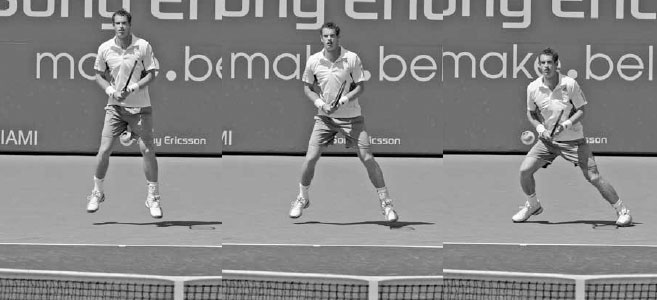
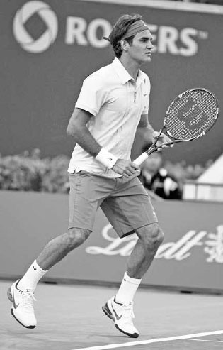
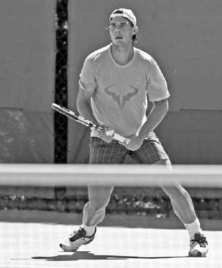
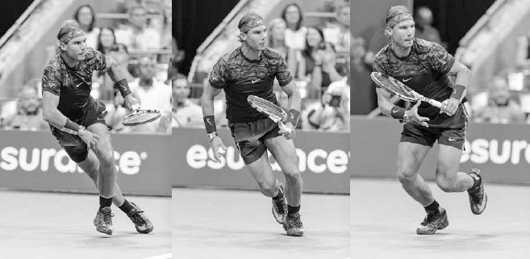
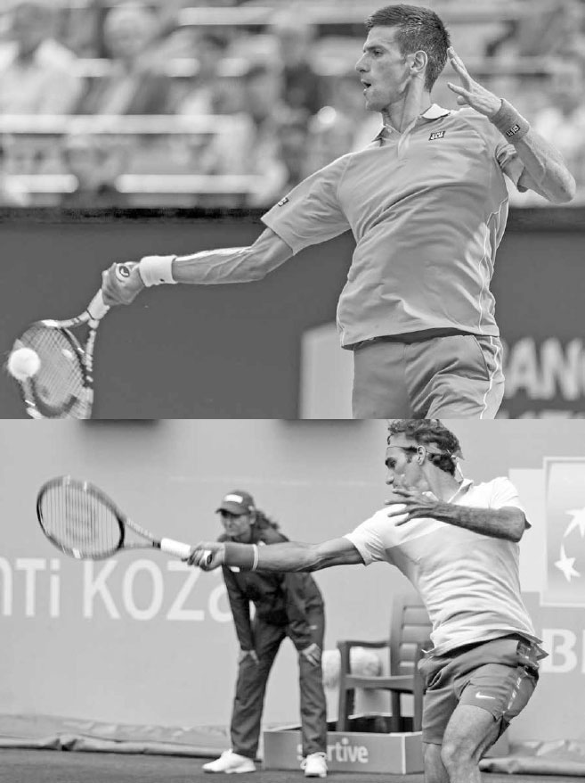

# Movement

Movement during a rally involves several different types of footwork including shuffles, skips, and slides as well as short, multi-directional sprints. You can think of court coverage as a dance where the ball is your partner and, because the ball comes at different speeds and lands in different locations, it is a partner adept at many different moves. On a high stretching backhand volley, your movement may resemble ballet, while the little steps recommended just before hitting a groundstroke may resemble the cha-cha. Making the right "dance" moves to the ball means reading the speed, spin, and trajectory of the incoming shot, predicting where the ball will land, and positioning your legs accordingly in the most comfortable stance. Players who have flexibility and adaptability in the way they move to the ball or, in dancing terms, the dancers that can change with the beat, are the ones who have the best footwork.

In Chapter 16, I explain the various components of fitness (flexibility, agility, quickness, core stability, endurance, and strength) that are important to overall movement. In this chapter, I focus specifically on the movement that occurs on the court and the different types of steps done sequentially that lead to a well-executed stroke: a split step, an explosive first step, small adjustment steps, and lastly, sliding.

**I. Split Step**

Good movements start with a strong split step (opposite bottom). Sometimes called the "ready hop," the goal of the split step is to heighten your state of awareness so that your body can react quickly at the critical moment when the ball comes off your opponent's strings.

The split step helps overcome the negative effects of inertia, making it easier to begin movement at a time when the body would otherwise be at rest. Pushing a stalled car is difficult, but once it starts moving, the car becomes asier to move. In tennis, the split step makes it easier to push the body.

The split step not only helps when there is little movement, but also when there is a lot of movement. It stops your body momentum from your recovery after playing a wide shot, improving your ability to take off quickly for the next shot.

  ----------------------------------------------------------------------------------------------------------------------------------------------------------------------------------------------------------------------------------------------------------------------------------------------------------------------------------------------------------------------------------------------------------------------------------------------------------------------------------------------------------------------------------------------------------------------------------------------------------------------------------------------------------------------------------------------------
  **COACH'S BOX:**
  **The panther is a great mover partly due to its malleable body and low center of gravity. The giraffe has opposite qualities. Playing in a panther-like athletic manner --- staying loose and low to the ground --- takes practice and good leg strength. This is why some players succumb to standing stiff and upright, giraffe-like during points, leading to a slow first step and less than ideal movement. During your practice sessions, allow your body to take on different shapes and remind yourself to crouch and lower your center of gravity. Making these athletic fundamentals a habit will speed up your movement, helping you to pounce faster on your prey, the tennis ball.**
  ----------------------------------------------------------------------------------------------------------------------------------------------------------------------------------------------------------------------------------------------------------------------------------------------------------------------------------------------------------------------------------------------------------------------------------------------------------------------------------------------------------------------------------------------------------------------------------------------------------------------------------------------------------------------------------------------------

TECHNIQUE You set up for the split step by getting into the athletic stance. The athletic stance places each foot several inches outside the shoulders with legs slightly bent so you stand around six to eight inches lower than your natural height (right). In this crouched position, you lean slightly forward with your upper body, but with your hips back and back fairly straight.

The athletic stance lowers your center of gravity and moves some of your body weight from the legs up towards the hips. This "lightens" the body and assists you in reacting quickly to your opponent's shot. Another helpful car analogy involves the design of Formula 1 racing cars. These cars have a wide wheel base and a very low center of gravity that hovers just above the ground. This design allows the car to move and change directions quickly.

After setting up in the athletic stance, the split step is done by hopping with both feet just above the ground an instant before your opponent makes contact with the ball (previous page, left). Your legs should open a little wider (i.e. split) as they lift off the ground (previous page, center). The higher off the ground you split step, the more force you apply with your feet to the court surface, and the more explosive your first step will be as a result.

*Andy Murray's explosive first step is partly attributed to his high and wide split step (left and center) and timing. He hits the ground (right) at the exact moment he knows which direction he needs to move.*

*Johanna Konta's athletic stance: feet outside the shoulders, knees bent, back reasonably straight, and weight slightly forward.*

  ----------------------------------------------------------------------------------------------------------------------------------------------------------------------------------------------------------------------------------------------------------------------------------------------------------------------------------------------------------------------------------------------------------------------
  **COACH'S BOX:**
  **Every professional uses the split step, and it's a bit perplexing that more recreational players don't employ it. It's important, and anyone who can jump an inch off the ground can do it. If the split step isn't part of your game yet, practice by rallying against a wall. Every time the ball hits the wall, do your split step. Once you have it, it becomes instinctive and an easy movement to perform.**
  ----------------------------------------------------------------------------------------------------------------------------------------------------------------------------------------------------------------------------------------------------------------------------------------------------------------------------------------------------------------------------------------------------------------------

*At the end of this split step, Federer's left foot is touching the ground first, indicating he is anticipating moving to the right.*

The upward hop with both feet is followed by a lowering of the body with your weight forward and knees slightly bent when you hit the ground (previous page, right). Timing is a key aspect of the split step; your feet should hit the ground just as you first know which way you have to move.

This upward and downward movement of the body stores energy in the legs, allowing you to generate a more powerful first movement to the ball.

Additionally, performing the split step shifts your weight forward to the front of your feet, naturally lifting your heels off the ground and eliminating the required step of lifting your heels to move.

Once you have mastered the basic split step, you can learn the advanced split step, whereby you land on the foot opposite the direction you anticipate you will need to move. For example, if you are anticipating the need to move right, then you will land with more weight on your left foot to allow you to push off aggressively towards the right (left).

**II. First Step**

After the split step, a good first step is critical because there is so little time to build up the speed necessary to reach your opponent's shot. If the first step is poor, all the subsequent steps also will be slower, hurting your ability to get into good positioning for the stroke or reach your opponent's shot. This is why a well-disguised shot is so effective. When you get fooled by a deceptive drop shot, your weak first step means there is a good chance you will never gather the speed needed to run down the ball. If you can anticipate the drop shot you will take a stronger first step and run much faster.

*After completing his split step, Nadal lowers his body, leans, and pivots his feet to help him take off quickly for his next shot.*

In order to take a powerful first step, you need to simultaneously lower your body, lean towards the ball, and pivot your feet to open your hips in the direction you wish to move (left). It is important that your upper body leans forward slightly as you take the first step to match the push-off angle of the feet to the hips, spine, and shoulders (right).

Leaning with the upper body is also important in getting a strong first step to recover. To recover after hitting a wide ball, lean forward right or left against the momentum of the direction you were running (next page, bottom). If you are stiff in your trunk, you will find it difficult to put on the brakes and change course. Be flexible and have your body take on different shapes so that your trunk shifts in the direction that allows your legs to first move to the ball and then to recover.

*To speed up her movement forward, Garbine Muguruza leans forward to match the push-off angle of her feet to the rest of her body.*

While the great movers lean left, right, backward, or forward depending on the direction of their first step, they quickly straighten their backs to restore good posture once the first movement is completed. Watching Djokovic shortly after he completes his first move, you will notice how he stays low to the ground while maintaining good posture. The strength in his legs and core allows him to move quickly with his legs bent and his upper body fairly upright (above). This posture both enables him to slow down quickly once he nears the ball and helps him keep his head still to track the ball better and judge correctly where it will land.

*Djokovic quickly regains his posture after a strong first step as he moves forard to reach a drop shot.*

*With a long distance to recover, Nadal uses the crossover step followed by running steps.*

TYPES OF FIRST STEPS Because the ball arrives in different locations at varying speeds, there are many different first steps. For example, if there is only a short distance to cover, the the first step usually will be a small half-step out in the direction of the ball with the foot closest to the ball. But if there is a long distance to cover, the foot closest to the ball might slide underneath the torso and not in the direction of the ball. This slants the body in the direction you need to move, helping you accelerate to reach a difficult ball.

*With a short distance to recover, Jo-Wilfried Tsonga uses a crossover step folowed by lateral side shuffles.*

There are specific first steps to recovery as well. The crossover step, whereby the right leg moves in front and to the left of the left leg, or vice versa, is an important first step to learn in order to recover quickly. If there is a lot of ground to cover after returning a very wide ball, the first step will usually be a crossover step followed by running steps (opposite bottom). If recovering from a shot that is less wide, the the first step often will be a crossover step, but this time will be followed by lateral side shuffles (above).

**III. Adjustment Steps**

After your split step and first step, your movement to the ball continues with larger steps to cover ground and then, if time allows, small adjustment steps before your swing. These small adjustment steps allow you to compensate for any early misjudgments on where you thought the ball would land so that you end up the correct distance from the ball. Keep in mind, where you think the ball might land when it is 40 feet away may be quite different from where you know it will land when the ball is 15 feet away.

Adjustment steps will also improve your groundstrokes' rhythm and timing. As Nadal's coach Francis Roig once said, "The most important thing is how you read the ball and understand how it is going to bounce. In tennis, if you are too fast, it's bad. If you're too slow, it's bad. You have to be on time."(2) By using small adjustment steps as the ball approaches (above), you increase your chances of positioning yourself at the right spot at the correct time to hit with power and balance.

*Nadal takes little adjustment steps before unloading on this forehand.*

Next time you are watching a professional match, pay attention to the little steps the players take before their shots. On hard courts, you can hear their shoes squeaking on the courts as they use these steps to get into the best possible position. They play with "happy" feet. At the recreational level, the ball is traveling at a speed where there is time to take adjustment steps before most shots.

*Jack Sock widens his stance and leans back to allow his right foot to slide after hitting this slice backhand.*

**IV. Sliding**

For those of you that play on Har-Tru or clay courts, learning to slide on the court is important. It helps produce a quicker recovery, maintain balance, and save energy.

To slide well you must bend your knees, widen your stance, and keep the upper body straight. As you begin the slide, lean your upper body back against the direction of the front foot to allow the foot to slide (opposite bottom). If your legs straighten or your upper body tilts forward, your sliding foot will grip on the court surface, causing you to come to a sudden stop and stumble.

The lead foot slides, pointing in the direction you are moving, while your back foot lines up perpendicularly to the front foot, anchoring your balance. **On strokes described later in the book, your right foot will lead the slide on open stance forehands, slice backhands, and backhand volleys, and the left foot will lead on open stance backhands and most forehand volleys. The timing of the slide on slice groundstrokes is different as compared to topspin groundstrokes.** On slice groundstrokes, you will still be sliding as you play the shot and finish the slide after the ball has left your racquet. This type of slide is often used defending against a wide baseline shot or while moving forward to scoop up a well played drop shot. On topspin strokes, your slide should be complete before initiating the forward swing (below). As your slide comes to a stop on topspin strokes, you will push up with the legs and use the core of the body to swing with power. It takes practice to determine the optimal slide length that will allow you to stabilize your legs at the end of the slide and push up from the ground.

*Gaël Monfils ends his slide before unleashing on this topspin forehand.*

**V. Movement Practice**

Please refer to chapter 16 for exercises to improve your movement.

*Two great forehand players who use different grips: Djokovic (above) uses a western grip while Federer (below) uses a strong eastern grip.*
