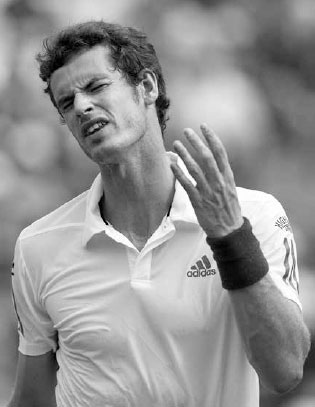
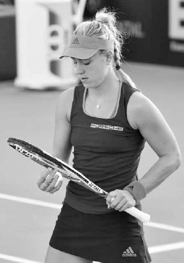
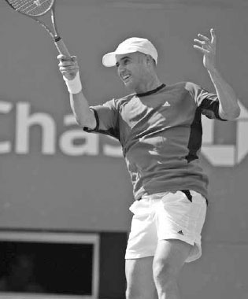

# Psychology

Improving mentally doesn't happen overnight but rather, like everything else in tennis, takes training and experience. Roger Federer and Bjorn Borg are two examples of professional players who have a good temperament on the court. But this wasn't always the case. As kids, their parents revoked their playing privileges after angry outbursts on the court. Over time, both players learned to control their emotions and made the mental side of their game a strength. For most of us, like Federer and Borg, becoming mentally strong is a skill that must be nurtured and developed.

In this chapter, I'll give you a mental training regime that will help you both gain a cerebral edge over your opponents and enjoy the game more. The chapter is divided into eight sections: the inner voice, concentration, confidence, overconfidence, overcoming adversity, nervousness, body language, and visualization.

**I. The Inner Voice**

THE FIRST THING YOU MUST LEARN is to navigate the challenges of play with a positive and constructive inner voice. The inner voice is crucial in every sport, but it is especially so in tennis since a proportionally small amount of the time is spent actually playing the point. The rest of the time goes to picking up balls, changing ends, and getting ready for the next point. You want to spend that time thinking coherently and staying emotionally upbeat.

The messages spoken by your inner voice are energy impulses that affect how your brain processes the match. You can be winning but feel flat, or you can be losing but still feel energized, all by the messages sent through the mind. Mentally tough competitors know that thoughts control emotions and emotions affect performance. It is important to remember that if you have positive thoughts, you will be in a good emotional state and play at a higher level.

How can you work on improving your inner voice? Through mindfulness. That is, during the match, ask yourself if your thoughts are making you play better or worse. Train yourself so that when a negative thought enters your mind, you recognize it, dismiss it, and replace it with a positive thought. A dysfunctional inner voice that says "I hate my serve" will compromise your serve and make it worse --- thoughts can become self-fulfilling prophecies. Instead, after a double fault, adopt self-talk such as, "I've hit great serves countless times before and I'm going to do another one right now." Or, if you start a match poorly, don't tell yourself, "Today just isn't my day." Instead, tell yourself, "It's early in the match and I know my timing and rhythm will improve as the match progresses." All these inner thoughts have emotional consequences, but the latter ones are much more productive to your performance. Playing well comes from confidence and trust in your game, and your thoughts should reflect that confidence and trust.

Of course, every mind is different and your mind will respond to words in its own unique way, so experiment with different words and phrases until you discover the ones that motivate you and overpower your negative subconscious. After the match, analyze how well your inner voice spoke to you and assess the negative-to-positive message ratio. The positives should vastly outweigh the negatives.

*"Be good to yourself,"Murray once wrote in a notebook that he read on court; he knows that his negative inner voice has sometimes adversely affected his performance.(2) Karolina Pliskova responds positively after winning a point.*

Also, don't weigh down your mind with too much self-talk on technique during the match. Save working on technique for the practice court. During matches, self-talk should focus on staying positive, tactics, and overall competitiveness. Thinking about technique during the match can lead to "paralysis by analysis," when attempts to improve synchronized brain activity and muscle movement instead makes it worse. As Serena Williams once said, "When I think too much, I don't serve well. When I just say, 'Serena, just hit the ball and serve,' that's when I serve really well."(3)

  --------------------------------------------------------------------------------------------------------------------------------------------------------------------------------------------------------------------------------------------------------------------------------
  **COACH'S BOX:**
  **Talk to yourself as you would to your doubles partner when you wish to inspire them or elevate their play. By talking to yourself as a doubles partner or good friend, you will self-talk in a supportive and encouraging way rather than in a critical and demeaning way.**
  --------------------------------------------------------------------------------------------------------------------------------------------------------------------------------------------------------------------------------------------------------------------------------

**INNER VOICE TRAINING** After the point is over, you have approximately 15 seconds to get ready for the next point. During that time there are four stages the inner voice must navigate through to stay constructive.(4) By doing this and establishing your own pace and rhythm between points, you will feel in control and gainconfidence from that feeling and its familiarity.

STAGE 1: RESPOND TO THE LAST POINT If you win the point, you should use the positive feelings to spur your energy; if you lost it, quickly reflect on what can be learned and get back into a positive frame of mind.

STAGE 2: RELAX AND RECOVER During this stage, your breathing should be deep, your body language positive, and your inner voice quiet, ensuring that the mind is relaxed and feeling reassured.

STAGE 3: PREPARE Begin lifting your emotional state and become excited about playing the next point. Now you are thinking strategically about how you are going to serve or return and what level of aggression will give you the best probability of winning the point.

STAGE 4: PERFORM RITUALS Rituals may include how many times you bounce the ball on the serve or how you move around on your feet before the return of serve. These rituals before you start the point place your body on autopilot and allow your mind to become unencumbered, deepening your focus for the task ahead.

All professionals develop their own methods to figure out how to use their inner voice as a positive force through each of the four stages. Practice and develop your own way of staying upbeat between points and use that process to be in an optimal emotional state as you begin each point.

Sometimes the professionals use rituals such as straightening their strings to gather their thoughts.

**II. Concentration**

TENNIS REQUIRES STEADY concentration. If you can sustain concentration, you will make good shot choices, stay true to your prepared game plan, and take a big step forward toward maintaining the energy level and determination needed to win the match.

It can be difficult to concentrate because our minds naturally tend to shift focus when presented with novel stimuli. This bias towards new sights and sounds once alerted our ancestors to dangers in the wild, but it is a destructive force in the game of tennis. In a typical match, you will bombarded with internal and external stimuli, thoughts, and emotions. If you are fully focused, you should be able to block out everything extraneous to your game plan, whether it is an unruly supporter of your opponent, another match happening on an adjacent court, or an opponent who takes an inordinate amount of time between points. Players with good concentration can control the direction of their thoughts and block out these types of distractions.

It is important to know not only what to concentrate on, but also how to maintain concentration over a long period of time. Many players are able to focus fully for a set, but few are able to do it continuously for two or three sets.

Fortunately, concentration is a mental skill that can be developed through repetition and practice. It is also helpful to develop inner voice catch phrases like "only the ball matters" or "right here, right now," and add rituals such as straightening your strings or bouncing the ball on the ground to bring a distracted mind back to where it should be.

Jelena Jankovic let frustration from losing a lead in the second set cloud her focus during the third set at the 2015 Indian Wells final.

**1. STAYING PRESENT**

Concentration requires staying present. After any setback,whether losing a big lead or missing an easy shot, it can be difficult to stay focused. Many players, even the touring pros, dwell on setbacks and end up frustrating themselves even more. Jelena Jankovic, in the third set of the 2015 Indian Wellswomen's singles final, was still thinking about blown chances earlier in the match. During a changeover in a close third set, I heard her on television say to her coach, "I haven't been able to hold my serve...That's why I lost that second set." She went on to lose the match, and her lack of present thought didn't help.

Your mind should be clear at the beginning of each point. Dwelling on your previously missed shot only reinforces that mistake in your mind and increases the likelihood of making the same mistake again. If you are distracted in any way by the previous point, bring your mind back to the present and keep your focus on the next serve or return of serve.

  -----------------------------------------------------------------------------------------------------------------------------------------------------------------------------------------------------------------------------------------------------------------------------------------------------------------------------------------------------------------------------------------------------------------------------------------------------------------------------------------------------------------------------------------
  **COACH'S BOX:**
  **During practice sessions, play lengthy games that emphasize the score to heighten and extend concentration. For example, play games of "Ping Pong" where you and your practice partner serve five points at a time and the first player to 21 points wins. If someone forgets the score they must do a designated physical activity, such as push-ups or running laps around the court, as a penalty. The more you can practice being in situations that demand focus, the longer and stronger your power of concentration will be.**
  -----------------------------------------------------------------------------------------------------------------------------------------------------------------------------------------------------------------------------------------------------------------------------------------------------------------------------------------------------------------------------------------------------------------------------------------------------------------------------------------------------------------------------------------

This is not to say that you shouldn't learn from what just happened, but rather that you should not dwell on past mistakes. For instance, if you missed the previous point because you attempted a risky shot, you can remind yourself to be more patient next time. Or, if your opponent hits a winning volley from close to the net, you can make a mental note to lob more frequently.

Remember that the negative mental characteristics of overconfidence and lack of confidence are both future-oriented qualities that share the absence of present thought. For example, relaxing when you are ahead 40-0 because you assume the game is yours can be costly. If you lose the 40-0 point through a careless shot and then lose the subsequent point, the score is suddenly 40-30 and not only has your opponent regained the momentum, but the possibility of losing the game that you were well ahead in may raise your anxiety and cause you to play the 40-30 point poorly.

The bottom line: don't procrastinate. Fight to stay present in every game one point at a time, because the momentum of a game can quickly shift quickly away from you. If you are down 0-40, don't give up on winning the game; your opponent may suffer from lack of present thought, play a loose point, and allow you back in the game. This can be huge in a match. Winning a game from 0-40 down can demoralize your opponent and sometimes change the complexion of the set.

**2. FOCUS ON THE PROCESS**

Players who are able to stay present have trained their mind to focus on the process and not the outcome. Don't obsess on winning or losing. Think of the match more as a probability gambit and focus on performing the actions that will tilt the odds in your favor.

The negative effects of focusing on the outcome were apparent in Serena Williams' loss to Roberta Vinci at the 2015 U.S. Open. The pressure to win that tournament and complete the historic Grand Slam contributed to Serena's nervous play and loss to a player she had defeated in four previous match-ups without losing a set. Even in the relaxed environment of my group lessons, the negative impact of focusing on the outcome is sometimes easily recognizable.

If a game of first to eleven points ends up being nine points all, the swings that were confident at the beginning of the game sometimes become less assured. Instead of raising their level of play when it counts the most, often the closer players get to the outcome, the lower their performance.

To keep your level of performance consistently high, focus on the process. You can think of the process of the match like a GPS guiding you to a desired destination. Similar to GPS giving you a sequence of street directions, the point-to-point tennis process that guides you to victory involves staying mentally positive, moving your feet well, using the right tactics, and hitting with the appropriate level of aggression. If you concentrate in this manner, you will more than likely arrive at your desired destination at the end of the match: victory.

Andre Agassi once wrote, "Freed from the thoughts of winning, I instantly play better. I stop thinking, start feeling. My shots become a half-second quicker, my decisions become the product of instinct rather than logic."(5) View focus on the process with a sense of fascination and enthusiasm. Tennis has many strokes and variables all filtered through the imperfection of humankind, and therefore, the process can never be predictable or mundane. That's a wonderful quality of tennis; take advantage of it. After winning match point, you should feel great about winning, but also slightly let down that the enjoyment from being immersed in the process is over. If you are able to feel this way, you will play enthused and relaxed, and reach a sublime state that not enough players experience.

**III. Nervousness**

NERVOUSNESS CAN PRODUCE SPECIFIC physical and mental stresses. It can lead to an elevated heart rate, tension in the legs and arms, and a racing mind. In turn, this can slow down your movement, tighten your grip, and cloud your concentration. Your swing speed may change from one of controlled aggression to either hitting tentatively and hoping the ball will go in or swinging aggressively to end the point as quickly as possible. Of course, the great irony of nervousness is that players get tight because they are driven to win, but unfortunately it can lead to a style of play that takes them further away from achieving that goal.

To be sure, a level of nervousness is built into the sport itself. Due to the way tennis is scored,comebacks are encouraged, so players can feel a lack of security when ahead. The sudden nature of the scoring system can raise anxiety as well. For example, at 5-5 in a third set tiebreak, both players are two points away from winning a very long match. There is a lot of time, effort, and emotion invested in the match up to that point so it is understandable that players can get nervous. Furthermore, there are no time constraints in tennis, and therefore, there is no way to safely hold on to a lead by running out the clock. You must finish the job. You can work to overcome the nervousness inherent in tennis. Here are five mental tips that can reduce your nervousness.

**1. PERCEIVE THE SITUATION CORRECTLY**

Anxiety's effect on your level of play is largely based on your perception. Embrace the mind-set that you are lucky to be healthy and playing a worthy competitor in a sport that you enjoy. Feelings of gratitude will stimulate a key part of the brain that lowers stress.

Also, it is helpful to develop a wider perspective of the game and view your tennis career as an evolving process of learning, adventure, and self-discovery. The more you can fuel your performance with feelings of introspective enthusiasm and positive self-development, the more relaxed and better you will play.

"Success is a journey, not a destination. The doing is often more important than the outcome."(6) - Arthur Ashe

**2. FOCUS ON THE PROCESS, NOT THE OUTCOME**

As mentioned earlier, concentrate on executing the steps that help you move the match in a winning direction and avoid thinking about the end of the match.

**3. KEEP MOVING AND BREATHE DEEPLY**

If you are struggling with nerves, keep your feet moving and do some shadow swings to help you stay loose. Feel free to turn your back on your opponent for a few seconds between points and take some deep breaths before setting up for the serve or return.

Even the greats can let their nerves get the best of them. Nadal's self-described nervous play led to some uncharacteristic losses in 2015. After his early loss at the 2015 Miami Open, he said, "It's not a question of tennis, the thing is the question of being relaxed enough to play well...I am still playing with too much nerves for a lot of moments."(7)

**4. RELAX AND TRUST**

Ironically, it is by letting go slightly that your nerves recede and you play better. You will play your best when you trust your swing and have the confidence that your body will do the right thing. Think about how many times you have hit a great return on a serve that is a foot or two is out. Once you realize the serve is out, you surrendered control of the conscious mind and allowed your swing to flourish unencumbered by anxiety.

**5. REMEMBER THAT YOUR OPPONENT IS LIKELY TO BE NERVOUS TOO**

If you are nervous, you can take some solace that your opponent is likely to be nervous too. If you can effectively use the advice discussed above, you can seize the psychological advantage and increase your chances of winning the match.

Using this advice to reduce nervousness during the fury of the match isn't easy. It must be practiced and honed with diligence. Additionally, you must be able to distinguish harmful nervousness from a small tingle of nerves --- the positive pressure --- that pushes you to play your best. A small level of nervousness at a pivotal stage of the match is normal and can be a catalyst for peak performance. It will produce adrenaline which, when channeled in the right way, can help you play better, with heightened awareness and increased muscle readiness. Learn to appreciate it and train yourself to equate a mild dose of nerves with excitement and an opportunity to play your best tennis.

Developing the ability to enjoy pressure and play well in a close match will be a great source of pride and a memory that you can reflect upon fondly.

**IV. Confidence**

PLAYING WITH CONFIDENCE resides at the opposite end of the performance spectrum from nervousness and will often play a significant role in the outcome of the match. When you are confident, your body flows and you play in a relaxed and assertive manner. Many times in my coaching career I've seen the positive effect a boost of confidence can have on students. For example, if an inexperienced player wins a serving game during a group lesson aiming for targets, the confidence gained from that win will often have that student looking forward to serving more, practicing the serve more, and improving their serve more quickly from that win and increase in belief.

Confidence can affect a player's game in a variety of ways. For example, if you believe in your forehand, you are going to be more decisive on that stroke. If you are very fit, you will have confidence late into a long match because of your superior endurance. Confidence also leads to good decision-making. If you have confidence in your baseline game, you will remain patient during the rally, playing high percentage tennis. However, if you lack confidence in your groundstrokes, you may attempt to end the point quickly with a low percentage serve or overly aggressive baseline shot.

*Marin Cilic drops to the ground after winning the 2014 U.S. Open. His confidence grew with each win during the tournament, helping him play his best tennis.*

Confidence builds on itself, largely from winning matches. When you win, you become more self-assured, and from this feeling you play better and enjoy the benefits of this fortuitous cycle. The way Marin Cilic swept through Thomas Berdych, Roger Federer, and Kei Nishikori in straight sets to unexpectedly win the 2014 U.S. Open is an example of how confidence can power a player's game to new heights. In describing Cilic's run, Federer put it succinctly, "No fear and just full-outconfidence."(8) Confidence can be a positive cycle; however, the cycle can suffer a setback or reversal after losses. Remember that your confidence will go up and down over your tennis career, and therefore, it is wise to appreciate it when it's present and not be discouraged if it fades, because it will return.

If you lose trust in your game, you should look for ways to reestablish that trust --- even the greats do this. After losing in the second round at Wimbledon in 2013, Federer quickly decided to enter a small tournament in Hamburg with the hope of accumulating wins and restoring faith in his game. He said, "Right now I just want to win a lot of matches, hopefully win a couple of tournaments, and then sort of build confidence."(9) If you experience a bad patch of form, you can do what Federer did and enter a tournament a level down from your usual level. Winning a series of matches against players that give you a little more time to set up for your strokes can bring back the positive virtues of confidence.

Here are three additional tips suggested from noted tennis coach and psychologist Allen Fox that you can use to restore faith in your game.

**1. PREPARE BEFORE THE MATCH**

Spend time on the practice court and make successful repetition of hitting shots part of the remedy. Before you walk on the court do an extended visualization session (see page 296) to get yourself in a positive frame of mind and loosen up your muscles through dynamic stretching to ensure your body is ready for action before the first ball is struck.

**2. PLAY HIGH PERCENTAGE TENNIS**

You can build confidence during the match by extending rallies and playing your shots a little higher over the net and more inside the lines than usual. The cumulative effect of hitting more shots will improve your timing and belief in your game. Once self-assurance in your game returns, you can play with more aggression and risk.

**3. PRACTICE HARD TO CORRECT FLAWS IN STROKE TECHNIQUE**

If you have a technical flaw in your game, practice hard to correct it so your swings stay smooth at all stages of a match. If you have good technique, you are much more likely to be confident. For example, if you have a glitch in your second serve, your faulty technique and subsequent lack of confidence will likely show up in double faults under stress. When faced with a weakness in your game, take the mental approach that every player has strengths and weakness and understand that your strokes are as good as they are going to be at this point in time. Unify psychologically behind the "cards you were dealt" mentality and always stay positive in a good emotional state.

**V. Overconfidence**

CONFIDENCE IS GOOD, but overconfidence can be costly. Never assume that the match is yours simply because your opponent has a lower ranking or is someone you have defeated several times before. This overconfidence can lead to poor mental and physical preparation before the match that will hurt your performance. The correct mental approach is to always respect your opponent and prepare conscientiously for every match, without exception.

Overconfidence can also strike during the match. Even if you have played a small amount of competitive tennis, there is a good chance that you have let down your guard and experienced the awful feeling of blowing a 5-1 or 5-2 lead in a set. When you have full command of a match like this, there is a danger of falling into the "comfort trap" where you feel satisfied with the situation and play without the competitive intensity to finish the job. This can lead to careless shots and usher your opponent back in the match. Another thing to keep in mind when playing with a lead is that many opponents play their best when they are losing and throw caution to the wind. This attitude can relax them, leading them to play better and possibly wrestle the match back in their favor.

Here are four tips for preventing overconfidence from affecting your level of play.

**1. KEEP YOUR MENTAL INTENSITY CONSISTENTLY HIGH**

If you notice some overconfidence creeping in, take a quick timeout, walk to the back fence, and remind yourself that playing tennis with a lack of mindfulness is perilous. Then jog in place for a few seconds to help raise your energy level. This regrouping can assist you in getting back to the right mental zone and awake your killer instinct to finish off the match.

**2. STAY WITH YOUR WINNING PLAN**

Continuing to play well and focusing on your winning game plan will give your opponent the sense that a comeback is almost impossible. If they see you play a few loose points due to overconfidence, you are giving them hope and opening the door for a comeback.

**3. ACKNOWLEDGE THE SCORING SYSTEM AND THE DANGER THAT LURKS BEHIND A FREE-SWINGING OPPONENT**

The combination of the scoring system and a carefree opponent can combine to make a lead in tennis fragile, which can turn overconfidence swiftly into consternation. For example, if you are ahead 40-30 you might be one point away from winning but, at the same time, your opponent may be one point away from tying the game and three points away from a new game and a fresh start.

**4. RECOLLECTION**

A quick recollection of a match you lost after having a big lead can act as the reminiscing smelling salt needed to wake you up and put a jolt back into your intensity.

**VI. Overcoming Adversity**

TENNIS INVOLVES some unpredictability, so you are guaranteed to play some matches that will test your resolve. For example, there will be days when your timing is off and fluent winners are unusually hard to come by. Sometimes it will be very windy or the temperature very hot. You will experience bad luck, such as an unfortunate net cord on a big point or an opponent's mis-hit off the frame that ends up being a winner. To overcome adversity, you must hone your ability to keep your emotions in control and persevere.

Perseverance is an essential trait in overcoming adversity, and perseverance is a derivative of the will to win. It may be cliché, but it is true --- the player who wins the match is often the one who wants to win the most. Legendary NFL coach Vince Lombardi said it well: "Winning isn't everything, but wanting to win is." The will to win helps you soldier on during the trying situations that occur during a match. Use professional players such as Dominika Cibulkova as your competitive role model. The diminutive Cibulkova has won many matches through her fight and tenacity. Or maybe you know someone at your local club who often wins because of their steely resolve and determination. Having players such as these to look up to can give you direction and inspiration.

When things aren't going your way or match conditions are challenging, try the following four tips.

**1. TAKE YOUR TIME**

Take a five second pause and walk away from the action. A step back can help you see a problem from a new perspective and increase your ability to control your emotions. During this short break, keep your inner voice optimistic and focus on the strategy for your next serve or return of serve.

**2. BE HONEST**

Acknowledging that your emotional state has been compromised can make you calmer. Looking inward from an outside perspective can help you to be more rational and assess the situation more objectively.

**3. USE PHYSIOLOGICAL TOOLS**

Taking deep breaths and bouncing around on your feet are terrific physiological tools to keep the muscles loose and get you back to the correct emotional state.

**4. COMBINE ACCEPTANCE WITH A POSITIVE RATIONALE**

Accept bad luck as a comically incongruous part of the game and remind yourself that you will get your share of fortunate net cords and mishits too. Usually the number of lucky breaks each player receives evens out over the course of a match. Accept that days where your timing is off is part of being human and be motivated by the fact that victories on such ill-fated days are even sweeter and more admirable. Lastly, accept that inclement weather is part of the game and remind yourself that your opponent is dealing with the same conditions.

*On some days, tennis will test your temperament; just ask Djokovic.*

**VII. Body Language**

YOUR BODY LANGUAGE WILL AFFECT your mental state --- and your opponent's. Most players exhibit positive body language when they are winning. Their head is high, shoulders up, and they pump their fist more frequently. This body language can invigorate a player's game by adding adrenaline and in- creasing focus while deflating an opponent. The challenge in tennis is to have positive body language when losing. Bad body language includes dropping the shoulders, shaking your head, or muttering to yourself. This poor physical presence will lower your energy level and send encouraging signals to your opponent.

  ------------------------------------------------------------------------------------------------------------------------------------------------------------------------------------------------------------------------------------------------------------------------------------------------------------------------------------------------------------------------------------------------------------------------------------------------------------------------------------------------------------------------------------------------------------------------------------------
  **COACH'S BOX:**
  **Never be intimidated by an opponent's higher ranking or go into a match with a defeatist attitude. On the professional tour, a player defeats an opponent with a significantly higher ranking in almost every tournament. This occurs at all levels of the game. Human variability along with the weather, court surface, injuries, and other factors make every match unique. Your competitive mantra should be to fight for every ball and play every match on its merits. If you maintain this philosophy, you will maximize your abilities and have many "surprising" victories.**
  ------------------------------------------------------------------------------------------------------------------------------------------------------------------------------------------------------------------------------------------------------------------------------------------------------------------------------------------------------------------------------------------------------------------------------------------------------------------------------------------------------------------------------------------------------------------------------------------

Professionals are mentally trained to be aware of the power of body language. When watching great players like Federer and Nadal, you can't tell if they are winning or losing the match by their appearance. They always look focused and eager to compete. Such players are wonderful role models for the poise needed for good body language; however, both players do it in slightly different ways. Nadal walks quickly with a dogged determination, while Federer walks slower in a more relaxed manner. You too need to find the type of body language and walking pace between points that puts you in the best mood and match rhythm to produce your best tennis. To improve your body language, try these techniques.

**1. DISASSOCIATE**

When a point is lost, train yourself to emotionally move on and walk to set up for the next point with good posture and confidence. This may require both disassociating yourself from your emotions and a little bit of acting skill. Good body language doesn't always require loyalty to feelings in the name of authenticity, but rather rebelling against negative impulses and acting "right" even when you don't feel like it. You can maintain a positive appearance after losing a point by using routines like contentedly straightening your strings or bouncing around from foot to foot before returning serve.

**2. GOOD SPORTSMANSHIP**

As I tell my students, it's okay to acknowledge your opponent's good shot. I've seen Djokovic do this many times by tapping his hand on his strings or giving his opponent the thumbs up sign. Besides exhibiting good sportsmanship, this will put the shot behind you and give you closure. Plus, it shows your opponent that you are not concerned and enjoying the competitive experience.

*By giving the thumbs up to an opponent's good shot, Djokovic puts the point behind him and keeps his mind in a positive state.*

"One who smiles rather than rages is always stronger." - Japanese Proverb

**3. SMILE**

A smile stimulates brain activity associated with positive emotions. In a pressured situation, a smile can help you to defuse negative feelings and allow you to think clearly and remain in the present.

**VIII. Visualization**

AS MENTIONED EARLIER, improving the mental side of your game doesn't happen by chance; you must work at it and practicing visualization techniques should be part of the process. Using visualization techniques before and during the match can help you play with more confidence and stay in the right emotional state. Such techniques can set up a blueprint for your body's subconscious to follow in order to play your best tennis. In contrast, if you don't visualize, you can quickly lose confidence and good emotions when things aren't going your way, leading the match to spiral downward out of your grasp.

**1. BEFORE THE MATCH**

Begin the visualization process the night before or morning of the match by finding a quiet place and spending at least ten minutes rehearsing in your mind. Visualize hitting great shots, staying calm and focused, walking confidently, and even shaking hands as the victor at the end of the match. Picture yourself in long and short rallies and executing shot patterns that you predict will work well. For example, if you know you will be playing an opponent who stands a long way behind the baseline or is a poor mover, you might visualize yourself hitting successful drop shots during a rally. Setting clear on-court goals like this will help bring order during an unpredictable match. Visualization can also improve any mental weaknesses you may have. For example, if you struggle with your temperament, then visualize yourself remaining composed even under difficult circumstances.

Imagine not just points, but also games and sets to prepare you best for the upcoming reality. The closer the visualization represents reality, the more relevant and helpful the imagery will be. See in your mind hitting great shots to specific areas of the court, feel the impact of the ball on the strings, and hear the sound of the ball. It is important to feel the emotions of joy and enthusiasm associated with hitting great shots in your mind. This positive reinforcement will encourage your mind and body to reproduce it later on the court. While visualizing hitting great shots, clench your left hand at the same time. Then at crucial times during the match, you can clench your left hand and positive feelings will immediately enter your mind.

To be realistic and prepared, it is also important to picture losing some points. If you plan only for success, you will be too relaxed and less likely to achieve your goal. Blind optimism can trick your mind into thinking that the job is done. Being mindful during the visualization process of not only your positive hopes, but also of the impediments, will energize you best before the match.

**2. DURING THE MATCH**

Visualization can help you play better during the match too. All tennis players visualize during the match to a greater or lesser degree. Unfortunately, it is often done in a way that hurts, not helps, their performance. Too often players visualize failure and frequently are not even aware they are doing so --- it can be very ingrained in some of us. For example, as a player prepares to hit an overhead off a high lob, a picture of their overhead being dumped into the net may flash before their mind. Or, as they are getting ready to return serve, the memory of a missed return may enter their brain. Just as you must be aware of the words you say to yourself, you also must be conscious of the images that play out in your mind. Be alert and train yourself to notice and delete negative images and replace them with positive ones.

If you have encountered a slump during a match, the first step is to calm your mind so the visualization process can work best. Take a five second break between points or while changing ends and imagine yourself hitting aggressive, fluent strokes. It is helpful to have specific shots in mind that have happened in the past. For example, if you hit an ace at a critical time in a memorable match, use that memory to assist getting your confidence back on the serve.

  ----------------------------------------------------------------------------------------------------------------------------------------------------------------------------------------------------------------------------------------------------------------------------------------------------------------------------------------------------------------------------------------------------------------------------------------------------------------------------------------------------------------------------------------------------------------------------------------------------------------------------------------------------------------------------------------------------------------------------------------------------------------------------------------------------------------------------------------------------------------------------------------------------------------------------------------------------------
  **COACH'S BOX:**
  **Part of the visualization process should be to develop and write out a positive pre-match script. After completing the pre-match visualization process, read your pre-match script and vow to hold yourself accountable to it. An example could be, "I am fortunate to play this great sport and appreciate the opportunity to play today. I understand that my emotions play an important role in my performance, and knowing that, I will remain resolute, energetic, and positive 100% of the time. I will stay focused on and committed to the process on each and every point. Win or lose, this match will end with me taking another step forward in improving my game and feeling satisfied knowing that I came prepared and gave my very best effort. Now play hard and have fun!" Reading a motivational paragraph like this can get you excited to play before the match and help you stay in the right emotional state during the match.**
  ----------------------------------------------------------------------------------------------------------------------------------------------------------------------------------------------------------------------------------------------------------------------------------------------------------------------------------------------------------------------------------------------------------------------------------------------------------------------------------------------------------------------------------------------------------------------------------------------------------------------------------------------------------------------------------------------------------------------------------------------------------------------------------------------------------------------------------------------------------------------------------------------------------------------------------------------------------

Conducting shadow swings while visualizing can further lift your confidence. If you miss an easy forehand, shake it off by doing a forehand shadow swing. As you do it, imagine the ball going exactly where you intend. This has a positive double effect --- it stops you from dwelling on the missed shot and will have you mentally prepared when that shot arrives again.

*Djokovic celebrating his 2012 Australian Open marathon victory --- all his hard work improving his fitness paid off.*
