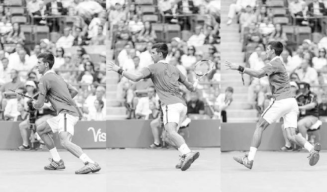
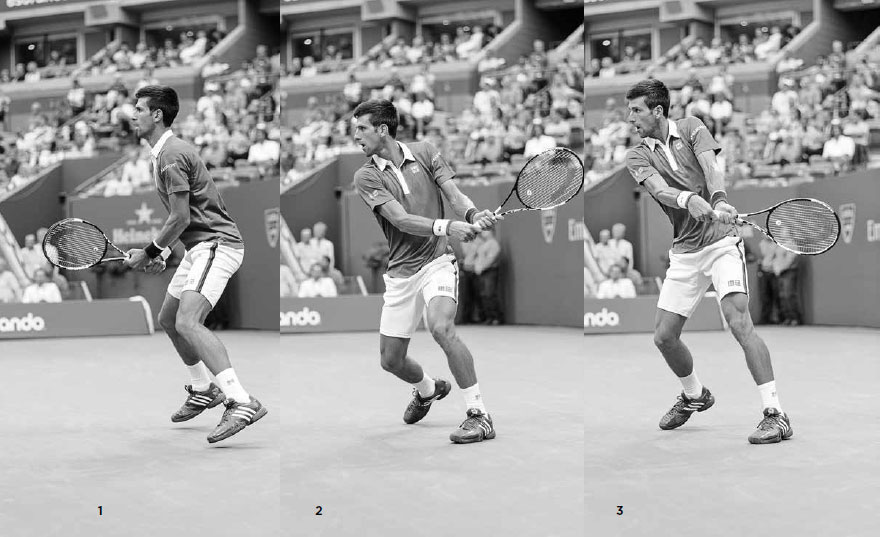
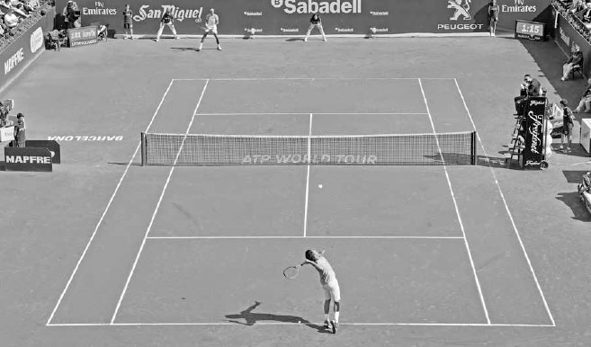

# Return of Serve

The return of serve has not only become a more skilled shot but also a more aggressive one. At Wimbledon in 2014, Eugenie Bouchard returned serve positioned inside the baseline an impressive 97% of the time.(2) By returning the serve so early, her opponents had very little time after their serve follow through to get balanced and move to cover her return. On the men's side, Roger Federer took return of serve aggressiveness to new heights in the summer of 2015 when he began to occasionally hit returns from just behind the service line then immediately attack the net. This tactic hurried his opponents and often took them by surprise, leading to poorly hit passing shots and easy volleys for him at net.

The return of serve has also evolved to become a bigger factor in a player's level of success. Statistics back up its growing importance. In 1990, none of ATP's top service returners were ranked in the top ten in the world. By 2014, four out of the top five service returners were in the top ten.(3) On the WTA tour, players' returns of serve have become so strong that it is sometimes more advantageous to return serve than to serve. Take for example, Bouchard's strong run at the 2014 Wimbledon mentioned above. During that tournament, she broke serve 25 times, sometimes two or three times in a set, on her way to finishing runner-up.

While the return of serve is hugely important at the professional level, its significance may be even greater at the recreational level. At the recreational level, an opponent's serve, especially a second serve, can represent an easy short ball where the returner has full knowledge of both when the shot will arrive and which service box it will land in. Therefore, the return of serve can be a great opportunity to hit a winner or set up a favorable situation to eventually win the point.

Good returners choose the right grip, anticipate, react quickly, employ good footwork, and use suitable backswing length. After discussing these components of the return of serve, I discuss how to make smart tactical and court positioning choices. I then explain why practicing the return is so important, how the return varies from regular groundstrokes, and finish the chapter with some practice drills.

*Eugenie Bouchard steals time from her serving opponent by returning serve inside the baseline.*

**I. Components of the Return of Serve**

**1. GRIP**

Because returning serve is often a fast-paced situation and the topspin forehand and backhand require different grips, how you hold the racquet is a major consideration. There is no right or wrong way to do this; the grip here is an individual preference largely based on your groundstroke strengths and weaknesses and style of play.

Most players wait to return serve in their forehand grip because the left hand stays on the racquet longer during the backhand swing compared to the forehand, thus providing extra assistance to the right hand in establishing the backhand grip. Some players set up in the grip of their weaker groundstroke to help out that shot, while others prefer to wait with the continental grip, which reduces the grip change to either the forehand or backhand and is a good grip if they intend to block the return off a big server. Two-handed backhand players have an easier time deciding which grip to use. They typically wait with the right hand in their preferred forehand grip and their left hand in the grip they use when playing their two-handed backhand.

  -------------------------------------------------------------------------------------------------------------------------------------------------------------------------------------------------------------------------------------------------------------------------------------------------------------------------------------------------------------------------------------------------------------------------------------------------------------------------------------------------------------------------------------------------------------------------------------------------------------------------------------------------------------------------------------------------------------------------------------------------------------------------------------------------------------------------------------------------
  **COACH'S BOX:**
  **High speed analysis shows that to better their timing on the return, the pros typically cut the amount of spin they use by more than half compared to the spin they use during a baseline rally. The best professional returners of the past, like Andre Agassi and Jimmy Connors, used moderate forehand grips and hit flat returns. In contrast, players who use extreme forehand western grips can have trouble returning fast serves because their palm is more underneath the grip --- not a good position to handle a strong serve's powerful ball impact. In addition, the western grip doesn't produce a comfortable arm positioning for the level swing required to reliably return fast serves. If you use a western grip on the forehand, you might consider using a semi-western grip on the return and hit with moderate spin.**
  -------------------------------------------------------------------------------------------------------------------------------------------------------------------------------------------------------------------------------------------------------------------------------------------------------------------------------------------------------------------------------------------------------------------------------------------------------------------------------------------------------------------------------------------------------------------------------------------------------------------------------------------------------------------------------------------------------------------------------------------------------------------------------------------------------------------------------------------------

*Andre Agassi's moderate forehand grip (and incredible eye-hand coordination) helped him return fast serves with interest.*

**2. ANTICIPATION**

Unless your opponent is very skilled at disguising their serve, the ball toss can help you determine what spin is coming your way. If the ball toss is to the server's right, you can expect a slice serve and should move right to cover its rightward curve. If the toss is to the left, then you can anticipate a kick serve and you should move to the left to cover its leftward bounce. If the ball toss is straight and in front, then a power serve is probably coming, and you can prepare a shorter swing for the return. Over the course of a match, you can pick up on your opponent's predilections for certain serves and remember that players often like to deliver their favorite serves on important points such as game and break points.

**3. RITUAL AND REACTION**

It is important to develop a return of serve ritual that helps you relax and focus before exerting the intense burst of energy needed to get a quick start on the return. Some players, like Federer, spin their racquet in their hands, while others, like Milos Roanic, bounce around on their feet, preparing their legs for action.

After establishing your location on the court for the return, set up in a wide stance with your feet outside your shoulders, knees bent, and upper body fairly upright. As the server tosses the ball, take a step or two forward, and then split step right before the server makes contact (right). The forward momentum going into the split step will give you a quicker jump on attacking a return.

**4. FOOTWORK**

After the split step, your first movement is to pivot with your outside foot, leaning right for a forehand (opposite left) or left for a backhand. The number of steps taken after the first step depends on the speed and direction of the serve.

Wide serves will usually require a crossover step, with the left leg stepping across on a forehand (opposite right), and the right leg crossing over on a backhand. Once the front foot hits the ground, the back foot will rotate around so you can square up into a wide base and lean in the direction you wish to move.

On serves that don't go wide, there typically isn't the time or need for the crossover step, and the return is hit with an open stance where your feet are parallel or close to parallel to the baseline. Due to the high bounce of kick serves, the open stance will also often be used on the forehand return as well as the backhand for two-handed backhand players.

After hitting your return, move your feet quickly towards the middle of the court to set up for the rally.

*Djokovic split steps to help him react quickly to his opponent's serve.*

**5. SWING TECHNIQUE**

The role of the backswing is to produce a consistent contact point in front of the body. To achieve this the size of your backswing must adapt to the different serving speeds of your opponents rather than being stiff or robotic.

When returning a fast first serve you should take a lower, shorter backswing (middle) and use your opponent's power to hit the ball back. Stay low in a crouched position, keep your head still while swinging the racquet, and focus on making contact in front of you (right). Even though the backswing may be shorter, the follow through should remain full. Because the first serve return is usually hit flatter, the follow through will be high and extended. On the slower second serve, the backswing will be longer and more topspin likely used; therefore the follow through will usually be lower and more horizontal, essentially replicating a regular topspin groundstroke.

*Djokovic pivots and leans, and then uses a low and short backswing before making contact in front of his body on this wide forehand return.*

**6. RETURN OF SERVE TACTICS**

Depending on the caliber of your opponent's serve, there are a wide range of tactics you can employ on the return of serve. Your main goal is to make your opponent earn every single point by getting your return in play. Through the course of the match, a consistent returner will tire a server mentally and physi- cally by making them work hard after their serve.

**A. FIRST SERVE VERSUS SECOND SERVE RETURN TACTICS**

Because the first serve typically is faster than the second, your tactical approach to returning these serves should be different as well. When receiving a strong first serve, your goal is to defend and neutralize the point. At the beginning of the match, especially against an opponent whose game you are unfamiliar with, you should aim your first serve return down the middle of the court. It's a good idea to strive for consistency and depth on the return until you're starting to read and time your opponent's serve. As the match progresses, you can start to aim closer to the lines.

IN 2015, NOVAK DJOKOVIC BROKE SERVE MORE OFTEN THAN ANY PLAYER on the ATP tour. He returns consistently and does so at a speed and depth that usually allows him to start the point in a favorable position.

In the first frame, Djokovic begins his return with a well-timed split step, helping him get a strong first movement to the ball. In the second frame, he pivots his feet, shifts his weight onto his left foot, and turns his shoulders. By frame three, his short backswing is complete. Keep in mind his arms barely moved to arrive at this position; his backswing was largely achieved by his upper body turning as a unit. Djokovic drops his racquet head to begin his low-to-high forward swing creating moderate topspin to control his shot. His left leg straightens to unload the power that was stored during the backswing. In frame four, he straightens his left arm and makes contact well in front of his body. Novak is not a passive returner. In frame five, we see him moving forward through the shot, attacking the ball. He drives through the ball extending the racquet out towards his target. In the last frame, he lands balanced on his right leg ready to recover quickly for his opponent's reply.

In contrast to the first serve return, your goal on the second serve is to attack and return strong enough to put you ahead in the point. The second serve, especially a weak one, can offer a great opportunity for the returner because it effectively becomes a short ball that you can prepare for. Attacking the second serve is a tactic that often reaps larger rewards as the match progresses. It can cause your opponent to lose confidence and become disheartened at the prospect of defending the point every time they miss their first serve.

*Federer defends against a powerful serve by shortening his backswing and aiming for a big target deep down the middle of the court.*

Before your opponent begins their second serve, visualize a specific target on the court where you wish to hit your return. Remember the body performs best when the mind gives it decisive direction and clear purpose. Also, move your feet quickly on the second serve return so you can use your strongest groundstroke as much as possible. Keep in mind that it is advantageous for court position purposes if you can move left and use your forehand on the deuce side and move right and use your backhand on the ad side (opposite). This movement brings you towards the middle of the court after the return in good position for your next shot. You can also move left and right to upset your opponent's rhythm by returning serves from different spots on the court. For example, if your opponent is hurting you with serves to your backhand, try standing more to the left and tempt them to serve to the "open" part of the service box. It will force them to hit a less grooved serve to what may be your strongest groundstroke.

**B. FORWARD AND BACKWARD COURT POSITIONING TACTICS**

Moving forward and backward can also upset your opponent's rhythm, but this type of positioning change plays a more important role in tactics. For example, if you wish to set an aggressive tone or shorten rallies, you can set up well inside the baseline (below) and return the ball early, robbing time from your opponent. Or, if you have better groundstrokes than your opponent, and extending the length of the rally works in your favor, you may want to position yourself further back and improve the chances you will make the return.

*Serena Williams uses her backhand on the ad side to gain better court positioning and stands well inside the baseline to set an aggressive tone for the rally.*

The final of the 2016 Sydney International between Viktor Troicki and Grigor Dimitrov demonstrated how a player's level of success can vary depending of the length of the rally. During that match, Troicki was almost twice as likely to win the point when rallies were three shots or fewer; the reverse was true when the rally went nine or more shots.(4) Perhaps if Dimitrov moved back to return serve and extended more points, he may have won that very close match.

What your opponent does after the serve can also affect return of serve positioning. During the 2015 Barclays ATP World Tour Finals, Wawrinka returned serve an average of 8.8 feet farther behind the baseline when playing Nadal, a deep baseline player, than Federer, an occasional serve and volleyer.(5) Wawrinka knew returning deep against Federer would create easy serve and volley opportunities for his compatriot, especially when defending against his wide serve. Although Federer serves significantly faster than Nadal, Wawrinka considered all the match variables and decided to return Federer's serve closer to the baseline than Nadal's.

*At the 2015 Barclays World Tour Finals, Stan Wawrinka decided to stand closer to the baseline to return against Federer than he did against the slower serving Nadal.*

The court surface also has a large impact on the level of aggression and court positioning on the return. In the last decade, particularly on clay courts, the pros have sometimes adopted a different type of second serve return whereby they drop back several feet towards the back fence to hit their shot (opposite). This deeper court positioning allows the speed and spin of the serve to slow down enough to hit a heavy topspin return. On the other hand, on hard courts they often move further forward and return the serve earlier. This strategy pays off because hard courts provide more reliable bounces and tend to reward aggressive shot-making.

Learn from the pros and adjust your forward and backward court positioning on the return taking into account not only the quality of your opponent's serve, but also the length of point that works in your favor, your opponent's tactics following their serve, and court surface.

*On clay courts, Nadal (background) sometimes drops back to the fence to get the second serve return at a comfortable speed and height.*

**II. Return of Serve Practice**

While some points last ten strokes and others last two, the average length of a point in most matches is around four to five strokes. Keeping this in mind, the serve and return of serve represent roughly forty to fifty percent of an average point. Now, what are typically the least practiced shots at the recreational level? You guessed it: the serve and, particularly, the return of serve.

Don't make this mistake. Spend the appropriate amount of time on the practice court honing these two shots. Many players don't give the return of serve the attention it deserves because they make the mistake of regarding it as just another groundstroke. However, the truth is that the return of serve is different from typical groundstrokes in several ways: the serve is hit from a greater height creating a higher bounce, the ball speed is usually faster, the serve sometimes curves right-to-left or left-to-right, the distance your opponent serves from the net is always the same, and the area of the service box is much smaller to defend than the whole court. Therefore, in addition to the return of serve's huge impact in determining the outcome of the point, it is also in many ways a unique shot, and should represent a significant part of your practice sessions.

The pros fully understand this and hit thousands of returns in practice to improve the muscular and mental link that allows them to make the necessary tiny adjustments to return well. On the first serve they receive there is little time for deliberate action, so they operate along a range of reactions rather than premeditated thought. At the recreational level, serves are slower, and so there is a different thought process involved. Recreational players usually have the advantage of additional time, allowing them to plan ahead and hit a more premeditated return. Irrespective of the speed of serve you typically face, there is an art and rhythm to the return that can only be developed through practice.

**1. UP AND BACK**

Goal: Speed up return of serve reaction time.

Hit five serves to your practice partner from six feet inside the baseline, five from three feet inside the baseline, and five at the baseline. They score a point for every successful return or return that lands past the service line, and you score a point for every unreturned serve or every return landing before the service line. The player with the most points after 15 serves wins, then switch roles. With this drill and all drills in the book, you can change the court positioning or scoring system depending on your skill level to make the drills fun and competitive.

Having your practice partner serve from several feet inside the baseline can speed up your return of serve reflexes.

**2. TARGET PRACTICE**

Goal: Improve accuracy of return.

Divide the singles court into four boxes by continuing the center line all the way to the baseline. You must return serve into a designated box. If the ball is returned successfully in the designated box or if your practice partner misses their serve, you score a point. However, if you fail to hit the correct box, your practice partner scores a point. First player to score 15 points wins, then switch roles. Variations include allowing two serves per point, dividing the court into two halves instead of four quarters, or allowing the returner to hit only topspin or only slice returns.

**3. RETURN OF SERVE HANDICAPS**

Goal: Emphasize the importance of defending against the first serve and attacking the second serve.

Play a set with your practice partner using regular scoring except that a failed return off the first serve results in two points for the server. Alternately --- or additionally --- if the returner hits a winner off a second serve, they score two points. You can add a variation in which the server is allowed three serves per point instead of two.

"The length of the point matters a lot more than fans may think. The first four shots, including the serve and the return, are by far the most important segment. You may think the point is just getting started, but it is often already over. During the 2015 U.S. Open, 71% of the points in men's singles matches and 66% of the points on the women's side came on rallies of four shots or fewer. And first-strike points have a much greater correlation to a match's result than extended rallies do. At the 2015 U.S. Open, the players who won more zero-to-four shot rallies won the match 90% of the time in men's singles and 83% of the time in women's. Players who had the advantage on rallies of nine-plus shots won the match only 56% of the time on the men's side and 59% on the women's." - Craig O'Shannessy.

*Jo-Wilfried Tsonga's forehand is, like most ATP players, his baseline coup de grace.*
