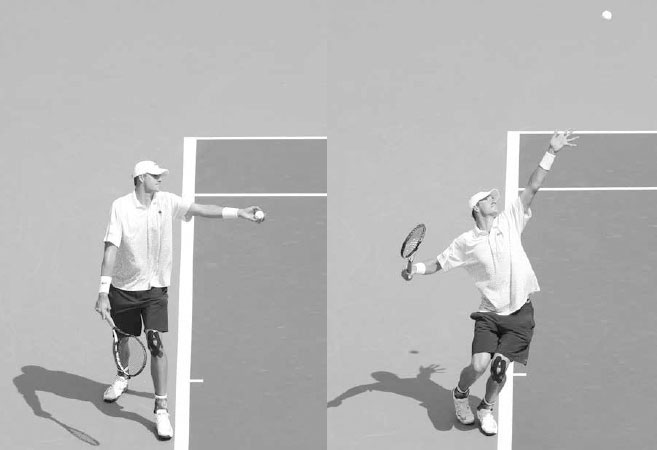
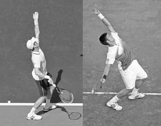
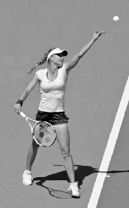
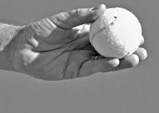
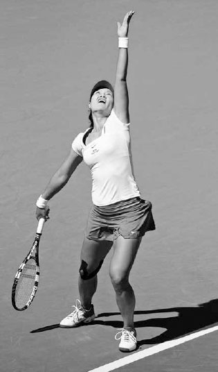
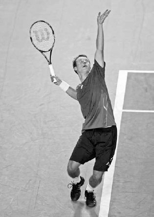
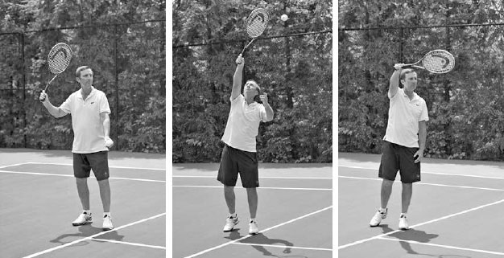
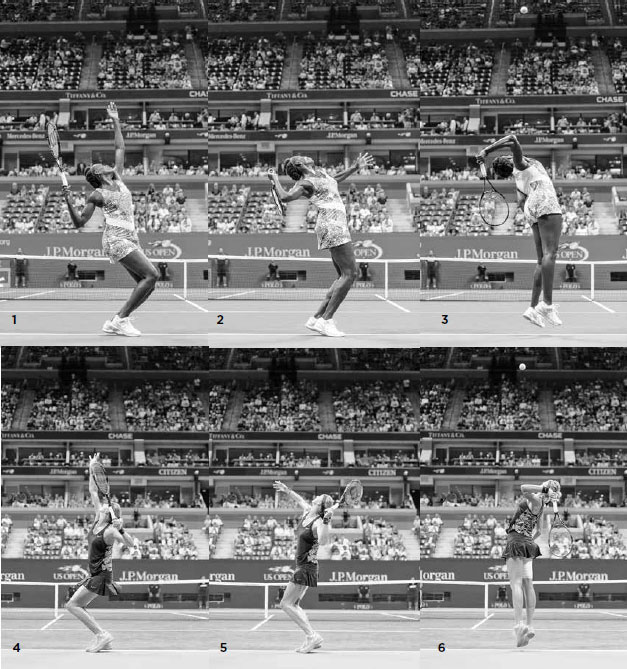

# Serve

This chapter is split into three main sections: Serve Technique, Serve Tactics, and Serve Practice. The Serve Technique section makes up the bulk of the chapter, and I will break down the steps to teach you how to develop a powerful and reliable serve. I will cover establishing a routine, serving stance, back- swing, ball toss, trophy position, racquet drop, wrist pronation, body positioning at contact, and follow through for the flat serve. After explaining these elements of technique, I describe how to perform the slice, the slice-topspin, and the kick serve. In Serve Tactics, I discuss how to be unpredictable with your serve and different strategies for deciding what serve to use based on our strengths and weaknesses and the score. In Serve Practice, I provide drills to help you improve this pivotal shot.

**I. Serve Technique**

**1. ESTABLISH A ROUTINE**

The first step is to establish a pre-serve routine. Sometimes the professionals' pre-serve routines are quirky, but even when they are, they are always regular. ATP player Ernests Gulbis asks the ball kid for three balls and proceeds to juggle them in one hand and tap them with the tips of his fingers before he throws his least favorite back. Rafael Nadal's infamously long pre-serve routine involves bouncing the ball several times with his racquet, picking at the back of his shorts, lifting his shirt on both shoulders, wiping his nose, moving hair behind both ears, and several more bounces of the ball with his hand. You certainly don't have to be as idiosyncratic as Gulbis or elaborate as Nadal, but you need a pre-serve routine. It provides rhythm to the serve and can calm you down in a stressful situation.

*Federer contemplates his serving options before he serves.*

As you are performing your pre-serve routine, you should be thinking about what serving spins and placements have been effective thus far in the match, what serve makes best use of your strengths, and what serve is best for the score (see pages 64--65). These factors should shape your decision when selecting the type of serve you will use.

Before you start the serve, make sure to place your hitting hand in the continental grip with a relaxed arm. The continental grip is a key component of a powerful serve. It is only by using this grip that you can obtain important qualities of the serve that I discuss in-depth later: deep racquet drop, high contact point, full wrist pronation, and the ability to hit strong spin serves. Last, imagine in your mind the ball landing in the service box where you intend to place it. Visualizing success like this on your serve will give you increased focus and confidence.

**2. STANCE**

There is no one perfect serving stance, otherwise all top players would use it and there would be uniformity in serving technique. The best stance is specific to the player and you need to figure out what works best for you through repetition and experimentation. The three main serving stances are the platform, the narrow platform, and the pinpoint stance.

Regardless of what stance you use, I recommend you begin your serve with your front foot pointing towards the right net post. The back foot is a more individualistic preference, but I recommend your back foot be lined up behind and slightly to the left of your front foot and angled parallel to the baseline to best anchor the weight transfer that occurs at the beginning of the serve (below).

*Belinda Bencic begins her serve with her front foot pointing towards the right net post and her back foot angled parallel to the baseline.*

Let's describe the three stances and look at the trade-offs with each stance in regards to power and consistency.

**A. PLATFORM STANCE**

In the platform stance, your front and back foot should be a little more than shoulder width apart (left). Your weight starts forward and rocks back with your feet remaining stationary as you begin the backswing. The platform stance has the advantage of a simple weight transfer and, therefore, leads to a more reliable toss and consistent serve. Also, the relatively wide base this stance provides during the top of the swing helps the legs push up forcefully from the ground. These advantages, coupled with the simplicity and naturalness of the platform stance, make it a good choice for recreational players. These qualities also help the elite pros and is partly the reason why players like Milos Raonic, a platform server, rarely has a bad serving day. The main drawbacks of this stance is that the wider base reduces the power derived from the hip movement as compared to the other two stances, and it has less forward momentum than the pinpoint method.

Milos Roanic uses the platform stance.

**C. PINPOINT STANCE**

The pinpoint serving style begins with the feet several inches wider apart than in the platform stance (left). As the hands go up on the backswing, you step forward with the back foot, aligning your feet together side by side before bending your knees and elevating to the ball (right).

Of the three serving styles, the pinpoint method has the strongest forward weight transference. Also, compared to the platform stance, the feet are closer together during the top of the swing, freeing up the hips for a larger hip push, pull, and rotation, and providing extra torque to the torso and power to your arm. However, because there is more body movement occurring as the left arm rises to toss the ball, the ball toss can be less dependable. Also, since it is a more athletic serve, it requires greater body control and timing. It is the most difficult of the three serving styles, but also the most explosive, which is why most ATP players and the vast majority of WTA players use this stance.

*John Isner utilizes the pinpoint stance.*

**3. BACKSWING**

Once you have completed your pre-serve routine and established your stance, you are ready to begin the serve and start your backswing. The serve needs to be rhythmic to be powerful, so your movements during the backswing are important.

There are three main types of backswings: pendulum, abbreviated, and waist-high. When determining the backswing that works best for you, remember that the purpose of the backswing is two-fold: first, to produce a rhythm that allows energy to build up powerfully in your legs and second, to efficiently place the racquet in the correct position at the top of the swing.

  ---------------------------------------------------------------------------------------------------------------------------------------------------------------------------------------------------------------------------------------------------------------------------------------------------------------------------------------------------------------------------------------------------------------------------------------------------------------------------------------------------------------------------------------------------------------------------------------------------------------------------------------------------------------------------------------------------------------------------------------------------------------------------------------------
  **COACH'S BOX:**
  **The top professionals appreciate the importance of the stance and backswing on the serve and often experiment and adjust their technique. Early in his career, Rafael Nadal changed from using the platform stance to the pinpoint stance on his serve. This adjustment increased his serving speed significantly. Similarly, Novak Djokovic's pre-2010 serve had a longer backswing that complicated his technique and led to a less consistent serve. In 2010, he shortened and moved his backswing to the right with his arm looser and more bent. This more efficient motion improved his balance and placed his racquet in a more comfortable position at the top of his swing. After making this change, Djokovic's upgraded serve helped him go on an impressive winning streak.**
  ---------------------------------------------------------------------------------------------------------------------------------------------------------------------------------------------------------------------------------------------------------------------------------------------------------------------------------------------------------------------------------------------------------------------------------------------------------------------------------------------------------------------------------------------------------------------------------------------------------------------------------------------------------------------------------------------------------------------------------------------------------------------------------------------

Certainly, if Nadal and Djokovic are prepared to refine their serve during their professional career, all players should be willing to make swing modifications and embrace the learning process of change that can sometimes mean taking one step back before going two steps forward.

*Early in his professional career, Nadal changed from using a platform stance (left) to a pinpoint stance (right).*

*Djokovic's 2014 serve (left) has a more relaxed, shorter backswing than his 2008 version (right).*

**A. PENDULUM BACKSWING**

The pendulum backswing is the traditional wind up whereby the racquet drops down near to the ground (opposite left) before it moves back and then up into the top of the swing, tracing the circumference of a circle. Because the racquet follows the natural flow of a pendulum movement, it is an easy backswing and a good one for recreational players.

*Andy Murray begins a pendulum backswing.*

**B. ABBREVIATED BACKSWING**

On the abbreviated backswing, once the racquet goes back level with your back leg, it goes straight up past your chest into the top of your swing (middle). This shorter backswing works best for servers with a faster rhythm. It has the advantage of simplicity but requires significant shoulder strength and flexibility to use and hit a powerful serve.

*Richard Gasquet utilizes an abbreviated backswing.*

**C. WAIST-HIGH BACKSWING**

On the waist-high backswing, the racquet passes by the hips horizontally before lifting up into the top of the swing (right). Some players find the pendulum backswing too long and not suitable for the serving rhythm, while others find the abbreviated backswing not long enough to build-up good energy in the lower body. These players are likely to use the waist-high backswing on their serve.

Maria Kirilenko performs a waist-high backswing.

The teaching philosophy regarding how the arms should move up during the backswing has changed over time. Previously, the instruction was "arms go down together, and then up together," whereby the hitting arm and tossing arm lift together into the top of the swing (middle). This is a simple method and is still an effective one for recreational players and a minority of touring pros. However, in the modern serving technique used by most advanced players and touring pros, the hitting arm slightly lags the tossing arm. Here, your hitting hand is around waist level as your tossing hand releases the ball above your head creating a "see-saw" movement of the arms (right). **While this technique is a little more complicated, the advantages are clear: it keeps the shoulders more relaxed, establishes a longer loading position for a stronger leg drive, and tilts the shoulders upward more to reach a higher contact point.**

**4. BALL TOSS**

As your right arm performs the backswing, your left arm tosses the ball. It's a simple fact --- in order to hit a good serve, you must have an accurate toss. An inconsistent toss will lead to awkward contact points and ruin the rhythm required for a powerful and reliable serve.

**A. BALL TOSS TECHNIQUE**

There are four components of ball toss technique to consider.

**1. BALL GRIP**

I recommend having the top half of three or four fingers on one side of the ball and the end of the thumb resting on the opposite side (right). Hold the ball lightly in this pincer-like grip. Don't hold the ball deep in your palm; your fingers may obstruct the release and cause your toss to go askew.

  ------------------------------------------------------------------------------------------------------------------------------------------------------------------------------------------------------------------------------------------------------------------------------------------------------------------------------------------------------------------------------------------------------------------------------------------------------------------------------------------------------------------------------------------------------------------------------------------------------------------------------------------------------------------------------------------------------------------------------------
  **COACH'S BOX:**
  **The importance of the toss was evident during Serena Williams' play at the 2015 U.S. Open. Typically, her very reliable toss places the contact point on her serve within a tight eight-inch range. However, during her first three matches at the 2015 U.S. Open, her toss was inconsistent, causing the range to increase to 19 inches. This variability upset her serving tempo and resulted in an almost equal number of double faults and aces. After her third match, she reduced the range on her contact height back to eight inches, and over the next three matches, her number of aces more than tripled her number of double faults.(2) To toss the ball well, hold the ball towards the top half of your fingers.**
  ------------------------------------------------------------------------------------------------------------------------------------------------------------------------------------------------------------------------------------------------------------------------------------------------------------------------------------------------------------------------------------------------------------------------------------------------------------------------------------------------------------------------------------------------------------------------------------------------------------------------------------------------------------------------------------------------------------------------------------

**2. ARM MOVEMENT**

Your tossing arm should stay in front of you and drop only slightly before going upward (opposite left). If serving to the deuce side playing singles, the tossing arm begins its movement pointing towards the right net post to turn the shoulders (opposite middle) and then towards the center of the court as it continues its movement upward. Keep in mind that because the contact point is to the left of where the hand releases the ball, your ball toss will arc slightly from right to left. For recreational players, I recommend the tossing arm go up slightly left of the right net post. This way the toss doesn't arc, but goes up more in a straight line for a simpler toss.

Your arm should be straight, wrist still, and your palm facing the sky as you toss the ball. To help you keep your arm straight and wrist steady as you release the ball on your toss, try to imagine that instead of a ball, you are holding an ice cream cone that you raise while attempting not to spill the ice cream. Remember to release the ball slightly above head level (opposite right). This will help keep your serve fluid and shorten the distance the ball has to travel, reducing the chances your toss will go astray.

**3. BALANCE**

Your weight will shift back during the toss, but this movement should be completed by the time the ball leaves your fingers (right). Keep your weight slightly on your back foot when you release the ball so as to establish a good position for the body's upward and forward push that follows.

**4. FOLLOW THROUGH**

After the ball's release, your tossing arm continues up to a position roughly perpendicular to the ground (next page, left). This produces a smooth, long motion and allows your arm to move at the proper speed at your release point. If you stop the follow through of your tossing arm abruptly, you will release the ball too low and too fast to have an accurate toss.

*Caroline Wozniacki's ball toss sees her left arm move down slightly, straighten, and then lift smoothly pointing towards the right net post.*

**B. BALL TOSS PLACEMENT**

The height of the toss will be affected by the speed and length of your wind up. Servers who use a slower or longer backswing will need a higher toss than those who have faster or shorter backswings. While everyone has a slightly different rhythm on the serve, a good guideline is to have the height of the ball toss peak one-to-two feet above the point of contact (next page, right). This allows enough time to execute your swing with good rhythm and a full build-up of energy throughout your body. A ball toss that is too high is difficult to time and less consistent, while a ball toss that is too low will cramp good arm extension and reduce the time allotted for the body to build energy.

The ball toss should be in front of you. The angle of your body leans into the court to obtain the forward body momentum needed to hit an imposing serve (right). The distance in front of you will depend on your height and what type of serve you are hitting, but two feet in front of you on the first serve and one foot in front of you on the second serve are good general guidelines.

To help her produce a smooth ball toss, Li Na continues to lift her left arm after releasing the ball.

The direction of your toss also will vary right-to-left depending on what type of serve you are delivering (see page 59) and the side to which you are serving. If in front of an imaginary clock and serving to the deuce side, your flat serve will have a toss around noon. On the ad side, because your target and momentum are more to the right, move the ball toss slightly more to the right.

*Venus Williams tosses the ball approximately two feet above contact and into the court, allowing her time to build energy through the body and lean forward for added power.*

**5. TROPHY POSITION**

After your backswing and release of the ball on the toss, you enter what is commonly referred to as the trophy position. In the model trophy position, your left arm is pointing straight up towards the ball, and your right arm is bent in an L- shape with your racquet pointing towards the sky and facing the side fence (opposite). If looking at the trophy position from a back view, the right elbow should be left of the right shoulder. This elbow positioning places the racquet in a good location to drop fully down the back and stretches your shoulder to spring the racquet faster to the ball later in the serve.

  -------------------------------------------------------------------------------------------------------------------------------------------------------------------------------------------------------------------------------------------------------------------------------------------------------------------------------------------------------------------------------------------------------------------------------------------------------------------------------------------------------------------------------------------------------------------------------------------------------------------------------------------------------------
  **COACH'S BOX:**
  **The ball toss would seem like an easy task to do well, but because other body parts are moving during the toss, it can prove to be an elusive skill for some. Fortunately, it's a skill that can be easily practiced almost anywhere. If your ceiling height permits, your ball toss can be improved from the comfort of your home, or if that is not possible, you can practice it outside at a nearby park. At the park, mark a spot on a fence with a piece of paper that represents your ball toss apex and practice tossing to that spot. Remember to move your hitting arm as you toss the ball and perform the toss as you would during a match.**
  -------------------------------------------------------------------------------------------------------------------------------------------------------------------------------------------------------------------------------------------------------------------------------------------------------------------------------------------------------------------------------------------------------------------------------------------------------------------------------------------------------------------------------------------------------------------------------------------------------------------------------------------------------------

The trophy position is also sometimes called the power position because during this stage of the serve, the body coils to store power that will be unloaded when the body uncoils a moment later. Essentially, the body here becomes spring-loaded, preparing the arm to swing the racquet with explosive power and the body to lift up and forward towards the ball. This is how great servers deliver their serve with speed and consistency. They establish a strong power position and then release the stored energy and elevate the body to hit the ball at a height that creates a trajectory that clears the net by a good margin and lands well inside the service line (next page, bottom).

Four body movements occur together during the trophy position: the shoulder turn, knee bend, back tilt, and hip push.

David Ferrer sets up in the classic trophy position: left arm up and extended, right arm L-shaped, and racquet pointing to the sky. He also turns his shoulders and bends his knees to coil his body and load energy that will be unloaded when his body uncoils a moment later.

**A. SHOULDER TURN**

As you move your arms up into the trophy position, your left shoulder turns to the right to point towards the right net post (above). Your shoulders should rotate more than your hips to produce an uncoiling of your shoulders that adds power to your swing.

**B. KNEE BEND**

The amount of knee bend will vary from player to player but an angle in the legs of somewhere between 30 and 40 degrees is considered ideal (above). The leg muscles are the strongest in the body; you need to use them well to hit your best serve.

**C. BACK TILT**

Your back should lean slightly backwards (right) to activate the abdominal muscles and allow your upper body to twist and drive your right shoulder both upward and forward (i.e. cartwheel). Without a tilted back, your right shoulder will move forward but be less able to move upwards. Tilting your back also deepens your racquet drop that follows and loads up more power in your legs, creating a stronger leg drive.

**D. HIP PUSH**

From a side view, the angle of your body at the completion of the trophy position should have a bow where your front hip pushes forward in front of your feet and shoulders (right). By leading with your front hip, you stretch your oblique muscles, tilt your shoulders upward, and place your chest underneath the ball toss. This places your body in a good position to lift yourself up and forward to the ball.

Establishing a powerful trophy position and then lifting your body up and forward to the ball provides a higher contact point, and thus, a greater margin for error above the net (A) and inside the service line (B).

*By tilting back and pushing his hips forward, Philipp Kohlschreiber creates a body angle that can spring him up and forward powerfully to the ball.*

  --------------------------------------------------------------------------------------------------------------------------------------------------------------------------------------------------------------------------------------------------------------------
  **COACH'S BOX:**
  **A common trophy position mistake on the serve is the racquet facing upward (right) rather than facing the side fence. This is caused by the incorrect use of the forehand grip and leads to an abbreviated wind up, low contact point, and poor racquet speed.**
  --------------------------------------------------------------------------------------------------------------------------------------------------------------------------------------------------------------------------------------------------------------------

Making the change from the forehand grip to the continental grip on the serve will cause the ball to veer left. To fix this problem, try this drill.

First, stand on the service line in your serving stance, place your hand in the continental grip, and lift the racquet head slightly above your head (below left).

Second, toss the ball, drop the racquet down your back, and as you swing up at the ball, pronate your wrist. I recommend hitting to the ad side because the ball and the racquet are moving in the same direction to the right, making learning the continental grip on the serve easier than if hitting left into the deuce service box. At contact, focus on the arm being straight, with the racquet positioned roughly even with the front of your face, and your hips slightly closed to the net (below middle). Remember, you have to move the contact point up higher and less in front of the body than when you were using the forehand grip.

Third, immediately following contact, freeze the racquet shoulder-high and make sure the wrist has turned the racquet face so it is facing towards the right side fence (below right). Once you get proficient at this racquet movement from the service line, move back gradually until you are successful from the baseline.

**6. RACQUET DROP**

Following the trophy position, the racquet drops down your back. The deeper your racquet drop, the longer the path your racquet can take to gather speed to the contact point and the greater the power created from the shoulder stretching and racquet lag (below). This is why it is vital to have a relaxed grip on the serve; your racquet won't drop fully if your shoulder is tight.

A full racquet drop requires a combination of torso rotation, leg drive, shoulder flexibility, and movement of the elbow. The rotation of your lower torso initiates the first part of your racquet drop, your leg drive propels the second part, and your upper torso rotation prompts the third part (opposite). As these movements occur, the rotation of your shoulder and your elbow's movement up and forward also adds depth to your racquet drop. This may sound complex, but it happens naturally if you use the continental grip, establish a good trophy position, and swing up at the ball.

*Murray's deep racquet drop stretches his shoulder muscles and lengthens his swing to add power to his serve.*

At the end of the racquet drop, your back straightens and aligns with your straightening legs. At this point, your racquet remains stationary for a split second even though your chest started to go upward, producing a lag of the racquet that stretches your shoulder muscles and creates a powerful spring effect.

GREAT SERVERS HAVE SIMILARITIES IN technique. Here we see the service motion of the right-handed Venus Williams mirror imaged with that of the left-handed Petra Kvitova. After establishing a strong trophy or power position (images 1 and 4), notice how their hitting elbows lift as their hips rotate up and around and their legs begin to straighten (images 2 and 5). These body movements produce a deep racquet drop (images 3 and 6), placing their racquet in a perfect position to lag and accelerate up to the ball.

*Following the racquet drop, Nadal cartwheels his hitting shoulder over his non-hitting shoulder.*

**7. RACQUET DROP TO CONTACT**

The body is sideways during the racquet drop, but begins to open as the hips swivel upward and around to the net as the racquet moves up out of the racquet drop. Once the hips fire, they quickly stop, which allows for the transfer of energy from the torso to the shoulder and arm.

As this hip movement is occurring, your hitting elbow elevates rapidly and straightens, taking an upward path above your ear as your torso rotates about your spine. Here, if you were to let go of the racquet while using the correct upward elbow motion, the racquet would fly over your opponent's baseline, rather than crashing before the net. To accommodate this elbow movement, your hitting shoulder must move over your non-hitting shoulder in a cartwheel motion (above). This cartwheeling of the shoulders helps lift your body to maximize your contact height.

A common issue among recreational players is that they do not cartwheel their shoulders. Instead, their shoulders rotate more horizontally, causing the elbow to pull to the side and the arc of the swing above the head to be more linear than circular. This results in a lower contact point and a poor ball trajectory into the service box.

**8. WRIST PRONATION**

As your elbow rises and straightens to reach up and hit the ball, your wrist pronates; that is, it turns the palm from facing the left side fence to face the right side fence. This is the last movement of your hitting arm before contact and a major factor in attaining fast racquet speed.

Each of the four types of serves uses a different wrist pronation. On the flat serve (I describe the wrist movement on the slice and kick serves later in the chapter), you pronate your wrist by first leading with the edge of your racquet near contact like you are going to karate chop the ball (left). Then, as the edge of your racquet head gets even closer to the ball, you rotate the racquet face around 90 degrees to square your strings to your target, effectively giving the ball a "high five" at contact (center). After contact, your racquet face continues to turn outward around another 90 degrees to complete the wrist pronation (right). This is one of the reasons why the continental grip is so important on the serve. It is only with the continental grip that you can "flip" the racquet face at a very high speed over such a short distance.

Federer accelerates out of the racquet drop with the edge of the racquet leading. Then, his wrist pronates to turn the racquet and square the strings up to the ball for contact. Following contact, his wrist continues its pronation, resulting in the racquet facing the right side fence.

**9. BODY POSITIONING AT CONTACT**

As you reach up to hit the ball, your hips will rotate but should remain slightly sideways to the net at contact (center). If you do this correctly, your arm should be fully extended, with your racquet roughly even with the front of your face as you lean forward into the court (right). This body and racquet positioning will produce optimal serving power and maximize contact height.

In contrast, if your hips are too closed then the power from your leg drive and upper body rotation will be stifled and your contact point will occur behind the face, a physically weak spot. Or, if your hips are too open and parallel to the baseline, that same power created from your body will be decreasing instead of peaking at contact, and your contact point will be detrimentally lowered. Keep in mind, the amount your hips are closed will depend on what spin you are using and where you are directing your serve.

The positioning of your head and left arm is also important here. Remember to keep your head up and move your left arm towards your chest (right). If your head drops, the weight of your head will pull your shoulders down and lower your reach. Similarly, if your left arm moves down and away from your body, it will drag your right arm down and lower your contact point.

*Djokovic reaches up with his arm fully extended and hips slightly sideways to hit the ball roughly even with the front of his face.*

  -------------------------------------------------------------------------------------------------------------------------------------------------------------------------------------------------------------------------------------------------------------------------------------------------------------------------------------------------------------------------------------------------------------------------------------------------------------------------------------------------------------------------------------------------------------------------------------------------------------------------------------------------------------------------------------------------------------------------------------------------------------------------------------------------------------------------------------------------------------------------------------------------------------------------------------------------------------------------------------------------------------------------------------------------------------------
  **COACH'S BOX:**
  **Just before contact on the serve, many recreational players fail to lead with the edge of the racquet and instead position the racquet to face the ball. It is understandable that players do this because it is hard to imagine approaching the ball with the racquet edge, especially since on many other shots you do place the strings behind the ball well before contact. However, the serve is a unique shot not only because of the swing itself, but also because you are hitting the ball as it moves at a very slow speed at an almost downward trajectory. These two characteristics allow you to rotate the racquet face more than 180 degrees quickly and still control the shot. On almost every other shot, the incoming ball has speed behind it and the ball is hit on a more horizontal trajectory. Consequently, on other shots, your racquet face must stay steadier through contact and command the collision of the ball. Don't let the technique needed on the serve adversely influence your technique on other shots or vice versa.**
  -------------------------------------------------------------------------------------------------------------------------------------------------------------------------------------------------------------------------------------------------------------------------------------------------------------------------------------------------------------------------------------------------------------------------------------------------------------------------------------------------------------------------------------------------------------------------------------------------------------------------------------------------------------------------------------------------------------------------------------------------------------------------------------------------------------------------------------------------------------------------------------------------------------------------------------------------------------------------------------------------------------------------------------------------------------------

*Nadal moves his racquet across his body and kicks his back leg up to finish his serve.*

Moving your left arm inward also stops your hips from over-rotating and adds strength and stability to your right arm. Your left arm works as a decelerator to help your right arm accelerate and catapult your racquet out of the racquet drop phase with greater speed. Your two arms act in a way analogous to a jackknifed tractor-trailer. Your left arm mimics the tractor that puts on the brakes, while your right arm imitates the trailer that is slung powerfully forward.

**10. FOLLOW THROUGH**

After completing the wrist pronation, you finish the serve with the follow through. The follow through provides good information on how well you reached for the ball. A strong upward and forward push during the swing will elevate your front foot over the baseline and lift your back foot into the air to counter balance your upper body leaning forward (right). The deeper your knee bend and the stronger the cartwheel movement of your shoulders, the higher your back foot will lift to balance your body.

Your back foot should lift and finish pointing directly towards the back fence on the follow through. Your back foot acts like a "rudder" that guides the direction of the body. If it is pointing towards the right side fence, instead of the back fence, then your body rotated too much. Your front foot should point towards the target as you land on your follow through. If your front foot is pointing substantially to the left, this indicates an overly large body rotation, while pointing too much to the right indicates the opposite. You can "freeze" your follow through during practice to see the exact positioning of your feet and analyze what may need to be rectified.

Once your front foot lands forward into the court, the racquet swings down your left side behind you as your hips rotate through the swing. It is important to learn a smooth deceleration of your racquet on your follow through and avoid an abrupt stopping, which can lead to less power and potential injuries. Your left arm, which was tucked by your side, comes out at the end of your follow through and holds the throat of your racquet to prepare for the return from your opponent.

Former top five ATP Player and elite coach Brad Gilbert once said if he had to pick one player to hold serve against a supernatural evil force with the end of the world at stake, he would choose Roger Federer. It's easy to understand why; Federer's serve is dependable, powerful, and extremely accurate.

Federer begins the serve in a relaxed manner with the racquet pointing down as he performs his pendulum backswing. In the second frame, he turns his shoulders and bends his knees in the trophy position to coil his body and store energy. Notice how high he raises his tossing arm. This not only helps him produce a smooth ball toss motion but also pushes his hips forward to help him lift his body up and forward to the ball. In frame three, he begins to uncoil his body and unload energy by straightening his legs and rotating his hips. In frame four, the unloading of energy is complete, and the racquet begins its movement up to the ball with the edge leading. His racquet is the last to go up; that way, all the power created from his body is transferred into it. In frame five, he hits the ball with his hips slightly sideways to the net. We also see that his shoulders have cartwheeled, his hitting elbow has risen and straightened, and his wrist has pronated to rotate the racquet around 90 degrees from the previous frame. In the last frame, he follows through by continuing to elevate forward and high above the ground. His head remains up and his right leg moves backwards to bal0ance out his body and help him land poised and ready for his opponent's return.

**II. The Slice and Kick Serve**

**1. SLICE AND SLICE-TOPSPIN SERVE: USE AND TECHNIQUE**

The flat serve described in the previous section is important for delivering power on the serve, but the slice and slice-topspin serves are also important for adding variety and consistency to your serve. These serves curve the ball to the left (or to the right for left-handers), create a lower bounce, and slow down the speed of the ball. The slice serves are particularly effective when used in combination with other serves, as the changing curves, heights, and speeds can keep your opponent off rhythm and error prone.

*Samantha Stosur's use of spin serves upsets the timing of her opponents' returns of serve.*

The slice serve is typically used as a first serve and can be used to jam your opponents by serving into their body or to pull them wide off the court. The slice-topspin serve is a versatile one that can be used as a strong first or second serve. It is an effective first serve because of its good velocity and low, curving bounce and a good second serve because the forward rotation of the ball brings the ball down into the court, enhancing the control needed for a reliable second serve. The slice-topspin serve is a particularly good way for recreational players to hit the second serve, especially if the more difficult kick serve (described next) is proving troublesome.

The slice and slice-topspin serves have a similar technique to the flat serve except for the differences outlined below.

**A. BALL TOSS**

For the slice serves, you should place the ball toss slightly more to the right (opposite top). If in front of an imaginary clock and serving to the deuce side, your slice serve will have a toss around one o'clock and a little less to the right for the slice-topspin serve. On the ad-side, because your target and momentum is more to the right, move the ball toss slightly more to the right. Keep in mind, the more similar your ball toss is for all the serves, the less likely your opponent will anticipate and the more effective your serve.

**B. BODY ALIGNMENT**

Because of the more rightward path of your racquet at the top of the swing, your upper body will align more sideways to the net than on the flat serve during the backswing and at the point of contact.

The four serves have different ball tosses and contact locations above the head.

**C. RACQUET DROP TO CONTACT**

The racquet is angled at contact on the slice serves, and because of this, your wrist pronation is less on your slice serves compared to the flat serve. Instead of pronating fully, your wrist movement on the slice serve is more of a tomahawk motion with the edge of your racquet heading towards the right net post after you hit the ball (right). Also, instead of hitting through the middle of the ball, as on the flat serve, on the slice serve, you brush around the two o'clock edge of the ball (next page, left). This causes a slightly forward and mostly sideways ball rotation. On the slice-topspin serve the strings meet the middle of the ball and brush up and over the one o'clock part of the ball (next page, left). This creates a mostly forward and slightly sideways ball rotation.

On the slice serve, the leading edge of the racquet moves towards the right net post as the strings brush around the two o'clock part of the ball.

**2. THE KICK SERVE: USE AND TECHNIQUE**

Developing a good kick serve will give you an assertive and dependable second serve --- a crucial shot at any level. The topspin of the kick serve allows the ball to travel well above the net and curve back down into the service box, reducing the chance of a double fault. A successful kick serve involves not only getting your second serve in play but also hitting it with speed and spin that keeps your opponent on the defensive. Too many recreational players tap in their second serve, leaving them vulnerable to their opponents' weapons. A strong kick serve will bounce up high and twist away from your opponents, confusing them and taking the ball out of their preferred strike zone. It is particularly effective on the ad side, where the spin can force your opponent to hit the return outside the doubles alley. Furthermore, if you have a reliable kick serve, you can be more aggressive with your first delivery, making you a more dangerous server. Alternatively, without the kick serve in your repertoire, you may have less confidence in your second serve and serve more cautiously on your first serve. Lastly, it is a great doubles serve. Should you decide to deploy the popular serve and volley tactic, the slower speed of the kick serve allows you more time to move in closer to the net and establish better positioning for the first volley.

As noted earlier, the kick serve uses much of the same technique as the other serves; however, for a number of the elements, correct execution of the kick serve varies from the earlier discussion.

On the kick serve, the racquet moves upward from horizontal to vertical as the strings brush up the back of the ball to create topspin.

**A. BALL TOSS**

The ball toss is more to the left than with other serves. When serving to the deuce side, the ball toss is around an 11 o'clock position. The ball toss is also less forward. If the ball toss for the flat serve is approximately two feet in front of you, then for the kick serve it should be around one foot in front of you.

**B. BODY ALIGNMENT**

Due to your racquet taking a more rightward path through contact, your shoulders turn more sideways to the net during the backswing (below) and remain more sideways as you hit the ball as compared to other serves. Also, because the ball toss is more to the left and less in front, the kick serve's trophy position has slightly more hip push and back tilt and less body weight centered over the front foot than in other serves.

*Federer turns his shoulders more to begin his kick serve (left) than on other serves (right).*

*Federer creates topspin on his kick serve by moving his racquet up from a horizontal (left) to 45 degree angle (right) at contact.*

**C. RACQUET DROP TO CONTACT**

The kick serve's topspin is created by the racquet rising in a horizontal position behind your head, moving to the right to a 10 to 11 o'clock position at contact (above), and then a noon position just after contact. As the racquet moves up, the wrist will move forward and close the racquet face. Here, it should feel somewhat like you are rolling the strings over an imaginary beach ball suspended above you. The racquet movement on most kick serves will brush the strings up the seven o'clock part of the ball and move up and over the one o'clock part of the ball (opposite left). This is a "classic" kick serve typically hit to the right side of the service box; however, small changes in the path of your racquet and your ball toss can create different types of topspin. For example, if you want to hit a topspin serve to the left side to the service box, the racquet will brush up the ball from five o'clock to 11 o'clock and the toss will be less to the left.

*One of Novak Djokovic\'s Many Strengths is his kick serve. He hits the ball deep in the service box and at a speed that differs less from his first serve than most players on the ATP.*

He begins his kick serve in frame one with a good shoulder turn and a ball toss to the left about a foot in front of the baseline. He conducts his backswing in a relaxed fashion with the racquet dangling towards the ground. In frame two, due to the kick serve's less forward ball toss, we see his weight fairly evenly distributed between both legs rather than mostly on the front leg as with other serves. Next, he tilts back to get his body in good position to brush up the back of the ball. In frame four, the cartwheeling of his shoulders lifts his hitting elbow and ends the racquet drop phase. Notice the depth of the racquet drop; his racquet head ends level with his waist. This full racquet drop permits a long swing path to build up acceleration to the contact point. It is important to accelerate the racquet on the kick serve at around the same speed as the flat serve; this creates good topspin for greater consistency. In frame five, we see that even though the ball has been struck, the racquet is still behind his head as it closes and continues its movement to the right after brushing up the back of the ball. He raises and tucks his left arm in towards the body. This balances the body, helps him swing up and reach high for the ball, and provides counterpoint strength for his right arm. He finishes the swing by landing on his left leg less inside the court and with his racquet more to the right compared to other serves.

**III. Serving Tactics**

You can have a powerful serve, but if you are predictable you may have a difficult time holding serve. On the other hand, if you keep your serve unpredictable, you will confuse your opponent and make it more difficult for them to return your serve well.

You can mix up the placement of your serve by serving wide, down the "T" (where the center line meets the service line), or directly at your opponent's body. Alternatively, you can vary your serve with different spins to change the speed and arc of the ball. You can also switch up where you stand on the baseline, the speed of your swing, or even how many times you bounce the ball before serving.

If you feel your opponent is "dialed in" on your serve, make use of all the options available to you to disrupt their return rhythm. Being unpredictable is one component of a well-considered serve; the sec- ond component is serving to induce a return that will play to your strengths. **For example, top American professional Jack Sock sometimes stands several feet left of the center hash mark when serving to the ad side and kicks his serve wide to the right-hander's backhand. This serving strategy likely sets up a shot pattern that best utilizes his dominant forehand and begins the point in an offensive way.** The importance of dominating play with the forehand after the serve is statistically clear in professional tennis. This was on display at the 2010 Wimbledon final between Rafael Nadal and Tomas Berdych. Although Nadal only hit five aces, he still never lost his serve, largely because he was able to use his strong forehand on 89 % of the first shots after his serve.(3) The pros understand that if they want to control the point, they must consider their serve and strongest groundstroke as a single strategic unit. You should do the same.For example, if your forehand is a weapon, then serving down the "T" on the deuce side is an effective way to increase the likelihood that you can use that shot early in the point. This is because the angle of the return from the middle of the court is a difficult one to pull the server a long distance to the right (opposite). Knowing the limited angles that are available to your opponent to move you right, you can safely move a step left after serving down the "T" (above S1). This places you in better position to use your forehand. However, if you serve wide on the deuce side, you must be aware of the angle it creates for the cross-court return, and, therefore, position yourself less to the left after the serve (above S2).

Now, if you can serve wide on the deuce side at a speed that causes your opponent to be late on their return, then you can still safely move left and look to use your forehand. Your court positioning after the serve depends not just on angles, but serving velocity as well. **You should understand your serving abilities and most successful shot patterns and execute your serve in a way that sets up the rally in your favor as much as possible.**

*Nadal preparing to serve during the 2010 Wimbledon final.*

After serving down the "T," due to the angles available to the returner, you can move to the left (S1) and look to use your forehand more frequently. However, after serving wide, you must protect against the increased return angles available to the right and maintain your position (S2). This more rightward positioning reduces the chances that your first groundstroke will be a forehand.

You should also adjust your serving to the score. **For example, if you are ahead 40-0 or 40-15 in the game, picking up an easy point with a powerful, but riskier, flat serve can make strategic sense. If you are down 30-40 or adout, using spin and placement that you have used infrequently during the match can surprise your opponent and induce a weak return. You have four main types of serves (flat, slice, slice-topspin, and kick) and three main areas of placement (wide, "T," and directly at your opponent's body) giving you 12 different possible combinations. It is often a good idea to keep one or two of these 12 serves "up your sleeve" to surprise your opponent at an important stage of the match.**

Lastly, you want to get at least 60% of your first serves in. Enticed by the glory of an ace, some players like to blast their first serve, but if it goes in infrequently, any glory enjoyed through an ace will be short-lived as the chances of winning the match evaporate. If your first serve winning percentage is 65% and your second serve winning percentage is 40%, then missing four first serves in a six point game places the odds of you losing your serve at greater than 50/50. First serves are not to be wasted; use them wisely. If your first serve percentage dips during a match, increase the spin and aim for a bigger target.

**IV. Serve Practice**

Serena Williams possesses a great serve (opposite), but it didn't happen by luck. It happened by developing a good technique and repetition. Her coach Rick Macci recalls that from the time she was a kid, she would end her practice session almost every day with 450 serves. He said of Williams, "You put in the hard yards, the repetition, and you have the fast-twitch muscle and a very good technique, and this is what you see."(4) Many players neglect to practice their serve diligently because they feel it is less fun than hitting the other strokes. This is a mistake. The serve is a hugely important shot that must be given a high priority during your practice sessions.

To emphasize its importance, I sometimes deviate from the typical lesson protocol and start with the serve. After a dynamic warm up, I begin with the students serving shadow swings, that is, swings without using a ball, to warm up the shoulder and hone technique. Next, I have students practice ball tosses to reinforce the significance of this part of the serve. Following the ball tosses, I set up targets in different parts of the service box and have students practice all the various types of serves, including many second serves. As they practice their serves, I sometimes remind them that they will be very pleased that they spent this time working on their serve when they comfortably hold serve in an important match or hit a big serve to quickly win the point at a critical moment.

  ------------------------------------------------------------------------------------------------------------------------------------------------------------------------------------------------------------------------------------------------------------------------------------------------------------------------------------------------------------------------------------------------------------------------------------------------------------------------------------
  **COACH'S BOX:**
  **Spend five minutes a day serving shadow swings for the first and second serve as fast as you can. Remember to keep your muscles relaxed during the swing and finish balanced. This training tip can build up serving strength and racquet speed. I recommend shadow swing training on all shots, not just the serve. It has the advantage of developing good technique through high repetition and without the stress of hitting to another person, which can compromise form.**
  ------------------------------------------------------------------------------------------------------------------------------------------------------------------------------------------------------------------------------------------------------------------------------------------------------------------------------------------------------------------------------------------------------------------------------------------------------------------------------------

Target practice is important, but playing points with a practice partner is also a vital part of learning how to hold your service game consistently. There is an art to serving well after you've run around playing a vigorous point and then gain your composure to begin the next one with your serve. Plus, the ability to respond quickly to the return after completing the follow through on the serve is an important skill, especially on the second serve. This important third shot in tennis only can be practiced with someone on the other side of the net.

Keep in mind when playing points during your practice sessions it is sometimes a good idea to change the rules (see drill \#2 and \#3 below) to place extra focus on your serve. This extra focus can improve the concentration needed to become a great server.

Placing cones on the court as targets can add focus to your serve practice.

**1. HORSE**

Goal: Increase serving accuracy. Using markers or cones, divide the service box into thirds. Then play a game of "Horse" by having your practice partner designate a third of the service box. If you are successful in hitting in that third and your practice partner isn't, they get the letter "H." First one to spell "H-O-R-S-E" loses. Add different spin serves or second bounce location targets that the serve must exceed as variations of the "Horse" game.

SERVE NUTSHELL SUMMARY: COMMIT THESE FOUR IMAGES TO MEMORY

**2. TWO FOR ONE**

Goal: Enhance concentration when serving. Play two points serving to the deuce side. You score a point if you win both rallies, but zero points if you win one of the two points. The receiver scores a point if they win one out of the two rallies and two points if they win both rallies. Repeat on the ad side. First player to 11 points wins and then switch roles.

**3. SERVING HANDICAPS**

Goal: Improve the second serve and learn to serve under pressure. Work on your second serve by playing a set with your practice partner using second serves only. Or, play a set with second serves that allows first and second serves for only two points per game, chosen at the servers discretion, to better understand when the important points during a game occur. Another serving game to simulate pressure is to play a set with the server beginning each game at 30 - 40.

*Murray said in 2015, "I just think the return is maybe more important than the serve now." (1)*
