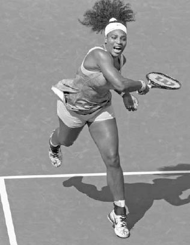
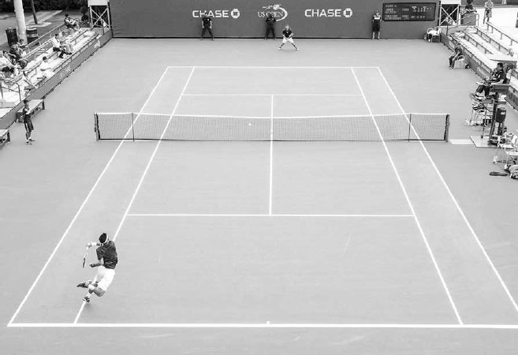
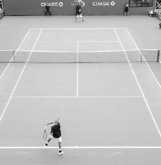
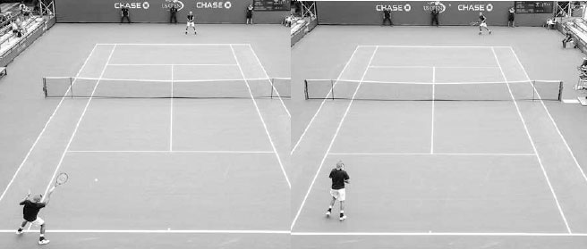
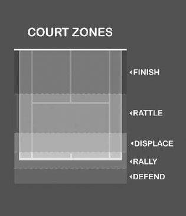
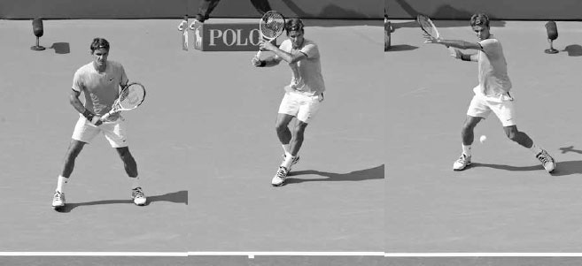
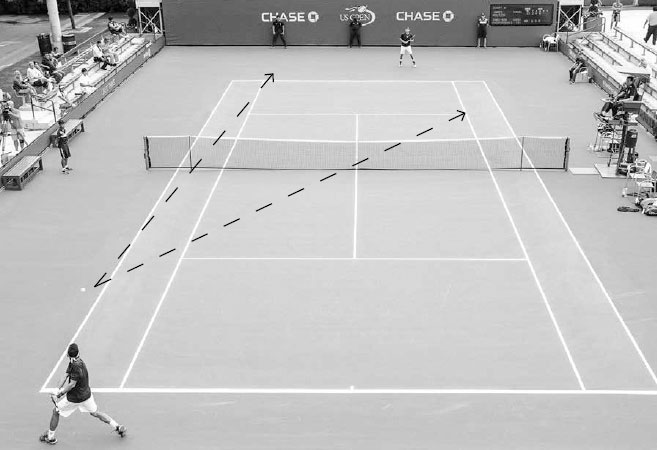
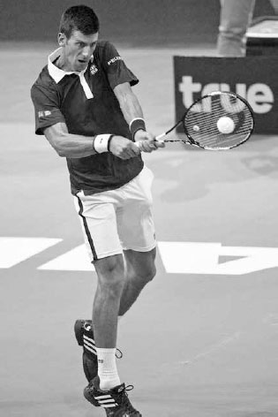
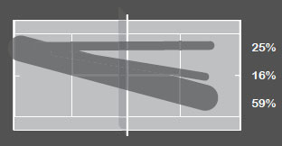

# Singles

On the professional tour, opponent tendencies are often nuanced and deficiencies subtle. But at the recreational level, these characteristics are easier to identify and successful recreational players know how to exploit them. During rallies, they chose the right shot given the circumstances, and in between points, they contemplate the most effective tactics to improve their chances of victory. Drawing the correct conclusions at these junctures requires not only a thorough knowledge of tennis, but also an awareness of your strengths and weaknesses and being observant to those same qualities in your opponent.

In this chapter, I will explain these various tactical components of the game to help you win. I begin with advice on how to skillfully move through the four phases of play, attain optimal court positioning, establish winning shot patterns, and increase your opponents' mistakes while limiting your own. I then provide game plans on how to defeat defensive and aggressive opponents. Next, I help you ask the right questions and give direction on how to make strategic adjustments during a match. I finish the chapter with some suggestions for drills to spark your singles practice sessions.

**I. The Four Phases of Play**

PLAYING SMART TACTICAL TENNIS means making the right shot choices during the "four phases of play" that occur during a rally: the offensive, building, neutral, and defensive phases.

On some points, a strong serve or powerful return will see you begin the rally in the offensive phase, where you will hopefully stay. On the other hand, if you are receiving a fast serve you may start the point in the defensive phase and then attempt to transition to a more favorable one. For most recreational players, whose serve and return usually is not dominant, most points begin in the neutral phase and then proceed up and down the phases from there.

During a rally you might start in the offensive phase and then your opponent hits a great defensive shot and the complexion of the point changes. When that happens, you must reset and not blindly continue playing offensively just because you once had control of the point. To shift sensibly between the phases, you sometimes need to be patient and resolute. At other times, you need to be alert and ready to pounce.

It is important to be aware of how the point is progressing through the phases to know the appropriate height, speed, and spin to use on your shot. Because different shots are needed in different phases, players with versatility in their strokes have the advantage in moving fluently between the phases over those who do not. For example, players that lack power on their forehand may get stuck in the neutral or building phase, or a player without a quality slice forehand may have a hard time moving from the defensive phase to the neutral one. Also, because many factors influence the way you transition through the four phases, including the way you mesh with your opponent, court positioning, and court surface, having different stroke options can help you use the most effective tactical response to these factors in each phase.

Naturally, because everyone plays differently, all the phases have exceptions and "gray" areas. For example, an aggressive player like Serena Williams moves through the phases very differently than a counter-puncher like Carolne Wozniacki. Also, a player with a solid all-round game and no obvious weapons or weaknesses should construct points more patiently than a player with greater variability in stroke abilities. To move through the phases successfully, you need to analyze your game and adhere to the level of aggression and length of point that best helps you win.

Here are more detailed descriptions of each phase and suggestions to consider as you move through them on the court.

*Serena Williams is a player who seeks to enter the offensive phase quickly during a rally. Here, she is in her element pouncing on a high ball in front of the service line.*

**1. OFFENSIVE PHASE**

The offensive phase occurs when you have ample time to set up your shot, good ball height, and favorable court position. The offensive phase from the baseline usually happens on slower, shorter balls that bounce above the waist, where you use a faster, flatter groundstroke. Good examples of offensive phase shots are a powerful inside-out or inside-in forehand hit from in front of the baseline. Other examples are when a scrambling opponent sets you up for a winning volley or a big serve that leads to a weak return and a promising attack situation.

The inside-out forehand is a shot often used by players in the offensive phase of a rally.

All these circumstances represent offensive phase scenarios that you should look for and capitalize on. It is important to take advantage of these "green light" situations when they arise because the opportunity may not happen again during the rally. An offensive opportunity squandered may reverse itself and eventually end with your opponent taking command.

A common mistake players make is attempting an aggressive shot when they are not actually in the offensive phase. Don't attempt an aggressive shot if you don't have the offensive phase ingredients of ample time, good ball height, and favorable court positioning. Hitting an offensive shot when you lack any one of these elements is low percentage tennis. First, limited time usually results in a lack of racquet control caused by being rushed. Second, low balls must be treated with respect because of the height of the net and the limited effect gravity has on a two ounce tennis ball. Third, attempting a winning shot from a deep court position makes little sense because your opponent has plenty of time to react to your shot. Smart offensive tennis requires discipline; the trick is not to force it unnecessarily. If you build the point well, the offensive phase will present itself in good time, and when it does, lock onto it.

**2. BUILDING PHASE**

The building phase of a point occurs when you are moving your opponent around the court, forcing them off balance and setting up the rally for the offensive phase. Your ideal mindset here can be described in two words: controlled aggression.

It depends on your skill level and the court surface, but a typical building phase shot is characterized by hitting the ball two to three feet above the net and three to five feet inside the lines while positioned near the baseline. The most common way to build a point in this phase is by hitting with power or depth, but it can also be achieved with slower shots, like a short, cross-court topspin angle, or even a drop shot.

A player with strong building shots can exhaust their opponent by running them from side to side of the court. One of the defining aspects of Nadal's heavy topspin game is the high percentage way he plays his building shots and fatigues his opponent. His shots have the net clearance of a safe neutral shot but the speed and spin of an offensive building shot. This unique combination of qualities in his baseline shots demoralizes opponents and contributes greatly to his success.

During the neutral phase, mix up the spin, speed, and height of your shots to upset your opponent's timing.

**3. NEUTRAL PHASE**

The neutral phase occurs when neither player has an advantage and usually represents a large part of baseline play at any level. This phase is distinguished by shots hit with good net clearance with both players hitting from a similar court position.

A typical neutral phase shot is hit deep towards the middle of the court. This type of shot will cut down your errors and allow you to rally well with the hopes of hitting more offensively later in the point. While hitting towards the middle of the court, you can use variations in spin, speed, or height to disrupt our opponent's timing, leading to a weak shot from them that allows you to transition from the neutral phase into building an attack.

One of the keys to playing well in the neutral phase is finding the correct rallying speed. Often, I see players practicing at a rallying speed that's too fast and then playing their matches at a rallying speed much slower than their practice. Obviously, this defeats the purpose of practice. It takes concentration and discipline to practice the rallying speed that you will use in the match.

Every player's rallying speed in the neutral phase will be slightly different depending on their skills. I tell my students the right neutral shot "speed limit" is determined by the velocity at which the player can hit ten consecutive shots in the court with confidence. Remember, playing consistently results in playing victoriously. Players who are sometimes derided and called "pushers" know their skill level and are actually playing intelligently. They rally in the neutral phase at the right speed in accordance with their skills: that's smart tennis.

**4. DEFENSIVE PHASE**

The defensive phase is the least appealing phase of a point, but it is an important part of the game. The defensive phase occurs when you are rushed, off balance, or positioned deep behind the baseline. Your goal with the defensive shot is to buy time, neutralize the point, and then hopefully build up to an offensive situation.

The lob, high topspin groundstroke, and slice groundstroke on a wide baseline shot are good examples of defensive strokes. These strokes all have slower ball speeds to provide you time to return to the middle of the baseline. The slice "squash shot" (see page 109) done on wide balls has gained in popularity as the defensive shot of choice at the higher levels of the game because of the faster speed it creates compared to other defensive options. The introduction of the swinging volley has made the slow, loopy shot a less attractive defensive option for the professionals, but it is still a viable tactic at the recreational level.

  -----------------------------------------------------------------------------------------------------------------------------------------------------------------------------------------------------------------------------------------------------------------------------------------------------------------------------------------------------------------------------------------------------------------------------------------------------------------------------------------------------------------------------------------------------------------------------------------------------------------------------------------------------------------------------------------------------
  **COACH'S BOX:**
  **Playing defensive shots well requires being agile and athletic enough to control the racquet when you're in trouble. The improved athleticism of the players on the professional tour has corresponded with a marked improvement in their defensive skills. Modern professionals are stretching and contorting their bodies to allow them to extend points in ways rarely seen in the past. Consequently, the ability to play quality defensive shots has seen a big jump in its influence on a player's likelihood of winning a match. In fact, it could be argued that players like Andy Murray owe as much of their success to superb defensive skills as their talent for crushing winners.**
  -----------------------------------------------------------------------------------------------------------------------------------------------------------------------------------------------------------------------------------------------------------------------------------------------------------------------------------------------------------------------------------------------------------------------------------------------------------------------------------------------------------------------------------------------------------------------------------------------------------------------------------------------------------------------------------------------------

Hitting deep down the middle also can help turn the tables when you're facing a defensive situation. Hitting deep will force your opponent to hit from behind the baseline, allowing you time to recover, and hitting down the middle will reduce the angles for your opponent to run you around the court. If you have gotten the point back to neutral after being in a defensive situation, don't be in a rush to get to the offensive phase. You may be out of sorts from playing defensive shots and need a shot or two in the neutral phase to regain your composure and rhythm.

**II. Court Positioning**

HOW QUICKLY YOU MOVE TO THE BEST location on the court during the different phases is an important part of the game. You must be flexible with your court positioning and move forward when you can, backward when needed, and right or left to best cover the angles.

If you are able to move forward and play closer to the baseline than your opponent, they will be covering more ground and have less time to prepare for their shot. Often this will result in the rally tilting in your favor simply because of where you are standing on the court.

You should move forward several steps following a strong groundstroke, especially if your opponent is going to be rushed or off balance playing their shot (below). By moving forward a couple of steps, you will get a jump start on your next shot and give your opponent less time to recover. Recognize that you will stand closer to the baseline in a more aggressive court position on hard courts than on the slower clay courts.

If you see your opponent scrambling, move forward.

Everyone loves to play offense, but there will be times when defense is required and you should move backwards away from the baseline. For example, if you hit a weak short ball and your opponent is about to unload on a forehand, moving back will buy you an extra split second of time to defend the court and extend the point. Or, if your opponent hits a high ball, instead of staying forward and hitting the ball on the rise above your shoulder, it is often the smart play to move back from the baseline and allow the ball to drop to a comfortable height and hit a high topspin ball back to your opponent (opposite bottom).

Court positioning is also important during a baseline rally where neither player has a distinct advantage and the ball is moving laterally around the court. If you are hitting cross court to your opponent, position yourself slightly on the same side as you are hitting. This will place you in the midpoint of your opponent's angles. For example, after hitting a cross-court backhand that pulls your opponent left of the singles line, you should position yourself three or four feet left of the center hash mark (next page). If you hit the backhand down the line, you should move quickly a couple of feet to the right side of the center hash mark to be positioned in the midpoint of your opponent's possible cross-court or down-the-line shot. Interestingly, when looking at a match from a bird's eye view, it becomes obvious how tennis is game of geometry and the importance of placing oneself in the middle of angles becomes clearer.

**1. COURT POSITIONING AND TACTICS**

Court positioning also plays an important tactical role in your matches. If you have a game plan that emphasizes getting to the net, then you may position yourself closer to the baseline to enhance your chances of coming forward to volley. You can serve from different positions to make use of your weapons or make it easier to angle your serve to your opponent's weakness. For example, by serving a few feet to the right of the center hash mark on the ad side, you will get a better angle to aim your serve to the right hander's backhand as well as opening more of the court to your forehand. Your positioning on the return of serve can also have a powerful effect on your strategy. You can position yourself several feet inside the baseline and go for an outright winner on the return or come forward to attack the net immediately following the return. Or, if you believe your chances of winning the point are better by engaging your opponent in a long rally, you can return serve from well behind the baseline to allow yourself more time to return serve and neutralize the serving advantage.

*Federer backs up to make use of his powerful forehand and hit the ball at a more comfortable height.*

The purpose of your shot will vary depending on your court positioning. There are five main zones.

**1. FINISH --- HIT WINNERS, 2. RATTLE --- HIT TO RUSH YOUR OPPONENT, 3. DISPLACE --- HIT TO MOVE YOUR OPPONENT AWAY FROM THE MIDDLE OF THE BASELINE, 4. RALLY --- HIT WITH PATIENCE, AND 5. DEFEND --- HIT TO BUY TIME.**

The player at the opposite baseline is correctly positioned left-of-center at the midpoint of his opponent's angles.

Court positioning can sometimes take precedence over hitting to an opponent's weakness. For example, serving out wide on the deuce side to a player's forehand may open up the court and allow you to control court position, even though your opponent's forehand may be their strength. Serving towards the center line to the backhand on the deuce side may be a play to their weaker stroke but do little to hurt your opponent's court positioning. Furthermore, sometimes it is tactically savvy to hit aggressively to your opponent's strength and weaken their court positioning, thereby opening up the court to then hit to your opponent's weakness on the next shot. For example, hitting a cross-court forehand return of serve from the deuce side to your opponent's forehand will enhance your ability to attack their backhand on your next shot. Throughout the match, you must constantly evaluate the best shot, weighing your opponent's weakness versus court positioning. This can change during the course of a match as a stroke may improve or deteriorate, or fatigue might make the court positioning factor a stronger consideration.

**III. Shot Patterns**

YOUR REPERTOIRE OF SHOT PATTERNS is a major strategic building block --- that is, predetermined, high percentage sequences of shots. Champion players have shot patterns that make the best use of their strongest strokes. For instance, Federer uses his slice backhand to keep the ball low and move his opponent inside the baseline and then uses his forehand weapon to hit deep to the open corner. One of Djokovic's many talents is his ability to change the direction of cross-court shots by driving the ball down the line and get his opponent scrambling. Murray's superior groundstroke finesse allows him to play more short slices to pull opponents forward to the net and force them to defend his precise passing shots. Federer's slice backhand, Djokovic's stroke change of direction, and Murray's finesse are all personalized weapons which they have developed into distinctive winning shot patterns.

A player's level of success is greatly influenced by how their favorite shot patterns match up with their opponent. For instance, consider the pairing of Nadal's cross-court forehand to Federer's one-handed backhand: Nadal's high topspin creates an awkward contact point for Federer's one-handed backhand, often forcing him to hit a defensive slice and allowing Nadal to take control of the point. However, the match up of Nadal's cross-court forehand to Djokovic's two-handed backhand works in reverse. The high bounce of Nadal's topspin creates a contact point that Djokovic enjoys. Djokovic can take Nadal's cross-court forehand and power his backhand down the line, causing the Spaniard to play a rushed backhand of his own and lose control of the point. Indeed at any level of singles, you can find examples of a player who defeats one opponent consistently and loses to another opponent consistently, but when those two opponents play each other, the results are even; such is the impact of shot patterns on the outcome of a match.

*Djokovic's success against Nadal can be partly attributed to the fact that Nadal's cross-court forehand often results in a chest-high contact point on his backhand --- a contact height Djokovic enjoys.*

An Analysis of 702 shots (87% Backhands) An Analysis of 309 shots (100% Forehands) Nishikori shot charts: In the first shot chart (left) we can deduce that Nishikori favors the cross-court backhand. In the second shot chart (right) we see he likes to hit his forehand down the line. This shot often "funnels" the rally back to his favorite shot pattern: the cross-court backhand rally.(1) Professional players now have access to in-depth shot charts that provide highly useful information on their next opponent's shot patterns. Analyzing the shot charts, it becomes clear what shot patterns the pros think work best for them. Above are two shot charts of Kei Nishikori's play over a period of six months in 2014-15. Looking at his chart, it is clear that Nishikori believes the backhand cross-court pattern works in his favor (above left). He also embraces the down-the-line forehand (above right). Nishikori knows the likely response from his opponent to his down-the-line forehand is a cross-court backhand, which gives Nishikori the option of establishing his favorite shot pattern --- the cross-court backhand rally.

You too should analyze your game and establish successful, repetitive shot patterns that revolve around maximizing your best shots. Keep in mind that occasionally, winning a match might mean using a sequence that is not your favorite shot pattern; however, because it troubles your opponent it might be a smart shot sequence for that particular match. **Irrespective of whether a specific shot pattern is used frequently or not, the point is, as in chess, you should think a shot or two ahead during the rally and hit your shots with purpose and a sequence in mind.**

THE CROSS-COURT SHOT PATTERN AND HITTING DOWN- THE-LINE Most shot patterns in tennis involve some cross-court hitting from the baseline. Hitting cross-court is the primary direction in a baseline rally due to the benefits of better court positioning, a lower net, a longer court, and a swing path that produces a bigger hip rotation for added power.

Early in the match, learn which cross-court rally (forehand or backhand) favors your strength or attacks your opponent's weakness and then quickly figure out the type of serve, return of serve, or sequence of shots that steer the rally into that cross-court scenario. Once you are involved in a favorable cross-court rally, do your best to stay in it. If the reverse is true, then you should be looking to change the pattern by hitting down-the-line. Using the inside-in or inside-out forehand, approach shot, or even a drop shot are other ways to break an unfavorable cross-court shot pattern.

Because of its shorter distance, the down-the-line groundstroke can be an effective offensive shot when positioned inside the baseline.

Generally speaking, it makes sense to hit down the line when you are positioned reasonably close to the baseline and have ample time to set up for the shot (above). The down-the-line shot has the advantage of shorter distance and, therefore, less time for your opponent to defend the shot. However, you must choose when to play a down the line shot judiciously. One that's poorly hit can open the door for your opponent to hit cross court --- a diagonal shot that can force long lateral movement --- and turn the point against you. On most occasions, if you are deep behind the baseline or rushed, play your shot safely cross court, and if you are inside the baseline and have time, hit your shot aggressively down the line.

**IV. Mistake Management**

YOUR STRATEGIC FOCUS should always be to play in a manner that keeps your errors to a minimum. The ratio of errors to winners for most recreational players is greater than three to one. Therefore, improving your skills or shot selection to decrease errors will have a much larger impact on your chances of victory than increasing winners at the same rate. Most players know this, but even so, when they come to me for advice, one of their first questions often is, "How do I hit more winners?" There's no question hitting winners is fun, but they usually don't have an impact on the outcome of most matches.

**1. REDUCING YOUR ERRORS**

At the recreational level, the defensive players that do the best job at limiting their errors often have the greatest success. They win because they concentrate on the correct side of the point ledger and therefore play with the power of numbers on their side. Below are seven ways to reduce your errors.

**A. PLAY WITH GOOD NET CLEARANCE BY VISUALIZING YOUR TARGET**

The net is enemy number one for tennis players so hit your baseline shots with "shape" and well above the net. Hitting low over the net will not only result in more errors into the net, but also less depth on your shots and a more comfortable height for your opponent to play their strokes. To help your shot clear the net, it is important to visualize its trajectory as you are setting up for the swing. You should always have a target in mind for the trajectory of your shot, in addition to its speed and depth. In my experience, too many players are vague in their shot intentions, and consequently, their shots lack the height to clear the net consistently. Remember, the body performs better when the mind provides a clear purpose; accomplish this and your aim will be more likely to be true.

  ------------------------------------------------------------------------------------------------------------------------------------------------------------------------------------------------------------------------------------------------------------------------------------------------------------------------------------------------------------------------------------------------------------------------------------------------------------------------------------------------
  **COACH'S BOX:**
  **It is important to be aware that psychologically, because you can see through the net, it seems less threatening. Consequently, you may become less conscious of the real impediment posed by the net. Studies have shown that when the net is covered with blankets, players hit into the net substantially less. Next time you play, imagine the net is not a net but a brick wall. This will help reinforce the importance of clearing the net by a good margin and reduce your errors.**
  ------------------------------------------------------------------------------------------------------------------------------------------------------------------------------------------------------------------------------------------------------------------------------------------------------------------------------------------------------------------------------------------------------------------------------------------------------------------------------------------------

**B. HIT WELL INSIDE THE SINGLES SIDELINES, ESPECIALLY IF YOU ARE NOT CONTROLLING THE POINT**

Aiming your shot close to the singles sidelines during the neutral or defensive phase usually won't change the dynamic of the point, but it will increase the chances of making a mistake. The risk/reward trade-off is not worth it. Not only that, but it can also give your opponents more angles to work with and allow them to move you more easily around the court from side to side. In most situations, it is only during the building or offensive phase that aiming your shot closer to the singles sidelines makes strategic sense.

**C. MAINTAIN QUALITY FOOTWORK AND GOOD FOOT SPEED**

Mistakes often result from being too close or far away from the ball during the swing. By using the correct steps before the swing, you will obtain proper spacing to the ball and swing with the balance needed for consistent contact. Also, good foot speed will allow you more time to set up for your shot and ground your feet for improved racquet control.

**D. USE OF SPIN**

Topspin gives you the ability to hit with good net clearance and backspin improves consistency by increasing ball control.

**E. BE SELF-AWARE**

Some errors occur because players try shots that are not high percentage options given their skills and ability. Don't depend on divine intervention as you attempt to hit a running forehand six inches inside the line at 80 miles an hour, like the one you saw Djokovic do on television the night before. Be realistic about your capabilities and play shots you know you can perform reliably.

**F. DEVELOP SUPERIOR MENTAL TOUGHNESS AND PHYSICAL FITNESS**

You sometimes see players get upset, lose concentration, and play frustrated low percentage tennis. Train yourself to stay in a positive emotional state and play high percentage tennis every point. Also, if you are not physically fit, you are more likely to play a risky shot in an attempt to end the pointquickly; this often results in an error.

Powerful running forehands that skim the net are best left to the pros.

**G. BE PATIENT**

Some players hit several shots and feel like they need to do something special because their shot "quota" has been met. Raise your shot tolerance and pick your spots to be aggressive wisely.

**2. INDUCING OPPONENT ERRORS**

While a main focus of any game plan is to limit your own errors, you should also look for ways to induce your opponent to make more errors. Remember most of the points you win in a match are going to be from your opponent's forced and unforced errors (roughly half forced and a quarter unforced), so always be looking for openings that make hitting the ball difficult for them.

Below are six ways to induce more errors from your opponent.

**A. USE DIFFERENT SPEEDS AND SPINS**

Don't let your opponent establish a confident rhythm by sending them a ball that consistently arrives at a similar speed and spin. By giving your opponent different shot speeds, they have to adjust their body movement and and swing velocity to create power, and varying the spin on your shot can cause opponent misfires by changing the speed, flight trajectory, and height of the bounce. Tennis is an exact game. Upsetting the timing of your opponent's swing by even a tenth of a second can lead to an error or a weak shot that you can attack.

*After defending this difficult corner shot, Angelique Kerber is likely to find herself behind in the point.*

**B. VARY THE HEIGHT OF SHOT**

Most players like a waist-high contact point. Instead, force your opponents to hit shots at an uncomfortable height above the shoulders or below their knees.

**C. UTILIZE CORNER SHOTS**

By hitting towards a baseline corner, you are able to move your opponents from side to side, forcing them to hit off balance and increasing the likelihood of them making an error.

**D. COVER THE COURT WELL**

Returning ball after ball with good court coverage and hustle will frustrate opponents and lead them to make poor decisions on shot choices. Superior foot speed will often lead to more mistakes from your opponents as they aim closer and closer to the lines to try to win the point.

**E. BE CONSISTENT**

If you are consistent and show your opponent a dogged determination to keep the ball in play, you will often succeed in coaxing your opponent into an error. After engaging and winning several long rallies, you will often find your opponent becomes eager to pull the trigger on a risky shot and makes a mistake.

**F. HIT DEEP**

Hitting deep gives your opponents less time to set up for their shot off the ball's bounce, increasing the likelihood they'll mistime the shot or rush their swing. Remember the three keys to superior shot depth - hit "through" the ball and use good extension through contact, give your shot good shape by hitting well above the net, and visualize a deep target in the court.

**V. Game Plans**

TENNIS IS A BEAUTIFULLY DESIGNED GAME. The size of the court, the height of the net, and the weight of the ball results in no one "right" way to play. You have many strategic options available to you and learning to develop a winning game plan during matches means processing the choices and selecting the right one (or two).

A smart game plan can sometimes lead you to victories over more skilled opponents. It was definitely an important factor in my best win on the professional tour. I was a successful U.S. college player, but found the leap to the pros a big one. The opponent I defeated was Paul Kilderry, a gifted professional player who went on to win several ATP doubles titles and earn a spot on the Australian Davis Cup Team. During the warm-up with Kilderry, it became obvious to me that this was a guy I didn't want to get into extended baseline rallies with. His groundstrokes were powerful, deep, accurate, and superior to mine. I decided in the warm-up that on my return of serve and during the rally following my serve, I was going to slice my forehand and backhand short and low in the court and move forward to volley as much as possible. It was an unusual strategy, not the "right" way to play, but it did make use of one my strengths (slice groundstrokes) and expose one of his few weaknesses (short, low balls). In front of a team of national selectors and a group of my surprised peers, I won a tightly contested first set. The second set was easier as I served well and his level of frustration continued to rise as the prospect of losing became a reality. My game plan, combined with the good fortune of my having a terrific day and him a bad one (an influential element of the game and good reason why you should always go into a match against a higher ranked opponent with a positive attitude) led to one of my most satisfying wins. The key takeaway here is, in any match up, there will be ways to exploit your opponent's weaknesses or better utilize your strengths to give yourself an advantage; sometimes small adjustments or insights will be the deciding factor in winning the match.

  -----------------------------------------------------------------------------------------------------------------------------------------------------------------------------------------------------------------------------------------------------------------------------------------------------------------------------------------------------------------------------------------------------------------------------------------------------------------------------------------------------------------------------------------------------------------------------------------------------------------------------
  **COACH'S BOX:**
  **Some players fail to hit deep because depth perception tricks them, making the space behind the service line seem smaller than it really is. For example, if you are standing on the baseline and looking to the opposite side of the court at one ball placed on the service line and another ball placed on the baseline, it would appear there is little room between the two balls. But if you were to view those same two balls from the side you would see the two balls are actually 18 feet apart. Don't let the depth perception "illusion" dissuade you from hitting the ball deeper and higher over the net.**
  -----------------------------------------------------------------------------------------------------------------------------------------------------------------------------------------------------------------------------------------------------------------------------------------------------------------------------------------------------------------------------------------------------------------------------------------------------------------------------------------------------------------------------------------------------------------------------------------------------------------------------

Hitting deep is such an important factor to winning baseline rallies that I never get upset with my students if they hit a shot with the appropriate speed, height, and spin for the circumstances, but the ball lands a foot beyond the baseline. If the goal is to hit four or five feet inside the baseline, which of the following two shots is more accurate: the shot that lands 15 feet inside the baseline or the shot that lands one foot past the baseline? One could argue the latter is closer to the goal.

Choosing and employing the game plan that gives you that advantage comes largely from being observant of your opponent's likes and dislikes, in addition to cultivating a deep understanding of oneself. In fact, the first step in developing a smart game plan should be to sit down with a pen and paper and write out your strengths and weaknesses. It is only through self-awareness that you can know how to play your matches intelligently.

It is important to note, if you can execute a game plan that gives you a small edge, you should be in good shape. Statistically, in a match that lasts 100 points, winning 55 points of these points will allow you to win the majority of the time. For example, when Nadal dominated the French Open from 2005- 2014, winning the title eight times in nine years and compiling an incredible 59-1 record, what do you suppose was his winning percentage of points played? 60, 65, 70%? No, Nadal won "just" 56.7% of the points he played.(2) Another revealing statistic shows how fine the margins are between winning and losing in tennis. Between 2014 and 2015, Djokovic raised his percentage of points won in matches by just one percent. In 2014, he won 61 matches. In 2015, he won 82 matches (and an extra seven million dollars).(3) A small edge can be huge in tennis. Nadal won "only" 56.7% of the points he played en route to winning eight French Opens.

With the margins in tennis often being so fine, game plans are crucial, but so are winning the so-called "big" points. All points are worth the same value and therefore all are important, but because certain points have a larger scoring and psychological impact than others, some carry more weight. For example, if you are ahead 4-3, 30-40 receiving serve and win that point, you are ahead 5-3 and serving for the set. Lose it, and you may soon be facing 4-4 and an even match. Break points, tiebreak points, 30-30, and deuce points at the end of a close set are decisive junctures that the pros point to from the locker room as having decided a close match. I also believe the 15-30 stage of a game is particularly important. If you are receiving serve at 15-30 and win that point, you have double break point; lose it, and the game is tied.

Through statistics, we can see the influence that "big points" can have on a professional match. During the 2016 U.S. Open men's final between Stan Wawrinka and Novak Djokovic, Wawrinka won 6 of 10 of his break points while Djokovic won just 3 of 17. Even though the point tally was almost identical (144 to 143 in Wawrinka's favor) Wawrinka won 30% more games (25 to 19) on his way to victory in a well-fought but reasonably comfortable four set match.(4) So when a big point arrives in your matches, remind yourself to raise your focus and intensity and execute your game plan to the very best of your ability.

Most players you compete against will fall in the middle of the aggressive play spectrum. Therefore, as discussed earlier in the chapter, your strategic focus is moving through the four phases wisely, making the right court positioning moves, establishing successful shot patterns, and reducing and inducing mistakes. However, you will also compete against players who are particularly defensive or particularly aggressive. Against such players, the focus remains largely the same but there are several other strategic tips to consider that can help you develop a winning game plan.

*Winning a much higher percentage of break points than Djokovic helped Stan Wawrinka win the 2016 U.S. Open.*

**1. DEFEATING A DEFENSIVE PLAYER**

Anyone who has played a decent amount of competitive tennis has run into the defensive player. This type of player doesn't possess power but wins by keeping the ball safely in the court and playing very consistent tennis. These players can be a dread to play, and it can be tempting to try thumping the ball past them. However, this is low percentage tennis and unlikely to lead you to victory. You must be appropriately patient and understand that you may have to work the point harder than usual before receiving the right ball to dispatch.

Psychologically, some competitors find it hard to understand how they are unable to easily defeat players who hit the ball without power. Defensive players often rely on this frustration to help them win the match. It is part of their strategy. They feed off negative energy, so if you can suppress pessimistic emotions, you will deny them their desired mental edge. The right approach is to acknowledge that even though these players have few weapons, they can be difficult opponents to defeat and deserve respect. You should be mentally prepared and appreciate the fact that you are likely to be engaged in a competitive battle. Below are five tactics to consider for your game plan when playing a defensive player.

**A. USE DROP SHOTS**

Defensive players feel at home when planted at the baseline. Therefore, bringing them forward with frequent drop shots to make them play the net can make them uneasy and ineffective. Additionally, the slower speed of their shot makes it easier to set up a good drop shot more often, even if it means hitting from a position deeper in the court than usual for you.

**B. FORCE SIDE-TO-SIDE MOVEMENT**

Defensive players don't hit with pace and this allows you the time to place your shots accurately towards the baseline corners. Corner shots will get them moving from side to side across the court and test their endurance. This tactic may not reap big rewards early in the match, but as the match progresses it can pay handsome dividends. Don't always be in a rush to end the point if you have them running side-to-side. If they lack superior fitness and don't possess the power to bail themselves out of a defensive situation, you can safely run them around for a few more shots to exhaust them a little more before finishing the point. Also, keep in mind that defensive players typically pride themselves in recovering quickly to the middle of the baseline after returning a corner shot.

Such players are good candidates to "wrong foot," that is, hitting the ball back to the same corner from where they are recovering. Their fast recovery can make it difficult to stop quickly and change directions to return a ball hit in the same corner twice in a row.

Attacking the net can be an effective tactic against a defensive player.

**C. ATTACK THE NET**

Defensive players don't like to be hurried, so if you can use your net game, you are forcing them out of their rhythm and preferred tempo of play. They typically don't hit the ball hard, so there is a high probability you will have a play on their passing shot. Here, the swinging volley can be a very useful shot. Using the swing volley to attack their high groundstrokes will force them to hit lower and faster and result in more mistakes.

**D. USE SPIN AND ANGLES**

Against defensive players, don't be seduced by the allure of trying to hit flat winners all the time. Their ball will lack pace, and using topspin and backspin is a key way of controlling your shots and playing with consistency. The slower speed of this player's shot may be difficult to generate power from, but it makes for a comfortable speed to play angled cross-court topspin shots to open up the court. Well-executed building shots such as these will lead you to many winning offensive situations.

**E. CHANGE COURT POSITION**

As mentioned, playing more drop shots and attacking the net are key strategies, so playing closer to or even inside the baseline can make strategic sense as it increases the effectiveness of these two strategies.

**2. DEFEATING A POWER PLAYER**

Tennis has become faster and more aggressive, and power hitters, players who seek to keep the point short by hitting deep and fast, have become more common than ever before. These players thrive on pace. If you hit with pace, you will line the ball up in their favorite strike zone, making it comfortable for them to replay with equal (or more) velocity. For example, Serena Williams, an offensive player, accumulated an 18 match winning streak against five-time Grand Slam champion Maria Sharapova partly because she enjoys the regularity of Maria's flat, fast strokes. On the other hand, when Serena played Monica Niculescu at the 2015 BNP Paribas Open, it was evident how much Serena dislikes the slower paced ball. Niculescu's slow slice forehand caused Serena to rack up 48 errors as she struggled to beat the 68th ranked player in the world.(5) Below are six tactics to consider when up against a power player.

**A. USE DIFFERENT SPINS AND SPEEDS**

Power hitters enjoy an incoming shot that is waist high with good speed and little spin. Make life difficult for them by feeding them plenty of high, slow topspin shots. This forces them to generate their own pace, and the higher bounce will get the ball out of their ideal contact height.

Slice shots can be effective too. The backspin of a slice shot produces a slower, lower bounce and forces the power hitters out of their preferred speed and strike zone. The low bounce means they must arc the ball into the court, reducing their ability to hit hard. Also, the slice groundstroke is easier to control and hit accurately very deep or very short in the court. This moves them up and back when playing shots and limits the time available to establish the necessary balance for a powerful shot.

Monica Niculescu's slow slice forehand has been known to trouble the power hitters on the WTA Tour.

The type of forehand grip your power hitting opponent uses will play a role in what spin to use more frequently. For example, if they use a western grip, then you should use slice shots more often. The low bounce of slice shots creates an awkward height for such opponents since the western grip hand position is better suited to higher bouncing balls. On the other hand, if your opponent uses an eastern grip, which is suited to a lower bounce, then the high topspin shot should be hit more often.

**B. ATTACK THE STRENGTH FIRST**

Sometimes the easiest way to attack a power player's weakness is by attacking their strength first. For example, assuming the forehand is your opponent's power shot, aggressively hitting your forehand cross court will open up the right side of the court to attack your opponent's backhand.

Power players often like to move left to hit forehands, leaving an open court for the down-the-line backhand.

**C. HIT THE DOWN-THE-LINE BACKHAND**

Power hitters often try to dominate play by moving to the left side of the court to hit big inside forehand to their opponents' backhand (above). A good down-the-line backhand in response to an inside forehand will force your opponents to move quickly to the right and play a rushed stroke.

**D. ATTACK THE NET**

Power hitters typically don't use a lot of topspin. Therefore, they are less skilled at dipping the ball at a net player's feet or hitting a sharply angled cross-court passing shot. Also, they usually don't lob frequently, allowing you to move forward aggressively and obtain good net positioning.

**E. BE TENACIOUS**

Remember a tennis match is a long jog, not a sprint, so don't be discouraged if a power player hits a series of flashy winners. Being tenacious and unflappable will often frustrate them and tempt them to try riskier shots, tilting the odds in your favor.

**F. CHANGE COURT POSITIONING**

Moving further back from the baseline allows you more time to defend power shots and lengthen the point. Power hitters don't play a high percentage brand of tennis, so with every ball you return, the probability that they will make an error increases more than when playing other opponents.

**VI. Strategic Questions and Adjustments**

SOMETIMES YOU WILL KNOW your opponent and can establish a game plan before the match. But often you will not know your opponent and need to develop a strategy quickly during the match. To do this well, you must ask and answer specific strategic questions. Even if you know your opponent, the court surface, weather conditions, and other intangibles can lead to unpredictability and these questions will need to be asked and answered.

Champion players ask these same questions in an effort to gain an advantage shot by shot, point by point, and match by match. Recently, I was watching a televised Federer-Djokovic match, and the commentator suggested that Federer would have more success by attacking the net more frequently. I thought to myself that there was little doubt that Roger is contemplating all his strategic choices, including attacking the net. I'm sure he was asking questions to himself regarding the speed of the court, the quality of Djokovic's passing shots, and his court positioning for approach shots, as well as many other factors throughout the match. Only after taking all these things into consideration would he make a determination of when and how best to attack the net.

Federer's adaptability to match circumstances and determining whether attacking the net was the right tactic was clearly evident during two matches he played at the 2015 ATP World Tour Finals. In two victories in matches of almost identical length, he came to the net nine times against Djokovic and 32 against Wawrinka.(6) During an interview after the Wawrinka match, he said he planned to attack the net but was prepared to make mid-match strategy adjustments depending on the success he had employing his net rushing tactic. We can all learn from Federer and be observant of our opponent's level and style of play to come up with the best strategy to win on that day.

*Federer versus Djokovic is a match between two very observant champion players with a keen sensitivity to all the objective variables (e.g. court speed and weather conditions) and subjective variables (e.g. confidence and timing) a tennis match brings.*

Recreational players are sometimes too self-conscious and thus unaware of the signs and signals their opponent is sending about their abilities. If you are observant, you will notice that your opponent is telegraphing information that you can use to win. For example, during the warm-up take notice to see if your opponent is moving to the right or left to play their forehand and backhand. I've found that players are often nervous in the warm-up and like to hit their preferred groundstroke as much as possible. If you see your opponent warm up their volleys with a forehand-type grip, you can almost be guaranteed that player will stand too far to the left on the court to protect their backhand, and opportunities to hit through open spaces to the right are going to present themselves during the match. If you see your opponent lacks the ability to put good spin on their serve, be extra aggressive on your return. There's a good chance their serve will break down, especially their second serve, in a pressure situation. You should train yourself to be observant to the happenings on the court and remember it for present and future proceedings.

**1. STRATEGIC QUESTIONS TO ANSWER**

To determine the best strategy quickly, questions about your opponent's game need to be answered early in the match. Here are 16 questions to ask yourself as you dissect your opponent's game and establish your strategy:

**1.WHAT ARE YOUR OPPONENT'S GROUNDSTROKE STRENGTHS AND WEAKNESSES?**

**2.WHAT ARE THE TYPICAL DEPTHS, HEIGHTS, SPEEDS, AND SPINS OF YOUR OPPONENT'S FOREHANDS AND BACKHANDS?**

**3.HOW DOES YOUR OPPONENT RESPOND TO DIFFERENT DEPTHS, HEIGHTS, SPEEDS, AND SPINS OF YOUR SHOTS?**

**4.WHERE AND HOW DOES YOUR OPPONENT PREFER TO HIT THEIR FOREHAND AND BACKHAND?**

**5.DOES YOUR OPPONENT PREFER TO HIT THEIR FOREHAND MOVING TO THE RIGHT OR LEFT?**

**6.DO THE FOREHAND OR BACKHAND CROSS-COURT RALLIES WORK IN YOUR FAVOR?**

**7.IF THE FOREHAND OR BACKHAND CROSS-COURT RALLY DOESN'T WORK IN YOUR FAVOR, HOW SHOULD YOU LOOK TO CHANGE THAT RALLY?**

**8.DOES YOUR OPPONENT LOSE PATIENCE FIVE, 10, OR 15 SHOTS INTO THE RALLY?**

**9.WHAT IS YOUR OPPONENT'S FOOT SPEED FOR REACHING WIDE BALLS AND DROP SHOTS?**

**10.WHERE DOES YOUR OPPONENT STAND ON THE COURT FOR THE RETURN OF SERVE, VOLLEYS, AND DURING THE BASELINE RALLY?**

**11.WHERE SHOULD YOU STAND TO SERVE AND RETURN SERVE AND DURING A BASELINE RALLY?**

**12.WHERE AND HOW DOES YOUR OPPONENT LIKE TO SERVE THEIR FIRST AND SECOND SERVE?**

**13.WHERE DOES YOUR OPPONENT LIKE TO RETURN YOUR FIRST SERVE AND SECOND SERVE?**

**14.HOW WELL DOES YOUR OPPONENT LOB?**

**15.WHAT IS YOUR OPPONENT'S ABILITY AT NET?**

**16.WHAT IS YOUR OPPONENT'S LEVEL OF MENTAL TOUGHNESS AND PHYSICAL FITNESS?**

**2. STRATEGIC ADJUSTMENTS**

As the match progresses, you will be able to answer these questions with increased confidence and develop a full profile of your opponent's abilities. From this profile try to establish and then place firmly in your mind one or two tactics you think will be particularly effective --- keep it simple. The clearer you are with your strategy, the better your decision-making will be in the course of a rally, resulting in smarter shot selection. On the other hand, strategy indecisiveness will lead to missed opportunities and overly ambitious mistakes.

After the first set, assess the situation again and make adjustments to the strategy if necessary. If you are winning, stay focused and consistent with the shot patterns and level of aggression that gave you the lead. For instance, think of Nadal's straight set victory over Federer at the Australian Open in 2014, which saw him serve 92% of his first serves to Federer's backhand.(7) Rafa saw the winning results of that tactic and stayed with it. Attacking an opponent's weak stroke repeatedly will usually go one of two ways. The stroke will crumble, or the repetition will help it, so be observant and decide during the match whether it is best to stay relentless or mix up your shots more.

If you are losing, slow the pace of the match down by taking a little more time between points and employ a different tactic that might turn the match around. That might mean raising the level of aggression and aiming faster shots more towards the lines. This style of play paid off for Federer when he defeated Nadal to win the 2017 Australian Open. He told himself, "Be free in your shots. Go for it. The brave will be rewarded here."⁸ He swung freely, particularly on the backhand side, and the short aggressive rallies worked in his favor. Or the opposite style of play and hitting the ball higher and down the middle may be the smart tactical choice. Sometimes you may have the right strategy but not the right execution, and what is needed is greater focus and intensity rather than a change of strategy.

  ------------------------------------------------------------------------------------------------------------------------------------------------------------------------------------------------------------------------------------------------------------------------------------------------------------------------------------------------------------------------------------------------------------------------------------------------------------------------------------------------------------------------------------------------------------------------------------------------------------
  **COACH'S BOX:**
  **It takes many competitive matches over a considerable period of time to become strategically astute and make the right decisions on the court. Take, for example, two well-known strategies in tennis: the battering ram and the punisher. The battering ram strategy involves hitting to an opponent's weakness time and time again --- a good tactic when the opponent has an obvious weakness. The punisher strategy refers to the tactic of relentlessly moving an opponent around the court from side to side and up and back a good tactic against a player who moves poorly or lacks endurance.**
  ------------------------------------------------------------------------------------------------------------------------------------------------------------------------------------------------------------------------------------------------------------------------------------------------------------------------------------------------------------------------------------------------------------------------------------------------------------------------------------------------------------------------------------------------------------------------------------------------------------

Deciding which of the two strategies to employ and to what degree to use it against each opponent takes a good amount of match experience. Against the same opponent, you may use the battering ram on a fast court surface and the punisher on a slow court surface or vice versa. You may even use both strategies over the course of the same match; the battering ram early, and then if repetition is starting to groove the weakness or the opponent is becoming tired, you may end the match focused on executing shots that force the opponent to move the most.

*Nadal stayed with a winning serving tactic in defeating Federer at the 2014 Australian Open.*

Because these strategic decisions often aren't obvious, experience is important. Compete as much as possible to hone your decision-making. It is only with accrued match experience that you will be able to quickly assess opponents' strengths and weaknesses, understand your own strengths and weaknesses better, and deduce what strategy will work best for you in response to all the match variables. Play practice matches against a variety of playing styles, including aggressive net rushers, all-court players, and defensive baseline players. Mixing up your style of opponent will help you learn what shot patterns work best and how your skills match up against different types of players. Also, play practice matches against better, equal, and less skilled players than yourself. You can gain tactical knowledge by competing against players of varying abilities. Lastly, one's memory can be temporary, so keep a logbook and write down your experiences after each match and review and draw from them in the future.

**VII. Singles Practice**

TO PRACTICE WELL FOR SINGLES, you need to do what the professionals do: that is, practice with little difference from your level of intensity in matches. Professionals are fully committed to applying themselves on every shot because they know that the way they practice translates into how they will play in matches.

**U.S. OPEN DOUBLES CHAMPION BETHANIE MATTEK-SANDS SUBSCRIBES TO THIS MAXIM; IT WAS SOMETHING I OBSERVED IN HER GAME WHEN SHE WAS JUST 12 YEARS OLD. EARLY IN MY CAREER, I WAS PART OF A COACHING TEAM WORKING WITH SOME OF THE BEST JUNIORS IN THE WORLD, OF WHICH MATTEK-SANDS WAS ONE. THERE WERE MANY PARTS OF HER GAME THAT IMPRESSED, BUT WHAT STOOD OUT MOST TO ME WAS THE PROFESSIONAL WAY SHE PRACTICED. SHE ALWAYS CAME TO PRACTICE PREPARED AND WITH PURPOSE, AND DURING PRACTICE, SHE APPLIED TREMENDOUS FOCUS AND EFFORT ON EVERY SHOT. I REMEMBER THINKING THAT THIS GIRL, EQUIPPED WITH THESE STRONG PRACTICE HABITS TO GO ALONG WITH HER NATURAL ABILITY, HAD A GOOD CHANCE AT SUCCEEDING ON THE PROFESSIONAL TOUR, AND SHE DID. IN CONTRAST TO BETHANIE, I OFTE SEE RECREATIONAL PLAYERS PRACTICING IN SECOND OR THIRD GEAR. IF YOU PRACTICE WITH LOW INTENSITY, THAT IS WHAT YOUR BODY AND MIND WILL BE FAMILIAR WITH AND YOU WILL BE UNPREPARED FOR A TOUGH COMPETITIVE MATCH. ALSO, WISE TENNIS PLAYERS USE THE EXPERIENCE OF RECENT MATCHES AND COME PREPARED FOR PRACTICE. THEY PLAN THEIR PRACTICE TO IMPROVE THE AREAS OF THEIR GAME THAT MAY HAVE LET THEM DOWN DURING THE LAST TOURNAMENT. FOR EXAMPLE, IF YOUR FOREHAND WAS A LIABILITY IN A RECENT MATCH, DO FOREHAND-FOCUSED DRILLS THAT WILL HELP YOUR RHYTHM AND CONFIDENCE RETURN IN THAT SHOT.**

*Nadal once said, "The glory is not winning here or winning there, the glory is enjoying practicing.... trying to be a better player than before."(9)*

**1. DEPTH GAME**

Goal: Hitting the ball deep during the baseline rally to keep your opponent on the defensive.

Draw a line or place markers six or seven feet inside the baseline. Feed the ball to your practice partner and begin the rally. First player to hit 21 times beyond the line wins the game. Move the line or markers forward to three or four feet inside the baseline and play a second game. Add a variation by drawing a line or placing markers four or five feet parallel to the singles line to configure two corners and shots that land in one of the corners score two points instead of one.

Adding portable lines to your practice court can train your mind to target your strokes and improve the depth and accuracy of your baseline game.

**2. OFFENSE/DEFENSE**

Goal: Learn to take control of the point when the opportunity arises and defend the point when necessary.

Your practice partner scores a point when they end the point successfully before five shots, whereas you score a point when you extend the rally to at least five shots to win the point. First player to 11 points wins and then switch roles.

**3. MOMENTUM**

Goal: Create the pressure that resembles what is experienced in a match.

Each player serves five points at a time and the first to 21 points wins the game. The scoring multiplies with each point won. On the second consecutive point you win two points, on the third consecutive you win three points, and so on.

**4. VOLLEYBALL**

Goal: Reinforce the importance of the serve and its impact on your chances of winning the match.

You must serve to score points and the first player to win 11 points wins the game. Receiver must win two points in a row to win the serve back.

*Doubles play can be fast and exciting. Venus Williams' (foreground left) body language says "Watch out!" as she lines up this easy forehand volley.*
