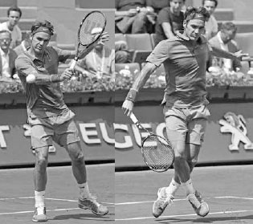
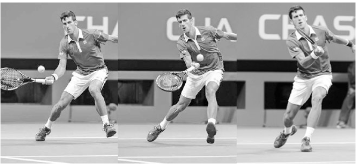
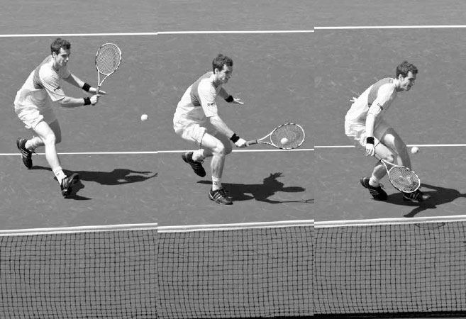
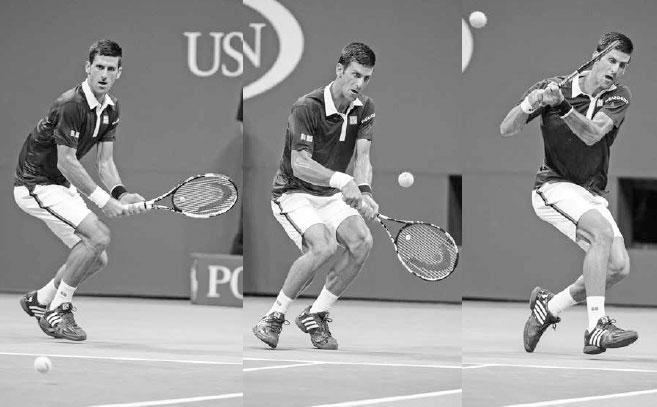
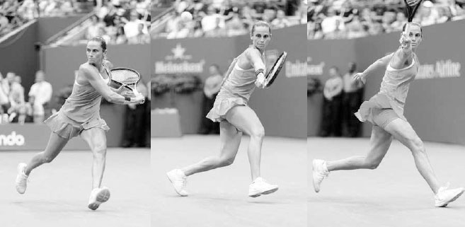

# Đánh bóng nhỏ và bóng bổng

Nhược điểm của cú bỏ nhỏ và cú tạt bóng bổng là nếu không thực hiện tốt hoặc thực hiện sai thời điểm, bạn rất có thể sẽ mất điểm. Vì vậy, chúng có thể khiến bạn trông thật xuất sắc hoặc thật vụng về. Những lời khuyên dưới đây sẽ giúp bạn nghiêng về phía tích cực trong \"sổ sách\" của cú bỏ nhỏ và cú tạt bóng bổng, để hai cú đánh này trở thành một phần quan trọng và thành công trong lối chơi của bạn.

**I. Cú Bỏ Nhỏ**
----------------

CÚ BỎ NHỎ LÀ MỘT CÚ ĐÁNH NHẸ đáp gần lưới và nảy thấp. Mục tiêu của cú bỏ nhỏ là khiến bóng nảy hai lần trước khi đối phương chạm tới, hoặc nếu đối phương đuổi kịp bóng, khiến họ mất thăng bằng và dễ bị tổn thương trước một cú passing shot hoặc cú tạt bóng bổng.

Sử dụng cú bỏ nhỏ thường xuyên có thể bào mòn đối phương cả về thể chất lẫn tinh thần. Nếu bạn thấy đối phương thở dốc sau một pha đôi công căng thẳng hoặc bắt đầu bực bội, hãy tìm cơ hội dùng cú bỏ nhỏ. Đây là cú đánh vừa có thể khai thác khả năng di chuyển và cảm xúc của đối phương, vừa có thể được dùng một cách chiến thuật để kéo những người chơi phòng thủ cuối sân ra khỏi vùng an toàn và lên gần lưới.

### **1. KỸ THUẬT**

Cú vung của cú bỏ nhỏ tương tự các cú đánh nền cắt về việc sử dụng cách cầm continental và vị trí thân người. Giống các cú đánh nền cắt, nó có thể được đánh ở bất kỳ tư thế nào, dù tư thế trung lập hoặc đóng phát huy tốt nhất, đặc biệt nếu bạn đang di chuyển về phía trước để thực hiện cú bỏ nhỏ (như thường lệ). Tuy nhiên, có những khác biệt về kỹ thuật: vung vợt ra sau và kết thúc động tác ngắn hơn, cú vung về phía trước hướng xuống nhiều hơn, mặt vợt mở nhiều hơn, và bước tiến ít quyết liệt hơn (hình trái).

*Dùng một bước tiến nhẹ và cú vung ngắn, hướng xuống, Federer thực hiện cú bỏ nhỏ này với độ xoáy nặng.*

Để thực hiện cú bỏ nhỏ, hãy bắt đầu bằng cách đặt vợt phía trên bóng với mặt vợt mở, sau đó đưa vợt về phía trước và \"khắc\" xuống bên dưới bóng (hình đối diện). Điều này sẽ khiến bóng xoáy ngược và dừng lại nhanh chóng. Sau khi tiếp xúc, kết thúc động tác với mặt vợt tiếp tục mở ra và tụt xuống dưới cổ tay.

  -------------------------------------------------------------------------------------------------------------------------------------------------------------------------------------------------------------------------------------------------------------------------------------------------------------------------------------------------------------------------------------------------------------------------------------------------------------------------------------------------------------------------------------------------------------------------------------------------------------------------------------------------------------------------------------------------------------------------------------------------------------------------------------------------------------------------------------------------------------------------------------------------------------------------------------------------------------------------------------------------------------------------------------------------------------------------------------------------------------------------------------------------------------------------------
  **HỘP HUẤN LUYỆN VIÊN:**
  **Có phần nghịch lý, dù quần vợt đã trở thành một môn thể thao mạnh mẽ hơn, cú bỏ nhỏ lại trở thành một cú đánh quan trọng hơn vì ba lý do. Thứ nhất, người chơi ngày càng đứng xa hơn về phía sau vạch cuối sân để phòng thủ trước tốc độ ngày càng tăng của các cú đánh nền hiện đại, tạo thêm cơ hội để dùng phần ngắn của sân cho một cú bỏ nhỏ hiệu quả. Thứ hai, vì người chơi hiện di chuyển ngang rất nhanh để bao quát những cú bóng rộng ở cuối sân, phần ngắn của sân đã trở thành khu vực hấp dẫn hơn để tìm lợi thế trong pha đôi công. Thứ ba, sử dụng cú bỏ nhỏ thường xuyên có thể thay đổi vị trí đứng sân của đối phương và giảm khả năng bao quát sân của họ --- một yếu tố quan trọng khi đối đầu với người chơi hiện đại tốc độ cao. Như Federer, người dùng cú bỏ nhỏ thường xuyên hơn ở giai đoạn sau sự nghiệp, từng nói: \"Tôi nhận ra rất khó để đánh xuyên qua các đối thủ hết lần này đến lần khác, vì họ đuổi được mọi quả bóng. Có lẽ nếu dùng cú bỏ nhỏ nhiều hơn, họ sẽ phải chơi gần vạch cuối sân hơn; khi đó sẽ dễ đánh xuyên qua họ hơn.\"(1) Djokovic thực hiện cú bỏ nhỏ bằng cách xoay đầu vợt xuống và trượt dây vợt bên dưới bóng.**
  -------------------------------------------------------------------------------------------------------------------------------------------------------------------------------------------------------------------------------------------------------------------------------------------------------------------------------------------------------------------------------------------------------------------------------------------------------------------------------------------------------------------------------------------------------------------------------------------------------------------------------------------------------------------------------------------------------------------------------------------------------------------------------------------------------------------------------------------------------------------------------------------------------------------------------------------------------------------------------------------------------------------------------------------------------------------------------------------------------------------------------------------------------------------------------

### **2. NGỤY TRANG**

Cần nhớ rằng sự đánh lừa là một thành phần quan trọng của cú bỏ nhỏ. Bạn càng đánh lừa được đối phương và trì hoãn khả năng phán đoán của họ, cú bỏ nhỏ của bạn càng thành công. Người chơi trình độ cao thường ngụy trang cú bỏ nhỏ bằng cách vào đà như thể sắp đánh một cú dứt điểm mạnh, rồi nhanh chóng đổi cách cầm vợt để thực hiện cú bỏ nhỏ. Người chơi nghiệp dư có thể không che giấu được cú bỏ nhỏ tinh vi đến vậy, nhưng bất kỳ mẹo nào khiến cú bỏ nhỏ khó đoán hơn đều nên được áp dụng. Để duy trì yếu tố bất ngờ, cũng quan trọng không nên lạm dụng cú bỏ nhỏ; hãy dùng nó thưa thớt và vào lúc đối phương ít ngờ tới nhất.

  -------------------------------------------------------------------------------------------------------------------------------------------------------------------------------------------------------------------------------------------------------------------------------------------------------------------------------------------------------------------------------------------------------------------------------------------------------
  **HỘP HUẤN LUYỆN VIÊN:**
  **Để học cú bỏ nhỏ, đôi khi tôi yêu cầu học trò chơi trò \"Bắt Và Thả.\" Với bạn và đối tác tập luyện đứng ở hai vạch cuối sân đối diện, để đối tác đánh một quả bóng cho bạn. Dùng kỹ thuật bỏ nhỏ, chạm nhẹ bóng trên không cách bạn khoảng một mét (bắt), để bóng nảy, rồi trả bóng lại cho đối tác (thả), người này cũng làm tương tự. Trò chơi này giúp người chơi học được \"cảm giác\" đánh bóng ở khoảng cách ngắn cần thiết cho cú bỏ nhỏ.**
  -------------------------------------------------------------------------------------------------------------------------------------------------------------------------------------------------------------------------------------------------------------------------------------------------------------------------------------------------------------------------------------------------------------------------------------------------------

### **3. QUỸ ĐẠO BÓNG VÀ CÁCH PHẢN ỨNG**

Quỹ đạo của cú bỏ nhỏ sẽ thay đổi tùy theo độ cao đánh bóng, nhưng hầu hết các cú bỏ nhỏ nên bay lên một chút ban đầu trước khi hạ xuống khi bóng qua lưới. Quỹ đạo cao hơn giúp bóng có cơ hội dừng lại tốt hơn nhờ xoáy ngược, và độ vượt lưới lớn hơn khiến đây trở thành một cú đánh có tỷ lệ thành công cao hơn. Nếu bạn đã thực hiện một cú bỏ nhỏ tốt, hãy di chuyển lên phía trước vì cú trả bóng của đối phương nhiều khả năng sẽ ngắn. Nếu họ đẩy bóng bật lên cao, bạn sẽ ở vị trí thuận lợi để kết thúc điểm bóng nhanh chóng bằng một cú vô lê. Tuy nhiên, nếu cú bỏ nhỏ của bạn không tốt, hãy lùi lại và sẵn sàng chạy đua để phòng thủ điểm bóng.

### **4. KHI NÀO NÊN BỎ NHỎ**

Chọn đúng thời điểm để thực hiện cú bỏ nhỏ là yếu tố then chốt quyết định khả năng thành công. Những điều cần cân nhắc khi quyết định có nên thực hiện cú bỏ nhỏ hay không bao gồm:

### **A. ĐỘ CAO CỦA BÓNG**

Cú bỏ nhỏ tốt nhất nên thực hiện khi bạn nhận một quả bóng cao ngang eo đến ngực. Rất khó kiểm soát cú bỏ nhỏ với bóng cao hơn hoặc thấp hơn mức này. Ngoài ra, vì thời gian và sự ngụy trang là những yếu tố quan trọng, bạn nên đánh cú bỏ nhỏ khi bóng đang lên hoặc ở đỉnh điểm, thay vì khi bóng đang xuống. Nếu bạn đánh bóng khi nó đang đi xuống, bạn sẽ cho đối phương nhiều thời gian phản ứng hơn và giảm khả năng ngụy trang cú đánh.

*Murray thực hiện cú bỏ nhỏ này với sự cân bằng, độ cao bóng, và vị trí đứng sân được khuyến nghị.*

### **B. THĂNG BẰNG VÀ THỜI GIAN**

Cú bỏ nhỏ là một cú đánh đòi hỏi kỹ thuật cao và cần một mức độ cân bằng và thời gian hợp lý để thực hiện tốt. Vì vậy, hãy tránh thực hiện cú bỏ nhỏ khi bạn mất thăng bằng hoặc nhận một quả bóng nhanh.

**C. VỊ TRÍ ĐỨNG SÂN**
----------------------

Nhìn chung, tốt nhất nên thực hiện cú bỏ nhỏ khi đứng ở khoảng vạch giao bóng hoặc gần lưới hơn. Nếu bạn thực hiện cú bỏ nhỏ từ sâu trong sân, đối phương sẽ có nhiều thời gian hơn để đuổi kịp bóng.

### **D. MẶT SÂN**

Trên các mặt sân mềm hơn, như sân đất nện, các cú đánh cắt nảy thấp hơn và phản ứng nhiều hơn với xoáy ngược --- điều kiện thuận lợi cho cú bỏ nhỏ. Ngược lại, trên các mặt sân cứng hơn, cú bỏ nhỏ nảy cao hơn và bám mặt sân ít hơn, khiến việc thực hiện một cú bỏ nhỏ hiệu quả khó khăn hơn.

**II. Cú Tạt Bóng Bổng**
------------------------

CÚ TẠT BÓNG BỔNG LÀ CÚ ĐÁNH đưa bóng sâu và cao trong sân. Một cú tạt bóng bổng sâu sẽ buộc đối phương phải đánh một cú giao bóng cao (overhead) trong tư thế mất cân bằng, hoặc tốt hơn nữa, để bóng nảy, cho phép bạn giành quyền kiểm soát điểm bóng. Ngoài việc khiến đối phương gặp khó khăn với cú giao bóng cao hoặc phải chạy đua đuổi bóng, một cú tạt bóng bổng tốt còn mang lại lợi thế chiến thuật. Nó có thể khiến đối phương đứng lưới kém quyết liệt hơn. Nếu đối phương lo ngại phải phòng thủ trước cú tạt bóng bổng của bạn, họ có thể lùi vị trí đứng lưới sâu hơn, từ đó giảm góc vô lê của họ, tăng thời gian bạn có để phản ứng với cú đánh của họ, và buộc họ phải thực hiện nhiều cú vô lê thấp, khó khăn hơn.

Có hai loại cú tạt bóng bổng: phòng thủ và tấn công.

*Ngụy trang cú tạt bóng bổng là điều quan trọng. Nếu bạn đang đối đầu Djokovic, liệu bạn có thể nhận ra một cú tạt bóng bổng sắp đến ngay tại thời điểm khung hình đầu tiên?*

### **1. CÚ TẠT BÓNG BỔNG PHÒNG THỦ**

Cú tạt bóng bổng thường được dùng trong các tình huống phòng thủ khi bạn đang chạy đua đuổi bóng hoặc không thể lấy lại thăng bằng để chuẩn bị cho một cú đánh nền tấn công. Cú tạt bóng bổng phòng thủ có thể được đánh với một cú vung ngắn và do đó không cần nhiều thời gian thực hiện nếu bạn bị dồn ép hoặc chịu áp lực.

Cách thực hiện cú tạt bóng bổng phòng thủ tương tự một cú đánh nền cắt, ngoại trừ mặt vợt mở nhiều hơn và cú vung ngắn hơn với mặt phẳng hướng lên nhiều hơn (hình dưới). Độ cao cần thiết cho một cú tạt bóng bổng phụ thuộc vào tình huống. Nếu bạn bị kéo ra xa ngoài sân, bạn có thể thử đánh cú tạt bóng bổng rất cao để tranh thủ thêm thời gian hồi vị (hình dưới). Nếu bạn đang ở vị trí tốt, cú tạt bóng bổng của bạn có thể thấp hơn. Khi thực hiện một cú tạt bóng bổng phòng thủ, bóng nên đạt đỉnh điểm ngay phía trên vạch giao bóng của đối phương. Nhiều người chơi tập trung tạt bóng bổng qua đầu người đứng lưới, khiến điểm cao nhất của cú tạt bóng bổng rơi vào giữa ô giao bóng, tạo ra một cú giao bóng cao thoải mái cho đối phương. Thay vào đó, nếu cú tạt bóng bổng đạt điểm cao nhất ngay trên vạch giao bóng, bạn sẽ buộc đối phương phải lùi bước vào một tình huống phòng thủ. Ngoài ra, hãy cố gắng nhắm cú tạt bóng bổng phòng thủ về phía bên trái tay của đối phương vì cú giao bóng cao trái tay là một cú đánh rất khó.

### **2. CÚ TẠT BÓNG BỔNG TẤN CÔNG**

Nếu bạn có nhiều thời gian chuẩn bị hơn, cú tạt bóng bổng cũng có thể được dùng để tấn công và đánh với xoáy lên, nhờ đó khi bóng vượt qua đối phương ở lưới, nó sẽ nảy vọt về phía hàng rào sau sân sau khi chạm đất, tạo thành một cú đánh ăn điểm. Mục tiêu của bạn với cú tạt bóng bổng xoáy lên là thắng điểm trực tiếp, nhưng nếu nó rơi ngắn hơn, quỹ đạo cắm xuống của nó có thể khiến đó là một cú giao bóng cao khó khăn cho đối phương.

*Roberta Vinci mở mặt vợt và đánh một cú tạt bóng bổng cao để tranh thủ thời gian hồi vị.*

Cú tạt bóng bổng xoáy lên đòi hỏi một động tác nâng và xoay đầu vợt lên trên dứt khoát.

Vung vợt ra sau trên cú tạt bóng bổng xoáy lên trông tương tự một cú đánh nền thông thường, khiến đây là một cú đánh có thể được ngụy trang tốt để đánh lừa đối phương. Sau khi vung vợt ra sau, đầu vợt hạ xuống thấp hơn nhiều so với bóng (hình đối diện, trên trái) rồi thực hiện một động tác nâng gần như thẳng đứng để tạo độ xoáy và độ cao cần thiết (hình đối diện, trên phải). Động tác nâng dứt khoát này của vợt khiến trọng lượng cơ thể bạn phân bổ đều hơn trong lúc vung vợt, và điểm tiếp xúc ít về phía trước thân người hơn so với một cú đánh nền thông thường. Động tác kết thúc bằng một cú kết thúc động tác ngắn hơn, thường dừng lại ở cùng phía thân người nơi tiếp xúc bóng diễn ra.

**III. Bài Tập Bỏ Nhỏ Và Tạt Bóng Bổng**
----------------------------------------

### **1. ĐÔI CÔNG VÀ BỎ NHỎ**

Mục tiêu: Học cách thực hiện cú bỏ nhỏ đúng thời điểm trong một pha đôi công.

Vẽ hoặc đánh dấu một đường cách vạch cuối sân khoảng 2 đến 2,5 mét, kéo dài qua cả hai bên sân. Với bạn và đối tác tập luyện đứng ở hai vạch cuối sân đối diện, bắt đầu điểm bóng bằng một cú đưa bóng thuận tay rồi đôi công. Cả hai người chơi đều có thể thực hiện cú bỏ nhỏ để ghi thêm điểm, nhưng chỉ khi đứng phía trước đường đã vẽ. Điểm bóng kết thúc ngay khi một cú bỏ nhỏ được thực hiện. Nếu cú bỏ nhỏ của một người chơi nảy hai lần trước vạch giao bóng, người đó ghi hai điểm (hoặc ba điểm nếu nảy ba lần). Nếu cú bỏ nhỏ bị lỗi hoặc chỉ nảy một lần trước vạch giao bóng, người kia ghi hai điểm. Người đầu tiên đạt 21 điểm thắng ván.

### **2. QUẦN VỢT THU NHỎ**

Mục tiêu: Phát triển khả năng kiểm soát bóng tốt cần thiết cho những cú bỏ nhỏ chính xác.

Dùng vạch giao bóng làm vạch cuối sân, bắt đầu bằng một cú thuận tay cho đối tác tập luyện rồi chơi hết điểm bóng. Tất cả các cú đánh phải được thực hiện bằng cú cắt và sau khi bóng nảy. Người đầu tiên đạt 15 điểm thắng ván.

Biến thể: Thu nhỏ sân xuống còn một ô giao bóng cho mỗi người chơi thay vì hai, hoặc cho phép mỗi người chơi một hoặc hai cú vô lê mỗi điểm bóng.

### **3. TẠT BÓNG BỔNG VÀ GIAO BÓNG CAO**

Mục tiêu: Cải thiện cú tạt bóng bổng và cú giao bóng cao.

Bắt đầu trò chơi ở vạch giao bóng với đối tác tập luyện của bạn ở vạch cuối sân. Dùng nửa sân để đánh chéo sân hoặc dọc dây, đối tác của bạn bắt đầu điểm bóng bằng một cú tạt bóng bổng. Sau đó, chơi hết điểm bóng. Người đầu tiên đạt 15 điểm thắng ván rồi đổi vai trò.

Biến thể: Để người đứng lưới đứng ở các vị trí khác nhau khi bắt đầu điểm bóng, hoặc yêu cầu người đứng cuối sân tạt bóng bổng cứ mỗi cú đánh khác.

### **4. ĐÔI CÔNG, ĐÔI CÔNG, TẠT BÓNG BỔNG**

Mục tiêu: Cải thiện các cú đánh nền tấn công để giành quyền kiểm soát điểm bóng sau cú tạt bóng bổng.

Bắt đầu trò chơi ở vạch giao bóng với đối tác tập luyện của bạn ở vạch cuối sân. Dùng nửa sân để đánh chéo sân hoặc dọc dây, bắt đầu điểm bóng bằng cách đưa bóng cho đối tác tập luyện, người này phải đánh mạnh hai cú đầu tiên và tạt bóng bổng ở cú thứ ba. Điểm bóng chỉ bắt đầu tính sau khi cú tạt bóng bổng được thực hiện. Sau khi bạn thực hiện cú giao bóng cao đáp trả cú tạt bóng bổng, toàn bộ sân đơn sẽ được sử dụng cho cả hai người chơi. Nếu đối tác tập luyện của bạn đánh một cú ăn điểm hoặc không thể trả được từ cú giao bóng cao của bạn, họ ghi hai điểm. Người đầu tiên đạt 15 điểm thắng ván, sau đó đổi vai trò.

*Chất lượng của cú đánh tiếp cận này của Andy Roddick sẽ phần lớn quyết định mức độ thành công của anh khi lên lưới.*
