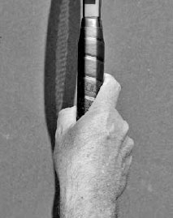

# Các kiểu cầm vợt

Cách cầm vợt là nền tảng của mọi cú vung vợt trong tennis, hay như huyền thoại Rod Laver từng nói: "Cách cầm vợt quyết định tất cả."(1) Cách cầm vợt của bạn sẽ ảnh hưởng đến tốc độ và độ xoáy của mỗi cú đánh. Một số cách cầm vợt giúp bạn dễ dàng nghiêng mặt vợt xuống, hay còn gọi là "đóng," điều này hữu ích để tạo topspin cho các cú đánh chạm đất mạnh mẽ. Những cách cầm vợt khác lại giúp bạn dễ dàng nghiêng mặt vợt lên, hay còn gọi là "mở," điều này hữu ích để tạo độ xoáy ngược và kiểm soát các cú vô lê cũng như các cú đánh tinh tế. Cách cầm vợt của bạn cũng ảnh hưởng đến vị trí bạn tiếp xúc với bóng, và do đó, ảnh hưởng đến tư thế cơ thể cùng thời điểm vung vợt của bạn.

Ở một số cú đánh, như cú giao bóng, phạm vi biến đổi trong cách cầm vợt là rất hẹp. Ở những cú đánh khác, như cú thuận tay xoáy lên chạm đất, các tay vợt có phạm vi lựa chọn cách cầm vợt rộng hơn, mỗi cách đều có ưu và nhược điểm riêng. Ví dụ, Roger Federer và Novak Djokovic đều có những cú thuận tay tuyệt vời, nhưng mỗi người lại sử dụng một cách cầm vợt thuận tay khác nhau (ảnh trang đối diện).

**I. Độ Chặt Của Tay Cầm**
--------------------------

Trước khi bàn về cách đặt tay lên cán vợt, điều quan trọng cần nhấn mạnh là cầm vợt quá chặt sẽ ảnh hưởng xấu đến lối chơi của bạn. Cách cầm vợt của bạn nên chắc chắn nhưng không siết chặt. Khả năng kiểm soát vợt chủ yếu đến từ lòng bàn tay, chứ không phải từ lực siết quá mức của các ngón tay.

Đây là một sự khác biệt tinh tế nhưng quan trọng.

Nếu khi đánh bóng bạn cảm nhận được cẳng tay của mình thay vì đầu vợt, nghĩa là bạn đang cầm vợt quá chặt và đang đánh mất tốc độ vợt, "cảm giác bóng" (độ nhạy cảm với bóng trên dây vợt), và sự phối hợp động tác. Cầm vợt hơi thả lỏng sẽ mang lại hiệu quả ngược lại. Hãy cùng tìm hiểu độ chặt của tay cầm ảnh hưởng thế nào đến sức mạnh, cảm giác bóng, và sự phối hợp động tác.

### **1. SỨC MẠNH**

Một ngộ nhận phổ biến trong tennis là đánh đồng việc căng cơ với sức mạnh, vì điều này thường đúng trong các hoạt động thể chất khác. Nếu bạn muốn nâng một vật nặng, bạn sẽ căng cơ và nâng lên. Tuy nhiên, tennis --- nơi một quả bóng nặng khoảng 57 gram được đánh bởi một cây vợt dài khoảng 68,5 cm đang vung --- lại liên quan đến một nguyên lý vật lý hoàn toàn khác.

Công thức tính động năng là KE = ½ mv² (động năng bằng một nửa khối lượng nhân với bình phương vận tốc). Do đó, việc tăng gấp đôi vận tốc (tốc độ vợt) sẽ có tác động lớn hơn nhiều đến năng lượng truyền vào bóng so với việc tăng gấp đôi khối lượng. Đây là lý do vì sao một vận động viên trẻ nhỏ tuổi có thể đánh bóng mạnh hơn một số người lớn có cơ bắp vạm vỡ. Mục tiêu là vung vợt với tốc độ nhanh, điều mà có thể thực hiện tốt hơn với một cánh tay thả lỏng. Ngoài ra, ở nhiều cú đánh, đặc biệt là cú giao bóng và các cú chạm đất xoáy lên, đầu vợt nên hơi trễ lại so với chuyển động của cơ thể, từ đó tạo ra một hiệu ứng "ná bắn" mạnh mẽ để tăng thêm tốc độ đầu vợt. Điều này chỉ có thể thực hiện tốt khi các cơ được thả lỏng.

### **2. CẢM GIÁC BÓNG**

Cách cơ thể chúng ta được thiết kế khiến cho giác quan xúc giác trở nên nhạy bén hơn khi các cơ được thả lỏng hơn. Một bác sĩ phẫu thuật, một nghệ sĩ dương cầm hòa nhạc, một xạ thủ thiện xạ --- những nghề nghiệp đòi hỏi kỹ năng vận động tinh vi --- đều sẽ nói với bạn rằng để thực hiện tốt, họ cần các cơ của mình hơi thả lỏng. Tennis là một môn thể thao đòi hỏi kỹ năng vận động tinh vi, và việc không căng thẳng sẽ cải thiện cảm giác bóng của bạn trên dây vợt.

### **3. SỰ PHỐI HỢP ĐỘNG TÁC**

Khi các cơ của chúng ta căng cứng, sự phối hợp động tác sẽ bị ảnh hưởng xấu, dẫn đến việc canh thời điểm kém và đánh hỏng bóng nhiều hơn.

Hãy nhớ rằng, bạn sẽ siết tay cầm ở các mức độ khác nhau khi tiếp xúc bóng, tùy thuộc vào cú đánh được thực hiện. Ở một cú vô lê mạnh, bạn siết chặt hơn so với các cú đánh tinh tế. Bất kể là cú đánh nào, tay cầm nên được thả lỏng trong giai đoạn chuẩn bị để các cơ của bạn hoạt động tốt nhất.

  ------------------------------------------------------------------------------------------------------------------------------------------------------------------------------------------------------------------------------------------------------------------------------
  **HỘP HUẤN LUYỆN VIÊN:**
  **Hãy thử lăn một quả bóng quanh viền đầu vợt trong khi siết chặt tay cầm. Sau đó thực hiện lại trong khi thả lỏng ngón cái và ngón trỏ. Bạn sẽ nhận thấy cảm giác bóng và sự phối hợp động tác của mình được cải thiện như thế nào khi bàn tay ở trạng thái thả lỏng hơn.**
  ------------------------------------------------------------------------------------------------------------------------------------------------------------------------------------------------------------------------------------------------------------------------------

**II. Các Kiểu Cầm Vợt**
------------------------

Tay cầm vợt tennis có hình bát giác với bốn mặt chính và bốn mặt vát hẹp hơn nằm giữa bốn mặt chính đó. Tôi nhận thấy cách đơn giản nhất để giải thích cách xác định các kiểu cầm vợt khác nhau là đánh số cho từng mặt trong tám mặt của cán vợt (ảnh dưới).

Tôi sẽ dùng các số nguyên để mô tả vị trí đặt khớp gốc ngón trỏ cho hầu hết các kiểu cầm vợt, nhưng bạn vẫn có thể linh hoạt cộng hoặc trừ nửa mặt vát để tìm ra cách cầm thoải mái nhất cho mình.

Di chuyển khớp ngón tay lên hoặc xuống nửa mặt vát so với mặt vát gốc sẽ làm cho cách cầm đó trở nên "mạnh" hơn hoặc "yếu" hơn tương ứng. Với mọi kiểu cầm vợt, hãy cầm vợt ở phần thấp của cán vợt và sắp xếp các ngón tay sao cho ngón trỏ nằm phía trên ngón cái.

Các mặt vát của tay cầm

### **1. CÁCH CẦM CONTINENTAL**

Bạn có thể tìm cách cầm continental bằng cách đặt khớp gốc ngón trỏ lên mặt vát số 2. Cách cầm continental rất linh hoạt và được sử dụng cho cú giao bóng, cú vô lê, cú chạm đất cắt bóng, các cú đánh tinh tế, và khi phòng thủ những quả bóng thấp và rộng sân.

*Stan Wawrinka sử dụng cách cầm continental cho cú trái tay cắt bóng của mình.*

Cách cầm continental được sử dụng cho cú giao bóng vì nó cho phép cổ tay của bạn sấp và tăng tốc vợt tốt nhất. Nó cũng giúp bạn tối đa hóa độ cao tiếp xúc bóng, thực hiện một pha vung vợt đầy đủ, và tạo ra những cú giao bóng xoáy nặng. Bằng cách sử dụng cách cầm continental cho các cú vô lê, nơi lối chơi ở lưới diễn ra rất nhanh, bạn có thể thực hiện cả cú vô lê thuận tay lẫn trái tay mà không cần đổi cách cầm. Ở các cú chạm đất cắt bóng (ảnh trên) và các cú đánh tinh tế như cú bỏ nhỏ và cú tạt bóng bổng, cách cầm continental làm tăng khả năng đặt bóng chính xác bằng cách cho phép bạn dễ dàng mở mặt vợt và "ôm" lấy bóng trên dây vợt để kiểm soát tốt hơn. Cuối cùng, cách mặt vợt tự nhiên được mở ra khi cầm continental khiến đây là cách cầm ưu tiên cho những quả bóng thấp, và điểm tiếp xúc muộn hơn của nó có thể giúp bạn khi bị dồn ép phải với một cú bóng rộng sân.

Vì cách cầm continental được sử dụng cho rất nhiều cú đánh, việc thành thạo nó là điều thiết yếu. Nếu bạn chưa quen với cách cầm continental, hãy cam kết thực hiện các bài tập ở cuối chương này, bởi vì việc không quen thuộc với cách cầm này có thể ảnh hưởng xấu đến hiệu suất của bạn ở nhiều cú đánh.

Cách Cầm Continental Cách Cầm Thuận Tay Eastern Cách Cầm Trái Tay Eastern Cách Cầm Thuận Tay Semi-Western Cách Cầm Thuận Tay Western Cách Cầm Trái Tay Hai Tay

### **2. CÁC CÁCH CẦM VỢT CHO CÚ CHẠM ĐẤT XOÁY LÊN**

Có ba cách cầm thuận tay xoáy lên (eastern, semi-western, và western) và ba cách cầm trái tay xoáy lên (eastern, semi-western, và hai tay), tất cả đều có ưu và nhược điểm riêng. Hãy dành thời gian trên sân tập để tìm ra cách cầm thuận tay và trái tay phù hợp nhất với bạn.

### **A. CÁCH CẦM EASTERN**

Cách cầm thuận tay eastern (mặt vát số 3) và cách cầm trái tay eastern (mặt vát số 1) cho phép bạn miết lên phía sau bóng để tạo topspin, hoặc dễ dàng đánh phẳng cú chạm đất của mình khi muốn tấn công mạnh hơn. Cách cầm thuận tay eastern đặt lòng bàn tay cùng góc với mặt dây vợt, khiến đây là cách cầm phù hợp cho các tay vợt nghiệp dư hơn so với các cách cầm western "đóng" hơn. Các cách cầm eastern cũng tốt cho những tay vợt thường lên lưới; vì sự thay đổi từ cách cầm eastern sang continental là nhỏ, việc vô lê sẽ dễ dàng hơn đối với những tay vợt này so với những người cần thay đổi cách cầm nhiều hơn. Nhược điểm của các cách cầm eastern là những quả bóng nảy cao sẽ khó trả hơn, và các cú chạm đất có thể kém ổn định hơn vì lượng topspin tạo ra ít hơn so với các cách cầm western.

*Việc Serena Williams sử dụng cách cầm semi-western cho phép cô dễ dàng chuyển đổi giữa việc đánh cú thuận tay phẳng hoặc với topspin nặng.*

### **B. CÁCH CẦM SEMI-WESTERN**

Nhiều người xem cách cầm thuận tay semi-western (mặt vát số 3,5 - 4) là cách cầm thuận tay xoáy lên lý tưởng nhất, và đây cũng là cách cầm được các tay vợt chuyên nghiệp ngày nay sử dụng nhiều nhất. Cách cầm trái tay semi-western (mặt vát số 8) chỉ dành cho những tay vợt đánh trái tay một tay. Mặc dù các cách cầm semi-western tạo thêm topspin cho cú đánh nhiều hơn so với cách cầm eastern, chúng vẫn cho phép mặt vợt đánh bóng với ít topspin hơn khi một cú đánh phẳng hơn, nhanh hơn là lựa chọn chiến thuật hợp lý. Đây cũng là cách cầm thoải mái cho một phạm vi rộng các độ cao tiếp xúc bóng, đặc biệt là với những quả bóng nảy cao phổ biến trong kỷ nguyên hiện đại.

**C. CÁCH CẦM THUẬN TAY WESTERN**
---------------------------------

Cách cầm thuận tay western (mặt vát số 4 - 4,5) là cách cầm khiến mặt vợt "đóng" nhiều nhất và tạo ra topspin lớn nhất. Đây là cách cầm thoải mái để sử dụng với những quả bóng được đánh ở độ cao trên ngực. Nhược điểm là đây là cách cầm khó khăn với những quả bóng nhanh, thấp, hoặc rộng sân, và khó khăn hơn khi muốn đánh những cú phẳng để ghi điểm trực tiếp.

### **D. CÁCH CẦM TRÁI TAY HAI TAY**

Cú trái tay hai tay là cách đánh trái tay phổ biến nhất ở các trình độ cao hơn của môn tennis. Ưu và nhược điểm của cú trái tay hai tay được bàn luận chi tiết ở Chương Tám. Có nhiều cách khác nhau để cầm vợt cho cú trái tay hai tay, nhưng tôi khuyến nghị cách cầm continental (mặt vát số 2) cho tay phải và cách cầm thuận tay eastern đến eastern mạnh (khớp gốc ngón trỏ tay trái ở mặt vát số 6 - 6,5) cho tay trái. Những cách cầm này cho phép cổ tay chuyển động tự do và tạo ra tốc độ đầu vợt tốt. Một số tay vợt thích cách cầm trái tay eastern cho tay phải, nhưng tôi khuyến nghị cách cầm continental vì nó dịch điểm tiếp xúc lùi lại một chút, cho phép thêm một khoảnh khắc quý giá để thực hiện cú đánh. Việc này cũng giúp dễ dàng ngụy trang một cú bỏ nhỏ hoặc thực hiện một cú trái tay cắt bóng thông thường vì không cần phải đổi cách cầm.

*Murray sử dụng cách cầm trái tay hai tay được hầu hết các tay vợt chuyên nghiệp ưa chuộng: cách cầm continental với tay phải và cách cầm eastern với tay trái.*

  -----------------------------------------------------------------------------------------------------------------------------------------------------------------------------------------------------------------------------------------------------------------------------------------------------------------------------------------------------------------------------------------------------------------------------------------------------------------------------------------------------------------------------------------------------------------------------------------------------------------------------------------------------------------------------------------------------------------------
  **HỘP HUẤN LUYỆN VIÊN:**
  **Trẻ nhỏ đôi khi bắt đầu sử dụng cách cầm western cho cú thuận tay vì nó cảm thấy thoải mái hơn với những quả bóng được đánh ở độ cao trên ngực, một tình huống mà các em thường gặp phải. Tuy nhiên, điều này có thể khiến các tay vợt nhỏ tuổi phát triển cơ chế cú đánh kém, khiến các em ngả người ra sau, gập khuỷu tay đánh bóng quá nhiều, và rút ngắn pha vung vợt. Mặc dù cách cầm eastern hay semi-western ban đầu có thể cảm thấy khó xử hơn với những quả bóng cao đối với các tay vợt nhỏ tuổi, việc sử dụng những cách cầm này sẽ giúp ích cho các em về lâu dài vì nó khuyến khích những pha vung vợt đầy đủ hơn. Nếu sau này các em tự nhiên chuyển sang cách cầm western, điều đó cũng không sao.**
  -----------------------------------------------------------------------------------------------------------------------------------------------------------------------------------------------------------------------------------------------------------------------------------------------------------------------------------------------------------------------------------------------------------------------------------------------------------------------------------------------------------------------------------------------------------------------------------------------------------------------------------------------------------------------------------------------------------------------

**III. Bài Tập Cầm Vợt**
------------------------

Học bất cứ điều gì mới, kể cả một cách cầm vợt mới, nên được thực hiện theo từng bước. Bạn không thể học đại số mà chưa học đếm số trước. Tương tự, trong tennis tốt nhất là nên bắt đầu từ những điều nhỏ rồi xây dựng dần lên. Nếu bạn đang học một cách cầm xoáy lên, hãy bắt đầu bằng cách đánh bóng từ vạch giao bóng và lùi dần về phía vạch cuối sân, mỗi lần khoảng 1 mét, khi bạn cảm thấy thoải mái hơn với nó. Việc học cách cầm continental cho cú chạm đất cắt bóng cũng có thể thực hiện theo cách tương tự. Do lực tác động mạnh của bóng khi đánh vô lê, tôi khuyến nghị bạn nên học cách cầm continental trước với bóng đã nảy từ vạch giao bóng, trước khi vô lê bóng ngay khi còn ở trên không. Học theo cách này cũng cho bạn thêm thời gian để xoay vai và hình thành thói quen định vị cơ thể tốt cho cú vô lê.

Chạm bóng.

### **1. BÀI TẬP CHẠM BÓNG**

Sử dụng cách cầm continental, đặt vợt trước mặt bạn ở góc 10 giờ và nảy bóng xuống từ độ cao ngang hông giống như một cầu thủ bóng rổ (ảnh trái). Bài tập chạm bóng này sẽ giúp bạn làm quen với cách cầm continental cho cú giao bóng. Tiếp theo, chạm bóng lên khoảng 60-90 cm trong không trung với lòng bàn tay ngửa lên và vợt ở góc 2 giờ, sau đó làm tương tự với lòng bàn tay úp xuống và vợt ở góc 9 giờ. Hai bài tập chạm bóng này sẽ giúp ích cho các cú vô lê thuận tay và trái tay của bạn.

### **2. TƯỜNG TẬP**

Đánh bóng vào tường mang lại sự lặp lại hữu ích, giúp bạn nhanh chóng làm quen với bất kỳ kiểu cầm vợt nào. Nếu đang luyện tập cách cầm continental, hãy đứng cách tường khoảng 3-4,5 mét và đánh những cú nhẹ nhàng, để bóng nảy trước khi bạn đánh. Việc luyện tập giao bóng với cách cầm continental cũng có thể thực hiện với tường tập. Nếu bạn đang học một cách cầm mới cho cú chạm đất xoáy lên, hãy đứng đủ xa tường để bóng nảy hai hoặc ba lần trước khi bạn đánh bóng. Điều này sẽ cho bạn thời gian để thực hiện một pha theo bóng đầy đủ.

**Thăng Bằng** "Mức độ thăng bằng của bạn sẽ ảnh hưởng đến nhiều khía cạnh trong lối chơi, bao gồm việc chiếm ưu thế trong pha bóng, sức mạnh cú đánh, khả năng kiểm soát vợt, tầm nhìn, và khả năng hồi phục vị trí."

**Chuỗi Động Học** "Năng lượng được tạo ra từ đôi chân được truyền lên và tăng dần qua cơ thể, đạt đỉnh điểm là một luồng sức mạnh bùng nổ ở điểm cuối."

**Di Chuyển** "Nói một cách đơn giản, tennis xoay quanh việc di chuyển, và mọi tay vợt nên nỗ lực để đảm bảo đây là một thế mạnh của mình."

**Cách Cầm Vợt** "Cách cầm vợt là nền tảng của mọi cú vung vợt trong tennis."

THĂNG BẰNG (Chương Một) là nền tảng cho khả năng kiểm soát cú đánh, CHUỖI ĐỘNG HỌC (Chương Hai) tăng cường sức mạnh cú đánh, DI CHUYỂN (Chương Ba) mang lại thời gian và vị trí để tạo thăng bằng và kích hoạt chuỗi động học, và CÁCH CẦM VỢT (Chương Bốn) không chỉ ảnh hưởng đến sức mạnh và khả năng kiểm soát cú đánh, mà còn cả độ xoáy và kỹ thuật. Giờ đây, khi các nguyên tắc vận động và cách cầm vợt trong tennis --- nền tảng của mọi cú đánh tuyệt vời --- đã được trình bày, đã đến lúc học các cú đánh, bắt đầu với cú đánh có thể nói là quan trọng nhất: cú giao bóng.

*Cú giao bóng uy lực của Pete Sampras là nền tảng cốt lõi trong lối chơi của anh.*
