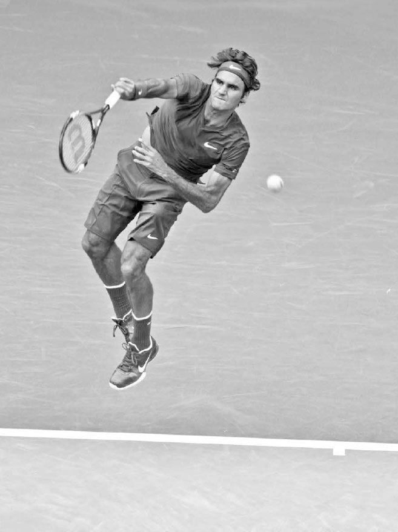

# Chuỗi động lực — Truyền lực từ chân đến vợt

Sự phối hợp và liên kết đáng kinh ngạc này chính là nền tảng của kỹ thuật giao bóng của Serena Williams, và cũng là nền tảng của tennis hiện đại: một chuyển động vặn người toàn thân được thiết kế để tạo ra một cú đánh mạnh mẽ. Nó được gọi là chuỗi động học. Chuỗi động học hình dung cơ thể như một hệ thống các mắt xích, trong đó năng lượng được tạo ra từ đôi chân được truyền lên và tăng dần qua cơ thể, lên đến đỉnh điểm là một luồng sức mạnh bùng nổ tại thời điểm bạn đánh bóng. Trong chương này, tôi sẽ giải thích những lợi ích của chuỗi động học, bao gồm việc cải thiện sức mạnh và độ ổn định của cú đánh, tiết kiệm năng lượng, và giảm nguy cơ chấn thương. Sau đó tôi sẽ hướng dẫn bạn cách tối ưu hóa chuỗi động học, và kết thúc chương với các bài tập được thiết kế để tăng cường sức mạnh chuỗi động học của bạn.

Vorsprung durch Technik \<\<Sự tiến bộ nhờ công nghệ\>\> --- Việc Federer sử dụng chuỗi động học một cách xuất sắc giúp anh bật cao khỏi mặt đất trong cú giao bóng này. Điều đó giúp anh tạo ra sức mạnh to lớn mà không cần gắng sức quá mức, và là một trong những yếu tố góp phần vào kỷ lục thi đấu liên tiếp 65 giải Grand Slam của anh.

**I. Lợi Ích Của Chuỗi Động Học**
---------------------------------

### **1. TĂNG CƯỜNG SỨC MẠNH CÚ ĐÁNH**

Mặc dù cánh tay và vai là nguồn chính tạo ra tốc độ vợt khi giao bóng, nhưng nếu bạn giao bóng chỉ bằng cách di chuyển cánh tay, bạn sẽ chỉ có một cú giao bóng tầm thường. Chính các nhóm cơ lớn ở chân và vùng bụng mới là lực đẩy chính, cung cấp sức mạnh cho cánh tay và tốc độ cho cây vợt.

Sức mạnh và độ cao tiếp xúc bóng cần thiết cho một cú giao bóng tốt bắt đầu từ việc đôi chân gập lại, duỗi thẳng, rồi đẩy lên từ mặt đất, tạo ra một phản lực từ mặt đất. Năng lượng ở chân sau đó di chuyển lên cơ thể và được tăng cường nhờ sự xoay của hông và vai. Năng lượng này, giờ đã nằm ở vai, được khuếch đại thêm nhờ chuyển động sấp của cẳng tay và cổ tay, giải phóng một luồng sức mạnh bắt đầu từ đôi chân của bạn ra đến cây vợt (ảnh đối diện).

Khái niệm tương tự cũng áp dụng cho các cú đánh chạm đất. Năng lượng ban đầu được tích lũy ở chân sẽ di chuyển lên cơ thể và đồng bộ với pha vung vợt về trước để tăng tốc độ đầu vợt và trọng lượng cho cú đánh. Trong tennis hiện đại, giao bóng và các cú đánh chạm đất là những cú đánh quyết định kết quả của phần lớn các điểm số. **Vì vậy, việc bạn có thể thực hiện tốt chuỗi động học là điều vô cùng quan trọng.**

  -----------------------------------------------------------------------------------------------------------------------------------------------------------------------------------------------------------------------------------------------------------------------------------------------------------------------------------------------------------------------------------------------------------------------------------------------------------------------------------------------------------------------------------------------------------------------------------------------------------------
  **HỘP HUẤN LUYỆN VIÊN:**
  **Giao bóng thực chất là một động tác ném. Để giúp học trò hiểu được tầm quan trọng của chuỗi động học trong cú giao bóng, tôi thường yêu cầu họ ném bóng theo bốn cách khác nhau: đầu tiên, đứng đối diện lưới và ném mà không di chuyển vai, giống động tác đẩy tạ; thứ hai, vẫn đối diện lưới nhưng lần này xoay vai trong khi ném; thứ ba, làm tương tự nhưng gập đầu gối và dùng lực từ chân; và cuối cùng, đứng ở tư thế nghiêng người và thực hiện động tác ném đầy đủ với một chút đà về phía trước. Với mỗi mắt xích của chuỗi động học được thêm vào, quả bóng sẽ được ném đi xa hơn và xa hơn nữa.**
  -----------------------------------------------------------------------------------------------------------------------------------------------------------------------------------------------------------------------------------------------------------------------------------------------------------------------------------------------------------------------------------------------------------------------------------------------------------------------------------------------------------------------------------------------------------------------------------------------------------------

### **2. CẢI THIỆN ĐỘ ỔN ĐỊNH**

Nếu bạn sử dụng chuỗi động học không đúng cách và chủ yếu dựa vào chuyển động của thân trên và cánh tay, bạn sẽ mất khả năng kiểm soát vợt và mắc nhiều lỗi hơn. Nếu cánh tay bạn di chuyển mạnh mà không có sự hỗ trợ từ phía dưới, bạn sẽ khó có thể giữ vợt cân bằng tốt tại thời điểm tiếp xúc bóng. Ngược lại, nếu bạn sử dụng chuỗi động học đúng cách, bạn không chỉ có thêm sức mạnh mà các cú đánh của bạn cũng sẽ trở nên ổn định hơn. Bằng cách tạo sức mạnh từ toàn bộ cơ thể, cánh tay và cổ tay của bạn có thể tập trung ít hơn vào việc tăng lực và tập trung nhiều hơn vào việc giữ vợt ổn định và xác lập góc dây vợt chính xác cần thiết để có một cú đánh ổn định.

### **3. TIẾT KIỆM NĂNG LƯỢNG VÀ GIẢM CHẤN THƯƠNG**

**Những tay vợt có chân và phần cơ lõi cứng nhắc thường phải gồng các cơ ở thân trên và thực hiện những chuyển động tay đầy gắng sức để cố gắng tăng tốc độ vợt. Việc lặp đi lặp lại kiểu vung vợt này không chỉ làm tăng sự mệt mỏi, mà còn gia tăng áp lực lên cơ và khớp, và theo thời gian, có thể gây tổn thương cho cánh tay và vai. Nếu bạn sử dụng chuỗi động học tốt, bạn sẽ giảm bớt áp lực lên cánh tay và vai. Cánh tay của bạn sẽ chỉ "đi theo" làn sóng năng lượng trào lên từ chân và phần cơ lõi, giúp sử dụng toàn bộ cơ thể một cách hiệu quả.**

**II. Làm Thế Nào Để Tối Ưu Hóa Chuỗi Động Học**
------------------------------------------------

**Lợi ích của chuỗi động học đã rõ ràng, vậy làm sao để tối đa hóa những lợi thế đó? Chuỗi động học hoạt động hiệu quả nhất khi được thực hiện đúng thời điểm, và khi bạn giữ được thăng bằng, chuẩn bị tốt, và có đủ sức mạnh cùng độ dẻo dai toàn thân.**

### **1. THỜI ĐIỂM CHÍNH XÁC**

Thời điểm và trình tự của chuỗi động học rất quan trọng. Chuỗi động học có một nhịp điệu: cơ thể hạ thấp xuống với cây vợt gần thân trong pha vung vợt ra sau, sau đó cơ thể nâng lên khi bạn thở ra và vung vợt ra xa khỏi thân trong pha vung vợt về trước. Việc khởi động chuỗi động học quá sớm hoặc quá muộn sẽ làm giảm hiệu quả của nó. Ví dụ, trong cú giao bóng, nếu vợt di chuyển về phía bóng trước khi chân bắt đầu duỗi thẳng, thì chuỗi động học đã sai thời điểm và sẽ không hoạt động đúng cách.

*Simona Halep thiết lập một nền tảng vững chắc trước khi đẩy người lên từ mặt đất và tiếp đất trong tư thế cân bằng.*

### **2. THĂNG BẰNG TỐT**

Bạn phải ở trạng thái cân bằng để đôi chân có thể đẩy lên hiệu quả từ mặt đất. Nếu tư thế của bạn không tốt hoặc nghiêng người sai cách trong khi vung vợt, đôi chân của bạn sẽ không thể bám chắc vào mặt sân (ảnh bên trái) để thiết lập nền tảng vững chắc cần thiết nhằm đẩy mạnh mẽ từ mặt đất (ảnh giữa). Nếu bạn đứng quá xa bóng khi đánh cú thuận tay, tư thế của bạn sẽ kém và đôi chân sẽ lê bước trong khi vung vợt, làm mất sức mạnh của bạn. Đây là một trong nhiều lý do khiến bước chân trở thành một yếu tố quan trọng của tennis. Bước chân tốt sẽ giúp bạn vào đúng vị trí để giữ thăng bằng, và chỉ khi có được sự cân bằng đó, sức mạnh từ chuỗi động học mới có thể được giải phóng.

### **3. CHUẨN BỊ SỚM**

Hãy cố gắng hết sức để thiết lập vị trí tốt càng sớm càng tốt. Điều này sẽ cho bạn đủ thời gian cần thiết để đẩy lực tốt bằng đôi chân. Bằng cách vào vị trí sớm và đặt chân vững vàng, bạn có thể tích trữ nhiều sức mạnh hơn ở chân trong pha vung vợt ra sau trước khi giải phóng nó lên trên trong pha vung vợt về trước. Nếu bạn bị gấp gáp và không có thời gian chuẩn bị đúng cách, bạn sẽ chủ yếu sử dụng các nhóm cơ tay nhỏ hơn, dẫn đến cú đánh có ít trọng lượng hơn.

### **4. SỨC MẠNH TOÀN THÂN**

Các tay vợt cần có sức mạnh thể chất trên toàn bộ cơ thể để thực hiện tốt chuỗi động học. Bạn có thể so sánh năng lượng của chuỗi động học với dòng nước chảy qua cơ thể. Nếu một bộ phận nào đó trong chuỗi bị yếu, nó sẽ tạo ra một con đập, và năng lượng được tạo ra trước mắt xích đó sẽ bị suy giảm. **Ví dụ, nếu một tay vợt có vùng bụng yếu, thì sức mạnh bắt đầu từ chân sẽ giảm dần khi đi qua thân trên trên đường lên đến vai.**

### **5. ĐỘ DẺO DAI VƯỢT TRỘI**

Bạn có thể tăng cường chuỗi động học của mình bằng cách dẻo dai hơn và sử dụng "chu trình co giãn cơ". Chu trình co giãn cơ hoạt động phần nào giống như một sợi dây thun, trong đó việc kéo giãn một cơ được theo sau ngay lập tức bởi một sự co lại mạnh mẽ hơn của chính cơ đó. Bạn càng dẻo dai, độ giãn càng lớn, và do đó, lượng năng lượng có thể tạo ra từ hiệu ứng này càng nhiều. **Ví dụ, ở cuối pha vung vợt ra sau của cú thuận tay, các cơ ngực và vai của bạn giãn ra khi hông xoay vào cú đánh, và quán tính của cánh tay khiến cây vợt bị trễ lại phía sau. Sự trễ lại này của vợt kéo giãn các cơ ngực và vai, tích trữ năng lượng, năng lượng này sẽ được giải phóng khi các cơ đó co lại, giúp vợt lao về phía trước nhanh hơn để đánh bóng.**

**III. Cơ Thể Bạn Nên Di Chuyển Bao Nhiêu?**
--------------------------------------------

TENNIS LÀ MỘT MÔN THỂ THAO NĂNG ĐỘNG, vì vậy điều hợp lý là lượng chuyển động cơ thể trong chuỗi động học nên và sẽ thay đổi tùy theo từng cú đánh. Chuỗi động học được sử dụng ở mọi cú giao bóng và cú đánh chạm đất mạnh, nhưng được sử dụng với mức độ khác nhau ở các cú đánh khác tùy thuộc vào tốc độ bóng đến và lực vung vợt của bạn. Bạn cần phản ứng linh hoạt theo tình huống và sử dụng lượng chuyển động cơ thể phù hợp trong cú đánh để đạt được không chỉ sức mạnh tối đa, mà còn sự kiểm soát tốt nhất.

Chuỗi động học quan trọng hơn khi bóng đến chậm, vì khi đó bạn cần tự tạo ra sức mạnh cho mình. Những cú thuận tay mạnh mẽ nhất khi đánh bóng chậm đến là những cú mà bạn có thể đặt chân vững, gập rồi duỗi thẳng chân, xoay bung hông và vai, rồi giải phóng vào cú đánh (trang sau, ảnh trên). Trên sân đất nện hoặc bất kỳ mặt sân chậm nào, nơi bạn thường xuyên phải tự tạo sức mạnh cho mình hơn, việc thực hiện một chuỗi động học đầy đủ và mạnh mẽ là yếu tố thiết yếu để đánh bóng tấn công.

Ngược lại, ở những cú đánh ít tấn công hơn --- như cú bỏ nhỏ và cú cắt bóng chạm đất --- bạn sẽ cần ít sức mạnh từ chuỗi động học hơn (ảnh dưới). Cơ thể sẽ đứng yên hơn trong những cú đánh này, hay còn gọi là "giữ thấp người" theo cách nói của huấn luyện viên. Ngoài ra, chuỗi động học cũng kém quan trọng hơn ở các cú vô lê hoặc khi đỡ những bóng nhanh, vì trong những cú đánh này, bản thân bóng đã có sẵn sức mạnh. Ví dụ, khi đỡ một cú giao bóng nhanh, năng lượng đã được tích trữ sẵn trong quả bóng đang bay tới, và không cần phải có chuyển động cơ thể theo trình tự mạnh mẽ; ngược lại, điều đó chỉ khiến việc canh thời điểm của cú đánh trở nên phức tạp không cần thiết. Đối với các tay vợt nghiệp dư, giữ thấp người là một nguyên tắc tốt cho cú đánh chạm đất vì nó đơn giản hóa việc canh thời điểm, và đây là một kỹ thuật phù hợp với tốc độ vung vợt của họ. Hãy nhớ rằng, việc giảm chuyển động cơ thể trong chuỗi động học này thường được thực hiện nhiều hơn trên sân cứng, nơi bóng nảy thấp và nhanh hơn so với sân đất nện.

*Djokovic sử dụng sức mạnh chuỗi động học mạnh mẽ khi thực hiện cú thuận tay xoáy lên đầy tấn công này từ một quả bóng chậm.*

Tuy nhiên, ở cú trái tay cắt bóng này, anh giữ cơ thể ổn định hơn và giảm bớt sức mạnh chuỗi động học.

**IV. Bài Tập Chuỗi Động Học**
------------------------------

Làm thế nào để xây dựng một chuỗi động học mạnh mẽ? Sức mạnh của chuỗi động học phần lớn đến từ việc xây dựng một vùng cơ lõi vững chắc --- phần giữa của cơ thể bao gồm cột sống, lưng, hông và bụng. Cơ lõi chính là chìa khóa cho một chuỗi động học mạnh mẽ; để tối đa hóa sức mạnh, luồng năng lượng của chuỗi động học phải đi qua vùng cơ lõi mà không bị suy giảm. Ngoài ra, giai đoạn xoay hông và vai của chuỗi động học cũng dựa vào một vùng cơ lõi vững chắc để hỗ trợ. Các tay vợt chuyên nghiệp hiểu rõ điều này và luyện tập chăm chỉ để tăng cường bộ phận này của cơ thể, thường sử dụng công cụ tập luyện cơ lõi ưa thích của họ: bóng tạ (medicine ball).

Các bài tập với bóng tạ giúp bạn luyện sử dụng cơ thể như một hệ thống thống nhất, do lực cần thiết để ném quả bóng có trọng lượng đi một cách bùng nổ. Ngoài ra, bạn có thể mô phỏng các cú vung vợt cụ thể, như cú thuận tay hoặc trái tay, và bắt chước những chuyển động khác nhau được sử dụng trên sân.

Hãy chọn trọng lượng bóng tạ và số lần lặp lại phù hợp với thể lực của bạn cho các bài tập sau đây.

### **1. BÀI TẬP BÓNG TẠ CHO CÚ ĐÁNH CHẠM ĐẤT**

Đứng nghiêng người với một bức tường (tường ở bên trái bạn), chân trái ở phía trước, trong tư thế hơi khuỵu. Giữ quả bóng tạ sau hông phải với phần lớn trọng lượng dồn vào chân phải. Mô phỏng tư thế nạp lực của cú thuận tay và ném bóng vào tường theo đường vung của cú thuận tay, giữ tư thế tốt trong khi xoay thân trên. Theo bóng đến hết động tác với cả hai tay kết thúc ngang vai và hông hướng thẳng vào tường. Sau đó mô phỏng động tác trái tay bằng cách thực hiện chuyển động tương tự nhưng quay mặt theo hướng ngược lại và để chân phải ở phía trước. Nếu bạn có người tập cùng, hãy thử thực hiện các cú ném này trong khi bắt bóng và di chuyển như khi thi đấu ở cuối sân (ảnh bên trái).

### **2. BÀI TẬP BÓNG TẠ CHO CÚ GIAO BÓNG**

Đứng đối diện với một bức tường, hai chân rộng bằng vai, đặt hai tay lên hai bên quả bóng tạ, và nâng bóng lên cao trên đầu. Từ tư thế này, ném bóng vào tường theo ba hướng khác nhau: lên trên, thẳng về phía trước, và xuống đất ngay trước mặt bạn. Tiếp theo, thay đổi vị trí chân sao cho chân trái ở phía trước, đưa bạn vào tư thế đứng nghiêng như khi giao bóng. Với bóng ở trên đầu, gập đầu gối, xoay hông và vai theo cách tương tự như khi giao bóng, và ném bóng lên trên ở góc khoảng 45 độ, càng xa càng tốt, vào tường hoặc cho người tập cùng.

### **3. BÀI TẬP BÓNG TẠ CHO CÚ VÔ LÊ**

Chỉ cần chơi trò chuyền và bắt bóng với người tập cùng cũng sẽ giúp tăng cường các nhóm cơ vai và tay được sử dụng trong cú vô lê. Ném quả bóng tạ bằng động tác đẩy ngực, giữ khuỷu tay gần cơ thể, trong khi di chuyển ngang sân cùng người tập cùng. Tiếp theo, ném bóng bằng động tác đẩy ngực tương tự trong khi bước chân trái lên trước rồi đến chân phải khi bạn di chuyển ngang sân.

*Các tay vợt cần nhanh nhẹn và linh hoạt trong di chuyển. Ở đây, Federer thực hiện một động tác uyển chuyển như múa ba lê để đánh cú vô lê trái tay cao này.*
