# Đánh thuận tay — Kỹ thuật nền tảng

Cú thuận tay chiếm ưu thế hơn hẳn so với cú trái tay phần lớn là nhờ lực vật lý vượt trội tác động lên bóng. Cú thuận tay sử dụng các cơ ngực và vai mạnh mẽ hơn, cùng một cú đẩy chân và xoay hông mạnh mẽ hơn. Ngoài ra, vì vai đánh trễ lại ở cú thuận tay thay vì dẫn đầu như ở cú trái tay, pha lấy đà của cú thuận tay dài hơn, cho phép tích lũy tốc độ vợt lớn hơn. Hơn nữa, không giống cú trái tay, sự căn chỉnh cơ thể ở cú thuận tay cho phép các tay vợt di chuyển nhanh khỏi giữa vạch cuối sân trong khi vẫn đánh một cú đánh cân bằng tốt. Những tay vợt như Federer và Nadal thích di chuyển khỏi giữa vạch cuối sân và kiểm soát lối chơi bằng cú thuận tay, thường chia lối chơi cuối sân thành hai phần ba thuận tay và một phần ba trái tay. Nếu họ giành quyền kiểm soát pha bóng, tỷ lệ này có thể tăng lên ba phần tư thuận tay hoặc thậm chí hơn.

*Federer và Nadal thường di chuyển về phía hành lang đôi để sử dụng cú thuận tay của họ. Hãy chú ý những điểm tương đồng trong cách họ thiết lập thăng bằng, định vị vợt và cánh tay không đánh, và gập chân để tích trữ sức mạnh.*

Federer và Nadal không chỉ có chung mong muốn chi phối lối chơi bằng cú thuận tay, mà còn có chung những điểm tương đồng mà tất cả những tay thuận tay xuất sắc đều sở hữu (ảnh trái) và sẽ được bàn trong chương này. Nói ngắn gọn, họ tận dụng từng bộ phận cơ thể để thiết lập thăng bằng và sức mạnh chuỗi động học mạnh mẽ. Họ sử dụng một pha lấy đà tròn và để vợt trễ lại trước khi vung về trước để tối đa hóa tốc độ đầu vợt. Để đạt độ sâu cú đánh ổn định, họ sử dụng độ vươn tay tốt qua điểm tiếp xúc và chuyển động vợt kiểu "cần gạt nước" để kiểm soát những cú đánh mạnh mẽ với topspin. Và họ theo bóng theo cách giảm tốc vợt mượt mà và tạo điều kiện hồi phục vị trí nhanh chóng. Đây là những nền tảng cơ bản của một cú thuận tay xuất sắc. Trong khi Federer và Nadal có nhiều lựa chọn sáng tạo khác nhau trên cú thuận tay của họ --- cá tính riêng của mỗi người thể hiện rõ khi bạn phân tích kỹ các cú đánh của họ và quan sát sự khác biệt về phong cách và kỹ thuật --- tất cả đều nằm trong khuôn khổ những nguyên tắc cơ bản đó. Chương này có bốn phần chính. Tôi bắt đầu với ưu điểm và kỹ thuật của ba tư thế đứng chính. Sau đó tôi giải thích các giai đoạn của phần thân trên trong pha vung cú thuận tay: xoay khối cơ thể (unit turn), pha lấy đà, vung về trước đến tiếp xúc, tiếp xúc, và động tác theo bóng. Tiếp theo, tôi sẽ trình bày các kiểu thuận tay khác nhau và kết thúc chương với một số gợi ý luyện tập cú chạm đất và các bài tập thuận tay.

**I. Các Tư Thế Đứng Cho Cú Thuận Tay**
---------------------------------------

MỘT CÚ THUẬN TAY XUẤT SẮC BẮT ĐẦU bằng vị trí đứng tốt. **Để có được vị trí đứng đúng, bạn phải sử dụng tư thế tốt nhất cho từng hoàn cảnh cụ thể và căn chỉnh đôi chân để tạo thăng bằng và sức mạnh cho pha vung vợt trong thời gian ngắn nhất.** Mặc dù một số tư thế được khuyến nghị cho những cú đánh cụ thể, việc lựa chọn tư thế mang tính linh động. Nó chủ yếu phụ thuộc vào độ cao, nhưng cũng phụ thuộc vào độ rộng, độ sâu, độ xoáy, và tốc độ của quả bóng đang đến. Như Nadal từng viết: "Từ thời điểm bóng chuyển động, nó đến với bạn theo vô số góc độ và độ xoáy khác nhau; có thể xoáy lên nhiều hơn hay xoáy xuống nhiều hơn, hoặc phẳng hơn hay cao hơn. Sự khác biệt có thể rất nhỏ, gần như không thể nhận thấy, nhưng những điều chỉnh mà cơ thể bạn thực hiện --- vai, khuỷu tay, cổ tay, hông, mắt cá chân, đầu gối --- cũng nhỏ như vậy trong mỗi cú đánh."(2) Bản chất khó đoán này của tennis có nghĩa là bạn phải có bước chân linh hoạt và sử dụng tất cả các tư thế đứng.

*David Ferrer, người thấp hơn và thiên về phòng thủ, chủ yếu là một tay thuận tay tư thế mở.*

Vì độ cao của bóng là một yếu tố then chốt, chiều cao của bạn sẽ đóng vai trò trong việc bạn sử dụng tư thế nào. Phong cách chơi của bạn cũng sẽ có ảnh hưởng. Ví dụ, những tay vợt thích đánh bóng từ sâu trong sân sẽ sử dụng tư thế mở thường xuyên hơn những tay vợt thích tiến lên và tấn công bóng. Những chi tiết tinh vi này ảnh hưởng đến tư thế thuận tay trên ATP Tour. Với cùng một quả bóng, David Ferrer, Novak Djokovic, và Tomas Berdych có thể mỗi người sử dụng một tư thế thuận tay khác nhau. Ferrer, người thấp hơn và thiên về phòng thủ, thích tư thế mở (ảnh trái); Djokovic, một tay vợt phản công, ưa chuộng tư thế bán mở (trang sau, ảnh trái); và Berdych, người cao hơn và tấn công mạnh mẽ hơn, sử dụng tư thế trung lập nhiều hơn phần lớn các tay vợt khác (trang sau, ảnh phải). Tư thế của họ là kết quả của chiều cao và phong cách chơi, cũng như xu hướng tự nhiên của mỗi người.

Bạn nên ưu tiên tư thế thuận tay nào? Như bạn sẽ tìm hiểu bên dưới, các tư thế mở nhanh và bùng nổ, trong khi tư thế trung lập có ưu điểm là chuyển trọng lượng đơn giản, cấu trúc pha vung vợt gọn gàng, và độ vươn thẳng hơn qua điểm tiếp xúc (xem trang 102). Và mặc dù bạn có thể ưa thích một số tư thế hơn những tư thế khác, vì tennis là một môn thể thao rất linh động, bạn sẽ cần đến tất cả các tư thế. Bằng cách sử dụng những nguyên tắc chỉ dẫn này, và thông qua luyện tập, bạn sẽ học được cách sử dụng tư thế tốt nhất cho mọi cú đánh.

### **1. CÁC TƯ THẾ MỞ**

Hai tư thế chủ đạo được sử dụng cho cú thuận tay ở trình độ cao là tư thế mở và tư thế bán mở. Tư thế mở có hai chân song song với vạch cuối sân (ảnh trang đối diện, trên), trong khi ở tư thế bán mở, hai chân của bạn xếp lệch nhau ở góc khoảng 45 độ với chân trái ở phía trước chân phải (ảnh trang đối diện, dưới). Ở cả hai tư thế, hai chân của bạn nên rộng hơn vai, đầu gối gập, và lưng tương đối thẳng. Tư thế đứng rộng này cùng sự cân bằng tốt phân bổ trọng lượng cơ thể lên phía hông và tạo ra một vị trí vững chắc, cân bằng. Bạn cần nền tảng vững chắc này để xử lý hiệu quả lượng lực và động lượng lớn được tạo ra bởi việc đẩy người lên từ mặt đất trong một pha vung thuận tay mạnh mẽ.

*Tư thế thuận tay bán mở của Djokovic rất phù hợp với phong cách chơi phản công tấn công mạnh mẽ của anh.*

Các tư thế mở có ba ưu điểm chính. Thứ nhất, sức mạnh to lớn được tạo ra từ động năng sinh ra bởi đôi chân đẩy người lên từ mặt đất và lực xoắn được tạo ra bởi chuyển động "vặn nút chai" của hông và vai. Thứ hai, việc thực hiện nhanh hơn vì cần ít bước chân hơn so với các tư thế khác. Thứ ba, chúng tạo ra một vị trí cơ thể thoải mái để xử lý những quả bóng cao trên thắt lưng.

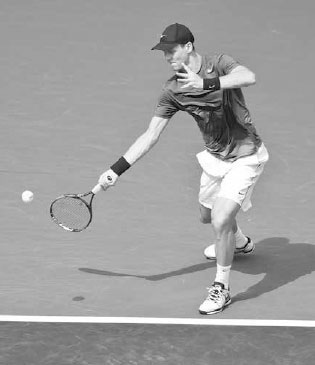

*Berdych, người cao hơn và tấn công mạnh mẽ hơn, thường xuyên sử dụng tư thế trung lập.*

Tư thế mở thường được sử dụng với những quả bóng rộng sân, cao, hoặc nhanh, trong khi tư thế bán mở thường được sử dụng với những quả bóng trên thắt lưng và được đánh về phía giữa sân, cũng như trên các cú thuận tay inside-out và inside-in (xem trang 110). Nếu có thời gian, hãy sử dụng tư thế bán mở thay vì tư thế mở vì nó sẽ tạo ra sức mạnh lớn hơn. Mặc dù ngực của bạn sẽ hướng về phía lưới lúc tiếp xúc ở cả hai tư thế, ở tư thế bán mở, hông của bạn bắt đầu nghiêng ngang nhiều hơn với lưới và do đó bung ra nhiều hơn để tăng thêm sức mạnh. Hơn nữa, vì chân trái ở phía trước chân phải, có nhiều trọng lượng dồn về phía trước hơn vào pha vung vợt so với cú đánh ở tư thế mở.

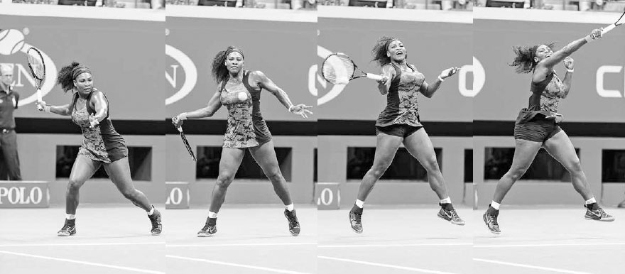

*Trên quả bóng rộng sân này, cú thuận tay tư thế mở của Serena Williams cho thấy cô dồn trọng lượng lên chân phải trước khi đẩy người lên từ chân đó, tăng thêm sức mạnh cho pha vung vợt.*

*Trên quả bóng ở giữa này, Simona Halep di chuyển sang trái trước khi thiết lập một nền tảng vững chắc ở tư thế bán mở, dồn trọng lượng vào cả hai chân, và đẩy người, chủ yếu từ chân trái, lên trên và về phía trước vào cú đánh.*

KỸ THUẬT Trong pha lấy đà, tư thế mở tích trữ năng lượng ở chân phải trước khi giải phóng nó lên cơ thể trong pha vung về trước (trang trước, trên), trong khi tư thế bán mở tích trữ năng lượng đều hơn giữa hai chân trước khi đẩy về trước và lên trên, chủ yếu từ chân trái, vào cú đánh (trang trước, dưới). Ở phần lớn các cú thuận tay tư thế bán mở và tư thế mở, chân trái của bạn kết thúc hướng về mục tiêu, trong khi chân phải của bạn kết thúc tựa nhẹ trên các đầu ngón chân với gót chân rời khỏi mặt đất. Ở những pha vung phòng thủ, đôi chân của bạn sẽ giữ bám đất nhiều hơn, nhưng khi đánh một cú thuận tay mạnh mẽ, đôi chân của bạn sẽ xoay và nâng lên để cho phép cơ thể xoay hoàn toàn qua cú đánh.

Tốt nhất là không nên khóa chặt đôi chân xuống đất trong các cú thuận tay tư thế bán mở hay tư thế mở, đặc biệt là chân phải, mà thay vào đó hãy để chúng nâng lên và di chuyển đến một vị trí tự nhiên. Việc xoay đôi chân không chỉ giúp sức mạnh chảy tự nhiên và giúp bạn duy trì thăng bằng để hồi phục vị trí nhanh chóng, mà còn giảm áp lực lên các khớp chân khi vai xoay ngược với hông trong pha vung vợt. Chính sự giải phóng năng lượng từ đôi chân, kết hợp với đường vòng cung hướng lên mạnh mẽ của pha vung vợt, đã khiến các tay vợt chuyên nghiệp đôi khi thực hiện những cú đánh này trong tư thế bay lên khỏi mặt đất.

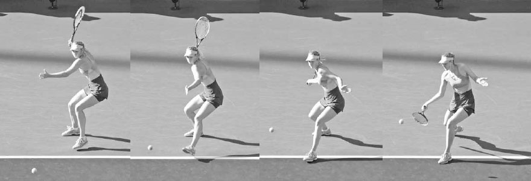

*Maria Sharapova sử dụng tư thế trung lập trên quả bóng thấp này hướng về giữa sân.*

### **2. TƯ THẾ TRUNG LẬP**

Không phải mọi quả bóng đều nên được đánh với tư thế mở hoặc bán mở; đôi khi tốt nhất là sử dụng tư thế trung lập. Ở tư thế trung lập, chân trái của bạn sẽ ở phía trước chân phải với hai chân đặt hơi rộng hơn vai và cơ thể căn chỉnh theo hướng nghiêng ngang, vuông góc với lưới (ảnh dưới). Có một số lý do khiến tư thế trung lập là một lựa chọn tốt, đặc biệt là với các tay vợt nghiệp dư. Thứ nhất, sự chuyển trọng lượng về phía trước từ chân sau sang chân trước tăng thêm sức mạnh. Sức mạnh tuyến tính về phía trước này ít phức tạp hơn để thực hiện so với sự tích lũy sức mạnh dạng góc hướng lên của tư thế mở. Thứ hai, nó đảm bảo yếu tố nền tảng then chốt là động tác xoay vai diễn ra. Thứ ba, vì đường vòng cung của pha vung vợt gọn hơn và ở gần cơ thể hơn, nó giúp cấu trúc pha vung vợt ổn định hơn. Thứ tư, việc cơ thể nghiêng ngang với lưới một cách tự nhiên tạo ra một độ vươn thẳng hơn và dài hơn để đánh "xuyên qua" bóng trong giai đoạn tiếp xúc quan trọng. Có lý do vì sao các môn thể thao khác như bóng chày và golf sử dụng tư thế trung lập --- tư thế này mang lại một độ vươn thẳng, dài qua điểm tiếp xúc hướng về mục tiêu, cũng như sự chuyển trọng lượng đáng tin cậy. Thứ năm, bằng cách bước chân xuống sân, bạn đánh cú đánh của mình sớm hơn, đánh cắp thời gian của đối thủ, và có vị trí sân tốt hơn để phát động một cuộc tấn công lên lưới.

Tư thế trung lập thường được sử dụng với những quả bóng chậm, thấp được đánh về phía giữa sân. Ví dụ, nếu quả bóng đến được đánh với độ xoáy ngược, thì tư thế trung lập có lẽ là lựa chọn tốt nhất do độ nảy chậm hơn và thấp hơn của bóng. Các tay vợt nghiệp dư có thể sử dụng tư thế trung lập thường xuyên hơn vì tốc độ chậm hơn của trận đấu và ít gặp phải những quả bóng nảy cao, topspin nặng hơn. Điều này đặc biệt đúng trong đánh đôi, nơi diện tích sân mà một tay vợt phải bao quát giảm đi khiến ít quả bóng rộng sân hơn, và do đó, ít cần đến các tư thế mở hơn.

KỸ THUẬT Khi sử dụng tư thế trung lập, điều quan trọng là xếp chân sau của bạn gần như phía sau đường bay của quả bóng đang đến (ảnh trang đối diện, ngoài cùng bên trái) vì bạn muốn động lượng về phía trước của chân trước đẩy về phía mục tiêu (ảnh trang đối diện, giữa trái). Nếu bạn đang bước ngang qua sân bằng chân trước, thì điều đó có thể có nghĩa là bạn nên sử dụng tư thế bán mở hoặc tư thế mở.

Chân trước nên tạo góc hướng về phía cột lưới bên phải (ảnh trang đối diện, giữa phải) để giữ phần thân trên căn chỉnh đúng trong suốt pha vung vợt. Nếu chân trước vuông góc với lưới, hông của bạn sẽ mở quá nhiều (hông của bạn nên tạo góc khoảng 45 độ với lưới lúc tiếp xúc). Nếu chân trước của bạn song song với lưới, bạn sẽ cản trở động lượng về phía trước của việc chuyển trọng lượng qua cú đánh. Khi bạn vung vợt, chân trước nên chạm đất một khoảnh khắc trước khi tiếp xúc bóng để đảm bảo động lượng về phía trước (ảnh trang đối diện, ngoài cùng bên phải). Lúc tiếp xúc, chân trước giữ nguyên để neo giữ cú đánh và chân sau trượt sang phải. Chuyển động này của chân sau cho phép hông xoay và tạo ra một điểm tiếp xúc phía trước cơ thể. Trong khi hoàn thành cú đánh, vung chân sau vòng quanh ngang với chân trước (ảnh phải). Đây là bước hồi phục vị trí.

  --------------------------------------------------------------------------------------------------------------------------------------------------------------------------------------------------------------------------------------------------------------------------------------------------------------------------------------------------------------------------------------------------------------------------------------------------------------------------------------------------------------------------------------------------------------------------------------------------------------------------------------------------------------------------------------------------------------------------------------------------------------------------------------
  **HỘP HUẤN LUYỆN VIÊN:**
  **Tư thế trung lập đã quay trở lại được ưa chuộng sau một thời gian bị "thất sủng" trong giảng dạy tennis. Vào thập niên 1990, khi làm việc tại một cơ sở tennis nổi tiếng, tôi được giám đốc tennis yêu cầu chỉ dạy học viên sử dụng tư thế mở, ngay cả khi nhận những quả bóng thấp hơn và chậm hơn. Đây là thời điểm mà chị em nhà Williams đang thống trị với phong cách tư thế mở của họ, và nhiều huấn luyện viên hàng đầu đã chú ý theo. Sự tập trung một chiều vào việc chỉ sử dụng các cú chạm đất tư thế mở này là một ví dụ về việc giảng dạy bị ảnh hưởng bởi tâm lý "trào lưu nhất thời", thay vì việc giảng dạy phản ứng một cách logic với bản chất linh động của môn thể thao này và được xây dựng trên những nguyên tắc cơ bản vững chắc cùng cơ sinh học tối ưu.**
  --------------------------------------------------------------------------------------------------------------------------------------------------------------------------------------------------------------------------------------------------------------------------------------------------------------------------------------------------------------------------------------------------------------------------------------------------------------------------------------------------------------------------------------------------------------------------------------------------------------------------------------------------------------------------------------------------------------------------------------------------------------------------------------

*Ngày nay, có sự đồng thuận trong cộng đồng huấn luyện rằng tư thế trung lập là lựa chọn tốt nhất trong một số hoàn cảnh nhất định. Điều thú vị là, tôi đã thấy chị em nhà Williams đánh nhiều cú chạm đất tư thế trung lập hơn ở giai đoạn sau của sự nghiệp.*

*Caroline Wozniacki thực hiện bước hồi phục vị trí khi cô vung vợt trên cú thuận tay tư thế trung lập mạnh mẽ này.*

Tennis là một môn thể thao thay đổi liên tục, vì vậy thời điểm thực hiện bước hồi phục vị trí sẽ khác nhau. Đôi khi một bước hồi phục vị trí có chủ ý là không cần thiết vì nó diễn ra một cách tự nhiên. Ví dụ, nếu bạn cần di chuyển nhanh sang ngang để đánh một cú thuận tay tư thế trung lập, chân sau của bạn sẽ xoay vòng sang phải nhờ động lượng của cơ thể. Hoặc, trong một pha vung mạnh mẽ, chuyển động nhanh của vợt sang trái trong động tác theo bóng sẽ tự nhiên kéo chân sau của bạn sang phải (ảnh trên).

Tuy nhiên, nếu cú thuận tay của bạn đòi hỏi ít di chuyển hơn để tới bóng hoặc ít mang tính tấn công hơn, điều thường thấy ở trình độ nghiệp dư, bước hồi phục vị trí của bạn có thể diễn ra muộn hơn và có chủ ý hơn. Bước hồi phục vị trí muộn hơn có ưu điểm là vừa ổn định hông vừa giúp cân bằng vợt đúng cách lúc tiếp xúc.

### **3. CÁC BƯỚC NHẢY**

Phần lớn các cú chạm đất sẽ được đánh với đôi chân ở một trong các tư thế mở hoặc trung lập thông thường; tuy nhiên, có những lúc khác khi đôi chân của bạn nên di chuyển và xoay theo những cách kém thông thường hơn để thiết lập thăng bằng, sức mạnh, và sự hồi phục vị trí theo cách hiệu quả nhất. Nếu bạn chỉ tập trung học ba tư thế chính ở dạng tĩnh, bạn đang bỏ sót một phần quan trọng của yếu tố bước chân thiết yếu trong môn thể thao này. Điều quan trọng là học các biến thể linh động của những tư thế thông thường: các bước nhảy.

Các bước nhảy, trong đó một chân nhảy qua thời điểm tiếp xúc trong khi chân kia nâng lên theo các hướng khác nhau để cân bằng cơ thể, được sử dụng trong nhiều tình huống khi thời gian hạn chế và cú đánh tốt nhất nên được thực hiện chỉ với một chân trên mặt đất.

### **A. BƯỚC NHẢY VỀ PHÍA TRƯỚC**

Bước nhảy về phía trước được sử dụng khi di chuyển lên phía trước để xử lý một quả bóng ngắn. Ở đây, chân trước bám đất trong pha lấy đà khi nó bước về phía lưới ở tư thế trung lập. Sau đó nó nâng lên và nhảy về phía trước trong pha vung vợt và động tác theo bóng trong khi chân sau vẫn ở trên không (ảnh trang đối diện, trên). Bước nhảy này diễn ra một cách tự nhiên nhờ động lượng từ chuyển động về phía trước kết hợp với đường vòng cung từ thấp lên cao của pha vung topspin. Sau động tác theo bóng, hãy tiếp tục động lượng về phía trước để chân sau kết thúc ở phía trước chân trước. Điều này sẽ giúp bạn tăng tốc để di chuyển nhanh lên lưới thực hiện cú vô lê.

*Federer sử dụng bước nhảy về phía trước trước khi tấn công lên lưới.*

### **B. BƯỚC NHẢY BÁN MỞ CHO THUẬN TAY**

Sau khi di chuyển nhanh sang trái để đánh một cú thuận tay tư thế bán mở, sự chuyển trọng lượng vào cú đánh thường sẽ bắt đầu từ chân trái và, do chuyển động ngang, đẩy cơ thể sang ngang theo kiểu bay lên khỏi mặt đất trong pha vung vợt (ảnh phải). Khi vợt di chuyển về phía trước để gặp bóng, chân trái nhảy sang ngang bên trái khi chân phải đá ra sau để cân bằng cơ thể.

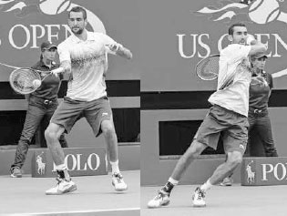

*Jo-Wilfried Tsonga di chuyển sang trái, vào tư thế bán mở, và nhảy qua pha vung vợt.*

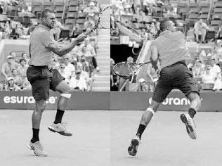

*Marin Cilic sử dụng bước nhảy tư thế mở, kết thúc ở vị trí lệch hẳn về bên phải so với nơi anh bắt đầu pha vung vợt.*

**C. BƯỚC NHẢY TƯ THẾ MỞ**
--------------------------

Bước nhảy ngang tư thế mở được sử dụng với những cú đánh rộng sân, nơi năng lượng được tạo ra bởi chuyển động ngang nâng chân ngoài lên trong pha vung vợt, tiếp đất cách chân trong một khoảng cách nhất định. Trong khi bay lên và hoàn thành pha vung vợt, bạn nghiêng chân sang trái ở cú thuận tay và sang phải ở cú trái tay trong khi phần thân trên vẫn giữ thẳng đứng (ảnh trái). Điều này giúp đảo ngược động lượng theo hướng và tạo điều kiện hồi phục vị trí nhanh chóng.

### **D. BƯỚC NHẢY RA SAU CHO THUẬN TAY**

Bước nhảy ra sau cho cú thuận tay có thể hữu ích trên một cú đánh topspin sâu, nảy cao. Từ tư thế bán mở, chân phải sẽ đẩy người và di chuyển ra sau qua cú đánh trong khi chân trái nâng lên và di chuyển ra sau, phía sau chân phải (ảnh trên, phải). Sau khi chân trái tiếp đất, cơ thể đẩy về phía trước hướng tới vạch cuối sân để hồi phục vị trí.

### **E. BƯỚC NHẢY LAO NGƯỜI CHO THUẬN TAY**

Có những lúc quả bóng quá rộng sân và bạn không thể đặt chân vào tư thế mở. Khi điều này xảy ra, một bước nhảy bắt chéo chân, lao người, nâng cao là tốt nhất. Khi sử dụng bước nhảy lao người trên cú thuận tay, bước cuối cùng trước khi tiếp xúc dồn trọng lượng lên chân phải, đẩy chân trái về phía trước bằng một bước lớn, mạnh mẽ khi bạn vung vợt (ảnh dưới). Trong pha vung vợt, chân phải nâng lên và cánh tay trái kéo ra sau để cân bằng cơ thể. Khi bạn theo bóng, chân phải chạm đất, làm chậm cơ thể và bắt đầu quá trình hồi phục vị trí.

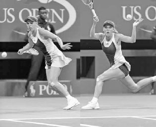

*Jo-Wilfried Tsonga phòng thủ trước một quả bóng nảy cao bằng cách sử dụng bước nhảy ra sau.*

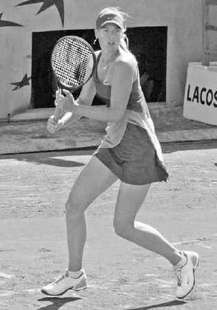

*Caroline Wozniacki sử dụng bước nhảy lao người về phía trước để tạo sức mạnh cho một cú thuận tay rộng sân.*

**II. Năm Giai Đoạn Của Cú Thuận Tay**
--------------------------------------

GIỜ ĐÂY KHI ĐÃ TRÌNH BÀY XONG về các tư thế đứng, hãy cùng bàn về pha vung thuận tay liên quan đến phần thân trên. Có năm giai đoạn chính của pha vung vợt: xoay khối cơ thể, pha lấy đà, vung về trước đến tiếp xúc, tiếp xúc, và động tác theo bóng.

### **1. XOAY KHỐI CƠ THỂ**

Để tối đa hóa sức mạnh và sự ổn định trên cú thuận tay, điều quan trọng là sử dụng hiệu quả các nhóm cơ lớn hơn của hông, ngực, và vai. Cách tốt nhất để sử dụng hiệu quả những cơ này là bắt đầu pha vung vợt tốt bằng động tác xoay khối cơ thể. Bạn thực hiện điều này bằng cách xoay cơ thể như một khối thống nhất, giữ hai tay tương đối bất động trong khi xoay chân phải, nhấc gót chân trái, và xoay vai với tay trái giữ cổ vợt (ảnh phải).

Có bốn lý do để tay trái của bạn ở lại trên cổ vợt trong suốt động tác xoay khối cơ thể. Thứ nhất, nó buộc vai của bạn xoay để cơ thể có thể bung ra mạnh mẽ sau đó trong pha vung vợt. Thứ hai, nó dẫn hướng vợt của bạn vào đúng đường đi cho phần còn lại của pha lấy đà. Việc buông tay trái ra quá sớm sẽ khiến vợt đi vào những đường vung có thể cao hơn, thấp hơn, ngắn hơn, hoặc dài hơn mức lý tưởng. Thứ ba, tay trái của bạn có thể xoay vợt trong khi bạn đặt tay phải vào cách cầm thuận tay ưa thích. Thứ tư, cánh tay trái của bạn truyền thông tin về độ cao và góc độ của vợt tới não bộ trong pha lấy đà, giải phóng tâm trí bạn để tập trung vào quả bóng. Khi bạn thiết lập động tác xoay khối cơ thể, hãy hướng vợt lên trên với dây vợt ở khoảng ngang tầm mắt và khuỷu tay đánh gập thoải mái, thấp hơn 90 độ vài centimet. Hướng vợt lên trên như vậy tạo ra nhiều tốc độ vợt hơn ở cuối pha lấy đà so với các pha lấy đà thấp hơn. Điều này tương tự như việc một quả bóng rơi từ trên bàn xuống có nhiều năng lượng hơn một quả bóng lăn xuống một mặt phẳng nghiêng.

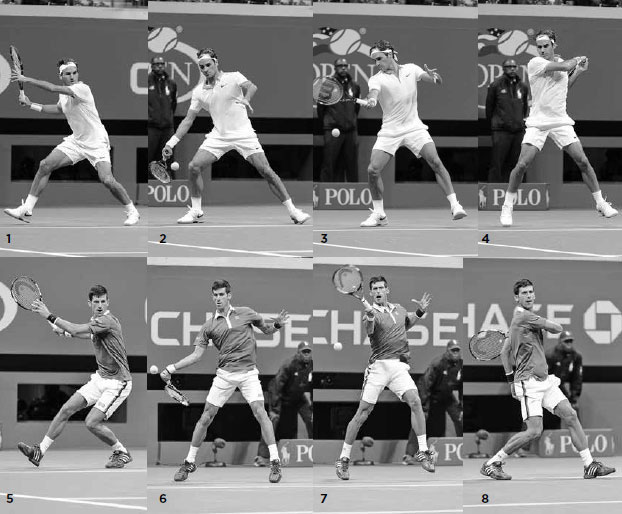

*Maria Sharapova bắt đầu cú thuận tay của mình bằng động tác xoay khối cơ thể.*

Trừ khi quả bóng rộng sân, đòi hỏi bạn phải vung tay để chạy nhanh, bạn nên thực hiện động tác xoay khối cơ thể nhanh chóng và chuẩn bị càng sớm càng tốt cho cú thuận tay. Pha lấy đà sẽ bắt đầu vào những thời điểm khác nhau, nhưng thời điểm của động tác xoay khối cơ thể để khởi động pha vung vợt nên diễn ra nhanh chóng và với thời điểm ổn định hơn.

Một khi đã chuẩn bị hai tay trong động tác xoay khối cơ thể, hãy di chuyển đôi chân và thiết lập tư thế đứng cho pha vung vợt. Sau khi thiết lập tư thế đứng, một số tay vợt tạm dừng vợt và khóa hông để kết thúc động tác xoay khối cơ thể. Nadal (ảnh dưới) và Federer làm điều này, trong khi những người khác như Djokovic và Murray thì mượt mà hơn. Đối với các tay vợt trình độ cao, tôi khuyến nghị phương pháp tạm dừng vì tôi cảm thấy nó tích trữ năng lượng ở đôi chân mạnh mẽ hơn và ngụy trang cú bỏ nhỏ tốt hơn. Đối với các tay vợt kém trình độ hơn, việc giữ vợt tiếp tục chuyển động trong động tác xoay khối cơ thể sẽ đơn giản hơn. Miễn là vai đang xoay và đầu vợt hướng lên trên, động tác xoay khối cơ thể có thể được thực hiện tốt theo cả hai cách.

  -----------------------------------------------------------------------------------------------------------------------------------------------------------------------------------------------------------------------------------------------------------------------------------------------------------------------------------------------------------------------------------------------------------
  **HỘP HUẤN LUYỆN VIÊN:**
  **Điều quan trọng là bắt đầu pha vung vợt tốt --- câu thần chú huấn luyện này đúng với mọi cú đánh. Nếu không có một động tác xoay khối cơ thể mạnh mẽ để bắt đầu cú thuận tay, những bước tiếp theo sẽ kém hiệu quả và kém mạnh mẽ hơn. May mắn thay, đây là một chuyển động mà mọi tay vợt đều có thể thực hiện; tất cả chúng ta đều có thể bắt đầu cú thuận tay giống như các tay vợt chuyên nghiệp.**
  -----------------------------------------------------------------------------------------------------------------------------------------------------------------------------------------------------------------------------------------------------------------------------------------------------------------------------------------------------------------------------------------------------------

Ở khung hình một và năm bên dưới, chúng ta thấy Federer và Djokovic bắt đầu pha vung vợt bằng một động tác xoay khối cơ thể mạnh mẽ. Giờ đây vợt của họ đã được căn chỉnh tốt để kết thúc pha lấy đà ở tư thế sức mạnh (xem trang 97) và tạo độ trễ cho vợt (khung hình hai và sáu). Tiếp theo, vai đánh của họ phối hợp để đẩy vợt về trước tới điểm tiếp xúc trong khi cổ tay nâng đầu vợt lên để tạo topspin (khung hình ba và bảy). Pha vung vợt của họ kết thúc với một động tác theo bóng đầy đủ và sự cân bằng tốt (khung hình bốn và tám), và tất cả bắt đầu từ và bắt nguồn từ một khởi đầu vững chắc về mặt kỹ thuật.

Sau khi cú thuận tay của anh "biến mất" trong phần lớn năm 2015, Nadal cho biết anh đã dành nhiều giờ trên sân tập để rèn luyện một động tác xoay khối cơ thể mạnh mẽ hơn nhằm tạo ra một cú đánh vững chắc hơn về mặt kỹ thuật.(3) Vào mùa xuân năm 2016, cú thuận tay được cải thiện của anh đã giúp anh giành chiến thắng tại các giải đấu ở Barcelona và Monte Carlo.

### **2. PHA LẤY ĐÀ**

Sau khi thiết lập bằng động tác xoay khối cơ thể, pha lấy đà bắt đầu. Hầu hết các pha lấy đà sẽ tương tự nhau, nhưng điều quan trọng cần nhớ là pha lấy đà trên cú thuận tay sẽ thay đổi tùy theo tình huống và mục đích của cú đánh. Pha lấy đà trên một cú thuận tay mạnh mẽ từ một quả bóng ngắn sẽ dài hơn, trong khi nếu cú đánh nhận được nhanh hoặc sự cân bằng của bạn bị ảnh hưởng, một pha lấy đà ngắn hơn sẽ phù hợp hơn.

### **A. CANH THỜI ĐIỂM**

Thời điểm bạn bắt đầu pha lấy đà là một yếu tố then chốt để thiết lập thời điểm tốt cho cú đánh. Nếu bạn bắt đầu quá sớm, nó sẽ làm giảm khả năng tăng tốc vợt trong pha vung về trước. Nếu bạn bắt đầu pha lấy đà quá muộn, khả năng tích lũy sức mạnh của bạn sẽ bị hạn chế và ảnh hưởng tiêu cực đến khả năng kiểm soát vợt.

Các tay vợt hàng đầu bắt đầu pha lấy đà khi nào? Trong một pha bóng ở cuối sân trên sân đất nện, hầu hết các tay vợt trì hoãn việc bắt đầu pha lấy đà cho đến ngay trước khi bóng nảy. Đây là thời điểm cho phép tốc độ tăng vợt lớn nhất và cho phép họ thực hiện những điều chỉnh vào phút chót mà sẽ khó thực hiện nếu pha lấy đà bắt đầu sớm hơn và tay trái của họ đã rời khỏi vợt. Trên sân cứng nhanh hơn, họ chuẩn bị sớm hơn. Các tay vợt nghiệp dư có pha vung vợt chậm hơn nhiều và nên bắt đầu pha lấy đà từ trước khi bóng nảy trong khi vẫn chuẩn bị vợt theo cách giữ cho pha vung vợt mượt mà.

### **B. TAY TRÁI VÀ VỊ TRÍ VỢT**

Sau khi xác định thời điểm cho pha lấy đà, bản thân pha lấy đà bắt đầu với tay trái của bạn tách khỏi vợt và di chuyển sang phải, kết thúc song song với lưới. Vị trí tay trái này đảm bảo rằng vai xoay nhiều hơn hông, cho phép phần thân trên bung ra mạnh mẽ hơn trong pha vung về trước.

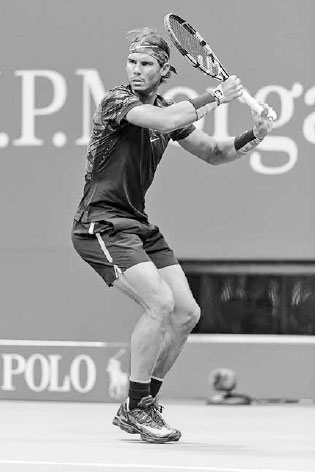

*Federer bắt đầu pha lấy đà "ngoài" của mình với cánh tay trái song song với lưới và dây vợt hướng về phía hàng rào bên phải.*

Khi tay trái của bạn di chuyển ngang qua, tay phải di chuyển vợt ra sau theo hình tròn với dây vợt hướng về phía hàng rào bên phải (ảnh trên). Việc để dây vợt hướng theo cách này trong nửa đầu của pha lấy đà đặt cổ tay của bạn vào một góc thoải mái để thả vợt xuống hiệu quả vào tư thế sức mạnh ở cuối pha lấy đà.

**C. PHA LẤY ĐÀ "NGOÀI"**
-------------------------

Khi vợt đi ra sau theo hình tròn, nó nên giữ về phía bên phải, hay phía "ngoài" (ảnh trên). Điều này tiết kiệm thời gian nhờ vợt đi theo một đường ngắn hơn để đến cuối pha lấy đà, so với đường dài hơn của các pha lấy đà "trong" (hay lệch trái) lớn hơn. Mặc dù pha lấy đà ngoài ngắn hơn, nó mạnh mẽ hơn vì cổ tay có thể gập ngược lại nhiều hơn ở cuối pha lấy đà. Nó cũng dẫn đến một đường đi thẳng hơn tới điểm tiếp xúc, tạo ra một độ vươn dài hơn để tăng độ chính xác.

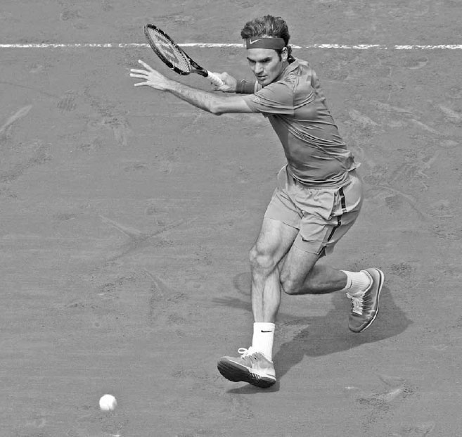

*Nadal và Federer kết thúc pha lấy đà ở tư thế sức mạnh, một điểm chung của tất cả những cú thuận tay xuất sắc.*

### **D. TƯ THẾ SỨC MẠNH**

Ở cuối pha lấy đà, cánh tay đánh của bạn duỗi thẳng và vợt của bạn nên hướng về phía bên phải của hàng rào cuối sân với đầu vợt ở trên cổ tay và dây vợt hướng xuống đất (ảnh trên). Đây được gọi là "tư thế sức mạnh". Đây là một điểm chung thấy được ở tất cả những cú thuận tay xuất sắc. Với tư thế này được thiết lập, cơ thể bạn hoàn toàn cuộn lại và vợt ở một vị trí mạnh mẽ để chuyển từ pha lấy đà sang pha vung về trước.

  -----------------------------------------------------------------------------------------------------------------------------------------------------------------------------------------------------------------------------------------------------------------------------------------------------------------------------------------------------------------------------------------------------------------------------------------------------
  **HỘP HUẤN LUYỆN VIÊN:**
  **Trên đấu trường chuyên nghiệp, trọng tâm của cú thuận tay đã phát triển từ việc tạo sức mạnh bằng một pha lấy đà dài hơn sang việc xử lý và trả những cú đánh mạnh mẽ bằng một pha lấy đà ngắn hơn, phía ngoài. Một phần vì lý do này mà những tay vợt như Federer có rất nhiều thời gian để thực hiện cú thuận tay của mình. Nó cũng cho phép họ chơi gần vạch cuối sân hơn và di chuyển nhanh lên phía trước để tấn công những quả bóng ngắn.**
  -----------------------------------------------------------------------------------------------------------------------------------------------------------------------------------------------------------------------------------------------------------------------------------------------------------------------------------------------------------------------------------------------------------------------------------------------------

Một số tay vợt đã điều chỉnh pha lấy đà của mình theo thời gian và áp dụng kỹ thuật này. Đầu sự nghiệp, Nadal gặp khó khăn trong việc giành chiến thắng ở các giải đấu lớn trên những mặt sân nhanh hơn. Sau đó anh bắt đầu đưa vợt ra sau thấp hơn một chút và chuẩn bị vợt ở phía ngoài cơ thể nhiều hơn. Sự thay đổi này giảm bớt thời gian anh cần để thực hiện một cú thuận tay mạnh mẽ và cho phép anh chơi tấn công hơn và gần vạch cuối sân hơn. Kể từ đó, anh đã giành được nhiều danh hiệu Grand Slam trên những mặt sân nhanh hơn.

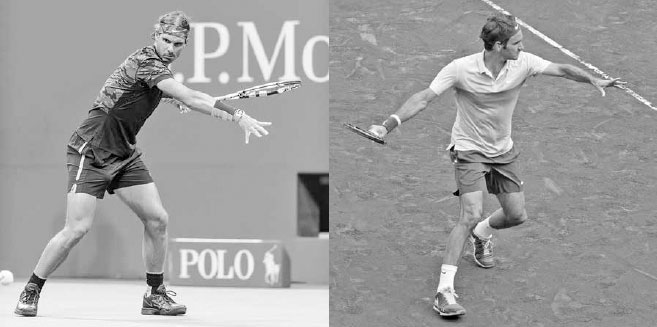

*Sau tư thế sức mạnh, Djokovic xoay hông và tạo độ trễ cho vợt.*

Khi vợt vào tư thế sức mạnh, cánh tay trái duỗi thẳng, tạo ra sức mạnh đối trọng neo giữ cho cánh tay đánh di chuyển vợt về trước với lực mạnh hơn. Nó cũng kéo giãn các cơ liên sườn, chuẩn bị cho động tác xoay hông tiếp theo sau đó. Động tác xoay hông tăng thêm sức mạnh thông qua đòn bẩy; lực mà nó tạo ra nhân lên khi được truyền vào cánh tay, giống như hệ thống đòn bẩy giúp một chiếc cánh quạt đồ chơi bay lên.

### **3. VUNG VỀ TRƯỚC ĐẾN TIẾP XÚC**

Với pha lấy đà và việc thiết lập tư thế sức mạnh đã hoàn tất, cánh tay trái đã được kéo giãn ở cuối pha lấy đà bắt đầu gập lại và kéo sang trái, còn hông xoay khiến vợt bị trễ lại (ảnh trên, phải). Từ "trễ" thường mang hàm ý tiêu cực, tuy nhiên trong tennis, nó có nghĩa là sức mạnh "ná bắn" bổ sung. Độ trễ của vợt kéo giãn các cơ vai và cánh tay của bạn, tạo ra động lượng bổ sung để đẩy vợt mạnh mẽ tới điểm tiếp xúc.

Trong quá trình vợt bị trễ, cẳng tay và cổ tay sẽ xoay vòng theo chiều kim đồng hồ. Bạn muốn topspin càng nhiều, vòng xoay đó càng lớn. Sự xoay vòng này của vợt tăng cường sức mạnh cho pha vung vợt và diễn ra mà không cần điều khiển cơ bắp có ý thức. Nó diễn ra tự nhiên từ việc thiết lập tư thế sức mạnh với một pha lấy đà ngoài và khuỷu tay đánh của bạn giữ nguyên vị trí khi hông xoay. Sau độ trễ của vợt, pha vung về trước của bạn tiếp tục với hông xoay và đầu vợt hạ xuống dưới bóng. Sau khi đầu vợt hạ xuống, đế vợt di chuyển về trước để hướng về phía bóng, tạo độ trễ cho vợt lần thứ hai.

Đường đi của vợt trong pha vung về trước sẽ khác nhau tùy vào việc bạn đang đánh một cú thuận tay topspin hay phẳng.

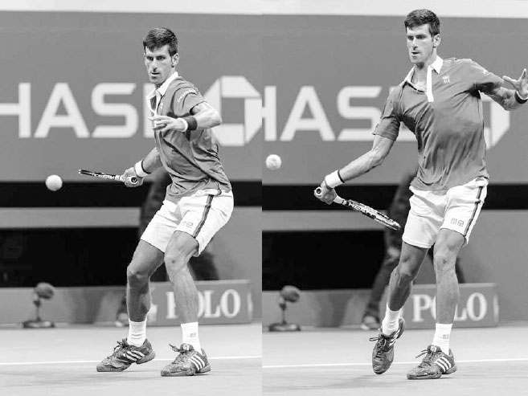

*Trên cú thuận tay topspin của Jo-Wilfried Tsonga (trên), vợt của anh nâng lên ở góc khoảng 45 độ, trong khi trên cú thuận tay phẳng của anh (dưới), vợt của anh đi theo một đường gần như ngang tới bóng.*

Quyết định đánh một cú thuận tay phẳng hay một cú thuận tay topspin phần lớn phụ thuộc vào mức độ tấn công mong muốn và vị trí sân của bạn. Ví dụ, nếu bạn muốn giành quyền kiểm soát pha bóng và đang đứng gần hoặc phía trước vạch cuối sân, cú thuận tay phẳng có lẽ là lựa chọn cú đánh đúng đắn. Mặt khác, nếu bạn muốn giữ ở giai đoạn trung hòa của pha bóng và đang đứng phía sau vạch cuối sân, thì việc sử dụng cú thuận tay topspin thường hợp lý về mặt chiến thuật.

Đế vợt của Djokovic hướng về phía bóng trước khi nó xoay về phía cơ thể để vuông vợt lại chuẩn bị tiếp xúc. Trình tự pha vung thuận tay là ngoài để chuẩn bị nhanh, trong để tạo độ trễ cho vợt (trái), và ngoài lại lần nữa để gặp bóng (phải).

  ---------------------------------------------------------------------------------------------------------------------------------------------------------------------------------------------------------------------------------------------------------------------------------------------------------------------------------------------------------------------------------------------------------------------------------------------------------------------------------------------------------------------------------------------------------------------------------------------
  **HỘP HUẤN LUYỆN VIÊN:**
  **Hãy luôn nhớ rằng vì cổ tay là khớp gần vợt nhất trên cơ thể bạn, cách nó căn chỉnh và di chuyển qua điểm tiếp xúc có ảnh hưởng rất lớn đến sự thành công của mỗi cú đánh. Khi bạn phân tích kỹ, kỹ thuật tennis khá đơn giản. Bạn có ba cú đánh chính --- giao bóng, cú chạm đất topspin, và vô lê --- với ba chuyển động cổ tay khác nhau. Tất nhiên, còn nhiều điều hơn thế, nhưng về cơ bản nếu bạn có thể học cách sấp cổ tay trên cú giao bóng, nâng cổ tay trên các cú chạm đất topspin, và giữ cổ tay ổn định trên các cú vô lê, bạn có thể chơi tennis ở một trình độ rất tốt.**
  ---------------------------------------------------------------------------------------------------------------------------------------------------------------------------------------------------------------------------------------------------------------------------------------------------------------------------------------------------------------------------------------------------------------------------------------------------------------------------------------------------------------------------------------------------------------------------------------------

Sau khi đế vợt di chuyển về trước, nó xoay về phía cơ thể, khiến đầu vợt di chuyển gần cơ thể hơn rồi ra xa, hay từ trong ra ngoài (ảnh trên), khi nó tiến gần hơn tới điểm tiếp xúc. Thật tự nhiên khi nghĩ rằng, vì bóng di chuyển theo đường thẳng, cú thuận tay nên là một kiểu pha vung theo đường thẳng. Tuy nhiên, để tối đa hóa sức mạnh động học, pha vung thuận tay nên vòng cung và cong; vòng lên trong pha lấy đà, rồi cong về trước để gặp bóng. Khi vợt di chuyển về phía bóng, cổ tay của bạn di chuyển về trước từ góc 60 đến 70 độ so với cẳng tay (trái) đến khoảng góc 45 độ lúc tiếp xúc (phải). Chuyển động về trước này (hay "bắt kịp") của cổ tay so với cẳng tay tăng thêm tốc độ vợt và vuông mặt vợt lại với mục tiêu của bạn. Hãy nhớ rằng, cổ tay là bộ phận chuyển động cuối cùng của cơ thể ảnh hưởng đến tốc độ và hướng của vợt. Chuyển động của nó là mắt xích cuối cùng then chốt trong chuỗi động học của cú thuận tay, nơi sự tích lũy năng lượng khắp cơ thể đạt đến đỉnh điểm cuối cùng.

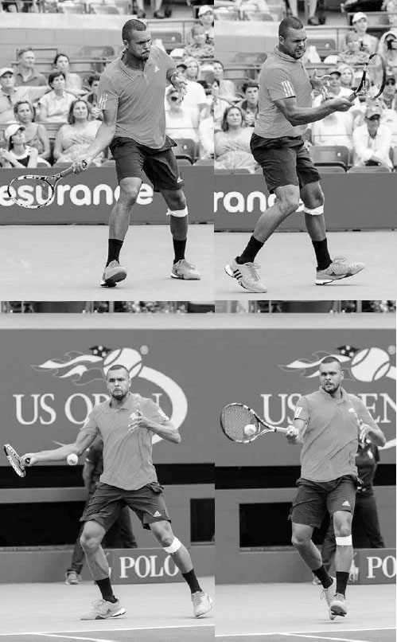

*Djokovic di chuyển cổ tay về trước một chút để tăng sức mạnh, rồi giữ ổn định lúc tiếp xúc để định hướng và kiểm soát cú đánh.*

Khi cánh tay và cổ tay đưa vợt về trước, cổ tay cũng di chuyển hơi lên trên để nâng đầu vợt lên và tăng thêm topspin cho cú đánh. Nhìn từ phía trước trên một quả bóng ngang thắt lưng, đầu vợt vốn ở dưới bóng ở góc khoảng 8 giờ trước khi tiếp xúc (trang sau) di chuyển lên trên để gặp bóng ở góc 9 giờ (hay theo phương ngang) để bắt đầu chuyển động "cần gạt nước" được bàn tiếp theo trong phần tiếp xúc. Trong khi cổ tay di chuyển lên trên và về trước, chuyển động về trước đó chậm lại một khoảnh khắc trước khi tiếp xúc, cho phép bạn làm chủ va chạm với bóng và định hướng cú đánh.

### **4. TIẾP XÚC**

Đến thời điểm này, bạn đã đi được khoảng nửa chặng đường của pha vung về trước, và đã đến lúc cho khoảnh khắc quyết định --- điểm tiếp xúc và ba yếu tố chính của nó: "chuyển động cần gạt nước", điểm tiếp xúc, và độ vươn.

### **A. CHUYỂN ĐỘNG CẦN GẠT NƯỚC**

Như đã đề cập, đầu vợt di chuyển về trước và nghiêng lên trên để gặp bóng ở góc 9 giờ. Nó tiếp tục di chuyển về trước và nghiêng lên trên sau khi tiếp xúc trước khi kết thúc ngang qua cơ thể ở góc 3 giờ (ảnh trang đối diện, trên). Sự xoay lên trên này của vợt thường được gọi là chuyển động "cần gạt nước" vì vợt đi theo một đường phần nào mô phỏng cần gạt nước ô tô, khi cạnh trên của vợt trong pha vung về trước trở thành cạnh dưới trong động tác theo bóng.

Chuyển động cần gạt nước cho phép dây vợt miết lên phía sau bóng và khiến bóng xoay tiến, tạo topspin cho nó sau khi rời khỏi vợt. Lượng topspin bạn tạo ra được quyết định bởi độ dốc của đường đi vợt từ thấp lên cao và tốc độ của đầu vợt --- một cú miết bóng dốc, hướng lên với vợt tốc độ nhanh sẽ tạo ra nhiều topspin. Hay, nói theo ngôn ngữ cần gạt nước, những cú đánh với topspin nặng sẽ xoay đầu vợt nhanh hơn những cú đánh phẳng hơn.

  ----------------------------------------------------------------------------------------------------------------------------------------------------------------------------------------------------------------------------------------------------------------------------------------------------------------------------------------------------------------------------------------------------------------------------------------------------------------------------------------------------------------------
  **HỘP HUẤN LUYỆN VIÊN:**
  **Sự kết hợp đúng đắn giữa chuyển động cần gạt nước để tạo topspin và chuyển động về trước của cánh tay từ vai để tạo độ vươn tốt là thiết yếu để đánh một cú thuận tay xuất sắc. Một cú thuận tay chủ yếu sử dụng chuyển động cần gạt nước sẽ tạo ra topspin nhưng thiếu sức mạnh, trong khi một cú thuận tay sử dụng độ vươn tốt mà không có chuyển động cần gạt nước sẽ tạo ra sức mạnh nhưng thiếu topspin để kiểm soát cú đánh. Bạn cần cả hai thành phần của pha vung vợt để đánh với sức mạnh có kiểm soát.**
  ----------------------------------------------------------------------------------------------------------------------------------------------------------------------------------------------------------------------------------------------------------------------------------------------------------------------------------------------------------------------------------------------------------------------------------------------------------------------------------------------------------------------

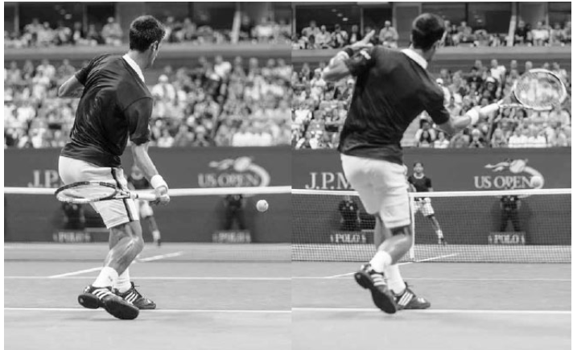

*Stan Wawrinka bắt đầu chuyển động cần gạt nước với đầu vợt ở dưới bóng ngay trước khi tiếp xúc.*

### **B. ĐIỂM TIẾP XÚC**

Lúc tiếp xúc, bạn phải khớp bóng đúng cách với dây vợt. Để làm điều này một cách nhất quán, việc tiếp xúc phải diễn ra phía trước cơ thể bạn (ảnh trang đối diện, dưới). Một điểm tiếp xúc phía trước cơ thể cho bạn thời gian và không gian để tích lũy tốc độ vợt tối ưu, và bạn có thể nhìn thấy bóng rõ ràng. Hơn nữa, chính tại đây cơ thể bạn ở vị trí tốt nhất để có sức mạnh vật lý làm chủ va chạm của bóng. Khoảng cách phía trước cơ thể sẽ phụ thuộc phần lớn vào hướng của cú đánh. Các cú đánh chéo sân nên được đánh xa phía trước cơ thể hơn so với các cú đánh dọc dây.

**C. ĐỘ VƯƠN**
--------------

Điều quan trọng là đánh với độ vươn tốt lúc tiếp xúc. Để làm điều này, bạn phải vươn vợt về phía trước qua điểm tiếp xúc, như thể đang đánh xuyên qua ba quả bóng xếp thành hàng. Ở đây, mặt vợt nên giữ ổn định ở một góc hơi đóng (trái) --- đừng để nó trượt mở ra hoặc rung động về trước rồi khép lại quanh đường viền của bóng.

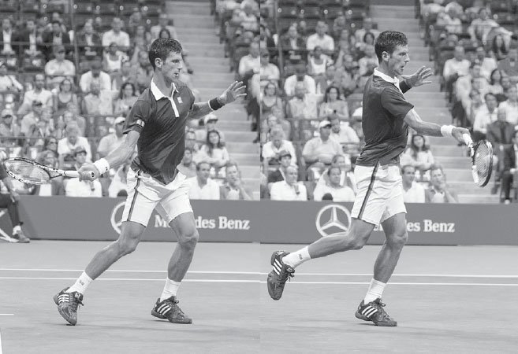

*Chuyển động cần gạt nước của Djokovic cho thấy vợt của anh xoay hơn 180 độ sau khi tiếp xúc. Anh kết hợp việc sử dụng chuyển động cần gạt nước với độ vươn tốt để đánh cú thuận tay của mình với sức mạnh và sự kiểm soát.*

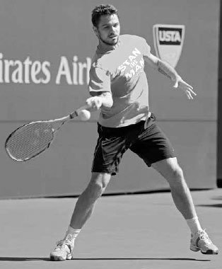

*Kei Nishikori tiếp xúc bóng ở phía trước cơ thể, nơi sức mạnh vật lý, động lượng pha vung vợt, và tầm nhìn của anh được phục vụ tốt nhất.*

Hãy nhớ rằng, thực tế của mọi cú đánh tennis là nó liên quan đến một quả bóng có thể nén ép va vào những dây vợt được căng chặt. Do đó, chỉ bằng cách sử dụng độ vươn tốt, bạn mới có thể kiểm soát hiệu quả va chạm của bóng và đánh với sức mạnh, độ sâu, và độ chính xác. Một vấn đề mà một số tay vợt gặp phải là họ "đánh mất" va chạm, khiến vợt của họ dừng lại sớm trong quá trình vươn, và kết quả là cú thuận tay của họ thiếu những đặc tính đáng mong muốn này.

Khi bạn thực hiện độ vươn, cổ tay, cẳng tay, và khuỷu tay của bạn sẽ giữ tương đối ổn định trong khi vai đẩy vợt về trước. Nếu chuyển động này được thực hiện đúng cách, vợt nên hướng song song với mục tiêu của bạn và giữ ở phía bên phải cơ thể bạn, tạo ra khoảng cách tốt giữa vợt và vai trái (ảnh trên).

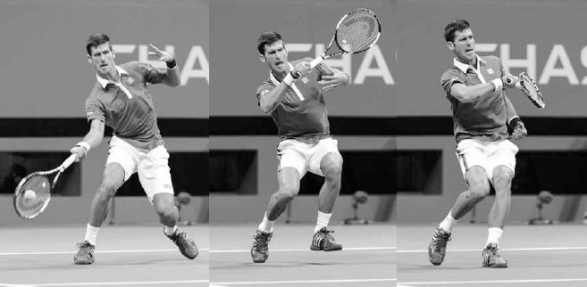

*Serena Williams thể hiện độ vươn tốt khi vợt của cô giữ ở bên phải và di chuyển song song với mục tiêu sau khi tiếp xúc.*

Độ vươn sẽ dễ thực hiện tốt hơn nếu đầu và ngực của bạn giữ yên. Việc nâng đầu và ngực trong khi vươn sẽ khiến vợt lệch sang trái thay vì vươn thẳng về phía mục tiêu. Một mẹo hay để giữ đầu và ngực bất động là nhìn xuống bóng qua mặt sau của dây vợt lúc tiếp xúc. Hãy nhớ rằng bóng chỉ ở trên dây vợt của bạn trong vài phần nghìn giây, chưa đủ lâu để não bộ ghi nhận, vì vậy dù bạn có thể không thực sự nhìn rõ bóng trên dây vợt, điều quan trọng là việc theo dõi bóng giúp giữ ngực bất động để có đường vợt thẳng hơn và độ vươn dài hơn.

Ngoài ra, ở giai đoạn này của pha vung vợt, việc di chuyển các bộ phận cơ thể để xây dựng sức mạnh chuỗi động học gần như đã hoàn tất, và trọng tâm chuyển sang việc giữ cơ thể bất động để tối đa hóa khả năng kiểm soát vợt. Mặc dù các pha vung vợt hiện đại rất bùng nổ, các tay vợt đỉnh cao vẫn giữ đầu và ngực bất động lúc tiếp xúc để giúp đặt mặt vợt vào đúng góc chính xác cần thiết để đánh những cú đánh mạnh mẽ của họ vào trong sân.

  ------------------------------------------------------------------------------------------------------------------------------------------------------------------------------------------------------------------------------------------------------------------------------------------------------------------------------------------------------------------------------------------------------------------------------------------------------------------------------------------------------------------------------------------------------------------------------------------------------------
  **HỘP HUẤN LUYỆN VIÊN:**
  **Tại sao chuyển động cần gạt nước lại là một kỹ thuật quan trọng cần học? Nó tạo ra topspin, tạo ra áp suất không khí phía trên bóng đẩy nó xuống dưới. Do đó, topspin cho phép bạn đánh cao hơn hẳn trên lưới trong khi biết rằng quỹ đạo lao xuống của bóng sẽ đưa nó rơi vào trong sân trước vạch cuối sân. Trong ngôn ngữ huấn luyện, topspin mang lại hình dạng cho một cú đánh cuối sân mạnh mẽ, và hình dạng mang lại sự ổn định. Topspin không chỉ tạo ra một quỹ đạo thuận lợi, mà còn mở ra những góc chéo sân sắc hơn và một quả bóng cao hơn, "nặng" hơn để đối thủ của bạn phải phòng thủ.**
  ------------------------------------------------------------------------------------------------------------------------------------------------------------------------------------------------------------------------------------------------------------------------------------------------------------------------------------------------------------------------------------------------------------------------------------------------------------------------------------------------------------------------------------------------------------------------------------------------------------

**Nếu bạn chưa quen với chuyển động vợt cho một cú thuận tay topspin, hãy thử bài tập này. Đứng cách lưới khoảng 30 cm ở tư thế thuận tay của bạn, khớp giữa mặt vợt với dải băng đầu lưới, và nhẹ nhàng "miết" lên dải băng. Tiếp theo, giữ một quả bóng bằng dây vợt áp vào dải băng đầu lưới, và thực hiện chuyển động tương tự trong khi lăn bóng qua lưới. Bài tập này có thể giúp bạn hiểu rõ hơn cách tạo ra độ xoay tiến của bóng (tức là topspin).**

### **5. ĐỘNG TÁC THEO BÓNG**

Sau khi tiếp xúc và vươn, vợt được giải phóng về trước và quét ngang sang trái để hoàn thành chuyển động cần gạt nước. Khi vợt quét ngang, mặt vợt sẽ khép lại (ảnh dưới). Mức độ khép lại của mặt vợt sẽ phụ thuộc vào lượng topspin được sử dụng cũng như độ cao của bóng. Vợt sẽ khép nhiều hơn trên những cú đánh phẳng hơn và điểm tiếp xúc cao hơn, và ít hơn trên những cú đánh topspin nặng và điểm tiếp xúc thấp hơn.

Với chuyển động cần gạt nước hoàn tất, khuỷu tay gập lại và vợt di chuyển lên trên, sang trái, và ra sau để kết thúc cú đánh. Khi điều này diễn ra, cánh tay trái tiếp tục di chuyển sang trái để mở đường cho cơ thể hoàn thành động tác xoay hông.

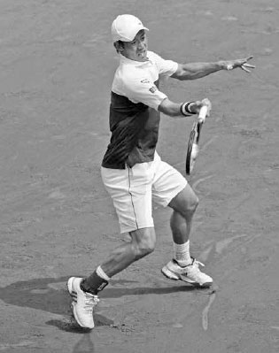

*Sau độ vươn, Federer khép vợt lại khi nó quét ngang sang trái.*

Một động tác theo bóng tốt là dấu hiệu cho thấy pha vung vợt của bạn có sự tiếp xúc vững chắc, độ vươn đúng cách, và tốc độ vợt tốt. Và mặc dù một động tác theo bóng tốt không đảm bảo những đặc tính này của cú đánh, việc ghi nhớ nó vào trí nhớ cơ bắp sẽ giúp chúng diễn ra ổn định hơn. Tôi nhận thấy trong quá trình giảng dạy của mình rằng khi học viên có ý thức theo bóng đầy đủ, phần độ vươn trong pha vung vợt của họ thường cũng được cải thiện, tăng thêm tốc độ và độ sâu cho cú đánh.

Độ dài và đường vòng cung của động tác theo bóng sẽ khác nhau tùy vào loại cú đánh. Có ba kiểu động tác theo bóng chính: nâng cao, ngang, và đảo ngược.

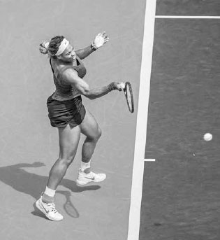

*Là một tay đánh phẳng, Maria Sharapova thường sử dụng động tác theo bóng nâng cao.*

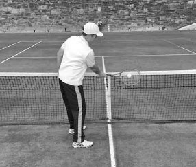

*Ở đây, động tác theo bóng ngang của Murray cho thấy anh có khả năng đã sử dụng topspin nặng trên cú thuận tay này.*

### **A. ĐỘNG TÁC THEO BÓNG NÂNG CAO**

Động tác theo bóng nâng cao thường được sử dụng khi đánh các cú chạm đất phẳng đến topspin vừa phải. Ở lần kết thúc này, vợt kết thúc phía sau đầu bạn với các khớp ngón tay dừng lại gần tai trái và khuỷu tay ở ngang vai, hướng về phía mục tiêu (trái). Đối với các tay vợt nghiệp dư thường sử dụng topspin vừa phải, động tác theo bóng nâng cao là kiểu đúng để ghi nhớ vào trí nhớ cơ bắp.

### **B. ĐỘNG TÁC THEO BÓNG NGANG**

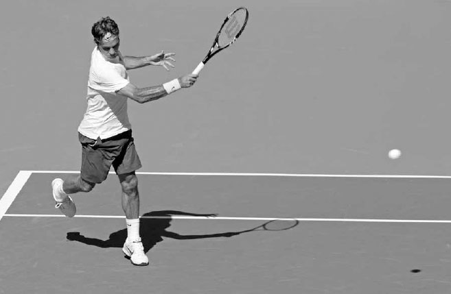

*Động tác theo bóng ngang thường được sử dụng trên những quả bóng cao hơn hoặc những quả bóng được đánh với topspin vừa phải đến nặng (ảnh dưới).*

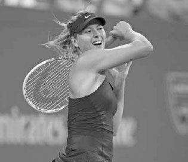

*Nadal sử dụng động tác theo bóng đảo ngược trên hầu hết các cú đánh, nhưng đối với các tay vợt chuyên nghiệp khác, kiểu động tác theo bóng này chỉ được sử dụng trong một số hoàn cảnh nhất định.*

  --------------------------------------------------------------------------------------------------------------------------------------------------------------------------------------------------------------------------------------------------------------------------------------------------------------------------------------------------------------------------------------------------------------------------------------------------------------------------------------------------------------------------------------------------------------------------------------------------------------------------------------------------------------------------------------------
  **HỘP HUẤN LUYỆN VIÊN:**
  **Nadal sử dụng động tác theo bóng đảo ngược trên phần lớn các cú thuận tay của mình, nhưng không phải lúc nào cũng vậy. Nếu bạn xem video Nadal khi còn là một tay vợt trẻ, bạn sẽ thấy anh hiếm khi sử dụng động tác theo bóng đảo ngược trên cú thuận tay của mình. Tuy nhiên, theo thời gian --- và sau khi đánh hàng nghìn quả bóng --- anh nhận ra rằng kỹ thuật cánh tay thẳng và phong cách ngả người ra sau của mình khiến động tác theo bóng đảo ngược trở thành kiểu kết thúc phù hợp nhất cho cú thuận tay của anh. Một trong những tài năng của các tay vợt xuất sắc là khả năng trực giác của họ trong việc tìm ra kỹ thuật phù hợp nhất với mình và cam kết theo đuổi nó.**
  --------------------------------------------------------------------------------------------------------------------------------------------------------------------------------------------------------------------------------------------------------------------------------------------------------------------------------------------------------------------------------------------------------------------------------------------------------------------------------------------------------------------------------------------------------------------------------------------------------------------------------------------------------------------------------------------

**C. ĐỘNG TÁC THEO BÓNG ĐẢO NGƯỢC**
-----------------------------------

Động tác theo bóng đảo ngược đôi khi được các tay vợt trình độ cao sử dụng khi bị dồn ép, đang chạy để xử lý một cú đánh rộng sân, hoặc muốn tạo thêm topspin cho cú thuận tay của họ. Trong động tác theo bóng đảo ngược, vợt vung gần như theo phương thẳng đứng và được giải phóng lên trên rồi ra sau đầu (ảnh trên) thay vì kết thúc truyền thống ngang qua cơ thể. Bằng cách kết thúc theo cách này, các tay vợt có thể tăng tốc và đánh một cú đánh hiệu quả ngay cả khi họ có thể đang vội vàng thực hiện cú đánh. Tốc độ và độ xoáy tăng lên của trận đấu ngày nay đã khiến động tác theo bóng đảo ngược trở nên phổ biến hơn vì điểm tiếp xúc muộn hơn của nó cho phép thêm một khoảnh khắc thời gian và độ dốc lớn của nó hỗ trợ độ xoáy.

SỰ NGHIỆP LỪNG LẪY CỦA RAFAEL NADAL phần lớn có thể quy về cú thuận tay topspin nặng đáng kinh ngạc của anh. Thông thường, khi một tay vợt sử dụng topspin lớn, tốc độ cú đánh của họ sẽ bị ảnh hưởng. Tuy nhiên, tốc độ đầu vợt đáng kinh ngạc của Nadal cho phép anh có cả độ xoáy bùng nổ lẫn sức mạnh trên cú thuận tay của mình.

Ở khung hình đầu tiên, cú thuận tay của Nadal trông khá chính thống với vai xoay và đôi chân "bám" xuống sân để tích trữ năng lượng. Ở khung hình hai, đầu vợt của anh ở trên cổ tay và hướng xuống đất trong tư thế sức mạnh, và cánh tay không đánh của anh di chuyển sang phải để kích hoạt cơ lõi và xoay hông. Ở đây, cú thuận tay của Nadal bắt đầu khác biệt so với phần lớn các tay vợt khác, với cánh tay đánh của anh duỗi thẳng hoàn toàn (thay vì hơi gập) ở cuối pha lấy đà. Kỹ thuật này kéo giãn các cơ tay nhiều hơn và kéo dài đường đi của pha vung vợt để tăng tốc độ vợt. Ở khung hình ba, anh hạ đầu vợt xuống dưới bóng khi vợt bắt đầu đường đi từ thấp lên cao tới bóng. Giữa khung hình ba và bốn, chúng ta có thể thấy độ trễ và sự giải phóng bùng nổ của vợt, cùng cách vợt đã xoay từ vị trí 5 giờ sang vị trí 11 giờ. Sự xoay vợt 180 độ này tạo ra topspin đáng kinh ngạc. Ở khung hình bốn, chúng ta thấy kỹ thuật cánh tay thẳng của Nadal cho phép độ vươn dài, và sự giải phóng bùng nổ của anh dẫn đến một chuyển động cổ tay về trước lớn hơn mức trung bình sau khi tiếp xúc. Cổ tay là bộ phận gần vợt nhất trên cơ thể, và Nadal biết rằng việc di chuyển nó về trước như vậy tăng thêm sức mạnh cho cú đánh của anh. Các tay vợt nghiệp dư không thích 3200 vòng/phút trên cú thuận tay của mình như Rafa nên chỉ di chuyển cổ tay về trước một chút trong giai đoạn này của pha vung vợt.

*Khung hình năm và sáu cho thấy động tác theo bóng đảo ngược đặc trưng của Nadal với vợt kết thúc phía sau đầu để hoàn thành chuyển động "roi ngựa" (buggy whip) của anh.*

**III. Các Kiểu Cú Thuận Tay**
------------------------------

TIẾP THEO, TÔI SẼ TRÌNH BÀY VỀ KỸ THUẬT và ưu điểm của hai cú thuận tay quan trọng, cú thuận tay inside-out và inside-in. Sau đó tôi sẽ mô tả năm kiểu cú thuận tay topspin khác. Cuối cùng, tôi sẽ kết thúc phần này bằng cách bàn về cú thuận tay cắt bóng.

### **1. CÚ THUẬN TAY INSIDE-OUT VÀ INSIDE-IN**

Hai cú đánh đáng sợ nhất từ cuối sân trong môn thể thao này là cú thuận tay inside-out và inside-in. Nếu bạn có một cú thuận tay mạnh mẽ, đây là những cú đánh bạn nên sử dụng thường xuyên; chúng là một trong những cơ hội tốt nhất để giành quyền kiểm soát pha bóng hoặc buộc đối thủ mắc lỗi.

Ở cả hai cú đánh, tay vợt thực hiện cú đánh di chuyển sang trái vào bên phần sân trái tay. Từ vị trí này, một cú thuận tay đánh chéo sân sang phần trái tay của một đối thủ thuận tay phải là cú thuận tay "inside-out", trong khi một cú thuận tay đánh dọc dây là cú thuận tay "inside-in" (ảnh dưới).

Cú thuận tay inside-out và inside-in có một số ưu điểm. Thứ nhất, sự di chuyển sang phần bên trái của sân tăng thêm động lượng và sức mạnh cho cú đánh, và sự căn chỉnh cơ thể trên cú thuận tay cho phép bạn di chuyển sang trái mà vẫn đánh một cú đánh cân bằng tốt. Thứ hai, nếu cú thuận tay là điểm mạnh của bạn và điểm yếu của đối thủ là trái tay, cú thuận tay inside-out sẽ giúp bạn thiết lập một mô hình pha bóng đối đầu điểm mạnh của bạn với điểm yếu của họ. Trong tình huống này, đối thủ của bạn sẽ cảm thấy áp lực và có thể mạo hiểm dẫn đến những cú đánh có tỷ lệ thành công thấp. Thứ ba, bằng cách chi phối lối chơi từ giữa sân, bạn "thu hẹp" mặt sân thi đấu, chỉ để lại một khoảng không gian nhỏ ở góc trái tay cho đối thủ của bạn đánh cú đánh của họ mà không gây hậu quả đáng lo ngại. Việc cho đối thủ một khoảng không gian nhỏ để nhắm tới sẽ khiến họ đánh hỏng bóng ra ngoài.

Thứ tư, cú thuận tay inside-out được đánh qua phần thấp nhất của lưới, vào phần sân dài nhất, và có thêm hiệu ứng tích cực là kéo đối thủ của bạn ra rộng khỏi sân nhiều hơn hầu hết các cú thuận tay khác. Thứ năm, nếu cú thuận tay là điểm mạnh của bạn, việc chi phối lối chơi bằng cú thuận tay sẽ mang lại cho bạn nhiều tự tin hơn với cú trái tay của mình. Khi bạn đánh phần lớn các cú chạm đất bằng cú thuận tay vượt trội của mình, bạn không còn cảm thấy áp lực phải làm điều gì đó đặc biệt với cú trái tay, vì biết rằng sẽ có một cú thuận tay để tung hết lực trong một hoặc hai cú đánh sắp tới. Điều này dẫn đến việc lựa chọn cú đánh có tỷ lệ thành công cao hơn trên cú trái tay và nhìn chung là xây dựng pha bóng kiên nhẫn và thông minh hơn.

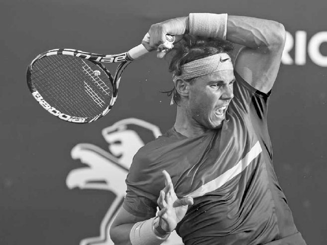

*Madison Keys thích di chuyển sang trái dọc theo vạch cuối sân và chi phối lối chơi bằng cú thuận tay của mình.*

### **2. CÁC KIỂU CÚ THUẬN TAY TOPSPIN KHÁC**

Có năm kiểu cú thuận tay topspin chính khác. Những tay vợt có sự linh hoạt để sử dụng các cú thuận tay khác nhau có được lợi thế lớn so với những người không có. Việc có nhiều lựa chọn cho phép bạn sử dụng phản ứng chiến thuật hiệu quả nhất cho từng hoàn cảnh cụ thể. Đôi khi việc đẩy cú thuận tay topspin nhanh với ít độ xoáy, bay thấp qua lưới là hợp lý, trong khi những lúc khác, lựa chọn cú đánh đúng đắn là đánh bóng chậm hơn với độ xoáy nặng, bay cao qua lưới. Ngoài ra, mỗi đối thủ bạn gặp sẽ có những điểm yếu khác nhau, và việc khai thác những điểm yếu này sẽ dễ dàng hơn nếu bạn có nhiều cách đánh khác nhau từ cuối sân.

Có năm kiểu cú thuận tay topspin chính.

### **A. CÚ VÒNG CUNG (THE ARC)**

Cú đánh này được thực hiện từ vị trí cách vạch cuối sân vài chục centimet, với topspin tốt, bay khoảng 1-1,2 mét trên lưới và rơi sâu vào trong các đường biên. Nó thường được sử dụng như một cú đánh trung hòa hoặc phần nào mang tính tấn công để di chuyển đối thủ khắp sân và đưa bạn vào thế tấn công. Cú vòng cung là cú thuận tay được sử dụng thường xuyên nhất trên sân đất nện.

### **B. CÚ ĐẨY MẠNH (THE DRIVE)**

Cú đẩy mạnh được thực hiện từ gần vạch cuối sân với topspin vừa phải, bay khoảng 30-60 cm trên lưới và nên rơi cách các đường biên khoảng 1-1,5 mét vào trong sân. Tốc độ tốt và topspin vừa phải của cú thuận tay này sẽ khiến đối thủ của bạn phải chạy đôn chạy đáo. Nó thường được sử dụng trên sân cứng khi bạn có đủ thời gian và sự cân bằng tốt để thực hiện cú đánh.

DÙ CÚ TRÁI TAY CỦA ANH RẤT TỐT, NOVAK DJOKOVIC THƯỜNG di chuyển vào phần sân trái tay để tấn công bằng cú thuận tay inside-out. Anh từng nói: "Cú thuận tay inside-out là một trong những cú đánh quan trọng nhất trong môn thể thao này. Tôi tìm kiếm mọi cơ hội để thực hiện nó."(4) Ở khung hình đầu tiên, Djokovic di chuyển sang trái theo một đường bán nguyệt để vào vị trí cho cú thuận tay inside-out này. Anh đảm bảo mình có đủ không gian để đánh bóng sao cho có thể đẩy người về trước vào cú đánh. Khi di chuyển, anh chuẩn bị vợt và xoay vai trong tư thế xoay khối cơ thể. Sự chuẩn bị sớm này cho phép anh thực hiện một pha lấy đà đầy đủ mà không cần vội vàng trong pha vung về trước. Ở khung hình hai và ba, anh đặt vợt vào tư thế sức mạnh và bám chân xuống đất, thiết lập một phản lực nền vững chắc để khởi động chuỗi động học. Ở khung hình bốn, anh giải phóng năng lượng bằng cách bật người chủ yếu từ chân trái. Chúng ta thấy hông của anh đã xoay so với khung hình trước, cho phép anh tiếp xúc bóng ở vị trí mạnh mẽ nhất --- phía trước cơ thể. Ở khung hình năm, chân phải của anh nâng lên không trung để cân bằng cơ thể và vợt của anh khép lại sau khi xoay lên trên để tạo topspin.

Việc xem các tay vợt chuyên nghiệp thi đấu từ góc nhìn trực diện trên truyền hình có thể hơi gây hiểu lầm vì trông như thể chuyển động cần gạt nước theo chiều ngang chi phối pha vung về trước, tuy nhiên từ góc nhìn bên, chúng ta có thể thấy họ vươn về trước nhiều đến mức nào để làm chủ va chạm với bóng và đẩy bóng sâu vào trong sân. Ở khung hình cuối cùng, anh theo bóng với đầu ngẩng lên, vai ngang bằng, và khuỷu tay phải ngang vai, hướng xuống sân về phía mục tiêu.

*Khả năng của Agnieszka Radwanska trong việc kết hợp cú thuận tay của mình với các góc độ, độ xoáy, và tốc độ khác nhau khiến đối thủ của cô nản lòng và mang lại cho cô nhiều lựa chọn chiến thuật.*

**C. CÚ VÒNG (THE LOOP)**
-------------------------

Sẽ có những lúc đối thủ đẩy bạn ra rộng sân và cú vòng có thể mua thêm thời gian để hồi phục vị trí. Cú đánh phòng thủ này được đánh bay cao khoảng 1,8-2,4 mét trên lưới từ một vị trí sâu phía sau vạch cuối sân. Tốt nhất là nhắm cú thuận tay vòng sâu về phía giữa sân để giảm bớt các góc độ có sẵn cho đối thủ của bạn.

### **D. CÚ GÓC (THE ANGLE)**

Cú góc được đánh với topspin nặng, bay khoảng 30-60 cm trên lưới và ngắn trong sân. Nó có thể kéo đối thủ của bạn ra rộng khỏi sân, dẫn đến cơ hội chuyển sang tấn công. Độ xoáy và khả năng kiểm soát tăng thêm nhờ loại dây poly mới đã khiến cú thuận tay góc trở thành một cú đánh phổ biến hơn trong các pha bóng cuối sân ở kỷ nguyên hiện đại.

### **E. CÚ KẾT LIỄU (THE KILL)**

Cú kết liễu được đánh từ bên trong vạch cuối sân với quả bóng đến di chuyển chậm và nảy cao trên lưới. Đây là một cú đánh mạnh mẽ hướng về các góc của vạch cuối sân với lượng topspin hạn chế. Các cú thuận tay mạnh inside-out và inside-in là những ví dụ của cú kết liễu, nơi bạn đang cố gắng kết thúc pha bóng bằng một cú ghi điểm trực tiếp hoặc một cú đánh không thể trả lại được.

Trên ATP Tour, bạn thấy các tay vợt có mức độ linh hoạt khác nhau trên cú thuận tay của họ. Một trong những điểm mạnh trong lối chơi của Djokovic là cách anh có thể thực hiện cú vòng cung, cú đẩy mạnh, cú vòng, cú góc, và cú kết liễu bằng cú thuận tay của mình. Anh có thể thực hiện tốt mỗi kiểu cú thuận tay này, và quan trọng là, anh gần như luôn đưa ra lựa chọn đúng đắn về thời điểm sử dụng mỗi kiểu. Đôi khi khi một tay vợt tài năng có quá nhiều lựa chọn, họ có thể dễ đưa ra lựa chọn cú đánh sai. Một lời chỉ trích về lối chơi của Nadal là mặc dù anh có một trong những cú thuận tay vòng cung và cú vòng tốt nhất mà môn thể thao này từng chứng kiến, cú đẩy mạnh và cú kết liễu của anh lại thiếu tốc độ mà các tay vợt hàng đầu khác sở hữu trên những cú thuận tay tấn công của họ. Kết quả là, số danh hiệu trong sự nghiệp của Nadal nghiêng hẳn về những chiến thắng trên sân đất nện (53 trên sân đất nện và 16 trên sân cứng, tính đến tháng 6 năm 2017) mặc dù phần lớn các giải đấu trên ATP Tour được tổ chức trên sân cứng. Mặt khác, Djokovic, người có cú thuận tay linh hoạt hơn, đã giành được 51 danh hiệu trên sân cứng so với 13 trên sân đất nện --- một số liệu thống kê phản ánh tỷ lệ giải đấu sân cứng-sân đất nện của ATP một cách chính xác hơn.

*Murray sử dụng cú thuận tay cắt bóng, hay "cú đánh kiểu squash", để phòng thủ trước quả bóng khó, rộng sân này.*

### **3. CÚ THUẬN TAY CẮT BÓNG**

Cú thuận tay chủ yếu là một cú đánh topspin, nhưng việc học một cú thuận tay cắt bóng cũng quan trọng. Không giống hầu hết các cú thuận tay topspin, cú thuận tay cắt bóng có thể được đánh tốt mà không cần đôi chân bám đất trước pha vung vợt, và bản chất gọn gàng của pha vung vợt cho phép bạn đánh một cú đánh hiệu quả ngay cả khi bạn đang bị vội vàng. Nó thường cần thiết khi cú đánh của đối thủ quá thấp hoặc quá ngắn để đánh thoải mái bằng topspin. Nó cũng có thể được sử dụng một cách chiến thuật để buộc đối thủ phải đánh cú đánh của họ từ một độ cao thấp, khó khăn, hoặc để kéo đối thủ lên lưới, buộc họ ra khỏi vùng an toàn ở cuối sân.

Trong những tình huống bóng rộng sân tuyệt vọng, điểm tiếp xúc muộn hơn của cú thuận tay cắt bóng mua thêm cho bạn thời gian để tiếp cận cú đánh. Ngoài ra, độ xoáy ngược của cú thuận tay cắt bóng khiến bóng bay xa hơn trong không trung, vì vậy ngay cả khi bạn đang vươn người hoặc mất thăng bằng, bạn vẫn có thể đánh bóng sâu vào trong sân. Thập kỷ qua đã chứng kiến cú cắt bóng thuận tay rộng sân, giờ được gọi là "cú đánh kiểu squash", trở nên được sử dụng rộng rãi hơn nhờ tầm với và thời gian bổ sung mà cú đánh này mang lại (ảnh trên). Cú đánh kiểu squash đã tái định hình cú thuận tay vươn người rộng sân từ một cú lốp phòng thủ thành một cách kéo dài pha bóng mang tính tấn công. Trong kỷ nguyên của những vận động viên mạnh mẽ và thể lực tốt hơn này, khả năng bao quát sân bổ sung mà cú đánh khẩn cấp này mang lại cho các tay vợt đã khiến nó trở thành một vũ khí phòng thủ ngày càng quen thuộc.

Cú thuận tay cắt bóng cũng là một cú đánh tiếp cận hữu ích, đặc biệt là trong đánh đôi. Độ nảy chậm hơn và thấp hơn của cú đánh tiếp cận cắt bóng cho bạn thời gian để thiết lập một vị trí lưới tốt và tạo ra một điểm tiếp xúc thấp, gượng gạo cho cú passing shot của đối thủ. Cú thuận tay cắt bóng cũng được sử dụng để chặn những cú giao bóng nhanh hoặc để đánh bóng thấp vào chân của một tay vợt đang đứng lưới khi gặp khó khăn. Cuối cùng, nó có thể được sử dụng cho các cú lốp để phòng thủ pha bóng hoặc buộc đối thủ của bạn phải thực hiện những cú đánh cao khó khăn, sâu trong sân.

KỸ THUẬT Cú thuận tay cắt bóng thường được đánh với tư thế trung lập, nhưng giống như cú thuận tay topspin, nhiều tư thế khác nhau đều phù hợp tùy vào hoàn cảnh. Bắt đầu pha vung vợt với cách cầm continental và đưa vợt ra sau, cao hơn độ cao của bóng, với mặt vợt mở (trang trước, trái). Vợt kết thúc pha lấy đà hướng về phía hàng rào cuối sân với đầu vợt ở trên cổ tay và đế vợt hướng về phía bóng.

Vợt di chuyển về trước theo một đường vòng cung hướng xuống với mặt vợt hơi mở (trang trước, giữa). Dây vợt tiếp xúc với nửa dưới của bóng, khiến bóng xoay ngược. Độ xoáy ngược mong muốn càng lớn, đường dốc xuống trong pha vung về trước càng dốc, và mặt vợt sẽ càng mở hơn lúc tiếp xúc.

Cổ tay nên chắc chắn và khuỷu tay hơi gập trong pha vung về trước trước khi duỗi thẳng nhẹ qua điểm tiếp xúc. Giữ đầu và ngực bất động và theo bóng với cánh tay duỗi thẳng thấp hơn tầm vai (trang trước, phải). Để hiểu rõ hơn về kỹ thuật cần thiết cho các cú chạm đất cắt bóng mạnh mẽ, vui lòng tham khảo phần cú trái tay cắt bóng trong Chương Tám.

**IV. Luyện Tập Cú Chạm Đất**
-----------------------------

GIỜ ĐÂY KHI BẠN ĐÃ HIỂU cơ chế của các cú thuận tay chạm đất khác nhau, và với phần hướng dẫn về cú trái tay sẽ theo sau ở chương tiếp theo, đã đến lúc ghi nhớ những kỹ thuật này vào trí nhớ cơ bắp thông qua sự lặp lại. Các buổi luyện tập cú chạm đất nên kết hợp giữa bài tập và chơi điểm. Các bài tập sẽ cho phép bạn đánh nhiều quả bóng trong một khoảng thời gian ngắn, trau dồi thời điểm và kỹ thuật, còn việc chơi điểm sẽ cho bạn luyện tập di chuyển và phản ứng với tất cả các tình huống khác nhau có thể phát sinh trong một pha bóng.

  ------------------------------------------------------------------------------------------------------------------------------------------------------------------------------------------------------------------------------------------------------------------------------------------------------------------------------------------------------------------------------------------------------------------------------------------------------------------------------------------------------------------------------------------------------------------------------------------------------------------------------------------------------------------------------------------------------------------------------------------------------------------------------------------------------------------------------------------------------------------------
  **HỘP HUẤN LUYỆN VIÊN:**
  **Ở trình độ nghiệp dư, bóng mất khoảng 1,5 giây để di chuyển hết chiều dài sân. Khi nói đến việc học kỹ thuật cú đánh, đó không phải là đủ thời gian để sử dụng các câu nói giúp bạn thực hiện cú đánh đúng cách; thay vào đó hãy sử dụng hình ảnh. Bên cạnh việc nhanh hơn, hình ảnh đã được chứng minh là hiệu quả hơn. Trên các cú chạm đất thuận tay và trái tay topspin và cú giao bóng, có bốn giai đoạn then chốt (tư thế sức mạnh, độ trễ của vợt, tiếp xúc, và động tác theo bóng) mà tôi khuyến nghị bạn nên ghi nhớ. Bạn có thể in các bức ảnh tôi có ở cuối chương năm, bảy, và tám, hoặc lên mạng tải xuống những hình ảnh tương tự của tay vợt chuyên nghiệp yêu thích của bạn và lưu vào điện thoại. Hãy nhớ câu nói "xa mặt cách lòng" cũng đúng khi học tennis. Hãy sử dụng hình ảnh để giúp khắc sâu kỹ thuật tốt vào tất cả các cú đánh của bạn.**
  ------------------------------------------------------------------------------------------------------------------------------------------------------------------------------------------------------------------------------------------------------------------------------------------------------------------------------------------------------------------------------------------------------------------------------------------------------------------------------------------------------------------------------------------------------------------------------------------------------------------------------------------------------------------------------------------------------------------------------------------------------------------------------------------------------------------------------------------------------------------------

Nếu bạn có một giờ để luyện tập cú chạm đất, tôi khuyến nghị dành khoảng 30 phút cho các bài tập và 30 phút chơi điểm. Hãy chuẩn bị các bài tập tập trung vào việc cải thiện điểm yếu và mài giũa điểm mạnh của bạn, cũng như nhiều trò chơi khác nhau giúp các buổi tập của bạn luôn mới mẻ và thú vị. Ngoài ra, đừng quên thực hiện các bài tập luyện cả tình huống tấn công lẫn phòng thủ từ cuối sân; bạn cần có khả năng chơi tốt ở cả hai giai đoạn để giành chiến thắng một cách ổn định.

### **1. NHẬN DIỆN BÓNG NGẮN**

Mục tiêu: Nhận diện những quả bóng ngắn và giành quyền kiểm soát pha bóng.

Ban đầu chỉ sử dụng một nửa sân, đánh bóng qua lại chéo sân với bạn tập của bạn. Nếu bóng rơi vào ô giao bóng, các tay vợt phải đánh dọc dây và chơi hết điểm bằng cả sân. Chơi một trò chơi đến 11 điểm bằng cách đánh các cú thuận tay chéo sân, sau đó lặp lại trò chơi bằng cách đánh các cú trái tay chéo sân.

Biến thể: Thực hiện một cú bỏ nhỏ thay vì đánh dọc dây khi bóng rơi vào ô giao bóng và kết thúc điểm bằng cách sử dụng vạch giao bóng làm vạch cuối sân.

### **2. LUYỆN TẬP NHẮM MỤC TIÊU CHO THUẬN TAY**

Mục tiêu: Đánh những cú thuận tay tấn công từ một vị trí cân bằng.

Đặt ba cọc chóp cách nhau khoảng 1,2-1,8 mét theo hình tam giác, sâu ở phần bên thuận tay của cả hai bên sân. Đánh bóng qua lại bằng các cú thuận tay chéo sân với bạn tập của bạn. Các tay vợt ghi một điểm nếu cú đánh của họ rơi vào trong tam giác và hai điểm nếu đánh trúng một cọc chóp. Người đầu tiên đạt 15 điểm sẽ thắng trò chơi.

Biến thể: Đặt các cọc chóp sâu ở phần bên trái tay của sân và cả hai người chơi đánh các cú thuận tay inside-out.

TÓM TẮT NGẮN GỌN VỀ CÚ THUẬN TAY: HÃY GHI NHỚ BỐN HÌNH ẢNH NÀY

### **3. TẤN CÔNG/PHÒNG THỦ**

Mục tiêu: Học cách chơi tấn công và phòng thủ tốt.

Đặt hai cọc chóp ở một bên sân, cách nhau khoảng 3,6-4,2 mét, ở giữa vạch cuối sân. Bạn sẽ đánh tấn công bằng cách sử dụng toàn bộ sân, trong khi bạn tập của bạn phòng thủ, nhắm các cú đánh của họ vào giữa hai cọc chóp. Nếu bạn tập của bạn đánh ra ngoài các cọc chóp, họ sẽ mất điểm. Với mỗi điểm thắng, bạn ghi một điểm, trong khi bạn tập của bạn ghi hai điểm. Người đầu tiên đạt 15 điểm sẽ thắng trò chơi, sau đó đổi vai trò. Bạn có thể điều chỉnh độ rộng của các cọc chóp để làm cho trò chơi mang tính cạnh tranh hoặc phù hợp với trình độ của bạn.

*Cựu tay vợt số 1 thế giới Victoria Azarenka tung hết lực vào cú chạm đất ưa thích của cô --- cú trái tay hai tay.*
