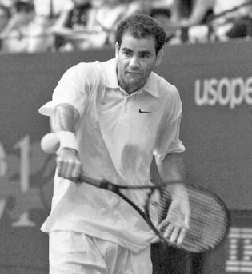
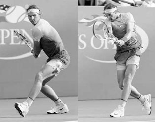
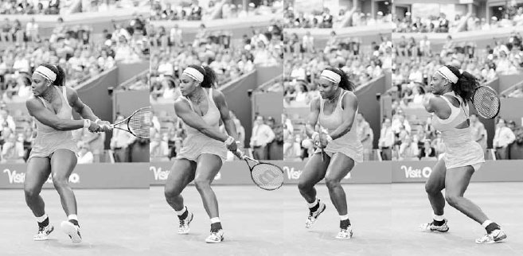
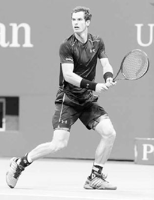
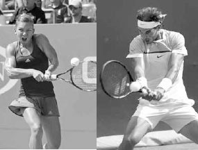
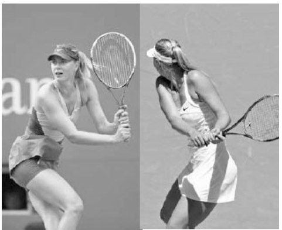
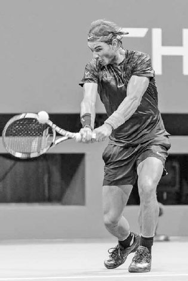
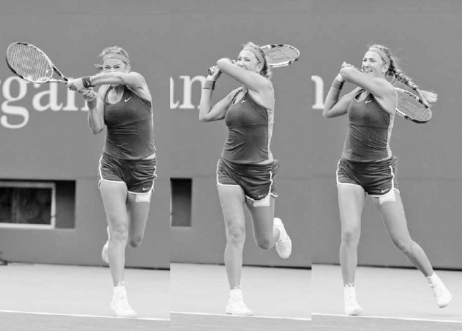
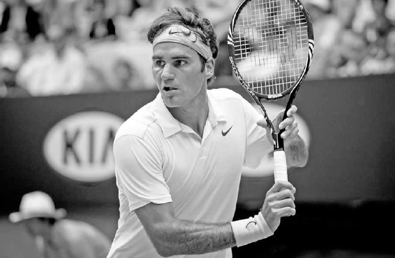
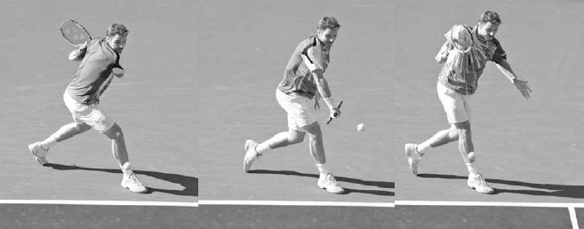

# Đánh trái tay — Một tay & Hai tay

Nhìn chung, trình độ chơi càng cao thì khả năng sử dụng cú trái tay hai tay càng lớn. Tuy nhiên, những người chơi trái tay hai tay đôi khi vẫn cần dùng đến cú trái tay một tay để có thêm tầm với, sự tinh tế và khả năng phòng thủ mà cú đánh này mang lại. Đáng chú ý, do ít gò bó hơn, cú trái tay một tay lại là cách cầm vợt phổ biến nhất trong nhóm người chơi nghiệp dư.

Chương này đề cập đến cú trái tay xoáy lên hai tay và một tay, cũng như cú trái tay cắt. Tôi bắt đầu bằng việc phân tích ưu và nhược điểm của cú trái tay xoáy lên hai tay so với một tay, và gợi ý lý do vì sao cú trái tay \"lai\" có thể xuất hiện như một cú đánh mới trong tương lai. Sau đó tôi sẽ bàn về kỹ thuật trái tay, bắt đầu từ các tư thế đứng khác nhau. Tiếp theo, tôi sẽ trình bày chi tiết các chuyển động phần thân trên giúp bạn đánh ba loại trái tay với đầy đủ sức mạnh và độ kiểm soát: xoay người chuẩn bị, vung vợt ra sau, vung vợt về phía trước đến điểm tiếp xúc, tiếp xúc bóng, và kết thúc động tác. Chương kết thúc với một loạt bài tập trái tay.

**I. Ưu Điểm Của Cú Trái Tay Hai Tay Và Một Tay**
-------------------------------------------------

CÚ TRÁI TAY XOÁY LÊN HAI TAY có nhiều ưu điểm so với phiên bản một tay. Bàn tay phụ trên chuôi vợt giúp tăng sức mạnh và sự ổn định. Điều này đặc biệt hữu ích khi đỡ giao bóng hoặc đối phó với những cú đánh nền xoáy lên nảy cao và nhanh. Bàn tay phụ trên chuôi vợt cũng giúp giữ động tác vung vợt gọn gàng và đều đặn hơn, cho phép bạn kịp đuổi theo bóng khi bị dồn ép, và giữ cú đánh lâu hơn để ngụy trang ý đồ tốt hơn. Cú trái tay hai tay cũng thực hiện nhanh hơn. Bạn cần nhiều thời gian hơn để đánh một cú trái tay xoáy lên một tay tốt, do yêu cầu vung vợt ra sau dài hơn và điểm tiếp xúc sớm hơn. Cuối cùng, cú trái tay hai tay ít phụ thuộc vào tư thế đứng hơn. Tư thế mở không phát huy tốt trên cú trái tay một tay, trong khi với cú trái tay hai tay, bạn có thể dùng những tư thế này để cân bằng tốt hơn, vào vị trí nhanh hơn và hồi vị nhanh hơn.

*Những tay vợt trái tay hai tay như Nadal không cần đẩy chân trước để tạo lực như người chơi trái tay một tay.*

Novak Djokovic và Andy Murray có được nhiều thành công phần lớn nhờ cú trái tay hai tay mạnh mẽ của họ. Trong khi hầu hết các tay vợt chỉ có thể dựa vào cú thuận tay để chủ động trong các pha đôi công cuối sân, Djokovic và Murray còn có thể dùng cú trái tay để mở màn các chuỗi tấn công, đặc biệt là cú trái tay dọc dây. Tuy nhiên, chính ở khâu đỡ giao bóng, cú trái tay hai tay của họ mới thực sự phát huy tác động lớn nhất; cả hai đều đứng gần đầu bảng thống kê đỡ giao bóng của ATP trong gần một thập kỷ qua.(1) Bàn tay phụ trên vợt giúp họ hóa giải hiệu quả lực của những cú giao bóng mạnh và đỡ giao bóng một cách tấn công. Ngược lại, người chơi trái tay một tay thường buộc phải chặn bóng hoặc đỡ nhẹ, khiến họ bắt đầu điểm bóng ở thế bất lợi hơn.

Nếu thực hiện đúng, cú trái tay một tay là một cú đánh đẹp mắt và cũng có những ưu điểm riêng so với cú hai tay. Vì cú trái tay cắt là một cú đánh một tay, người chơi trái tay một tay thường có cú cắt trái tay mạnh hơn nhờ phát triển được sức mạnh và sự phối hợp tốt hơn ở tay đánh bóng. Cú vô lê trái tay, cú bỏ nhỏ, và cú tạt bóng phòng thủ đều là những biến thể của cú trái tay cắt, do đó thường được người chơi trái tay một tay thực hiện tốt hơn. Ngoài ra, một tay có thể vung nhanh hơn hai tay; vì vậy cú trái tay một tay thường có thể tạo xoáy lên nhiều hơn cú hai tay. Và dù phần lớn các tay vợt chuyên nghiệp đánh trái tay hai tay, vẫn có những ngôi sao như Stan Wawrinka và Richard Gasquet dùng phiên bản một tay và được xem là những người có cú trái tay hay nhất từng chơi môn thể thao này.

*Như Richard Gasquet thể hiện, khi thực hiện đúng, cú trái tay một tay là một cú đánh đẹp mắt.*

### **1. CÚ TRÁI TAY \"LAI\"**

Những ưu điểm khác nhau của cú trái tay hai tay và một tay đặt ra một câu hỏi thú vị: liệu môn thể thao này có thể phát triển đến mức một số tay vợt bắt đầu dùng trái tay hai tay để đỡ giao bóng rồi chuyển sang trái tay một tay sau cú đỡ hay không? Việc xuất hiện một cú trái tay \"lai\" đa năng trong tương lai dường như là một khả năng thực sự. Với một số tay vợt, cú trái tay lai có thể là sự kết hợp tốt nhất của cả hai thế giới --- dùng hai tay để xử lý tốc độ của cú giao bóng khi đỡ, rồi tận dụng tốc độ vợt nhanh hơn và sự đa dạng của cú một tay trong pha bóng bền.

### **2. TRÁI TAY NÀO PHÙ HỢP VỚI BẠN?**

Vì cả trái tay một tay và hai tay đều có ưu điểm riêng, câu hỏi đặt ra là xác định phong cách nào phù hợp với bạn. Điều này phần nào phụ thuộc vào độ tuổi. Hầu hết các em nhỏ chưa đủ sức để đánh một cú trái tay xoáy lên một tay tốt cho đến đầu tuổi thiếu niên. Vì vậy, trái tay hai tay thường là cú đánh được dạy trước tiên cho trẻ em.

Do quá trình phát triển dài hơn, những vận động viên trẻ theo đuổi cú trái tay xoáy lên một tay cần kiên nhẫn và có tầm nhìn dài hạn rõ ràng cho tương lai. Pete Sampras nổi tiếng với việc chuyển từ trái tay hai tay sang một tay khi còn là vận động viên trẻ, vì nhận ra rằng điều đó cuối cùng sẽ phù hợp với lối chơi tấn công mà anh hình dung cho bản thân. Ban đầu anh thua một số trận đấu trẻ vì sự thay đổi đó, nhưng chắc chắn đã bù đắp lại nhiều hơn thế sau này với bảy danh hiệu đơn nam Wimbledon. Ngược lại, cựu tay vợt ATP Paul McNamee lại chuyển từ một tay sang hai tay ở tuổi 24. Anh nhanh chóng chứng kiến thứ hạng đơn của mình tăng vọt và trở thành tay vợt đôi số một thế giới.

Bạn có thể cân nhắc phong cách chơi và đặc điểm thể chất, nhưng cuối cùng cú trái tay bạn chọn phụ thuộc vào cảm giác nào tự nhiên và đáng tin cậy hơn. Một số người cảm thấy kém linh hoạt và trôi chảy khi cả hai tay cùng cầm vợt, trong khi những người khác lại cảm thấy cần hai tay mới đánh được cú trái tay xoáy lên chắc chắn. Nếu bạn mới chơi, hãy thử nghiệm cả hai phong cách và rút kinh nghiệm để tìm ra điều phù hợp nhất với mình.

Dù bạn dùng loại trái tay nào, vì trên cú trái tay vai đánh bóng hướng về phía bóng đến thay vì ở phía sau thân người như trên cú thuận tay, nên nhiều phần của động tác vung vợt sẽ khác so với cú thuận tay. Thứ nhất, vung vợt ra sau trên cú trái tay ngắn hơn và điểm tiếp xúc xa hơn về phía trước thân người. Thứ hai, cú trái tay thường đòi hỏi chân trước bước vào cú đánh để tạo đủ sức mạnh, do đó có những nguyên tắc khác về tư thế đứng. Thứ ba, xoay hông trên cú trái tay diễn ra muộn hơn và nhỏ hơn, khiến vợt đi theo một đường dài hơn, thẳng hơn về phía mục tiêu trong giai đoạn vươn vợt. Thứ tư, vì cú trái tay là một động tác vung vợt yếu hơn về mặt thể chất, nó thường là một cú đánh ít tấn công hơn cú thuận tay và thường đảm nhận vai trò chiến thuật khác.

**II. Các Tư Thế Đứng Cho Cú Trái Tay**
---------------------------------------

Tôi sẽ giải thích kỹ thuật trái tay bắt đầu từ đôi chân rồi đi dần lên phần thân trên. Giống như cú thuận tay, một cú trái tay tốt bắt đầu từ bộ pháp chân tốt và đặt chân đúng vào tư thế phù hợp nhất. Bạn sẽ cần nhiều tư thế đứng khác nhau cho các cú trái tay khác nhau, đặc biệt là tư thế đóng và tư thế trung lập, và ở mức độ thấp hơn là tư thế mở.

*Hình dung một lối chơi tấn công lên lưới trong tương lai chuyên nghiệp, Pete Sampras đã chuyển từ trái tay hai tay sang trái tay một tay ngay từ khi còn là vận động viên trẻ.*

### **1. TƯ THẾ ĐÓNG VÀ TƯ THẾ TRUNG LẬP**

Vị trí chân tạo nhiều sức mạnh nhất trên cú trái tay là tư thế đóng. Trong tư thế đóng, chân trước bước một bước chéo lớn về phía trước qua thân người ở góc khoảng 45 độ (hình đối diện, trên). Có bốn lý do chính khiến tư thế đóng tạo ra nhiều sức mạnh nhất. Thứ nhất, bước chân lớn hơn tạo ra lực lớn hơn. Thứ hai, bước chân lớn hơn giúp mở rộng chân đế và hạ thấp gối sâu hơn để bạn có thể tạo thêm năng lượng đẩy lên từ mặt đất. Thứ ba, tư thế đóng tạo ra một cú xoay vai tốt, cho phép thân người bung xoáy mạnh mẽ hơn ở giai đoạn sau của cú đánh. Thứ tư, tư thế đóng giúp hông ở vị trí thuận lợi để đưa vợt về phía trước theo đường trong-ngoài mạnh mẽ hướng về bóng. Tư thế trung lập, nơi bước chân về phía trước thẳng hơn theo hướng lưới (hình dưới), tạo ít sức mạnh hơn tư thế đóng nhưng thường cần thiết với những cú bóng nhanh đánh vào giữa sân.

*Tư thế đóng của Nadal tạo ra một bước chân lớn, mạnh mẽ vào cú trái tay.*

*Đánh ở tư thế trung lập, cú trái tay chéo sân của Ana Ivanovic (trái) có chân trước xoay ít hơn và chân sau ít ở phía sau thân người hơn so với cú trái tay dọc dây của cô (phải).*

KỸ THUẬT Ở cả hai tư thế, trọng lượng cơ thể dồn lên chân trái ở cuối giai đoạn vung vợt ra sau bắt đầu chuyển dịch lên trên khi bạn bước chân phải về phía trước và vung vợt về trước để gặp bóng. Chân phải nên chạm đất trước thời điểm tiếp xúc một khoảnh khắc để giữ đà tiến, đẩy lực từ mặt đất, và ổn định thân người giúp một hoặc hai tay kiểm soát vợt tốt tại thời điểm tiếp xúc bóng.

Cần lưu ý, bước chân phải về phía trước vào cú đánh nên hướng nhiều hơn về phía lưới khi đánh chéo sân so với khi đánh dọc dây. Điều này giúp đẩy đà của bạn về phía mục tiêu. Ngoài ra, trên cú trái tay chéo sân, chân phải sẽ hướng về góc khoảng 10 đến 11 giờ (hình dưới trái), trong khi trên cú trái tay dọc dây, chân phải sẽ hướng nhiều hơn về góc chín đến 10 giờ (hình dưới phải). Những nguyên tắc này giúp bạn đạt được sự chuyển trọng lượng cơ thể về phía trước tối ưu vào cú đánh và căn chỉnh hông tốt tại thời điểm tiếp xúc.

Chân trái sẽ xoay có kiểm soát sang trái trong khi vung vợt về phía trước. Điều này sẽ xoay hông một chút và giúp chuyển năng lượng động học lên trên cơ thể về phía vợt. Bí quyết là không xoay chân trái quá nhiều hoặc quá ít. Nếu chân trái xoay quá nhiều, hông sẽ mở quá sớm và khiến một hoặc hai tay bị gập quá nhiều tại thời điểm tiếp xúc. Nếu chân trái đứng yên, hông sẽ bị khóa và làm giảm đà vào cú đánh.

Sự thăng bằng của bạn ở cuối cú đánh sẽ cho biết bạn có đánh bóng đúng vị trí hay không. Ở cuối động tác, trọng lượng của bạn nên dồn hoàn toàn lên chân phải; sau khi chân trái xoay sang trái, gót chân trái của bạn nên được nhấc lên khỏi mặt đất.

Khi động tác hoàn tất, chân trái của bạn tiếp tục di chuyển sang trái và thực hiện bước hồi vị. Như đã đề cập ở Chương Bảy khi mô tả tư thế trung lập trên cú thuận tay, nếu bạn đã di chuyển ngang nhanh trước cú đánh hoặc đang vung vợt một cách quyết liệt, bước hồi vị sẽ diễn ra tự nhiên trong lúc kết thúc động tác (hình đối diện, trên). Với những cú trái tay đòi hỏi ít di chuyển hơn trước khi vung vợt hoặc mang tính thận trọng hơn, bước hồi vị sẽ diễn ra muộn hơn và có chủ đích hơn (hình đối diện, dưới). Với người chơi nghiệp dư di chuyển và vung vợt chậm hơn các tay vợt chuyên nghiệp, tôi thích thấy mức độ ổn định thân người cao hơn trong khi vung vợt để kiểm soát vợt tốt hơn tại thời điểm tiếp xúc; do đó, bước hồi vị nên diễn ra muộn hơn và có chủ đích hơn.

Một lần nữa, ta có thể thấy các cú đánh hay đều có những điểm tương đồng về kỹ thuật, dù chuyển động trước khi vung vợt có thể thay đổi vị trí thân người và bộ pháp chân. Hãy so sánh vị trí chân trái của Simona Halep và Murray trên cú trái tay của họ (khung hình ba và bảy). Chuyển động ngang của Halep trước cú đánh (khung hình một) tạo ra bước hồi vị sớm hơn (khung hình bốn) so với cú trái tay ít di chuyển hơn của Murray.

### **2. TƯ THẾ MỞ**

Dù tư thế đóng hoặc trung lập là lý tưởng, không phải lúc nào cũng có thể thực hiện được trong một điểm bóng căng thẳng. Đôi khi bạn cần cú trái tay tư thế bán mở hoặc mở. Dù hiếm khi được người chơi một tay sử dụng, cú trái tay tư thế bán mở và mở là những cú đánh quan trọng với người chơi hai tay khi bị dồn ép hoặc với những cú bóng rộng và cao, khi việc bước về phía trước vào cú đánh là điều khó thực hiện.

*Serena Williams cắm chân trái xuống rồi tung hết lực vào cú trái tay tư thế mở này.*

KỸ THUẬT Chìa khóa của cú trái tay tư thế mở và bán mở là xoay vai lớn và cắm chân trái vững chắc, ngang bằng hoặc hơi lùi sau chân phải một chút (hình giữa trái). Chân trái tạo ra một nền tảng vững chắc để chuyển lực vào cú đánh. Khi chân trái chạm đất, hông và vai sẽ bung xoáy và trọng lượng của bạn sẽ chuyển sang chân phải khi vợt vung về phía bóng. Sau khi tiếp xúc và vươn vợt, bạn tiếp tục xoay và kết thúc với trọng lượng dồn phần lớn lên chân phải (hình ngoài cùng phải).

Sau khi đã giải thích các tư thế đứng trên cú trái tay, hãy chuyển sang năm giai đoạn phần thân trên cho cú trái tay hai tay, một tay, và cú trái tay cắt. Vì nhiều nguyên tắc giống với cú thuận tay đã trình bày ở Chương Bảy cũng áp dụng cho cú trái tay, năm giai đoạn sẽ được trình bày ngắn gọn hơn.

**III. Năm Giai Đoạn Của Cú Trái Tay Hai Tay**
----------------------------------------------

### **1. XOAY NGƯỜI CHUẨN BỊ**

Bắt đầu cú trái tay hai tay bằng cách xoay bằng chân trái, nhấc gót chân phải lên, và xoay vai (hình dưới). Khuỷu tay nên gập và thả lỏng với đầu vợt hướng lên trên ở góc khoảng 45 độ so với cổ tay.

Trong lúc thực hiện, hãy chuẩn bị cách cầm vợt. Hầu hết người chơi giữ tay trái ở cổ vợt và đưa xuống nắm cùng tay phải trên chuôi vợt trong lúc xoay người chuẩn bị. Như đã trình bày ở Chương Bốn, tôi khuyên dùng cách cầm continental với tay phải và cách cầm eastern đến eastern mạnh với tay trái.

*Murray bắt đầu cú trái tay bằng động tác xoay người chuẩn bị.*

  ---------------------------------------------------------------------------------------------------------------------------------------------------------------------------------------------------------------------------------------------------------------------------------------------------------------------------------------------
  **HỘP HUẤN LUYỆN VIÊN:**
  **Ở Chương Bốn, chúng ta đã bàn về tầm quan trọng của cách cầm vợt và cách chúng ảnh hưởng đến kỹ thuật; trên cú trái tay hai tay, tác động này đặc biệt đáng chú ý. Dù bạn theo phong cách nào, bạn sẽ dùng nhiều tư thế đứng khác nhau trong một trận đấu, nhưng nên dùng một số tư thế thường xuyên hơn tùy theo cách cầm vợt của bạn.**
  ---------------------------------------------------------------------------------------------------------------------------------------------------------------------------------------------------------------------------------------------------------------------------------------------------------------------------------------------

Trên cú trái tay hai tay, cách cầm vợt của tay đánh bóng sẽ ảnh hưởng đến mức độ gập của cánh tay, từ đó ảnh hưởng đến điểm tiếp xúc và tư thế đứng. Cách cầm continental yếu sẽ khiến cánh tay gập nhiều hơn và đưa điểm tiếp xúc ít về phía trước thân người hơn (hình dưới trái). Trong trường hợp này, tư thế đóng có thể thoải mái hơn. Ngược lại, cách cầm continental mạnh sẽ khiến cánh tay gập ít hơn và đưa điểm tiếp xúc xa hơn về phía trước thân người (hình dưới phải). Trong trường hợp này, các tư thế mở có thể thoải mái hơn.

*Simona Halep và Nadal dùng cách cầm trái tay khác nhau, dẫn đến mức độ gập tay và tư thế đứng ưa thích khác nhau.*

### **2. VUNG VỢT RA SAU**

Sau khi hoàn tất xoay người chuẩn bị, hãy dùng cánh tay và tiếp tục xoay vai để đưa vợt đến cuối giai đoạn vung vợt ra sau. Trong lúc thực hiện, hãy nhớ giữ cánh tay và vai thả lỏng. Vai càng ít căng thì vung vợt ra sau càng dài và vợt càng có thể trễ lại và tăng tốc nhiều hơn trong cú vung về phía trước.

Một cú vung vợt ra sau đầy đủ sẽ khiến cằm bạn tựa gần vai phải. Dù vai thả lỏng, cú vung vợt ra sau đầy đủ vẫn nên tạo một chút căng ở phía sau vai phải để bật vợt về phía trước nhanh hơn. Điểm kết thúc của vung vợt ra sau nên đồng bộ với việc dồn trọng lượng lên chân sau và đưa thân người vào tư thế hơi khuỵu, sẵn sàng bung ra sức mạnh tích lũy trong cơ thể về phía trước vào cú đánh (hình phải).

Có hai kiểu vung vợt ra sau chính trên cú trái tay: kiểu hình chuối và kiểu vòng cung.

*Dùng kiểu vung vợt ra sau hình chuối, Djokovic hạ tay xuống dưới eo trước khi nâng lên lại ở cuối giai đoạn vung vợt ra sau.*

### **A. VUNG VỢT RA SAU KIỂU HÌNH CHUỐI**

Vung vợt ra sau kiểu hình chuối bắt đầu bằng việc đưa tay xuống dưới eo rồi ra sau theo một đường thẳng trước khi nâng lên nhẹ ở cuối giai đoạn vung vợt ra sau (hình dưới). Vợt kết thúc giai đoạn vung ra sau hơi lệch sang trái, hay \"phía ngoài\" thân người (trang kế, phải), đặt cổ tay vào vị trí mạnh mẽ để trễ vợt khi hông xoay và thực hiện chuyển động cần gạt nước để tăng tốc độ đầu vợt và độ xoáy lên.

Người chơi dùng kiểu vung vợt ra sau hình chuối thường dùng cách cầm continental mạnh hoặc continental với tay đánh bóng. Sức mạnh trên cú trái tay này chủ yếu đến từ việc dùng chân đẩy lên từ mặt đất và vung vợt như một khối thống nhất hơn là chủ yếu dùng cánh tay. Đây là kiểu vung vợt ra sau phổ biến nhất trên ATP Tour và có ưu điểm gọn gàng, giữ vai thoải mái, và tạo xoáy lên tốt.

### **B. VUNG VỢT RA SAU KIỂU VÒNG CUNG**

Vung vợt ra sau kiểu vòng cung bắt đầu bằng việc đưa tay ra sau theo hình vòng tròn (hình dưới trái) và kết thúc xa hơn về phía sau thân người (hình dưới phải), hay \"phía trong,\" so với kiểu hình chuối. Ngoài ra, so với kiểu hình chuối, cánh tay gập nhiều hơn tại thời điểm tiếp xúc và cổ tay di chuyển về phía trước nhiều hơn, ít hướng lên hơn, tạo ra một cú đánh phẳng hơn.

Người chơi dùng kiểu vung vợt ra sau vòng cung thường dùng cách cầm continental yếu hoặc continental với tay đánh bóng. Sức mạnh trên cú trái tay này được tạo ra nhiều hơn từ chuyển động dài hơn của cánh tay và hông thay vì di chuyển thân người như một khối và dùng chân đẩy lên từ mặt đất. Vung vợt ra sau kiểu vòng cung tạo ra một cú đánh phẳng, mạnh mẽ và thường được sử dụng trên WTA.

Dù bạn dùng kiểu vung vợt ra sau nào, ở cuối giai đoạn vung ra sau, vợt nên ở ngay trên mức ngang eo và hướng hơi lên trên, về phía hàng rào sau sân (hình phải). Cạnh đầu vợt nên gần như vuông góc với mặt đất để đơn giản hóa việc căn thời gian và giữ cánh tay thả lỏng. Đây chính là vị trí tương đương với vị trí quyền lực trên cú thuận tay. Với vị trí này được thiết lập, vợt ở một vị trí mạnh mẽ để chuyển từ vung vợt ra sau sang vung vợt về phía trước.

*Trong vung vợt ra sau kiểu vòng cung, Maria Sharapova đưa vợt ra sau theo hình vòng tròn (trái) và \"phía trong\" (phải) để kết thúc vung vợt ra sau ở vị trí quyền lực.*

*Djokovic giữ vợt về phía trái, hay \"phía ngoài,\" để kết thúc vung vợt ra sau kiểu hình chuối ở vị trí quyền lực.*

### **3. VUNG VỢT VỀ PHÍA TRƯỚC ĐẾN ĐIỂM TIẾP XÚC**

Sau khi hoàn tất vung vợt ra sau, cú vung về phía trước bắt đầu bằng việc hạ vợt xuống và chân phải kết thúc bước tiến bằng cách chạm đất (hình đối diện, ngoài cùng trái). Sau khi chân phải chạm đất, vai trái và hông bắt đầu xoay, giải phóng năng lượng tích lũy trong chân và chuyển nó về phía thân trên, cánh tay, và cuối cùng là vợt.

Việc xoay hông sẽ khiến các cơ cẳng tay giãn ra, làm đầu vợt trễ lại phía sau (hình giữa trái). Sau đó tay phải kéo đế vợt về phía trước hướng về bóng để trễ vợt thêm một lần nữa.

Sau khi tay phải kéo đế vợt về phía trước, tay trái bắt đầu tiếp quản bằng cách xoay đế vợt về phía thân người và giải phóng đầu vợt về phía trước để gặp bóng (hình giữa và ngoài cùng phải). Chính tay trái tạo ra phần lớn độ xoáy và tốc độ vợt, trong khi tay phải chủ yếu chịu trách nhiệm định hướng cú đánh.

Hai cánh tay và cổ tay phối hợp để đưa đầu vợt theo đường trong-ngoài về phía bóng. Nếu đánh xoáy lên, cổ tay di chuyển lên trên để thực hiện \"chuyển động cần gạt nước\" cho vợt và cũng hơi tiến về phía trước để tăng lực và vuông vợt tại thời điểm tiếp xúc. Cũng như trên cú thuận tay, cú vung cần có sự kết hợp đúng giữa việc đầu vợt di chuyển về phía trước (để tạo lực) và lên trên (để tạo xoáy lên) trong một nỗ lực duy nhất để tạo ra cú đánh mạnh mẽ và ổn định.

*Flavia Pennetta cắm chân phải xuống đất để giữ đà tiến rồi tăng tốc vợt hơi khép từ thấp lên cao để xuyên qua bóng.*

Khi cổ tay di chuyển lên trên và về phía trước trước thời điểm tiếp xúc, chúng tiếp tục đi lên để tạo xoáy lên, nhưng chuyển động về phía trước chậm lại một khoảnh khắc ngay trước tiếp xúc để kiểm soát va chạm bóng và định hướng cú đánh.

### **4. TIẾP XÚC BÓNG**

Với đầu giữ yên và mắt nhìn xuống bóng, tiếp xúc bóng phía trước thân người. Giữ đầu yên khi bạn xoay vai qua cú đánh giúp giữ vững ngực và tạo sức mạnh, sự ổn định cho cánh tay (hình trái). Trừ khi điểm tiếp xúc cao, vai của bạn nên khá ngang bằng tại thời điểm tiếp xúc để cân bằng tốt.

  ------------------------------------------------------------------------------------------------------------------------------------------------------------------------------------------------------------------------------------------------------
  **HỘP HUẤN LUYỆN VIÊN:**
  **Nếu bạn thiếu độ vươn vợt tốt trên cú trái tay hai tay, hãy tập đánh một quả bóng biển có trọng lượng trên không từ vạch giao bóng. Bạn sẽ thấy nếu không xuyên \"qua\" bóng và vươn vợt trọn vẹn, quả bóng biển sẽ không bay đủ xa để qua lưới.**
  ------------------------------------------------------------------------------------------------------------------------------------------------------------------------------------------------------------------------------------------------------

Tại thời điểm tiếp xúc, tay phải của bạn nên gập nhiều hơn một chút so với tay trái. Cánh tay hơi gập tạo đòn bẩy tốt cho sức mạnh tạo ra từ chân và hông. Điều này cũng cho phép tay trái duỗi thẳng hơn một chút và đẩy vợt xuyên qua bóng, giúp bạn đánh với độ vươn vợt tốt (hình phải). Cánh tay gập quá nhiều tại thời điểm tiếp xúc sẽ làm giảm đáng kể độ vươn vợt, trong khi cánh tay quá thẳng sẽ tạo ra điểm tiếp xúc quá xa thân người để kiểm soát vợt hiệu quả.

*Nadal giữ đầu yên và vai ngang bằng khi tiếp xúc bóng phía trước thân người.*

Vì vai đánh bóng ở phía trước trên cú trái tay, vợt đi theo một đường dài hơn, thẳng hơn về phía mục tiêu sau khi tiếp xúc so với cú thuận tay. Nếu hình ảnh tưởng tượng của cú thuận tay là bạn đánh xuyên qua ba quả bóng xếp thành hàng, thì trên cú trái tay con số đó tăng lên năm quả để kéo dài vùng đánh bóng. Để giúp bạn đạt được điều này, hãy tưởng tượng bạn đang đánh dọc theo một đường bowling và cây ky đầu tiên chính là mục tiêu của bạn.

### **5. KẾT THÚC ĐỘNG TÁC**

Sau khi đánh xuyên qua năm quả bóng tưởng tượng, giai đoạn kết thúc động tác bắt đầu với khuỷu tay gập khi vợt đi lên, sang phải, ra sau, và cuối cùng kết thúc bằng cách quấn quanh vai phải theo một chuyển động mượt mà, thả lỏng (hình dưới). Như vậy, cú vung hoàn tất một vòng khép kín với vai trái kết thúc dưới cằm sau khi bắt đầu với khuỷu tay phải dưới cằm ở cuối giai đoạn vung vợt ra sau.

Trên các cú trái tay phẳng đến xoáy lên vừa phải, bạn nên kết thúc động tác với các khớp ngón tay trái nghỉ gần tai phải, và khuỷu tay trái ngang vai, hướng về mục tiêu và hơi cao hơn khuỷu tay phải.

Nếu bạn đánh bóng với độ xoáy lên nhiều hơn, vợt sẽ kết thúc thấp hơn, với khuỷu tay gần thân người hơn do đường vòng cầu vồng của đầu vợt khi nó quét ngang qua thân người.

*Ngay sau khi tiếp xúc, tay trái của Kei Nishikori duỗi thẳng và vợt tiếp tục di chuyển về phía trước song song với mục tiêu của anh.*

*Victoria Azarenka kết thúc động tác bằng cách quấn vợt qua vai phải với khuỷu tay trái ngang vai, hướng về mục tiêu.*

**IV. Năm Giai Đoạn**
---------------------

  ---------------------------------------------------------------------------------------------------------------------------------------------------------------------------------------------------------
  **HỘP HUẤN LUYỆN VIÊN:**
  **Hãy tưởng tượng bạn đang đeo một chiếc đồng hồ trên cổ tay trái. Nếu cú kết thúc động tác trái tay hai tay của bạn được thực hiện đúng, bạn sẽ có thể liếc nhìn cổ tay và dễ dàng đọc được đồng hồ.**
  ---------------------------------------------------------------------------------------------------------------------------------------------------------------------------------------------------------

ANDY MURRAY SỞ HỮU MỘT TRONG NHỮNG CÚ TRÁI TAY HAI TAY HAY NHẤT mà môn thể thao này từng chứng kiến. Đó là một cú đánh phẳng, nhanh và cực kỳ chính xác, rất khó đoán trước.

Trong khung hình đầu tiên, ta thấy anh vào tư thế hoàn hảo ở cuối giai đoạn vung vợt ra sau: cằm trên vai, cạnh vợt hướng lên trên, với tư thế đứng rộng để tăng sức mạnh và sự ổn định. Anh cầm vợt bằng cách cầm continental ở tay đánh bóng, giúp tiếp cận nhanh một trong những cú đánh ưa thích: cú bỏ nhỏ.

Trong khung hình hai, hông anh xoay để trễ vợt và cổ tay hạ đầu vợt xuống để khởi động cú vung từ thấp lên cao. Trong khung hình ba, anh tiếp xúc bóng phía trước thân người và xuyên qua bóng với đầu giữ yên. Trong khung hình bốn, ta thấy kết quả của việc Murray sử dụng rõ rệt tay trái để tăng tốc độ vợt. Một số người chơi trái tay hai tay dùng tay trái nhiều hơn người khác, và Murray chắc chắn dùng nhiều hơn hầu hết. Ở đây, ta thấy tay phải của anh nhường vai trò cho tay trái khi tay trái bật vợt về phía trước để tăng lực cho cú trái tay xuyên phá. Sự chi phối của tay trái cho phép anh giữ hông ổn định hơn và thêm phần ngụy trang, đánh lừa đối phương cho cú đánh. Trong khung hình năm, Murray kết thúc lực đẩy chân và hoàn tất cú vung trong tư thế cân bằng với trọng lượng dồn hoàn toàn lên chân phải và chân trái tựa nhẹ trên mũi chân. Trong khung hình sáu, vợt kết thúc quấn quanh vai phải với khuỷu tay trái hướng về mục tiêu. Thân người anh kết thúc ở vị trí hoàn hảo để thực hiện bước hồi vị và nhanh chóng trở về giữa vạch cuối sân.

*Federer nghiêng đầu vợt lên trên và giữ khuỷu tay gập, thả lỏng trong lúc xoay người chuẩn bị.*

Của Cú Trái Tay Xoáy Lên Một Tay

### **1. XOAY NGƯỜI CHUẨN BỊ**

Cú vung một tay dài hơn cú vung hai tay, vì vậy điều quan trọng là bắt đầu xoay người chuẩn bị sớm hơn để vung vợt ra sau được đầy đủ và cú vung về phía trước trôi chảy. Tay trái giữ cổ vợt, dẫn vợt ra sau, và giúp xoay vai. Tay phải giữ vợt nhẹ nhàng, cho phép tay trái xoay vợt vào cách cầm trái tay ưa thích của bạn.

Đầu vợt hướng lên trên với hai tay ở khoảng ngang ngực và khuỷu tay gập, thả lỏng (hình trên). Việc hướng đầu vợt lên trên trong lúc xoay người chuẩn bị rất quan trọng vì nó làm tăng tốc độ vợt khi vợt hạ xuống sau đó. Nhiều tay vợt chuyên nghiệp hàng đầu thích hướng đầu vợt lên khoảng 90 độ trong lúc xoay người chuẩn bị, nhưng với người chơi nghiệp dư, tôi khuyên nên nghiêng vợt lên khoảng 45 độ để đơn giản hóa việc căn thời gian.

### **2. VUNG VỢT RA SAU**

Sau khi vào tư thế xoay người chuẩn bị, vợt bắt đầu vung ra sau với hai tay vẫn ở khoảng ngang ngực và khuỷu tay vẫn gập (hình đối diện, trên trái). Mặt vợt nên hơi mở để thả lỏng cánh tay và đưa cổ tay vào vị trí mạnh mẽ để tăng tốc vợt trong cú vung về phía trước. Ở cuối giai đoạn vung ra sau, mặt vợt khép lại và vòng xuống (hình đối diện, trên phải).

Vai của bạn nên xoay nhiều hơn hông trong giai đoạn vung ra sau, và cú xoay vai đầy đủ này phần lớn phụ thuộc vào việc thực hiện một cú vung ra sau trọn vẹn. Các mốc kiểm tra tốt để đảm bảo vung ra sau đầy đủ là đảm bảo tay của bạn đã qua khỏi hông và cằm tựa gần vai (hình dưới trái). Như đã đề cập với cú trái tay hai tay, nếu vung ra sau đầy đủ, bạn nên cảm thấy một chút lực cản ở phía sau vai phải; lực cản này giúp bật vợt về phía trước nhanh hơn.

*Stan Wawrinka xoay vai và bắt đầu vòng vợt xuống ở cuối giai đoạn vung vợt ra sau.*

### **3. VUNG VỢT VỀ PHÍA TRƯỚC ĐẾN ĐIỂM TIẾP XÚC**

Khi vợt kết thúc vòng xuống để bắt đầu cú vung về phía trước, chân phải chạm đất để giữ đà tiến. Tiếp theo, hông xoay một lượng nhỏ, khiến vợt trễ lại. Sau đó đế vợt được kéo nhanh về phía trước, hướng về bóng (hình dưới giữa) để trễ vợt thêm và đưa vợt vào vị trí mạnh mẽ để tăng tốc về phía trước gặp bóng.

*Stan Wawrinka cắm chân phải xuống đất để giữ đà tiến rồi duỗi thẳng tay đánh bóng và vung về phía trước, giữ đầu cúi và yên.*

Khi vợt di chuyển về phía trước đến điểm tiếp xúc, cổ tay cũng di chuyển về phía trước để xoay đế vợt về phía thân người, vuông mặt vợt với mục tiêu. Cổ tay cũng đưa vợt lên trên để lướt qua bóng và tạo xoáy lên (hình dưới phải). Cần lưu ý, khác với xoáy lên trên cú thuận tay, vốn chủ yếu được tạo ra bởi cổ tay và cẳng tay, xoáy lên trên cú trái tay chủ yếu được tạo ra bởi chuyển động đi lên của cổ tay và việc nâng cánh tay.

Cánh tay duỗi thẳng khi đưa vợt về phía trước. Ở đây, điều quan trọng là khuỷu tay phải giữ thấp và lướt sát thân người. Hiện tượng \"khuỷu tay bay\" đáng sợ, khi khuỷu tay nâng lên và gập trong cú vung về phía trước, sẽ khiến đầu vợt tụt xuống dưới cổ tay, hạn chế tốc độ vợt và độ xoáy lên. Nếu khuỷu tay giữ thấp, vợt có thể thực hiện một cú vung trong-ngoài mạnh mẽ (hình dưới), và cánh tay sẽ ở vị trí thoải mái để nâng đầu vợt, thêm xoáy lên cho cú đánh của bạn.

### **4. TIẾP XÚC BÓNG**

Bạn nên tiếp xúc bóng ở khoảng cách khoảng 60cm phía trước chân phải với đầu giữ yên và tay đánh bóng duỗi thẳng hoàn toàn (hình phải). Sau khi tiếp xúc, đầu vợt tiếp tục xoay lên và vươn về phía trước, hướng song song với mục tiêu và vẫn ở bên trái thân người.

Khi tay phải di chuyển về phía trước sau tiếp xúc, tay trái di chuyển ra sau và ở phía sau thân người để tăng cường sự cân bằng, làm chậm và hạn chế xoay hông. Hông có thể xoay một chút, nhưng bất kỳ chuyển động quá mức nào của hông cũng sẽ làm giảm độ vươn vợt và tạo ra một cú đánh thiếu lực và kiểm soát. Xoay hông là nhỏ, đặc biệt khi đánh trái tay dọc dây. Trên cú trái tay chéo sân, điểm tiếp xúc xa hơn về phía trước và hông sẽ xoay nhiều hơn.

*Vị trí khuỷu tay thấp và sát thân người của Federer tạo ra một cú vung trong-ngoài mạnh mẽ và giúp anh thêm xoáy lên cho cú trái tay.*

*Richard Gasquet tiếp xúc bóng khá xa phía trước thân người với vợt di chuyển về phía trước song song với mục tiêu.*

### **5. KẾT THÚC ĐỘNG TÁC**

Sau khi vợt vươn song song với mục tiêu, nó khép lại và quét lên, ngang qua bên phải (hình trái). Ở đây, tay phải thẳng thể hiện độ vươn vợt và tốc độ vợt tốt xuyên qua tiếp xúc. Ở cuối động tác, tay phải của bạn nên kết thúc hơi cao hơn tầm mắt với đế vợt hướng về phía lưới và tay trái ở phía sau thân người (hình phải). Vợt nên dừng lại ở phía bên phải đầu bạn, giữa vị trí một giờ và hai giờ, tùy theo hướng và lực của cú trái tay.

**V. Cú Trái Tay Cắt**
----------------------

DÙ XOÁY LÊN CHIẾM ƯU THẾ trong lối chơi sức mạnh hiện đại, cú trái tay cắt vẫn là một cú đánh thiết yếu. Trong lối chơi ngày nay, nhiều tay vợt cảm thấy thoải mái nhất khi họ đang trong nhịp điệu dồn dập những cú xoáy lên cao ngang ngực. Cú trái tay cắt có thể giữ bóng thấp và ra khỏi vùng đánh bóng ưa thích của đối phương, phá vỡ nhịp điệu của họ bằng cách thay đổi tốc độ và quỹ đạo bóng so với những cú xoáy lên trước đó.

*Những cú trái tay một tay hay nhất là những chuyển động dài, quét rộng. Ở đây, Federer kết thúc cú trái tay một tay với tay đánh bóng cao và duỗi thẳng hoàn toàn.*

  -----------------------------------------------------------------------------------------------------------------------------------------------------------------------------------------------------------------------------------------------------------------------------------------------------------------------------------------------------------------------------------------------------------------------------------------------------------------------------------------------------------------------------------------------------------------------------------------------------------------------------------------------------------------------------------------------------------------------------------------------------------------
  **HỘP HUẤN LUYỆN VIÊN:**
  **Mỗi cú đánh nền xoáy lên đều bao gồm một phần \"giải phóng\" (hay trễ vợt) để tạo lực, và một phần \"giữ\" để kiểm soát tại thời điểm tiếp xúc. Một cú vung cứng nhắc không giải phóng sẽ thiếu gia tốc tốt, trong khi một cú vung quá nhiệt tình sẽ thiếu ổn định. Những tay vợt cuối sân giỏi có thể dùng đúng tỷ lệ của mỗi yếu tố tùy theo ý đồ và tình huống. Khi đánh tấn công vào một quả bóng chậm hoặc dùng xoáy lên nặng, cú vung của họ sẽ có nhiều \"giải phóng\" hơn, còn khi nhận một quả bóng nhanh hoặc dùng ít xoáy lên hơn, cú vung sẽ thận trọng hơn. Đánh giá tình huống và tìm ra tỷ lệ giải phóng/giữ đúng trên các cú đánh nền là yếu tố then chốt để đánh với sự tấn công có kiểm soát --- một lối chơi chiến thắng ở mọi trình độ.**
  -----------------------------------------------------------------------------------------------------------------------------------------------------------------------------------------------------------------------------------------------------------------------------------------------------------------------------------------------------------------------------------------------------------------------------------------------------------------------------------------------------------------------------------------------------------------------------------------------------------------------------------------------------------------------------------------------------------------------------------------------------------------

HIẾM CÓ TAY VỢT NÀO CÓ CÚ TRÁI TAY MỘT TAY làm vũ khí chính, nhưng đó lại chính là trường hợp của Richard Gasquet. Cú trái tay một tay của anh có sức mạnh và độ xoáy phi thường, cho phép anh áp đảo các pha đôi công cuối sân và giúp anh có thứ hạng top mười thế giới.

Gasquet kết thúc vung vợt ra sau cao hơn hầu hết các tay vợt chuyên nghiệp. Điều này có thể gây khó khăn cho việc căn thời gian, nhưng với những tay vợt điêu luyện như Gasquet, nó dẫn đến gia tốc vợt lớn hơn nhờ vợt hạ nhanh hơn vào đầu cú vung về phía trước. Trong khung hình đầu tiên, cú vung vợt ra sau đầy đủ kéo vai phải anh ra sau và đặt cằm anh tựa đúng trên vai phải. Trong khung hình hai, chân phải của Gasquet chạm đất để giữ đà từ việc bước về phía trước. Hãy chú ý cách chân phải anh đặt ở góc 45 độ so với lưới để đưa hông vào vị trí hoàn hảo cho cú trái tay chéo sân. Tư thế đứng rộng của anh không chỉ khiến bước tiến dài hơn và mạnh hơn, mà còn tăng thêm sự nâng đỡ cho thân trên, cho phép cánh tay vung với lực lớn hơn. Trong khung hình ba, cánh tay anh tiếp tục duỗi thẳng và giữ sát thân người. Vợt anh tăng tốc thêm khi hạ xuống và bắt đầu đường đi trong-ngoài về phía bóng. Trong khung hình bốn, ta thấy đầu vợt của Gasquet trễ lại sau tay anh trước khi tiếp xúc. Từ điểm này của cú vung, vai sẽ đưa vợt về phía trước, nhưng chính chuyển động của cổ tay và cẳng tay mới là yếu tố chủ yếu tăng tốc đầu vợt với tốc độ bùng nổ hướng đến điểm tiếp xúc. Trong khung hình năm, Gasquet giữ vợt ở bên trái thân người và vươn vợt về phía mục tiêu. Hãy chú ý cách vợt anh đã xoay lên giữa khung hình bốn và năm, thêm xoáy lên cho cú đánh để kiểm soát tốt hơn. Trong khung hình sáu, vợt của Gasquet quét sang phải với cánh tay duỗi thẳng hoàn toàn khi anh thực hiện kết thúc động tác. Khi vai anh tiếp tục bung xoáy, anh giữ hông đứng yên bằng cách đưa tay trái ra sau. Chỉ khi động tác đã hoàn tất, Gasquet mới ngước lên để xem cú đánh của mình và bắt đầu quá trình hồi vị.

Quan trọng hơn, khác với cú trái tay xoáy lên, một cú trái tay cắt tốt vẫn có thể được thực hiện với chân trước bước ngang song song với vạch cuối sân (hình đối diện). Đây là lý do vì sao cú đánh này lại hiệu quả như một cú đánh phòng thủ; nó có thể được thực hiện tốt trong lúc di chuyển ngang với rất ít hoặc không có đà tiến về phía trước. Ngoài ra, với một cú bóng rộng, khó khăn, điểm tiếp xúc muộn hơn của cú trái tay cắt cho phép nhiều thời gian hơn để đánh bóng, và vì độ xoáy ngược khiến cú đánh ít lực hơn, nó cũng cho nhiều thời gian hơn để hồi vị. Cú trái tay cắt hữu ích trong nhiều tình huống khác. Nó có thể được dùng như một cú đánh tiếp cận tấn công tạo ra một quả bóng trượt thấp, buộc đối phương phải cố gắng thực hiện một cú passing shot khó khăn, hoặc để kéo đối phương lên phía trước vào trong vạch cuối sân, mở sân cho cú đánh tiếp theo của bạn. Nó cũng có thể dẫn đến những cú bỏ nhỏ được ngụy trang tốt. Sau khi vào tư thế vung vợt ra sau thông thường của cú trái tay cắt, bạn có thể nhanh chóng thay đổi cung đường của cú vung về phía trước để thực hiện một cú bỏ nhỏ được che giấu. Đây không chỉ là một cú đánh linh hoạt; nó còn đòi hỏi ít sức mạnh, ít thời gian căn chỉnh và chuẩn bị hơn cú trái tay xoáy lên. Điều này khiến nó dễ thực hiện hơn theo nhiều cách. Kết quả là, cú trái tay cắt được sử dụng thường xuyên hơn cú trái tay xoáy lên ở trình độ nghiệp dư.

Vì cú trái tay cắt được sử dụng rất nhiều, khác với cú thuận tay cắt ít khi được dùng, một lời giải thích đầy đủ về năm giai đoạn của cú vung này là điều cần thiết. Cú đánh này có sự thống nhất lớn về phong cách và ít gây tranh cãi về mặt kỹ thuật được khuyến nghị. Ví dụ, những tay vợt như Djokovic và Federer có thể có những khác biệt đáng chú ý trong kỹ thuật thuận tay xoáy lên của họ, nhưng sự khác biệt trong cú trái tay cắt của họ lại tinh tế hơn nhiều.

Feliciano Lopez vào tư thế cho cú trái tay cắt bằng cách xoay vai và chuẩn bị vợt.

### **1. XOAY NGƯỜI CHUẨN BỊ**

Bắt đầu cú trái tay cắt bằng cách đặt tay phải vào cách cầm continental và tay trái vào cổ vợt. Như với bất kỳ cú đánh nào, cách cầm vợt là yếu tố then chốt. Nếu bạn dùng cách cầm eastern thuận tay, mặt vợt sẽ quá mở và cú đánh sẽ thiếu lực. Nếu bạn dùng cách cầm eastern trái tay, khuỷu tay sẽ nâng lên trong cú vung về phía trước và khiến đầu vợt tụt xuống quá nhiều tại thời điểm tiếp xúc. Sau khi thiết lập cách cầm continental, hãy xoay vai, mở mặt vợt, và đặt vợt ở khoảng ngang vai (hình đối diện).

*Federer kết thúc vung vợt ra sau trên cú trái tay cắt với cánh tay hơi gập và vợt ngang vai.*

### **2. VUNG VỢT RA SAU**

Sau khi vào tư thế xoay người chuẩn bị, đưa vợt ra sau và xoay thân người sao cho ngực hướng về hàng rào biên và đầu bạn nhìn qua vai phải khi căn chỉnh cú đánh. Vợt nên ở khoảng ngang vai ở cuối giai đoạn vung ra sau với tay phải hơi gập, tạo thành hình chữ V. Mặt vợt nên mở, trong khi bản thân vợt nên tạo hình chữ L với cẳng tay và gần như song song với vạch cuối sân (hình trên).

### **3. VUNG VỢT VỀ PHÍA TRƯỚC ĐẾN ĐIỂM TIẾP XÚC**

Với mặt vợt mở và ở vị trí phía trên điểm tiếp xúc ở cuối giai đoạn vung ra sau (hình trái), đẩy vợt về phía trước bằng phần trước vai trong khi duỗi thẳng cánh tay và giữ cổ tay chắc (hình giữa). Nếu bạn quá gần bóng, khuỷu tay sẽ gập và đầu vợt sẽ tụt xuống dưới cổ tay, gây mất lực và kiểm soát. Trừ khi bóng thấp, hãy giữ đầu vợt trên cổ tay tại thời điểm tiếp xúc và nhắm đánh hơi vòng ra phía ngoài bóng.

Khác với đường vòng từ thấp lên cao của cú trái tay xoáy lên, đường vòng của cú vung trái tay cắt giống hình chiếc võng, di chuyển từ cao xuống thấp rồi lại lên cao (hình dưới). Tuy nhiên, nếu bạn cố tạo nhiều xoáy hơn, vợt sẽ bắt đầu cao hơn và cú vung xuống sẽ có góc dốc hơn. Độ cao của bóng cũng ảnh hưởng đến đường đi của vợt. Bóng càng cao, độ dốc xuống càng lớn; bóng thấp hơn sẽ có đường vung phẳng hơn.

Ngoài đường vòng của cú vung, còn có hai điểm khác biệt đáng kể cần lưu ý khi so sánh cú vung về phía trước trên trái tay cắt với trái tay xoáy lên. Thứ nhất, khác với trái tay xoáy lên, khi vợt di chuyển về phía trước, lực từ xoay hông và sự giãn-co của cơ tay được cần đến ít hơn nhiều. Ở đây, hông giữ yên và cổ tay, cẳng tay di chuyển rất ít khi cánh tay đưa về phía trước để đánh bóng. Thứ hai, cú trái tay xoáy lên cần thời gian sau khi chân chạm đất để giải phóng năng lượng đi lên từ chân vào cú vung. Cú trái tay cắt không cần sự giải phóng năng lượng tương tự, do đó bước tiến nên diễn ra hơi muộn hơn và tận dụng nhiều hơn đà tuyến tính về phía trước, thay vì đà góc đi lên.

*Vợt của Richard Gasquet đi theo đường hình chiếc võng trên cú trái tay cắt này.*

### **4. TIẾP XÚC BÓNG**

Mặt vợt vốn mở khi bắt đầu cú vung về phía trước (hình đối diện, trái) sẽ vuông lại với bóng, gần như vuông góc với mặt đất tại thời điểm tiếp xúc (hình phải). Mở mặt vợt quá nhiều tại thời điểm tiếp xúc là lỗi tôi thường thấy người chơi mắc phải, khiến bóng bật lên mà thiếu lực và kiểm soát. Điều quan trọng cần hiểu là bạn không cần ép tạo xoáy ngược bằng một cú vung xuống dứt khoát và mặt vợt mở quá nhiều. Xoáy ngược sẽ diễn ra tự nhiên với một góc xuống nhẹ nhàng và mặt vợt hơi mở.

*Roberta Vinci đẩy vợt về phía trước bằng vai bằng cách duỗi thẳng cánh tay và giữ cổ tay chắc.*

Điểm tiếp xúc trên cú trái tay cắt sẽ ít về phía trước hơn và xa thân người hơn so với điểm tiếp xúc trên cú trái tay xoáy lên. Điểm tiếp xúc sẽ thay đổi tùy theo hướng cú đánh, nhưng nhìn chung, nó nên xảy ra ở khoảng 30cm hoặc ít hơn phía trước chân phải, so với khoảng 60cm phía trước khi đánh cú trái tay xoáy lên một tay.

Sau khi tiếp xúc, đầu vợt mở ra và hạ xuống khi tiếp tục đường đi từ cao xuống thấp về phía trước (hình trên). Tay trái di chuyển ra sau để giữ thăng bằng và giúp bạn đẩy vợt về phía mục tiêu. Nếu tay trái của bạn đưa về phía trước, hông sẽ xoay và vợt sẽ bị kéo quá nhanh sang phải. Đầu bạn nên giữ vững và chỉ nên di chuyển sau khi xuyên qua bóng, khi nó ngước lên để xem vị trí cú đánh.

  ---------------------------------------------------------------------------------------------------------------------------------------------------------------------------------------------------------------------------------------------------------------------------------------------------------------
  **HỘP HUẤN LUYỆN VIÊN:**
  **Một vấn đề thường gặp trên cú trái tay cắt là chặt xuống quá gắt qua thời điểm tiếp xúc. Để giúp những người chơi có thói quen này, tôi yêu cầu họ tưởng tượng có một mặt bàn kính bên dưới đường vung trái tay cắt của mình và thực hiện cú vung theo cách phẳng hơn, lướt qua chứ không làm vỡ mặt bàn.**
  ---------------------------------------------------------------------------------------------------------------------------------------------------------------------------------------------------------------------------------------------------------------------------------------------------------------

*Djokovic vuông mặt vợt để tiếp xúc và đưa tay trái ra sau để hỗ trợ thăng bằng.*

ÍT CÓ TAY VỢT NÀO TỪNG ĐÁNH CÚ TRÁI TAY CẮT với nhiều tốc độ và độ xoáy như Roger Federer. Cú trái tay cắt của anh thậm chí có nhiều vòng quay bóng hơn cả cú thuận tay xoáy lên đáng gờm của anh.(2) Việc sử dụng cú đánh này thường tạo ra những quả bóng ngắn cho phép anh tiến lên và tấn công.

Federer phòng thủ quả bóng rộng này bằng một sải chân dài, mạnh mẽ song song với vạch cuối sân. Một trong những ưu điểm lớn của cú trái tay cắt là bạn có thể bước ngang và vẫn đánh được một cú đánh tuyệt vời. Trong khung hình một, anh vào tư thế với vai xoay, khuỷu tay gập và thả lỏng, vợt mở và ngang vai. Hãy chú ý cách anh giữ thăng bằng tốt bằng cách giữ đầu thẳng, lưng thẳng, và vai ngang bằng. Trong khung hình hai, vợt bắt đầu chuyển động về phía trước và xuống dưới hướng về bóng. Trong khung hình ba, chân anh chạm đất và anh nghiêng người vào cú đánh để tăng lực cho cú vung. Trong khung hình bốn, đẩy vợt về phía trước bằng vai, anh tiếp xúc bóng với cánh tay thẳng và hông vuông góc với lưới. Vợt vốn rất mở ở cuối giai đoạn vung ra sau giờ đã bớt mở đi đáng kể. Federer đánh cú trái tay cắt với độ xoáy phi thường nên vợt anh phải xoay rất gắt. Giữa khung hình ba và năm, đầu vợt anh đã xoay xuống hơn 180 độ; với người chơi nghiệp dư, tôi khuyên nên xoay vợt ít hơn để đơn giản hóa việc căn thời gian và cải thiện độ sâu, sự ổn định của cú đánh. Trong khung hình năm, bóng đã đi nhưng mắt anh vẫn tập trung vào điểm tiếp xúc; không ai theo dõi bóng tốt hơn nhà vô địch người Thụy Sĩ này. Federer kết thúc cú vung với tay phải và tay trái ở vị trí giống nhau trên hai phía đối diện của thân người, tăng cường sự cân bằng và đẩy nhanh quá trình hồi vị.

*Vợt của Grigor Dimitrov mở ra và tiếp tục hạ xuống sau khi tiếp xúc.*

### **5. KẾT THÚC ĐỘNG TÁC**

Có một sự duyên dáng tự nhiên trong giai đoạn kết thúc động tác khi hai cánh tay nâng lên theo một trục vuông góc và kết thúc hướng về hai phía đối diện. Vợt nên kết thúc ngang vai và hướng ra ngoài, về phía mục tiêu của bạn (hình dưới). Do điểm tiếp xúc muộn hơn và tính chất gọn gàng của cú vung trái tay cắt, hông và chân sau của bạn sẽ khá ổn định trong giai đoạn kết thúc động tác. Trọng lượng của bạn nên dồn hoàn toàn lên chân phải, và sau khi hoàn tất cú vung, bước vòng bằng chân trái và bắt đầu hồi vị.

**VI. Bài Tập Trái Tay**
------------------------

*Grigor Dimitrov kết thúc cú trái tay cắt với vợt ngang vai, hướng về mục tiêu.*

### **1. GIỮ VỮNG TRÁI TAY**

Mục tiêu: Cải thiện cú trái tay dọc dây để phòng thủ trước cú thuận tay inside-out.

Đưa bóng cho đối tác tập luyện của bạn từ vạch cuối sân về phía bên trái tay của sân. Đối tác của bạn phải trả bóng bằng một cú thuận tay inside-out. Đáp trả bằng cú trái tay dọc dây, rồi chơi hết điểm bóng. Người đầu tiên đạt 11 điểm thắng ván, sau đó đổi vai trò.

### **2. BÀI TẬP TÂY BAN NHA**

Mục tiêu: Học cách chiến đấu và thành công trong những pha đôi công cuối sân dài.

Bắt đầu bằng một cú đưa bóng sâu cho đối tác tập luyện rồi chơi hết điểm bóng, đếm số lần bóng qua lưới. Khi điểm bóng kết thúc, người thắng điểm nhận được số điểm bằng số lần bóng qua lưới. Pha bóng càng kéo dài, điểm bóng càng trở nên căng thẳng. Người đầu tiên đạt 50, 75, hoặc 100 điểm (tùy trình độ) thắng ván. Nếu một người mắc lỗi ở cú trái tay, người kia được cộng thêm năm điểm.

TÓM TẮT CÚ TRÁI TAY: GHI NHỚ BỐN HÌNH ẢNH NÀY

### **3. ZIG ZAG**

Mục tiêu: Cải thiện khả năng thay đổi hướng cú đánh trong pha đôi công cuối sân.

Từ vạch cuối sân, chỉ đánh chéo sân trong khi đối tác tập luyện của bạn chỉ đánh dọc dây. Chơi một ván đến 15 điểm, mỗi người phải đánh bóng vào đúng nửa sân quy định, nếu không sẽ mất điểm. Sau đó đổi vai trò. Biến thể: Nếu một người đánh bóng vào sai nửa sân, người kia có thể chọn dừng điểm bóng và thắng một điểm, hoặc tiếp tục điểm bóng sử dụng toàn bộ sân, với người thắng nhận hai điểm.

*Murray thường xuyên dùng cú bỏ nhỏ để kéo đối phương ra khỏi vị trí.*
