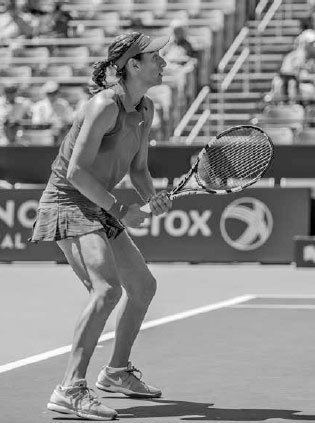
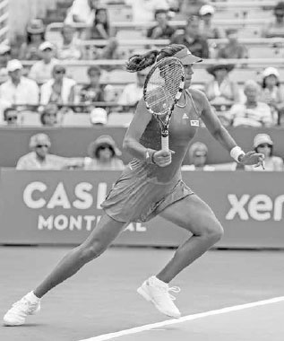
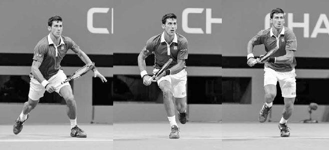
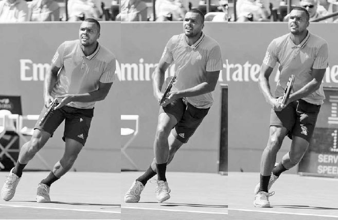
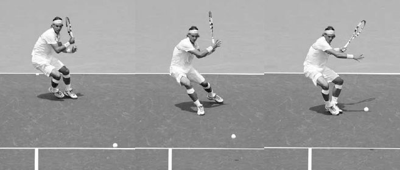
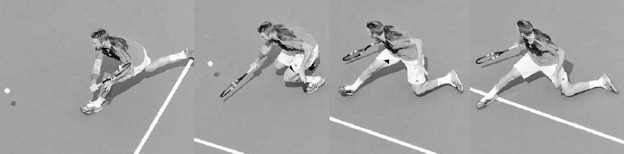
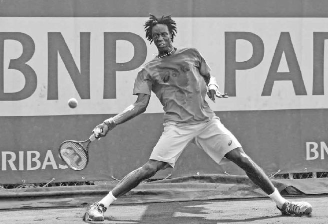

# Di chuyển — Bước chân, Split-step, Recovery

Di chuyển trong một pha bóng bao gồm nhiều kiểu bước chân khác nhau như bước ngang, bước nhảy nhỏ, và trượt chân, cũng như những cú chạy nước rút ngắn theo nhiều hướng. Bạn có thể hình dung việc bao quát sân như một điệu nhảy, trong đó quả bóng là bạn nhảy của bạn, và vì bóng đến với tốc độ khác nhau và rơi ở những vị trí khác nhau, nó là một người bạn nhảy thành thạo rất nhiều kiểu bước khác nhau. Ở một cú vô lê trái tay vươn cao, chuyển động của bạn có thể giống như múa ba lê, trong khi những bước chân nhỏ được khuyến nghị ngay trước khi đánh một cú chạm đất có thể giống điệu cha-cha. Thực hiện đúng các bước "nhảy" theo bóng nghĩa là đọc được tốc độ, độ xoáy và quỹ đạo của cú đánh đang bay tới, dự đoán nơi bóng sẽ rơi, và định vị đôi chân của bạn cho phù hợp ở tư thế thoải mái nhất. Những tay vợt có sự linh hoạt và khả năng thích nghi trong cách di chuyển theo bóng, hay theo ngôn ngữ khiêu vũ, những vũ công có thể thay đổi theo nhịp điệu, chính là những người có bước chân tốt nhất.

Ở Chương 16, tôi sẽ giải thích các thành phần khác nhau của thể lực (độ dẻo dai, sự nhanh nhẹn, tốc độ phản ứng, sự ổn định cơ lõi, sức bền, và sức mạnh) quan trọng đối với khả năng di chuyển tổng thể. Trong chương này, tôi sẽ tập trung cụ thể vào chuyển động diễn ra trên sân và các kiểu bước chân khác nhau được thực hiện theo trình tự dẫn đến một cú đánh được thực hiện tốt: bước tách chân, bước đầu tiên bùng nổ, các bước điều chỉnh nhỏ, và cuối cùng là trượt chân.

**I. Bước Tách Chân**
---------------------

Chuyển động tốt bắt đầu từ một bước tách chân mạnh mẽ (ảnh đối diện, dưới). Đôi khi được gọi là "bước nhảy sẵn sàng," mục tiêu của bước tách chân là nâng cao trạng thái nhận biết của bạn để cơ thể có thể phản ứng nhanh chóng vào thời điểm quan trọng khi bóng rời khỏi dây vợt của đối thủ.

Bước tách chân giúp khắc phục những tác động tiêu cực của quán tính, giúp bạn dễ dàng bắt đầu di chuyển vào thời điểm mà lẽ ra cơ thể đang ở trạng thái nghỉ. Đẩy một chiếc xe đang chết máy rất khó khăn, nhưng một khi nó bắt đầu di chuyển, chiếc xe sẽ dễ đẩy hơn. Trong tennis, bước tách chân giúp cơ thể dễ dàng "khởi động" hơn.

Bước tách chân không chỉ hữu ích khi có ít chuyển động, mà còn khi có nhiều chuyển động. Nó giúp dừng đà chuyển động của cơ thể trong quá trình hồi phục vị trí sau khi đánh một cú bóng rộng sân, cải thiện khả năng xuất phát nhanh cho cú đánh tiếp theo.

  --------------------------------------------------------------------------------------------------------------------------------------------------------------------------------------------------------------------------------------------------------------------------------------------------------------------------------------------------------------------------------------------------------------------------------------------------------------------------------------------------------------------------------------------------------------------------------------------------------------------------------------------------------------------------------------------------------------------------------------------------------
  **HỘP HUẤN LUYỆN VIÊN:**
  **Báo đen là một loài vật di chuyển tuyệt vời, một phần nhờ cơ thể dẻo dai và trọng tâm thấp. Hươu cao cổ lại có những đặc điểm ngược lại. Chơi theo phong cách vận động của báo đen --- giữ cơ thể thả lỏng và thấp gần mặt đất --- đòi hỏi luyện tập và sức mạnh chân tốt. Đây là lý do vì sao một số tay vợt lại đứng cứng nhắc và thẳng đứng như hươu cao cổ trong các pha bóng, dẫn đến bước đầu tiên chậm chạp và khả năng di chuyển kém lý tưởng. Trong các buổi tập luyện, hãy để cơ thể bạn thay đổi hình dạng linh hoạt và tự nhắc mình phải khuỵu người xuống và hạ thấp trọng tâm. Biến những nguyên tắc vận động cơ bản này thành thói quen sẽ giúp bạn di chuyển nhanh hơn, giúp bạn vồ lấy con mồi --- quả bóng tennis --- nhanh hơn.**
  --------------------------------------------------------------------------------------------------------------------------------------------------------------------------------------------------------------------------------------------------------------------------------------------------------------------------------------------------------------------------------------------------------------------------------------------------------------------------------------------------------------------------------------------------------------------------------------------------------------------------------------------------------------------------------------------------------------------------------------------------------

KỸ THUẬT Bạn chuẩn bị cho bước tách chân bằng cách vào tư thế vận động. Tư thế vận động đặt mỗi chân cách vai vài centimet ra ngoài, đầu gối hơi gập để bạn đứng thấp hơn chiều cao tự nhiên khoảng 15-20 cm (ảnh bên phải). Ở tư thế khuỵu người này, bạn hơi nghiêng người về phía trước với phần thân trên, nhưng giữ hông lùi ra sau và lưng tương đối thẳng.

Tư thế vận động giúp hạ thấp trọng tâm cơ thể và chuyển một phần trọng lượng cơ thể từ chân lên phía hông. Điều này giúp cơ thể "nhẹ nhàng" hơn và hỗ trợ bạn phản ứng nhanh với cú đánh của đối thủ. Một phép so sánh hữu ích khác liên quan đến thiết kế của những chiếc xe đua Công thức 1. Những chiếc xe này có khung gầm rộng và trọng tâm rất thấp, gần như sát mặt đất. Thiết kế này giúp xe di chuyển và đổi hướng nhanh chóng.

Sau khi vào tư thế vận động, bước tách chân được thực hiện bằng cách bật nhẹ hai chân lên khỏi mặt đất ngay trước thời điểm đối thủ tiếp xúc với bóng (trang trước, ảnh trái). Đôi chân của bạn nên mở rộng ra một chút (tức là "tách") khi rời khỏi mặt đất (trang trước, ảnh giữa). Bạn bật càng cao khi thực hiện bước tách chân, bạn càng tạo ra nhiều lực từ chân xuống mặt sân, và kết quả là bước đầu tiên của bạn sẽ càng bùng nổ hơn.

*Bước đầu tiên bùng nổ của Andy Murray một phần nhờ vào bước tách chân cao và rộng (ảnh trái và giữa) cùng khả năng canh thời điểm của anh. Anh tiếp đất (ảnh phải) đúng vào thời điểm biết được mình cần di chuyển theo hướng nào.*

*Tư thế vận động của Johanna Konta: hai chân rộng hơn vai, đầu gối gập, lưng tương đối thẳng, và trọng lượng hơi dồn về phía trước.*

  -----------------------------------------------------------------------------------------------------------------------------------------------------------------------------------------------------------------------------------------------------------------------------------------------------------------------------------------------------------------------------------------------------------------------------------------------------------------------------------------------------------------
  **HỘP HUẤN LUYỆN VIÊN:**
  **Mọi tay vợt chuyên nghiệp đều sử dụng bước tách chân, và có phần khó hiểu khi nhiều tay vợt nghiệp dư lại không áp dụng nó. Đây là một kỹ thuật quan trọng, và bất kỳ ai có thể nhảy lên khỏi mặt đất vài centimet đều có thể thực hiện được. Nếu bước tách chân chưa phải là một phần trong lối chơi của bạn, hãy luyện tập bằng cách đánh bóng vào tường. Mỗi khi bóng chạm tường, hãy thực hiện bước tách chân của bạn. Một khi đã thành thạo, nó sẽ trở thành bản năng và là một động tác dễ thực hiện.**
  -----------------------------------------------------------------------------------------------------------------------------------------------------------------------------------------------------------------------------------------------------------------------------------------------------------------------------------------------------------------------------------------------------------------------------------------------------------------------------------------------------------------

*Ở cuối bước tách chân này, chân trái của Federer chạm đất trước, cho thấy anh đang dự đoán mình sẽ phải di chuyển sang phải.*

Sau cú bật nhảy lên bằng cả hai chân là việc hạ thấp cơ thể xuống với trọng lượng dồn về phía trước và đầu gối hơi gập khi bạn tiếp đất (trang trước, ảnh phải). Canh thời điểm là yếu tố then chốt của bước tách chân; đôi chân của bạn nên chạm đất đúng vào lúc bạn vừa biết được mình cần di chuyển theo hướng nào.

Chuyển động lên xuống này của cơ thể giúp tích trữ năng lượng trong đôi chân, cho phép bạn tạo ra chuyển động đầu tiên mạnh mẽ hơn để tiếp cận bóng.

Ngoài ra, việc thực hiện bước tách chân giúp chuyển trọng lượng của bạn về phía trước bàn chân, tự nhiên nhấc gót chân khỏi mặt đất và loại bỏ bước nhấc gót cần thiết để bắt đầu di chuyển.

Một khi đã thành thạo bước tách chân cơ bản, bạn có thể học bước tách chân nâng cao, trong đó bạn tiếp đất bằng chân ở phía đối diện với hướng bạn dự đoán mình sẽ cần di chuyển. Ví dụ, nếu bạn dự đoán cần di chuyển sang phải, bạn sẽ tiếp đất với nhiều trọng lượng hơn dồn vào chân trái, để có thể đẩy người mạnh mẽ về phía bên phải (ảnh bên trái).

**II. Bước Đầu Tiên**
---------------------

Sau bước tách chân, một bước đầu tiên tốt là yếu tố then chốt vì có rất ít thời gian để tăng tốc đủ nhanh nhằm tiếp cận cú đánh của đối thủ. Nếu bước đầu tiên kém, tất cả các bước tiếp theo cũng sẽ chậm hơn, làm giảm khả năng vào đúng vị trí cho cú đánh hoặc tiếp cận được cú đánh của đối thủ. Đây là lý do vì sao một cú đánh được ngụy trang tốt lại hiệu quả đến vậy. Khi bạn bị đánh lừa bởi một cú bỏ nhỏ tinh quái, bước đầu tiên yếu ớt của bạn đồng nghĩa với việc rất có thể bạn sẽ không bao giờ đạt được tốc độ cần thiết để đuổi kịp bóng. Nếu bạn có thể dự đoán trước cú bỏ nhỏ, bạn sẽ thực hiện một bước đầu tiên mạnh mẽ hơn và chạy nhanh hơn nhiều.

*Sau khi hoàn thành bước tách chân, Nadal hạ thấp cơ thể, nghiêng người, và xoay chân để giúp anh xuất phát nhanh cho cú đánh tiếp theo.*

Để thực hiện một bước đầu tiên mạnh mẽ, bạn cần đồng thời hạ thấp cơ thể, nghiêng người về phía bóng, và xoay chân để mở hông theo hướng bạn muốn di chuyển (ảnh trái). Điều quan trọng là thân trên của bạn phải hơi nghiêng về phía trước khi thực hiện bước đầu tiên để khớp góc đẩy của chân với hông, cột sống và vai (ảnh phải).

Nghiêng người bằng thân trên cũng quan trọng để có một bước đầu tiên mạnh mẽ khi hồi phục vị trí. Để hồi phục vị trí sau khi đánh một quả bóng rộng sân, hãy nghiêng người về phía trước, sang phải hoặc sang trái, ngược với đà của hướng bạn vừa chạy (trang sau, ảnh dưới). Nếu thân mình bạn cứng nhắc, bạn sẽ khó có thể "phanh" lại và đổi hướng. Hãy linh hoạt và để cơ thể thay đổi hình dạng sao cho thân mình dịch chuyển theo hướng cho phép đôi chân trước tiên di chuyển đến bóng rồi sau đó hồi phục vị trí.

*Để tăng tốc độ di chuyển về phía trước, Garbiñe Muguruza nghiêng người về trước để khớp góc đẩy của chân với phần còn lại của cơ thể.*

Trong khi những tay vợt di chuyển giỏi nghiêng người sang trái, phải, ra sau, hoặc về trước tùy theo hướng của bước đầu tiên, họ nhanh chóng thẳng lưng trở lại để khôi phục tư thế tốt ngay sau khi hoàn thành chuyển động đầu tiên. Quan sát Djokovic ngay sau khi anh hoàn thành bước di chuyển đầu tiên, bạn sẽ nhận thấy cách anh giữ người thấp gần mặt đất trong khi vẫn duy trì tư thế tốt. Sức mạnh ở chân và cơ lõi cho phép anh di chuyển nhanh với đầu gối gập và thân trên tương đối thẳng đứng (ảnh trên). Tư thế này vừa giúp anh giảm tốc nhanh chóng khi đến gần bóng, vừa giúp anh giữ đầu ổn định để theo dõi bóng tốt hơn và phán đoán chính xác nơi bóng sẽ rơi.

*Djokovic nhanh chóng lấy lại tư thế sau một bước đầu tiên mạnh mẽ khi anh di chuyển lên phía trước để đuổi theo một cú bỏ nhỏ.*

*Với một khoảng cách xa cần hồi phục vị trí, Nadal sử dụng bước bắt chéo chân, tiếp theo là các bước chạy.*

CÁC KIỂU BƯỚC ĐẦU TIÊN Vì bóng đến ở những vị trí khác nhau với tốc độ khác nhau, có rất nhiều kiểu bước đầu tiên khác nhau. Ví dụ, nếu chỉ cần di chuyển một khoảng ngắn, bước đầu tiên thường sẽ là một nửa bước nhỏ ra theo hướng bóng bằng chân gần bóng nhất. Nhưng nếu cần di chuyển một khoảng xa, chân gần bóng nhất có thể trượt vào bên dưới thân người thay vì hướng theo bóng. Điều này khiến cơ thể nghiêng theo hướng bạn cần di chuyển, giúp bạn tăng tốc để tiếp cận một quả bóng khó.

*Với một khoảng cách ngắn cần hồi phục vị trí, Jo-Wilfried Tsonga sử dụng bước bắt chéo chân, tiếp theo là các bước di chuyển ngang.*

Cũng có những bước đầu tiên riêng biệt dành cho việc hồi phục vị trí. Bước bắt chéo chân, trong đó chân phải di chuyển ra trước và sang trái của chân trái, hoặc ngược lại, là một bước đầu tiên quan trọng cần học để hồi phục vị trí nhanh chóng. Nếu phải di chuyển một quãng đường xa sau khi đỡ một quả bóng rất rộng sân, bước đầu tiên thường sẽ là bước bắt chéo chân, tiếp theo là các bước chạy (ảnh đối diện, dưới). Nếu hồi phục vị trí sau một cú đánh ít rộng sân hơn, bước đầu tiên thường cũng là bước bắt chéo chân, nhưng lần này sẽ được tiếp nối bằng các bước di chuyển ngang (ảnh trên).

**III. Các Bước Điều Chỉnh**
----------------------------

Sau bước tách chân và bước đầu tiên, chuyển động của bạn tiến về phía bóng tiếp tục bằng những bước lớn hơn để bao quát khoảng cách, rồi sau đó, nếu còn thời gian, là những bước điều chỉnh nhỏ trước khi vung vợt. Những bước điều chỉnh nhỏ này giúp bạn bù đắp cho bất kỳ sự phán đoán sai lệch ban đầu nào về nơi bạn nghĩ bóng sẽ rơi, để cuối cùng bạn đứng ở đúng khoảng cách so với bóng. Hãy nhớ rằng, nơi bạn nghĩ bóng có thể rơi khi nó còn cách 12 mét có thể khác khá nhiều so với nơi bạn biết chắc nó sẽ rơi khi bóng chỉ còn cách 4,5 mét.

Các bước điều chỉnh cũng sẽ cải thiện nhịp điệu và khả năng canh thời điểm cho các cú đánh chạm đất của bạn. Như huấn luyện viên của Nadal, Francis Roig, từng nói: "Điều quan trọng nhất là cách bạn đọc bóng và hiểu được nó sẽ nảy như thế nào. Trong tennis, nếu bạn quá nhanh, điều đó không tốt. Nếu bạn quá chậm, điều đó cũng không tốt. Bạn phải đến đúng lúc."(2) Bằng cách sử dụng những bước điều chỉnh nhỏ khi bóng đang đến gần (ảnh trên), bạn sẽ tăng cơ hội đứng đúng vị trí, vào đúng thời điểm, để đánh bóng với sức mạnh và sự cân bằng.

*Nadal thực hiện những bước điều chỉnh nhỏ trước khi tung hết lực vào cú thuận tay này.*

Lần tới khi xem một trận đấu chuyên nghiệp, hãy chú ý đến những bước chân nhỏ mà các tay vợt thực hiện trước cú đánh của họ. Trên sân cứng, bạn có thể nghe thấy tiếng giày của họ rít trên mặt sân khi họ sử dụng những bước chân này để vào vị trí tốt nhất có thể. Họ chơi với đôi chân "vui vẻ" --- luôn nhảy nhót điều chỉnh liên tục. Ở trình độ nghiệp dư, bóng thường di chuyển với tốc độ đủ chậm để có thời gian thực hiện các bước điều chỉnh trước hầu hết các cú đánh.

*Jack Sock mở rộng tư thế đứng và ngả người ra sau để cho phép chân phải trượt đi sau khi thực hiện cú trái tay cắt bóng này.*

**IV. Trượt Chân**
------------------

Đối với những ai chơi trên sân Har-Tru hoặc sân đất nện, việc học cách trượt chân trên sân là rất quan trọng. Nó giúp hồi phục vị trí nhanh hơn, duy trì thăng bằng, và tiết kiệm năng lượng.

Để trượt chân tốt, bạn phải gập đầu gối, mở rộng tư thế đứng, và giữ thân trên thẳng. Khi bắt đầu trượt, hãy ngả thân trên ra sau, ngược với hướng của chân trước, để cho phép chân đó trượt đi (ảnh đối diện, dưới). Nếu chân bạn duỗi thẳng hoặc thân trên nghiêng về phía trước, chân đang trượt của bạn sẽ bám chặt vào mặt sân, khiến bạn dừng đột ngột và loạng choạng.

Chân trước trượt đi, hướng theo chiều bạn đang di chuyển, trong khi chân sau xếp vuông góc với chân trước, giữ vững thăng bằng cho bạn. **Ở các cú đánh được mô tả sau này trong sách, chân phải của bạn sẽ dẫn đầu cú trượt ở cú thuận tay tư thế mở, cú trái tay cắt bóng, và vô lê trái tay, còn chân trái sẽ dẫn đầu ở cú trái tay tư thế mở và hầu hết các cú vô lê thuận tay. Thời điểm trượt chân ở các cú cắt bóng chạm đất khác với ở các cú chạm đất xoáy lên.** Ở các cú cắt bóng chạm đất, bạn vẫn đang trượt trong khi thực hiện cú đánh và kết thúc cú trượt sau khi bóng đã rời khỏi vợt. Kiểu trượt này thường được dùng khi phòng thủ trước một cú đánh rộng sân ở cuối sân hoặc khi di chuyển lên phía trước để múc lấy một cú bỏ nhỏ được thực hiện tốt. Ở các cú đánh xoáy lên, cú trượt của bạn nên hoàn tất trước khi bắt đầu pha vung vợt về trước (ảnh dưới). Khi cú trượt của bạn dừng lại ở các cú đánh xoáy lên, bạn sẽ đẩy người lên bằng chân và dùng cơ lõi để vung vợt với sức mạnh. Cần luyện tập để xác định độ dài trượt tối ưu, giúp bạn ổn định đôi chân ở cuối cú trượt và đẩy người lên từ mặt đất.

*Gaël Monfils kết thúc cú trượt trước khi tung hết lực vào cú thuận tay xoáy lên này.*

**V. Bài Tập Di Chuyển**
------------------------

Vui lòng tham khảo Chương 16 để biết các bài tập giúp cải thiện khả năng di chuyển của bạn.

*Hai tay vợt có cú thuận tay tuyệt vời nhưng sử dụng hai cách cầm vợt khác nhau: Djokovic (ảnh trên) dùng cách cầm vợt kiểu Tây (Western), trong khi Federer (ảnh dưới) dùng cách cầm vợt kiểu Đông (Eastern) mạnh.*
