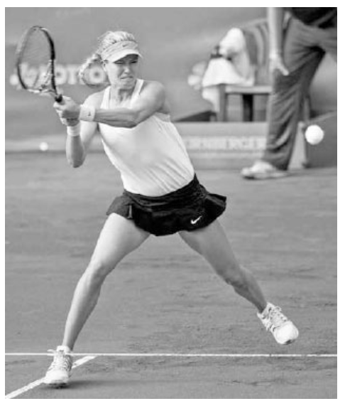
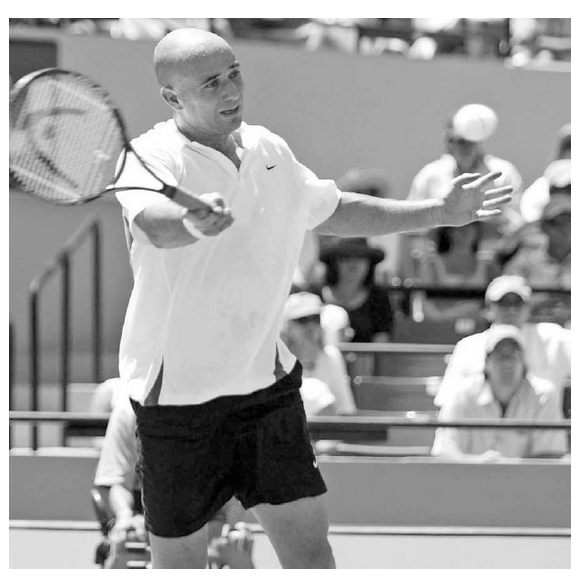
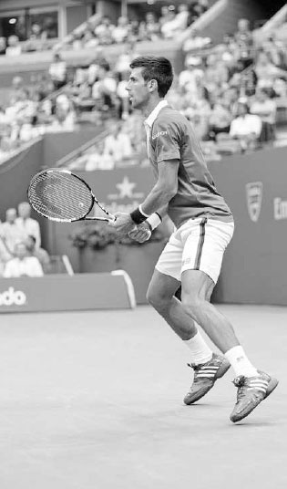
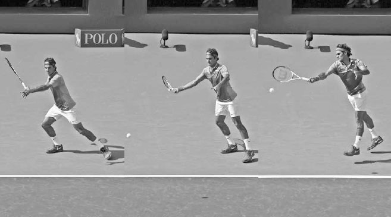
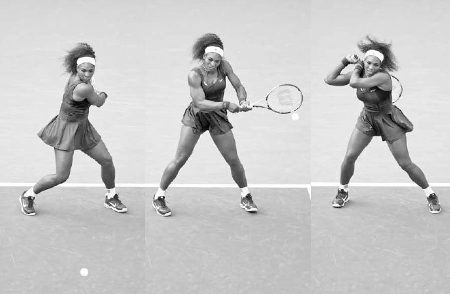
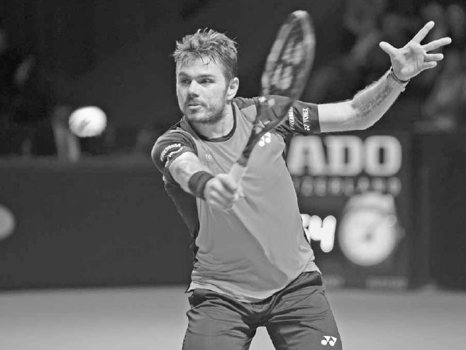

# Đỡ giao bóng — Đọc, chặn, sống sót

Cú đỡ giao bóng không chỉ trở thành một cú đánh đòi hỏi kỹ thuật cao hơn mà còn trở nên tấn công mạnh mẽ hơn. Tại Wimbledon 2014, Eugenie Bouchard đã đỡ giao bóng đứng bên trong vạch cuối sân tới 97% số lần, một con số ấn tượng.(2) Bằng cách đỡ giao bóng sớm như vậy, đối thủ của cô có rất ít thời gian sau khi hoàn thành động tác theo bóng của cú giao bóng để lấy lại thăng bằng và di chuyển bao quát cú đỡ bóng của cô. Ở nội dung nam, Roger Federer đã đưa sự tấn công trong cú đỡ giao bóng lên một tầm cao mới vào mùa hè năm 2015, khi anh thỉnh thoảng bắt đầu thực hiện cú đỡ bóng ngay từ phía sau vạch giao bóng rồi lập tức lên lưới tấn công. Chiến thuật này khiến đối thủ của anh phải vội vã và thường bị bất ngờ, dẫn đến những cú passing shot kém chất lượng và những cú vô lê dễ dàng cho anh trên lưới.

Cú đỡ giao bóng cũng đã phát triển để trở thành một yếu tố lớn hơn trong mức độ thành công của một tay vợt. Số liệu thống kê củng cố tầm quan trọng ngày càng tăng của nó. Năm 1990, không có tay vợt đỡ giao bóng hàng đầu nào của ATP nằm trong top 10 thế giới. Đến năm 2014, bốn trong số năm tay vợt đỡ giao bóng hàng đầu đã nằm trong top 10.(3) Ở giải WTA, cú đỡ giao bóng của các tay vợt đã trở nên mạnh mẽ đến mức đôi khi việc đỡ giao bóng còn có lợi hơn là giao bóng. Lấy ví dụ, hành trình ấn tượng của Bouchard tại Wimbledon 2014 đã nhắc ở trên. Trong giải đấu đó, cô đã bẻ giao bóng thành công 25 lần, đôi khi hai hoặc ba lần trong một set, trên hành trình về đích ở vị trí á quân.

Mặc dù cú đỡ giao bóng cực kỳ quan trọng ở trình độ chuyên nghiệp, tầm quan trọng của nó có thể còn lớn hơn ở trình độ nghiệp dư. Ở trình độ nghiệp dư, cú giao bóng của đối thủ, đặc biệt là giao bóng thứ hai, có thể là một quả bóng ngắn dễ đánh, trong đó người đỡ bóng biết trước cả thời điểm cú đánh sẽ đến lẫn ô giao bóng nó sẽ rơi vào. Do đó, cú đỡ giao bóng có thể là một cơ hội tuyệt vời để ghi điểm trực tiếp hoặc thiết lập một tình huống thuận lợi để cuối cùng thắng điểm.

Những người đỡ giao bóng giỏi biết chọn đúng cách cầm vợt, dự đoán, phản ứng nhanh, sử dụng bước chân tốt, và điều chỉnh độ dài pha lấy đà phù hợp. Sau khi bàn về các thành phần này của cú đỡ giao bóng, tôi sẽ bàn về cách đưa ra những lựa chọn chiến thuật và vị trí đứng trên sân thông minh. Sau đó tôi sẽ giải thích vì sao việc luyện tập cú đỡ giao bóng lại quan trọng đến vậy, cú đỡ giao bóng khác với các cú chạm đất thông thường như thế nào, và kết thúc chương này với một số bài tập luyện.

*Eugenie Bouchard đánh cắp thời gian của đối thủ đang giao bóng bằng cách đỡ giao bóng đứng bên trong vạch cuối sân.*

**I. Các Thành Phần Của Cú Đỡ Giao Bóng**
-----------------------------------------

### **1. CÁCH CẦM VỢT**

Vì việc đỡ giao bóng thường diễn ra trong một tình huống có nhịp độ nhanh, và cú thuận tay lẫn trái tay xoáy lên đòi hỏi những cách cầm vợt khác nhau, cách bạn cầm vợt là một yếu tố quan trọng cần cân nhắc. Không có cách nào đúng hay sai tuyệt đối ở đây; cách cầm vợt trong tình huống này là một sở thích cá nhân, phần lớn dựa trên điểm mạnh, điểm yếu của các cú chạm đất và phong cách chơi của bạn.

Hầu hết các tay vợt chờ đỡ giao bóng ở cách cầm thuận tay vì tay trái ở lại trên vợt lâu hơn trong pha vung trái tay so với thuận tay, do đó hỗ trợ thêm cho tay phải trong việc thiết lập cách cầm trái tay. Một số tay vợt chờ ở cách cầm của cú chạm đất yếu hơn của họ để hỗ trợ cú đánh đó, trong khi những người khác lại thích chờ ở cách cầm continental, giúp giảm bớt mức độ thay đổi cách cầm sang thuận tay hoặc trái tay, và là một cách cầm tốt nếu họ có ý định chặn bóng đỡ trước một tay giao bóng mạnh. Các tay vợt trái tay hai tay có phần dễ dàng hơn trong việc quyết định cách cầm nào để sử dụng. Họ thường chờ với tay phải ở cách cầm thuận tay ưa thích và tay trái ở cách cầm họ sử dụng khi đánh trái tay hai tay.

  -------------------------------------------------------------------------------------------------------------------------------------------------------------------------------------------------------------------------------------------------------------------------------------------------------------------------------------------------------------------------------------------------------------------------------------------------------------------------------------------------------------------------------------------------------------------------------------------------------------------------------------------------------------------------------------------------------------------------------------------------------------------------------------------------------------------------------------------------------------------------------------------------------------------------------------------------------------------------------------------------------------
  **HỘP HUẤN LUYỆN VIÊN:**
  **Phân tích tốc độ cao cho thấy rằng để cải thiện khả năng canh thời điểm trên cú đỡ giao bóng, các tay vợt chuyên nghiệp thường giảm lượng độ xoáy họ sử dụng xuống hơn một nửa so với độ xoáy họ dùng trong một pha bóng ở cuối sân. Những tay vợt đỡ giao bóng chuyên nghiệp xuất sắc nhất trong quá khứ, như Andre Agassi và Jimmy Connors, sử dụng cách cầm thuận tay vừa phải và đánh những cú đỡ bóng phẳng. Ngược lại, những tay vợt sử dụng cách cầm thuận tay western cực đoan có thể gặp khó khăn khi đỡ những cú giao bóng nhanh vì lòng bàn tay của họ nằm nhiều hơn ở phía dưới cán vợt --- một vị trí không tốt để xử lý lực va chạm mạnh mẽ của một cú giao bóng mạnh. Ngoài ra, cách cầm western không tạo ra vị trí cánh tay thoải mái cho pha vung vợt theo phương ngang cần thiết để đỡ giao bóng nhanh một cách đáng tin cậy. Nếu bạn sử dụng cách cầm western cho cú thuận tay, bạn có thể cân nhắc sử dụng cách cầm semi-western cho cú đỡ giao bóng và đánh với độ xoáy vừa phải.**
  -------------------------------------------------------------------------------------------------------------------------------------------------------------------------------------------------------------------------------------------------------------------------------------------------------------------------------------------------------------------------------------------------------------------------------------------------------------------------------------------------------------------------------------------------------------------------------------------------------------------------------------------------------------------------------------------------------------------------------------------------------------------------------------------------------------------------------------------------------------------------------------------------------------------------------------------------------------------------------------------------------------

*Cách cầm thuận tay vừa phải của Andre Agassi (cùng khả năng phối hợp mắt-tay đáng kinh ngạc) đã giúp anh đỡ những cú giao bóng nhanh một cách hiệu quả.*

### **2. DỰ ĐOÁN**

Trừ khi đối thủ của bạn rất khéo léo trong việc ngụy trang cú giao bóng, cú tung bóng có thể giúp bạn xác định được kiểu xoáy nào sắp đến với mình. Nếu cú tung bóng lệch sang phải của người giao bóng, bạn có thể dự đoán một cú giao bóng cắt và nên di chuyển sang phải để bao quát đường cong lệch phải của nó. Nếu cú tung bóng lệch sang trái, bạn có thể dự đoán một cú giao bóng xoáy kích và nên di chuyển sang trái để bao quát độ nảy lệch trái của nó. Nếu cú tung bóng thẳng và ở phía trước, có lẽ một cú giao bóng mạnh đang tới, và bạn có thể chuẩn bị một pha vung vợt ngắn hơn cho cú đỡ bóng. Trong suốt trận đấu, bạn có thể nắm bắt được sở thích của đối thủ đối với một số kiểu giao bóng nhất định, và hãy nhớ rằng các tay vợt thường thích tung ra những cú giao bóng ưa thích của họ vào những điểm quan trọng như điểm ván đấu hay điểm bẻ giao bóng.

### **3. THÓI QUEN VÀ PHẢN ỨNG**

Điều quan trọng là phát triển một thói quen đỡ giao bóng giúp bạn thư giãn và tập trung trước khi bung ra luồng năng lượng mạnh mẽ cần thiết để có một khởi đầu nhanh cho cú đỡ bóng. Một số tay vợt, như Federer, xoay vợt trong tay, trong khi những người khác, như Milos Raonic, nhảy nhót trên đôi chân, chuẩn bị cho đôi chân sẵn sàng hành động.

Sau khi xác định vị trí đứng của bạn trên sân để đỡ giao bóng, hãy vào tư thế đứng rộng với hai chân rộng hơn vai, đầu gối gập, và thân trên tương đối thẳng đứng. Khi người giao bóng tung bóng lên, hãy bước một hoặc hai bước về phía trước, rồi thực hiện bước tách chân ngay trước khi người giao bóng tiếp xúc bóng (ảnh phải). Động lượng về phía trước khi bước vào bước tách chân sẽ giúp bạn bật nhanh hơn để tấn công cú đỡ bóng.

### **4. BƯỚC CHÂN**

Sau bước tách chân, chuyển động đầu tiên của bạn là xoay chân ngoài, nghiêng sang phải cho cú thuận tay (ảnh trang đối diện, trái) hoặc sang trái cho cú trái tay. Số bước thực hiện sau bước đầu tiên phụ thuộc vào tốc độ và hướng của cú giao bóng.

Những cú giao bóng rộng sân thường sẽ đòi hỏi một bước bắt chéo chân, với chân trái bước bắt chéo qua ở cú thuận tay (ảnh trang đối diện, phải), và chân phải bắt chéo qua ở cú trái tay. Một khi chân trước chạm đất, chân sau sẽ xoay quanh để bạn có thể vuông góc vào một tư thế đứng rộng và nghiêng theo hướng bạn muốn di chuyển.

Với những cú giao bóng không đi rộng sân, thường sẽ không có đủ thời gian hoặc không cần thiết cho bước bắt chéo chân, và cú đỡ bóng được thực hiện với tư thế mở, nơi hai chân của bạn song song hoặc gần song song với vạch cuối sân. Do độ nảy cao của các cú giao bóng xoáy kích, tư thế mở cũng thường được sử dụng cho cả cú đỡ thuận tay lẫn trái tay đối với các tay vợt đánh trái tay hai tay.

Sau khi đánh cú đỡ bóng, hãy di chuyển đôi chân nhanh chóng về phía giữa sân để chuẩn bị cho pha bóng.

*Djokovic thực hiện bước tách chân để giúp anh phản ứng nhanh với cú giao bóng của đối thủ.*

### **5. KỸ THUẬT VUNG VỢT**

Vai trò của pha lấy đà là tạo ra một điểm tiếp xúc ổn định phía trước cơ thể. Để đạt được điều này, độ lớn của pha lấy đà phải thích ứng với các tốc độ giao bóng khác nhau của đối thủ, thay vì cứng nhắc hay máy móc.

Khi đỡ một cú giao bóng thứ nhất nhanh, bạn nên thực hiện một pha lấy đà thấp hơn, ngắn hơn (ảnh giữa) và tận dụng sức mạnh của đối thủ để đánh trả bóng. Giữ người thấp trong tư thế khuỵu gối, giữ đầu ổn định khi vung vợt, và tập trung vào việc tiếp xúc bóng phía trước bạn (ảnh phải). Mặc dù pha lấy đà có thể ngắn hơn, động tác theo bóng vẫn nên đầy đủ. Vì cú đỡ giao bóng thứ nhất thường được đánh phẳng hơn, động tác theo bóng sẽ cao và kéo dài. Ở cú giao bóng thứ hai chậm hơn, pha lấy đà sẽ dài hơn và độ xoáy lên có khả năng được sử dụng nhiều hơn; do đó động tác theo bóng thường sẽ thấp hơn và ngang hơn, về cơ bản mô phỏng lại một cú chạm đất xoáy lên thông thường.

*Djokovic xoay người và nghiêng người, sau đó sử dụng một pha lấy đà thấp và ngắn trước khi tiếp xúc bóng phía trước cơ thể trên cú đỡ thuận tay rộng sân này.*

### **6. CHIẾN THUẬT ĐỠ GIAO BÓNG**

Tùy thuộc vào trình độ cú giao bóng của đối thủ, có rất nhiều chiến thuật bạn có thể áp dụng trên cú đỡ giao bóng. Mục tiêu chính của bạn là buộc đối thủ phải giành lấy từng điểm một bằng cách đưa cú đỡ bóng của bạn vào cuộc. Trong suốt trận đấu, một người đỡ bóng ổn định sẽ khiến người giao bóng mệt mỏi cả về tinh thần lẫn thể chất bằng cách buộc họ phải làm việc vất vả sau cú giao bóng của mình.

### **A. CHIẾN THUẬT ĐỠ GIAO BÓNG THỨ NHẤT SO VỚI THỨ HAI**

Vì cú giao bóng thứ nhất thường nhanh hơn cú thứ hai, cách tiếp cận chiến thuật của bạn khi đỡ những cú giao bóng này cũng nên khác nhau. Khi nhận một cú giao bóng thứ nhất mạnh, mục tiêu của bạn là phòng thủ và trung hòa pha bóng. Vào đầu trận đấu, đặc biệt là khi đối đầu với một đối thủ mà lối chơi của họ bạn chưa quen thuộc, bạn nên nhắm cú đỡ giao bóng thứ nhất vào giữa sân. Đó là một ý hay khi cố gắng đạt được sự ổn định và độ sâu trên cú đỡ bóng cho đến khi bạn bắt đầu đọc và canh được thời điểm cú giao bóng của đối thủ. Khi trận đấu tiến triển, bạn có thể bắt đầu nhắm gần các đường biên hơn.

NĂM 2015, NOVAK DJOKOVIC BẺ GIAO BÓNG THƯỜNG XUYÊN HƠN BẤT KỲ TAY VỢT NÀO trên ATP Tour. Anh đỡ giao bóng một cách ổn định và thực hiện điều đó với tốc độ cùng độ sâu thường cho phép anh bắt đầu pha bóng ở một vị trí thuận lợi.

Ở khung hình đầu tiên, Djokovic bắt đầu cú đỡ bóng bằng một bước tách chân được canh thời điểm tốt, giúp anh có một chuyển động đầu tiên mạnh mẽ tới bóng. Ở khung hình thứ hai, anh xoay chân, chuyển trọng lượng sang chân trái, và xoay vai. Đến khung hình thứ ba, pha lấy đà ngắn của anh đã hoàn tất. Hãy chú ý rằng cánh tay của anh hầu như không di chuyển để đạt được vị trí này; pha lấy đà của anh chủ yếu đạt được nhờ phần thân trên xoay như một khối thống nhất. Djokovic hạ đầu vợt xuống để bắt đầu pha vung vợt từ thấp lên cao về phía trước, tạo ra topspin vừa phải để kiểm soát cú đánh. Chân trái của anh duỗi thẳng để giải phóng sức mạnh đã được tích trữ trong pha lấy đà. Ở khung hình thứ tư, anh duỗi thẳng cánh tay trái và tiếp xúc bóng ở vị trí khá xa phía trước cơ thể. Novak không phải là một người đỡ bóng thụ động. Ở khung hình thứ năm, chúng ta thấy anh di chuyển về phía trước xuyên qua cú đánh, tấn công quả bóng. Anh đẩy xuyên qua bóng, vươn vợt ra hướng về mục tiêu. Ở khung hình cuối cùng, anh tiếp đất vững vàng trên chân phải, sẵn sàng hồi phục vị trí nhanh chóng cho cú trả bóng của đối thủ.

Trái ngược với cú đỡ giao bóng thứ nhất, mục tiêu của bạn ở giao bóng thứ hai là tấn công và trả bóng đủ mạnh để đưa bạn vào thế dẫn trước trong pha bóng. Cú giao bóng thứ hai, đặc biệt là một cú yếu, có thể mang lại cơ hội tuyệt vời cho người đỡ bóng vì nó thực chất trở thành một quả bóng ngắn mà bạn có thể chuẩn bị trước. Tấn công cú giao bóng thứ hai là một chiến thuật thường mang lại phần thưởng lớn hơn khi trận đấu tiến triển. Nó có thể khiến đối thủ của bạn mất tự tin và nản lòng trước viễn cảnh phải phòng thủ pha bóng mỗi khi họ hỏng cú giao bóng thứ nhất.

*Federer phòng thủ trước một cú giao bóng mạnh mẽ bằng cách rút ngắn pha lấy đà và nhắm vào một mục tiêu rộng, sâu xuống giữa sân.*

Trước khi đối thủ bắt đầu cú giao bóng thứ hai, hãy hình dung một mục tiêu cụ thể trên sân nơi bạn muốn đánh cú đỡ bóng tới. Hãy nhớ rằng cơ thể hoạt động tốt nhất khi tâm trí đưa ra cho nó một định hướng dứt khoát và mục đích rõ ràng. Ngoài ra, hãy di chuyển đôi chân nhanh chóng trên cú đỡ giao bóng thứ hai để bạn có thể sử dụng cú chạm đất mạnh nhất của mình càng nhiều càng tốt. Hãy nhớ rằng, xét về mục đích vị trí trên sân, sẽ có lợi nếu bạn có thể di chuyển sang trái và sử dụng cú thuận tay ở ô bên phải, và di chuyển sang phải và sử dụng cú trái tay ở ô bên trái (ảnh trang đối diện). Chuyển động này đưa bạn về phía giữa sân sau cú đỡ bóng, ở một vị trí tốt cho cú đánh tiếp theo của bạn. Bạn cũng có thể di chuyển sang trái và phải để phá vỡ nhịp điệu của đối thủ bằng cách đỡ giao bóng từ những vị trí khác nhau trên sân. Ví dụ, nếu đối thủ đang gây khó khăn cho bạn bằng những cú giao bóng vào trái tay, hãy thử đứng lệch trái nhiều hơn và dụ họ giao bóng vào phần "mở" của ô giao bóng. Điều này sẽ buộc họ phải thực hiện một cú giao bóng kém quen thuộc hơn vào có thể là cú chạm đất mạnh nhất của bạn.

### **B. CHIẾN THUẬT VỊ TRÍ TIẾN VÀ LÙI TRÊN SÂN**

Di chuyển tiến và lùi cũng có thể phá vỡ nhịp điệu của đối thủ, nhưng kiểu thay đổi vị trí này đóng một vai trò quan trọng hơn trong chiến thuật. Ví dụ, nếu bạn muốn thiết lập một tông tấn công hoặc rút ngắn các pha bóng, bạn có thể đứng sâu vào bên trong vạch cuối sân (ảnh dưới) và đỡ bóng sớm, đánh cắp thời gian của đối thủ. Hoặc, nếu bạn có các cú chạm đất tốt hơn đối thủ, và việc kéo dài pha bóng có lợi cho bạn, bạn có thể muốn đứng lùi xa hơn ra sau và cải thiện khả năng bạn sẽ thực hiện thành công cú đỡ bóng.

*Serena Williams sử dụng cú trái tay ở ô bên trái để có được vị trí sân tốt hơn và đứng sâu vào bên trong vạch cuối sân để thiết lập một tông tấn công cho pha bóng.*

Trận chung kết Sydney International 2016 giữa Viktor Troicki và Grigor Dimitrov đã cho thấy mức độ thành công của một tay vợt có thể thay đổi thế nào tùy vào độ dài của pha bóng. Trong trận đấu đó, Troicki có khả năng thắng điểm cao gấp gần hai lần khi các pha bóng có ba cú đánh trở xuống; điều ngược lại đúng khi pha bóng kéo dài chín cú đánh trở lên.(4) Có lẽ nếu Dimitrov lùi lại để đỡ giao bóng và kéo dài thêm nhiều điểm hơn, anh có thể đã thắng trận đấu vô cùng sít sao đó.

Những gì đối thủ của bạn làm sau cú giao bóng cũng có thể ảnh hưởng đến vị trí đỡ giao bóng. Tại Barclays ATP World Tour Finals 2015, Wawrinka đã đỡ giao bóng đứng xa hơn trung bình 2,7 mét phía sau vạch cuối sân khi đấu với Nadal, một tay vợt chơi sâu cuối sân, so với khi đấu với Federer, một tay vợt thỉnh thoảng lên lưới sau giao bóng.(5) Wawrinka biết rằng đỡ giao bóng đứng sâu trước Federer sẽ tạo cơ hội lên lưới sau giao bóng dễ dàng cho đồng hương của mình, đặc biệt là khi phòng thủ trước cú giao bóng rộng sân của anh. Mặc dù Federer giao bóng nhanh hơn đáng kể so với Nadal, Wawrinka đã cân nhắc mọi biến số của trận đấu và quyết định đỡ giao bóng của Federer gần vạch cuối sân hơn so với của Nadal.

*Tại Barclays World Tour Finals 2015, Stan Wawrinka quyết định đứng gần vạch cuối sân hơn để đỡ giao bóng trước Federer so với khi đấu với Nadal, người có tốc độ giao bóng chậm hơn.*

Mặt sân cũng có ảnh hưởng lớn đến mức độ tấn công và vị trí đứng trên sân khi đỡ bóng. Trong thập kỷ qua, đặc biệt là trên sân đất nện, các tay vợt chuyên nghiệp đôi khi áp dụng một kiểu đỡ giao bóng thứ hai khác, trong đó họ lùi lại vài mét về phía hàng rào cuối sân để thực hiện cú đánh (ảnh trang đối diện). Vị trí đứng sâu hơn này cho phép tốc độ và độ xoáy của cú giao bóng chậm lại đủ để thực hiện một cú đỡ bóng topspin nặng. Mặt khác, trên sân cứng, họ thường tiến lên phía trước nhiều hơn và đỡ giao bóng sớm hơn. Chiến lược này mang lại hiệu quả vì sân cứng cho độ nảy đáng tin cậy hơn và có xu hướng thưởng cho lối đánh tấn công.

Hãy học hỏi từ các tay vợt chuyên nghiệp và điều chỉnh vị trí tiến, lùi trên sân khi đỡ bóng, cân nhắc không chỉ chất lượng cú giao bóng của đối thủ, mà còn độ dài pha bóng có lợi cho bạn, chiến thuật của đối thủ sau cú giao bóng, và mặt sân.

*Trên sân đất nện, Nadal (phía sau) đôi khi lùi lại gần hàng rào để đỡ cú giao bóng thứ hai ở một tốc độ và độ cao thoải mái.*

**II. Bài Tập Đỡ Giao Bóng**
----------------------------

Trong khi một số điểm kéo dài mười cú đánh và một số khác chỉ hai cú, độ dài trung bình của một điểm trong hầu hết các trận đấu vào khoảng bốn đến năm cú đánh. Hãy ghi nhớ điều này, cú giao bóng và cú đỡ giao bóng chiếm khoảng bốn mươi đến năm mươi phần trăm của một điểm trung bình. Vậy, những cú đánh nào thường được luyện tập ít nhất ở trình độ nghiệp dư? Bạn đoán đúng rồi đấy: cú giao bóng, và đặc biệt là cú đỡ giao bóng.

Đừng mắc sai lầm này. Hãy dành một lượng thời gian phù hợp trên sân tập để rèn luyện hai cú đánh này. Nhiều tay vợt không dành cho cú đỡ giao bóng sự chú ý mà nó xứng đáng vì họ mắc sai lầm khi xem nó chỉ như một cú chạm đất khác. Tuy nhiên, sự thật là cú đỡ giao bóng khác với các cú chạm đất thông thường ở nhiều điểm: cú giao bóng được đánh từ độ cao lớn hơn, tạo ra độ nảy cao hơn, tốc độ bóng thường nhanh hơn, cú giao bóng đôi khi cong từ phải sang trái hoặc từ trái sang phải, khoảng cách đối thủ giao bóng từ lưới luôn cố định, và diện tích ô giao bóng cần phòng thủ nhỏ hơn nhiều so với toàn bộ sân. Do đó, ngoài tác động to lớn của cú đỡ giao bóng trong việc quyết định kết quả của điểm đấu, nó còn là một cú đánh độc đáo theo nhiều khía cạnh, và nên chiếm một phần đáng kể trong các buổi tập luyện của bạn.

Các tay vợt chuyên nghiệp hiểu rõ điều này và đánh hàng nghìn cú đỡ bóng trong luyện tập để cải thiện mối liên kết giữa cơ bắp và tâm trí, cho phép họ thực hiện những điều chỉnh nhỏ cần thiết để đỡ bóng tốt. Trên cú giao bóng thứ nhất họ nhận được, có rất ít thời gian cho hành động có chủ ý, vì vậy họ hoạt động theo một loạt các phản ứng thay vì suy nghĩ có tính toán trước. Ở trình độ nghiệp dư, các cú giao bóng chậm hơn, vì vậy có một quá trình tư duy khác liên quan. Các tay vợt nghiệp dư thường có lợi thế về thời gian bổ sung, cho phép họ lên kế hoạch trước và thực hiện một cú đỡ bóng có tính toán hơn. Bất kể tốc độ giao bóng mà bạn thường gặp phải, luôn có một nghệ thuật và nhịp điệu trong cú đỡ bóng mà chỉ có thể được phát triển thông qua luyện tập.

### **1. TIẾN VÀ LÙI**

Mục tiêu: Tăng tốc độ phản ứng khi đỡ giao bóng.

Giao năm quả cho bạn tập của bạn từ vị trí cách vạch cuối sân 1,8 mét vào trong sân, năm quả từ vị trí cách 1 mét vào trong sân, và năm quả ngay tại vạch cuối sân. Họ ghi một điểm cho mỗi cú đỡ bóng thành công hoặc cú đỡ bóng rơi qua khỏi vạch giao bóng, và bạn ghi một điểm cho mỗi cú giao bóng không được đỡ hoặc mỗi cú đỡ bóng rơi trước vạch giao bóng. Người có nhiều điểm nhất sau 15 lần giao bóng sẽ thắng, sau đó đổi vai trò. Với bài tập này và tất cả các bài tập trong sách, bạn có thể thay đổi vị trí trên sân hoặc hệ thống tính điểm tùy theo trình độ của mình để các bài tập trở nên thú vị và mang tính cạnh tranh.

Để bạn tập của bạn giao bóng từ vị trí vài bước vào trong vạch cuối sân có thể giúp tăng tốc phản xạ đỡ giao bóng của bạn.

### **2. LUYỆN TẬP NHẮM MỤC TIÊU**

Mục tiêu: Cải thiện độ chính xác của cú đỡ bóng.

Chia sân đơn thành bốn ô bằng cách kéo dài vạch giữa sân xuống tận vạch cuối sân. Bạn phải đỡ giao bóng vào một ô được chỉ định. Nếu bóng được đỡ thành công vào ô được chỉ định, hoặc nếu bạn tập của bạn hỏng cú giao bóng, bạn ghi một điểm. Tuy nhiên, nếu bạn không đánh trúng ô đúng, bạn tập của bạn sẽ ghi một điểm. Người đầu tiên đạt 15 điểm sẽ thắng, sau đó đổi vai trò. Các biến thể bao gồm cho phép hai lần giao bóng mỗi điểm, chia sân thành hai nửa thay vì bốn phần, hoặc cho phép người đỡ bóng chỉ được đánh cú đỡ topspin hoặc chỉ được đánh cú đỡ cắt bóng.

### **3. ĐỠ GIAO BÓNG VỚI HANDICAP**

Mục tiêu: Nhấn mạnh tầm quan trọng của việc phòng thủ trước cú giao bóng thứ nhất và tấn công cú giao bóng thứ hai.

Chơi một set với bạn tập của bạn theo cách tính điểm thông thường, ngoại trừ việc một cú đỡ bóng hỏng trước giao bóng thứ nhất sẽ mang lại hai điểm cho người giao bóng. Ngoài ra --- hoặc thay vào đó --- nếu người đỡ bóng ghi điểm trực tiếp từ cú giao bóng thứ hai, họ ghi được hai điểm. Bạn có thể thêm một biến thể trong đó người giao bóng được phép giao ba lần mỗi điểm thay vì hai lần.

"Độ dài của điểm đấu quan trọng hơn nhiều so với những gì người hâm mộ có thể nghĩ. Bốn cú đánh đầu tiên, bao gồm cú giao bóng và cú đỡ bóng, là phân đoạn quan trọng nhất, vượt xa mọi phân đoạn khác. Bạn có thể nghĩ rằng điểm đấu vừa mới bắt đầu, nhưng nó thường đã kết thúc rồi. Trong giải U.S. Open 2015, 71% số điểm ở các trận đơn nam và 66% số điểm ở nội dung nữ đến từ những pha bóng có bốn cú đánh trở xuống. Và những điểm quyết định sớm có mối tương quan lớn hơn nhiều với kết quả trận đấu so với những pha bóng kéo dài. Tại U.S. Open 2015, những tay vợt thắng nhiều hơn ở các pha bóng từ không đến bốn cú đánh đã thắng trận đấu 90% số lần ở nội dung đơn nam và 83% số lần ở nội dung nữ. Những tay vợt có lợi thế ở các pha bóng từ chín cú đánh trở lên chỉ thắng trận đấu 56% số lần ở nội dung nam và 59% ở nội dung nữ." - Craig O'Shannessy.

*Cú thuận tay của Jo-Wilfried Tsonga, giống như hầu hết các tay vợt ATP, là đòn kết liễu cuối sân của anh.*
