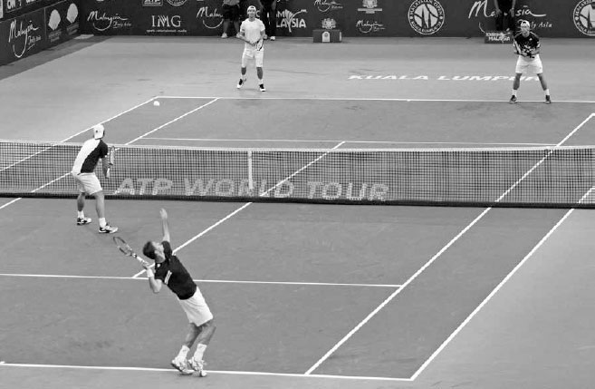
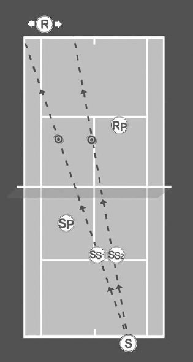
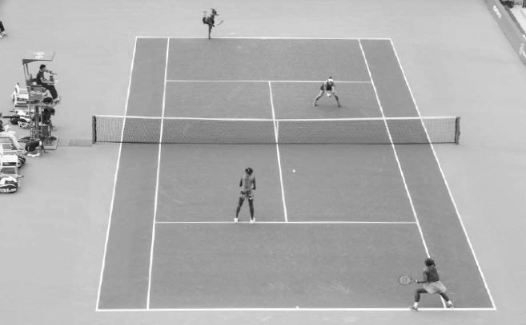
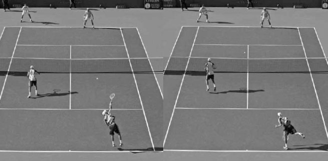
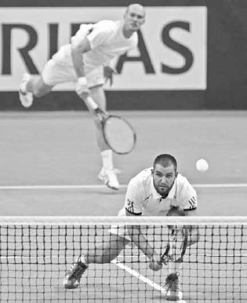

# Đôi — Vị trí, phối hợp, chiến thuật

Với bốn người chơi trên sân, mỗi người có điểm mạnh và điểm yếu khác nhau, cũng có nhiều lựa chọn chiến thuật hơn để cân nhắc so với khi chơi đơn. Trong chương này, tôi tập trung vào các nguyên tắc chiến thuật cốt lõi để giúp bạn chơi đánh đôi tốt nhất. Tôi bắt đầu bằng việc giải thích vai trò của từng người trong bốn người chơi cùng các đội hình và chiến lược khác nhau mà mỗi người có thể sử dụng. Tiếp theo, tôi hướng dẫn cách đạt được vị trí đứng sân tối ưu, chiến thuật cắt bóng ở lưới, và cách chọn đúng cú đánh tùy hoàn cảnh. Sau đó tôi bàn về kế hoạch thi đấu, giao tiếp, cách chọn đồng đội phù hợp bổ trợ cho lối chơi của bạn, và kết thúc chương với các gợi ý luyện tập đánh đôi.

**I. Vai Trò Của Từng Người Chơi**
----------------------------------

MỘT VÁN ĐẤU ĐÔI được chơi qua bốn vòng luân phiên game; sau mỗi game, người chơi thay đổi vai trò và do đó, thay đổi trách nhiệm của mình. Bạn và đồng đội càng làm tốt từng \"nhiệm vụ\" của mình, khả năng bạn thi đấu như một đội gắn kết và thành công càng cao. Ở mỗi vai trò, điều quan trọng là biết chiến thuật và cú đánh nào hiệu quả nhất cũng như những lựa chọn vị trí đứng sân nào có thể dùng để nghiêng điểm bóng về phía bạn. Trong phần này, tôi sẽ bàn về bốn vai trò: người giao bóng, đồng đội của người giao bóng, người đỡ giao bóng, và đồng đội của người đỡ giao bóng.

Sắp xếp vị trí thuận lợi nhất cho đồng đội ở lưới nên là mối quan tâm hàng đầu của người giao bóng.

### **1. NGƯỜI GIAO BÓNG**

Thắng đều đặn các game giao bóng của mình là yếu tố then chốt cho thành công của một đội đôi. Bằng cách tận dụng lợi thế đánh bóng trước và giao bóng tốt, bạn nên khiến việc bẻ giao bóng trở nên khó khăn cho đối phương và duy trì thế dẫn trước hoặc hòa trong ván đấu.

Có năm điều cân nhắc chính cho người giao bóng trong đánh đôi.

### **A. SẮP XẾP VỊ TRÍ THUẬN LỢI NHẤT CHO ĐỒNG ĐỘI Ở LƯỚI**

Cách tốt nhất để làm điều này là giao bóng dọc theo đường giữa sân về phía chữ \"T.\" Cú giao bóng này hạn chế các góc độ có sẵn để đối phương passing shot đồng đội của bạn ở lưới theo hướng dọc dây, cho phép đồng đội bạn di chuyển về phía giữa sân và tạo ảnh hưởng lớn hơn đến điểm bóng.

Thay đổi vị trí và độ xoáy trên cú giao bóng sẽ khiến đối phương mất nhịp và giúp bạn giữ được game giao bóng.

Cú giao bóng vào người đỡ giao bóng là một lựa chọn hiệu quả khác để sắp xếp vị trí thuận lợi cho đồng đội ở lưới. Bằng cách \"khóa tay\" người đỡ giao bóng, họ sẽ không thể vung vợt tự do và nhiều khả năng sẽ trả những quả bóng dễ để đồng đội bạn ở lưới chớp lấy. Hãy nhớ rằng vì có hai đối thủ phòng thủ sân trong đánh đôi, việc giành lợi thế vị trí từ cú giao bóng rộng ít quan trọng hơn so với đánh đơn; do đó, cú giao bóng vào người nên được dùng thường xuyên hơn.

Cú giao bóng rộng cũng có thể hiệu quả; tuy nhiên, nó có những tác động tiêu cực. Nó buộc đồng đội của người giao bóng phải che chắn hành lang biên đôi, khiến họ ít khả năng chặn bóng ở giữa sân hơn. Ngoài ra, sự di chuyển của đồng đội đến hành lang buộc người giao bóng phải bao quát một phần sân lớn hơn. Tuy nhiên, nếu bạn có thể đánh cú giao bóng rộng nhanh và buộc đối phương đỡ giao bóng muộn, bạn có thể sắp xếp cho đồng đội mình một cú vô lê dễ dàng ở lưới.

### **B. ĐẢM BẢO TỶ LỆ GIAO BÓNG THỨ NHẤT VÀO CAO**

Trong khi đạt tỷ lệ giao bóng thứ nhất vào cao là quan trọng trong đánh đơn, điều đó còn quan trọng hơn trong đánh đôi vì sự chênh lệch giữa tỷ lệ thắng cú giao bóng thứ nhất và thứ hai thường lớn hơn. Tỷ lệ giao bóng thứ nhất mong muốn trong đánh đôi là 75 đến 80% so với 60 đến 65% trong đánh đơn.

Để đạt tỷ lệ giao bóng thứ nhất vào cao, hãy nhắm vào một mục tiêu lớn hơn về phía giữa ô giao bóng và dùng cú giao bóng xoáy thường xuyên hơn. Nếu bạn có cú giao bóng thứ hai mạnh, bạn có thể mạo hiểm hơn với cú giao bóng thứ nhất, với mục tiêu thắng điểm từ các cú đỡ giao bóng bị hỏng. Nếu cú giao bóng thứ hai không phải điểm mạnh của bạn, nên làm chậm cú giao bóng thứ nhất và tăng sự tập trung vào vị trí và tính ổn định.

**C. THAY ĐỔI ĐA DẠNG**
-----------------------

Người giao bóng nên khiến người đỡ giao bóng mất nhịp bằng cách thay đổi vị trí và độ xoáy giao bóng. Giao rộng, giao vào chữ \"T,\" hoặc giao trực tiếp vào người đỡ giao bóng. Những vị trí khác nhau này sẽ giảm khả năng của đối phương trong việc dự đoán và có khởi đầu thuận lợi cho cú đỡ giao bóng của họ. Như đã bàn trong Chương Năm, bạn cũng có bốn kiểu giao bóng xoáy khác nhau (phẳng, cắt, cắt-xoáy lên, và kick).

Những độ xoáy này sẽ thay đổi quỹ đạo và tốc độ cú giao bóng của bạn và hy vọng tạo ra một số cú đỡ giao bóng bị căn thời gian sai.

*Việc Jurgen Melzer (phải) biết trước đồng đội mình giao bóng vào chữ \"T\" giúp anh khởi động sớm hơn khi di chuyển về giữa sân.*

### **D. CHỌN VỊ TRÍ GIAO BÓNG THÔNG MINH**

Bạn có thể giao bóng từ một vị trí tạo ra góc tốt nhất để tấn công cú đánh nền yếu hơn của người đỡ giao bóng. Ví dụ, nếu người đỡ giao bóng có cú trái tay yếu hơn, bạn có thể giao bóng từ gần giữa sân hơn ở bên deuce hoặc gần hành lang hơn ở bên ad. Điều này sẽ giúp góc giao bóng hướng về phía cú trái tay của người đỡ giao bóng. Nếu bạn cảm thấy đối phương đang bắt nhịp tốt với cú đỡ giao bóng, hãy thử đứng cách vị trí giao bóng thường lệ vài chục centimet sang trái hoặc phải để tạo cho họ một góc độ khác.

### **E. GIAO TIẾP TỐT**

Hãy trao đổi với đồng đội về nơi bạn sẽ giao bóng để họ có thể sẵn sàng dịch chuyển đến vị trí tốt nhất cho cú đỡ giao bóng. Ví dụ, nếu bạn báo trước với đồng đội rằng bạn sẽ giao bóng rộng, họ có thể sẵn sàng che chắn hành lang trên cú đỡ giao bóng. Hoặc nếu bạn định giao vào chữ \"T,\" thì đồng đội của bạn ở lưới có thể cảnh giác cao độ để tấn công bất kỳ cú đỡ giao bóng yếu nào đánh về giữa sân.

Sau cú giao bóng, bạn có hai lựa chọn: giao bóng rồi lên lưới hoặc giao bóng rồi ở lại vạch cuối sân.

### **1. GIAO BÓNG LÊN LƯỚI:**

Nếu bạn giao bóng rồi ngay lập tức tiến lên vô lê, thường sẽ hợp lý khi dùng nhiều độ xoáy hơn trên cú giao bóng. Độ xoáy thêm sẽ khiến bóng bay chậm hơn trong không khí và cho phép bạn tiến gần lưới hơn cho cú vô lê đầu tiên. Hãy nhớ theo dõi đường bay của bóng khi bạn di chuyển về phía trước sau cú giao bóng và thực hiện bước tách chân khi đối phương đánh cú đỡ giao bóng (phải).

Quy tắc chung cho người giao bóng là đánh cú vô lê đầu tiên sâu về giữa sân để hạn chế các góc độ có thể có của đội đỡ giao bóng. Nếu đối phương đang chơi ở đội hình phổ biến một lên một lùi để đỡ giao bóng (xem R và RP bên phải) và cú đỡ giao bóng đánh dưới lưới, cú vô lê đầu tiên nên được đánh thấp và sâu về phía người đỡ giao bóng (R); ưu tiên là giữ bóng tránh xa đồng đội của người đỡ giao bóng (RP). Nếu cú đỡ giao bóng cao, thường hợp lý khi đánh bóng mạnh xuống chân RP.

### **2. GIAO BÓNG RỒI Ở LẠI CUỐI SÂN:**

Hầu hết người chơi nghiệp dư chọn giao bóng rồi ở lại vạch cuối sân; ngày càng nhiều tay vợt chuyên nghiệp cũng làm như vậy nhờ những cải thiện họ đạt được trên cú đỡ giao bóng. Lối chơi này dẫn đến nhiều pha đôi công chéo sân với một người ở lưới và một người ở cuối sân. Mục tiêu của người giao bóng trong pha đôi công chéo sân là đánh (a) đủ rộng để giữ bóng tránh xa RP, (b) đủ sâu để giữ R phía sau vạch cuối sân, và (c) đủ nhanh để đôi khi dồn ép đối phương và sắp xếp cho đồng đội mình ở lưới (SP) một cú vô lê tấn công.

CHÚ THÍCH: S - NGƯỜI GIAO BÓNG SP - ĐỒNG ĐỘI NGƯỜI GIAO BÓNG R - NGƯỜI ĐỠ GIAO BÓNG RP - ĐỒNG ĐỘI NGƯỜI ĐỠ GIAO BÓNG Vị trí cú giao bóng của bạn sẽ ảnh hưởng đến nơi bạn thực hiện bước tách chân khi giao bóng lên lưới. Giao bóng về phía trái ô giao bóng khiến bước tách chân cũng dịch sang trái (SS1). Ngược lại, giao bóng về phía phải ô giao bóng khiến bước tách chân dịch sang phải (SS2). Đồng đội của người giao bóng (SP) và đồng đội của người đỡ giao bóng (RP) cũng nên dịch sang trái và phải theo hướng cú giao bóng để bao quát sân tốt nhất.

Ai nên giao bóng trước trong đội của bạn? Nếu các kỹ năng khác tương đối ngang nhau, người giao bóng tốt hơn nên giao trước; điều này sẽ dẫn đến việc người giao bóng tốt hơn thường giao nhiều game hơn. Có những trường hợp người chơi mạnh hơn lại có cú giao bóng yếu hơn và khi đó quyết định trở nên phức tạp hơn. Gió và ánh nắng cũng là một yếu tố cần cân nhắc. Nếu một người chơi có cú giao bóng kick tốt hơn, họ nên giao bóng theo chiều gió. Khi gió hỗ trợ, độ xoáy lên của cú giao bóng kick sẽ giúp bóng rơi xuống trong ô giao bóng. Nếu một người chơi có cú tung bóng cao, họ sẽ giao bóng tốt hơn từ đầu sân có ánh nắng sau lưng. Nếu đội của bạn là sự kết hợp giữa người thuận tay phải và thuận tay trái, bạn có thể tránh vấn đề ánh nắng và đồng thời tận dụng gió ngang để tạo độ cong lớn hơn trên cú giao bóng cắt từ cả hai bên sân.

Hầu hết người chơi đứng giữa ô giao bóng khi đồng đội của họ đang giao bóng (nhìn sang phải).

### **2. ĐỒNG ĐỘI CỦA NGƯỜI GIAO BÓNG**

Đồng đội của người giao bóng có thể gây nhiều áp lực lên người đỡ giao bóng bằng cách chủ động và dứt điểm những cú đỡ giao bóng yếu. Họ cũng có thể gây lỗi và lo lắng cho đội đỡ giao bóng nhờ những chuyển động gây xao nhãng và ký ức về những lần cắt bóng thành công (xem trang 251) ở các điểm bóng trước.

### **A. VỊ TRÍ ĐỨNG**

Vị trí đồng đội của người giao bóng đứng ở lưới trong lúc giao bóng rất quan trọng. Thường thì vị trí tốt nhất là khoảng giữa ô giao bóng (dưới, nhìn sang phải). Đứng quá xa lưới khiến việc cắt bóng kém hiệu quả vì đội đối phương có nhiều thời gian hơn để phản ứng với cú đánh, trong khi đứng quá gần lưới khiến đồng đội của người giao bóng dễ bị tổn thương bởi cú tạt bóng bổng và giảm cơ hội cắt bóng trên những quả đánh về giữa sân.

Bob Bryan (tiền cảnh, trái) di chuyển về phía trước và thực hiện bước tách chân khi anh trai mình giao bóng.

Khoảng cách chính xác bạn đứng cách lưới khi bắt đầu điểm bóng phụ thuộc phần lớn vào việc bạn di chuyển lùi nhanh đến đâu để phòng thủ cú tạt bóng bổng và chất lượng cú giao bóng của đồng đội. Nếu bạn bao quát tốt các cú giao bóng cao và cú giao bóng của đồng đội mạnh, bạn có thể chơi gần lưới hơn. Nếu ngược lại, hãy chơi sâu hơn trong sân.

Xu hướng đỡ giao bóng của đối phương cũng đóng vai trò. Ví dụ, nếu đối phương hiếm khi tạt bóng bổng, bạn có thể chơi gần lưới hơn. Nếu họ tạt bóng bổng thường xuyên, hãy chơi xa lưới hơn. Bạn có thể muốn bắt đầu hơi lùi trong ô giao bóng và bước một bước lên phía trước khi đồng đội đánh cú giao bóng (trên). Sự di chuyển về phía trước này sẽ khởi động đà cơ thể bạn, giúp việc cắt ngang sân dễ dàng hơn và có khả năng bắt được một cú đỡ giao bóng yếu. Hãy nhớ rằng đối phương không thể nhận ra sự di chuyển về phía trước dễ dàng như di chuyển ngang, vì vậy tiến lên lén lút sau cú giao bóng của đồng đội hoặc trong pha đôi công có thể là một chiến thuật tuyệt vời.

Vị trí bạn đứng gần hành lang đôi cũng là một điều quan trọng cần cân nhắc. Nếu bạn đứng quá sát hành lang, bạn có thể tránh bị passing shot dọc dây, nhưng bạn hạn chế cơ hội cắt bóng và khiến cú đỡ giao bóng chéo sân của đối phương dễ dàng hơn. Ngoài ra, ôm sát hành lang buộc đồng đội bạn phải bao quát phần lớn sân, để lại những khoảng trống lớn hơn trong sân cho đối phương khai thác.

Một khi pha đôi công bắt đầu, hãy nhanh chóng di chuyển đến vị trí tốt nhất dựa trên nơi bóng đang ở và diễn biến của điểm bóng. Tức là, dịch sang phải và trái theo hướng bóng, và di chuyển về phía trước khi pha đôi công có lợi cho bạn và lùi lại khi pha đôi công đang bất lợi. Thông thường, đồng đội của người giao bóng sẽ tuân theo các nguyên tắc vị trí đứng trên, nhưng có hai đội hình giao bóng khác có thể hợp lý về mặt chiến thuật trong đúng hoàn cảnh: đội hình \"I\" và đội hình Úc.

### **B. ĐỘI HÌNH \"I\"**

Đội hình \"I\" bắt đầu với người giao bóng giao từ vị trí cách vạch giữa sân khoảng 30cm, và người chơi ở lưới đứng chồm hai bên đường giữa sân, khom người thấp để tránh bị bóng đánh trúng (dưới). Trước cú giao bóng, người chơi ở lưới và người giao bóng trao đổi về hướng người chơi ở lưới sẽ di chuyển. Nếu người ở lưới di chuyển sang phải, người giao bóng sẽ di chuyển sang trái, và ngược lại. Đội hình này có thể gây khó khăn cho đối phương trên cú đỡ giao bóng của họ vì họ không biết người chơi ở lưới sẽ di chuyển theo hướng nào sau cú giao bóng. Đội hình \"I\" không chỉ là cách hiệu quả để phá vỡ nhịp điệu của đối phương, mà còn có thể giúp một người chơi lưới mạnh tham gia nhiều hơn để tạo ảnh hưởng tích cực đến điểm bóng.

Trong đội hình \"I\" (trên), người chơi ở lưới khom người gần đường giữa sân ở phía đối diện với người giao bóng. Trong đội hình Úc, người chơi ở lưới cũng đứng gần đường giữa sân nhưng ở cùng phía với người giao bóng.

**C. ĐỘI HÌNH ÚC**
------------------

Trong đội hình Úc, cả người giao bóng và người chơi ở lưới đều đứng cùng phía của sân. Người giao bóng giao từ vị trí cách vạch giữa sân khoảng 30cm, trong khi người chơi ở lưới đứng cách đường giữa sân khoảng 60cm.

Nhiều người chơi cảm thấy thoải mái hơn khi đỡ giao bóng chéo sân theo cùng hướng họ nhận cú giao bóng. Chơi đội hình Úc buộc đối phương phải thay đổi hướng cú đỡ giao bóng và đánh dọc dây (và qua phần cao nhất của lưới). Nếu đối phương liên tục đánh những cú đỡ giao bóng chéo sân mạnh, dùng đội hình Úc là cách tuyệt vời để phá vỡ nhịp điệu của họ.

Đội hình Úc, giống như đội hình \"I,\" cũng đặc biệt hiệu quả khi một trong hai đồng đội mạnh hơn hẳn. Một đội có thể dùng đội hình này khi người chơi yếu hơn đang giao bóng; điều này cho phép người chơi mạnh hơn, đứng ở lưới, chiếm nhiều phần sân hơn và tham gia nhiều hơn vào điểm bóng. Nó cũng cho phép một đội tận dụng tối đa những cú đánh mạnh nhất của mình. Ví dụ, nếu cú vô lê thuận tay của bạn đặc biệt mạnh, thì dùng đội hình Úc khi đồng đội bạn giao bóng bên sân ad cho phép bạn di chuyển sang phải và cắt bóng bằng cú vô lê thuận tay của mình.

Với tất cả những lợi thế của mình, đội hình \"I\" và đội hình Úc nên được hầu hết người chơi sử dụng một cách chọn lọc vì người giao bóng buộc phải di chuyển ngang sau cú giao bóng, điều này có thể gây khó khăn. Thực hiện chiến thuật giao bóng lên lưới khi dùng những đội hình này có thể rủi ro vì lý do này. Tuy vậy, khi được dùng trong đúng hoàn cảnh, hoặc như một nước đi bất ngờ, những đội hình này có thể rất hiệu quả.

### **3. NGƯỜI ĐỠ GIAO BÓNG**

Nói chung, cú đỡ giao bóng trong đánh đôi phải chính xác hơn và nhanh hơn cú đỡ giao bóng trong đánh đơn. Sự hiện diện của người chơi ở lưới đối phương làm tăng tầm quan trọng của việc đánh cú đỡ giao bóng chéo sân thấp và nhanh qua lưới.

Nếu đối phương đang giao bóng rồi lên lưới, một vị trí tốt để nhắm cú đỡ giao bóng chéo sân là điểm \"T\" bên ngoài, nơi vạch đơn gặp vạch giao bóng. Điều này sẽ đưa bóng vào chân người giao bóng nếu họ giao bóng lên lưới và đủ rộng để khiến việc cắt bóng của người chơi ở lưới rất khó khăn. Nếu người giao bóng ở lại vạch cuối sân, thì cú đỡ giao bóng chéo sân nên được nhắm sâu về phía vạch cuối sân.

Trong khi phần lớn các cú đỡ giao bóng sẽ đánh chéo sân, nếu chơi trước một đội thường xuyên cắt bóng, đánh cú đỡ giao bóng dọc dây sẽ khiến người chơi ở lưới ít di chuyển hơn và bớt tấn công hơn. Nên làm điều này sớm trong trận đấu để gửi thông điệp cho đối phương rằng việc cắt bóng của họ tiềm ẩn nguy hiểm.

Đánh cú đỡ giao bóng dọc dây cũng có thể là một chiến thuật hiệu quả nếu người chơi ở lưới không thoải mái ở vị trí đó hoặc yếu hơn nhiều so với người giao bóng. Cú đỡ giao bóng tạt bóng bổng cũng là một lựa chọn tốt trước một đối thủ cắt bóng mạnh. Giống như cú đỡ giao bóng dọc dây, cú tạt bóng bổng có thể làm thất bại một người chơi lưới tấn công. Một cú tạt bóng bổng thành công cũng sẽ đòi hỏi sự di chuyển từ đối phương và buộc họ phải phòng thủ trước một quả bóng nảy cao.

### **A. CÚ ĐỠ GIAO BÓNG CẮT**

Trong khi hầu hết các cú đỡ giao bóng trong đánh đôi sẽ được đánh với xoáy lên hoặc tạt bóng bổng, một lựa chọn thứ ba tuyệt vời là dùng cú đỡ giao bóng cắt. Có hai lý do chính tại sao cú đỡ giao bóng cắt là một phần thiết yếu trong kho cú đỡ giao bóng của một tay vợt đánh đôi giỏi.

Thứ nhất, dễ kiểm soát độ cao và độ sâu của bóng hơn. Đây là những phẩm chất hữu ích để giữ bóng tránh xa người chơi ở lưới đối phương. Thứ hai, cú đỡ giao bóng cắt có thể thực hiện nhanh chóng và do đó mang lại các lựa chọn vị trí đứng sân và chiến thuật khác nhau. Ví dụ, nếu đối phương đang giữ giao bóng thoải mái khi nhận các cú đỡ giao bóng xoáy lên của bạn từ phía sau vạch cuối sân, hãy tận dụng sự nhanh gọn của cú đánh cắt và thử một cú đỡ giao bóng cắt từ bên trong vạch cuối sân. Sự di chuyển về phía trước này có thể phá vỡ nhịp điệu của đối phương cũng như khiến việc cắt bóng khó khăn hơn bằng cách rút ngắn thời gian có sẵn để người chơi lưới đối phương di chuyển sang giữa sân. Một lựa chọn khác là đánh cú đỡ giao bóng cắt từ bên trong vạch cuối sân rồi ngay lập tức tiến nhanh lên lưới: lối chơi \"đỡ giao bóng cắt rồi lên lưới.\" Điều này gây áp lực lên người giao bóng phải đánh một cú passing shot ngay sau động tác giao bóng. Bạn cũng có thể pha trộn cú đỡ giao bóng cắt với các cú bỏ nhỏ nếu đối phương giao bóng ở lại vạch cuối sân. Cú bỏ nhỏ và cú đỡ giao bóng cắt có động tác vung vợt lấy đà tương tự nhau, do đó tăng khả năng ngụy trang cú bỏ nhỏ và gây bất ngờ cho đối phương.

  -------------------------------------------------------------------------------------------------------------------------------------------------------------------------------------------------------------------------------------------------------------------------------------------------------------------------------------------------------------------------------------------------------------------------------------------------------------------------------------------------------------------------------------------------------------------------------------------------------------------------------------------------
  **HỘP HUẤN LUYỆN VIÊN:**
  **Sai lầm mà một số người đỡ giao bóng mắc phải trên cú đỡ giao bóng dọc dây là cố đưa bóng vào hành lang. Điều này để lại rất ít biên độ an toàn. Khôn ngoan hơn là nhắm trực tiếp vào người ở lưới hoặc vào vạch đơn. Điều này cho cú đánh của bạn một biên độ an toàn lành mạnh và thường dẫn đến một cú vô lê khó xử cho người chơi ở lưới. Ngoài ra, đừng để việc có người ở lưới khiến bạn lo lắng và vội vàng vung vợt. Nhiều người chơi đỡ giao bóng chéo sân ổn định hơn dọc dây vì lý do này. Để thư giãn tinh thần, hãy hình dung người ở lưới là vô hình và hình dung một mục tiêu dọc dây sâu trong sân để nhắm cú đánh của bạn.**
  -------------------------------------------------------------------------------------------------------------------------------------------------------------------------------------------------------------------------------------------------------------------------------------------------------------------------------------------------------------------------------------------------------------------------------------------------------------------------------------------------------------------------------------------------------------------------------------------------------------------------------------------------

Bản chất gọn gàng của cú trái tay cắt khiến nó trở thành một cú đánh tốt để dùng trên cú đỡ giao bóng trước khi tấn công lưới.

*Serena Williams (trái) đứng hẳn vào trong vạch cuối sân để tấn công cú đỡ giao bóng thứ hai.*

### **B. CÚ ĐỠ GIAO BÓNG THỨ HAI**

Một cú giao bóng thứ hai yếu về cơ bản trở thành một quả bóng ngắn mà bạn có thể chuẩn bị trước vì bóng phải rơi vào ô giao bóng. Nó thường là cơ hội tốt nhất để tấn công hoặc dùng cú đánh ưa thích của bạn trong điểm bóng. Sau cú giao bóng, đối phương có toàn bộ phần sân của bạn để khai thác và khả năng lên kế hoạch trước của bạn bị hạn chế.

Trước cú giao bóng thứ hai, bạn và đồng đội nên di chuyển về phía trước khoảng 60-90cm và định vị mình ở một đội hình tấn công, cho đối phương biết rằng bạn định kiểm soát điểm bóng sau cú đỡ giao bóng. Hãy nhớ, bạn cũng có thể ưu tiên cú đánh nền mạnh nhất của mình bằng cách đứng lệch trái hoặc phải hơn để tăng khả năng cú giao bóng thứ hai đi vào cú đánh nền ưa thích của bạn. Vì bạn có diện tích nhỏ hơn để bao quát trong đánh đôi, việc định vị mình để ưu tiên cú đánh nền mạnh nhất không khiến bạn mất vị trí nhiều như trong đánh đơn.

Vì vậy, hãy nhanh nhẹn về chân và cố thống trị cú đỡ giao bóng thứ hai bằng cách dùng cú đánh nền tốt nhất của bạn thường xuyên nhất có thể.

### **4. ĐỒNG ĐỘI CỦA NGƯỜI ĐỠ GIAO BÓNG**

Vị trí đồng đội của người đỡ giao bóng thường đòi hỏi phản xạ nhanh nhất và chuyển động nhanh nhất. Ở đây, bạn phải điều chỉnh nhanh chóng về phía trước và lùi, sang trái và phải, tùy thuộc vào chất lượng và hướng cú đỡ giao bóng của đồng đội.

### **A. VỊ TRÍ ĐỨNG**

Trước hầu hết các đội, nếu đồng đội bạn đang đỡ giao bóng, bạn nên đứng khoảng vạch giao bóng, hơi gần đường giữa sân hơn vạch đơn (tiền cảnh đối diện). Tư thế của bạn nên hướng về phía người chơi ở lưới đối phương. Trọng tâm của bạn nên là người chơi này vì họ là đối thủ gần nhất, và do đó, là người mà bạn có ít thời gian nhất để phản ứng với cú đánh của họ. Một khi cú đỡ giao bóng chéo sân được thực hiện về phía người giao bóng, hãy di chuyển về phía trước, về giữa ô giao bóng và hướng mặt về người giao bóng. Trong pha đôi công, chân bạn nên luôn xoay để hướng về phía đối phương đang đánh bóng nhằm tạo điều kiện di chuyển nhanh hơn và phản ứng nhanh hơn.

Nếu đồng đội bạn đánh một cú đỡ giao bóng mạnh mẽ, thấp, hãy di chuyển về phía trước lên lưới và gây áp lực lên cú vô lê đầu tiên hoặc cú đánh nền của người giao bóng (trên). Nếu người giao bóng đánh bổng cú vô lê hoặc cú đánh nền do cú đỡ giao bóng mạnh của đồng đội bạn, hãy di chuyển chéo về phía trước và chặn bóng bằng một cú vô lê tấn công. Mặt khác, nếu đồng đội bạn đánh một cú đỡ giao bóng bay cao, hãy lùi một bước để tranh thủ thời gian và cho bản thân cơ hội tốt hơn để trả lại cú vô lê hoặc cú đánh nền nhanh có khả năng sẽ được bắn về phía sân của bạn. Nếu đồng đội bạn đánh cú đỡ giao bóng dọc dây vào người chơi ở lưới, hãy dịch chuyển về phía khu vực \"T\" để che chắn khoảng trống giữa sân (trang sau). Nếu đồng đội bạn đánh một cú đỡ giao bóng chéo sân có góc gắt, hãy theo dõi đường bay của bóng và bảo vệ hành lang biên của bạn.

Nenad Zimonjic (tiền cảnh) nhận ra cú đỡ giao bóng tốt của đồng đội và nhanh chóng di chuyển về phía trước.

### **B. ĐỘI HÌNH CẢ HAI Ở CUỐI SÂN**

Khi đối phương có cú giao bóng mạnh mẽ và đồng đội bạn đang gặp khó khăn khi đỡ giao bóng, bạn có tùy chọn lùi lại và bắt đầu điểm bóng ở vị trí gần vạch cuối sân. Đây được gọi là đội hình cả hai ở cuối sân và thường là lựa chọn khôn ngoan khi đối đầu một người giao bóng mạnh, đặc biệt là khi đỡ cú giao bóng thứ nhất.

Ở trên, ta thấy sự đồng bộ chuyển động được các tay vợt chuyên nghiệp thực hiện. Khi Bob Bryan (nhìn sang trái) bắt đầu di chuyển sang phải để đỡ một cú giao bóng rộng, Mike Bryan (nhìn sang phải) xoay chân phải cùng góc độ với anh trai và cũng bắt đầu dịch sang phải. Bên dưới, sau khi Bob Bryan cố thực hiện một cú passing shot dọc dây, Mike Bryan di chuyển thêm sang phải để che chắn giữa sân và phòng thủ lựa chọn cú đánh có tỷ lệ thành công cao nhất của đối phương, cú vô lê xuyên qua giữa sân.

Với đồng đội của người đỡ giao bóng đứng ở vạch cuối sân (hậu cảnh phải), đội giao bóng không có mục tiêu dễ dàng để vô lê xuyên qua.

Có ba lợi thế chính của đội hình cả hai ở cuối sân (trên). Thứ nhất, lùi về vạch cuối sân loại bỏ một mục tiêu dễ dàng cho cú vô lê của đội lưới tấn công. Không có mục tiêu để nhắm, nhiều tay vô lê trở nên kém tự tin hơn trong các quyết định cú đánh và mắc nhiều lỗi hơn. Thứ hai, bằng cách sắp xếp ở đội hình cả hai ở cuối sân, có ít áp lực hơn để đánh nhanh và thấp qua lưới nhằm bảo vệ đồng đội của người đỡ giao bóng, do đó, đội của bạn có thể đánh cú đỡ giao bóng với tốc độ chậm hơn và cao hơn trên lưới để ổn định hơn. Thứ ba, bạn có thể kéo dài nhiều điểm bóng hơn bằng cách dùng cú tạt bóng bổng và passing shot, thử thách kỹ năng và sự kiên nhẫn của đối phương. Đội hình này đặc biệt hiệu quả nếu các cú đánh nền của bạn và đồng đội vượt trội hơn cú vô lê, hoặc nếu đội đối phương đánh cú đánh nền kém, khiến việc kéo dài pha đôi công có lợi cho bạn.

Các tay vợt chuyên nghiệp theo dõi bóng sang trái và phải để bao quát tốt nhất các góc độ có sẵn cho đối phương.

**II. Vị Trí Đứng Sân**
-----------------------

KHI XEM CÁC TAY VỢT CHUYÊN NGHIỆP HÀNG ĐẦU chơi đánh đôi, bạn có thể thấy rõ họ di chuyển tốt như thế nào khi không có bóng và họ làm việc chăm chỉ ra sao để thiết lập vị trí tốt nhất trên sân nhằm che chắn các góc độ và những cú đánh có khả năng xảy ra từ đối phương (trên). Họ trôi chảy theo trận đấu, di chuyển nhanh sang phải, trái, tiến, hoặc lùi theo bóng khắp sân như thể nó là một loại nam châm mạnh mẽ nào đó. Đôi khi sự di chuyển của họ để thiết lập vị trí tốt là lớn, nhưng hầu hết thời gian trong một pha đôi công, nó khá nhỏ do thời gian ngắn ngủi để bóng di chuyển qua sân. Nhưng ngay cả khi sự di chuyển nhỏ, họ biết nó có thể tạo ra sự khác biệt giữa việc có thể với tới cú đánh hay không, hoặc có thêm một phần giây để đánh một cú đánh cân bằng thay vì bị dồn ép. Vị trí đứng sân là một khía cạnh quan trọng của lối chơi đôi và là điều mọi tay vợt quần vợt đều có thể làm tốt.

Trong phần này, trước tiên tôi bàn về lý do tại sao chơi lưới cùng nhau ở vị trí đứng sân cả hai lên lưới là một đội hình bạn nên cố gắng thiết lập trong lối chơi đôi của mình. Tiếp theo, tôi nói về những cân nhắc vị trí đứng sân cho đội hình cả hai lên lưới và đội hình một lên một lùi. Cũng có những mối quan tâm về vị trí đứng sân khi tạt bóng bổng và giao bóng cao được thực hiện.

### **1. LỢI THẾ CỦA ĐỘI HÌNH CẢ HAI LÊN LƯỚI**

Kiểm soát lưới như một đội là một mục tiêu quan trọng trong đánh đôi. Thứ nhất, vì có rất ít thời gian để phản ứng với một cú vô lê, các đội đôi tấn công lưới tốt cùng nhau có thể khiến đội đối phương liên tục cảm thấy bị dồn ép và phải phòng thủ. Thứ hai, một khi một đội đứng ở lưới cùng nhau, đội đối phương phải đưa ra một cú đánh chất lượng để duy trì điểm bóng. Nếu đội đối phương không đánh bóng thấp, nhanh, hoặc cao và sâu, đội ở lưới sẽ giành lợi thế. Áp lực này có thể dẫn đến nhiều điểm \"ẩn\" thắng được từ những lỗi bắt nguồn từ sự hiện diện đe dọa của bạn ở lưới. Mặt khác, nếu một người chơi ở vạch cuối sân, đội đối phương có thể hướng một cú đánh tầm thường về phía người chơi ở cuối sân và ít phải trả giá hơn. Thứ ba, khi bóng ở trên lưới, đội ở lưới có lợi thế đánh xuống một sân có tầm nhìn rõ ràng, trong khi người chơi ở cuối sân hoặc những người ở cuối sân của đội đối phương phải đánh lên một sân bị mờ đi bởi lưới.

*Serena Williams chớp lấy một quả bóng ngắn để cùng chị mình lên lưới và giành lợi thế vị trí.*

Vì những lý do này, khi đánh từ cuối sân, người chơi nên sẵn sàng chớp lấy quả bóng ngắn và chuyển tiếp lên lưới (trên). Vạch giao bóng là một ranh giới tốt của sân; những quả bóng rơi vào trong ô giao bóng thường là những cơ hội thích hợp để di chuyển về phía trước từ cuối sân và tấn công lưới. Nếu bóng rơi ở đây, bạn thường sẽ đánh cú vô lê đầu tiên đủ gần lưới để trở thành một tay vô lê hiệu quả. Các phương pháp khác để di chuyển về phía trước từ cuối sân bao gồm tạt bóng bổng dọc dây, chơi một cú bỏ nhỏ, hoặc đánh một cú xoáy lên chéo sân vòng cung cao cho thời gian để chạy lên và thiết lập vị trí lưới tốt.

Đừng nản lòng nếu bạn không thấy kết quả ngay lập tức từ việc tấn công lưới. Một số người chơi mất tự tin với lối chơi lưới quá nhanh sau khi nhận vài cú passing shot hoặc tạt bóng bổng thành công từ đối phương. Đôi khi cần vài game để nắm bắt xu hướng của đối phương và căn thời gian cho các cú vô lê của bạn. Hãy nhớ rằng xuyên suốt trận đấu, việc chơi lưới tốt cùng nhau sẽ gây áp lực lên đối phương và giúp bạn chiến thắng.

*Anh em nhà Murray dồn trọng lượng về phía trước khi họ cùng thực hiện bước tách chân ở lưới, luôn tìm cách tấn công bóng.*

Khi các tay vợt chuyên nghiệp cảm nhận một cú tạt bóng bổng sẽ không xảy ra, họ thích tiến càng gần lưới càng tốt.

### **2. VỊ TRÍ ĐỨNG SÂN Ở ĐỘI HÌNH CẢ HAI LÊN LƯỚI**

Một khi ở đội hình cả hai lên lưới, điều quan trọng là bạn di chuyển như một đội. Ví dụ, nếu đồng đội bạn bị kéo sang trái để đánh cú vô lê, bạn nên di chuyển đồng thời sang trái cùng khoảng cách. Nếu bạn không di chuyển cùng nhau theo cách này, bạn sẽ để lại một khoảng trống có thể khai thác ở giữa sân. Một quy tắc tốt để bao quát sân là di chuyển cùng đồng đội như thể có một sợi dây buộc giữa hai người. Hình ảnh này củng cố sự cần thiết của việc di chuyển quanh sân phải được thực hiện đồng bộ. Khi bóng ở bên kia sân, bạn cũng nên di chuyển như một đội để chống lại việc đối phương sử dụng các góc độ. Ví dụ, nếu bạn đánh một cú vô lê chéo sân vào hành lang bên ad, bạn và đồng đội nên dịch sang phải. Sân bạn đánh bóng càng rộng, sự di chuyển theo hướng đó để che chắn các góc độ có sẵn cho đối phương trên cú passing shot của họ càng lớn.

Sau một cú vô lê phòng thủ, anh em nhà Bryan (hậu cảnh) lùi lại để tranh thủ thời gian và phòng thủ điểm bóng.

Hãy nhớ linh hoạt với vị trí đứng sân của bạn ở lưới và điều chỉnh nhanh chóng theo hoàn cảnh. Nếu đối phương gặp khó khăn sau một cú đánh mạnh, hãy di chuyển về phía trước (đối diện, dưới). Bạn càng đứng gần lưới, bạn càng gây áp lực lên đối phương. Vị trí đứng sân của bạn ở lưới nên mang tính tấn công, đồng thời luôn cảnh giác với một cú tạt bóng bổng có thể xảy ra. Dù bạn đang ở lưới cùng đồng đội hay một mình, câu châm ngôn cần nhớ là: \"Hãy tiến càng gần lưới càng tốt, và dự đoán cú tạt bóng bổng.\" Không khó để dự đoán một cú tạt bóng bổng phòng thủ. Nếu đối phương chuẩn bị với một động tác lấy đà ngắn và mặt vợt mở rất rộng, có khả năng cao một cú tạt bóng bổng sắp được thực hiện.

Tất nhiên, bạn sẽ không phải lúc nào cũng ở thế tấn công; sẽ có lúc bạn cần phòng thủ điểm bóng. Nếu bạn hoặc đồng đội đánh một cú yếu, hãy lùi lại để tranh thủ thời gian phản ứng với phản ứng tấn công có khả năng xảy ra từ đối phương (trên). Lùi lại một hoặc hai bước sẽ cho thêm một khoảnh khắc thời gian có thể giúp bạn đưa vợt vào bóng và kéo dài điểm bóng. Hãy xem anh em nhà Bryan thi đấu để làm mẫu cho sự linh hoạt này. Bạn sẽ nhận thấy họ luôn di chuyển trong điểm bóng, dịch sang phải và trái theo đường bay của bóng cũng như tiến và lùi, phản ứng nhanh với các giai đoạn tấn công và phòng thủ của pha đôi công.

### **A. ĐỨNG SO LE**

Nếu đối phương đang ở đội hình phổ biến một lên một lùi, bạn nên chơi lưới theo đội hình so le với một người hơi ở phía trước người kia (dưới). Khi đối phương ở cuối sân sắp đánh bóng, người chơi đối diện họ theo hướng thẳng hoặc dọc dây nên đứng gần lưới hơn một chút so với người chơi ở lưới đối diện họ theo đường chéo hoặc chéo sân.

Đội hình so le ở lưới được đội ở tiền cảnh thể hiện ở đây dẫn đến việc cắt bóng quyết liệt hơn, bao quát cú tạt bóng bổng tốt hơn, và giao tiếp tốt hơn trên những quả bóng đánh vào giữa.

Vị trí so le này ở lưới có lợi thế mang lại cho mỗi người chơi một vai trò rõ ràng. Người chơi lưới đối diện theo dọc dây, đôi khi được gọi là \"kẻ kết liễu,\" sẽ cắt bóng nhiều hơn trên những quả bóng đánh về giữa.

Người chơi lưới đối diện theo đường chéo, đôi khi được gọi là \"người gánh vác,\" sẽ bao quát nhiều cú tạt bóng bổng hơn. Vị trí đứng sâu hơn của người chơi lưới đối diện theo đường chéo giúp bao quát cú tạt bóng bổng vì hai lý do chính. Thứ nhất, người chơi ở vị trí chéo sân đã ở bên trái hoặc phải của bóng để vung vợt và trả lại cú tạt bóng bổng dọc dây. Để trả cùng cú tạt bóng bổng đó, người chơi lưới ở vị trí dọc dây sẽ cần chạy thêm khoảng cách sang trái hoặc phải của bóng để vung vợt thoải mái. Thứ hai, cú tạt bóng bổng chéo sân của đối phương đánh vào phần sân dài nhất và đòi hỏi khoảng cách di chuyển lớn nhất để lấy lại bóng. Bằng cách có một người chơi tập trung nhiều hơn vào việc cắt bóng và người kia canh chừng cú tạt bóng bổng, lối chơi lưới của đội bạn sẽ có sự pha trộn tốt giữa áp lực tấn công và bao quát phòng thủ sân. Ngược lại, có hai \"kẻ kết liễu\" cùng chơi lưới khiến đội rất dễ bị tổn thương bởi cú tạt bóng bổng, và hai \"người gánh vác\" ở lưới sẽ gặp khó khăn khi dứt điểm bóng.

Đứng so le cũng dẫn đến giao tiếp tốt hơn khi bóng được đánh vào giữa. Người chơi ở sâu hơn, đối diện với cú đánh chéo sân, có thêm một phần giây để nhìn thấy cú đánh của đối phương, biết đồng đội mình phản ứng ra sao, và đánh cú đánh của mình cho phù hợp.

### **3. MỘT LÊN MỘT LÙI**

Đội hình phổ biến nhất cho đánh đôi nghiệp dư là mỗi đội có một người ở lưới và một người ở vạch cuối sân. Nếu bạn ở lưới trong đội hình này, và một pha đôi công cuối sân chéo sân đang diễn ra, bạn nên theo dõi đường bay của bóng, di chuyển tiến và lùi theo đường chéo với mỗi cú đánh để bao quát sân tốt nhất (dưới, A đến B).

Ví dụ, nếu đồng đội bạn đánh chéo sân về phía hành lang (R1), bạn di chuyển chéo về phía trước sang trái để che chắn cú passing shot dọc dây trong hành lang (dưới A). Tuy nhiên, nếu đồng đội bạn đánh chéo sân về phía giữa sân (R2), bạn di chuyển chéo sang phải và tìm cách cắt bóng (đối diện C). Nếu đối phương trả bóng chéo sân về phía đồng đội bạn ở cuối sân, bạn di chuyển lùi theo đường chéo sang phải (đối diện B).

Trong một pha đôi công chéo sân giữa người giao bóng (S) và người đỡ giao bóng (R1), đồng đội của người giao bóng (SP) sẽ theo dõi bóng và di chuyển đến \"A\" khi R1 đánh bóng, rồi lùi lại \"B\" khi S đánh bóng. Tuy nhiên, nếu S đánh bóng sâu và về phía giữa sân (R2), SP không nên di chuyển đến \"A\" mà thay vào đó di chuyển đến \"C\" và tìm cách cắt bóng.

Đôi khi các tay vợt chuyên nghiệp nhìn lại (tiền cảnh trái) để xem chất lượng và vị trí cú đánh của đồng đội mình và có khởi đầu sớm cho bước di chuyển tiếp theo của họ.

Khi bạn di chuyển lùi theo đường chéo đến B, bạn nên hướng mặt về người chơi lưới đối phương (RP) vì bạn cần nhận biết chuyển động của họ. Tuy nhiên, nếu bạn cảm thấy đồng đội mình ở vạch cuối sân đang gặp khó khăn, bạn có thể liếc nhanh lại để xem đồng đội mình thế nào (trên). Nếu bạn biết đồng đội mình nhiều khả năng sẽ đánh một cú kém hoặc tạt bóng bổng ngắn, bạn có thể bắt đầu lùi tích cực hơn thường lệ để tranh thủ thời gian cho phản ứng mạnh mẽ có khả năng xảy ra từ đối phương. Quá nhiều người chơi nghiệp dư mù quáng luôn hướng mặt về phía trước và do đó, phản ứng muộn và trở thành mục tiêu dễ dàng cho người chơi lưới đối phương đánh xuyên qua.

Nếu bạn là người chơi ở cuối sân, bạn cần sẵn sàng che chắn một cú tạt bóng bổng qua đầu đồng đội, hoặc nếu đồng đội bạn ở lưới đang chuẩn bị cho một cú vô lê hoặc cú giao bóng cao dễ dàng, hãy di chuyển về phía trước và thiết lập vị trí sân tấn công hơn. Người chơi ở cuối sân cũng phải sẵn sàng giao tiếp với đồng đội ở lưới. Người chơi ở cuối sân là \"đội trưởng\" của đội và chịu trách nhiệm đưa ra các lệnh vị trí đứng sân như \"đổi,\" \"giữ nguyên,\" và \"lùi lại\" cho đồng đội ở lưới.

Đôi khi khi chơi ở đội hình một lên một lùi, đối phương ở cuối sân di chuyển lên để nhập cùng đồng đội ở lưới, và ở sân bạn, bạn đang một mình ở lưới với đồng đội đứng ở vạch cuối sân. Điều này có nghĩa bạn đang ở vị trí \"ghế nóng.\" Nếu bạn thấy mình trong tình huống này, bạn đang ở vị trí dễ bị tổn thương và nên dịch lùi vài bước từ giữa ô giao bóng về phía vạch giao bóng để tranh thủ thời gian phòng thủ trước các cú vô lê của đối phương (dưới).

Khi người đỡ giao bóng (R) di chuyển từ \"A\" đến \"B,\" đồng đội của người giao bóng (SP) nên di chuyển lùi từ \"A\" đến \"B.\"

Một cú đánh tầm thường từ đồng đội bạn ở cuối sân sẽ gây rắc rối cho bạn ở ghế nóng. Tuy nhiên, đồng đội bạn có thể trung hòa tình huống ghế nóng bằng cách đánh một cú tạt bóng bổng sâu hoặc đánh bóng đủ nhanh để dồn ép đội lưới đối phương. Vị trí ghế nóng thường mang tính phòng thủ nhưng có thể nhanh chóng chuyển sang tấn công nếu đồng đội bạn ở cuối sân đánh một cú mạnh vào chân người chơi lưới đối phương.

### **4. VỊ TRÍ ĐỨNG SÂN KHI ỨNG PHÓ VỚI CÚ TẠT BÓNG BỔNG VÀ GIAO BÓNG CAO**

Hầu như mọi cú tạt bóng bổng đều dẫn đến sự thay đổi đáng kể trong vị trí đứng sân. Nếu một cú tạt bóng bổng tốt vượt qua đầu đối phương, bạn và đồng đội nên di chuyển về phía trước và giành quyền kiểm soát vị trí lưới. Nếu bạn ở lại vạch cuối sân sau khi đánh một cú tạt bóng bổng tốt, bạn đang từ bỏ áp lực bằng cách để đối phương đáp lại bóng nảy thay vì đánh bóng trên không, cho họ thời gian chuẩn bị và định vị tốt để phòng thủ điểm bóng. Hãy nhớ rằng phản ứng có khả năng xảy ra nhất với cú tạt bóng bổng của bạn là một cú tạt bóng bổng khác trả lại. Vì vậy, sau một cú tạt bóng bổng sâu qua đầu đối phương, hãy định vị mình khoảng vạch giao bóng, không phải vị trí lưới thường lệ giữa ô giao bóng. Mặt khác, nếu bạn ở lưới và đồng đội đánh một cú tạt bóng bổng kém, bạn phải nhanh chóng lùi về phía vạch cuối sân. Đừng quên thực hiện bước tách chân khi đối phương đánh cú giao bóng cao; giữ tay bạn phía trước và cố chặn bóng trở lại sân bằng một cú vung ngắn.

Rohan Bopanna (nhìn sang trái) thấy đồng đội mình sắp kết thúc cú giao bóng cao này ở vị trí \"vùng đất vô chủ\" và di chuyển vào giữa để bảo vệ anh.

Có bốn tình huống vị trí đứng sân chính khi chơi cú giao bóng cao. Thứ nhất, nếu bạn và đồng đội đều ở lưới và đồng đội bạn đang lùi để đón một cú tạt bóng bổng sâu, bạn nên lùi cùng đồng đội. Có khả năng cao đồng đội bạn sẽ đánh cú giao bóng cao mang tính phòng thủ trong tình huống này, và do đó, bạn nên lùi lại phòng trường hợp cú giao bóng cao yếu. Thứ hai, nếu đồng đội bạn cân bằng để đánh cú giao bóng cao nhưng đứng cách vạch giao bóng vài mét, bạn nên di chuyển về phía trước và về phía đường giữa sân để che chắn nhiều sân hơn và bảo vệ đồng đội bạn đang mắc kẹt ở \"vùng đất vô chủ\" (đối diện phải). Thứ ba, nếu đồng đội bạn đang đánh cú giao bóng cao từ một cú tạt bóng bổng rất ngắn và đứng rất gần lưới, hãy dịch lùi để giúp che chắn cú tạt bóng bổng có thể có qua đầu đồng đội. Thứ tư, nếu bạn ở vạch cuối sân và đồng đội bạn ở vị trí tốt để đánh cú giao bóng cao, hãy di chuyển về phía trước và nhập cùng đồng đội ở lưới.

*Khả năng cắt bóng xuất sắc của Mike Bryan (phải) dẫn đến nhiều tình huống vô lê thắng điểm.*

**III. Cắt Bóng**
-----------------

CẮT BÓNG LÀ MỘT PHẦN QUAN TRỌNG của lối chơi đôi. Nó xảy ra khi người chơi ở lưới chặn một cú đánh nhắm vào đồng đội của họ (dưới). Cắt bóng là một cách tuyệt vời để đánh những cú vô lê thắng điểm hoặc làm mất vũ khí của đối phương bằng cách buộc họ phải đánh nhanh hơn, thấp hơn, và rộng hơn để tránh người chơi ở lưới đang cắt bóng. Nó cũng có thể khiến đối phương rời mắt khỏi bóng hoặc đổi ý giữa chừng khi vung vợt, khiến họ mắc thêm lỗi và lối chơi của họ suy giảm.

*Một cú cắt bóng không định trước của Venus Williams nghĩa là chị cô Serena phải nhanh chóng di chuyển sang trái để che chắn phần sân không được bảo vệ.*

Có hai loại cắt bóng: loại thứ nhất là được lên kế hoạch trước ngay từ cú giao bóng, khi đồng đội đang giao bóng của bạn biết bạn sẽ cắt bóng, và họ ngay lập tức di chuyển để che chắn nửa còn lại của sân. Loại cắt bóng thứ hai là cắt bóng cơ hội khi bạn thấy đối phương bị dồn ép hoặc mất thăng bằng trong pha đôi công. Cắt bóng không định trước đòi hỏi một cú vô lê cực kỳ quyết liệt vì cả hai đồng đội tạm thời ở cùng một bên sân, để lại bên kia không được bảo vệ (trên).

Bạn phải có tinh thần vững vàng khi cắt bóng và nhận ra rằng đôi khi bạn sẽ bị đánh qua trong hành lang. Nhưng hãy nhớ rằng với mỗi cú passing shot trong hành lang mà bạn nhường vì sự tấn công, bạn thường sẽ thắng nhiều điểm hơn nhờ cắt bóng và buộc đối phương phải đánh những cú rủi ro hơn cũng như mắc thêm lỗi. Vì vậy, dù đối phương có thể thắng một hoặc hai điểm bằng cú đánh hành lang, tổng thể tỷ lệ vẫn nghiêng về phía bạn. Bằng cách cắt bóng đều đặn và quyết liệt, bạn sẽ giúp đội mình thắng trận đấu.

Trong phần này, tôi sẽ bàn về cách dự đoán cơ hội cắt bóng, căn thời gian cắt bóng, sự di chuyển cần thiết để cắt bóng hiệu quả, và nơi đặt cú đánh cắt bóng.

### **1. DỰ ĐOÁN**

Cắt bóng liên quan đến việc dự đoán khả năng đối phương sẽ đánh bóng tốt như thế nào tùy hoàn cảnh cú đánh. Cần luyện tập nhiều để học được những sắc thái của việc cắt bóng và đạt được \"cảm giác\" tốt về đúng thời điểm để mạo hiểm và di chuyển vào giữa sân. Hãy cân nhắc mạnh mẽ việc cắt bóng khi bạn thấy đối phương đánh một trong bốn loại cú đánh sau.

Bob Bryan (tiền cảnh phải) nhận ra đối phương có một cú vô lê khó xử và nhanh chóng di chuyển về phía trước và vào giữa sân tìm cách cắt bóng.

### **A. BÓNG THẤP**

Bóng thấp là ứng viên tốt để cắt bóng vì đối phương sẽ buộc phải đánh với tốc độ chậm hơn để vượt qua lưới.

### **B. BÓNG SÂU**

Quả bóng sâu cho đối phương ít thời gian hơn để chuẩn bị sau khi bóng nảy và kiểm soát hướng cú đánh của họ để đánh qua bạn vào hành lang. Một lợi ích thêm của quả bóng sâu là đối phương sẽ cúi đầu tập trung vào cú nảy sâu của bóng và không thể thấy bạn di chuyển để bắt đầu cắt bóng.

**C. BÓNG BỊ DỒN ÉP HOẶC MẤT THĂNG BẰNG**
-----------------------------------------

Bất cứ khi nào đối phương bị dồn ép hoặc mất thăng bằng (trên) là một cơ hội tuyệt vời khác để cắt bóng vì cú đánh của họ sẽ thiếu lực. Cũng có khả năng đối phương sẽ không có đủ khả năng kiểm soát cần thiết để nhắm cú đánh chính xác vào khu vực nhỏ của hành lang.

### **D. BÓNG GIỮA SÂN**

Những cú đánh từ giữa sân thuận lợi cho việc cắt bóng vì các góc độ hạn chế có sẵn để đối phương đánh một cú passing shot qua bạn vào hành lang.

  -------------------------------------------------------------------------------------------------------------------------------------------------------------------------------------------------------------------------------------------------------------------------------------------------------------------------------------------------------------------------------------------------------------------------------------------------------------------------------------------------------------------------------------------------------
  **HỘP HUẤN LUYỆN VIÊN:**
  **Một số đối phương dễ bị cắt bóng hơn vì kỹ thuật vung vợt và lượng xoáy họ dùng. Ví dụ, những người chơi có động tác lấy đà lớn hoặc dùng xoáy nặng dễ bị cắt bóng hơn vì động tác vung dài buộc họ phải cam kết hướng cú đánh sớm hơn, và xoáy nặng khiến cú đánh của họ bay chậm hơn trong không khí. Ngược lại, những người chơi có động tác vung gọn gàng hoặc cú đánh phẳng hơn có thể điều chỉnh hướng cú đánh muộn hơn nếu họ nhận thấy người chơi lưới đang lao vào giữa để cắt bóng, và bóng phẳng của họ bay nhanh hơn trong không khí.**
  -------------------------------------------------------------------------------------------------------------------------------------------------------------------------------------------------------------------------------------------------------------------------------------------------------------------------------------------------------------------------------------------------------------------------------------------------------------------------------------------------------------------------------------------------------

Jean-Julien Rojer di chuyển về phía dây căng giữa lưới để chơi cú vô lê này. Sự di chuyển theo đường chéo của anh giảm thời gian có sẵn để đối phương phản ứng với cú đánh của anh, cho phép anh đánh bóng ở độ cao lớn hơn, và tạo ra các góc độ tốt hơn.

### **2. CĂN THỜI GIAN**

Học cách căn thời gian di chuyển của bạn qua sân là điều then chốt. Đừng bắt đầu di chuyển qua sân cho đến khi đối phương đã cam kết cú đánh của họ. Nếu bạn di chuyển quá sớm, đối phương sẽ thấy khoảng trống và đánh bóng phía sau bạn. Thời gian cắt bóng sẽ thay đổi tùy theo tốc độ trận đấu, nhưng nhìn chung việc cắt bóng có thể bắt đầu khi bóng nảy trên sân đối phương.

### **3. DI CHUYỂN**

Để cắt bóng, hãy bắt đầu ở tư thế khom người và thực hiện bước tách chân ngay trước khi đối phương đánh bóng. Bước di chuyển đầu tiên của bạn khi cắt bóng là tiến về phía trước rồi chéo về phía bóng. Nếu bạn di chuyển chéo ngay từ bước đầu tiên, vai bạn sẽ xoay, khiến các điều chỉnh nhanh khó khăn hơn. Thay vào đó, nếu bạn di chuyển về phía trước trước tiên, bạn có thể đánh giá tốt hơn kiểu di chuyển cần thiết và cách thực hiện các bước tốt nhất. Di chuyển về phía trước trước tiên cũng cho phép bạn dùng chân ngoài để đẩy và bứt tốc nhanh hơn về phía bóng.

Sau bước đầu tiên tiến về phía trước, di chuyển chéo về phía dây căng giữa lưới để cướp thời gian của đối phương (trên). Ngoài ra, bằng cách di chuyển gần lưới hơn, bạn sẽ đánh bóng ở điểm cao hơn và tạo ra các góc độ tốt hơn. Sau khi cắt bóng, một quyết định nhanh phải được đưa ra về việc liệu bạn tiếp tục sang bên kia sân hay trở về vị trí ban đầu. Từ phía sau bạn, đồng đội có thể giúp bạn bằng cách nói \"giữ nguyên\" hoặc \"đổi.\" Giao tiếp tốt có thể tránh được tình huống khó xử khi cả hai bạn ở cùng một bên sân trong hơn một cú đánh.

Bằng cách đánh sang trái, Jurgen Melzer tận dụng tối đa đà chuyển động sang trái mà anh tích lũy được trong lúc di chuyển đến cú vô lê này.

### **4. VỊ TRÍ CÚ ĐÁNH**

Thường thì bạn nên đánh cú cắt bóng về phía bên sân bạn đang di chuyển đến. Bằng cách đánh về phía này, bạn đang sử dụng năng lượng được tạo ra bởi sự di chuyển của mình để tăng lực cho cú đánh (trên). Ngoài ra, đánh cú cắt bóng về phía người chơi lưới đối phương cho họ rất ít thời gian để phản ứng với cú đánh của bạn. Sau khi đánh loại cú vô lê cắt bóng này, thường sẽ theo sau một loạt cú đánh trao đổi nhanh, vì vậy hãy chuẩn bị vợt nhanh chóng và cảnh giác cao độ.

Đánh vào chân người chơi lưới đối phương hoặc đằng sau họ qua giữa sân nên là hai lựa chọn cú đánh chính của bạn khi cắt bóng. Tuy nhiên, nếu bạn có nhiều thời gian hơn để chuẩn bị và đứng gần lưới, cú vô lê có góc đặt gần hoặc vào một trong hai hành lang có thể giúp bạn thắng nhiều điểm. Hoặc, nếu bóng thấp và mềm, một cú vô lê bỏ nhỏ đánh nhẹ nhàng vào ô giao bóng của người chơi cuối sân có thể là một lựa chọn tốt.

  ---------------------------------------------------------------------------------------------------------------------------------------------------------------------------------------------------------------------------------------------------------------------------------------------------------------------------------------------------------------------------------------------------------------------------------------------------------------------------------------------------------------------------------------------------------------------------------------------------------------------------------------------------------------------------------------------------------------------------------------------------------------------------------------------------------------
  **HỘP HUẤN LUYỆN VIÊN:**
  **Lối chơi đôi của bạn nên đầy sự phá bĩnh và bất ngờ. Một chiến thuật để làm đối phương bối rối là \"cắt bóng giả.\" Cắt bóng giả là khi bạn thực hiện một bước lớn về phía giữa (dưới), có vẻ như bạn sắp cắt bóng, nhưng thay vào đó nhanh chóng trở về vị trí ban đầu. Nếu bạn thuyết phục được đối phương với cú cắt bóng giả, bạn có thể cám dỗ họ thử một cú passing shot dọc dây rủi ro và thường nhận được một quả bóng dễ để vô lê. Hãy nhớ, thời điểm của cú cắt bóng giả sớm hơn một phần giây so với cú cắt bóng thông thường. Bạn muốn họ thấy bạn di chuyển và bị phân tâm. Cú cắt bóng giả có thể thực hiện sau bất kỳ cú giao bóng nào, nhưng nó hoạt động đặc biệt tốt sau khi đồng đội bạn giao bóng rộng và đối phương nghĩ họ có góc thuận lợi để đánh qua bạn trong hành lang \"mở.\"**
  ---------------------------------------------------------------------------------------------------------------------------------------------------------------------------------------------------------------------------------------------------------------------------------------------------------------------------------------------------------------------------------------------------------------------------------------------------------------------------------------------------------------------------------------------------------------------------------------------------------------------------------------------------------------------------------------------------------------------------------------------------------------------------------------------------------------

**IV. Chọn Cú Đánh**
--------------------

TRONG ĐÁNH ĐÔI, các quyết định về cú đánh thường khác so với đánh đơn vì có nhiều hơn đáng kể lối chơi lưới, và hai người chơi, thường ở những vị trí sân rất khác nhau, bao quát sân thay vì một người.

Để giúp bạn đưa ra lựa chọn cú đánh đúng đắn trong lối chơi đôi của mình, dưới đây tôi trình bày chi tiết các cân nhắc chọn cú đánh khác nhau bao gồm: độ cao cú đánh, đánh vào người và vào giữa, đánh sâu-đánh sâu và ngắn-đánh ngắn, và đánh vô lê cùng giao bóng cao. Hãy nhớ, khi áp dụng lời khuyên này, bạn phải tính đến sự khác biệt về khả năng chơi của đối phương; tức là, nếu một trong hai người chơi ở đội đối phương kém kỹ năng hơn hẳn người kia, hướng dẫn trong phần này cần được điều chỉnh để phù hợp với sự khác biệt về khả năng của các đối thủ.

### **1. ĐỘ CAO CÚ ĐÁNH**

Trong đánh đôi, độ cao của cú đánh đôi khi quan trọng hơn lực của cú đánh. Vì lý do này, những người chơi có sự tinh tế và có thể kiểm soát tốt độ cao của bóng thường vượt trội hơn trong đánh đôi so với những người chơi mạnh mẽ hơn nhưng ít kiểm soát độ cao cú đánh.

Đánh đôi có hai người bao quát sân, và vì thế, sẽ có ít cú ăn điểm trực tiếp hơn, và bạn phải chấp nhận rằng bóng thường sẽ bị đối phương chạm được. Do đó, mục tiêu đằng sau cú đánh của bạn thường không phải là đánh ăn điểm trực tiếp. Thay vào đó, mục tiêu là khiến đối phương khó xử bằng cách đánh thấp, cao, hoặc vào người. Làm điều này có thể buộc một cú đánh yếu từ đội đối phương và cho phép bạn kiểm soát điểm bóng.

### **A. ĐÁNH THẤP**

Vì thường có một, và đôi khi hai đối thủ đôi ở vị trí lưới, giữ bóng thấp là một kỹ năng quan trọng. Đánh những cú thấp về phía đội lưới đối phương buộc họ phải đánh bóng lên và mang tính phòng thủ, có thể sắp xếp cho bạn hoặc đồng đội ở lưới một số cú vô lê thắng điểm và cơ hội cắt bóng tốt.

Giữ bóng thấp có thể là yếu tố quyết định trong một số tình huống. Nếu cả bốn người chơi đều ở trong ô giao bóng trong một pha trao đổi vô lê, đội nào đưa cú đánh của mình xuống thấp vào chân đối phương trước thường sẽ kết thúc thắng điểm. Thực tế, trừ khi đối phương có kỹ năng cao, bất kỳ quả bóng nào trong pha đôi công dưới độ cao đầu gối của đối phương thường sẽ nghiêng điểm bóng về phía bạn.

### **B. ĐÁNH CAO**

Cú tạt bóng bổng cũng là một cách hiệu quả để gây khó khăn cho đối phương và buộc họ đánh một cú mất thăng bằng. Hơn nữa, tạt bóng bổng mang lại lợi ích buộc đối phương phải chơi xa lưới hơn vì sợ bị tạt bóng bổng qua đầu. Điều này cho bạn nhiều thời gian hơn để phản ứng với cú vô lê của họ và khiến việc đánh thấp vào chân họ dễ dàng hơn.

Trong hầu hết các trường hợp, cú tạt bóng bổng là cú đánh đúng đắn bất cứ khi nào bạn và đồng đội mất vị trí. Ví dụ, khi bạn và đồng đội đổi bên sân trong khi ở đội hình một lên một lùi, cú tạt bóng bổng sẽ cho đội bạn thời gian di chuyển để bảo vệ toàn bộ sân và tái thiết lập điểm bóng. Cú tạt bóng bổng cũng có thể cứu bạn khỏi một pha đôi công chéo sân khó khăn khi cả hai đội đang chơi ở đội hình một lên một lùi. Ở đây, nếu bạn cảm thấy có bất kỳ khả năng nào bạn sẽ trễ trên cú vung của mình và buộc phải đánh dọc dây vào người chơi lưới đối phương, hãy tạt bóng bổng. Hoặc, nếu cú đánh chéo sân của đối phương kéo bạn ra rộng ngoài hành lang đôi, một cú tạt bóng bổng thường là cú đánh đúng đắn không chỉ để tranh thủ thời gian, mà còn để cản trở cơ hội của người chơi lưới đối phương đánh một cú vô lê phía sau đồng đội bạn (người có một diện tích lớn cần bao quát do vị trí của bạn ngoài hành lang đôi).

Bob Bryan buộc phải chơi một cú vô lê phòng thủ từ một cú đánh nhanh nhắm vào người anh.

Hãy nhớ rằng đó có thể là một chuỗi cú đánh khôn ngoan khi dồn cú đánh mạnh sau một cú tạt bóng bổng sâu vào cùng người chơi đánh cú giao bóng cao. Người chơi đánh cú giao bóng cao từ một cú tạt bóng bổng sâu sẽ có vị trí sân kém và có thể vẫn đang hồi phục thăng bằng. Sự kết hợp giữa cú bỏ nhỏ theo sau bởi một cú tạt bóng bổng cao cũng là một chuỗi cú đánh đặc biệt hiệu quả trong đánh đôi.

### **2. ĐÁNH VÀO NGƯỜI**

Đánh trực tiếp vào đối phương ở lưới có thể tạo ra một cú đánh khó xử (trên). Đánh bóng vào hông phải có thể làm rối tay đối phương và hạn chế chuyển động cánh tay của họ, giới hạn khả năng vung vợt thoải mái vào bóng.

### **3. ĐÁNH VÀO GIỮA**

Trong đánh đơn, nơi có diện tích lớn hơn để đối phương bao quát, đặt cú đánh của bạn gần đường biên dọc có thể được đền đáp tốt, trong khi đánh vào giữa sân có thể là lời mời để đối phương kiểm soát điểm bóng. Ngược lại, trong đánh đôi, đánh vào giữa thường là một lựa chọn chiến thuật khôn ngoan. Cũng như trong đánh đơn, đánh vào giữa trong đánh đôi có lợi thế chỉ cần vượt qua phần thấp nhất của lưới và loại bỏ khả năng đánh hỏng ra ngoài; tuy nhiên, trong đánh đôi, cú đánh này có thể mang lại ba lợi ích bổ sung.

Đánh vào giữa giảm các góc độ cần phòng thủ và có thể gây do dự cho đối phương.

### **A. GÂY DO DỰ CHO ĐỐI PHƯƠNG**

*Một cú đánh vào giữa có thể dẫn đến sự bối rối khi cả hai người đều lao vào đánh bóng (trên) hoặc cả hai đều để mặc bóng vì nghĩ rằng đồng đội mình sẽ đánh cú đó.*

### **B. GIẢM CÁC GÓC ĐỘ MÀ BẠN PHẢI PHÒNG THỦ**

Sân đôi rộng hơn sân đơn khoảng 2,7 mét; do đó, việc giảm các góc độ có sẵn cho đối phương là một ưu tiên cao hơn. Điều này càng được khuếch đại bởi thực tế là có nhiều lối chơi lưới hơn trong đánh đôi, nghĩa là nhiều cú vô lê hơn và ít thời gian phản ứng hơn. Nếu cả hai đối phương đều ở lưới, một cú đánh vào giữa để lại cho họ ít góc độ khả dĩ hơn, khiến việc đánh những cú vô lê thắng điểm hoặc buộc bạn vào tình huống phòng thủ khó khăn hơn với họ. Hoặc, nếu một hoặc cả hai đối phương ở vạch cuối sân, một cú đánh vào giữa buộc họ phải luồn kim khi cố thực hiện các cú passing shot trong hành lang.

Lối chơi \"cánh bướm\" trước tiên kéo đội đối phương về giữa, để lại các hành lang không được bảo vệ để đặt một cú vô lê thắng điểm.

**C. THIẾT LẬP LỐI CHƠI CÁNH BƯỚM**
-----------------------------------

Khi bạn đánh vào giữa sân, đôi khi nó kéo cả hai người chơi vào giữa, để lại các hành lang rộng mở cho cú đánh tiếp theo của bạn (đối diện phải). Chuỗi hai cú đánh này được gọi là lối chơi cánh bướm vì nó giống với cách đóng và mở của cánh bướm. Lối chơi này đặc biệt hiệu quả khi đối phương đang ở đội hình một lên một lùi và bạn đặt cú vô lê của mình vào giữa, phía sau người chơi lưới đối phương, kéo đối phương vào đội hình \"I.\"

### **4. SÂU-ĐÁNH SÂU, NGẮN-ĐÁNH NGẮN**

Như đã đề cập trước đó, trong hầu hết các pha đôi công đánh đôi ở trình độ nghiệp dư, mỗi đội có một người ở lưới và một người ở vạch cuối sân. Thường thì chiến thuật khôn ngoan nhất khi ở đội hình này là người chơi ở cuối sân đánh về phía đối phương ở cuối sân (sâu-đánh sâu), và người chơi ở lưới đánh về phía đối phương ở lưới (ngắn-đánh ngắn). Phần lớn các cú đánh trong đánh đôi liên quan đến mẫu hình sâu-đánh sâu với hai người chơi cuối sân đánh chéo sân với nhau. Có ba lý do chính tại sao đánh sâu-đánh sâu hợp lý về mặt chiến thuật. Thứ nhất, nó giữ bóng tránh xa mối đe dọa lớn nhất, đối phương ở lưới. Thứ hai, nó cho phép đồng đội bạn sử dụng kỹ năng lưới để cắt bóng và tạo ảnh hưởng đến điểm bóng. Thứ ba, đó là một cú đánh chéo vào sân dài nhất và qua phần thấp nhất của lưới.

Hãy nhớ luôn cảnh giác với quả bóng ngắn để tấn công trong pha đôi công chéo sân. Mục tiêu của bạn ở đây là di chuyển ra khỏi vạch cuối sân, nhập cùng đồng đội ở lưới, và do đó, giành lợi thế vị trí sân.

Mike Bryan (nhìn sang trái) tuân theo quy tắc ngắn-đánh ngắn trên cú vô lê này.

  ---------------------------------------------------------------------------------------------------------------------------------------------------------------------------------------------------------------------------------------------------------------------------------------------------------------------------------------------------------------------------------------------------------------------------------------------------------
  **HỘP HUẤN LUYỆN VIÊN:**
  **Cơ chế sinh học của cú đánh nên đóng vai trò trong lựa chọn cú đánh của bạn khi cả hai đối phương đôi đều ở lưới. Nếu bạn chọn đánh vào người đối phương, nhắm vào hông phải hoặc bên thuận tay của họ tạo ra tư thế khó xử nhất cho họ để phòng thủ cú đánh. Tuy nhiên, nếu bạn chọn đánh qua đối phương bằng một cú mạnh, nhắm vào bên trái hoặc bên trái tay thường đặc biệt hiệu quả vì cú trái tay đòi hỏi điểm tiếp xúc sớm hơn cú thuận tay.**
  ---------------------------------------------------------------------------------------------------------------------------------------------------------------------------------------------------------------------------------------------------------------------------------------------------------------------------------------------------------------------------------------------------------------------------------------------------------

Nếu bạn ở vị trí lưới, và bóng ở trên lưới, thường khôn ngoan khi tuân theo mẫu hình ngắn-đánh ngắn và nhắm cú đánh của bạn vào nửa sân của người chơi lưới đối phương (trang trước). Do khoảng cách gần với bạn, người chơi lưới đối phương sẽ có rất ít thời gian để phản ứng và kiểm soát cú đánh của họ. Cú đánh thách thức này thường sẽ dẫn đến một lỗi hoặc một cú bổng và bạn có thể kiểm soát điểm bóng. Để chính xác hơn, đánh phía sau người chơi lưới đối phương, không phải trực tiếp vào họ, là khu vực tốt nhất để đánh cú vô lê của bạn trong tình huống này. Tôi gọi khu vực phía sau người chơi lưới này là \"mỏ vàng\" vì nếu bạn có thể đánh bóng vào vị trí sân này, bạn thường sẽ \"trúng vàng\" (trái).

Khi chơi lưới, khu vực phía sau người chơi lưới đối phương là một vị trí quan trọng (hay \"mỏ vàng\") để đánh những cú thắng điểm.

Chiến thuật ngắn-đánh ngắn không áp dụng đồng đều với những quả bóng thấp. Nếu bóng thấp, cú vô lê của bạn thường nên hướng về phía người chơi ở sâu vì tốc độ chậm hơn và mức độ khó cao hơn của cú vô lê thấp (đối diện). Nếu bạn vô tình đánh bổng cú vô lê thấp của mình, nhưng hướng bóng về phía người chơi ở cuối sân, bạn có thể cứu vãn điểm bóng, trong khi đánh bổng cú vô lê thấp của bạn về phía người chơi lưới đối phương có khả năng dẫn đến rắc rối. Chiến thuật đánh những cú vô lê cao vào đối phương gần nhất và những cú vô lê khó vào đối phương xa nhất nên trở thành một phần nhất quán trong lối chơi đôi của bạn. Quyết định vị trí cú đánh của bạn càng nhanh, cú vô lê của bạn càng dứt khoát và được thực hiện tốt. Khi những người chơi có kinh nghiệm thấy bóng cao hoặc bóng thấp, họ tự động biết cú đánh đúng để chơi, tăng thêm sự tự tin cho cú đánh của họ. Các nguyên tắc sâu-đánh sâu và ngắn-đánh ngắn cũng có thể được áp dụng trong những tình huống ít rõ ràng hơn và ít có cấu trúc hơn. Ví dụ, nếu bạn bị dồn ép hoặc đang thực hiện một cú đánh thấp khó khăn từ cuối sân và cả hai đối phương đều ở lưới với một người cách lưới khoảng 2,4 mét và người kia cách lưới khoảng 4,5 mét, thì, mọi thứ khác bằng nhau, cú đánh của bạn nên hướng về phía đối phương cách lưới 4,5 mét. Bất kể pha đôi công trở nên hỗn loạn ra sao hay vị trí sân kỳ lạ đến đâu trong một điểm bóng, nếu bạn gặp khó khăn, bạn phải nhận biết vị trí đứng sân của đối phương và hướng cú đánh của mình về phía người chơi ở sâu hơn để tranh thủ thời gian và hồi phục. Hoặc, nếu bạn đang đánh một cú giao bóng cao dễ dàng và cả hai đối phương đều đang lùi lại với một người cách lưới 4,5 mét và người kia cách lưới 7,6 mét, thì, mọi thứ khác bằng nhau, cú đánh của bạn nên nhắm vào đối phương gần bạn nhất. Để chơi đánh đôi một cách khôn khéo, bạn phải rèn luyện nhận thức sân tốt và biết đối phương đang ở đâu. Hãy dùng tầm nhìn ngoại vi để giúp bạn đưa ra lựa chọn cú đánh đúng đắn và đánh bóng vào đúng nửa sân.

Cú vô lê thấp nên được đặt tránh xa người chơi lưới đối phương và hướng về phía đối phương đứng sâu hơn.

### **5. VÔ LÊ**

Một trong những chìa khóa để trở thành một tay vô lê giỏi là biết đặt cú vô lê ở đâu dựa trên độ cao của bóng. Như đã bàn trước đó, nếu đối phương cho bạn một cú vô lê cao dễ dàng, mục tiêu thường là dồn lực bóng vào chân hoặc phía sau người gần nhất ở bên kia sân. Hãy nhớ có kỷ luật và đánh những cú vô lê này với tốc độ phù hợp. Đừng cố đánh một cú thắng điểm ở 130 km/giờ khi 80 km/giờ là đủ. Bạn không được thêm điểm cho 50 km/giờ thêm đó; tất cả những gì bạn đang làm là tăng khả năng bạn đánh hỏng cú đánh. Nếu bóng thấp, mục tiêu là đánh bóng về phía người chơi sâu nhất. Nếu bạn có thời gian và cân bằng, những quả bóng thấp có thể là cơ hội tốt để sử dụng phần ngắn của sân với những cú vô lê bỏ nhỏ vào người chơi cuối sân đối phương.

Thực tế, bất kỳ cú vô lê nào đánh ngắn và mềm vào người chơi cuối sân đối phương có thể là một cú đánh rất hiệu quả, đặc biệt ở trình độ nghiệp dư. Cú vô lê bỏ nhỏ là một cú đánh hiệu quả trên những quả bóng thấp, nhưng đối với người chơi nghiệp dư, cú vô lê \"chạm nhẹ\" trên những quả bóng cao ngang ngực cũng có thể được dùng để đánh ngắn hoặc buộc người chơi cuối sân đối phương phải chạy lên và đánh một cú thấp, khó xử. Trên cú vô lê này, vợt chỉ di chuyển vài centimet và nhẹ nhàng \"chạm\" vào bóng. Bạn sẽ không tìm thấy cú vô lê này trong sách giáo khoa, nhưng nó có bốn lợi thế mà tôi cảm thấy khiến nó trở thành một cú đánh quan trọng cần học. Thứ nhất, vì nó không phải là một cú đánh mạnh, đó là một cú đánh ai cũng có thể thực hiện. Thứ hai, người chơi nghiệp dư thường di chuyển ngang tốt hơn tiến lên. Thứ ba, ngay cả khi đối phương với tới cú vô lê chạm nhẹ, họ thường sẽ mất thăng bằng hoặc đứng ngay ngoài vạch giao bóng ở một phần sân bất lợi. Thứ tư, vì hầu hết các cú vô lê được đánh giữa eo và vai, đó là một cú đánh có thể dùng thường xuyên. Hãy quan sát những người chơi có kinh nghiệm hơn thi đấu tại câu lạc bộ của bạn và ghi nhận họ dùng cú vô lê chạm nhẹ thường xuyên như thế nào; họ biết đó là một nước đi chiến thắng.

Ngay cả khi có sân trống bên phải, Olga Savchuk vẫn đánh cú giao bóng cao của mình sang trái về phía bên sân của đối phương gần hơn.

Thời gian cũng đóng vai trò lớn trong việc bạn đặt cú vô lê của mình ở đâu. Nếu bạn bị dồn ép, hãy đánh cú vô lê vào giữa vì nó loại bỏ khả năng đánh hỏng ra ngoài vào lúc khả năng kiểm soát vợt của bạn bị ảnh hưởng. Nếu bạn có đủ thời gian chuẩn bị, những cú đánh nhắm vào các hành lang thường sẽ cho bạn lợi thế lớn hơn so với đánh vào giữa.

### **6. GIAO BÓNG CAO**

Trong đánh đơn, với diện tích sân lớn hơn cần bao quát, cách tiếp cận đúng đắn trên cú giao bóng cao là mang tính tấn công vì một cú giao bóng cao yếu có thể khiến bạn ở vị trí dễ bị tổn thương. Trong đánh đôi, mối lo ngại này giảm bớt vì bạn có đồng đội và cả hai chỉ cần bảo vệ nửa sân đôi. Triết lý cơ bản về cú giao bóng cao trong đánh đôi là ổn định và đánh với sự kiên nhẫn. Tất nhiên, nếu bạn có thể tung ra một cú giao bóng cao thắng điểm ngay lập tức từ một cú tạt bóng bổng dễ dàng, bạn nên làm vậy, nhưng đôi khi trong đánh đôi bạn có thể phải đánh ba hoặc bốn cú giao bóng cao để thắng điểm.

Nếu bạn có một đối phương đứng khoảng vạch giao bóng, hãy nhắm cú giao bóng cao của bạn phía sau hoặc sang bên người chơi đó (trên). Nếu bạn có một cú tạt bóng bổng ngắn, thường là ý tưởng tốt để đánh góc cú giao bóng cao sang một bên. Nếu bạn đang đánh một cú tạt bóng bổng sâu, khó khăn, hãy chơi thận trọng hơn vào giữa và về phía đối phương đứng sâu hơn.

**V. Kế Hoạch Thi Đấu**
-----------------------

Hầu hết các đội đôi bạn sẽ gặp phải sẽ dùng sự pha trộn giữa lối chơi tấn công và phòng thủ. Trước những đội như vậy, trọng tâm chiến thuật của bạn nên là những chủ đề đã bàn trước đó trong chương --- làm tốt nhiệm vụ của mình ở từng vai trò trong bốn vai trò, thực hiện đúng các bước vị trí đứng sân, dùng các đội hình hiệu quả nhất, cắt bóng quyết liệt, và đưa ra lựa chọn đúng đắn. Tuy nhiên, bạn sẽ gặp những đội đặc biệt phòng thủ hoặc tấn công, và trong khi các nguyên tắc chiến thuật đánh đôi trên vẫn áp dụng, có một số mẹo chiến lược khác cần cân nhắc để giúp nghiêng cán cân về phía bạn. Tôi bắt đầu phần này bằng cách bàn về những mẹo này, sau đó gợi ý những cách giúp bạn thắng khi chơi với một người chơi yếu hơn hoặc trước những người chơi có khả năng không đồng đều, và kết thúc bằng việc xem xét cách thống kê có thể tác động đến kế hoạch thi đấu.

### **1. ĐÁNH BẠI MỘT ĐỘI PHÒNG THỦ**

Trong 25 năm huấn luyện của tôi, câu hỏi về đánh đôi tôi có lẽ được hỏi nhiều nhất là làm sao để đánh bại đội tạt bóng bổng liên tục để giành chiến thắng. Như tôi đã nhấn mạnh trong Chương 13, những người chơi này, giống như mọi đối thủ khác, đáng được tôn trọng. Với tư duy này, bạn ít khả năng thất vọng nếu đang thua, hoặc mất cảnh giác nếu đang thắng. Cũng đừng ngại chơi với những người chơi phòng thủ. Bạn có thể cảm thấy thư thái và yên tâm khi biết bạn sẽ không thường xuyên phải phòng thủ trước những cú đánh mạnh và áp lực phải đánh bóng thấp, nhanh qua lưới sẽ hiếm khi xảy ra. Ngoài việc bước vào trận đấu với tư duy đúng đắn, bạn cũng nên mài giũa cú giao bóng cao của mình. Hãy nhớ cú giao bóng cao là một cú đánh của sự tự tin, và sự tự tin thực sự chỉ có thể đến từ việc lặp lại thành công. Trước trận đấu, hãy nhờ đồng đội đưa cho bạn vài cú tạt bóng bổng rồi đổi vai trò. Điều này sẽ cải thiện khả năng căn thời gian và niềm tin của bạn và đồng đội vào cú đánh đó. Nếu cú giao bóng cao của bạn sắc bén, một đội đối phương tạt bóng bổng nhiều nên là một đối thủ được mong đợi. Ngoài ra, có bốn chiến thuật cần cân nhắc để giúp bạn đánh bại một đội phòng thủ. Hãy cùng bàn về những chiến thuật này.

### **A. DÙNG CÚ BỎ NHỎ**

Người chơi phòng thủ thích cắm trại ở vạch cuối sân. Họ không thích chạy lên từ vạch cuối sân để với tới một cú bỏ nhỏ và thấy mình bị kéo vào vị trí lưới. Một khi họ ở vị trí lưới, cú tạt bóng bổng của họ trở nên vô hiệu và họ buộc phải đánh vô lê. Ở trình độ nghiệp dư, tôi khuyên dùng cú bỏ nhỏ thường xuyên, đặc biệt khi đỡ giao bóng. Một khi cú giao bóng được thực hiện, đối phương có tùy chọn đánh cao và sâu trong sân, khiến cú bỏ nhỏ khó thực hiện hơn.

### **B. TẤN CÔNG CÚ GIAO BÓNG**

Người chơi phòng thủ thường phát triển lối chơi phòng thủ một phần vì họ thiếu cú giao bóng áp đảo. Hãy tận dụng điều này và tấn công quyết liệt trên cú đỡ giao bóng. Đôi khi hãy dồn lực bóng vào người chơi lưới đối phương và tìm cách đỡ giao bóng cắt rồi lên lưới càng thường xuyên càng tốt.

**C. TẤN CÔNG LƯỚI**
--------------------

Người chơi phòng thủ thích một nhịp điệu có thể dự đoán được. Họ thích những pha đôi công diễn ra theo nhịp điệu đều đặn từ cuối sân này sang cuối sân kia. Tấn công lưới khiến pha đôi công trở nên khó lường. Nó biến nhịp điệu của một điểm bóng cuối sân từ một điệu waltz thành một bản nhạc Metallica đầy những khoảng lặng và cao trào. Đó chính là điều bạn muốn.

Tấn công lưới tạo ra áp lực và một nhịp điệu chơi mà các đội phòng thủ không ưa.

Những người chơi này tạt bóng bổng nhiều, vì vậy khi bạn tấn công lưới, hãy chơi hơi sâu hơn thường lệ trong sân, và tận dụng lực của cú vô lê có đà vung thường xuyên để dồn ép đối phương. Hãy nhớ, chơi hơi sâu hơn sẽ thu hẹp diện tích sân có sẵn để đối phương tạt bóng bổng thành công và thường dẫn đến nhiều lỗi tạt bóng bổng hơn.

### **D. BẮT CHƯỚC HỌ TRONG HAI GAME ĐẦU**

Với nhiều người chơi, mười phút khởi động không đủ để chuẩn bị tất cả các cú đánh và làm nóng cơ thể đủ để di chuyển nhanh. Trong hai game đầu, hãy bắt chước lối chơi phòng thủ của họ và dùng thời gian này để khởi động hoàn toàn và sẵn sàng cho lối chơi tấn công hơn bạn sẽ sử dụng trong game thứ ba. Ngoài việc mài giũa các cú đánh của mình, chiến thuật này có thể dẫn đến hai diễn biến tích cực khác. Một, nó cho đối phương thấy bạn không ngại tốc độ chơi chậm hơn, và hai, nếu bạn làm tốt trong hai game này, đối phương sẽ cảm thấy nản lòng khi biết bạn đã đánh bại họ bằng chính lối chơi của họ (và người chơi phòng thủ thường thiếu một kế hoạch B nguy hiểm).

### **2. ĐÁNH BẠI MỘT ĐỘI TẤN CÔNG**

Một số đội thích chơi kiểu \"đánh phủ đầu\"; tức là, họ định tung ra một cú thắng điểm sớm trong pha đôi công. Họ thích những điểm bóng nhanh, vì vậy chủ đề nền tảng cho chiến lược của bạn ở đây là khiến họ phải \"đánh thêm một cú nữa\" và kéo dài pha đôi công càng nhiều càng tốt. Về mặt tinh thần, khi chơi trước một đội mạnh mẽ, bạn cần hiểu rằng họ có thể có những chuỗi phong độ nóng, nhưng những chuỗi đó hiếm khi kéo dài cả trận đấu. Hãy vững vàng khi họ bước vào một trong những chuỗi này. Hãy nhớ lối chơi tươi sáng của họ sẽ sớm chìm dưới một vài đám mây và không lâu nữa động lực sẽ chuyển hướng trở lại về phía bạn.

Để đánh bại một đội mạnh mẽ, bạn cần khả năng đánh những cú đánh như tạt bóng bổng sâu trong sân và những cú thả nhẹ mềm vào chân người chơi lưới. Tôi không thấy những loại cú đánh tinh tế này được luyện tập đủ ở các sân nghiệp dư. Tôi thấy rất nhiều lối đánh từ cuối sân này sang cuối sân kia ngoài đó, nhưng không nhiều bài tập mèo vờn chuột, tạt bóng bổng và thả nhẹ mà các đội đôi chuyên nghiệp thành công thường xuyên sử dụng trong luyện tập. Những cú đánh này tương đối dễ, nhưng chúng cần được luyện tập. Lần tới khi bạn chơi trước một đội đôi đánh mạnh, hãy cân nhắc bốn chiến thuật này.

### **A. DÙNG ĐỘI HÌNH CẢ HAI Ở CUỐI SÂN**

Không có gì mà một đội mạnh mẽ thích hơn việc dồn lực vô lê xuyên qua đồng đội của người đỡ giao bóng đứng khoảng vạch giao bóng. Khi một đội mạnh mẽ đang giao bóng tốt, người chơi đó có thể có một cái đích ngắm vẽ trên áo. Một nước đi chiến thuật khôn ngoan trong tình huống này là lùi đồng đội bạn về gần vạch cuối sân và bắt đầu ở đội hình cả hai ở cuối sân. Với bạn và đồng đội ở vạch cuối sân, đối phương không có mục tiêu rõ ràng. Thay vào đó, họ có nhiều khả năng cú đánh khác nhau, điều này có thể khiến họ trở nên kém dứt khoát hơn trong vai trò vô lê. Ngoài ra, đội hình cả hai ở cuối sân giảm áp lực cho người đỡ giao bóng phải đánh thấp, nhanh; họ có thể thay vào đó đánh cú đỡ giao bóng với biên độ an toàn cao hơn và trở nên ổn định hơn.

Ở đội hình cả hai ở cuối sân, đừng quên dùng cú đỡ giao bóng tạt bóng bổng và cú tạt bóng bổng thường xuyên hơn thường lệ trong pha đôi công. Với đồng đội bạn đứng ở vạch cuối sân, cú tạt bóng bổng của bạn không cần phải hoàn hảo. Mục tiêu ở đây là kéo dài điểm bóng và để cho khả năng ăn cú đánh tỷ lệ thấp hơn của đối phương tự làm hại họ. Dù không phổ biến bằng, bạn cũng có thể dùng đội hình cả hai ở cuối sân khi giao bóng. Nếu đối phương đang thành công dồn bóng vào đồng đội bạn ở lưới trên cú giao bóng của bạn, đừng ngần ngại lùi họ về vạch cuối sân để bắt đầu điểm bóng; điều này có tác dụng tích cực loại bỏ mục tiêu và kéo dài điểm bóng.

### **B. ĐÁNH VÀO GIỮA**

Đánh vào giữa hạn chế góc độ có sẵn để đối phương di chuyển bạn khắp sân. Đánh vào hành lang có thể là một cú đánh rủi ro trước những người chơi tấn công vì lực của họ kết hợp với các góc độ lớn hơn có sẵn có thể gây rắc rối. Ngoài ra, người chơi mạnh mẽ có thể khiến bạn vội vàng cú đánh của mình và ảnh hưởng đến khả năng kiểm soát của bạn. Bằng cách đánh vào giữa, bạn loại bỏ khả năng đánh hỏng ra ngoài và tăng khả năng kéo dài pha đôi công.

**C. TĂNG TỶ LỆ GIAO BÓNG THỨ NHẤT**
------------------------------------

Người chơi mạnh mẽ phụ thuộc vào việc áp đảo cú giao bóng thứ hai của đối phương. Không giống người chơi phòng thủ, những đối thủ này có sức mạnh để gây tổn hại cho đối phương có cú giao bóng thứ hai kém xuất sắc. Tôi khuyên nên làm chậm cú giao bóng thứ nhất của bạn một chút và mở rộng mục tiêu để giúp bạn tăng tỷ lệ giao bóng thứ nhất.

### **D. DÙNG ĐỘI HÌNH \"I\"**

Người chơi mạnh mẽ thường đón cú đỡ giao bóng sớm và không chờ để xem người chơi lưới đối phương trong đội hình \"I\" đang di chuyển theo hướng nào. Điều này có thể khiến cú đỡ giao bóng của họ đánh trực tiếp vào vùng đánh bóng của người chơi lưới đang lao tới. Ngoài ra, người chơi mạnh mẽ thường không tạt bóng bổng thường xuyên, vì vậy người chơi lưới có quyền không chỉ lao sang trái hoặc phải sau khi đồng đội giao bóng, mà còn tiến về phía trước để trở thành một tay vô lê hiệu quả hơn.

### **3. CHƠI VỚI MỘT NGƯỜI CHƠI YẾU HƠN**

Ở bất kỳ trình độ quần vợt nào, đôi khi bạn sẽ chơi với một người chơi yếu hơn. Để thành công trong tình huống này, bước đầu tiên là giao tiếp. Điều quan trọng là thực tế và không chỉ nói với đồng đội của bạn rằng họ nên mong đợi nhiều bóng hơn được đánh về phía họ, mà còn nhắc nhở họ rằng bằng cách làm việc cùng nhau, hai bạn sẽ đoàn kết như một đội và chiến thắng.

Cùng nhau, bạn nên bàn về chiến lược trận đấu, tập trung vào cách tốt nhất để giảm thiểu sự phơi bày của đồng đội và tối đa hóa ảnh hưởng của bạn lên trận đấu. Chơi đội hình \"I\" hoặc Úc là một cách tốt để bạn thống trị điểm bóng vì bạn ở vị trí gần giữa sân. Bạn cũng nên cắt bóng thường xuyên hơn sau khi đồng đội giao bóng hoặc đỡ giao bóng để tạo ảnh hưởng lớn hơn đến trận đấu. Đứng ở vạch cuối sân với đồng đội có thể giúp bạn đánh nhiều cú hơn. Đội hình này đặc biệt hữu ích nếu đồng đội bạn không thoải mái ở lưới. Mặt khác, nếu đồng đội bạn thoải mái ở lưới hơn ở cuối sân, có thể hợp lý khi đặt họ gần lưới để vô lê từ vị trí thuận lợi đó của sân.

Bạn nên chơi tấn công hơn so với khi kết hợp với một đồng đội có khả năng tương đương. Biết rằng hầu hết các quả bóng sẽ hướng về phía đồng đội bạn, bạn nên chơi tấn công và cố kiểm soát điểm bóng khi bóng ở nửa sân của họ. Có một sự cân bằng khó khăn cần đạt được ở đây. Bí quyết là không chơi quá tay và thử những cú đánh tỷ lệ thấp dẫn đến quá nhiều lỗi. Bạn nên chơi tấn công nhưng không vượt ra khỏi vùng thoải mái của mình. Đừng quên ghi nhớ những chiến thuật và lời khuyên này nếu bạn là người chơi yếu hơn trong đội.

Nếu bạn đang chơi với một đồng đội yếu hơn, hãy tìm cách thống trị giữa sân nhiều hơn.

### **4. CHƠI TRƯỚC MỘT ĐỘI CÓ NGƯỜI CHƠI YẾU HƠN**

Hiếm khi trong đánh đôi cả hai đối phương đều có khả năng ngang nhau, vì vậy phát triển và sử dụng một chiến lược để khai thác người chơi yếu hơn là điều phổ biến cũng như quan trọng. Trong kịch bản này, khôn ngoan khi dùng những mẫu hình cú đánh di chuyển đội đối phương, mở ra sân để đánh vào người chơi yếu hơn. Dùng những cú đánh góc mềm hơn, ngắn hơn thường xuyên hơn có thể tạo ra sự di chuyển lớn hơn từ đội đối phương và hé lộ những khoảng trống trong sân để đánh vào đối thủ yếu hơn.

Hãy nhớ rằng dễ dàng hơn để đối phương mạnh hơn bảo vệ đối phương yếu hơn từ cuối sân so với ở lưới, vì vậy hãy bỏ nhỏ vào người chơi yếu hơn và kéo họ về phía lưới. Điều này khiến họ không còn nơi ẩn náu. Khi cả hai đối phương đều ở lưới, hãy đánh vào người chơi yếu hơn. Đừng ngại đánh nhiều cú liên tiếp vào người chơi yếu hơn trong tình huống này. Khi xem các tay vợt chuyên nghiệp, rõ ràng có thể thấy họ nghĩ ai là tay vô lê yếu hơn khi đối phương cả hai đều ở lưới; họ sẽ dồn bóng hết lần này đến lần khác vào người chơi lưới yếu hơn. Điều này có thể đe dọa người chơi yếu hơn và đặt áp lực lớn hơn lên họ để thể hiện tốt và giữ vững nửa sân của mình.

Khi chơi trước một đội có khả năng không đồng đều, người chơi mạnh hơn đôi khi sẽ băng sang phía sân của người chơi yếu hơn, khiến cả hai cùng ở một bên sân. Đừng ngần ngại nhắm bóng vào phần sân trống khi người chơi mạnh \"lấn sân\" của người chơi yếu hơn tạo cơ hội cho bạn. Ngay cả khi người chơi mạnh có thể chơi cú đánh này, họ sẽ phải di chuyển gấp sang bên và để lại một diện tích lớn của sân cho người chơi yếu hơn phòng thủ. Cuối cùng, nếu người chơi mạnh đang thống trị bằng những cú vô lê mạnh, đừng quên tạt bóng bổng để làm giảm hiệu quả của họ và di chuyển vị trí xuất phát của họ xa lưới hơn.

### **5. THỐNG KÊ**

Như bạn nhớ từ Chương 13, về mặt thống kê, nếu bạn có thể thắng 55% số điểm bóng, bạn sẽ thắng trận đấu phần lớn thời gian. Suy rộng ra, nếu bạn có một mẫu hình cú đánh đôi giúp bạn thắng điểm bóng 55% hoặc nhiều hơn thời gian, bạn nên chơi những cú đánh và dùng đội hình khuyến khích mẫu hình cú đánh đó càng nhiều càng tốt. Ví dụ, nếu lối chơi cuối sân của bạn vượt trội và bạn thắng 55% hoặc nhiều hơn thời gian từ cuối sân, hãy duy trì pha đôi công chéo sân. Đánh các cú của bạn sâu và cố giữ đối phương bị ghim ở vạch cuối sân. Đừng vội vàng bỏ nhỏ hoặc tạt bóng bổng người chơi lưới đối phương để thay đổi mẫu hình đó. Bạn sẽ thường thấy đội đối phương biết lối chơi cuối sân của họ kém hơn và sẽ thực hiện một cú đánh tỷ lệ thấp để thoát khỏi nó. Phản ứng này sẽ tiếp tục làm tăng xác suất đội bạn thắng điểm bóng.

Nếu bạn đang chơi vị trí lưới trong một pha đôi công chéo sân cuối sân, sự háo hức cắt bóng và sẵn sàng mạo hiểm của bạn nên thay đổi dựa trên cơ hội thành công của đồng đội từ cuối sân. Nếu đồng đội bạn có lợi thế ở đó, sự cấp bách cắt bóng của bạn nên ít hơn. Nếu đồng đội bạn bất lợi, bạn có thể định vị mình gần giữa hơn và mạo hiểm nhiều hơn, cắt bóng thường xuyên hơn trên những cú chéo sân rộng hơn hoặc nhanh hơn của đối phương.

Nếu chơi lưới như một đội là vị trí giúp bạn thắng 55% hoặc nhiều hơn số điểm bóng, thì chiến thuật giao bóng lên lưới và dồn lên lưới sau cú đỡ giao bóng nên được sử dụng thường xuyên. Không có chiến lược nào hiệu quả 100%, vì vậy đừng lệch khỏi một chiến thuật chiến thắng chỉ vì bạn thua vài điểm liên tiếp. Đúng, bạn sẽ bị tạt bóng bổng qua đầu và bỏ lỡ một số cú vô lê, nhưng hãy nhớ rằng xuyên suốt trận đấu, sức mạnh không thể chối cãi của thống kê sẽ chiến thắng cuối cùng. Không cần một lợi thế lớn; khai thác một lợi thế nhỏ cũng có thể mang lại cho bạn kết quả tương tự.

Bạn cũng phải quan sát và nhận ra rằng việc duy trì một pha đôi công chéo sân hoặc dồn lên lưới có thể hợp lý với đối phương đang chơi bên sân deuce, trong khi điều ngược lại có thể đúng với đối phương chơi bên sân ad. Bạn càng có thể điều chỉnh chiến lược của mình theo điểm mạnh và điểm yếu của đối phương ở mỗi bên sân, bạn càng thành công.

Rõ ràng, trong bất kỳ chiến lược chiến thắng nào, bạn nên thỉnh thoảng thay đổi để thêm yếu tố bất ngờ và khiến chiến lược chiến thắng thậm chí còn thành công hơn. Đây là một hành động cân bằng mà bạn phải tìm ra thông qua trực giác, quan sát, và kinh nghiệm. Tỷ lệ thắng của một chiến thuật càng cao, sự cấp bách để gây bất ngờ cho đối phương càng nên thấp.

Nếu bạn đang ở phía 45% hoặc thấp hơn của phương trình, hãy cố gắng hết sức để thoát khỏi nó theo cách kịp thời, tỷ lệ cao. Ví dụ, nếu bạn đang thắng 45% hoặc ít hơn các pha đôi công cuối sân, hãy tìm cách bỏ nhỏ, tạt bóng bổng qua người chơi lưới đối phương, hoặc di chuyển về phía trước để chơi vô lê bằng cách sử dụng chiến thuật giao bóng lên lưới và đỡ giao bóng cắt rồi lên lưới thường xuyên hơn.

**VI. Giao Tiếp**
-----------------

QUẦN VỢT LÀ MỘT MÔN THỂ THAO ĐƠN ĐỘC đối với một tay vợt đánh đơn, nhưng trong đánh đôi bạn giao tiếp và làm việc cùng đồng đội. Nếu bạn xem các đội đôi trên đấu trường chuyên nghiệp thi đấu, họ luôn giao tiếp, sắp xếp các đường bóng, và nâng đỡ tinh thần cho nhau để chơi trận đấu ở trạng thái cảm xúc tốt nhất. Họ trao đổi với nhau về mục tiêu cho điểm bóng tiếp theo, cũng như bàn về điểm mạnh, điểm yếu, và xu hướng của đối phương.

Bàn về chiến lược trước điểm bóng dẫn đến sự dịch chuyển vị trí đứng sân nhanh hơn và các quyết định cú đánh quyết đoán hơn.

Bạn và đồng đội nên đưa ra những đánh giá tương tự nhau, khôn khéo về chiến thuật, và giao tiếp tốt để sử dụng những đội hình và chiến lược dẫn bạn đến chiến thắng tốt nhất. Để giúp bạn đưa ra những lựa chọn chiến thuật đúng đắn, hãy tham khảo các câu hỏi chiến lược của Chương 13. Bạn và đồng đội nên trả lời những câu hỏi này và làm nổi bật những câu quan trọng hơn liên quan đến điểm mạnh, điểm yếu, vị trí đứng sân, và sự di chuyển của đối phương. Bằng cách có đường dây giao tiếp cởi mở, chiến lược của bạn có nhiều khả năng hoàn thiện hơn, vì bạn có thể nhận thấy điều gì đó trong lối chơi của đội đối phương mà đồng đội bạn không thấy và ngược lại.

Giao tiếp tốt cũng cần thiết để đảm bảo bạn duy trì tinh thần tích cực như một đội và ở trạng thái tâm lý tốt. Bạn có thể truyền năng lượng cho đồng đội bằng cách nói \"cú đánh tuyệt vời,\" hoặc nếu đồng đội bạn đánh hỏng, bạn có thể nói \"không sao, lần sau cú đó là của bạn.\" Những gì bạn nói với đồng đội --- và cách bạn nói --- có thể ảnh hưởng đến cách họ chơi và cách hai bạn thể hiện như một đội. Bạn càng chơi lâu với đồng đội, bạn càng hiểu rõ những từ ngữ và cách diễn đạt nào có tác dụng nâng đỡ tinh thần họ.

Hãy luôn giữ tinh thần lạc quan, đặc biệt khi mọi thứ không diễn ra theo ý bạn. Đó là vì trong khi việc tích cực là quan trọng, việc không tiêu cực còn quan trọng hơn. Chúng ta tự nhiên đã tạo đủ áp lực cho bản thân, vì vậy điều cuối cùng chúng ta cần là thêm áp lực từ đồng đội. Thể hiện sự thất vọng về những sai lầm của đồng đội có thể khiến họ căng thẳng và do dự hơn, cuối cùng gây tổn hại đến phong độ của họ. Sau một cú đánh hỏng của đồng đội, bạn có thể giải thích rằng chính cú giao bóng yếu của bạn đã đặt đồng đội vào thế phòng thủ. Tương tự, nếu bạn đánh một cú vô lê thắng điểm, bạn có thể cảm ơn đồng đội đã sắp xếp cho bạn. Những đồng đội tốt chia sẻ lỗi lầm và nhường lời khen.

  ----------------------------------------------------------------------------------------------------------------------------------------------------------------------------------------------------------------------------------------------------------------------------------------------------------------------------------------------------------------------------------------------------------------------------------------------------------------------------------------------------------------------------------------------------------------------------------------------------------------------------------
  **HỘP HUẤN LUYỆN VIÊN:**
  **Ngôn ngữ cơ thể là một phần quan trọng của giao tiếp. Ngôn ngữ cơ thể xấu không chỉ ảnh hưởng tiêu cực đến trình độ chơi của bạn, mà còn có khả năng là nguồn cảm hứng cho đối phương. Bạn nên thể hiện qua ngôn ngữ cơ thể rằng bạn đang hào hứng và mong muốn được chơi. Hãy dùng sự tiếp xúc cơ thể, vỗ lưng nhau, chạm tay khi đi ngang qua nhau, hoặc chạm dây vợt để chúc mừng cú đánh tốt của đồng đội. Nếu bạn đang thua và ngôn ngữ cơ thể của đồng đội kém, hãy động viên và nhắc họ rằng vô số trận đấu quần vợt đã được thắng từ thế bị dẫn trước và cách để lội ngược dòng là giành lại trận đấu từng điểm một.**
  ----------------------------------------------------------------------------------------------------------------------------------------------------------------------------------------------------------------------------------------------------------------------------------------------------------------------------------------------------------------------------------------------------------------------------------------------------------------------------------------------------------------------------------------------------------------------------------------------------------------------------------

Sẽ có lúc bạn muốn làm dịu bầu không khí trong một tình huống căng thẳng bằng chút hài hước. Những lúc khác, nếu bạn đang dẫn trước trong trận đấu và cảm thấy đồng đội đang thư giãn quá mức, bạn có thể cần nhắc đồng đội giữ tập trung và hoàn thành nhiệm vụ. Ngoài ra, với tư cách đồng đội, bạn nên theo dõi mức độ quyết liệt của đồng đội. Nếu bạn nghĩ họ đang vung vợt quá mạnh hoặc chơi quá an toàn, bạn có thể đề xuất điều chỉnh mức độ quyết liệt của họ để đưa họ trở lại tốc độ vung vợt lý tưởng.

KÝ HIỆU TAY Người chơi nghiệp dư đôi khi nghĩ rằng chỉ người chơi trình độ cao mới dùng ký hiệu tay. Nhưng thực tế, ký hiệu tay có thể được dùng bởi người chơi ở mọi trình độ và là một cách tuyệt vời để hòa hợp với đồng đội và gây bối rối cho đối phương.

Ký hiệu tay điển hình là từ đồng đội của người giao bóng đến người giao bóng. Việc giao tiếp được thực hiện bằng cách đặt tay không cầm vợt ra sau lưng và ra hiệu cho người giao bóng biết họ định cắt bóng hay đứng yên sau cú giao bóng.

Ví dụ, một bàn tay mở nghĩa là không di chuyển, và một nắm tay nắm chặt nghĩa là dự định cắt bóng. Một ký hiệu tay thứ hai có thể được đưa ra bằng cách chỉ ngón tay theo hướng nơi sẽ giao bóng. Điều này cho người chơi lưới sự khởi đầu sớm về cách di chuyển ở lưới. Ví dụ, nếu bạn biết đồng đội sắp giao bóng rộng, bạn có thể dịch chuyển nhanh hơn để che chắn hành lang. Dù ít phổ biến hơn, đồng đội của người đỡ giao bóng cũng có thể ra ký hiệu tay và chỉ ngón tay theo các hướng khác nhau gợi ý nơi đồng đội họ nên đánh cú đỡ giao bóng. Biết trước nơi bóng sẽ được đánh cho phép người chơi lưới có vị trí tốt hơn sớm hơn trong điểm bóng.

Hãy luôn nhớ chúc mừng đồng đội sau một điểm bóng chơi tốt.

**VII. Chọn Đồng Đội**
----------------------

ĐỂ CHỌN ĐÚNG ĐỒNG ĐỘI, trước tiên bạn phải hiểu rõ điểm mạnh và điểm yếu của chính mình với tư cách một tay vợt đánh đôi. Một khi bạn đánh giá trung thực lối chơi của mình, bạn muốn tìm một đồng đội bổ trợ cho phong cách chơi của bạn, khiến tổng thể lớn hơn tổng các phần. Ví dụ, nếu bạn có cú giao bóng mạnh, hãy tìm một đồng đội giỏi ở lưới và có thể tận dụng những cơ hội đến từ cú giao bóng mạnh của bạn. Hoặc, nếu bạn là người chơi dùng nhiều xoáy trên các cú đánh nền, thì kết hợp với một tay đập bóng phẳng, mạnh mẽ từ cuối sân sẽ buộc đối phương phải liên tục phòng thủ trước những cú đánh đến với tốc độ và quỹ đạo khác nhau. Nói chung, một người chơi mạnh mẽ nên kết hợp với một người chơi ổn định và ngược lại. Một đội gồm hai người chơi mạnh mẽ có thể dễ mắc nhiều lỗi không cưỡng ép vào một ngày tồi tệ, trong khi hai người chơi ổn định cùng nhau có thể thiếu sự bùng nổ để đánh những cú thắng điểm hoặc gây áp lực buộc đội đối phương đánh thấp hơn, nhanh hơn, và sâu hơn trong sân. Hãy thử nghiệm và chơi với nhiều đồng đội khác nhau để khám phá loại đồng đội nào hợp với lối chơi của bạn.

Khi chọn đồng đội, một cân nhắc lớn là bên sân ưa thích của đồng đội bạn khi đỡ giao bóng và liệu lựa chọn đó có bổ trợ cho bên ưa thích của bạn hay không. Nếu bạn hoặc đồng đội có cú trái tay yếu, thì bên sân ad có thể là lựa chọn tốt nhất vì hầu hết bóng đến từ giữa sân, và cú trái tay chéo sân là một cú vung dễ hơn cú trái tay inside-out từ bên deuce. Vì hầu hết người chơi ưa thích cú thuận tay hơn cú trái tay, hướng bạn thích đánh cú thuận tay thường quan trọng hơn.

Giống như bóng chày có những người đánh kéo bóng, người chơi quần vợt thường có sở thích về hướng họ thích đánh cú thuận tay. Nếu bạn thích cú thuận tay inside-out khi chơi đơn hoặc điểm tiếp xúc muộn hơn, bạn có thể thích chơi bên sân ad hơn. Nếu bạn thích cú thuận tay chéo sân khi chơi đơn hoặc điểm tiếp xúc sớm hơn, bạn có thể cảm thấy thoải mái nhất khi chơi bên sân deuce. Nếu cú trái tay là cú đánh nền mạnh hơn của bạn, thì hướng bạn thích đánh cú đó nên được ưu tiên xem xét. Hãy nhớ, vì bạn chỉ cần bao quát nửa sân đôi, bạn có thể định vị mình để dùng cú đánh nền mạnh nhất của mình phần lớn thời gian.

Bên sân bạn quyết định đỡ giao bóng phần nào phụ thuộc vào hướng bạn thích đánh cú đánh nền mạnh nhất của mình.

Có những yếu tố khác cần cân nhắc khi chọn bên: thường thì đồng đội mạnh hơn chơi bên sân ad vì đó là bên có phần lớn các điểm break, cũng như giai đoạn 15-30 rất quan trọng của game. Một lý do khác để người chơi tốt hơn đỡ giao bóng ở bên sân ad là họ có thể đánh nhiều cú giao bóng cao hơn. Đó là vì hầu hết các cú tạt bóng bổng ở phần ba giữa sân, sẽ nằm ở bên phải cơ thể của người chơi bên sân ad, đặt họ vào vị trí tốt cho động tác vung cú giao bóng cao. Hơn nữa, cú vô lê thuận tay cắt bóng được thực hiện từ bên sân ad, và vì cú vô lê thuận tay cho phép nhiều thời gian và tầm với hơn cú vô lê trái tay, sẽ có nhiều cơ hội hơn để chặn bóng cho người chơi bên sân ad. Nếu trình độ khá ngang nhau giữa hai đồng đội, thì người có cú tạt bóng bổng tốt hơn có thể chơi bên sân deuce vì nếu cú tạt bóng bổng vượt qua đầu người chơi lưới, đó sẽ là một cú trái tay cao khó khăn để một người giao bóng thuận tay phải phòng thủ.

Dù không quan trọng bằng kỹ năng chơi, tính cách cũng là một yếu tố cần cân nhắc lớn. Hãy nhớ có rất nhiều thời gian rảnh giữa các điểm bóng; điều quan trọng là bạn dành thời gian đó với một đồng đội mà cùng bạn tạo ra nhịp độ trận đấu tốt và trạng thái tinh thần tích cực. Nếu bạn có xu hướng vội vàng trong các trận đấu, hãy chọn ai đó có đồng hồ nội tâm chậm hơn bạn một chút và có thể giúp bạn dừng lại và lấy lại bình tĩnh. Một đội đôi gồm hai người chơi \"tua nhanh\" thường chơi tốt khi dẫn trước, nhưng sau khi thua hai hoặc ba game liên tiếp, họ khó có thể chậm lại để ngăn động lực. Ngược lại, nếu tâm trí bạn hoạt động theo cách chậm rãi hơn, hãy chọn ai đó có thể nâng nhịp độ cảm xúc của trận đấu lên. Tôi cũng nghĩ việc kết hợp một người chơi trầm tính với một người hoạt bát cũng có thể hiệu quả. Một đội đôi gồm hai người hướng nội có thể không giao tiếp đủ, trong khi hai người hướng ngoại có thể nói quá nhiều, khiến nhịp độ trận đấu trở nên rời rạc và trọng tâm của chiến lược chính bị pha loãng do quá tải thông tin.

Nếu bạn hợp với đồng đội của mình, hai bạn sẽ luyện tập cùng nhau nhiều hơn và hiểu lối chơi của nhau tốt hơn.

Hãy nhớ rằng việc hợp với đồng đội của bạn rất hữu ích. Điều này giúp giữ giao tiếp và sự phối hợp của bạn vững chắc và khiến việc bạn luyện tập cùng nhau thường xuyên hơn và hiểu lối chơi của nhau tốt hơn trở nên khả thi hơn. Dành nhiều thời gian luyện tập cùng nhau sẽ giúp bạn xác định ai nên phòng thủ cú tạt bóng bổng và những quả bóng đánh về giữa sân. Nó cũng sẽ giúp bạn hiểu điểm mạnh, điểm yếu của đồng đội cũng như xu hướng chéo sân và dọc dây của họ. Kiến thức này sẽ giúp bạn đánh giá khả năng một cú đánh mạnh hay yếu sắp đến từ đồng đội, cho phép bạn nhanh chóng định vị mình tấn công về phía trước hoặc phòng thủ lùi lại. Nó cũng sẽ giúp bạn có khởi đầu sớm khi di chuyển sang phải và trái trên sân.

**IX. Luyện Tập Đánh Đôi**
--------------------------

LUYỆN TẬP CHO ĐÁNH ĐÔI có cùng nguyên tắc như luyện tập cho đánh đơn: bạn phải duy trì cường độ, chuyên nghiệp, và chuẩn bị sẵn kế hoạch cho buổi tập. Tuy nhiên, đánh đôi khác với đánh đơn ở nhiều khía cạnh, và các buổi luyện tập nên được thiết kế phù hợp với điều này.

Trong đánh đôi, độ cao cú đánh rất quan trọng và khả năng giữ bóng thấp với sự tinh tế hoặc cao và sâu với cú tạt bóng bổng mang thêm ý nghĩa đặc biệt. Đánh đôi nhấn mạnh sự di chuyển tiến và lùi hơn là di chuyển ngang phổ biến hơn trong đánh đơn. So với đánh đơn, có nhiều cơ hội hơn để vô lê hoặc phản ứng với cú vô lê của người chơi lưới đối phương bằng cách vô lê hoặc đánh cú đánh nền từ cuối sân.

Mục đích của cú giao bóng cũng như hướng và tốc độ của cú đỡ giao bóng cũng khác. Trong đánh đôi, vị trí và tính ổn định của cú giao bóng là ưu tiên cao hơn. Ngoài ra, cú đỡ giao bóng trong đánh đôi phần lớn được đánh chéo sân, và nó phải có độ chính xác và lực để tránh người chơi lưới đội giao bóng. Tất cả các buổi luyện tập nên tập trung vào việc mài giũa những kỹ năng đặc thù cho đánh đôi này. Cuối cùng, giao tiếp giữa bạn và đồng đội trong luyện tập là thiết yếu để xây dựng các đường bóng đã định, cắt bóng, phòng thủ cú tạt bóng bổng, v.v. mà rõ ràng không cần thiết trong một buổi luyện tập đánh đơn.

### **1. DINGLES**

Mục tiêu: Đánh giá tình huống nhanh chóng và di chuyển đến vị trí trên sân sẽ giúp đội bạn thắng điểm tốt nhất.

Với cả bốn người chơi ở vạch cuối sân, cả hai người chơi ở một đội cùng lúc đưa bóng chéo sân cho các đối tác tập luyện của họ ở bên kia sân. Bốn người chơi đôi công chéo sân với nhau, và một khi có lỗi xảy ra, người mắc lỗi hô \"Dingles\" và quả bóng còn lại được bốn người chơi tiếp tục thi đấu. Đội đầu tiên đạt 11 điểm thắng. Thêm biến thể bằng cách đánh dọc dây để bắt đầu hoặc với bốn người chơi vô lê từ vạch giao bóng.

### **2. BÓNG TRÊN KHÔNG**

Mục tiêu: Di chuyển đối phương khắp sân để mở khoảng trống cho các cú passing shot hoặc cú thấp vào chân người chơi lưới đối phương.

Bắt đầu với một đội ở vạch cuối sân và một đội ở lưới. Một trong các người chơi lưới đưa bóng cho đội cuối sân, họ cố passing shot hoặc tạt bóng bổng qua đội lưới để thắng điểm. Tính điểm thông thường được sử dụng trừ khi đội cuối sân khiến bóng nảy trên sân của đội lưới. Nếu điều đó xảy ra, đội cuối sân thắng hai điểm thay vì một. Đội đầu tiên đạt 15 thắng rồi đổi vai trò. Thêm biến thể bằng cách chơi bốn game đánh đôi với giao bóng, trong đó chỉ có cú giao bóng được phép nảy.

### **3. TẠT BÓNG BỔNG TRÊN CÚ ĐỠ GIAO BÓNG**

Mục tiêu: Luyện tập tạt bóng bổng trên cú đỡ giao bóng rồi cú giao bóng cao.

Người chơi lưới của đội giao bóng phải chạm vợt vào lưới khi người giao bóng đánh bóng. Người đỡ giao bóng tạt bóng bổng và chơi tiếp điểm bóng. Đội đầu tiên đạt chín điểm thắng, rồi người chơi luân phiên một vị trí sang trái và bắt đầu game tiếp theo với một người chơi mới giao bóng. Thêm biến thể bằng cách trao hai điểm cho đội tạt bóng bổng nếu cú tạt bóng bổng của họ nảy và/hoặc hai điểm cho đội giao bóng cao nếu họ đánh thắng điểm trên cú giao bóng cao.

### **4. SEVENS**

Mục tiêu: Học cách sử dụng các đội hình khác nhau và giao bóng cùng cắt bóng như một đơn vị chiến thuật.

Một người chơi giao bóng cho đến khi một trong hai đội đạt bảy điểm. Người chơi lưới của đội giao bóng phải dùng một trong bốn lựa chọn cho mỗi điểm bóng --- cắt bóng, cắt bóng giả, đội hình Úc, hoặc đội hình \"I.\" Nếu đội đỡ giao bóng thắng game, người chơi luân phiên một vị trí sang trái và bắt đầu game tiếp theo với một người chơi mới giao bóng. Nếu đội giao bóng thắng, đội nhận giao bóng bắt đầu game tiếp theo với lợi thế hai điểm. Nếu đội giao bóng thắng game thứ hai, thì đội nhận giao bóng bắt đầu với lợi thế bốn điểm.

### **5. SÂN NHỎ, SÂN LỚN**

Mục tiêu: Khuyến khích cắt bóng và lối chơi lưới quyết liệt.

Chơi hết điểm bóng ở đội hình một lên một lùi với người giao bóng và người đỡ giao bóng đôi công chéo sân chỉ dùng sân đơn. Sân bị thu hẹp cho người chơi lưới nhiều cơ hội hơn để cắt bóng. Hai người chơi ở lưới tìm cách cắt bóng, và một khi một cú vô lê được thực hiện, thì toàn bộ sân đôi được sử dụng để chơi tiếp điểm bóng. Đội đầu tiên đạt 11 điểm thắng, rồi người chơi luân phiên một vị trí sang trái và bắt đầu game tiếp theo với một người chơi mới giao bóng.

*Sự điềm tĩnh của Federer giúp anh suy nghĩ rõ ràng trong các trận đấu.*
