# Giao bóng — Kỹ thuật, biến tốc, xoáy

Chương này được chia thành ba phần chính: Kỹ Thuật Giao Bóng, Chiến Thuật Giao Bóng, và Bài Tập Giao Bóng. Phần Kỹ Thuật Giao Bóng chiếm phần lớn nội dung chương, và tôi sẽ phân tích từng bước để hướng dẫn bạn phát triển một cú giao bóng mạnh mẽ và đáng tin cậy. Tôi sẽ trình bày về việc thiết lập thói quen trước khi giao bóng, tư thế đứng giao bóng, pha lấy đà, động tác tung bóng, tư thế "cây đèn", động tác thả vợt xuống sau lưng, động tác sấp cổ tay, vị trí cơ thể lúc tiếp xúc bóng, và động tác theo bóng cho cú giao bóng phẳng. Sau khi giải thích các yếu tố kỹ thuật này, tôi sẽ mô tả cách thực hiện cú giao bóng cắt, cú giao bóng cắt-xoáy lên, và cú giao bóng xoáy kích. Trong phần Chiến Thuật Giao Bóng, tôi sẽ bàn về cách giữ cho cú giao bóng của bạn khó đoán và các chiến lược khác nhau để quyết định nên dùng kiểu giao bóng nào dựa trên điểm mạnh, điểm yếu của bạn và tỷ số trận đấu. Trong phần Bài Tập Giao Bóng, tôi sẽ cung cấp các bài tập giúp bạn cải thiện cú đánh then chốt này.

**I. Kỹ Thuật Giao Bóng**
-------------------------

### **1. THIẾT LẬP THÓI QUEN**

Bước đầu tiên là thiết lập một thói quen trước khi giao bóng. Đôi khi thói quen trước giao bóng của các tay vợt chuyên nghiệp khá kỳ lạ, nhưng dù có kỳ lạ đến đâu, họ vẫn luôn thực hiện đều đặn. Tay vợt ATP Ernests Gulbis thường xin nhặt bóng ba quả rồi tung hứng chúng bằng một tay và gõ nhẹ đầu ngón tay lên bóng trước khi ném trả lại quả bóng anh ít ưng ý nhất. Thói quen trước giao bóng nổi tiếng là dài dòng của Rafael Nadal bao gồm việc nảy bóng nhiều lần bằng vợt, chỉnh lại phía sau quần đùi, kéo áo lên ở cả hai vai, lau mũi, vén tóc ra sau cả hai tai, và nảy bóng thêm vài lần nữa bằng tay. Tất nhiên bạn không cần phải kỳ quặc như Gulbis hay cầu kỳ như Nadal, nhưng bạn cần có một thói quen trước khi giao bóng. Nó tạo nhịp điệu cho cú giao bóng và có thể giúp bạn bình tĩnh lại trong những tình huống căng thẳng.

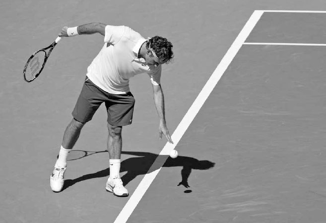

*Federer cân nhắc các lựa chọn giao bóng của mình trước khi thực hiện cú giao bóng.*

Trong khi thực hiện thói quen trước giao bóng, bạn nên suy nghĩ về những kiểu xoáy và vị trí giao bóng nào đã hiệu quả cho đến thời điểm đó trong trận đấu, kiểu giao bóng nào tận dụng tốt nhất điểm mạnh của bạn, và kiểu giao bóng nào phù hợp nhất với tỷ số hiện tại (xem trang 64--65). Những yếu tố này nên định hình quyết định của bạn khi chọn loại giao bóng sẽ sử dụng.

Trước khi bắt đầu giao bóng, hãy chắc chắn đặt tay đánh của bạn vào cách cầm continental với cánh tay thả lỏng. Cách cầm continental là một thành phần then chốt của một cú giao bóng mạnh mẽ. Chỉ khi sử dụng cách cầm này, bạn mới có thể đạt được những đặc tính quan trọng của cú giao bóng mà tôi sẽ bàn sâu hơn sau đây: độ sâu của động tác thả vợt, điểm tiếp xúc cao, động tác sấp cổ tay đầy đủ, và khả năng thực hiện những cú giao bóng xoáy mạnh. Cuối cùng, hãy tưởng tượng trong đầu bóng rơi đúng vào ô giao bóng mà bạn nhắm tới. Việc hình dung thành công như vậy trên cú giao bóng sẽ giúp bạn tập trung và tự tin hơn.

### **2. TƯ THẾ ĐỨNG**

Không có một tư thế giao bóng hoàn hảo duy nhất nào cả, nếu không thì tất cả các tay vợt hàng đầu đã sử dụng nó và kỹ thuật giao bóng đã trở nên đồng nhất. Tư thế tốt nhất tùy thuộc vào từng tay vợt, và bạn cần tìm ra tư thế phù hợp nhất với mình thông qua việc luyện tập lặp lại và thử nghiệm. Ba tư thế giao bóng chính là tư thế nền tảng, tư thế nền tảng hẹp, và tư thế điểm tựa.

Bất kể bạn sử dụng tư thế nào, tôi khuyến nghị bạn nên bắt đầu cú giao bóng với chân trước hướng về phía cột lưới bên phải. Chân sau là một sở thích mang tính cá nhân hơn, nhưng tôi khuyến nghị chân sau của bạn nên xếp thẳng hàng phía sau và hơi lệch sang trái so với chân trước, đồng thời tạo góc song song với vạch cuối sân để neo giữ tốt nhất quá trình chuyển trọng lượng xảy ra khi bắt đầu cú giao bóng (ảnh dưới).

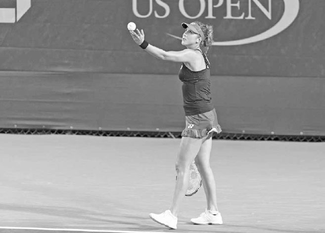

*Belinda Bencic bắt đầu cú giao bóng với chân trước hướng về phía cột lưới bên phải và chân sau tạo góc song song với vạch cuối sân.*

Hãy cùng mô tả ba tư thế này và xem xét sự đánh đổi của mỗi tư thế về mặt sức mạnh và độ ổn định.

### **A. TƯ THẾ NỀN TẢNG**

Ở tư thế nền tảng, chân trước và chân sau của bạn nên cách nhau hơn một chút so với chiều rộng vai (ảnh trái). Trọng lượng của bạn bắt đầu dồn về phía trước rồi đung đưa ra sau trong khi đôi chân vẫn đứng yên khi bạn bắt đầu pha lấy đà. Tư thế nền tảng có ưu điểm là quá trình chuyển trọng lượng đơn giản, do đó dẫn đến cú tung bóng đáng tin cậy hơn và cú giao bóng ổn định hơn. Ngoài ra, phần chân đế tương đối rộng mà tư thế này mang lại trong giai đoạn đỉnh của pha vung vợt giúp đôi chân đẩy người lên mạnh mẽ từ mặt đất. Những ưu điểm này, cùng với sự đơn giản và tự nhiên của tư thế nền tảng, khiến nó trở thành lựa chọn tốt cho các tay vợt nghiệp dư. Những đặc tính này cũng hữu ích cho các tay vợt chuyên nghiệp đỉnh cao, và phần nào lý giải vì sao những tay vợt như Milos Raonic, một người giao bóng theo tư thế nền tảng, hiếm khi có một ngày giao bóng tệ. Nhược điểm chính của tư thế này là chân đế rộng hơn làm giảm sức mạnh sinh ra từ chuyển động hông so với hai tư thế còn lại, và nó có ít động lượng về phía trước hơn so với phương pháp điểm tựa.

Milos Raonic sử dụng tư thế nền tảng.

**C. TƯ THẾ ĐIỂM TỰA**
----------------------

Phong cách giao bóng điểm tựa bắt đầu với hai chân cách nhau rộng hơn vài centimet so với tư thế nền tảng (ảnh trái). Khi hai tay nâng lên trong pha lấy đà, bạn bước chân sau lên phía trước, đưa hai chân xếp cạnh nhau, trước khi gập đầu gối và bật người lên để đánh bóng (ảnh phải).

Trong ba phong cách giao bóng, phương pháp điểm tựa có sự chuyển trọng lượng về phía trước mạnh nhất. Ngoài ra, so với tư thế nền tảng, hai chân gần nhau hơn trong giai đoạn đỉnh của pha vung vợt, giải phóng cho hông một biên độ đẩy, kéo, và xoay lớn hơn, đồng thời tạo thêm lực xoắn cho thân mình và sức mạnh cho cánh tay. Tuy nhiên, vì có nhiều chuyển động cơ thể xảy ra hơn khi cánh tay trái nâng lên để tung bóng, cú tung bóng có thể kém đáng tin cậy hơn. Ngoài ra, vì đây là một cú giao bóng mang tính vận động nhiều hơn, nó đòi hỏi khả năng kiểm soát cơ thể và canh thời điểm tốt hơn. Đây là phong cách giao bóng khó nhất trong ba phong cách, nhưng cũng là phong cách bùng nổ nhất, đó là lý do vì sao hầu hết các tay vợt ATP và phần lớn các tay vợt WTA sử dụng tư thế này.

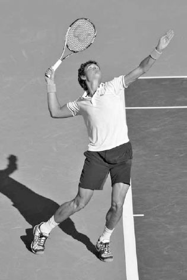

*John Isner sử dụng tư thế điểm tựa.*

### **3. PHA LẤY ĐÀ**

Một khi đã hoàn thành thói quen trước giao bóng và xác định tư thế đứng, bạn đã sẵn sàng bắt đầu cú giao bóng và thực hiện pha lấy đà. Cú giao bóng cần có nhịp điệu để trở nên mạnh mẽ, vì vậy các chuyển động của bạn trong pha lấy đà rất quan trọng.

Có ba kiểu lấy đà chính: kiểu con lắc, kiểu rút gọn, và kiểu ngang hông. Khi xác định kiểu lấy đà phù hợp nhất với mình, hãy nhớ rằng mục đích của pha lấy đà có hai phần: thứ nhất, tạo ra một nhịp điệu cho phép năng lượng được tích lũy mạnh mẽ trong đôi chân, và thứ hai, đặt vợt một cách hiệu quả vào đúng vị trí ở giai đoạn đỉnh của pha vung vợt.

  ----------------------------------------------------------------------------------------------------------------------------------------------------------------------------------------------------------------------------------------------------------------------------------------------------------------------------------------------------------------------------------------------------------------------------------------------------------------------------------------------------------------------------------------------------------------------------------------------------------------------------------------------------------------------------------------------------------------------------------------------------------------------------------------------------------------------------------------------------------------------------------------------
  **HỘP HUẤN LUYỆN VIÊN:**
  **Các tay vợt chuyên nghiệp hàng đầu hiểu rõ tầm quan trọng của tư thế đứng và pha lấy đà trong cú giao bóng, và thường xuyên thử nghiệm cũng như điều chỉnh kỹ thuật của mình. Đầu sự nghiệp, Rafael Nadal đã chuyển từ sử dụng tư thế nền tảng sang tư thế điểm tựa trong cú giao bóng. Sự điều chỉnh này đã làm tăng đáng kể tốc độ giao bóng của anh. Tương tự, cú giao bóng của Novak Djokovic trước năm 2010 có pha lấy đà dài hơn, khiến kỹ thuật của anh phức tạp hơn và dẫn đến cú giao bóng kém ổn định hơn. Năm 2010, anh đã rút ngắn và di chuyển pha lấy đà sang bên phải, với cánh tay thả lỏng và gập nhiều hơn. Chuyển động hiệu quả hơn này đã cải thiện sự cân bằng của anh và đặt vợt vào vị trí thoải mái hơn ở giai đoạn đỉnh của pha vung vợt. Sau khi thực hiện thay đổi này, cú giao bóng được nâng cấp của Djokovic đã giúp anh có một chuỗi trận thắng ấn tượng.**
  ----------------------------------------------------------------------------------------------------------------------------------------------------------------------------------------------------------------------------------------------------------------------------------------------------------------------------------------------------------------------------------------------------------------------------------------------------------------------------------------------------------------------------------------------------------------------------------------------------------------------------------------------------------------------------------------------------------------------------------------------------------------------------------------------------------------------------------------------------------------------------------------------

Chắc chắn rằng, nếu Nadal và Djokovic sẵn sàng hoàn thiện cú giao bóng của mình trong suốt sự nghiệp chuyên nghiệp, thì mọi tay vợt cũng nên sẵn lòng thực hiện những điều chỉnh trong cú đánh và đón nhận quá trình học hỏi thay đổi, đôi khi điều đó có nghĩa là phải lùi một bước trước khi tiến hai bước.

*Đầu sự nghiệp chuyên nghiệp, Nadal đã chuyển từ sử dụng tư thế nền tảng (ảnh trái) sang tư thế điểm tựa (ảnh phải).*

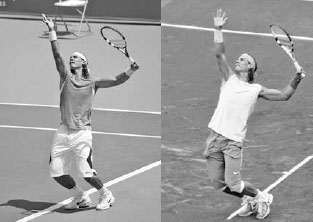

*Cú giao bóng năm 2014 của Djokovic (ảnh trái) có pha lấy đà thoải mái hơn, ngắn hơn so với phiên bản năm 2008 của anh (ảnh phải).*

### **A. PHA LẤY ĐÀ KIỂU CON LẮC**

Pha lấy đà kiểu con lắc là kiểu lấy đà truyền thống, trong đó vợt hạ xuống gần mặt đất (ảnh trang đối diện, trái) trước khi di chuyển ra sau rồi lên đến giai đoạn đỉnh của pha vung vợt, vẽ nên đường viền của một vòng tròn. Vì vợt di chuyển theo dòng chảy tự nhiên của chuyển động con lắc, đây là một pha lấy đà dễ thực hiện và phù hợp cho các tay vợt nghiệp dư.

*Andy Murray bắt đầu một pha lấy đà kiểu con lắc.*

### **B. PHA LẤY ĐÀ KIỂU RÚT GỌN**

Ở pha lấy đà kiểu rút gọn, một khi vợt đã ra sau ngang với chân sau, nó đi thẳng lên qua ngực để vào giai đoạn đỉnh của pha vung vợt (ảnh giữa). Pha lấy đà ngắn hơn này phù hợp nhất cho những người giao bóng có nhịp điệu nhanh hơn. Nó có ưu điểm là đơn giản nhưng đòi hỏi sức mạnh và độ linh hoạt đáng kể ở vai để sử dụng và tạo ra một cú giao bóng mạnh mẽ.

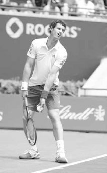

*Richard Gasquet sử dụng pha lấy đà kiểu rút gọn.*

**C. PHA LẤY ĐÀ KIỂU NGANG HÔNG**
---------------------------------

Ở pha lấy đà kiểu ngang hông, vợt lướt qua hông theo phương ngang trước khi nâng lên giai đoạn đỉnh của pha vung vợt (ảnh phải). Một số tay vợt cảm thấy pha lấy đà kiểu con lắc quá dài và không phù hợp với nhịp điệu giao bóng, trong khi những người khác lại thấy pha lấy đà kiểu rút gọn không đủ dài để tích lũy năng lượng tốt ở phần thân dưới. Những tay vợt này có khả năng sẽ sử dụng pha lấy đà kiểu ngang hông cho cú giao bóng của mình.

Maria Kirilenko thực hiện một pha lấy đà kiểu ngang hông.

Triết lý giảng dạy về cách hai tay nên di chuyển lên trong pha lấy đà đã thay đổi theo thời gian. Trước đây, hướng dẫn thường là "hai tay đi xuống cùng nhau, rồi đi lên cùng nhau," trong đó tay đánh và tay tung bóng nâng lên cùng lúc vào giai đoạn đỉnh của pha vung vợt (ảnh giữa). Đây là một phương pháp đơn giản và vẫn hiệu quả đối với các tay vợt nghiệp dư và một số ít các tay vợt chuyên nghiệp thi đấu. Tuy nhiên, trong kỹ thuật giao bóng hiện đại được hầu hết các tay vợt trình độ cao và các tay vợt chuyên nghiệp sử dụng, tay đánh hơi trễ lại so với tay tung bóng. Ở đây, tay đánh của bạn ở khoảng ngang hông trong khi tay tung bóng thả bóng ra phía trên đầu, tạo ra một chuyển động "bập bênh" của hai cánh tay (ảnh phải). **Mặc dù kỹ thuật này phức tạp hơn một chút, những lợi ích của nó rất rõ ràng: nó giữ cho vai thả lỏng hơn, thiết lập một vị trí tích lũy năng lượng dài hơn cho một cú đẩy chân mạnh mẽ hơn, và nghiêng vai lên cao hơn để đạt điểm tiếp xúc cao hơn.**

### **4. ĐỘNG TÁC TUNG BÓNG**

Trong khi tay phải thực hiện pha lấy đà, tay trái của bạn tung bóng lên. Đây là một sự thật đơn giản --- để thực hiện một cú giao bóng tốt, bạn phải có một cú tung bóng chính xác. Một cú tung bóng không ổn định sẽ dẫn đến những điểm tiếp xúc gượng gạo và phá hỏng nhịp điệu cần thiết cho một cú giao bóng mạnh mẽ và đáng tin cậy.

### **A. KỸ THUẬT TUNG BÓNG**

Có bốn thành phần của kỹ thuật tung bóng cần xem xét.

### **1. CÁCH CẦM BÓNG**

Tôi khuyến nghị đặt nửa trên của ba hoặc bốn ngón tay lên một bên của quả bóng và đầu ngón cái tựa vào phía đối diện (ảnh phải). Giữ bóng nhẹ nhàng theo kiểu cầm như gọng kìm này. Đừng giữ bóng sâu trong lòng bàn tay; các ngón tay của bạn có thể cản trở việc thả bóng ra và khiến cú tung bóng bị lệch.

  --------------------------------------------------------------------------------------------------------------------------------------------------------------------------------------------------------------------------------------------------------------------------------------------------------------------------------------------------------------------------------------------------------------------------------------------------------------------------------------------------------------------------------------------------------------------------------------------------------------------------------------------------------------------------------------------------------------------------------------------------
  **HỘP HUẤN LUYỆN VIÊN:**
  **Tầm quan trọng của cú tung bóng đã thể hiện rõ trong lối chơi của Serena Williams tại U.S. Open 2015. Thông thường, cú tung bóng rất đáng tin cậy của cô đặt điểm tiếp xúc trên cú giao bóng trong một phạm vi hẹp khoảng 20 cm. Tuy nhiên, trong ba trận đấu đầu tiên tại U.S. Open 2015, cú tung bóng của cô không ổn định, khiến phạm vi này tăng lên khoảng 48 cm. Sự bất ổn định này đã làm rối loạn nhịp độ giao bóng của cô và dẫn đến số lần giao bóng hỏng gần bằng với số cú ace. Sau trận đấu thứ ba, cô đã thu hẹp phạm vi độ cao tiếp xúc trở lại còn khoảng 20 cm, và trong ba trận đấu tiếp theo, số cú ace của cô nhiều hơn gấp ba lần số lần giao bóng hỏng.(2) Để tung bóng tốt, hãy giữ bóng ở nửa trên của các ngón tay.**
  --------------------------------------------------------------------------------------------------------------------------------------------------------------------------------------------------------------------------------------------------------------------------------------------------------------------------------------------------------------------------------------------------------------------------------------------------------------------------------------------------------------------------------------------------------------------------------------------------------------------------------------------------------------------------------------------------------------------------------------------------

### **2. CHUYỂN ĐỘNG CỦA CÁNH TAY**

Tay tung bóng của bạn nên ở phía trước cơ thể và chỉ hạ xuống nhẹ trước khi đi lên (ảnh trang đối diện, trái). Nếu giao bóng sang ô bên phải khi đánh đơn, tay tung bóng bắt đầu chuyển động hướng về phía cột lưới bên phải để xoay vai (ảnh trang đối diện, giữa), sau đó hướng về phía trung tâm sân khi tiếp tục di chuyển lên trên. Hãy nhớ rằng vì điểm tiếp xúc nằm bên trái so với nơi bàn tay thả bóng ra, cú tung bóng của bạn sẽ tạo thành một đường cong nhẹ từ phải sang trái. Đối với các tay vợt nghiệp dư, tôi khuyến nghị tay tung bóng nên đi lên hơi lệch trái so với cột lưới bên phải. Cách này giúp cú tung bóng không bị cong mà đi lên thẳng hơn theo đường thẳng, cho một cú tung bóng đơn giản hơn.

Cánh tay của bạn nên thẳng, cổ tay giữ yên, và lòng bàn tay hướng lên trời khi bạn tung bóng. Để giúp bạn giữ cánh tay thẳng và cổ tay ổn định khi thả bóng ra trong cú tung, hãy thử tưởng tượng thay vì một quả bóng, bạn đang cầm một cây kem ốc quế mà bạn nâng lên trong khi cố gắng không làm đổ kem. Hãy nhớ thả bóng ra ở độ cao hơi trên đầu một chút (ảnh trang đối diện, phải). Điều này sẽ giúp giữ cho cú giao bóng của bạn mượt mà và rút ngắn khoảng cách mà bóng phải di chuyển, giảm khả năng cú tung bóng bị lệch.

### **3. THĂNG BẰNG**

Trọng lượng của bạn sẽ dịch chuyển ra sau trong khi tung bóng, nhưng chuyển động này nên hoàn tất vào lúc bóng rời khỏi các ngón tay của bạn (ảnh phải). Giữ trọng lượng của bạn hơi dồn vào chân sau khi bạn thả bóng ra, để thiết lập một vị trí tốt cho lực đẩy lên trên và về phía trước của cơ thể diễn ra sau đó.

### **4. ĐỘNG TÁC THEO BÓNG**

Sau khi bóng được thả ra, tay tung bóng của bạn tiếp tục nâng lên đến một vị trí gần như vuông góc với mặt đất (trang sau, ảnh trái). Điều này tạo ra một chuyển động mượt mà, kéo dài và cho phép cánh tay của bạn di chuyển với tốc độ phù hợp tại thời điểm thả bóng. Nếu bạn dừng đột ngột động tác theo bóng của tay tung bóng, bạn sẽ thả bóng ra quá thấp và quá nhanh để có một cú tung bóng chính xác.

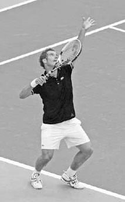

*Cú tung bóng của Caroline Wozniacki cho thấy tay trái của cô hạ xuống nhẹ, duỗi thẳng, rồi nâng lên mượt mà hướng về phía cột lưới bên phải.*

### **B. VỊ TRÍ TUNG BÓNG**

Độ cao của cú tung bóng sẽ bị ảnh hưởng bởi tốc độ và độ dài của pha lấy đà. Những người giao bóng có pha lấy đà chậm hơn hoặc dài hơn sẽ cần một cú tung bóng cao hơn so với những người có pha lấy đà nhanh hơn hoặc ngắn hơn. Mặc dù mỗi người có nhịp điệu hơi khác nhau trên cú giao bóng, một nguyên tắc chung tốt là đỉnh của cú tung bóng nên cao hơn điểm tiếp xúc khoảng 30-60 cm (trang sau, ảnh phải). Điều này cho phép đủ thời gian để thực hiện pha vung vợt với nhịp điệu tốt và tích lũy năng lượng đầy đủ khắp cơ thể. Một cú tung bóng quá cao sẽ khó canh thời điểm và kém ổn định hơn, trong khi một cú tung bóng quá thấp sẽ bó hẹp việc duỗi tay tốt và giảm thời gian dành cho cơ thể tích lũy năng lượng.

Cú tung bóng nên nằm ở phía trước bạn. Góc nghiêng của cơ thể bạn vào trong sân giúp tạo ra động lượng cơ thể về phía trước cần thiết để thực hiện một cú giao bóng uy lực (ảnh phải). Khoảng cách phía trước bạn sẽ phụ thuộc vào chiều cao của bạn và loại giao bóng bạn đang thực hiện, nhưng khoảng 60 cm phía trước cho giao bóng thứ nhất và khoảng 30 cm phía trước cho giao bóng thứ hai là những nguyên tắc chung tốt.

Để giúp tạo ra một cú tung bóng mượt mà, Li Na tiếp tục nâng tay trái lên sau khi thả bóng ra.

Hướng của cú tung bóng cũng sẽ thay đổi từ phải sang trái tùy thuộc vào loại giao bóng bạn đang thực hiện (xem trang 59) và bên bạn đang giao bóng tới. Nếu hình dung trước mặt một chiếc đồng hồ và giao bóng sang ô bên phải, cú giao bóng phẳng của bạn sẽ có cú tung bóng ở khoảng vị trí 12 giờ. Ở ô bên trái, vì mục tiêu và động lượng của bạn nghiêng nhiều hơn về bên phải, hãy di chuyển cú tung bóng hơi lệch sang phải nhiều hơn.

*Venus Williams tung bóng cao hơn điểm tiếp xúc khoảng 60 cm và hướng vào trong sân, cho cô thời gian để tích lũy năng lượng qua cơ thể và nghiêng người về phía trước để tăng thêm sức mạnh.*

### **5. TƯ THẾ CÂY ĐÈN**

Sau pha lấy đà và khi thả bóng ra trong cú tung, bạn bước vào tư thế thường được gọi là tư thế "cây đèn". Trong tư thế cây đèn mẫu mực, cánh tay trái của bạn chỉ thẳng lên hướng về quả bóng, và cánh tay phải gập thành hình chữ L với vợt hướng lên trời và mặt vợt hướng về phía hàng rào bên sân (ảnh trang đối diện). Nếu nhìn tư thế cây đèn từ phía sau, khuỷu tay phải nên nằm bên trái so với vai phải. Vị trí khuỷu tay này đặt vợt vào một vị trí tốt để hạ xuống hoàn toàn phía sau lưng và kéo giãn vai của bạn để bật vợt nhanh hơn tới bóng sau đó trong cú giao bóng.

  ---------------------------------------------------------------------------------------------------------------------------------------------------------------------------------------------------------------------------------------------------------------------------------------------------------------------------------------------------------------------------------------------------------------------------------------------------------------------------------------------------------------------------------------------------------------------------------------------------------------------------------------------------------------------------------------------------------------------------------------------
  **HỘP HUẤN LUYỆN VIÊN:**
  **Cú tung bóng có vẻ như là một nhiệm vụ dễ thực hiện tốt, nhưng vì các bộ phận khác của cơ thể cũng đang chuyển động trong lúc tung bóng, nó có thể là một kỹ năng khó nắm bắt đối với một số người. May mắn thay, đây là một kỹ năng có thể dễ dàng luyện tập ở hầu như bất cứ đâu. Nếu trần nhà của bạn đủ cao, bạn có thể cải thiện cú tung bóng ngay tại nhà một cách thoải mái, hoặc nếu không thể, bạn có thể luyện tập ngoài trời tại một công viên gần đó. Ở công viên, hãy đánh dấu một điểm trên hàng rào bằng một mảnh giấy tượng trưng cho đỉnh cú tung bóng của bạn và luyện tập tung bóng đến điểm đó. Hãy nhớ di chuyển tay đánh của bạn khi tung bóng và thực hiện cú tung bóng giống như bạn sẽ làm trong một trận đấu.**
  ---------------------------------------------------------------------------------------------------------------------------------------------------------------------------------------------------------------------------------------------------------------------------------------------------------------------------------------------------------------------------------------------------------------------------------------------------------------------------------------------------------------------------------------------------------------------------------------------------------------------------------------------------------------------------------------------------------------------------------------------

Tư thế cây đèn đôi khi còn được gọi là tư thế sức mạnh vì trong giai đoạn này của cú giao bóng, cơ thể cuộn lại để tích trữ sức mạnh, sức mạnh này sẽ được giải phóng khi cơ thể bung ra ngay sau đó. Về bản chất, cơ thể lúc này trở nên như một chiếc lò xo được nén lại, chuẩn bị cho cánh tay vung vợt với sức mạnh bùng nổ và cơ thể nâng lên, tiến về phía trước hướng tới bóng. Đây là cách những tay giao bóng vĩ đại thực hiện cú giao bóng của họ với tốc độ và sự ổn định. Họ thiết lập một tư thế sức mạnh vững chắc, rồi giải phóng năng lượng đã tích trữ và nâng cơ thể lên để đánh bóng ở một độ cao tạo ra một quỹ đạo vượt qua lưới với biên độ an toàn tốt và rơi sâu vào trong vạch giao bóng (trang sau, dưới).

Bốn chuyển động cơ thể diễn ra cùng lúc trong tư thế cây đèn: xoay vai, gập đầu gối, nghiêng lưng, và đẩy hông.

David Ferrer thiết lập tư thế cây đèn cổ điển: tay trái nâng lên và duỗi thẳng, tay phải gập hình chữ L, và vợt hướng lên trời. Anh cũng xoay vai và gập đầu gối để cuộn cơ thể lại và tích trữ năng lượng, năng lượng này sẽ được giải phóng khi cơ thể bung ra ngay sau đó.

### **A. XOAY VAI**

Khi bạn nâng hai tay lên vào tư thế cây đèn, vai trái của bạn xoay sang phải để hướng về phía cột lưới bên phải (ảnh trên). Vai của bạn nên xoay nhiều hơn hông để tạo ra sự bung ra của vai, giúp tăng thêm sức mạnh cho pha vung vợt.

### **B. GẬP ĐẦU GỐI**

Mức độ gập đầu gối sẽ khác nhau tùy từng tay vợt, nhưng một góc gập chân trong khoảng 30 đến 40 độ được xem là lý tưởng (ảnh trên). Cơ chân là nhóm cơ khỏe nhất trong cơ thể; bạn cần sử dụng chúng tốt để thực hiện cú giao bóng tốt nhất của mình.

**C. NGHIÊNG LƯNG**
-------------------

Lưng của bạn nên hơi ngả ra sau (ảnh phải) để kích hoạt các cơ bụng và cho phép phần thân trên xoay, đẩy vai phải của bạn vừa lên trên vừa ra trước (tức là chuyển động "lộn nhào"). Nếu không nghiêng lưng, vai phải của bạn sẽ di chuyển về phía trước nhưng ít có khả năng di chuyển lên trên. Nghiêng lưng cũng làm sâu thêm động tác thả vợt tiếp theo sau đó và tích trữ thêm sức mạnh trong đôi chân, tạo ra một cú đẩy chân mạnh mẽ hơn.

### **D. ĐẨY HÔNG**

Nhìn từ góc bên, góc của cơ thể bạn khi hoàn thành tư thế cây đèn nên tạo thành một đường cong, trong đó hông trước đẩy về phía trước so với chân và vai (ảnh phải). Bằng cách dẫn đầu bằng hông trước, bạn kéo giãn các cơ liên sườn, nghiêng vai lên trên, và đặt ngực bên dưới cú tung bóng. Điều này đặt cơ thể bạn vào một vị trí tốt để nâng người lên và tiến về phía trước tới bóng.

Việc thiết lập một tư thế cây đèn mạnh mẽ rồi nâng cơ thể lên và tiến về phía trước tới bóng mang lại một điểm tiếp xúc cao hơn, và do đó, một biên độ an toàn lớn hơn phía trên lưới (A) và bên trong vạch giao bóng (B).

*Bằng cách nghiêng lưng ra sau và đẩy hông về phía trước, Philipp Kohlschreiber tạo ra một góc cơ thể có thể bật anh lên và tiến về phía trước mạnh mẽ tới bóng.*

  -------------------------------------------------------------------------------------------------------------------------------------------------------------------------------------------------------------------------------------------------------------------------
  **HỘP HUẤN LUYỆN VIÊN:**
  **Một lỗi phổ biến ở tư thế cây đèn trong cú giao bóng là mặt vợt hướng lên trên (ảnh phải) thay vì hướng về phía hàng rào bên sân. Điều này gây ra bởi việc sử dụng sai cách cầm thuận tay và dẫn đến pha lấy đà bị rút ngắn, điểm tiếp xúc thấp, và tốc độ vợt kém.**
  -------------------------------------------------------------------------------------------------------------------------------------------------------------------------------------------------------------------------------------------------------------------------

Việc chuyển từ cách cầm thuận tay sang cách cầm continental trong cú giao bóng sẽ khiến bóng lệch sang trái. Để khắc phục vấn đề này, hãy thử bài tập sau.

Đầu tiên, đứng ở vạch giao bóng với tư thế giao bóng của bạn, đặt tay vào cách cầm continental, và nâng đầu vợt lên hơi cao hơn đầu bạn (ảnh dưới, trái).

Thứ hai, tung bóng lên, thả vợt xuống sau lưng, và khi bạn vung vợt lên đánh bóng, hãy sấp cổ tay. Tôi khuyến nghị đánh sang ô bên trái vì bóng và vợt di chuyển cùng hướng sang phải, giúp việc học cách cầm continental trong cú giao bóng dễ dàng hơn so với khi đánh sang trái vào ô giao bóng bên phải. Khi tiếp xúc bóng, tập trung vào việc giữ cánh tay thẳng, vợt ở vị trí gần ngang với phía trước khuôn mặt, và hông hơi khép lại về phía lưới (ảnh dưới, giữa). Hãy nhớ rằng bạn phải nâng điểm tiếp xúc lên cao hơn và ít ở phía trước cơ thể hơn so với khi bạn sử dụng cách cầm thuận tay.

Thứ ba, ngay sau khi tiếp xúc bóng, giữ vợt ở độ cao ngang vai và đảm bảo cổ tay đã xoay mặt vợt sao cho nó hướng về phía hàng rào bên phải sân (ảnh dưới, phải). Một khi bạn đã thành thạo chuyển động vợt này từ vạch giao bóng, hãy lùi dần ra sau cho đến khi bạn thực hiện thành công từ vạch cuối sân.

### **6. ĐỘNG TÁC THẢ VỢT**

Sau tư thế cây đèn, vợt hạ xuống phía sau lưng bạn. Động tác thả vợt càng sâu, quãng đường vợt có thể đi để tích lũy tốc độ đến điểm tiếp xúc càng dài, và sức mạnh tạo ra từ việc kéo giãn vai cùng độ trễ của vợt càng lớn (ảnh dưới). Đây là lý do vì sao việc cầm vợt thả lỏng trong cú giao bóng là điều thiết yếu; vợt của bạn sẽ không hạ xuống hoàn toàn nếu vai của bạn căng cứng.

Một động tác thả vợt hoàn chỉnh đòi hỏi sự kết hợp giữa xoay thân mình, đẩy chân, độ linh hoạt của vai, và chuyển động của khuỷu tay. Sự xoay của phần thân dưới khởi động giai đoạn đầu tiên của động tác thả vợt, cú đẩy chân thúc đẩy giai đoạn thứ hai, và sự xoay của phần thân trên thúc đẩy giai đoạn thứ ba (ảnh trang đối diện). Khi những chuyển động này diễn ra, sự xoay của vai và chuyển động lên trên, ra trước của khuỷu tay cũng làm tăng thêm độ sâu cho động tác thả vợt. Điều này nghe có vẻ phức tạp, nhưng nó diễn ra một cách tự nhiên nếu bạn sử dụng cách cầm continental, thiết lập một tư thế cây đèn tốt, và vung vợt lên đánh bóng.

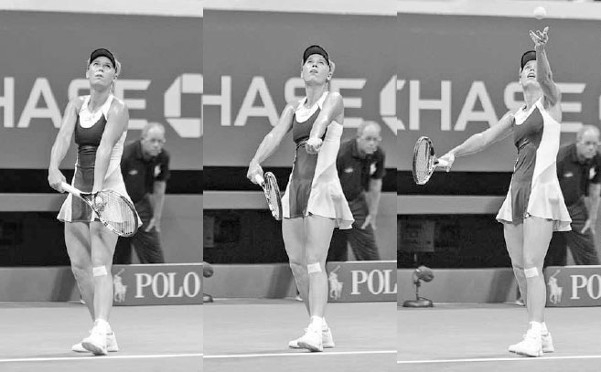

*Động tác thả vợt sâu của Murray kéo giãn các cơ vai và kéo dài pha vung vợt của anh để tăng thêm sức mạnh cho cú giao bóng.*

Ở cuối động tác thả vợt, lưng của bạn thẳng lại và thẳng hàng với đôi chân đang duỗi thẳng. Tại thời điểm này, vợt của bạn vẫn đứng yên trong một khoảnh khắc ngắn ngay cả khi ngực bạn đã bắt đầu đi lên, tạo ra độ trễ của vợt, kéo giãn các cơ vai và tạo ra một hiệu ứng lò xo mạnh mẽ.

CÁC TAY GIAO BÓNG VĨ ĐẠI CÓ NHỮNG ĐIỂM TƯƠNG ĐỒNG về kỹ thuật. Ở đây chúng ta thấy động tác giao bóng của Venus Williams (thuận tay phải) được phản chiếu với động tác của Petra Kvitova (thuận tay trái). Sau khi thiết lập một tư thế cây đèn hay tư thế sức mạnh vững chắc (ảnh 1 và 4), hãy chú ý cách khuỷu tay đánh của họ nâng lên khi hông xoay lên và vòng quanh, còn đôi chân bắt đầu duỗi thẳng (ảnh 2 và 5). Những chuyển động cơ thể này tạo ra một động tác thả vợt sâu (ảnh 3 và 6), đặt vợt của họ vào vị trí hoàn hảo để trễ lại rồi tăng tốc lên tới bóng.

*Sau động tác thả vợt, Nadal thực hiện động tác "lộn nhào" vai đánh qua vai không đánh.*

### **7. TỪ ĐỘNG TÁC THẢ VỢT ĐẾN TIẾP XÚC BÓNG**

Cơ thể nghiêng ngang trong động tác thả vợt, nhưng bắt đầu mở ra khi hông xoay lên và vòng về phía lưới trong khi vợt di chuyển lên khỏi động tác thả. Một khi hông đã "bung", chúng nhanh chóng dừng lại, cho phép năng lượng được truyền từ thân mình sang vai và cánh tay.

Khi chuyển động hông này diễn ra, khuỷu tay đánh của bạn nhanh chóng nâng lên và duỗi thẳng, đi theo một đường hướng lên trên qua tai khi thân mình xoay quanh cột sống. Ở đây, nếu bạn buông vợt ra khi đang thực hiện đúng chuyển động khuỷu tay hướng lên, vợt sẽ bay qua vạch cuối sân của đối thủ, thay vì rơi trước lưới. Để phù hợp với chuyển động khuỷu tay này, vai đánh của bạn phải di chuyển qua vai không đánh theo kiểu "lộn nhào" (ảnh trên). Động tác lộn nhào vai này giúp nâng cơ thể bạn lên để tối đa hóa độ cao tiếp xúc bóng.

Một vấn đề phổ biến ở các tay vợt nghiệp dư là họ không thực hiện động tác lộn nhào vai. Thay vào đó, vai của họ xoay theo phương ngang nhiều hơn, khiến khuỷu tay bị kéo sang một bên và đường vòng cung của pha vung vợt phía trên đầu trở nên thẳng hơn là tròn. Điều này dẫn đến điểm tiếp xúc thấp hơn và quỹ đạo bóng kém vào ô giao bóng.

### **8. ĐỘNG TÁC SẤP CỔ TAY**

Khi khuỷu tay của bạn nâng lên và duỗi thẳng để vươn lên đánh bóng, cổ tay của bạn sấp lại; nghĩa là, nó xoay lòng bàn tay từ hướng về phía hàng rào bên trái sang hướng về phía hàng rào bên phải. Đây là chuyển động cuối cùng của tay đánh trước khi tiếp xúc bóng, và là một yếu tố quan trọng để đạt được tốc độ vợt nhanh.

Mỗi kiểu trong bốn kiểu giao bóng sử dụng một cách sấp cổ tay khác nhau. Ở cú giao bóng phẳng (tôi sẽ mô tả chuyển động cổ tay trên cú giao bóng cắt và giao bóng xoáy kích ở phần sau của chương), bạn sấp cổ tay bằng cách trước tiên dẫn đầu bằng cạnh vợt khi gần tiếp xúc bóng, giống như bạn sắp chặt karate vào bóng (ảnh trái). Sau đó, khi cạnh đầu vợt tiến gần hơn nữa tới bóng, bạn xoay mặt vợt khoảng 90 độ để đưa dây vợt vuông góc với mục tiêu, về cơ bản như đang "đập tay" vào bóng lúc tiếp xúc (ảnh giữa). Sau khi tiếp xúc, mặt vợt của bạn tiếp tục xoay ra ngoài thêm khoảng 90 độ nữa để hoàn tất động tác sấp cổ tay (ảnh phải). Đây là một trong những lý do vì sao cách cầm continental lại quan trọng đến vậy trong cú giao bóng. Chỉ với cách cầm continental, bạn mới có thể "lật" mặt vợt với tốc độ rất cao trong một khoảng cách ngắn như vậy.

Federer tăng tốc ra khỏi động tác thả vợt với cạnh vợt dẫn đầu. Sau đó, cổ tay anh sấp lại để xoay vợt và đưa dây vợt vuông góc với bóng để tiếp xúc. Sau khi tiếp xúc, cổ tay anh tiếp tục sấp, khiến vợt hướng về phía hàng rào bên phải.

### **9. VỊ TRÍ CƠ THỂ LÚC TIẾP XÚC BÓNG**

Khi bạn vươn lên đánh bóng, hông của bạn sẽ xoay nhưng nên vẫn hơi nghiêng ngang với lưới lúc tiếp xúc (ảnh giữa). Nếu bạn thực hiện đúng, cánh tay của bạn nên duỗi thẳng hoàn toàn, với vợt gần ngang với phía trước khuôn mặt khi bạn nghiêng người về phía trước vào trong sân (ảnh phải). Vị trí cơ thể và vợt này sẽ tạo ra sức mạnh giao bóng tối ưu và tối đa hóa độ cao tiếp xúc bóng.

Ngược lại, nếu hông của bạn khép quá nhiều thì sức mạnh từ cú đẩy chân và sự xoay thân trên sẽ bị kìm hãm, và điểm tiếp xúc của bạn sẽ xảy ra phía sau khuôn mặt, một vị trí yếu về mặt vật lý. Hoặc, nếu hông của bạn mở quá rộng và song song với vạch cuối sân, sức mạnh đó được tạo ra từ cơ thể bạn sẽ giảm dần thay vì đạt đỉnh lúc tiếp xúc, và điểm tiếp xúc của bạn sẽ bị hạ thấp một cách bất lợi. Hãy nhớ rằng, mức độ khép hông của bạn sẽ phụ thuộc vào kiểu xoáy bạn đang sử dụng và hướng bạn đang nhắm cú giao bóng tới.

Vị trí của đầu và tay trái cũng quan trọng ở đây. Hãy nhớ giữ đầu ngẩng lên và di chuyển tay trái về phía ngực (ảnh phải). Nếu đầu bạn cúi xuống, trọng lượng của đầu sẽ kéo vai bạn xuống và làm giảm tầm với của bạn. Tương tự, nếu tay trái của bạn di chuyển xuống và ra xa khỏi cơ thể, nó sẽ kéo tay phải của bạn xuống và hạ thấp điểm tiếp xúc.

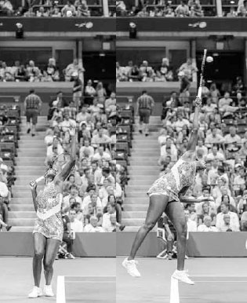

*Djokovic vươn lên với cánh tay duỗi thẳng hoàn toàn và hông hơi nghiêng ngang để đánh bóng gần ngang với phía trước khuôn mặt của anh.*

  -------------------------------------------------------------------------------------------------------------------------------------------------------------------------------------------------------------------------------------------------------------------------------------------------------------------------------------------------------------------------------------------------------------------------------------------------------------------------------------------------------------------------------------------------------------------------------------------------------------------------------------------------------------------------------------------------------------------------------------------------------------------------------------------------------------------------------------------------------------------------------------------------------------------------------------------------------------------------------------------------------------------
  **HỘP HUẤN LUYỆN VIÊN:**
  **Ngay trước khi tiếp xúc bóng trong cú giao bóng, nhiều tay vợt nghiệp dư không dẫn đầu bằng cạnh vợt mà thay vào đó lại đặt vợt hướng thẳng vào bóng. Điều này dễ hiểu vì rất khó để hình dung việc tiếp cận bóng bằng cạnh vợt, đặc biệt là vì ở nhiều cú đánh khác, bạn thường đặt dây vợt phía sau bóng từ khá lâu trước khi tiếp xúc. Tuy nhiên, cú giao bóng là một cú đánh đặc biệt, không chỉ vì bản thân pha vung vợt, mà còn vì bạn đang đánh một quả bóng đang di chuyển với tốc độ rất chậm theo một quỹ đạo gần như đi xuống. Hai đặc điểm này cho phép bạn xoay mặt vợt hơn 180 độ một cách nhanh chóng mà vẫn kiểm soát được cú đánh. Ở hầu hết mọi cú đánh khác, quả bóng đến có tốc độ phía sau và được đánh theo quỹ đạo ngang nhiều hơn. Do đó, ở những cú đánh khác, mặt vợt của bạn phải giữ ổn định hơn trong suốt quá trình tiếp xúc và làm chủ va chạm với bóng. Đừng để kỹ thuật cần thiết trên cú giao bóng ảnh hưởng xấu đến kỹ thuật của bạn ở những cú đánh khác, hoặc ngược lại.**
  -------------------------------------------------------------------------------------------------------------------------------------------------------------------------------------------------------------------------------------------------------------------------------------------------------------------------------------------------------------------------------------------------------------------------------------------------------------------------------------------------------------------------------------------------------------------------------------------------------------------------------------------------------------------------------------------------------------------------------------------------------------------------------------------------------------------------------------------------------------------------------------------------------------------------------------------------------------------------------------------------------------------

*Nadal di chuyển vợt ngang qua cơ thể và đá chân sau lên để kết thúc cú giao bóng.*

Việc di chuyển tay trái vào trong cũng giúp ngăn hông của bạn xoay quá mức và tăng thêm sức mạnh, sự ổn định cho tay phải. Tay trái của bạn hoạt động như một bộ giảm tốc, giúp tay phải tăng tốc và phóng vợt ra khỏi giai đoạn thả vợt với tốc độ lớn hơn. Hai cánh tay của bạn hoạt động theo cách tương tự như một chiếc xe đầu kéo bị gập góc. Tay trái của bạn mô phỏng phần đầu kéo đang phanh lại, trong khi tay phải mô phỏng phần rơ-moóc bị văng mạnh về phía trước.

### **10. ĐỘNG TÁC THEO BÓNG**

Sau khi hoàn tất động tác sấp cổ tay, bạn kết thúc cú giao bóng bằng động tác theo bóng. Động tác theo bóng cung cấp thông tin tốt về việc bạn đã vươn tới bóng tốt như thế nào. Một lực đẩy mạnh mẽ lên trên và về phía trước trong pha vung vợt sẽ nâng chân trước của bạn qua vạch cuối sân và nhấc chân sau lên không trung để cân bằng lại phần thân trên đang nghiêng về phía trước (ảnh phải). Đầu gối gập càng sâu và động tác lộn nhào vai càng mạnh, chân sau của bạn sẽ nâng lên càng cao để giữ thăng bằng cho cơ thể.

Chân sau của bạn nên nâng lên và kết thúc hướng thẳng về phía hàng rào cuối sân trong động tác theo bóng. Chân sau của bạn hoạt động như một "bánh lái" định hướng cho cơ thể. Nếu nó hướng về phía hàng rào bên phải thay vì hàng rào cuối sân, thì cơ thể bạn đã xoay quá nhiều. Chân trước của bạn nên hướng về phía mục tiêu khi bạn tiếp đất trong động tác theo bóng. Nếu chân trước của bạn hướng đáng kể sang trái, điều này cho thấy cơ thể đã xoay quá mức, trong khi hướng quá nhiều sang phải cho thấy điều ngược lại. Bạn có thể "đóng băng" động tác theo bóng của mình trong lúc luyện tập để xem chính xác vị trí của đôi chân và phân tích những gì có thể cần điều chỉnh.

Một khi chân trước của bạn tiếp đất về phía trước vào trong sân, vợt vung xuống bên trái phía sau bạn khi hông xoay qua pha vung vợt. Điều quan trọng là học cách giảm tốc mượt mà cho vợt trong động tác theo bóng và tránh dừng đột ngột, điều này có thể dẫn đến giảm sức mạnh và nguy cơ chấn thương. Tay trái của bạn, vốn đã được thu vào bên hông, sẽ đưa ra ở cuối động tác theo bóng và giữ lấy cổ vợt để chuẩn bị cho cú trả giao bóng của đối thủ.

Cựu tay vợt ATP top 5 và huấn luyện viên đỉnh cao Brad Gilbert từng nói rằng nếu phải chọn một tay vợt để giữ giao bóng trước một thế lực tà ác siêu nhiên với sự tồn vong của thế giới đang bị đe dọa, anh sẽ chọn Roger Federer. Điều này dễ hiểu; cú giao bóng của Federer đáng tin cậy, mạnh mẽ, và cực kỳ chính xác.

Federer bắt đầu cú giao bóng một cách thư thái với vợt hướng xuống khi anh thực hiện pha lấy đà kiểu con lắc. Ở khung hình thứ hai, anh xoay vai và gập đầu gối trong tư thế cây đèn để cuộn cơ thể lại và tích trữ năng lượng. Hãy chú ý anh nâng tay tung bóng lên cao như thế nào. Điều này không chỉ giúp anh tạo ra một chuyển động tung bóng mượt mà mà còn đẩy hông về phía trước, giúp anh nâng cơ thể lên và tiến về phía trước tới bóng. Ở khung hình thứ ba, anh bắt đầu bung cơ thể ra và giải phóng năng lượng bằng cách duỗi thẳng chân và xoay hông. Ở khung hình thứ tư, việc giải phóng năng lượng đã hoàn tất, và vợt bắt đầu di chuyển lên tới bóng với cạnh vợt dẫn đầu. Vợt của anh là bộ phận cuối cùng đi lên; theo cách đó, toàn bộ sức mạnh được tạo ra từ cơ thể anh được truyền vào nó. Ở khung hình thứ năm, anh đánh bóng với hông hơi nghiêng ngang với lưới. Chúng ta cũng thấy rằng vai anh đã thực hiện động tác lộn nhào, khuỷu tay đánh của anh đã nâng lên và duỗi thẳng, và cổ tay anh đã sấp để xoay vợt khoảng 90 độ so với khung hình trước đó. Ở khung hình cuối cùng, anh thực hiện động tác theo bóng bằng cách tiếp tục nâng người về phía trước và lên cao trên mặt đất. Đầu anh vẫn giữ nguyên vị trí ngẩng lên và chân phải di chuyển ra sau để cân bằng cơ thể, giúp anh tiếp đất vững vàng và sẵn sàng cho cú trả giao bóng của đối thủ.

**II. Cú Giao Bóng Cắt và Giao Bóng Xoáy Kích**
-----------------------------------------------

### **1. CÚ GIAO BÓNG CẮT VÀ CẮT-XOÁY LÊN: CÔNG DỤNG VÀ KỸ THUẬT**

Cú giao bóng phẳng được mô tả ở phần trước rất quan trọng để tạo ra sức mạnh trong cú giao bóng, nhưng cú giao bóng cắt và cắt-xoáy lên cũng quan trọng để tăng thêm sự đa dạng và ổn định cho cú giao bóng của bạn. Những cú giao bóng này khiến bóng cong sang trái (hoặc sang phải đối với người thuận tay trái), tạo ra độ nảy thấp hơn, và làm chậm tốc độ của bóng. Các cú giao bóng cắt đặc biệt hiệu quả khi được sử dụng kết hợp với các cú giao bóng khác, vì các đường cong, độ cao, và tốc độ thay đổi có thể khiến đối thủ của bạn mất nhịp điệu và dễ mắc lỗi.

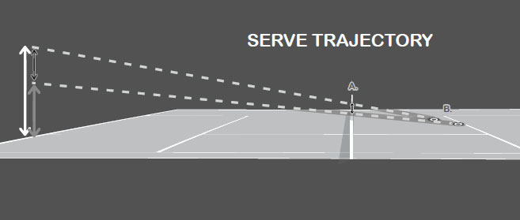

*Việc Samantha Stosur sử dụng các cú giao bóng xoáy làm rối loạn thời điểm trả giao bóng của đối thủ.*

Cú giao bóng cắt thường được dùng làm giao bóng thứ nhất và có thể được dùng để dồn ép đối thủ bằng cách giao vào người họ hoặc kéo họ ra rộng khỏi sân. Cú giao bóng cắt-xoáy lên là một cú đánh linh hoạt, có thể được dùng làm giao bóng thứ nhất hoặc thứ hai mạnh mẽ. Đây là một cú giao bóng thứ nhất hiệu quả nhờ tốc độ tốt và độ nảy thấp, cong, và là một cú giao bóng thứ hai tốt vì độ xoáy tiến của bóng kéo bóng xuống vào trong sân, tăng cường khả năng kiểm soát cần thiết cho một cú giao bóng thứ hai đáng tin cậy. Cú giao bóng cắt-xoáy lên là một cách đặc biệt tốt để các tay vợt nghiệp dư thực hiện giao bóng thứ hai, đặc biệt nếu cú giao bóng xoáy kích khó hơn (được mô tả tiếp theo) đang gây khó khăn.

Cú giao bóng cắt và cắt-xoáy lên có kỹ thuật tương tự cú giao bóng phẳng, ngoại trừ những khác biệt được trình bày dưới đây.

### **A. TUNG BÓNG**

Đối với các cú giao bóng cắt, bạn nên đặt cú tung bóng hơi lệch sang phải nhiều hơn (ảnh trang đối diện, trên). Nếu hình dung trước mặt một chiếc đồng hồ và giao bóng sang ô bên phải, cú giao bóng cắt của bạn sẽ có cú tung bóng ở khoảng vị trí 1 giờ, và hơi ít lệch phải hơn một chút đối với cú giao bóng cắt-xoáy lên. Ở ô bên trái, vì mục tiêu và động lượng của bạn nghiêng nhiều hơn về bên phải, hãy di chuyển cú tung bóng hơi lệch sang phải nhiều hơn. Hãy nhớ rằng, cú tung bóng của bạn càng giống nhau ở tất cả các kiểu giao bóng, đối thủ của bạn càng khó dự đoán, và cú giao bóng của bạn sẽ càng hiệu quả.

### **B. CĂN CHỈNH CƠ THỂ**

Vì đường đi của vợt lệch phải nhiều hơn ở giai đoạn đỉnh của pha vung vợt, phần thân trên của bạn sẽ căn chỉnh nghiêng ngang với lưới nhiều hơn so với cú giao bóng phẳng, cả trong pha lấy đà lẫn tại thời điểm tiếp xúc bóng.

Bốn kiểu giao bóng có các cú tung bóng và vị trí tiếp xúc khác nhau phía trên đầu.

**C. TỪ ĐỘNG TÁC THẢ VỢT ĐẾN TIẾP XÚC BÓNG**
--------------------------------------------

Vợt được đặt nghiêng góc lúc tiếp xúc trên các cú giao bóng cắt, và vì vậy, độ sấp cổ tay của bạn ít hơn trên các cú giao bóng cắt so với cú giao bóng phẳng. Thay vì sấp hoàn toàn, chuyển động cổ tay của bạn trên cú giao bóng cắt giống một động tác "rìu tomahawk" hơn, với cạnh vợt hướng về phía cột lưới bên phải sau khi bạn đánh bóng (ảnh phải). Ngoài ra, thay vì đánh xuyên qua giữa bóng như ở cú giao bóng phẳng, ở cú giao bóng cắt, bạn miết quanh cạnh vị trí 2 giờ của bóng (trang sau, ảnh trái). Điều này tạo ra một độ xoáy bóng hơi tiến và chủ yếu là xoáy ngang. Ở cú giao bóng cắt-xoáy lên, dây vợt chạm vào giữa bóng và miết lên qua phần vị trí 1 giờ của bóng (trang sau, ảnh trái). Điều này tạo ra một độ xoáy bóng chủ yếu tiến và hơi ngang.

Ở cú giao bóng cắt, cạnh dẫn đầu của vợt di chuyển về phía cột lưới bên phải khi dây vợt miết quanh phần vị trí 2 giờ của bóng.

### **2. CÚ GIAO BÓNG XOÁY KÍCH: CÔNG DỤNG VÀ KỸ THUẬT**

Phát triển một cú giao bóng xoáy kích tốt sẽ mang lại cho bạn một cú giao bóng thứ hai quyết đoán và đáng tin cậy --- một cú đánh quan trọng ở mọi trình độ. Độ xoáy lên của cú giao bóng xoáy kích cho phép bóng bay cao hẳn trên lưới rồi cong trở xuống vào trong ô giao bóng, giảm khả năng giao bóng hỏng kép. Một cú giao bóng xoáy kích thành công không chỉ là đưa cú giao bóng thứ hai vào cuộc mà còn đánh nó với tốc độ và độ xoáy khiến đối thủ của bạn phải phòng thủ. Quá nhiều tay vợt nghiệp dư chỉ "chạm nhẹ" cú giao bóng thứ hai của họ, khiến họ dễ bị đối thủ tấn công bằng vũ khí sở trường. Một cú giao bóng xoáy kích mạnh mẽ sẽ nảy cao và xoáy tránh đối thủ, khiến họ bối rối và đưa bóng ra khỏi vùng tấn công ưa thích của họ. Nó đặc biệt hiệu quả ở ô bên trái, nơi độ xoáy có thể buộc đối thủ phải trả bóng ra ngoài hành lang đôi. Hơn nữa, nếu bạn có một cú giao bóng xoáy kích đáng tin cậy, bạn có thể tấn công mạnh mẽ hơn với cú giao bóng thứ nhất, khiến bạn trở thành một tay giao bóng nguy hiểm hơn. Ngược lại, nếu không có cú giao bóng xoáy kích trong kho vũ khí, bạn có thể kém tự tin hơn với cú giao bóng thứ hai và giao bóng thứ nhất một cách thận trọng hơn. Cuối cùng, đây là một cú giao bóng tuyệt vời trong đánh đôi. Nếu bạn quyết định triển khai chiến thuật lên lưới sau giao bóng phổ biến, tốc độ chậm hơn của cú giao bóng xoáy kích sẽ cho bạn nhiều thời gian hơn để tiến gần lưới và thiết lập vị trí tốt hơn cho cú vô lê đầu tiên.

Như đã nói ở trên, cú giao bóng xoáy kích sử dụng phần lớn kỹ thuật tương tự như các cú giao bóng khác; tuy nhiên, đối với một số yếu tố, cách thực hiện đúng cú giao bóng xoáy kích có sự khác biệt so với những gì đã bàn luận trước đó.

Ở cú giao bóng xoáy kích, vợt di chuyển lên trên từ vị trí ngang sang vị trí dọc khi dây vợt miết lên phía sau bóng để tạo topspin.

### **A. TUNG BÓNG**

Cú tung bóng lệch trái nhiều hơn so với các cú giao bóng khác. Khi giao bóng sang ô bên phải, cú tung bóng ở khoảng vị trí 11 giờ. Cú tung bóng cũng ít ở phía trước hơn. Nếu cú tung bóng cho cú giao bóng phẳng cách bạn khoảng 60 cm về phía trước, thì đối với cú giao bóng xoáy kích, nó nên cách khoảng 30 cm về phía trước.

### **B. CĂN CHỈNH CƠ THỂ**

Vì vợt di chuyển theo đường lệch phải nhiều hơn qua điểm tiếp xúc, vai của bạn xoay nghiêng ngang với lưới nhiều hơn trong pha lấy đà (ảnh dưới) và vẫn nghiêng ngang nhiều hơn khi bạn đánh bóng, so với các cú giao bóng khác. Ngoài ra, vì cú tung bóng lệch trái nhiều hơn và ít ở phía trước hơn, tư thế cây đèn của cú giao bóng xoáy kích có độ đẩy hông và nghiêng lưng nhiều hơn một chút, cùng ít trọng lượng cơ thể dồn vào chân trước hơn so với các cú giao bóng khác.

*Federer xoay vai nhiều hơn khi bắt đầu cú giao bóng xoáy kích (ảnh trái) so với các cú giao bóng khác (ảnh phải).*

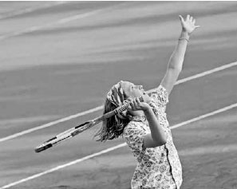

*Federer tạo topspin trên cú giao bóng xoáy kích bằng cách di chuyển vợt từ vị trí ngang (ảnh trái) lên góc 45 độ (ảnh phải) lúc tiếp xúc.*

**C. TỪ ĐỘNG TÁC THẢ VỢT ĐẾN TIẾP XÚC BÓNG**
--------------------------------------------

Độ topspin của cú giao bóng xoáy kích được tạo ra bởi vợt nâng lên ở vị trí ngang phía sau đầu bạn, di chuyển sang phải đến vị trí 10-11 giờ lúc tiếp xúc (ảnh trên), rồi đến vị trí 12 giờ ngay sau khi tiếp xúc. Khi vợt di chuyển lên, cổ tay sẽ di chuyển về phía trước và khép mặt vợt lại. Ở đây, cảm giác nên hơi giống như bạn đang lăn dây vợt qua một quả bóng biển tưởng tượng lơ lửng phía trên bạn. Chuyển động vợt trên hầu hết các cú giao bóng xoáy kích sẽ miết dây vợt lên phần vị trí 7 giờ của bóng và di chuyển lên qua phần vị trí 1 giờ của bóng (ảnh trang đối diện, trái). Đây là một cú giao bóng xoáy kích "cổ điển" thường được đánh sang bên phải của ô giao bóng; tuy nhiên, những thay đổi nhỏ trong đường đi của vợt và cú tung bóng có thể tạo ra các kiểu topspin khác nhau. Ví dụ, nếu bạn muốn thực hiện một cú giao bóng xoáy lên sang bên trái của ô giao bóng, vợt sẽ miết lên bóng từ vị trí 5 giờ đến 11 giờ và cú tung bóng sẽ ít lệch trái hơn.

*Một trong nhiều điểm mạnh của Novak Djokovic là cú giao bóng xoáy kích của anh. Anh đánh bóng sâu vào trong ô giao bóng với tốc độ ít chênh lệch so với cú giao bóng thứ nhất hơn phần lớn các tay vợt khác trên ATP.*

Anh bắt đầu cú giao bóng xoáy kích ở khung hình một với một cú xoay vai tốt và cú tung bóng lệch trái khoảng 30 cm phía trước vạch cuối sân. Anh thực hiện pha lấy đà một cách thư thái với vợt buông thõng về phía mặt đất. Ở khung hình hai, do cú tung bóng của giao bóng xoáy kích ít ở phía trước hơn, chúng ta thấy trọng lượng của anh được phân bổ khá đều giữa hai chân thay vì chủ yếu dồn vào chân trước như ở các cú giao bóng khác. Tiếp theo, anh nghiêng lưng ra sau để đưa cơ thể vào vị trí tốt nhằm miết lên phía sau bóng. Ở khung hình bốn, động tác lộn nhào vai của anh nâng khuỷu tay đánh lên và kết thúc giai đoạn thả vợt. Hãy chú ý độ sâu của động tác thả vợt; đầu vợt của anh kết thúc ngang với hông. Động tác thả vợt sâu hoàn toàn này cho phép một đường vung vợt dài để tích lũy gia tốc đến điểm tiếp xúc. Điều quan trọng là tăng tốc vợt trên cú giao bóng xoáy kích với tốc độ gần bằng cú giao bóng phẳng; điều này tạo ra topspin tốt cho sự ổn định lớn hơn. Ở khung hình năm, chúng ta thấy rằng mặc dù bóng đã được đánh, vợt vẫn còn ở phía sau đầu anh khi nó khép lại và tiếp tục di chuyển sang phải sau khi miết lên phía sau bóng. Anh nâng và thu tay trái vào gần cơ thể. Điều này giúp cân bằng cơ thể, giúp anh vung vợt lên và vươn cao tới bóng, đồng thời tạo sức mạnh đối trọng cho tay phải. Anh kết thúc pha vung vợt bằng cách tiếp đất trên chân trái ít ở trong sân hơn và với vợt lệch phải nhiều hơn so với các cú giao bóng khác.

**III. Chiến Thuật Giao Bóng**
------------------------------

Bạn có thể có một cú giao bóng mạnh mẽ, nhưng nếu bạn dễ đoán, bạn có thể gặp khó khăn trong việc giữ giao bóng. Mặt khác, nếu bạn giữ cho cú giao bóng của mình khó đoán, bạn sẽ khiến đối thủ bối rối và khiến họ khó trả giao bóng của bạn tốt hơn.

Bạn có thể thay đổi vị trí giao bóng bằng cách giao rộng sân, giao vào chữ "T" (nơi vạch giữa gặp vạch giao bóng), hoặc giao thẳng vào người đối thủ. Ngoài ra, bạn có thể thay đổi cú giao bóng với các độ xoáy khác nhau để thay đổi tốc độ và quỹ đạo cong của bóng. Bạn cũng có thể thay đổi vị trí đứng trên vạch cuối sân, tốc độ vung vợt, hoặc thậm chí số lần bạn nảy bóng trước khi giao.

Nếu bạn cảm thấy đối thủ đã "bắt bài" cú giao bóng của mình, hãy tận dụng mọi lựa chọn có sẵn để phá vỡ nhịp điệu trả bóng của họ. Sự khó đoán là một thành phần của một cú giao bóng được cân nhắc kỹ lưỡng; thành phần thứ hai là giao bóng để tạo ra một cú trả bóng phù hợp với thế mạnh của bạn. **Ví dụ, tay vợt hàng đầu người Mỹ Jack Sock đôi khi đứng cách vạch giữa vài chục centimet về phía trái khi giao bóng sang ô bên trái và giao bóng xoáy kích rộng sân vào trái tay của đối thủ thuận tay phải. Chiến thuật giao bóng này có khả năng thiết lập một mô hình cú đánh tận dụng tốt nhất cú thuận tay vượt trội của anh và bắt đầu pha bóng theo hướng tấn công.** Tầm quan trọng của việc chiếm ưu thế bằng cú thuận tay sau giao bóng được thể hiện rõ qua số liệu thống kê trong tennis chuyên nghiệp. Điều này đã thể hiện rõ tại chung kết Wimbledon 2010 giữa Rafael Nadal và Tomas Berdych. Mặc dù Nadal chỉ giao được năm cú ace, anh vẫn không bao giờ để mất giao bóng, phần lớn vì anh có thể sử dụng cú thuận tay mạnh mẽ của mình ở 89% các cú đánh đầu tiên sau giao bóng.(3) Các tay vợt chuyên nghiệp hiểu rằng nếu họ muốn kiểm soát pha bóng, họ phải xem cú giao bóng và cú chạm đất mạnh nhất của mình như một đơn vị chiến thuật duy nhất. Bạn cũng nên làm như vậy. Ví dụ, nếu cú thuận tay là vũ khí của bạn, thì giao bóng vào chữ "T" ở ô bên phải là một cách hiệu quả để tăng khả năng bạn có thể sử dụng cú đánh đó sớm trong pha bóng. Điều này là vì góc trả bóng từ giữa sân là một góc khó để kéo người giao bóng sang phải một quãng xa (ảnh trang đối diện). Biết rằng góc độ hạn chế mà đối thủ có thể dùng để kéo bạn sang phải, bạn có thể an toàn di chuyển sang trái một bước sau khi giao bóng vào chữ "T" (ảnh trên, S1). Điều này đặt bạn vào vị trí tốt hơn để sử dụng cú thuận tay. Tuy nhiên, nếu bạn giao bóng rộng sân ở ô bên phải, bạn phải lưu ý đến góc mà nó tạo ra cho cú trả bóng chéo sân, và do đó, hãy đứng ít lệch trái hơn sau khi giao bóng (ảnh trên, S2).

Giờ đây, nếu bạn có thể giao bóng rộng sân ở ô bên phải với tốc độ khiến đối thủ trả bóng muộn, thì bạn vẫn có thể an toàn di chuyển sang trái và tìm cách sử dụng cú thuận tay. Vị trí đứng của bạn trên sân sau giao bóng không chỉ phụ thuộc vào góc độ, mà còn phụ thuộc vào tốc độ giao bóng. **Bạn nên hiểu rõ khả năng giao bóng và các mô hình cú đánh thành công nhất của mình, và thực hiện cú giao bóng theo cách thiết lập pha bóng có lợi cho bạn nhiều nhất có thể.**

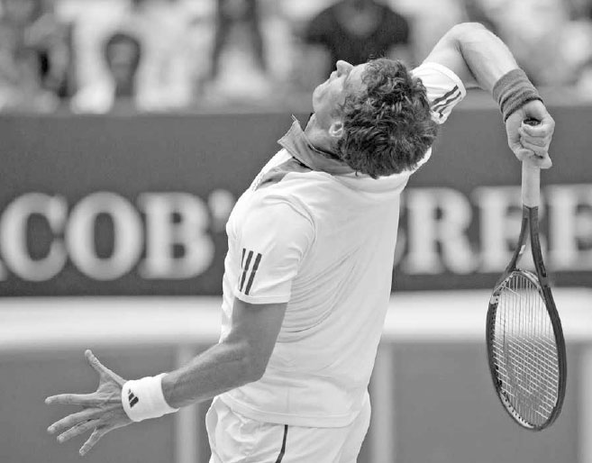

*Nadal chuẩn bị giao bóng trong trận chung kết Wimbledon 2010.*

Sau khi giao bóng vào chữ "T", do các góc độ có sẵn cho người trả bóng, bạn có thể di chuyển sang trái (S1) và tìm cách sử dụng cú thuận tay thường xuyên hơn. Tuy nhiên, sau khi giao bóng rộng sân, bạn phải phòng thủ trước các góc trả bóng mở rộng hơn về phía phải và giữ nguyên vị trí (S2). Vị trí lệch phải hơn này làm giảm khả năng cú chạm đất đầu tiên của bạn sẽ là một cú thuận tay.

Bạn cũng nên điều chỉnh cú giao bóng của mình theo tỷ số. **Ví dụ, nếu bạn đang dẫn 40-0 hoặc 40-15 trong ván đấu, việc giành một điểm dễ dàng bằng một cú giao bóng phẳng mạnh mẽ nhưng rủi ro hơn có thể hợp lý về mặt chiến thuật. Nếu bạn đang bị dẫn 30-40 hoặc ở điểm ad-out, việc sử dụng độ xoáy và vị trí mà bạn ít dùng trong trận đấu có thể khiến đối thủ bất ngờ và tạo ra một cú trả bóng yếu. Bạn có bốn kiểu giao bóng chính (phẳng, cắt, cắt-xoáy lên, và xoáy kích) và ba khu vực đặt bóng chính (rộng sân, chữ "T", và thẳng vào người đối thủ), mang lại cho bạn 12 tổ hợp khả thi khác nhau. Thường thì đó là một ý hay khi giữ lại một hoặc hai trong số 12 kiểu giao bóng này "trong tay áo" để gây bất ngờ cho đối thủ vào một thời điểm quan trọng của trận đấu.**

Cuối cùng, bạn nên đạt được ít nhất 60% số cú giao bóng thứ nhất vào sân. Bị cuốn hút bởi vinh quang của một cú ace, một số tay vợt thích dốc toàn lực vào cú giao bóng thứ nhất, nhưng nếu nó vào sân không thường xuyên, bất kỳ vinh quang nào có được từ một cú ace cũng sẽ chóng tàn khi cơ hội thắng trận tan biến. Nếu tỷ lệ thắng điểm khi giao bóng thứ nhất của bạn là 65% và tỷ lệ thắng điểm khi giao bóng thứ hai là 40%, thì việc hỏng bốn cú giao bóng thứ nhất trong một ván sáu điểm sẽ đặt xác suất bạn để mất giao bóng ở mức lớn hơn 50/50. Cú giao bóng thứ nhất không nên bị lãng phí; hãy sử dụng chúng một cách khôn ngoan. Nếu tỷ lệ giao bóng thứ nhất của bạn giảm sút trong trận đấu, hãy tăng độ xoáy và nhắm vào một mục tiêu rộng hơn.

**IV. Bài Tập Giao Bóng**
-------------------------

Serena Williams sở hữu một cú giao bóng tuyệt vời (ảnh trang đối diện), nhưng điều đó không phải nhờ may mắn. Nó có được nhờ việc phát triển một kỹ thuật tốt và sự luyện tập lặp đi lặp lại. Huấn luyện viên của cô, Rick Macci, kể lại rằng từ khi còn nhỏ, cô đã kết thúc hầu như mỗi buổi tập bằng 450 cú giao bóng. Ông nói về Williams: "Bạn bỏ ra công sức khó nhọc, sự lặp lại, cộng với việc bạn có nhóm cơ co giật nhanh và một kỹ thuật rất tốt, và đây là những gì bạn thấy được."(4) Nhiều tay vợt bỏ bê việc luyện tập giao bóng một cách chăm chỉ vì họ cảm thấy nó kém thú vị hơn so với việc đánh các cú đánh khác. Đây là một sai lầm. Cú giao bóng là một cú đánh cực kỳ quan trọng, cần được ưu tiên cao trong các buổi tập luyện của bạn.

Để nhấn mạnh tầm quan trọng của nó, đôi khi tôi thay đổi trình tự bài học thông thường và bắt đầu với cú giao bóng. Sau một bài khởi động linh hoạt, tôi bắt đầu cho học viên thực hiện các cú vung vợt giao bóng không bóng, tức là vung vợt mà không dùng bóng, để làm nóng vai và trau dồi kỹ thuật. Tiếp theo, tôi cho học viên luyện tập cú tung bóng để củng cố tầm quan trọng của phần này trong cú giao bóng. Sau phần tung bóng, tôi đặt các mục tiêu ở những vị trí khác nhau trong ô giao bóng và cho học viên luyện tập tất cả các kiểu giao bóng khác nhau, bao gồm nhiều cú giao bóng thứ hai. Trong khi họ luyện tập giao bóng, đôi khi tôi nhắc họ rằng họ sẽ rất hài lòng vì đã dành thời gian này để rèn luyện cú giao bóng khi họ thoải mái giữ được giao bóng trong một trận đấu quan trọng hoặc thực hiện một cú giao bóng lớn để nhanh chóng thắng điểm vào một thời khắc then chốt.

  ----------------------------------------------------------------------------------------------------------------------------------------------------------------------------------------------------------------------------------------------------------------------------------------------------------------------------------------------------------------------------------------------------------------------------------------------------------------------------------------------------------------------------------------------------------------------
  **HỘP HUẤN LUYỆN VIÊN:**
  **Hãy dành năm phút mỗi ngày để thực hiện các cú vung vợt giao bóng không bóng cho cả giao bóng thứ nhất và thứ hai nhanh nhất có thể. Hãy nhớ giữ các cơ thả lỏng trong suốt pha vung vợt và kết thúc trong tư thế cân bằng. Mẹo luyện tập này có thể xây dựng sức mạnh giao bóng và tốc độ vợt. Tôi khuyến nghị luyện tập vung vợt không bóng cho tất cả các cú đánh, không chỉ riêng cú giao bóng. Nó có ưu điểm là phát triển kỹ thuật tốt thông qua sự lặp lại nhiều lần và không có áp lực phải đánh bóng cho người khác, điều có thể làm sai lệch động tác.**
  ----------------------------------------------------------------------------------------------------------------------------------------------------------------------------------------------------------------------------------------------------------------------------------------------------------------------------------------------------------------------------------------------------------------------------------------------------------------------------------------------------------------------------------------------------------------------

Luyện tập nhắm mục tiêu rất quan trọng, nhưng chơi các pha bóng với một bạn tập cũng là một phần thiết yếu để học cách giữ giao bóng ổn định. Có một nghệ thuật trong việc giao bóng tốt sau khi bạn vừa chạy khắp sân chơi một pha bóng quyết liệt, rồi lấy lại bình tĩnh để bắt đầu pha bóng tiếp theo bằng cú giao bóng của mình. Thêm vào đó, khả năng phản ứng nhanh với cú trả bóng sau khi hoàn thành động tác theo bóng trong cú giao bóng là một kỹ năng quan trọng, đặc biệt là với cú giao bóng thứ hai. Cú đánh thứ ba quan trọng này trong tennis chỉ có thể được luyện tập với một người ở phía bên kia lưới.

Hãy nhớ rằng khi chơi các pha bóng trong buổi tập, đôi khi sẽ là một ý hay khi thay đổi luật chơi (xem bài tập số 2 và số 3 dưới đây) để tập trung thêm vào cú giao bóng. Sự tập trung thêm này có thể cải thiện khả năng tập trung cần thiết để trở thành một tay giao bóng giỏi.

Việc đặt các cọc chóp trên sân làm mục tiêu có thể tăng thêm sự tập trung cho việc luyện tập giao bóng của bạn.

### **1. TRÒ CHƠI HORSE**

Mục tiêu: Tăng độ chính xác khi giao bóng. Sử dụng các vật đánh dấu hoặc cọc chóp, chia ô giao bóng thành ba phần bằng nhau. Sau đó chơi trò "Horse" bằng cách để bạn tập của bạn chỉ định một trong ba phần của ô giao bóng. Nếu bạn giao bóng thành công vào phần đó và bạn tập của bạn không làm được, họ sẽ nhận chữ cái "H". Người đầu tiên ghép đủ từ "H-O-R-S-E" sẽ thua. Có thể thêm các kiểu giao bóng xoáy khác nhau hoặc các mục tiêu vị trí nảy bóng lần hai mà cú giao bóng phải vượt qua, như những biến thể của trò chơi "Horse".

TÓM TẮT NGẮN GỌN VỀ GIAO BÓNG: HÃY GHI NHỚ BỐN HÌNH ẢNH NÀY

### **2. HAI ĐỔI MỘT**

Mục tiêu: Nâng cao khả năng tập trung khi giao bóng. Chơi hai điểm giao bóng sang ô bên phải. Bạn ghi một điểm nếu thắng cả hai pha bóng, nhưng không được điểm nào nếu chỉ thắng một trong hai điểm. Người trả bóng ghi một điểm nếu họ thắng một trong hai pha bóng và hai điểm nếu thắng cả hai pha bóng. Lặp lại ở ô bên trái. Người đầu tiên đạt 11 điểm sẽ thắng, sau đó đổi vai trò.

### **3. GIAO BÓNG VỚI HANDICAP**

Mục tiêu: Cải thiện cú giao bóng thứ hai và học cách giao bóng dưới áp lực. Rèn luyện cú giao bóng thứ hai của bạn bằng cách chơi một set với bạn tập, chỉ sử dụng giao bóng thứ hai. Hoặc, chơi một set với luật chỉ được dùng giao bóng thứ nhất và thứ hai cho hai điểm mỗi ván, do người giao bóng tự chọn, để hiểu rõ hơn khi nào những điểm quan trọng trong một ván xảy ra. Một trò chơi giao bóng khác để mô phỏng áp lực là chơi một set với người giao bóng bắt đầu mỗi ván ở tỷ số 30-40.

*Murray từng nói vào năm 2015: "Tôi chỉ nghĩ rằng cú trả giao bóng giờ đây có lẽ còn quan trọng hơn cả cú giao bóng." (1)*
