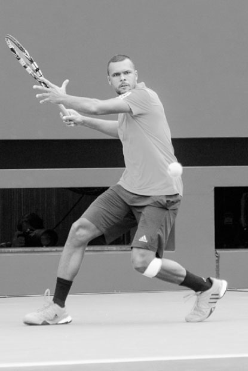
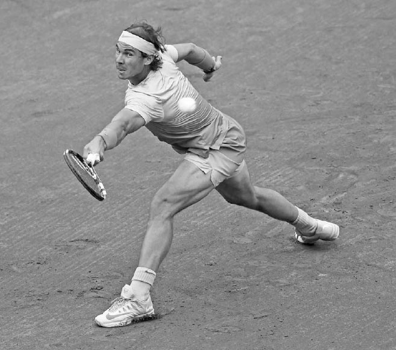

# Thăng bằng — Nền tảng mọi kỹ thuật

Trong suốt một trận đấu, bạn sẽ chạy nước rút, chạy bộ, bật nhảy, di chuyển ngang, lao người và bật nhảy theo nhiều hướng khác nhau trước, trong và sau khi vung vợt. Rõ ràng, tennis là một môn thể thao rất đòi hỏi thể lực, và biết cách sử dụng cơ thể đúng cách để khiến lối chơi của bạn mạnh mẽ và chính xác nhất có thể là điều then chốt. Vì vậy, trước khi bàn đến các cú đánh, ba chương đầu tiên sẽ dành để nói về "giải phẫu" đằng sau các cú đánh --- thăng bằng, chuỗi động học, và di chuyển.

Một cú đánh mạnh mẽ và đáng tin cậy bắt đầu từ việc thiết lập thăng bằng tốt --- giữ lưng tương đối thẳng, vai ngang bằng, và đầu thẳng đứng --- trong khi thực hiện cú đánh. Huấn luyện viên huyền thoại Welby Van Horn đã nói rất đúng khi viết: "Thăng bằng là khung tranh mà trong đó bức tranh (cú đánh) được đặt vào."¹ Tôi tin rằng việc hình dung việc thực hiện cú đánh theo cách này là quan trọng, và hiểu rằng thăng bằng tốt sẽ dẫn đến một cú đánh nhịp nhàng, ổn định và mạnh mẽ, đồng thời giảm áp lực lên cơ thể. Tất nhiên, tennis là môn thể thao gần như luôn luôn di chuyển, vì vậy bạn cần học cách giữ thăng bằng động, tức là thiết lập thăng bằng trong khi di chuyển.

*Novak Djokovic nổi tiếng với những pha xoạc chân gần như hoàn toàn mà anh thực hiện trong các tình huống khó khăn để đảm bảo sự thăng bằng cần thiết nhằm thực hiện một cú đánh mạnh mẽ và kiểm soát tốt.*

Mặc dù thăng bằng có thể không phải là mối bận tâm đầu tiên của bạn trên sân, các tay vợt chuyên nghiệp biết rằng để có kỹ năng cầm vợt và di chuyển tuyệt vời, họ phải sở hữu được nó --- ngay cả trong những tình huống căng thẳng. Ví dụ, Novak Djokovic nổi tiếng với những pha xoạc chân gần như hoàn toàn mà anh thực hiện trong các tình huống khó khăn để đảm bảo sự thăng bằng cần thiết nhằm thực hiện một cú đánh mạnh mẽ và kiểm soát tốt (ảnh đối diện). Anh dành nhiều giờ mỗi tuần để rèn luyện độ dẻo dai, một phần để nâng cao khả năng giữ tư thế tốt trong những pha bóng khó. Anh biết rằng, dù tài năng và kỹ thuật đến đâu, anh vẫn có khả năng đánh hỏng nếu không giữ được thăng bằng trong cú đánh.

Trong chương này, tôi sẽ mô tả những cách khác nhau mà thăng bằng ảnh hưởng đến lối chơi của bạn, cũng như mối liên hệ quan trọng giữa trọng tâm cơ thể và thăng bằng. Tiếp theo, tôi sẽ giải thích cách vị trí của chân, tay và đầu ảnh hưởng đến sự cân bằng của bạn, và kết thúc chương với các bài tập được thiết kế để cải thiện khả năng giữ thăng bằng.

**I. Thăng Bằng Ảnh Hưởng Đến Lối Chơi Của Bạn Như Thế Nào?**
-------------------------------------------------------------

Mức độ thăng bằng của bạn sẽ ảnh hưởng đến nhiều khía cạnh trong lối chơi, bao gồm khả năng áp đảo trong pha bóng, sức mạnh cú đánh, khả năng kiểm soát vợt, tầm nhìn và khả năng hồi phục vị trí.

### **1. KHẢ NĂNG ÁP ĐẢO TRONG PHA BÓNG**

Mức độ thăng bằng của bạn và đối thủ khi đánh bóng sẽ phần lớn quyết định ai đang chiếm ưu thế trong pha bóng. Mục tiêu chính của bạn khi thi đấu ở cuối sân là di chuyển đối thủ khắp sân và buộc họ phải đánh bóng trong tình trạng mất thăng bằng và phòng thủ, trong khi bạn đánh bóng ở tư thế vững vàng và kiểm soát điểm số.

### **2. SỨC MẠNH CÚ ĐÁNH**

Như sẽ được giải thích chi tiết hơn ở Chương Hai, rất khó để tạo ra sức mạnh cú đánh từ đôi chân nếu bạn mất thăng bằng. Nghiêng người quá nhiều về phía trước, phía sau, bên phải hay bên trái trong khi vung vợt sẽ hạn chế khả năng đặt chân vững và đẩy lực mạnh mẽ từ mặt đất.

### **3. KHẢ NĂNG KIỂM SOÁT VỢT**

**Rất khó để có được góc mặt vợt chính xác khi bạn mất thăng bằng. Khi bạn nghiêng người, góc của bàn tay trong cách cầm vợt vẫn giữ nguyên, nhưng góc của mặt vợt so với mặt đất lại thay đổi. Vì vậy, nếu bạn ngả người ra sau, mặt vợt sẽ mở ra, thường khiến bóng bay dài ra ngoài. Ngược lại, nếu bạn ngả người về phía trước, mặt vợt sẽ đóng lại, thường khiến bóng bay vào lưới. Tương tự, nghiêng người sang phải hoặc trái có thể khiến bóng đi lệch quá nhiều về hướng đó.**

*Ngay cả khi Serena Williams buộc phải đánh bóng với một chân gần như hoặc hoàn toàn rời khỏi mặt đất, cô vẫn giữ được tư thế tốt, giúp cô đánh bóng với sức mạnh và sự kiểm soát.*

Mất thăng bằng không chỉ làm thay đổi góc của mặt vợt so với mặt đất, mà còn đẩy trọng lượng cơ thể theo những hướng không mong muốn --- một sự thay đổi mà bạn phải nhận biết và điều chỉnh nhanh chóng trong khi vung vợt để có thể cứu được cú đánh.

### **4. TẦM NHÌN**

**Đầu của bạn càng thẳng đứng và ổn định, khả năng theo dõi bóng bằng mắt của bạn sẽ càng tốt. Nếu đầu bạn nghiêng do mất thăng bằng, điều đó có thể khiến bạn tính toán sai độ cao, tốc độ và khoảng cách của bóng đang bay tới, đồng thời ảnh hưởng đến khả năng định vị bản thân và canh thời điểm vung vợt. Hãy quan sát các tay vợt hàng đầu và để ý cách họ giữ đầu thẳng đứng và bất động khi chuẩn bị thực hiện cú đánh (ảnh bên phải). Tư thế đầu này hỗ trợ tầm nhìn và khả năng phán đoán của họ, giúp họ xác định đúng vị trí so với bóng và canh thời điểm tốt cho cú đánh.**

### **5. KHẢ NĂNG HỒI PHỤC VỊ TRÍ**

Tennis là môn thể thao xoay quanh việc di chuyển và quản lý thời gian. Bạn càng giữ thăng bằng tốt trong pha theo bóng, bạn càng chống lại được lực quán tính, giúp bạn đổi hướng và hồi phục vị trí nhanh hơn cho cú đánh tiếp theo. **Ví dụ, nếu bạn nghiêng người sang phải khi kết thúc một cú thuận tay đánh rộng sân, thay vì giữ thăng bằng với trọng lượng trung lập, điều đó sẽ làm chậm khả năng di chuyển sang trái và khả năng quay về giữa sân của bạn.**

*Sự thăng bằng tốt của Jo-Wilfried Tsonga giúp đầu anh giữ thẳng đứng và ổn định khi chuẩn bị thực hiện cú thuận tay này. Điều này giúp đôi mắt anh truyền thông tin chính xác đến não bộ về tốc độ và quỹ đạo của bóng đang bay tới.*

  ------------------------------------------------------------------------------------------------------------------------------------------------------------------------------------------------------------------------------------------------------------------------------------
  ***LƯU Ý:** Để đơn giản hóa, khi mô tả bước chân, cú vung vợt và cách cầm vợt xuyên suốt cuốn sách, tôi sẽ sử dụng các từ "phải" và "trái" theo góc nhìn của một tay vợt thuận tay phải. Những người thuận tay trái, xin vui lòng đổi "phải" thành "trái" và "trái" thành "phải".*
  ------------------------------------------------------------------------------------------------------------------------------------------------------------------------------------------------------------------------------------------------------------------------------------

*Rafael Nadal mở rộng tư thế đứng và duỗi hai tay theo hai hướng ngược nhau, giúp anh giữ trọng tâm cơ thể nằm giữa hai chân và duy trì thăng bằng trong cú đánh khó này.*

**II. Thăng Bằng và Trọng Tâm Cơ Thể Của Bạn**
----------------------------------------------

Nói theo ngôn ngữ khoa học, việc đạt được thăng bằng tốt phụ thuộc vào việc đặt trọng tâm cơ thể (COG) nằm ngay giữa nền tảng nâng đỡ của bạn.

**Điều đó có nghĩa là gì? Trọng tâm cơ thể (COG) là điểm mà tại đó trọng lượng cơ thể bạn được phân bố đều. Vì phần trên cơ thể chúng ta thường nặng hơn một chút, nên trọng tâm cơ thể nằm ngay phía trên thắt lưng. Đôi chân của bạn tạo nên nền tảng nâng đỡ. Vì vậy, thiết lập thăng bằng tốt nghĩa là giữ cho thân trên thẳng hàng với điểm giữa của hai chân. Và làm thế nào để làm được điều đó? Bằng cách điều chỉnh độ rộng của tư thế đứng, di chuyển tay theo các hướng khác nhau, và giữ đầu thẳng đứng. Hãy cùng bàn kỹ hơn.**

### **1. VỊ TRÍ CỦA CHÂN**

Vị trí chân tốt nhất phụ thuộc phần lớn vào độ cao của bóng đang bay tới. Bóng càng thấp, tư thế đứng của bạn càng cần rộng hơn để giữ trọng tâm cơ thể nằm phía trên điểm giữa hai chân và hỗ trợ sự cân bằng trong khi vung vợt (ảnh đối diện). Khi bạn mở rộng tư thế đứng, trọng tâm cơ thể hạ thấp xuống và nền tảng nâng đỡ trở nên rộng hơn, vững hơn. Với những bóng đánh trên đầu, điều ngược lại nên xảy ra và tư thế đứng của bạn nên hẹp lại.

Gập đầu gối cũng rất quan trọng đối với thăng bằng, đặc biệt là với những bóng thấp. Nếu bạn không gập đầu gối mà lại gập ở thắt lưng, trọng tâm cơ thể của bạn sẽ dịch chuyển về phía trước chân khi đánh bóng thấp, khiến bạn ngả người về trước và mất thăng bằng.

Hãy nhớ rằng chân phải và chân trái của bạn sẽ đảm nhận những vai trò khác nhau trong khi vung vợt để tăng cường thăng bằng. Nhiều cú đánh trong tennis đòi hỏi một chân làm trụ cho cú đánh trong khi chân kia xoay để giữ thăng bằng cho cơ thể. **Ví dụ, ở hầu hết các cú trái tay đánh chạm đất, chân phải sẽ làm trụ cho cơ thể trong khi chân trái xoay sang trái để giữ thăng bằng (ảnh bên dưới). Chuyển động của chân trái cũng giúp hông xoay và trọng lượng chuyển đổi diễn ra trơn tru, đồng thời giúp bạn quay về giữa sân nhanh hơn.**

  -------------------------------------------------------------------------------------------------------------------------------------------------------------------------------------------------------------------------------------------------------------------------------------------------------------------------------------------------------------------------------------------------------------------------------------------------------------------------------------------------------------------------------------------------------------
  **HỘP HUẤN LUYỆN VIÊN:**
  **Trong tennis, điều quan trọng là biết cách sử dụng cơ thể để tối đa hóa sức mạnh và thăng bằng. Tôi thường minh họa sức mạnh và thăng bằng có được từ việc đứng rộng chân bằng bài kiểm tra "đẩy" với học trò của mình. Để thực hiện bài kiểm tra đẩy, hãy đứng với hai chân sát nhau. Sau đó, nhờ ai đó đẩy mạnh vào vai bạn từ một bên; bạn sẽ nhanh chóng mất thăng bằng. Tiếp theo, đặt hai chân rộng ra ngoài vai và để người đó đẩy vào vai bạn từ bên một lần nữa. Lần này, vì bạn có trọng tâm thấp hơn và nền tảng vững hơn, bạn sẽ đứng vững.**
  -------------------------------------------------------------------------------------------------------------------------------------------------------------------------------------------------------------------------------------------------------------------------------------------------------------------------------------------------------------------------------------------------------------------------------------------------------------------------------------------------------------------------------------------------------------

*Cú trái tay của Stan Wawrinka cho thấy anh giữ chân phải làm trụ trong khi chân trái xoay để đảm bảo thăng bằng.*

*\[Không có ảnh trong bộ ảnh trích xuất --- giữ lại chú thích để tham khảo\]*

+--------------------------------------------------------------------------------------------------------------------------------------------------------------------------------+
| **Xoay (Pivot)**                                                                                                                                                               |
+--------------------------------------------------------------------------------------------------------------------------------------------------------------------------------+
| ***danh từ** điểm trung tâm, chốt, hoặc trục mà quanh đó một cơ cấu xoay hoặc dao động. Từ đồng nghĩa: điểm tựa, trục, trục bánh xe, khớp xoay, chốt, bản lề.*                 |
|                                                                                                                                                                                |
| ***động từ** xoay quanh một trục hoặc như thể đang xoay quanh một trục. "Anh ấy xoay người, xoay trên gót chân." Từ đồng nghĩa: quay, xoay, xoay tròn, xoay vòng, lượn, cuộn.* |
+--------------------------------------------------------------------------------------------------------------------------------------------------------------------------------+

***Cánh tay không cầm vợt đóng vai trò quan trọng trong việc thiết lập thăng bằng. Federer nâng lên rồi hạ xuống cánh tay trái khi giao bóng, còn Caroline Wozniacki di chuyển tay trái từ phải sang trái khi thực hiện cú thuận tay.***

*\[Không có ảnh trong bộ ảnh trích xuất --- giữ lại chú thích để tham khảo\]*

### **2. VỊ TRÍ CỦA THÂN TRÊN**

**Thân trên vừa là phần nặng nhất của cơ thể, vừa là nơi đặt trọng tâm cơ thể, vì vậy vị trí của nó rất quan trọng đối với thăng bằng của bạn. Vì bản thân thân trên không thể tự di chuyển linh hoạt, nên cần dựa vào vị trí của chân và tay để giữ nó ở trạng thái cân bằng.**

Giống như những người đi trên dây sử dụng đôi tay để giữ thăng bằng, các tay vợt tennis cũng nên làm vậy. Ví dụ, ở cú trái tay một tay, khi bạn vung tay phải về phía trước, tay trái nên di chuyển ra sau để cân bằng sự phân bố trọng lượng cơ thể (xem hình Wawrinka ở trang trước). Điều này không chỉ giúp cải thiện tư thế của thân trên, mà còn tạo ra một lực đối trọng, hay một điểm tựa, để tay phải đẩy lực, giúp cú đánh mạnh mẽ và chính xác hơn.

*Khi giao bóng, tay trái đưa lên để tung bóng rồi hạ xuống khi vợt vung lên đánh bóng. Chuyển động này giúp cân bằng cơ thể, đồng thời tạo ra một nguồn lực đối trọng.*

Ở cú thuận tay, tay trái di chuyển sang phải trong pha vung vợt ra sau, rồi sang trái trong pha vung vợt về trước. Điều này giúp cân bằng trọng lượng cơ thể, giữ thân trên thẳng đứng, đồng thời giúp cơ thể xoắn vào rồi bung ra để tạo lực.

### **3. VỊ TRÍ CỦA ĐẦU**

Mặc dù đầu chỉ nặng khoảng 3,5 đến 5,5 kg, việc nghiêng đầu 30 độ có thể khiến nó cảm giác nặng như 18 kg, ảnh hưởng đáng kể đến thăng bằng của bạn. Vì vậy, **điều quan trọng là đầu bạn phải luôn thẳng đứng và thẳng hàng đúng cách với trọng tâm cơ thể trong suốt cú đánh.**

**III. Bài Tập Thăng Bằng**
---------------------------

Cần phải luyện tập rất nhiều để có thể di chuyển nhanh trong khi vẫn giữ được thăng bằng cần thiết để đánh bóng tốt. Ở Chương 16, tôi sẽ cung cấp một số bài tập về sự nhanh nhẹn và độ dẻo dai giúp cải thiện thăng bằng của bạn. Còn bây giờ, đây là bốn bài tập trên sân.

### **1. MINI-TENNIS BIẾN THỂ**

Hãy đặt một cây bút chì sau tai hoặc cầm một cốc nước nhỏ bằng tay trái. Sau đó, đánh bóng chậm rãi với một người tập cùng trong phạm vi ô giao bóng. Nhẹ nhàng đánh bóng qua lại với tư thế tốt, cố gắng không để bút chì rơi xuống đất hoặc nước bị đổ.

### **2. BẮT BÓNG VỚI MŨ LỎNG**

Đặt vợt sang một bên. Đội một chiếc mũ lỏng lẻo trên đầu, đứng cách người tập cùng khoảng 4,5 mét. Nhờ người đó ném bóng theo nhiều hướng khác nhau. Bắt bóng sau khi nó nảy một lần rồi ném trả lại. Mục tiêu là giữ cho mũ không bị rơi khỏi đầu bằng cách di chuyển nhẹ nhàng và giữ đầu thẳng đứng. Sau khi bắt thành công 15 lần ném, đổi vai trò với người tập cùng.

### **3. KỸ THUẬT ĐÓNG BĂNG**

Kỹ thuật đóng băng giúp phân tích thăng bằng và chỉ ra những điều cần điều chỉnh để cải thiện nó. Nhờ người tập cùng đưa bóng cho bạn mỗi năm giây một lần đến các vị trí ngẫu nhiên quanh sân. Kết thúc mỗi cú đánh ở tư thế bất động và giữ nguyên, hay "đóng băng," trong ba giây. Nếu bạn loạng choạng hoặc cảm thấy khó chịu khi "đóng băng," thì hoặc là bạn đã không xoay chân sau đúng cách trong khi đánh, hoặc bạn đã đứng quá xa hay quá gần bóng.

### **4. VÔ LÊ MỘT TAY**

Bạn và người tập cùng đứng cách lưới khoảng 3,5 đến 4,5 mét, thực hiện các cú vô lê qua lại với tay trái đặt sau lưng. Không có sự hỗ trợ của tay trái để giữ thăng bằng, bài tập này sẽ nhấn mạnh tầm quan trọng của việc gập đầu gối và mở rộng tư thế đứng để giữ sự cân bằng.

Xin lưu ý rằng có nhiều bài tập thể lực ngoài sân có thể cải thiện thăng bằng của bạn. Thực hiện các bài tập gym trên bề mặt không ổn định (như squat trên bóng BOSU hoặc gập bụng trên bóng tập thăng bằng) sẽ cải thiện thăng bằng bằng cách kích hoạt các nhóm cơ ổn định nhỏ ở mắt cá chân, đầu gối và vùng cơ lõi (core). Ngoài ra, các bài tập gym giúp tăng biên độ chuyển động của cơ bắp thông qua các bài tập độ dẻo dai sẽ giúp cơ thể bạn duy trì thăng bằng tốt hơn, đặc biệt là khi phải vươn người cho những cú đánh khó.

*Serena Williams xoắn cơ thể lại khi giao bóng trước khi bung ra và giải phóng chuỗi động học --- chủ đề của Chương Hai.*

*\[Không có ảnh trong bộ ảnh trích xuất --- giữ lại chú thích để tham khảo\]*
