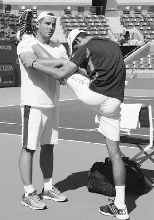
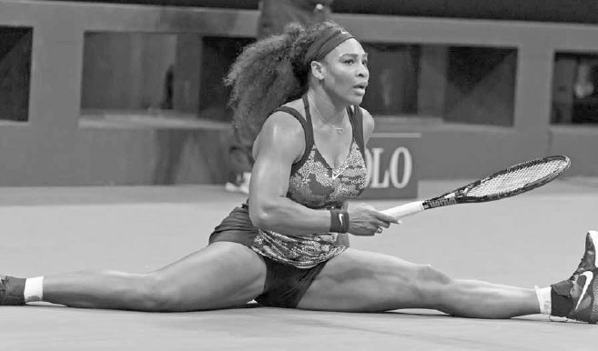
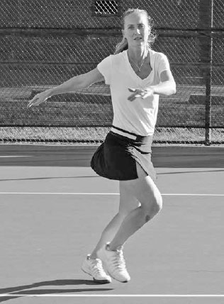
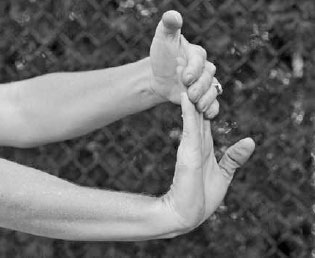
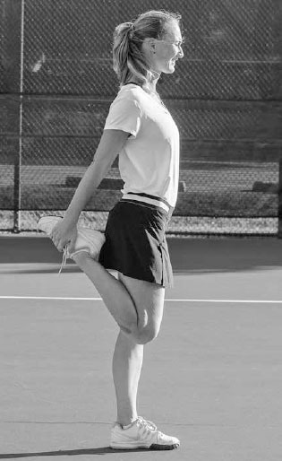

# Thể lực — Sức bền, tốc độ, sức mạnh

Thể lực là nền tảng cho mọi khía cạnh của quần vợt, và trong khi nó luôn là một phần quan trọng của môn thể thao này, ở thời hiện đại nó đã trở nên quan trọng hơn nữa. Điều này đặc biệt đúng trên đấu trường chuyên nghiệp. Các tay vợt chuyên nghiệp đang sử dụng thể lực đáng kinh ngạc của họ để bao quát sân và kéo dài điểm bóng chưa từng có trước đây. Tay vợt ATP Janko Tipsarevic từng nói về việc thắng một pha đôi công khó khăn ra sao, \"Cần đến năm cú thắng điểm để kết thúc một điểm bóng. Một điểm bóng bây giờ có vẻ như một buổi tập luyện đầy đủ.\" Những pha đôi công cực nhọc đã khiến một trận đấu đơn chuyên nghiệp dài trở thành một trong những trải nghiệm kiệt sức nhất về thể chất và tinh thần trong tất cả các môn thể thao. Hãy nhớ đến trận chung kết Australian Open 2012 kéo dài sáu giờ giữa Nadal và Djokovic, khi những chiếc ghế đã được mang ra sân cho lễ trao cúp vì cả hai tay vợt đều kiệt sức đến mức khó có thể đứng vững. Các tay vợt chuyên nghiệp hiểu rõ tính thể chất ngày càng tăng của môn thể thao này và giờ đây dành gần như cùng lượng thời gian tập luyện ngoài sân như họ dành để đánh bóng trên sân. Một số tay vợt hàng đầu thậm chí thuê cả một đội ngũ chuyên gia thể lực bao gồm huấn luyện viên thể chất, chuyên gia dinh dưỡng, và bác sĩ vật lý trị liệu để nỗ lực giành lợi thế trước đối thủ.

Có nhiều ví dụ về các tay vợt chuyên nghiệp có thứ hạng tăng vọt sau khi đưa thể lực của họ lên một tầm cao mới. Sau khi trải qua giai đoạn sa sút giữa sự nghiệp, Andre Agassi đã đến phòng gym hàng ngày và chạy lên đồi trong cái nóng gay gắt của Las Vegas giữa các giải đấu. Anh tiếp tục giành năm trong tám danh hiệu Grand Slam của mình sau khi bước sang tuổi 28, độ tuổi thường gắn liền với sự suy giảm kỹ năng và tốc độ của một tay vợt.

Agassi cho rằng thành công cuối sự nghiệp của mình là nhờ thể lực được cải thiện. Anh biết rằng sự di chuyển nhanh hơn cho phép anh với tới nhiều cú đánh hơn trong tư thế cân bằng và sức bền được cải thiện cho phép anh vẫn tràn đầy năng lượng ngay cả khi kết thúc một trận đấu rất dài. Điều này có nghĩa là anh có thể thắng điểm bóng bằng cách khuyến khích những pha đôi công kéo dài và làm đối phương kiệt sức, khiến họ phải dùng đến những cú đánh tỷ lệ thấp. Anh nói, \"Nếu cơ thể bạn yếu, nó sẽ ra lệnh cho bạn phải làm gì. Nếu cơ thể bạn mạnh mẽ, nó thực sự sẽ nghe theo bạn khi bạn bảo nó làm điều gì đó.\" Rõ ràng, người chơi nghiệp dư không cần dành cả cuộc đời cho thể lực như Agassi đã làm, nhưng có một bài học tốt cho người chơi ở mọi trình độ: cải thiện thể lực sẽ cải thiện đáng kể phong độ của bạn.

Quần vợt là một môn thể thao đòi hỏi thể chất độc đáo, yêu cầu một loại thể lực đặc biệt. Các tay vợt cần sự khéo léo để duy trì thăng bằng trên một cú vô lê khó hoặc một quả bóng rộng, những đợt bứt tốc nhanh để chạy đuổi theo các cú đánh khắp sân, và sức bền để trụ vững qua một trận đấu dài. Ngoài ra, họ cần dẻo dai và mạnh mẽ từ đầu đến chân. Trên hầu hết các cú đánh, năng lượng được truyền lên dọc cơ thể, tích lũy sao cho mỗi phân đoạn cơ thể được hưởng lợi từ chuyển động và lực của phân đoạn cơ thể trước đó, tận dụng chuỗi động học. Việc thiếu dẻo dai hoặc yếu ở một bộ phận cơ thể sẽ giảm lực tích lũy và di chuyển đến phân đoạn cơ thể tiếp theo và dẫn đến một cú đánh kém lực hơn.

*Andre Agassi đã giành hầu hết các danh hiệu Grand Slam của mình sau khi dành hết tâm huyết để cải thiện thể lực vào cuối sự nghiệp.*

Không có gì ngạc nhiên khi, biết đến bản chất toàn thân của quần vợt và sự đa dạng về loại hình cũng như cường độ chuyển động mà nó đòi hỏi, quần vợt được xem là một trong những môn thể thao tốt nhất để chơi nhằm cải thiện sức khỏe và thể lực tổng thể của một người. Một nghiên cứu được công bố bởi British Journal of Sports Medicine phát hiện rằng những người chơi các môn thể thao dùng vợt có nguy cơ tử vong thấp nhất trong số tất cả những người tham gia thể thao được khảo sát trong nghiên cứu đó. Như cựu vô địch U.S. Open Samantha Stosur từng nói, \"Quần vợt lo liệu mọi thứ. Nó đòi hỏi sự khéo léo và nhanh nhẹn để tới bóng, sức mạnh cốt lõi để tạo lực cho các cú đánh của bạn, và sức bền để trụ vững suốt cả trận đấu. Bên cạnh việc săn chắc cánh tay và vai, đó là một bài tập toàn thân cho chân và cơ bụng, và tác động lên tim cùng phần cốt lõi của bạn không giống bất kỳ môn thể thao nào khác.\" Trong chương này, tôi sẽ giải thích sáu thành phần thể lực quan trọng đối với các tay vợt: sự dẻo dai, sự khéo léo, sự nhanh nhẹn, sự ổn định phần cốt lõi, sức mạnh, và sức bền. Tôi chia sẻ những bài tập giúp bạn cải thiện những thành phần này, bao gồm 15 bài tập giãn cơ và bốn bài tập cho mỗi thành phần trong năm thành phần còn lại. Có hàng trăm bài tập có thể giúp bạn cải thiện thể lực trong những lĩnh vực này: tôi đã cung cấp một số mẫu bài tập đã có hiệu quả tốt với học trò của tôi. Nhiệm vụ của bạn là thay đổi đa dạng chương trình tập luyện của mình với nhiều bài tập khác nhau và điều chỉnh chế độ thể lực của bạn phù hợp với độ tuổi và trình độ thể lực của bạn. Cũng như với bất kỳ chương trình thể lực nào, hãy tham khảo ý kiến bác sĩ của bạn trước khi sử dụng các bài tập được liệt kê trong cuốn sách này. Sau khi giải thích sáu thành phần thể lực, chương này kết thúc với một phần về dinh dưỡng và bù nước sẽ giúp bạn chọn đúng nhiên liệu cho cơ thể để cảm thấy tràn đầy năng lượng suốt trận đấu.

**I. Sự Dẻo Dai**
-----------------

SỰ DẺO DAI CỦA NOVAK DJOKOVIC khiến anh khác biệt với các tay vợt ATP hàng đầu khác. Anh giãn cơ suốt cả ngày và đôi khi dành hơn hai giờ để giãn cơ, biết rằng điều đó giúp anh hồi phục nhanh hơn sau các trận đấu và tăng cơ hội có một sự nghiệp dài lâu. Trên sân, những lợi ích là ngay lập tức và rõ ràng. Sự dẻo dai của anh cho phép anh uốn cơ thể thành nhiều hình dạng khác nhau khi bị dồn ép trong khi vẫn duy trì thăng bằng, nâng cao khả năng kiểm soát vợt và đánh một cú đánh hiệu quả. Sự dẻo dai của anh cũng cho phép anh ôm sát vạch cuối sân trong điểm bóng và \"thu nhỏ\" sân đấu; anh đạt được điều này bằng cách thực hiện gần như xoạc chân để bao quát những cú đánh tốt nhất của đối phương và kéo dài các pha đôi công, đẩy đối phương phải đánh mạnh hơn và mạnh hơn nữa và nhắm gần các vạch hơn, cuối cùng buộc họ mắc lỗi. Vai trò của sự dẻo dai trong thành công của Djokovic đã làm nổi bật giá trị của việc dẻo dai và thúc đẩy nhiều đồng nghiệp của anh trở nên linh hoạt về thể chất nhất có thể.

*Djokovic tự hào về việc cực kỳ dẻo dai và liên tục rèn luyện điều đó. Anh từng được biết đến với việc tiếp tục trò chuyện thoải mái với bạn bè trong khi gác chân lên vai họ để giãn cơ.*

Sự dẻo dai không chỉ quan trọng với các tay vợt chuyên nghiệp hàng đầu; nó cần thiết cho người chơi ở mọi trình độ. Tôi sẽ bàn về lợi ích của sự dẻo dai chi tiết hơn trước khi chuyển sang các loại giãn cơ khác nhau.

### **1. LỢI ÍCH CỦA SỰ DẺO DAI**

### **A. NHIỀU LỰC HƠN**

Bất kỳ hạn chế nào về độ đàn hồi sẽ giới hạn tầm vận động và lượng lực mà cơ bắp bạn có thể tạo ra trong lúc vung vợt. Cú giao bóng là một ví dụ điển hình. Cơ vai càng có thể kéo giãn lâu trong cú giao bóng, lực tạo ra khi cơ co lại càng mạnh. Ngoài ra, sự dẻo dai lớn hơn của khớp vai sẽ tạo ra một đường vung dài hơn để tích lũy tốc độ vợt từ điểm thấp nhất của cú thả vợt đến điểm tiếp xúc.

### **B. CẢI THIỆN THĂNG BẰNG**

Sự dẻo dai lớn hơn cho phép bạn duy trì thăng bằng trong những tình huống thách thức. Ví dụ, khi với tới một cú đánh thấp, rộng, sự dẻo dai qua phần cốt lõi sẽ cho phép bạn mở rộng tư thế, giữ thăng bằng, và do đó kiểm soát vợt tốt. Sau khi thực hiện cú đánh thấp, rộng đó, nó cũng sẽ cho phép bạn hạ thấp cơ thể và tích lũy lực tốt ở chân để đổi hướng và hồi vị nhanh về giữa sân.

*Sự tận tâm của Serena Williams với việc giãn cơ được thể hiện rõ ràng ở cuối điểm bóng này tại U.S. Open 2015.*

**C. GIẢM CHẤN THƯƠNG**
-----------------------

Sự dẻo dai cũng quan trọng trong việc giảm chấn thương, giảm khả năng rách và căng cơ bằng cách kéo dài cơ bắp và tạo ra một khung sườn tốt để tăng cường sức mạnh cho các cơ và khớp trải qua những chuyển động cực đoan. Quần vợt liên quan đến một loạt các chuyển động đa dạng, như xoay hông trên các cú đánh nền, vặn bụng và lưng trên cú giao bóng, các chuyển động dừng và bắt đầu gây áp lực lên đầu gối và háng, chạy nước rút bùng nổ sử dụng các cơ chân khác nhau, và duỗi khuỷu tay cùng gập cổ tay trong lúc vung vợt. Do đó, người chơi cần dẻo dai khắp toàn thân để giảm khả năng chấn thương.

Sự dẻo dai cũng giảm căng thẳng cho các nhóm cơ đối lập. Cơ bắp căng cứng gây ra tầm vận động hạn chế, và khi một cơ chính không thể di chuyển đúng cách, các cơ khác phải làm việc nhiều hơn để hỗ trợ nó. Trong ngắn hạn, điều này có nghĩa là căng cơ và mệt mỏi. Nghiêm trọng hơn, về lâu dài điều này thường chuyển thành mất cân bằng cơ, viêm, và chấn thương. Một điều cần cân nhắc khác đặc thù cho các tay vợt là việc sử dụng liên tục cánh tay cầm vợt có thể gây mất cân bằng trong cấu trúc cơ. Do đó, các tay vợt phải duy trì độ đàn hồi đồng đều trên toàn cơ thể để giữ những vấn đề tiềm ẩn liên quan đến mất cân bằng cơ ở mức tối thiểu.

### **D. TĂNG TỐC QUÁ TRÌNH HỒI PHỤC**

Giãn cơ sau trận đấu hoặc buổi tập luyện sẽ giảm viêm, kéo dài và thư giãn cơ bắp của bạn, và khiến bạn cảm thấy ít đau nhức và cứng cơ hơn vào ngày hôm sau.

### **2. GIÃN CƠ ĐỘNG VÀ GIÃN CƠ TĨNH**

Có hai loại giãn cơ cơ bản góp phần tăng cường sự dẻo dai. Cả hai đều có vị trí quan trọng trong quá trình khởi động và hạ nhiệt của một tay vợt. Loại giãn cơ thứ nhất là \"giãn cơ động,\" hay các bài tập tăng lưu lượng máu và tầm vận động trước khi bạn chơi. Giãn cơ động nên được thực hiện chỉ sau một số hoạt động chung làm tăng nhiệt độ cơ thể. Một ví dụ tốt cho trình tự này là chạy bộ nhẹ trong ba đến năm phút, sau đó thực hiện tám đến 10 phút giãn cơ động.

Loại thứ hai là \"giãn cơ tĩnh.\" Giãn cơ tĩnh được thực hiện như một phần của quá trình hạ nhiệt và liên quan đến việc kéo giãn một cơ hoặc nhóm cơ đến điểm căng và giữ nguyên tư thế giãn đó. Sau một buổi luyện tập hoặc trận đấu, bạn nên dành thời gian cho giãn cơ tĩnh để ngăn ngừa chấn thương, tăng sự dẻo dai, và ngăn ngừa đau nhức cơ.

Để giãn cơ tĩnh của bạn an toàn và hiệu quả, có một số điểm cần nhớ. Thứ nhất, hãy nhấn mạnh những chuyển động chậm, mượt mà và hít thở sâu phối hợp. Hít vào sâu qua mũi và thở ra qua miệng khi bạn giãn cơ, sau đó thả lỏng dần. Giữ tư thế giãn cơ tĩnh trong 20-25 giây khi bạn thở bình thường. Thứ hai, bạn không nên cảm thấy đau. Nếu nó đau hoặc bạn cảm thấy nóng rát dữ dội, bạn đang giãn cơ quá mức. Thứ ba, đừng khóa khớp và đừng nảy người. Thay vào đó, hãy giữ một sự giãn cơ ổn định, dễ chịu. Cuối cùng, hãy cố biến giãn cơ thành thói quen hàng ngày và duy trì tính nhất quán để đạt kết quả tốt nhất và sự dẻo dai tối đa cho cơ thể bạn.

  --------------------------------------------------------------------------------------------------------------------------------------------------------------------------------------------------------------------------------------------------------------------------------------------------------------------------------------------------------------------------------------------------------------------------
  **HỘP HUẤN LUYỆN VIÊN:**
  **Quá nhiều người chơi nghiệp dư nhảy vào sân để tập luyện và dành rất ít thời gian chuẩn bị cơ thể cho những đòi hỏi khắc nghiệt của việc chơi quần vợt. Hãy đảm bảo rằng trước khi bạn đánh quả bóng đầu tiên, nhịp tim của bạn hơi tăng lên và bạn đang đổ mồ hôi nhẹ. Ngoài ra, tôi khuyên nên thực hiện các cú vung vợt trong không khí cho tất cả các cú đánh trong một hoặc hai phút để làm nóng cơ tay và vai.**
  --------------------------------------------------------------------------------------------------------------------------------------------------------------------------------------------------------------------------------------------------------------------------------------------------------------------------------------------------------------------------------------------------------------------------

### **A. GIÃN CƠ ĐỘNG**

### **1. BƯỚC CARIOCA:**

Chân trái bắt chéo qua trước chân phải, sau đó chân phải bước sang phải, rồi chân trái bắt chéo qua sau chân phải, sau đó chân phải bước sang phải. Di chuyển ngang sân vài lần từ hành lang đôi này đến hành lang đôi kia. Tiếp theo, quay mặt về hướng ngược lại và lặp lại.

### **2. NHẢY LỰC:**

Nhảy ngang sân vài lần, nâng cánh tay đối diện và chân lên ở mỗi bước, tức là nâng đầu gối phải về phía ngực và giơ cánh tay trái lên không trung, rồi giơ cánh tay phải lên không trung khi bạn nâng đầu gối trái.

Bước Carioca

### **3. BƯỚC TRÙNG CHÂN VÀ XOAY NGƯỜI:**

Bước một bước lớn với chân dẫn đầu và hạ chân theo sau về phía đất cho đến khi cả hai đầu gối tạo góc khoảng 90 độ. Nâng cánh tay lên ngang vai và xoay thân trên theo hình tròn. Đứng lên, tiến sang bước trùng chân tiếp theo và di chuyển qua lại trên sân hai hoặc ba lần.

Bước trùng chân và xoay người

### **4. XOAY TAY VÒNG TRÒN:**

Đứng lên và giơ cánh tay phải thẳng ra hai bên ngang vai. Di chuyển cánh tay phải về phía trước theo vòng tròn nhỏ trong 15 giây. Dần dần để vòng tròn lớn dần cho đến khi bạn tạo ra vòng tròn lớn nhất có thể trong 15 giây nữa. Lặp lại với cánh tay trái. Tiếp theo, di chuyển đồng thời cả hai cánh tay, thực hiện cùng sự tăng dần từ vòng tròn nhỏ đến lớn trong 30 giây.

### **B. GIÃN CƠ TĨNH**

### **1. GẬP CỔ TAY:**

Duỗi thẳng khuỷu tay và giữ cánh tay song song với mặt đất. Với lòng bàn tay phải hướng lên, dùng tay trái đẩy các ngón tay của tay phải ra sau về phía cơ thể bạn. Đổi tay và lặp lại.

Gập cổ tay

### **2. DUỖI CẲNG TAY:**

Duỗi thẳng khuỷu tay và giữ cánh tay song song với mặt đất. Với lòng bàn tay phải hướng xuống sàn, dùng tay trái kéo nhẹ nhàng mu bàn tay phải xuống. Đổi tay và lặp lại.

### **3. GIÃN CƠ TAM ĐẦU:**

Đưa một tay xuống giữa lưng và dùng tay kia nắm lấy khuỷu tay. Thở ra chậm rãi và nhẹ nhàng kéo khuỷu tay xuống dưới. Đổi tay và lặp lại.

### **4. GIÃN CƠ VAI:**

Duỗi thẳng cánh tay trái ngang qua vai phải. Giữ cánh tay trái bằng tay phải phía trên khuỷu tay và nhẹ nhàng kéo nó về phía sau. Đổi tay và lặp lại.

### **5. GIÃN CƠ TỨ ĐẦU ĐÙI:**

Đứng gần một bức tường hoặc bàn để hỗ trợ. Nắm lấy mắt cá chân và nhẹ nhàng kéo gót chân lên và về phía mông cho đến khi bạn cảm thấy một sự căng giãn ở phía trước đùi. Giữ lưng thẳng và đầu gối gần nhau. Đổi chân và lặp lại.

Giãn cơ tứ đầu đùi

### **6. GIÃN CƠ GÂN KHOEO:**

Nằm trên sàn gần góc ngoài của một bức tường hoặc khung cửa. Nâng một chân lên và đặt gót chân dựa vào tường, giữ đầu gối hơi cong. Nhẹ nhàng duỗi thẳng chân đó cho đến khi bạn cảm thấy một sự căng giãn ở phía sau chân. Đổi chân và lặp lại.

### **7. GIÃN CƠ BẮP CHÂN:**

Đứng cách tường một sải tay. Với chân hướng về phía tường, đặt chân phải phía sau chân trái rộng hơn vai. Nghiêng người về phía trước chậm rãi và gập chân trái, giữ đầu gối phải thẳng và gót chân phải trên sàn. Giữ lưng thẳng và hông hướng về phía trước. Đổi chân và lặp lại.

### **8. GIÃN CƠ HÁNG NGỒI:**

Ngồi trên sàn với lòng bàn chân chạm nhau gần cơ thể. Nắm lấy bàn chân bằng cả hai tay và đặt khuỷu tay vào bên trong cẳng chân. Ấn đầu gối xuống sàn bằng khuỷu tay và giữ nguyên sự căng giãn.

### **9. GIÃN CƠ ĐẦU GỐI ÉP NGỰC:**

Nằm ngửa trên một bề mặt chắc chắn và nhẹ nhàng kéo một đầu gối lên ngực cho đến khi bạn cảm thấy một sự căng giãn ở lưng dưới. Giữ chân còn lại thư giãn ở một tư thế thoải mái. Đổi chân và lặp lại.

### **10. GIÃN CƠ GẬP HÔNG:**

Quỳ trên đầu gối phải và đặt chân trái phía trước bạn, gập đầu gối trái và đặt tay trái lên đùi trái để hỗ trợ. Đặt tay phải lên hông phải và giữ lưng thẳng. Nghiêng người về phía trước và cảm nhận sự căng giãn ở đùi phải. Đổi chân và lặp lại.

### **11. GIÃN CƠ TƯ THẾ RẮN HỔ MANG:**

Nằm sấp, đặt tay và cánh tay cạnh ngực và duỗi cánh tay sao cho chúng vuông góc với sàn. Thư giãn cơ thể và để cánh tay đỡ trọng lượng của bạn. Bạn nên cảm thấy sự căng giãn ở lưng dưới và bụng.

*Sự cải thiện về khéo léo của Maria Sharapova đã giúp cô giành chức vô địch Roland Garros.*

**II. Sự Khéo Léo**
-------------------

CHƠI QUẦN VỢT GIỎI đòi hỏi sự khéo léo tốt. Quần vợt là một môn thể thao của những điều chỉnh liên tục vì mỗi cú đánh của đối phương đến với vận tốc, độ cao, và độ xoáy khác nhau và rơi vào những khu vực khác nhau của sân. Do đó, bạn phải đủ khéo léo để dừng và bắt đầu nhanh chóng sau khi di chuyển theo nhiều hướng khác nhau, tất cả trong khi duy trì thăng bằng để đánh bóng hiệu quả.

Ngay cả các tay vợt chuyên nghiệp cũng phải nỗ lực để cải thiện sự khéo léo của họ, như Maria Sharapova đã nhận ra khi bị bối rối trên sân đất nện đầu sự nghiệp. Cô nổi tiếng với việc mô tả sự thiếu khéo léo của mình trên sân đất nện giống như \"con bò trên băng.\" Để khắc phục điều đó, cô đã làm việc chăm chỉ về sự khéo léo, phát triển khả năng trượt và di chuyển với sự tự tin tăng lên và đánh nhiều cú đánh hơn với thăng bằng tốt trên sân đất nện. Sự tận tâm của cô trong việc cải thiện sự khéo léo là một lý do lớn khiến cô cuối cùng giành chức vô địch Roland Garros vào năm 2012 và một lần nữa vào năm 2014.

\# BÀI TẬP SỰ KHÉO LÉO

### **1. BÀI TẬP DI CHUYỂN NGANG HÀNH LANG**

Bắt đầu ngoài hành lang đôi, hướng mặt về lưới. Di chuyển bước ngang vào sân sao cho cả hai chân vượt qua vạch đơn. Nhanh chóng đảo hướng và bước ngang cho đến khi cả hai chân vượt qua vạch biên đôi. Thực hiện điều này trong 20 giây, nghỉ, và lặp lại vài lần tùy theo trình độ thể lực của bạn.

### **2. LƯỢN QUANH CỌC TIÊU**

Xếp 10 cọc tiêu dọc theo vạch cuối sân cách nhau khoảng 90cm. Bắt đầu ở một đầu của các cọc tiêu, hướng mặt về lưới và lượn ra vào giữa các cọc tiêu bằng những bước nhỏ cho đến khi bạn đến cuối hàng cọc tiêu. Chạy bộ trở lại vị trí xuất phát và lặp lại vài lần tùy theo trình độ thể lực của bạn. Thêm biến thể bằng cách hướng mặt về phía hàng rào bên và lượn ra vào giữa các cọc tiêu, chạy về phía trước bằng những bước nhỏ cho đến khi bạn đến cuối hàng cọc tiêu.

### **3. THẢ BÓNG**

Đứng cách đối tác tập luyện của bạn khoảng 4,5 mét và để họ ném bóng theo các hướng khác nhau. Bạn chạy và cố bắt bóng trước khi nó nảy lần thứ hai. Sau 15 lần bắt, đổi vai trò. Thêm biến thể bằng cách ném hai quả bóng lên không trung ở các độ cao khác nhau để bạn hoặc đối tác bắt. Ngoài ra, để người bắt đứng quay lưng về phía người ném. Người ném ném bóng rồi hô \"đi\" khi quả bóng họ ném chạm đất.

### **4. THANG NHANH NHẸN**

Đặt thang nhanh nhẹn trên mặt đất và thực hiện một loạt chuyển động nhanh nhất có thể để giảm thời gian tiếp xúc với mặt sân trong khi vẫn duy trì thăng bằng. Di chuyển về phía trước dọc theo thang với một chân bước vào mỗi ô thang rồi thực hiện với cả hai chân bước riêng lẻ vào mỗi ô thang. Sau đó thực hiện cùng hai chuyển động đó bằng cách nhảy ngang qua. Thêm biến thể bằng cách thực hiện một bước tiến hoặc lùi bên ngoài thang trước khi di chuyển ngang lên thang.

*Murray sử dụng khả năng dự đoán và tốc độ chân của mình để kéo dài điểm bóng và làm nản lòng đối phương.*

**III. Sự Nhanh Nhẹn**
----------------------

SỰ NHANH NHẸN LÀ khả năng dự đoán, phản ứng, rồi di chuyển với tốc độ để tối đa hóa thời gian bạn có để chuẩn bị cho cú đánh. Bất kỳ thời gian thêm nào bạn có để đánh cú đánh của mình cho phép bạn vung vợt ở trạng thái cân bằng hơn và đánh với nhiều lực và độ chính xác hơn. Sự nhanh nhẹn cũng sẽ giúp bạn với tới nhiều bóng hơn và kéo dài nhiều pha đôi công hơn. Sử dụng tốc độ của bạn để buộc đối phương phải đánh một, hai, ba, hoặc nhiều cú đánh hơn thường dẫn đến việc bạn thắng điểm bóng, hoặc do lỗi của họ hoặc bằng cách biến một tình huống phòng thủ thành tấn công.

Sự nhanh nhẹn không chỉ đơn thuần là tốc độ chân. Nó bắt đầu từ khả năng dự đoán và thời gian phản ứng. Chìa khóa đầu tiên để phát triển khả năng dự đoán bắt đầu từ việc tập trung vào vị trí cơ thể của đối phương trong lúc lấy đà vung vợt. Ví dụ, nếu đối phương chuẩn bị với một cú xoay vai lớn, có khả năng cao họ đang đánh dọc dây. Chìa khóa thứ hai là biết những cú đánh có thể xảy ra của đối phương dựa trên mặt vợt của họ và lượng thời gian họ có để chuẩn bị cú đánh. Ví dụ, nếu đối phương có mặt vợt mở trong lúc lấy đà và bị dồn ép, bạn có thể di chuyển về phía trước để dự đoán một cú trả lời chậm hoặc ngắn. Ngược lại, nếu họ có mặt vợt đóng và không bị dồn ép, bạn có thể mong đợi một cú đánh nhanh và sâu. Thứ ba, điều quan trọng là nắm bắt xu hướng của đối phương. Một số người chơi thích bỏ nhỏ thường xuyên trong khi những người khác thích đánh chéo sân hoặc dọc dây. Bạn có thể dự đoán và điều chỉnh vị trí của mình cho phù hợp. Sau khi bạn đã định vị mình ở vị trí tốt nhất trên sân dựa trên những quan sát này, hãy thực hiện một bước tách chân mạnh mẽ và phản ứng nhanh nhất có thể khi bóng rời khỏi vợt của đối phương.

\# BÀI TẬP SỰ NHANH NHẸN

### **1. SỐ TÁM**

Đặt hai cọc tiêu cách nhau khoảng 1,5 mét dọc theo vạch cuối sân. Bắt đầu phía sau một trong hai cọc tiêu, hướng mặt về lưới. Di chuyển quanh các cọc tiêu theo cả hướng ngang và chéo, luôn hướng mặt về lưới và vẽ hình số tám quanh hai cọc tiêu. Hoàn thành càng nhiều hình số tám càng tốt trong 30 giây. Nghỉ một phút và lặp lại vài lần. Thêm biến thể bằng cách đặt hai cọc tiêu cách nhau khoảng 1,5 mét dọc theo đường giữa sân và vẽ các hình số tám trong khi hướng mặt về lưới.

  --------------------------------------------------------------------------------------------------------------------------------------------------------------------------------------------------------------------------------------------------------------------------------------------------------------------------------------------------------------------------------------------------------------------------------------------------------------------------------------------------------------------
  **HỘP HUẤN LUYỆN VIÊN:**
  **Chìa khóa của sự nhanh nhẹn không chỉ là tăng tốc, mà còn là giảm tốc. Do đó, hãy tránh những bài tập nhanh nhẹn chỉ liên quan đến việc chạy theo một hướng. Chạy thẳng hoặc theo một hướng có thể phát triển tốc độ và sức mạnh tim mạch nhưng sẽ không cải thiện tất cả các kỹ năng cần thiết để trở thành một người di chuyển tốt trên sân. Thay vào đó, hãy rèn luyện cơ thể bạn cho những chuyển động bùng nổ với những đợt chạy nước rút ngắn, đa hướng và bằng cách kích hoạt các sợi cơ co giật nhanh.**
  --------------------------------------------------------------------------------------------------------------------------------------------------------------------------------------------------------------------------------------------------------------------------------------------------------------------------------------------------------------------------------------------------------------------------------------------------------------------------------------------------------------------

### **2. CHẠM VẠCH BẰNG VỢT**

Đứng trên đường giữa sân, chạy nước rút và chạm vạch đơn bằng vợt, sau đó chạy nước rút trở lại và chạm đường giữa sân bằng vợt. Sử dụng bước chân bắt chéo để vươn ra và chạm các vạch bằng vợt của bạn. Xem bạn có thể chạm được bao nhiêu vạch trong 30 giây rồi nghỉ một phút. Lặp lại vài lần. Thêm biến thể bằng cách chạm vạch dùng tư thế mở thay vì bước chân bắt chéo.

### **3. NHẢY HỘP**

Để thực hiện bài nhảy hộp, bạn cần một chiếc hộp chắc chắn cao khoảng 30 đến 76cm tùy theo khả năng của bạn. Đứng cách nó khoảng 30-60cm, với hai chân rộng hơn vai một chút. Đánh khuỷu tay về phía hông và nhảy lên hộp. Duy trì thăng bằng và hấp thụ lực nhảy bằng cách gập đầu gối khi tiếp đất. Thực hiện hai đến ba hiệp, mỗi hiệp 15 lần nhảy, nghỉ 30 giây giữa các hiệp.

### **4. CHẠY NHỆN**

Đặt ba quả bóng cách đều nhau dọc theo vạch giao bóng, ba quả gần lưới và hai quả ở các góc vạch cuối sân. Đặt một cây vợt trên mặt đất tại điểm giữa vạch cuối sân. Bắt đầu tại điểm giữa vạch cuối sân, chạy nước rút quanh sân và thu thập tám quả bóng. Đặt từng quả bóng một lên mặt dây của vợt. Dùng đồng hồ bấm giờ để đo thời gian chạy nhện của bạn và cố giảm thời gian đó qua luyện tập.

**IV. Sự Ổn Định Phần Cốt Lõi**
-------------------------------

MỘT TRONG NHỮNG BỘ PHẬN QUAN TRỌNG NHẤT của cơ thể đối với các tay vợt là phần cốt lõi, tức là một phần ba trung tâm của cơ thể bao gồm lưng dưới, hông, và bụng. Phần cốt lõi là trụ cột sức mạnh trung tâm của cơ thể; nếu phần cốt lõi của bạn mạnh mẽ, nó thiết lập nền tảng để chân và tay bạn cũng mạnh mẽ.

Sức mạnh xoay của phần cốt lõi là chìa khóa để truyền lực vào các cú đánh của bạn. Ví dụ, cú đánh nền thuận tay sử dụng sức mạnh xoay của phần cốt lõi để tích trữ năng lượng trong lúc lấy đà khi vai cuộn lại và sau đó giải phóng năng lượng đó trong lúc vung vợt về phía trước khi chúng bung ra. Tương tự, trên cú giao bóng, cơ bụng bạn kéo dài để ổn định cột sống khi nó duỗi ra sau trong tư thế cây đèn, và sau đó theo sau tư thế cây đèn, các cơ chéo bụng của bạn hỗ trợ sự xoay lên trên của thân người khi bạn vươn lên để đánh bóng.

Luyện tập phần cốt lõi không chỉ giúp các cú đánh của bạn, mà còn cải thiện sự di chuyển của bạn. Những người chơi có phần cốt lõi mạnh mẽ có thể đổi hướng nhanh hơn. Khi bạn đổi hướng, thân trên nghiêng ngược với đà chuyển động. Có sức mạnh qua thân người cung cấp cho cơ thể sức mạnh để nghiêng chống lại đà chuyển động, dừng nhanh, và bắt đầu đổi hướng khi chân sau đó khớp với độ nghiêng của thân trên và đẩy về hướng đó (dưới).

Một phần cốt lõi mạnh mẽ cũng có thể tăng tốc chuyển động đầu tiên của bạn sau bước tách chân trong một tình huống ít di động hơn. Sau bước tách chân, thân trên nghiêng về hướng bóng và chân cùng tay bắt đầu vận động. Nếu bạn có phần cốt lõi mạnh mẽ, bạn cung cấp cho chân và tay một nền tảng vững chắc để vận động từ đó, từ đó cải thiện bước đầu tiên của bạn và, kết quả là, cả những bước tiếp theo.

*Các cơ phần cốt lõi của Djokovic giúp anh dừng lại nhanh chóng sau khi chạy đuổi một cú thuận tay rộng.*

\# BÀI TẬP ỔN ĐỊNH PHẦN CỐT LÕI

### **1. GẬP BỤNG CHÉO**

Bắt đầu bài tập gập bụng chéo bằng cách nằm ngửa với đầu gối cong và bàn chân đặt phẳng trên sàn. Từ từ hạ chân sang trái và để đầu gối gần chạm sàn. Đặt đầu ngón tay lên hai bên đầu, ngay phía sau tai. Ấn lưng dưới xuống sàn và cuộn người lên từ từ sao cho cả hai vai nhấc lên khỏi sàn vài centimet. Giữ trong hai giây và trở về tư thế ban đầu. Sử dụng cơ chéo bụng để nâng người lên thay vì dùng tay kéo bạn lên từ phía sau đầu. Lặp lại 10 đến 12 lần trong ba đến bốn hiệp sử dụng cả hai bên cơ thể.

### **2. NÉM BÓNG THUỐC**

Đặt chân bạn ở tư thế trung lập thuận tay. Sau đó ném quả bóng thuốc 15 lần vào tường hoặc với một đối tác bằng cú vung thuận tay hai tay. Tiếp theo, chuyển sang tư thế trung lập trái tay và làm điều tương tự bằng cú vung trái tay hai tay, rồi nghỉ một phút. Lặp lại ba lần.

### **3. TƯ THẾ SIÊU NHÂN**

Nằm sấp với cánh tay duỗi thẳng ra phía trước và chân duỗi thẳng ra phía sau. Giữ tay và chân cách nhau khoảng rộng vai. Nâng đồng thời chân và tay lên vài centimet khỏi mặt đất, giữ trong vài giây, rồi hạ tay và chân xuống lại mặt đất. Hoặc thực hiện bài tập bằng cách nâng đồng thời tay trái và chân phải rồi đổi bên. Hoàn thành ba hiệp, mỗi hiệp 10 lần.

### **4. TƯ THẾ PLANK**

Bắt đầu bằng cách vào tư thế chống đẩy trên sàn. Sau đó gập khuỷu tay 90 độ và dồn trọng lượng lên cẳng tay. Khuỷu tay của bạn nên ở ngay dưới vai, và cơ thể bạn nên tạo thành một đường thẳng từ đầu đến gót chân. Giữ tư thế này lâu nhất có thể và thực hiện ba đến năm lần. Nếu plank thông thường quá khó, hãy bắt đầu plank tựa trên đầu gối.

Tư thế plank

**V. Sức Mạnh**
---------------

TRONG QUÁ KHỨ, có một số lượng đáng kể thanh thiếu niên xếp hạng trong top 100 trên ATP tour; ngày nay số lượng đó chưa đến một bàn tay. Hầu hết các chuyên gia quần vợt đồng ý rằng sự thay đổi này là do tính thể chất ngày càng tăng của môn thể thao này và người chơi cần nhiều thời gian hơn để phát triển sức mạnh hiện được yêu cầu để thành công.

Sức mạnh cho quần vợt không chỉ cần bùng nổ, mà còn phải bền bỉ; bạn phải có sức bền để thực hiện bùng nổ cho hàng trăm chuyển động cần thiết để thắng một trận đấu. Sức mạnh chân là thiết yếu để có thể tăng tốc và giảm tốc tốt theo nhiều hướng khác nhau cũng như để tích trữ năng lượng được giải phóng lên trên khắp thân trên trong lúc vung vợt. Tương tự, bạn cần sức mạnh ở phần cốt lõi, vai, và tay để tạo lực trên các cú đánh khác nhau.

Có hai loại bài tập sức mạnh chính. Bài tập một khớp, nơi một cơ chính được rèn luyện, đặc biệt có lợi khi tăng cường một nhóm cơ cụ thể để giảm bớt sự mất cân bằng cơ. Ví dụ, đánh hàng nghìn quả bóng có thể dẫn đến sự phát triển quá mức các cơ ở phía trước cơ thể; tăng cường các cơ lưng trên sẽ cân bằng lại sự phát triển quá mức này và giảm khả năng chấn thương.

Loại bài tập còn lại là dạng đa khớp, rèn luyện nhiều cơ và khớp cùng lúc. Những bài này liên quan nhiều hơn đến các tay vợt. Squat là một ví dụ về bài tập đa khớp chủ yếu rèn luyện cơ mông, cơ tứ đầu đùi, cơ gân khoeo, và cơ bắp chân với chuyển động xảy ra ở hông, đầu gối, và mắt cá chân. Những bài tập này có thể giúp tăng cường sức mạnh cơ bắp theo cách tiếp cận \"chuỗi động học\" hỗ trợ cú giao bóng và các cú đánh nền.

Luyện tập sức mạnh cũng nên bao gồm một số kháng lực đẳng trương. Kháng lực đẳng trương là một trọng lượng hoặc lực căng không đổi khi cơ co ngắn lại và kéo dài ra cùng với chuyển động khớp. Những loại chuyển động cơ này là cần thiết trên các cú vung khác nhau và trong khi chạy khắp sân. Các bài tập đẳng trương có thể được thực hiện với tạ tự do, trọng lượng cơ thể, bóng thuốc, và nhiều loại máy tập tạ. Bất kỳ bài tập đẳng trương nào liên quan đến việc đứng lên hoặc buộc bạn phải giữ thăng bằng đều đặc biệt tốt cho quần vợt vì đó là cách môn thể thao này được chơi. Ngoài ra, vì nhiều cú đánh phụ thuộc vào sự chủ đạo của một chân, các biến thể bước lên và trùng chân nên là một phần quan trọng trong việc luyện tập sức mạnh chân của bạn.

*Nadal sử dụng dây kháng lực để làm nóng vai trước buổi tập luyện.*

Trọng lượng cơ thể, tạ tự do, và máy tập đều hữu ích trong việc xây dựng sức mạnh, nhưng chế độ tập luyện của bạn cũng nên sử dụng dây kháng lực. Dây kháng lực đã trở thành một hình thức tập đẳng trương rất phổ biến với các tay vợt một cách hợp lý; chúng nhẹ, dễ mang theo, và có thể dễ dàng dùng để mô phỏng các cú đánh quần vợt. Ngoài ra, chúng là một bài tập tác động thấp giúp giảm khả năng chấn thương bên cạnh việc cung cấp lực căng liên tục để tăng cường và kéo giãn cơ bắp.

Với bất kỳ bài tập sức mạnh nào, việc tăng dần trọng lượng là cách tốt nhất để đạt kết quả và tránh chấn thương. Luôn tốt hơn khi bắt đầu với trọng lượng nhẹ hơn và tập trung vào form đúng trước khi tăng trọng lượng. Ngoài ra, bằng cách thực hiện các bài tập ở tốc độ nhanh hơn với tạ nhẹ hơn, bạn có thể tăng tốc độ tạo lực của mình, tức là khả năng tạo ra lực tối đa trong khoảng thời gian ngắn nhất. Việc tăng cường tạo lực sẽ giúp bạn đạt được sự bùng nổ. Tất nhiên, việc luyện tập sức mạnh của bạn không nên chỉ giới hạn ở việc dùng tạ nhẹ. Một chương trình tập luyện cân bằng tốt cũng nên sử dụng các bài tập liên quan đến nâng tải trọng nặng để tăng thêm lực cho các cú vung và chuyển động của bạn.

\# BÀI TẬP SỨC MẠNH

### **1. CHỐNG ĐẨY**

Vào tư thế plank cao và đặt tay hơi rộng hơn vai một chút. Giữ cơ thể ở tư thế plank phẳng và hạ thân người xuống cho đến khi ngực gần chạm mặt đất với khuỷu tay tạo góc 90 độ. Nâng người lên, tiếp tục đẩy cho đến khi tay gần thẳng (nhưng không khóa khớp). Lặp lại việc hạ và nâng người ở nhịp độ ổn định, có kiểm soát. Hoàn thành số lần lặp và hiệp phù hợp với trình độ sức mạnh của bạn.

### **2. CHẶT GỖ VỚI CÁP CAO**

Sử dụng máy cáp, cầm tay cầm cáp bằng cả hai tay với cánh tay duỗi ra hơi cao hơn đầu. Với cánh tay ở tư thế này, giữ xương bả vai phẳng trên lưng. Từ đây, kéo cáp xuống ngang qua phía trước cơ thể, sau đó trở về vị trí ban đầu. Mục tiêu là duy trì góc lưng của bạn trong khi hoàn thành bài tập, sử dụng thân người chứ không phải cánh tay để tạo đà. Hoàn thành ba hiệp, mỗi hiệp 12 đến 15 lần lặp, thực hiện bên phải rồi đến bên trái.

### **3. TRÙNG CHÂN DI CHUYỂN**

Đứng thẳng với tư thế tốt trong khi cầm cặp tạ đơn trên tay. Bước một bước về phía trước với một chân, giữ lưng thẳng. Sau đó gập đầu gối và hạ hông thẳng xuống đất. Đẩy người lên bằng chân trước và đưa chân sau lên phía trước. Bước một bước nữa về phía trước với chân đối diện và lặp lại động tác trùng chân. Hoàn thành 20 bước, nghỉ, và lặp lại ba lần.

### **4. KÉO CÁP MỘT TAY/MỘT CHÂN**

Sử dụng máy cáp, vào tư thế squat một chân với chân trái trên mặt đất và vươn xuống lấy cáp thấp bằng tay phải. Nâng chân phải lên không trung phía sau để cân bằng cơ thể. Đẩy cơ thể lên từ tư thế squat một chân sang tư thế đứng và kéo cáp về phía sau về phía cơ thể bạn theo động tác chèo thuyền với vai kéo ra sau và hạ xuống.

Hoàn thành động tác bằng cách gập đầu gối và hông đang duỗi về phía trước vào tư thế kết thúc. Hoàn thành hai hoặc ba hiệp, mỗi hiệp 10 lần lặp trên cả hai bên cơ thể.

**VI. Sức Bền**
---------------

NHIỀU TRẬN ĐẤU, đặc biệt là những trận đấu dài, cuối cùng nghiêng về người chơi có sức bền tốt hơn giành chiến thắng. Vào cuối một trận đấu dài, những người chơi thể lực tốt vẫn có thể di chuyển nhanh và ổn định chân trước khi vung vợt và kích hoạt chuỗi động học. Ngược lại, những người chơi mệt mỏi sẽ thường xuyên hơn đánh bóng trong tư thế mất thăng bằng vì họ không thể cam kết với chuyển động cần thiết để vào đúng vị trí đánh bóng tốt. Họ thường sẽ chơi một cú đánh tỷ lệ thấp để kết thúc điểm bóng nhanh chóng. Cảm giác rất yên tâm khi khỏe mạnh vào cuối trận đấu và nhìn qua lưới thấy đối phương gập người, thở hổn hển. Loại ngôn ngữ cơ thể đó thường là tín hiệu cho thấy trận đấu sắp trở thành chiến thắng của bạn.

Quần vợt là một môn thể thao đòi hỏi cả sức bền hiếu khí và kỵ khí. Hệ thống năng lượng hiếu khí của cơ thể cung cấp nhiên liệu cho cơ bắp để duy trì sức bền và hệ thống năng lượng kỵ khí cung cấp năng lượng cho những đợt hoạt động bùng nổ. Do đó, luyện tập sức bền nên là sự kết hợp giữa các bài tập chạy xây dựng dung tích phổi và các bài tập bộ pháp chân, sự khéo léo cường độ cao, ngắn.

Luyện tập sức bền cũng nên được điều chỉnh phù hợp với nhịp độ đặc thù của quần vợt. Mỗi trận đấu khác nhau, nhưng một khung thời gian gần đúng cho một điểm bóng trung bình là khoảng năm giây và thời gian nghỉ trung bình giữa các điểm bóng là khoảng mười lăm giây. Điều này có nghĩa là tỷ lệ làm việc so với nghỉ ngơi là 1:3, và do đó, luyện tập quần vợt nên được điều chỉnh theo tỷ lệ này.

Các bài tập và hoạt động quần vợt dùng để cải thiện thể lực hiếu khí và sức mạnh kỵ khí nên tuân theo chu kỳ làm việc-nghỉ 1:3 và bao gồm các mẫu hình chuyển động đa hướng tương đối ngắn, giảm tốc, và các bài tập sức mạnh. Trong khi việc ra ngoài chạy khoảng 8km có thể cải thiện sức bền tim mạch của bạn, có những cách tốt hơn và cụ thể hơn để cải thiện thể lực quần vợt của bạn mà không khiến hông, đầu gối, và mắt cá chân của bạn chịu thêm áp lực kéo dài. Chạy khoảng 3-5km chạy nước rút cách quãng với cường độ cao và chạy bộ chậm giữa các đợt chạy nước rút theo tỷ lệ làm việc-nghỉ khoảng 1:3 là một bài tập rèn luyện thể lực quần vợt tốt hơn nhiều so với chạy 8km với tốc độ đều.

*Murray thở hổn hển sau một điểm bóng căng thẳng. Sức bền tim mạch vượt trội của anh cho phép cơ thể anh hồi phục nhanh chóng và sẵn sàng cho điểm bóng tiếp theo.*

\# BÀI TẬP SỨC BỀN

### **1. BÀI TẬP 50, 40, 30**

Bắt đầu tại một điểm cho trước và đặt các dấu mốc cách bạn 27, 36, và 45 mét. Chạy nước rút từ điểm xuất phát đến vạch 27 mét và trở lại. Nghỉ 15 giây. Tiếp theo, chạy nước rút từ điểm xuất phát đến vạch 36 mét và trở lại. Nghỉ 30 giây. Cuối cùng, chạy nước rút từ điểm xuất phát đến vạch 45 mét và trở lại, rồi nghỉ 45 giây. Lặp lại ba đến năm lần.

### **2. HAI, BỐN, SÁU, TÁM**

Bắt đầu đứng ở vạch cuối sân. Chạy nước rút đến lưới và trở lại (tính là \"hai\") và nghỉ 15 giây. Tiếp theo, chạy từ vạch cuối sân đến lưới và trở lại hai lần (tính là \"bốn\") và nghỉ 30 giây. Tiếp tục chạy từ vạch cuối sân đến lưới và trở lại ba lần, rồi bốn lần, nghỉ 45 giây giữa mỗi hiệp. Lặp lại hai hoặc ba lần.

### **3. LUYỆN TẬP CÁCH QUÃNG 20 PHÚT**

Trên xe đạp tập, máy chạy bộ, hoặc đường chạy, thực hiện bài tập cardio cách quãng 20 phút theo các nguyên tắc sau. Bắt đầu với năm phút khởi động. Trong tổng cộng 20 phút, bắt đầu với nhịp độ nhanh trong 30 giây theo sau bởi nhịp độ trung bình đến chậm trong 60 giây. Kết thúc với ba phút hạ nhiệt.

  ------------------------------------------------------------------------------------------------------------------------------------------------------------------------------------------------------------------------------------------------------------------------------------------------------------------------------------------------------------------------------------------------------------------------------------------------------------------------------
  **HỘP HUẤN LUYỆN VIÊN:**
  **Các tay vợt đỉnh cao lên kế hoạch luyện tập thể lực của họ để mô phỏng sát những gì xảy ra trên sân. Rafael Nadal, ví dụ, được biết đến với việc xem lại toàn bộ một set hoặc hơn mà anh đã chơi trên truyền hình trong khi tập trên xe đạp tập cố định. Bất cứ khi nào điểm bóng đang diễn ra, anh sẽ đạp xe mạnh cho đến khi điểm bóng kết thúc rồi nghỉ cho đến khi điểm bóng tiếp theo bắt đầu, từ đó tuân theo hoàn hảo tỷ lệ làm việc-nghỉ trong trận đấu của anh.**
  ------------------------------------------------------------------------------------------------------------------------------------------------------------------------------------------------------------------------------------------------------------------------------------------------------------------------------------------------------------------------------------------------------------------------------------------------------------------------------

### **4. BÀI TẬP TRUNG SĨ**

Trên sân, để đối tác tập luyện của bạn hô các hướng, \"Phải, trái, tiến, và lùi\" ở các khoảng thời gian khác nhau. Làm theo hướng dẫn của họ, nhảy ngang sang phải và trái và chạy tiến và lùi. Thực hiện các hiệp 60, 45, và 30 giây với 15 giây nghỉ giữa mỗi hiệp rồi đổi vai trò với đối tác. Lặp lại vài lần.

Bài tập trung sĩ

**VII. Dinh Dưỡng**
-------------------

THÀNH PHẦN THỂ LỰC trong lối chơi của bạn không hoàn chỉnh nếu thiếu một nền tảng dinh dưỡng tốt. Dinh dưỡng đã trở thành một phần không thể thiếu của quần vợt, và ở các trình độ đỉnh cao, nó đã trở thành một môn khoa học. Các tay vợt chuyên nghiệp thi đấu hiện đang thực hiện những xét nghiệm máu đột phá phân tích cách cơ thể họ tiêu hóa một số loại thực phẩm nhất định. Nhiều người uống các loại đồ uống thể thao dạng bột được cá nhân hóa để điều chỉnh chế độ ăn nhằm cải thiện phong độ. Novak Djokovic, ví dụ, đã phát hiện thông qua xét nghiệm máu rằng anh không dung nạp cao với lúa mì và các sản phẩm từ sữa. Anh đã chuyển sang chế độ ăn không chứa gluten và sức bền của anh đã đảo ngược từ một điểm yếu rõ ràng thành một điểm mạnh được công nhận rộng rãi.

Ăn một bữa gồm một số protein nạc và rau hoặc salad là một lựa chọn khôn ngoan ba hoặc bốn giờ trước trận đấu của bạn.

Bạn có thể không đi xa đến mức làm xét nghiệm máu hoặc pha chế sinh tố cá nhân hóa của riêng mình, nhưng bạn nên nhận ra rằng một cơ thể được nuôi dưỡng và bù nước tốt có thể mang lại cho bạn lợi thế cạnh tranh. Nó có thể tạo ra sự khác biệt giữa việc cảm thấy khỏe mạnh và tràn đầy năng lượng suốt trận đấu hay cảm thấy uể oải suốt và đuối sức vào cuối trận. Ngoài ra, những người chơi được nuôi dưỡng kém mất nhiều thời gian hơn để hồi phục và đau nhức cùng cứng cơ là những tình trạng phổ biến sau trận đấu đối với những đối thủ như vậy.

Một chế độ ăn quần vợt tốt bao gồm sự cân bằng giữa carbohydrate để tạo năng lượng, protein cho sự hồi phục và sức mạnh cơ bắp, một lượng nhỏ chất béo lành mạnh cho năng lượng giải phóng chậm, vitamin, khoáng chất, và nước. Nhiều loại thực phẩm không lành mạnh, đặc biệt là thực phẩm chế biến sẵn như xi-rô ngô hàm lượng fructose cao, chất béo hydro hóa, và phụ gia hóa học nên được hạn chế khỏi chế độ ăn của bạn.

### **1. LỊCH TRÌNH ĂN UỐNG**

Thời điểm bạn ăn khi nào và như thế nào trước trận đấu rất quan trọng. Bữa sáng là chìa khóa để xây dựng sức mạnh vì cơ bắp bị cạn kiệt glycogen sau khi cơ thể nhịn ăn qua đêm. Điều quan trọng là chọn một bữa sáng đủ chất để chuẩn bị cơ thể bạn cho một ngày. Một số thực phẩm bữa sáng tuyệt vời là ngũ cốc nguyên hạt, sữa chua Hy Lạp, lòng trắng trứng, và trái cây. Vào những ngày thi đấu, bữa sáng nên lớn hơn bình thường một chút và có nhiều carbohydrate hơn.

Ba hoặc bốn giờ trước trận đấu, hãy ăn một bữa giàu carbohydrate phức hợp, vừa phải protein, và ít chất béo. Trái cây, rau, và ngũ cốc nên chiếm khoảng bảy mươi phần trăm đĩa ăn của bạn, phần còn lại dành cho protein như các sản phẩm từ sữa hoặc thịt nạc. Bữa ăn trước trận đấu của bạn nên là thứ bạn đã quen thuộc nên hãy chọn một bữa ăn bổ dưỡng đã có hiệu quả với bạn trong quá khứ. Carbohydrate được lưu trữ trong cơ bắp và gan của chúng ta, và chúng là nhiên liệu đầu tiên được sử dụng trong một trận đấu. Do đó, bạn càng gần đến giờ thi đấu, lượng bạn nên ăn càng nhỏ và carbohydrate tiêu thụ càng nên tinh khiết.

Một giờ trước trận đấu, hãy ăn một món ăn nhẹ như chuối hoặc thanh năng lượng và uống một ít nước. Một khi trận đấu bắt đầu, chỉ có một khoảng thời gian ngắn trong lúc đổi sân để nạp lại năng lượng. Ở đây, thanh năng lượng hoặc gel năng lượng là những sản phẩm rất tiện lợi để tiêu thụ nhằm duy trì năng lượng của bạn. Hãy cẩn thận với thành phần và tránh những thanh hoặc gel năng lượng có hàm lượng đường cao. Thực phẩm nhiều đường có thể cho bạn một đợt tăng năng lượng nhỏ theo sau bởi một cú sụp đổ đột ngột khi lượng đường trong máu của bạn tăng vọt rồi giảm nhanh chóng. Một thanh hoặc gel năng lượng với mức carbohydrate tốt có thể cung cấp hiệu quả 30 đến 60 gram carbohydrate cần thiết cho mỗi giờ tập luyện quần vợt. Để giúp tăng tốc quá trình hồi phục cơ bắp, hãy bổ sung lại chất dinh dưỡng trong vòng hai giờ sau khi kết thúc trận đấu và ăn một bữa giàu carbohydrate với một nguồn protein nạc, như thịt gà với cơm gạo lứt hấp và rau.

Các tay vợt chuyên nghiệp theo dõi lượng chất lỏng tiêu thụ của họ để đảm bảo họ duy trì đủ nước trong suốt trận đấu.

### **2. BÙ NƯỚC**

Việc bù nước nên bắt đầu từ tối hôm trước trận đấu. Hãy đảm bảo uống nhiều nước vào tối hôm trước và 300 đến 450ml trong giờ trước trận đấu. Nước lọc là lựa chọn tốt nhất ngay trước trận đấu. Tuy nhiên, một khi trận đấu bắt đầu, và đặc biệt nếu trời nóng hoặc ẩm, đồ uống thể thao là một lựa chọn tốt vì chúng không chỉ có carbohydrate, mà còn có tỷ lệ natri với kali tốt để bổ sung các chất điện giải bạn đã mất. Hãy nhớ duy trì nhất quán với lượng chất lỏng nạp vào trong trận đấu và đặt ra lịch trình uống 60 đến 120ml nước hoặc đồ uống thể thao ở mỗi lần đổi sân. Bạn nên tiếp tục uống nước hoặc đồ uống thể thao sau trận đấu để bổ sung bất kỳ chất lỏng và muối nào có thể đã bị mất trong trận đấu, đặc biệt nếu một trận đấu khác sắp diễn ra trong thời gian ngắn.
