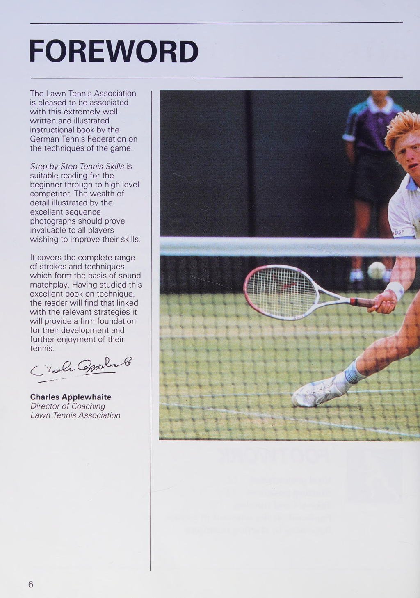
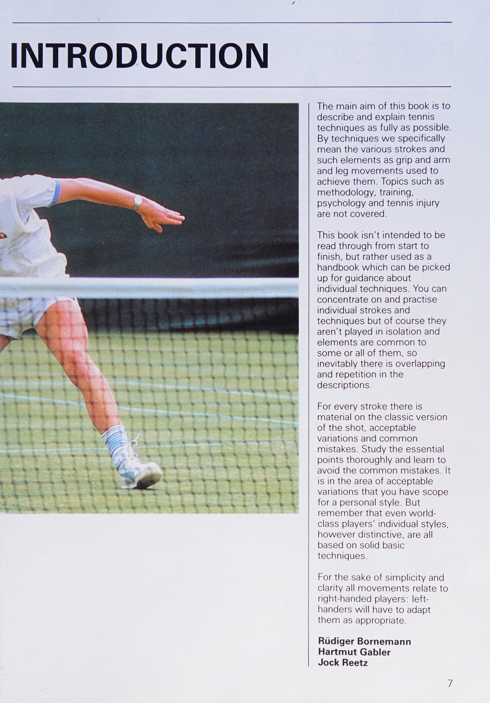
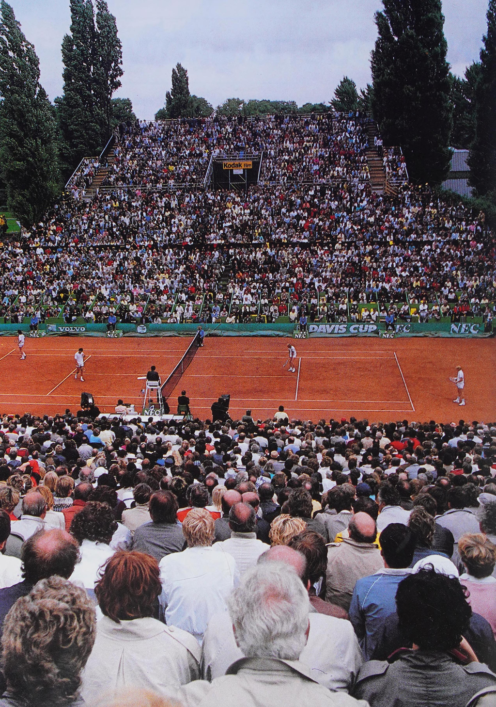

# Foreword

*Source: Step by Step Tennis Skills (Deutscher Tennis Bund), pages 8–10.*

---

## Page 8

FOREWORD The Lawn Tennis Association is pleased to be associated with this extremely well- written and illustrated instructional book by the German Tennis Federation on the techniques of the game. Step-by-Step Tennis Skills is Suitable reading for the beginner through to high level competitor. The wealth of detail illustrated by the excellent sequence photographs should prove invaluable to all players wishing to improve their skills. It covers the complete range of strokes and techniques which form the basis of sound matchplay. Having studied this excellent book on technique, the reader will find that linked with the relevant strategies it will provide a firm foundation for their development and further enjoyment of their tennis. Cae Gye © Charles Applewhaite Director of Coaching Lawn Tennis Association

## Page 9

INTRODUCTION The main aim of this book is to describe and explain tennis techniques as fully as possible. By techniques we specifically mean the various strokes and such elements as grip and arm and leg movements used to achieve them. Topics such as methodology, training, psychology and tennis injury are not covered. This book isn't intended to be read through from start to finish, but rather used as a handbook which can be picked up for guidance about individual techniques. You can concentrate on and practise individual strokes and techniques but of course they aren't played in isolation and elements are common to some or all of them, so inevitably there is overlapping and repetition in the descriptions. For every stroke there is material on the classic version of the shot, acceptable variations and common mistakes. Study the essential points thoroughly and learn to avoid the common mistakes. It is in the area of acceptable variations that you have scope for a personal style. But remember that even world- class players' individual styles, however distinctive, are all based on solid basic techniques. For the sake of simplicity and clarity all movements relate to right-handed players: left- handers will have to adapt them as appropriate. Rudiger Bornemann Hartmut Gabler Jock Reetz

