# Forehand Stances

**Forehand Stances**

**John Yandell**

One of the most obvious commonalities in the modern forehand is the open
stance. If you look through a few hundred forehand files in the Stroke
Archive, you'll see that around 80% of pro forehands are hit with some
version of an open stance.

A common belief is that the open stance generates more power. There is
also research that shows that from wide positions on the court, the
recovery back toward the middle is probably shorter and faster than with
a neutral stance. Because of these factors, there is a trend toward
teaching open stance first, or even exclusively, to players from the
beginning level up.

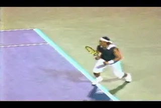

**Open stance in pro tennis: what does it really mean?**

There is another perspective on teaching the modern game that argues
that it is more effective to teach a square stance first. This viewpoint
embraces the open stance, but holds that the fundamentals of turning,
loading, and extending are difficult to develop working exclusively from
the open stance. Typically this school also tends to emphasize more
conservative grips, at least at the beginning, although this point is
usually flexible as a player develops.

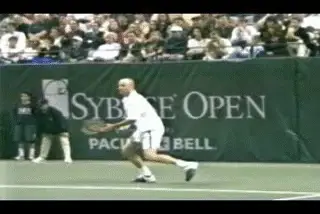

**Is neutral stance hitting a better fundamental base?**

So is one school "right," and the other school "wrong," and if so,
which stance is "better"? Interestingly, the only quantitative study
of open versus neutral stances, done by biomechanist Duane Knudson,
found that there were negligible differences in the ability to produce
ball speed from an open versus a netural stance. If anything the neutral
stance had a slight advantage.

My own opinion is that it is very difficult to answer that question
definitively. The issue is complex and depends on many factors. There
are situational and tactical issues, particularly ball height. And there
are technical issues that relate to grip, swing pattern and body
rotation. In the end it might come down to natural ability, playing
style, and personal preference. Let's take a close look at when and how
the top players use these two basic stances, and then see what we can
extrapolate for players at other levels.

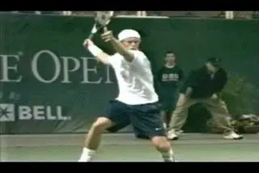

**With the open stance explosion off the court, the ball is out of the
strike zone.**

**Coming Attractions**

Before we proceed, one note on the future. The issue of hitting stances
is complex and can't really be separated from the larger question of
court movement. That's why I'm excited by a new series of articles
we'll be unveiling soon from Australian coach and footwork specialist
David Bailey. David has completed the most detailed study of movement,
stances, balance moves, and recovery patterns ever undertaken in pro
tennis, based partially on the video resources of our Stroke Archive.
His articles will systematically address the entire spectrum of footwork
patterns used by top players in every position on the tennis court.
It's groundbreaking work. I've already learned a lot from David, and
he'll go far beyond this article in helping us understand the use of
stances in the pro game. But for now let's look at some general points.

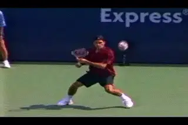

**Controlling contact height--a fundamental problem in pro tennis.**

**Ball Height**

The most misunderstood or overlooked factor in understanding stances in
pro tennis is ball height. In the modern game the ball usually travels
on an arc that reaches shoulder height or higher at the top of the
bounce. Unless the player steps in a takes a screaming, heavily spun
groundstroke on the rise, he must be prepared to play high balls in
virtually every baseline exchange. This means the contact point is
rarely at waist level or below and is more commonly chest or even
shoulder high. When the ball is this high, open stance is a virtual
necessity. In many cases the players are not only setting up in an open
stance. They are coming up off the court and hitting with one or
frequently both feet in the air.

Look at the Hewitt animation. Lleyton is roughly a foot off the ground
with his back foot. He is still making contact at chest level. If he had
his feet on the ground, regardless of stance, the ball would literally
bounce over his shoulder, if not the top of his head.

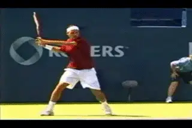

**Even with one foot on the ground at contact, Federer is still
elevating to control contact height.**

***[Contrary to popular belief the players are not "jumping" into
these shots because jumping is some type of technical advantage. They
are going up in the air because the explosiveness of the swings and the
uncoiling of the legs naturally lift the player off the
court.]*** This can happen even on waist high balls. But on high
balls, it's a necessity to create a comfortable contact height. The
ball can bounce so high in the pro game that even with both feet off the
ground the contact point can still be at the shoulder or above.

Although Federer comes off the court with both feet when necessary, he
tends to stand in behind the baseline, or around 3 to 4 feet behind. He
takes the ball much earlier than most players, but he still hits with
his front foot in the air on most of his forehands. The purpose is the
same, to control the contact height by raising his body and keeping the
ball in a comfortable strike zone. By playing the ball sooner, he makes
contact before the ball can get as high, but still on most forehands he
is still elevating somewhat with the opposite foot off the ground.

**Controlling Contact Height**

Controlling the contact height is one of the biggest problems in pro
tennis, even if the commentators on television never mention it. But
how? The players do it by setting up open stance on the back foot and
creating tremendous coiling with the knee bend in the outside or back
leg. You can see the knees bent at a 30 degree or even something close
to 45 degree angle on some balls. As they swing, the back leg naturally
uncoils generating the energy the players need to explode up into the
air.

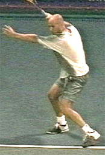

**Turn, align, coil--the principle are the same across the stances.**

**Because so many balls in pro tennis are played partially or wholly
in the air, a new mantra in open stance teaching is "load, explode,
land."** Fair enough. No doubt it's real and
it's necessary depending on the ball. But is going airborne an inherent
part of the modern forehand? Should every ball hit with one or both feet
in the air. The answer is definitely no.

This fact is very important to understand for lower level players. Many
players at the club level are copying their heros who play with extreme
grips and explosive open stances. We have all see players trying to jump
upward into their shots like Guga or Nadal. The problem is that the ball
was at knee or waist height. If you set up in the right stance, coil,
and swing up to the ball, your elevation will naturally take car of
itself. ***[Remember on many other balls even the top players hit with
the front foot still on the court.]***

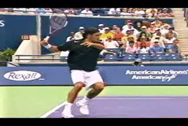

**A textbook old style forehand?**

**Neutral Stance**

It's true that you see players with all grip styles hit open stance.
You also players across the grip spectrum stepping into the ball and
hitting with neutral stances. This happens typically when the ball is
shorter and lower, or when the player is hitting on the rise. Even
players with extreme grips are stepping in a certain percentage of the
time, about 1 out of every 5 balls. It's also true that the top players
can also hit low balls with open stances, but again this is situational,
usually when the ball forces them, or they want to break off an angle
with more hand and arm rotation.

With Federer on some short balls, it looks like he's hitting a text
book eastern square stance forehand. It's the same for Agassi when he
squares his stance to hit on the rise. Agassi will also step in on a low
rally ball. A few years ago, I filmed a match between Andre and Greg
Rusedski with a lot of crosscourt exchanges--Andre hitting crosscourt
forehands to Rusedski's lefty slice backhand. Because Rusedski was
hitting slice, the ball coming back to Agassi stayed much lower than the
typical crosscourt forehand. Andre would step in and hit with a neutral
stance, with the contact point between knee and waist level.

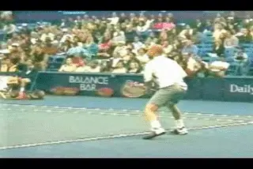

**On a lower rally ball, Andre is also comfortable stepping in.**

Not all players are as comfortable with this as Andre or Federer. This
is related to the differences in grip styles in pro tennis. For extreme
grip players, the netural stance is just not as natural or smooth. In
general, they have a harder time staying set in the square stance and
often look awkward twisting off the front foot to finish their swings.
Players with less extreme grips are able to flow forward much more
easily when they step in.

Watch the Nadal animation. Rafael is stepping into a short wide ball and
hitting it at about waist level with a neutral stance. At contact his
front foot is on the court, but watch how quickly it starts to rotate
and move to his right. The stance appears to be interfering with the
swing.

Why? When we looked at the differences in the forehand across the grip
styles, we saw that the more extreme the grip, the more torso rotation
in the swing. Players like Hewitt or Roddick can finish with the hitting
shoulder coming around and actually pointing toward the opponent, or
something close. The players need to be open to complete this rotation.

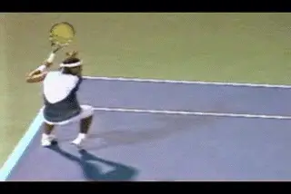

**With an extreme grip the front foot bails out and rotates across the
body.**

When extreme grip players step into the ball, the position of the feet
blocks them. For the torso to continue to come around, the players have
to rotate off that front foot so the torso doesn't twist against the
front foot and leg. To finish his rotation, the front foot needs to come
around with the rest of the swing. The great players make this happen,
but it doesn't look natural. It seems to impede the natural flow of the
motion.

There is another related element. **When extreme players drive the ball,
they turn the hand and racket over, but they also extend the swing
outward, similar to players with less extreme grips**. **When the
front foot blocks the torso rotation it also impedes the players'
ability to extend the hand and arm.** When you see
top players break off angles, they sometimes stop the torso rotation and
bring the hand and racket over and across sooner with less extension,
even with the open stance. But this isn't as effective when they are
trying to drive the ball.

In some cases, players try to adjust the footwork by stepping with the
front toe actually pointing at the net. You can see this in the Guga
animation. This step seems to reduce the twisting of the torso against
the front foot, but watch how Guga still eventually has to bail out in
order to get the shoulders further around through. These problems both
disappear with the open stance. The front foot is clear of both the
torso and arm rotations that is characteristic of the more extreme
style.

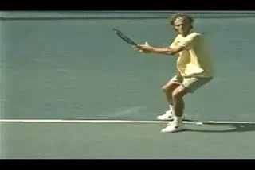

**Guga steps on point with the left foot, but the rotation still twists
it across.**

Now, let's be clear. ***[You do see players like Federer and Agassi
rotate their shoulders further and also use additional hand and arm
rotation. A hall mark of Federer's forehand is his ability to do this
on virtually any ball.]*** But for the less extreme players it's
an option not a necessity. ***When Federer rotates further, for
example, he does it from an open stance and often when he is in the air
with both feet.*** The same is true of Agassi. The
point is that these players can vary the amount of rotation to the suit
the stance. Compared to extreme players, they can drive the ball and
extend further much more naturally when hitting with the neutral stance.

There is another difference. Because they have less rotation, the flow
often takes the less extreme players forward naturally. The uncoiling
may lift a player off the court from the neutral stance. But the front
foot flows forward toward the net in the direction of the shot. This is
very different than the more extreme rotation which lifts the player's
foot off the court and carries it to the player's side.

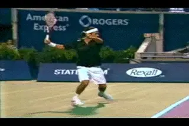

**In the air Federer can rotate the torso and the hand like the extreme
players.**

The versatility of the moderate grips has advantages in the pro game.
But the implications are probably greater for lower level players. We
have just seen how in the pro game ball height dictates the use of open
stance. But the question the average player has to ask himself is this:
at my level what type of ball am I hitting most of the time? Is it a
heavy topspin ball typically bouncing up to my shoulder? Or are most
balls coming in at waist height or a little higher or lower?

In junior tennis, looping topspin and high bouncing balls are the norm,
and junior players, obviously, are usually shorter than adults. Because
they players hit the ball quite hard and with so much spin even at young
ages, it's easy to see why the more extreme grips dominate. This means
open stance as well. Together they make it possible to stay back well
behind the baseline, answer spin with spin, and play matches of
attrition.

But what about most recreational and club players, up to the 4.5 and
even 5.0 and 5.5 levels? In my experience, the majority of balls they
face will not be nearly as high or heavy and are actually better handled
with neutral stances and less extreme grips. This also facilitates more
all court play, which is wildly underused but very effective when mixed
in at the club level.

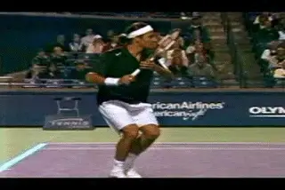

**With less rotation, the flow is forward.**

***[But many club players are obsessed with copying the more extreme
pros, and also, with hitting topspin for it's own sake. [Because of
this they generate spin levels that are excessive compared with the
velocity of their shots. This affects their ability to create depth and
penetrate the court, and can generate a lot of short, fat balls for
their opponents]]***

Again, let me make sure that I'm not being misunderstood. There are
plenty of situations where any player at any level needs the ability to
hit open stance. This includes club and recreational players from the
3.0 level up. I'm not saying that the square stance is superior or that
this is the one and only way the game should be played. I am not
rejecting so-called modern tennis, or even the more extreme
grips--quite the opposite. I have spent enough time with high level
juniors, college players, and lower level tour players to know that a
more extreme style is often their best alternative for maximizing their
competitive results. I've worked hard through video analysis and the
use of pro imagery to help them do this. Furthermore, if you are a 3.5
or a 4.0 player and are overwhelmed by a deep need to copy Rafael
Nadal--and even to wear those pants--I say, go for it.

What I am saying is that these issues aren't black and white. They are
situational. I am saying that it makes sense to tailor the development
of your technical game to the level and qualities of your play--and I
believe the choice of grips and stances is basic to doing this. If 80%
of all pro forehands are hit open stance, at lower levels, that balance
could be the opposite. Because of this, players who blindly try to
develop stances and grip structures based on the pros, can limit their
potential. We can see one example of this in this month's Your Strokes.
The article demonstrates what happens to a club player who has been
taught that the open stance should be the norm for every forehand. And
yes, if you are wondering, I do fall into the camp that believes it's
better to develop players with conventional grips and square
stances--initially at least. My own experience is that fundamentals are
much easier to feel from a square stance with a grip like Roger
Federer's or Andre Agassi's. Players can always evolve to a more
extreme style. As Robert Landsdorp points out, it's easy to go from
conservative to extreme. But it's a lot tougher, if not impossible to
go the opposite way.

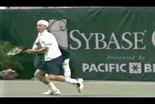

**If the open stance is more, the left or front foot is offset by a
foot.**

**What is Open Stance Anyway?**

There is a final point about open stance and grip style. When we say
"open stance" what does that really mean? If we look at pro players we
see at least two major variations in the open stance, and again the
variations seem to correlate to with the grips.

In general, the more extreme grip players will set up in more extreme
open stances. But players like Federer and Agassi regularly use a
semi-open stance, with the left foot closer to the net. Again this seems
to correlate directly with the amount of body rotation in the swing. The
more extreme stance allows for more extreme torso rotation without the
feet getting in the way.

Typically the extreme players like Nadal, Hewitt or Guga set up in an
open stance with the left foot about one foot ahead of the outside or
right foot. Players with more moderate grips increase this offset, so
that the front foot is more in front, with the leg at about a 45 degree
angle to the net. You can definitely find the moderate players in
extreme stances and vice versa, but this is more the exception than the
norm.

I have heard it argued that "open" stance means that both feet are
basically parallel to the baseline, with literally no offset between the
feet. But you almost never see that in pro tennis. ***Players that I
have seen trained to hit according to this theory really struggle to get
a full body turn and tend to overrate or rotate too soon on the forward
swing.***

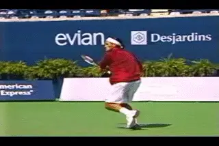

**If the stance is semi-open, the front foot is closer to the net.**

A critical point in all the stances is the set up, something that is
still widely misunderstood and the source of many, many problems at
lower levels. The key to all the stances is to learn how to set up on
the outside foot, something that several articles on TPA
discuss in detail. If you start with a conservative grip and learn to
hit with a square stance, it is particularly important. ***A common
stance error that we see over and over is the tendency to reach the ball
with the front foot. This causes many technical problems and is
difficult to change once established.***

The set up for the semi-open and the neutral stance forehand are very
similar. they can and should be taught in a similar way.

***The key is the outside foot. The progression goes like
this.***

1.  ***Get a great shoulder turn with the left arm stretched across
the body.***

2.  ***Align behind the ball with the outside
foot.***

3.  ***Load the back leg through a natural, deep knee
bend.***

4.  ***The other foot should be offset to the backfoot at about a 45
degree angle and about two feet closer to the
net.***

5.  ***Keep your balance and keep your posture
upright.***

***The back foot set up is critical to proper alignment in either
neutral or open stance.***

You are now ready to hit open stance. You are also ready to step forward
and hit netural stance. The principles are the same. In reality, when
players step in they will usually bring the opposite or left foot up a
little more underneath them a little sooner. The exact distance to the
ball is probably slightly different. The load on the back leg will also
usually be a little less, because with the step forward there is also
knee bend in the front leg. But all these things tend to happen
automatically if the player really does have the feel for a balanced set
up on the outside foot.

***I think a lot of the criticisms of "classical" or "old style"
tennis stem from a misunderstanding about this relationship between the
set up and the hitting stance.*** The fact is that
it is more than possible to hit open stance with conventional grips and
to hit well. The possible advantage of extreme grips doesn't really
come in play until the rally balls you face are consistently quite high.
If you play most of your balls at waist level, why would you adopt
stances or a grip style that were suited to the heavy, high velocity pro
game? The key at all levels is the flexibility to have stance
options--to use the right stance at the right time, and in particular,
to develop the most appropriate stances for your level and style of
play.

John Yandell is widely acknowledged as one of the leading videographers
and students of the modern game of professional tennis. His high speed
filming for Advanced Tennis and TPA have provided new visual
resources that have changed the way the game is studied and understood
by both players and coaches. He has done personal video analysis for
hundreds of high level competitive players, including Justine
Henin-Hardenne, Taylor Dent and John McEnroe, among others.

In addition to his role as Editor of TPA he is the author of
the critically acclaimed book Visual Tennis. The John Yandell Tennis
School is located in San Francisco, California.
