# Backhand Stances: Pro Women

# John Yandell 

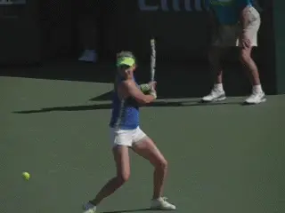

**Are pro women's backhand stances fundamentally different from the
men?**

In the last two articles we've looked at the surprising predominance of
closed stances on the men's pro backhand, both for the two hander
([link](John%20Yandell-Modern%20Backhand%20Stances-%20The%20Two%20Hander.docx))
and for the one hander ([link](John%20Yandell-The%20Extreme%20Closed%20Stance-Pro%20One%20Handed%20Backhand.docx)).
But what about the women?

Unlike the men, almost all of the top women hit with two-hands. So are
the stance choices similar to the two-handed men? No. The women's
stances are actually different and more varied. Open stance is the most
common choice for most women players, or to be accurate, semi open
stance, similar to the dominant stance on the forehand. This means the
front foot is closer to the net than the rear and offset at about a 30
to 45 degree angle from the rear foot. ([link](https://www.tennisplayer.net/members/avancedtennis/john_yandell/building%20_the_modern%20_forehand/stances_modern_forehand/stances_modern_forehand.html))

Some players use the semi-open more predominantly or even exclusively.
Venus Williams for example hits virtually all her backhands semi-open
and hits many that are from a fully open stance or something close.

After the open stance, the second most prevalent choice is neutral or
square stance. This means the player is stepping forward so a line
across the toes is basically parallel to the target line.

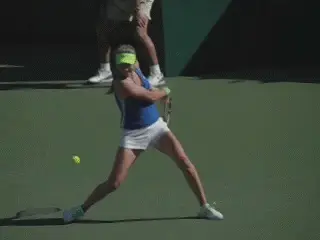

**The semi-open stance alignment with a line across the toes at an angle
of 30 degrees to 45 degrees with the baseline.**

Closed stance is the first choice on the men's side. But for the women
closed stance is a distant third. And when the women players do hit
closed, the step across is usually shorter, at a less severe angle, and
the knee bend not as deep.

Here are some numbers to show this. Looking at over two hundred
backhands from top women's players where they appear to have the
ability to choose the stance option, about 45 percent of the stances
were open. About 40 percent were neutral. 15 percent or less of the
stances were closed.

And, again when women do use closed stances, they tend to be less severe
than in the men's game. The primary use appears to be on balls that are
shorter and lower.

How to account for these variations? There are at least two factors to
consider. Grip and hitting arm structure.

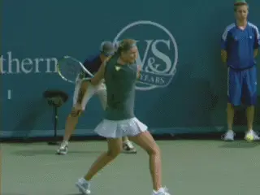

**Closed stance is far less frequent, and usually less extreme.**

When it comes to the grip, virtually all men shift to some version of a
continental grip with the bottom hand. The basic flaw in Andy Roddick's
backhand was that he did not. ([link](https://www.tennisplayer.net/members/avancedtennis/john_yandell/two_handed_backhand/2hd_bh_roddick/2hd_bh_roddick.html).)
Most of the women do something similar.

**Why?**

But two of the greatest women's players of all time, Venus and Serena
Williams don't. Although they do change grips with the bottom hand,
neither rotates the hand far enough toward the top of the handle to be
considered a mild backhand grip or even some version of a continental.

Their index knuckles hover around bevel two. But it's questionable
whether the heel pad of the racket hand ever creases the top bevel,
particularly with Venus.

This bottom hand grip is actually similar to the old style eastern
forehands of players like Don Budge and Jack Kramer. This is with both
the index knuckle and the heel pad predominantly on bevel two.

What about the grip with the top hand? For both Venus and Serena, the
top hand is in a mild semi-western . The heel pad is basically behind
the handle and the index knuckle is shifted down one bevel. This
corresponds to a 4/3 grip in TPA terminology. ([link](https://www.tennisplayer.net/members/avancedtennis/john_yandell/grips/modern_forehand_grip_variations_part1/modern_forehand_grip_variations_part1.html))

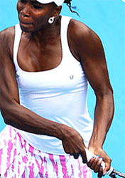

**Neither Venus or Serena has a true backhand grip with the bottom
hand.**

This grip combination--a weak bottom hand and a semi-western top
hand--has a fundamental effect on the stroke mechanics. Both Serena and
Venus's backhands are much more left side or left arm dominant than
backhands that have a stronger grip with the bottom hand.

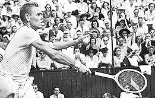

Kramer's forehand grip with the index knuckle visible on Bevel 2.

They are more similar to left handed forehands and make less use of the
front arm. This is directly related to the preference for semi-open
stances.

Virtually all the other top women hit with grip structures similar to
the men. This means the grip with the bottom hand shifts into some
version of a continental or mild backhand.

This can be combined with an eastern grip which places the palm more
completely behind the handle. Or a grip with the index knuckle shifted
downward in the same direction as Venus and Serena.

**These women hit a higher percentage of open stance backhands than the
men, but also hit more backhands neutral and closed in comparison to the
Williams sisters.**

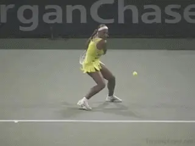

**Serena hits predominantly semi-open. For Venus some version of open
stance is virtually exclusive.**

But why do they hit neutral stance more, rather than closed stance like
the men, and why are the closed stances less extreme? These brings us to
our second key factor: the hitting arms.

**[For the men the most common hitting arm structure is with the bottom
arm bent and the top arm straight. Virtually all the women hit with a
double bend.]**

**[This means the elbow is bent and pointed in toward the body, and the
wrist is laid back. As the swing starts forward, this structure is
maintained at the contact and out into the followthrough.]**

For Venus and Serena there is less pull at the start of the stroke with
the front arm due to the weaker bottom hand grip. This also means the
left, rear arm is pushing more, sooner.

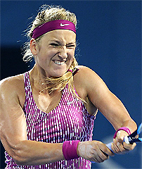

Most women rotate the bottom hand more toward the top of the frame in
comparison with the Williams sisters.

In the extreme version like Venus this can also mean greater body
rotation in the forward swing, typically with a more open stance. On
these balls Venus finishes with the rear shoulder pointing at least
partially toward the opponent, similar to the modern forehand.

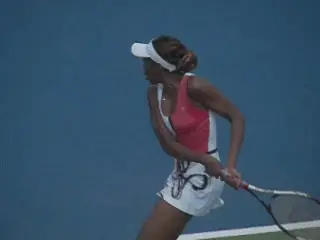

**Venus often rotates the torso further through the back with a more
fully open stance.**

However the double bend structure also has an impact on the women who
change the grip more than Serena or Venus. **[When the men straighten
out the rear arm they push the contact point slightly further to their
sides and probably slightly more in front as well.]**

**[This contact point is probably more conducive to the large diagonal
cross step with the bigger turn and deeper knee bend that is associated
with the men's closed stance. But this also may be a strength issue for
women players.]**

In any case, the spacing of the double bend structure makes the open
stance more natural for the women. It also restricts the ability of
women players to cross step since it keeps the hands and racket closer
to the body.

The women who do make a grip shift similar to the men are able to use
the front arm pull to help initiate the forward. But because both arms
are bent and closer to the body, the neutral stance is probably more
comfortable than the extreme closed version.

So, clearly, there is more diversity in stances with the top women. But
can we honestly saw that one version or the other is superior? As I have
said before we can't clone players to teach them two different
technical styles and compare.

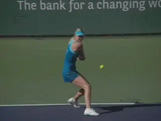

**The contact point with the double bend appears closer to the body than
with the straight bent arm alignment of the men.**

It would be hard to argue with the Williams sisters results, obviously.
Yet other women produce fantastic two handers with different grips and
stances.

My own preference would be to start two handers with a grip shift to a
mild backhand. But for other players less shift and more left handed,
open stance styles may end up being the way to go.

Regardless I think it is important to develop a feel for the semi-open
stance set up. This includes the shoulder turn but also the deep coil
with the back leg.

I pair that initially with the neutral step forward into square stance.
I think this step is important when you are working on fundamentals
because it helps players complete and really feel the turn.

From there you can experiment with the closed stance going somewhat
further across--or staying with open stance more exclusively. Still the
goal is for the player to feel comfortable with all the variations and
to be able to move seamlessly from one stance to the next, as
appropriate to the ball. More on all this when I get to the two hander
in my New Teaching Method series.

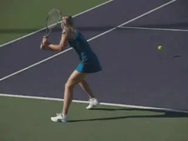

**Learning neutral stance helps players feel the full turn.**

A final important point that we also saw with the men. This is the role
of the backfoot, and specifically what it does in the forward swing.

It's been well documented that the backfoot often swings around after
the stroke. This is the so called recovery step, so the player can then
push off back toward the middle.

But in all three stance variations, the recovery step happens after the
completion of the swing, not during. In reality the backfoot actually
stays well on the player's right side and often actually kicks backward
until the followthrough is wrapping over the shoulder.

This is a key factor in controlling the body rotation and the angle of
the torso at contact. As we saw the men, the contact point on virtually
all two-handers is with the shoulders still partially closed to the
baseline.

This is true even for the extreme women's versions like Venus and
Serena. When the players are closer to on the dead run, the recovery
step may happen sooner. But emphasizing the conscious swinging of the
foot disrupts the natural timing of the basic two-hander and causes the
body to rotate too soon.

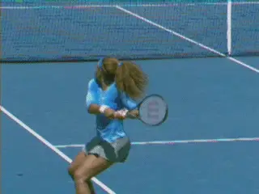

**In all the women's stance variations, the back foot stays behind and
kicks back slightly until after the forward swing.**

So there is one significant commonality between the men and the women,
regardless of stance. As to the differences, the question is whether the
women's backhand will move closer technically to the men's with
straight rear arms and more closed stances preferences. Only the future
of tennis can tell.

Is it important to understand all these variations? Yes. As players
and/or coaches if we truly understand the options we can apply them more
appropriately in developing the best two hander variation for ourselves
or our players.

Obviously players can succeed with very different combinations of
technical elements--that's not just on the backhand, it applies to all
the strokes. But understanding the range of sound options gives players
and coaches greater clarity and greater technical mastery in developing
the right combination.

John Yandell is widely acknowledged as one of the leading videographers
and students of the modern game of professional tennis. His high speed
filming for Advanced Tennis and TPA have provided new visual
resources that have changed the way the game is studied and understood
by both players and coaches. He has done personal video analysis for
hundreds of high level competitive players, including Justine
Henin-Hardenne, Taylor Dent and John McEnroe, among others.

In addition to his role as Editor of TPA he is the author of
the critically acclaimed book Visual Tennis. The John Yandell Tennis
School is located in San Francisco, California.

---

<!-- prevnext-nav -->
[← The Two-Hander](john-yandell-modern-backhand-stances-the-two-hander.md)  |  [Advanced Tennis Index](index.md)  |  [Introduction →](the-one-handed-topspin-backhand-introduction.md)
