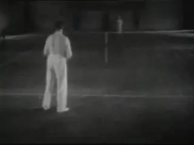
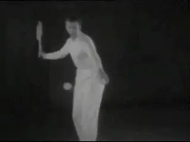
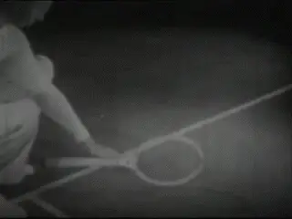
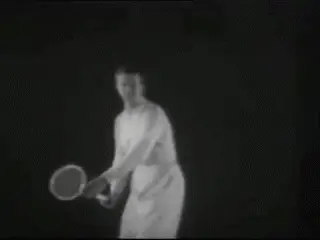
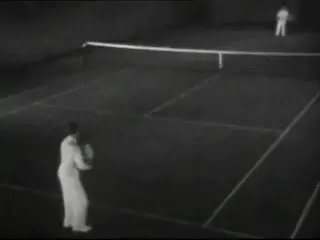
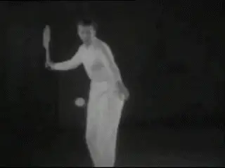
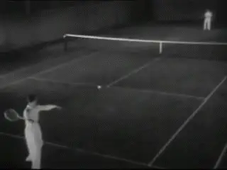
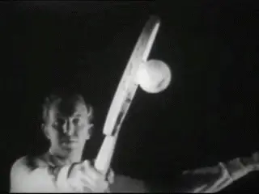

# Classic and Modern Tennis:

### John Yandell

# Is Don Budge's Forehand Good Enough for You?

**Who was Don Budge and what was his forehand really like?**

Who in this modern era would be crazy enough to model their forehand on
Don Budge? Who was Don Budge anyway? Oh right, he was the guy who
invented the concept of the Grand Slam (actually he invented the
phrase!)--and then went out and won the first one.

OK fine, but Budge played with a wood racket that weighed over a pound!
In those days you held onto the racket with naked wooden handles! They
didn't even have leather grips yet! There was no poly string! Not to
mention you had to wear long white flannel pants!

Recently one of our subscribers posted something amazing that I had
never seen. A link to a Don Budge instructional film made in the mid
1940s. ([link](https://youtu.be/j_jT-pqRIDI) to see the whole
thing.)

Is this film some curiosity demonstrating the primitive nature of tennis
in a distant era? Budge's technique must be completed antiquated, right?

No! This film is fascinating. The fundamentals of the way Budge hit his
forehand are in many respects little different from so-called modern
tennis. If 99% of the players in the world had this technique they would
all be 1000% better.

We are talking unit turn and left arm stretch and an ATP-like backswing!
Open stance! Reverse finishes! Budge even advocates a closed racket face
for topspin, something that was once viewed as impossible. So were the
1940s more modern than modern?

**How classical is classical and how modern is modern?**

Let's not go too far. There is no doubt the game is way different today
at the highest levels. Spin, velocity and contact height are all
higher---way, way higher. 100mph forehands with 5000rpms that bounce
above shoulder level.

But there are fundamental technical continuities. Guess what? Great
athletes in all eras figure out similar things in similar circumstances.

In the previous article in this series, I looked at some of the
classical elements in modern tennis--and vice versa ([link](https://www.tennisplayer.net/members/avancedtennis/avancedtennis/john_yandell/classical_tennis_and_modern_tennis/part_01/).)
Now let's do the same in more detail with the technical specifics of
Budge's forehand.

If you believe the scornful words of "modern tennis" exponents no one
could even play real tennis before extreme windshield wipers and massive
topspin. Players like John McEnroe and Pete Sampras couldn't even
compete against "modern" heavy ball baseliners.

So how could Don Budge? This is the background discussion that makes
Budge's film so interesting. The extreme modern game propaganda loses
credibility when tested against historical reality. The fundamentals in
Budge's forehand are amazing.

**Grip**

**An eastern grip with the hand on the wood and aligned with racket
head.**

But wait Budge has an antiquated eastern grip. Doesn't that disqualify
him as "proto modern" right there? Well that grip is good enough for
Roger Federer, Jo Willie Tsonga, and Juan Martin Del Potro among others.

Although other players of Budge's era and later had forehand grips
turned toward the continental, Budge himself had a classic eastern with
the palm of the hand aligned directly with the racket face and the
string bed--a grip that falls within the range of effective grips in
the pro game. And for players at all other levels, that grip is probably
far more suitable and effective, as we see in this month's article from
my new teaching methodology series. 

Why Eastern? The grip allows players to hit through with the racket more
or less on edge--a basic semi-flat drive. That's a great basic swing
pattern and one that even advanced club players can hit with great
effect. ([link](https://www.tennisplayer.net/members/avancedtennis/classiclessons/scott_murphy/traditional_forehand/)
to see the forehand of Karsten Pop, who even in his 40s, is one of the
best players in super competitive Marin county California.)

**A modern unit turn with both hands on the frame.**

It is also suited to the contact height of most club and league
tennis--balls that are waist high to mid chest high at the highest. But
an Eastern grip also allows players to hit the windshield wiper that
happens on almost every ball in the pro game and is an important option
for players at lower levels as they develop.

**Preparation**

The preparation Budge demonstrates is the most amazing part of this
film. He starts with a unit turn with both hands on the racket. This
takes his body to about 45 degrees to the net before the hands separate.
Sound familiar? ([link](https://www.tennisplayer.net/members/avancedtennis/avancedtennis/john_yandell/your_forehand_and_the_modern_forehand/preparation/your_forehand_and_the_modern_forehand_preparation.html).)

Next his hands separate and the left arm stretches across the body. All
I can remember from the 1960's on was teachers advocating pointing the
left arm at the ball! It wasn't really until high speed video came
along that the left arm stretch was "discovered."

Or should we say, rediscovered? Here is the best player in the world
demonstrating and advocating it in 1940. How did that not get into the
teaching consciousness of the time for the future?

**The left arm stretch and the ATP backswing--decades before the ATP
existed.**

But what is even more amazing is what happens with the racket arm and
the backswing. There was a major stir--a revolution even when Brian
Gordon and Rick Macci developed the concept of the "ATP backswing."

Every teacher on the internet suddenly stole the concept and acted like
he had known it all along. ([link](https://www.tennisplayer.net/members/avancedtennis/high_performance/rick_macci/develop_atp_forehand/)
to Rick talk about this on TPA. [link](https://www.tennisplayer.net/members/avancedtennis/biomechanics/brian_gordon/developing_an_atp_forehand_part_01/)
to see Brian's more scientific explanation.)

In case you been off the planet for the last few years, the ATP
backswing is with the racket head above the hand, the racket arm to the
right of the body on a slight diagonal, and the racket face slightly
closed to the court. Look at Budge! It's virtually the exact ATP
position.

Maybe Rick and Brain secretly found this film before I did. Just
kidding. What is interesting is that Brian established by his research
not only that this was a commonality for top male pro, he showed why
it's a biomechanical advantages in terms of the way the muscles work.

Who could know that Don Budge was turbo charging his forehand via the
stretch shorten cycle in the 1940s? And then bringing that one-pounder
through--no wonder he was widely perceived to hit a very heavy ball.

**Natural adaptations to open stance.**

**Stances**

Not to mention his "modern" use of stances. In the instructional
components Budge demonstrates the perfect basic footwork to hit a
neutral stance forehand--and also how to shift the weight with that
stance pattern.

And many of the balls he hits--controlled rhythm rallies with a high
level teaching pro are hit neutral. But you also see him shift stances
effortlessly to adjust for various balls. Watch him adjust his feet and
set up a mild semi-open stance on a higher ball. Watch hit semi-open
when he moves wide.

It's a fantasy but what if we had extensive high speed film of him,
Jack Kramer, Pancho Gonzales, even Bill Tilden, the same way we have of
modern players in our High Speed Archives? Then we could actually study
the evolution of technique in a much more detailed, more nuanced and
more conclusive way.

**Finishes**

**The classic eastern finish: simplicty pace, depth, consistency.**

As I said one of the advantages of the eastern grip is the flexibility
in the finishes. When you watch Budge in his film, you see mainly long,
gorgeous, rhythmic, classic finishes.

Love these. If your grip is Eastern or close you can come through with
the racket on edge or with a little bit of arm rotation and hit a
topspin drive that maximizes velocity with just enough spin to keep it
in and hit deeply and consistently.

Because there is not the same level of upper arm rotation as in a wiper,
you have eliminated a huge variable, which although it has benefits, can
also introduce crazy errors for lower level players. And look at the
extension!

If you look at video of self-taught players on the Tennis Warehouse
message boards, they often have extreme mechanical wipers. We all need
to robotically copy the pros right?

So you see these guys no matter what kind of ball they are dealing with
or trying to hit turning the racket over 180 degrees from sideline to
sideline on every swing-- regardless of the lack of depth or pace or
control--or the heinous errors. Sad yet funny.

**Even under controlled conditions a hint of finish variety.**

You don't have that problem with the more classic finish. But then that
goes back to grip. If you go under the handle you have to wiper much
more to get the racket head through the swing. Why not have the option
to play the ball that suits the situation--especially below the pro
level--ie especially for 100% of all people reading this article.

In fact, it looks very much like the finish in the great Welby Van
Horn's teaching system. ([link](https://www.tennisplayer.net/members/avancedtennis/teaching_systems/welby_vanhorn/true_master_forehand_balance_checkpoints/true_master_forehand_balance_checkpoints.html).)
He lived to be 94 and I feel very lucky that we were able to capture his
approach on TPA. Guess what? He was a contemporary of Don
Budge.

**Other Finishes**

Having said all that, even in the staged, controlled rallies in the
film, you see how easily Budge can alter the swing to fit the situation.
On some forehands the racket head turns over much more, a partial wiper.

There are also a couple of natural "reverse" finishes where the racket
comes back to the same side as it started. (For the original article
from Robert Lansdorp that started the Reverse Finish craze in our era,
[link](https://www.tennisplayer.net/members/avancedtennis/famouscoach/robert_lansdorp/lansdorp_reverse_forehand_images/lansdorp_reverse_forehand.html).)

**Don Budge advocating the impossible closed face.**

**Closed Face**

And then there is the closed face. A lot of "modern" research
concluded that this just wasn't even possible. The ball would obviously
go down into the net.

It took high speed video in the 90s to show that well, no, it was not
only possible but common. Our contributor Kerry Mitchell was way ahead
of his time (or maybe the ultimate retro thinker...) in advocating this
years ago. ([link](https://www.tennisplayer.net/members/avancedtennis/classiclessons/kerry_mitchell/Mitchell_Forehand_Grips_images/Mitchell_Forehand_Grips.html).)

The interesting thing is that all these elements: different stances,
finishes, racket face angles happen at all in this highly structured
instructional film. Again makes me long to film a few matches on the
different surfaces.

Grass was lower bouncing at the time. But what about filming Budge on
red clay winning the French? Wow. I bet we would learn some stuff
then...

If I still played with a wood racket maybe I'd take the grip off it
just to feel what the wood itself actually felt like when you found the
exact sweet spot.

John Yandell is widely acknowledged as one of the leading videographers
and students of the modern game of professional tennis. His high speed
filming for Advanced Tennis and TPA have provided new visual
resources that have changed the way the game is studied and understood
by both players and coaches. He has done personal video analysis for
hundreds of high level competitive players, including Justine
Henin-Hardenne, Taylor Dent and John McEnroe, among others.

In addition to his role as Editor of TPA he is the author of
the critically acclaimed book Visual Tennis. The John Yandell Tennis
School is located in San Francisco, California.

---

<!-- prevnext-nav -->
[← Murray and the Open-Stance Forehand](andy-murray-and-the-open-stance-forehand.md)  |  [Advanced Tennis Index](index.md)  |  [Read →](the-myth-of-hitting-around-the-ball.md)
