# Modern Backhand Stances: The Two Hander

# John Yandell

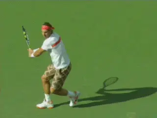

**Why is the extreme closed stance is the norm on the modern pro
backhand?**

For the last few years there has been an ongoing, heated discussion of
what constitutes "modern tennis." Much if not the majority of that has
focused on the forehand.

And a major topic in that forehand discussion has been stances--
particular open stances. During the same period though there has been
little analysis of the corresponding stances in the modern backhand.

"Open stance" may in fact be the number one modern tennis buzz phrase.
But when we look at the video evidence, the top men in the world hit the
majority of their backhands with the exact opposite stance--an extreme
closed stance with a diagonal cross step.

Surprised? It's true on the two handed backhand. And it's even more
prevalent on the one-hander.

Looking at several hundred pro backhand-- when the players had the
ability to choose how they set up--over 55% of all two handers were hit
with closed stances. For the one hander it was over 60%.

Neutral Stance was the second choice. Open stance was third.

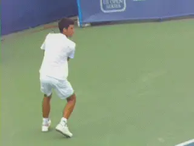

**Closed stance--increased coiling and uncoiling in the torso and
legs**

That conclusion may seem surprising, shocking even, but is critical in
understanding how the top players play, and something that must be
evaluated in how the two-hander is taught.

So in this first article on backhand stances let's take a detailed use
at the stances on the modern two-hander. Next we will move on the one.
The pro women are more complicated to understand and use a more varied
range of stances. We'll look at them in a third article.

**The Closed Stance Preference**

It's incontrovertible that the closed stance is the preferred stance
when the great two handed players have the opportunity to choose how to
set up.

That doesn't mean they don't hit with neutral or square stances. It
doesn't mean that they don't hit with open stances. They do both at
certain times from certain positions.

From deep in the court, players often hit open stance. Players also hit
open when they are forced on time.

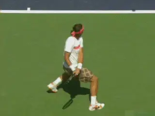

**All top players hit with open and neutral stances as well.**

Around the center of the court, top two handers will tend to hit more
neutral stance backhands. This is also true when they are setting up
near the sideline and hitting down the line.

You can find also exceptions to all these tendencies. But it is still a
fair generalization to say that closed stance is the most common and the
most preferred stance.

So how could it be that the predominate stance on the men's two
backhand is the complete opposite of what we see on the modern forehand?
To see why, let's start by looking at the open stance on the modern
forehand and how it functions.

As strange as it may initially sound, the technical benefits of open
stance on the forehand are actually similar to the technical benefits of
closed stance on the backhand.

**The result in both cases is an increase in the use of the torso and
the legs, and therefore the generation of more racket
speed.** It goes to show--once again--how complex
and dynamic the game is at the highest levels--and how difficult it is
to understand.

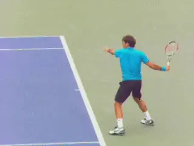

**The semi-open stance is the preferred choice on the forehand for pro
players--even with conservative grips.**

**Open Stance Forehands**

At the pro level the use of open stances dominates on the forehand---but
there are two primary versions of open stance, fully open and semi open.
It's important to understand that the preferred pro forehand stance is
semi open--not fully open--and to understand why that is.

**By semi-open I mean that the front foot is clearly in front of, or
closer to the net, than the rear foot.** Typically,
if you draw an imaginary line across the toes, the front foot is off set
at something like a 30 to 45 degree angle to the rear.

You definitely still see a percentage of forehands hit in pro tennis
with neutral stances, but usually this is an adaption to low balls and
short balls, even for players like Roger Federer who have conservative
grips. And you see a percentage of forehands hit with full open stances,
that is, with the feet set up basically parallel to each other and the
baseline.

But the video evidence on this is overwhelming. The players will work
very hard with a complex array of adjusting steps to create the semi
open alignment whenever possible.

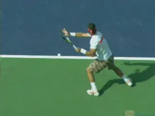

**Would this ball bounce over your shoulder?**

There are two reasons for open stance in pro tennis. The first is to
deal with the phenomenal levels of topspin and the resulting contact
heights.

The spin and trajectory levels in pro tennis cause frighteningly high
ball bounces. It's not uncommon for players to make contact at shoulder
height while being a foot or more in the air.

Put another way, if you were standing on the baseline, some
groundstrokes hit in the pro game would bounce over your shoulder. This
point isn't understood--especially by television commentators who
played before poly strings and the evolution of modern technique changed
the game. (For more on the effect of poly string, [link](https://www.tennisplayer.net/members/physics_of_tennis/josh_speakman/copolystrings_how_do_they_work/).)

But of the two open stances, why the semi open? The answer is greater
coiling in the preparation, and therefore the additional forward body
rotation in the forward swing.

**We see incredible coiling on the forehand in the modern game, in the
legs, but also in the hips and shoulders. As a result we see incredible
uncoiling.**

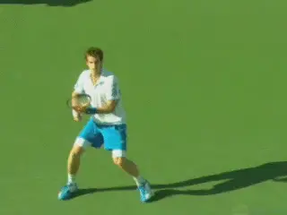

**Compare the slighter great turn in the semi-open stance.**

**The norm on the modern forehand is for the player to leave the court
with one or both feet and for the rear shoulder to rotate forward and
around until it is pointing at the net or something close. This is an
incredible 180 degrees of body rotation in the forward swing--or
more.**

The advantage of the semi-open stance is that it enhances even further
by allowing players to turn incrementally more in the coiling phase. And
that in turn creates additional uncoiling and rotation in the forward
swing.

Let's see this by comparing the angle of the shoulder turn for Andy
Murray who tends to hit more fully open forehands to Novak Djokovic who
uses the semi-open stance more predominantly. ([link](https://www.tennisplayer.net/members/avancedtennis/john_yandell/building%20_the_modern%20_forehand/andy_murray_open_stance_forehand/)
for more analysis of Andy's forehand.)

Look at the angle of the torso at the furthest point in the turn. Andy
has a great turn. His shoulders are about 90 degrees to the baseline or
a little more. 99 percent of all club players I have ever filmed don't
turn that well.

But look at Novak with the semi open offset between the feet in his
stance. His shoulders have turned another 20 or 30 degrees. No doubt he
has a significant additional upper body coil.

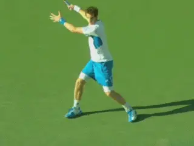

**From the deeper turn the uncoiling from the semi-open stance is
slightly greater.**

You see the exact same position with the semi open stance with other top
players. Rafa. Federer. Del Potro. Even Andy on many balls.

Now watch the uncoiling. **If the shoulders are turned further away in
the preparation they will automatically rotate further in the forward
motion.**

Andy is getting around 180 degrees of forward shoulder rotation with the
open stance. As crazy as it seems, Novak--or any top player in the
semi-open stance is getting probably something like 200 degrees or more.

**Backhand Stances**

So how does this analysis relate to closed stance on the backhand side?
**The answer is players have found a way to incrementally increase the
amount of coiling and body rotation on the backhand as well. This is
with the closed stance.**

Why wouldn't top players just set up in a semi-open stance on the
backhand and rotate through the shot in the same way as the forehand?
The two handed backhand is like a left handed forehand right?

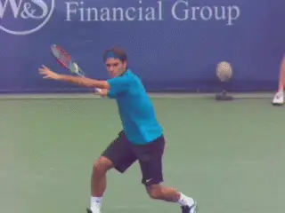

**Contact: the forehand shoulder position, the one handed shoulder
position, and the two handed position--basically halfway between.**

Or an alternate theory--why wouldn't players want to step directly into
the shot with a neutral stance? Wouldn't that generate weight transfer
and linear momentum?

**Not a Left Handed Forehand**

The answer is that in the men's game a two-handed backhand is not really
a left handed forehand. And if that comes as a surprise and contradicts
what you have read or heard, I made that exact argument myself in a best
selling instructional book called Visual Tennis.

That was in the days before high speed video existed and there was no
way to study technique in the detail or with the number of examples the
way we can today. And my belief is that it's important to acknowledge
this and revise our thinking whenever we have newer, better data sources
that can lead to better knowledge.

The fact is a two-handed backhand--in most cases--is exactly that: a
backhand hit with two hands. The role of both is critical. We can see
this by looking at the position of the body at contact and the amount of
rotation that has occurred at that point in the swing.

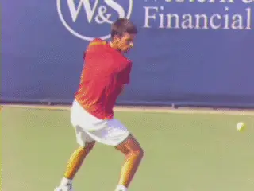

**Another look at the interplay of the hands and body rotation in the
forward swing.**

With a forehand, the shoulders rotate 90 degrees plus so that they are
basically parallel with the baseline. With a one-handed backhand the
shoulders are square at contact, that is, basically perpendicular to the
net.

On the two handed backhand, guess what? The position of the shoulders is
usually dead in the middle---half way in between the forehand and the
one-hander--about 45 degrees to the net. And that is basically the same
regardless of stances.

This is what Rick Macci and Brian Gordon call a pull push swing
combination. ([link](https://www.tennisplayer.net/members/high_performance/rick_macci/develop_atp_backhand_2/).)
There is no rotational increase or advantage with the open stance on the
two hander, because the shoulders finish parallel to the net.
Understanding this is critical to understanding the predominance of
closed stance.

**Grips**

It's also critical to understand the grips that produce this. To hit a
true two-handed backhand, the players have to use some version of a true
backhand grip with the bottom hand.

Typically this is what can be describes as a mild to a strong
continental. In TPA grip terminology that could be a 2 / 1 with
the index knuckle on bevel 2 and the heel pad on bevel 1. ([link](The%20One%20Handed%20Topspin%20Backhand.docx).)

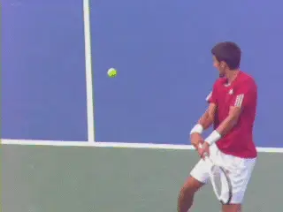

**A mild backhand grip paired with an eastern or mild semi-western.**

This can be paired with either an eastern or a mild semi western grip
with the top hand. In the same terminology that would be a 3 / 3 with
the heel pad and the index knuckle both square behind the handle. Or a 4
/ 3 with the index knuckle shifted one bevel down. ([link](Common%20Elements%20Across%20the%20Grip%20Styles.docx).)

When we get to the women we will see that there are other variations
with the bottom hand that involve less of a grip shift, and that for
these players, the different grip structure affects the technical
fundamentals of the swing.

**Closed Stance Coiling**

So now we are in a position to understand the closed stance advantage.
Due to the true two-handed nature of the shot, two handers cannot
develop the same amazing, massive torso rotation you see on the forehand
forward swing.

But with the closed stance they are able to increase the initial turn,
and thereby increase the total amount of body rotation from the turn to
the contact.

The long diagonal step is key in creating this extra turn. At the time
the player steps to the ball, draw an imaginary line across the toes.
Then another across the shoulders. Basically, those two lines are
parallel.

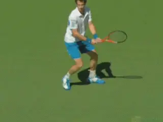

**Compare the relation between the stance and the amount of shoulder
turn but also knee bend.**

And look what that does to the turn. The shoulders turn as much as 120
degrees or more. The same way they do on the forehand side with the open
stance.

Compare this to the times the players hit with neutral stance. The
shoulders with the neutral stance tend to turn about 90 degrees. Like
the open stance, the neutral stance has less turn potential.

Again, for the average player, turning 90 degrees on the backhand is an
awesome achievement, but in the supercharged world of high velocity pro
groundstrokes, the top players have found a way to turn further.

**[Semi-open forehand. Closed stance backhand. The effect is the same. A
significant increase in the coiling in the upper body.]**

But that's not all. Note with the diagonal step into the closed stance
two hander how wide the players' base becomes. Look also at the legs.

If we compare the knee bend, it is generally significantly deeper than
with a step directly forward into a neutral stance.

Now look at the release and the uncoiling. Compare the increased
rotation to contact. There is an additional 20 to 30 degrees of rotation
with the closed stance. Again the contact is at about 45 degrees with
the shoulders then continuing on until they are parallel to the court.

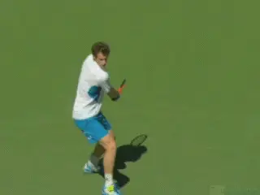

**Compare the increased rotation and the uncoiling of the legs in the
closed stance.**

Note also the motion of the legs. The deeper knee bend automatically
means that the upward uncoiling of the legs will be increased as well.

These are incremental differences. But clearly the players feel the
advantage and this is why you see the closed stance on the two hander in
pro tennis.

**As For You?**

The next question to ask however is whether the closed stance is
suitable in your game. The answer is possibly. **[A common problem for
club players is the tendency to chase the ball with the front foot and
to pivot wildly through the shot with the back leg swinging around too
soon.]** ([link](https://www.tennisplayer.net/members/teaching_systems/kerry_mitchell/the_lesson_process_backhand/).)

Watch the back leg on these high level two handers. Watch how it stays
behind the player, well behind the front foot.

Although little noticed in teaching and analysis, this factor is a key
to controlling the timing of the rotation and also the recovery step.
The racket has reached the most extended position in the forward swing
and the shoulders are parallel to the net but the rear foot has yet to
swing around to the players left side to start the recovery. In fact it
is still in a closed stance alignment or something close.

**[Controlling the rotation and the timing of the recovery steps is
critical for the stroke to function effectively.]** Talented
junior players can often move directly into extreme closed stance and
still do this, but as a club player, develop control of the sequence of
the motion first.

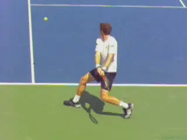

**Watch how the back leg stays behind the body and doesn't swing around
until the extension of the swing and the shoulder rotation are
complete.**

Learning open and neutral stance will actually facilitate this body
control. Open stance is great for players struggling to control the
momentum of their movement and to set up correctly. Or for players who
tend to reach for the ball or swing the recovery step around too soon.

Neutral stance is also great for positioning and also for working on
balance and staying upright during the forward swing. It's also good
for learning to feel how to keep the rear foot back and not taking a
recovery step too soon.

But once a player has the ability to finish the swing in the correct
sequence, it can be exciting to experiment and see what closed stance
can do. It's not necessarily to have a good backhand at the club level,
that's for sure.

But you may find that you feel increased leverage and velocity on your
two hander from learning how to increase your body turn and leg coiling
like top players. That can help raise the level of the stroke's
effectiveness.

Stay Tuned. Next we'll look at the one-handed stances on the men's
side.

John Yandell is widely acknowledged as one of the leading videographers
and students of the modern game of professional tennis. His high speed
filming for Advanced Tennis and TPA have provided new visual
resources that have changed the way the game is studied and understood
by both players and coaches. He has done personal video analysis for
hundreds of high level competitive players, including Justine
Henin-Hardenne, Taylor Dent and John McEnroe, among others.

In addition to his role as Editor of TPA he is the author of
the critically acclaimed book Visual Tennis. The John Yandell Tennis
School is located in San Francisco, California.
