# Roger Federer: Serve Part 2

# John Yandell 

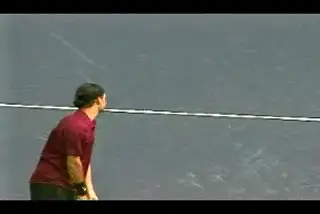

**Now let's look at the toss, body turn and leg action.**

In the first article on Roger Federer's serve we looked at his starting
stance, his wind up, his racket drop, and the path of the racket upward
to the ball. We concluded that in many aspects his serve was a better
model than more exotic motions we've examined in the past, for example,
Andy Roddick and Pete Sampras. ([link](John%20Yandell-Roger%20Federer%20Serve%20-%20Part1.docx).)

Let's keep going now and see what the high speed footage shows us about
some of the other key aspects in his motion. In this second article,
we'll take a look at Roger's tossing motion, how he positions the ball
at contact, and his speed/spin combinations. Then we'll look at his
torso rotation, his leg action and his followthrough. Again, the high
speed video shows that on these elements Federer is a beautiful
technical model for most severs.

**Toss and Ball Position**

One of the components that gives any serve its particular look and feel
is the shape and timing of the tossing motion. Roger's toss is actually
beautiful to watch. It's minimalistic and fluid. It creates a rhythm
that carries over into the rest of his serve.

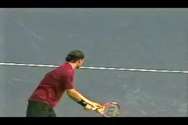

**Federer's toss: minimal and rhythmic.**

We saw that at the start of the motion, Federer's racket tip is
pointing basically straight ahead in the deuce court, and a little to
his right in the ad. His tossing arm is straight with the ball aligned
with the throat of the racket. This position makes the start of the
motion simple. His arms drop downward together. The tossing arm falls to
the inside of his front leg and is still straight when it reaches the
bottom Then the tossing arm moves immediately upward, deliberately but
without being rushed.

At the start of the upward motion the tossing arm is still straight, and
it stays that way all the way to the top. The release of the ball is a
little above shoulder level. The arm then continues upward until it
reaches full extension, pointing more or less directly upward at the
sky. There is no discreet moment when Federer "throws" or "tosses"
the ball.

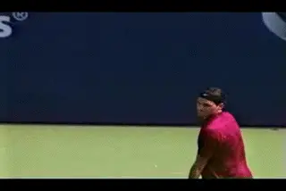

**Federer's tossing arm lifts the ball as he opens his hand.**

Take a close look at his hand and see how he holds the ball. Some
players hold the ball on the fingertips and this is commonly taught.
**[But Federer cups the ball partially in the palm of his hand.] [At the release, he simply opens his hand and the rising motion of the
arm lifts the toss upward into the air.]** This is
similar to Sampras, who holds the ball even more deeply in his palm.

**Tossing Arm Angle**

One of the most misunderstood aspects of the toss is the angle of the
tossing arm on its way up. I was always taught that the arm should move
straight down and then straight up, pointing forward at a right angle to
the net on the way up. I taught that way myself for a long while, until
I started filming the motions of top players. That's when I figured out
that's not the way the toss really happens.

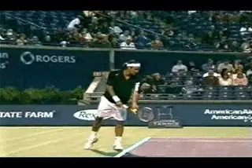

**His arm drops to the inside of his leg, then comes up pointing
sideways.**

To my amazement, when I started looking closely at the tossing motions
of the top players, I saw that on the way up the tossing arm did not
point straight forward at the net. **Instead the tossing arm pointed
more towards the sideline.** That's turned out to
be true of virtually every good server, including Roger. **At the time
of the release, his arm is approaching parallel to the baseline, at an
angle of maybe 15 or 20 degrees.**

**The Arc**

The purpose of the "straight down, straight up" tossing motion, I was
taught, was to release the ball so that it could travel directly upward
in front of the server. But video shows that this isn't how the ball
actually travels. **Rather than traveling straight upward, the toss
traveled on a curve. The actual path is on an arc moving from the
players's right to his left.**

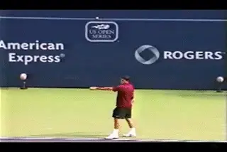

**Watch the movement of the toss from the player's right to left.**

This curved path is related to the position of the tossing arm. At the
time of the ball release, the tossing arm points sideways. If the ball
traveled straight upward it would end up so far to the right that the
player couldn't possibly create the correct contact point.

**Since the player releases the ball with his arm extended to his
right, the ball has to travel on a curve back toward the player to reach
the contact point.** The width of this arc for
Federer is about 2 feet. This is similar to all the other top players.
***So the contact point is actually an intersection of two objects
moving in different directions. The racket head moving upward and
somewhat to the players right, and the toss, moving to the players left
but also downward.***

**Toss Height**

**If we look at the arc of the toss we can see that it not only
travels from right to left, it also drops significantly before
contact.** Here is another common belief that is
still widely taught. "Hit the ball at the top of the toss." In
Federer's case the toss drops about 3 feet before contact. This is a
little more than Sampras and substantially less than Roddick.

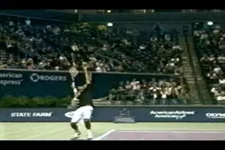

**From the top of the toss, the ball drops 3 feet or so to contact.**

All the top players hit the ball somewhere on the way down. No one in
the modern game hits the ball at the top of the toss, and very few ever
have. ([link](http://www.tennisplayer.net/members/avancedtennis/john_yandell/the_myth/the_myth_of_the_toss_images/the_myth_of_the_toss.html)
to read more about this). Roscoe Tanner is commonly pointed to as an
example of a top player who hit the ball at the top. He may be the only
one, unless you want to count Kevin Curren, the South African who was in
the top ten in 1980's. Goran Ivanisevic is sometimes cited as a modern
example of a player who hit the ball at the top, but that's not
actually true. As quick as his motion was, he still hit the ball several
inches on the way down. (Check it out for yourself in the Stroke
Archive. [link](http://www.tennisplayer.net/members/strokearchive/pro_men/goranivanisevic/goranivanisevic_strokecat.html).)
Among current top players, Roddick has one of the lower tosses, but it
still drops well over a foot before the contact.

**The Toss and Serving Rhythm**

**Why do top players toss above the contact point? It has to do with
timing and rhythm.**

***[The height of the toss determines the interval the player has to hit
the serve]***. **The higher the toss, the more total time. A
super low toss doesn't give most players enough time to move through
the technical positions of the motion, particularly if they have
significant body rotation or use the legs much in their motion. Players
with slower natural rhythms and longer backswings will also tend to add
time by raising the tossing height.**

***[For all the elements to work together and produce the most possible
racket head speed, the motion needs to be smooth and relaxed.]***
**Every player has his own rhythm and should find the toss height that
helps create that rhythm. The motion shouldn't feel rushed. It
shouldn't feel like it lags at any point either. The actual rhythm can
vary tremendously from player to player--from Andy Roddick to Nicolas
Kiefer and everything in between.**

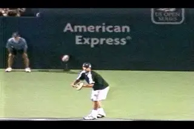

**Roddick and Kiefer: the range of toss heights in pro tennis.**

But doesn't a player like Kiefer with that stratospheric toss lose
racket head speed by waiting for the ball? Well, I've seen him play a
few times in person and he can crease 130mph on the radar gun, so I
doubt it. He doesn't really pause or wait at any point in his motion.
If you look at his serve, he has a very slow, deliberate windup, but he
makes it to the pro racket drop position with the rest of his body in
perfect position. From here his racket acceleration to the ball appears
to be very similar to other top players.

The 3 Dimensional studies that I have seen to date appears to show that
the racket head speed is actually fairly constant over the path of the
windup. Most of the acceleration occurs in the few fractions of a second
from the racket drop to the contact. This is why a higher toss and a
longer, slower backswing doesn't necessarily reduce racket head speed.

When commentators say that players with higher tosses will struggle more
in the wind, it seems they have a more valid point. But I recently saw
Kiefer serve very effectively during hurricane-like conditions in Las
Vegas. Let's just note again that virtually every great server in the
history of the game hits the ball on the way down, and some, like Ivan
Lendl, Boris Becker, and Steffi Graff have had ultra high tosses. If
there really was some huge advantage to the low toss, it would be a
commonality among top players. But it's the opposite. **All the top
players have high tosses, not low tosses.**

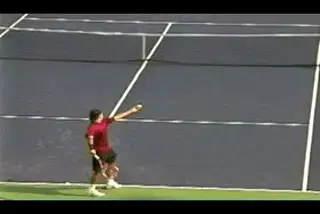

**How far the ball curves back toward the server is a key to the contact
point.**

**The Arc and the Contact Point**

When players toss the ball on that arc back toward them, the curve that
the ball follows determines the positioning of the contact point. The
exact left to right position of the ball at contact can vary from player
to player, from above the right edge of the player's head to the edge
of the shoulder. This in turn has an impact on the type of spin players
can produce. Players with a higher topspin component in their motion,
like Pete Sampras, tend to make contact slightly further to the
left--or closer to the edge of the head. Players with a larger sidespin
component make contact further to the right. ([link](http://www.tennisplayer.net/members/mystheavyball/john_yandell/heavy_serve_practical_implications/heavy_serve_practical_implications.html).)

Where does Roger fit in? Federer's contact point on the left to right
axis, appears to be slightly further to the right than Sampras, although
it is difficult to tell even in the high speed footage. The differences
are relatively small and the appearance can vary with the camera angle.
For example, I think I can see a light difference in the angle of the
shaft of the racket between Sampras and Federer in the stills below, but
if so it's a matter of a few degrees.

**[Federer's contact point is probably directly above his shoulder or
possibly a little to the left of that.]** Note that at contact
the ball is still inside or to the left of his hand. This the same for
Pete. So this means there is still a topspin component. You can see this
also by looking at the angle of the shaft of the racket, titled slightly
to his left. This indicates that the racket is still rising at contact.
The differences in this angle indicate the (relatively) small
differences in the amount of topspin the player can add to the total
ball rotation.

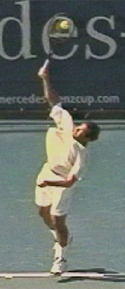

**Slight differences in the angle of the racket effect whether a player can hit\

topspin and how much.**

**If you look at many lower level players at contact, the tip of the
racket is pointing directly upward.** This is typical if the toss is
further to the right. From this position it is impossible to generate
topspin and the player can only hit sidespin. You actually see this
quite commonly in women's tennis. The toss and the contact point are
more to the right with the tip of the racket straight up and down, or
close to straight up and down at contact. Compare Lindsay Davenport and
Elena Dementieva to the two men's players on this point.

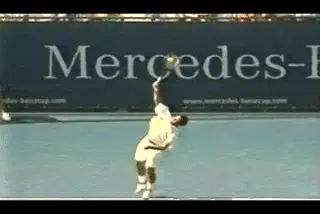

**Pete's racket moves more forward toward the net. Roger's moves
slightly more to the side.**

**Another clue to the ball position and the relationship between the
contact point and the amount of topspin is the path of the racket right
after the contact.** Again if we compare Pete and
Roger, the differences are easier to see in the few frames after
contact. Look at the angle of both players' arms relatively to the
baseline. Sampras's arm is pointing more forward, and less to the side
or his right. Federer's arm points a little less forward more and a
little more to the side.

As we saw in our heavy ball articles ([link](http://www.tennisplayer.net/members/mystheavyball/john_yandell/speed_and_spin/speed_and_spin.html)),
the racket face travels on a diagonal across the face of the ball. What
the video appears to show is that Pete's racket is traveling somewhat
more forward an upward. Roger's is traveling slightly more across the
ball. This is consistent with our theory of the ball placement on the
toss and aslo with our spin data on both players, as we will see below.
What the video also indicates is that ***the differences in the
amounts and types of spin are the result of relatively small adjustments
in the racket path and ball position. These are difficult to see with
the video, let alone the naked eye. But they can make a big difference
in the quality of the serve in terms of speed and
weight.***

A lot has been made of Sampras's tendency to bend the elbow soon after
contact, so that the hand and racket drop at an angle to the upper arm.
If we look at the difference in the path of the racket through the
contact, this makes sense. Because the swing is more directly forward,
and because he is so relaxed, the racket just naturally falls forward.
It's not something Pete is doing, it's something that is happening as
a natural consequence of the swing.

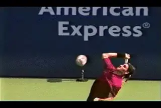

**Roger averages 2000rpm on his first serve.**

**Spin Values**

Our study of spin rates shows that Roger is generating around 2000rpm of
spin on his first serve. This compares to about 2500rpm for both Sampras
and Andy Roddick. So that's about 20% less total spin. If we look at
the topspin component in Roger's ball, it also appears to be slightly
less than Pete. Remember we saw in our heavy ball analysis that topspin
is the minority component in all serves. There is no such thing as a
pure topspin serve. It's a matter of the relative amount of topspin.
Pete's topspin component was around 35%. For Federer and Roddick it's
more like 25%. This is why slight differences in the angle and path of
the racket at contact can make a big difference in the "heaviness" of
the ball.

Pete has more topspin, his angle is a little steeper, the racket moves a
little more forward. But the angle in Federer's racket shows that he is
still hitting up at contact. **The beauty of it is that Federer's
ball position (or something close to it) and his motion through the
contact (or something close to it) are within the reach of most
players.** It's not that your total spin values
will equal Roger's, it's that with a similar ball position you will be
able to generate a significant topspin component on your own serve.

**Front to Back**

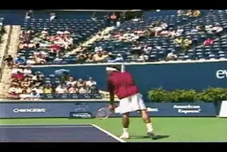

**The contact is just at the front edge of the body.**

There is one more important factor to consider in the placement of the
toss. ***This is the position of the ball on the front to back axis.
"Toss the ball in front of you for more power." That's another common
mantra in teaching. But if we look at Federer, or any top server, we see
that the contact point is barely in front of the body. If you draw a
line straight down from the ball toward the court, it's roughly even
with the edge of the player's face, or at most an inch or two further
in front.***

This makes perfect sense for a number or reasons. If the toss were
significantly further in front, the player would have to reach forward
with the racket. This would lower the contact point, decrease the margin
of error crossing the net, and also make it more difficult to create
topspin. There are other reasons the contact point is normally not as
far in the court as is generally believed, which we'll discuss below
when we discuss leg position.

**Body Rotation**

**We've seen that the top players extend their tossing arms to the
side and this affects the path of the toss. But why? What's the
advantage of pointing the arm across the body? The answer is that the
position of the tossing arm toward the sideline is related to the body
turn away from the ball. This turn determines the forward body rotation
in the motion. The stretch of the left arm across the body is actually
similar to what happens in the preparation phase of the forehand. It
creates and/or increases the shoulder turn and prepares the torso to
uncoil into the shot.**

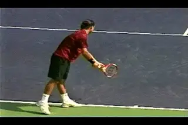

**Roger turns away from the ball around 60 degrees.**

When we look at Roger we can see that he has a substantial body turn.
***[So the more turn, the more the tossing arm is likely to point
sideways.]*** As we have seen previously, the amount of turn is
also related to the stance. Players naturally turn away from the net
along the line of the stance. Watch Roger. His shoulders start roughly
square to the net. As his tossing arm goes up, you can see his torso
turn away from the ball, rotating back about 60 degrees. ***[If you draw
a diagonal line across the tips of Roger's toes, and another one across
his shoulders, these lines will be roughly parallel.]*** Imagine
how awkward and restricted this move would appear if Roger was trying to
point his tossing arm straight ahead at the same time.

Roger's turn is greater than Roddick's, but less than Pete Sampras's.
And you can probably guess what I'm going to say next. His body turn is
more reasonable for the average player to try to develop, assuming the
basic elements of the swing are in place. It's reasonable, but you
should probably start with an even less extreme version than Federer.
You can do this by squaring the stance, or creating just a slight
offset, and starting with your shoulders perpendicular to the net. From
there you can gradually edge your rear foot behind you to your left.
This will automatically increase the turn by changing the line along the
edge of the toes.

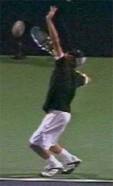

**More turn than Roddick, less than Sampras**

The point of turning away from the ball, obviously, is to increase the
amount of torso rotation forward into the hit. Watch Federer rotate into
the ball in both the deuce court and the ad court. You can almost feel
the extra energy that is going into the shot. The exact degrees of
rotation, as well as the speed of the torso rotation, the differences in
the angles of the hips and the shoulders, are all elements that
contribute to the motion, and ultimately to racket speed, ball speed,
and spin.

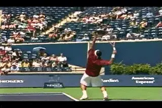

**The amount of forward rotation and the exact angle at contact are
natural consequences.**

Analyzing them precisely as well as their interrelationships is a
fascinating challenge that will undoubtedly increase our understanding
the serve's bio-mechanics. The method that will allow us to see these
factors more clearly--as with so many others factors in technique--is
quantitative analysis. This is the work of Brian Gordon, Bruce Elliot
and a few others, including TPA's own Greg Ryan. Working with
Advanced Tennis, Greg has done 3-dimensional studies that we plan to
report about on TPA.

The whole picture is very complex. But one belief about the torso
rotation that is definitely inaccurate is the idea that the hips and
shoulders should be open or parallel to the baseline at contact.
***Federer's shoulders and hips are at an angle to the baseline and
somewhat closed, and this is the same for other top players, as we have
seen in our analysis of Sampras and Roddick. We can also see that the
torso is more closed in the ad court than in the deuce, something that
makes sense when we consider the differences in path of the
ball.***

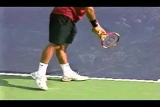

**Platform stance, deep knee bend, left foot landing.**

Should the average player strive to control his body rotation to match
Federer's angles? The interesting thing is that the torso tends to
rotate into contact naturally and automatically. If the player sets up
his stance and takes a relaxed backswing, the torso tends to naturally
turn away from the ball along the line of the stance. Once the turn is
complete, the rotation forward should just happen as an automatic part
of the motion as the racket drops and goes up to the ball and the legs
uncoil. Cause and effect again? Correct.

Sometimes you see players try to force the shoulders around and end up
too open at contact. This can happen when players try to serve wide in
the deuce court and intentionally rotate the shoulders trying to swing
the ball wide. This is also an issue with the pinpoint stance, in which
the motion of the back leg can set the torso in motion and cause it to
over rotate, or rotate too soon. Again, your goal should be to turn the
torso onto the line of the stance during the backswing. Now key on the
racket drop, the knee bend, the motion to the ball and the landing.
You'll find that your torso will uncoil into the shot without further
conscious effort.

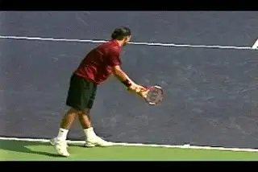

**As the arms drop Pete and Roger are standing with the weight evenly
distributed.**

**Leg Action**

A major commonality in the serves of good players is the use of the
legs--the deep knee bend and the front foot landing. This is another
topic I've addressed in detail both in the Sampras series ([link](http://www.tennisplayer.net/members/tour_strokes/tour_strokes.html))
and in the articles on the great myths in instruction ([link](http://www.tennisplayer.net/members/avancedtennis/john_yandell/the_myth/the_myth_of_the_pinpoint_stance_images/the_myth_of_the_pinpoint_stance.html).)
There are also examples in the Stroke Archive of virtually every top
server showing the knee bend, the uncoiling, and the left foot landing.
As I have argued before, I think the platform stance is ***probably
superior at the higher levels and is also much easier to master for the
majority of players.***

Federer is a great model here. The width of his feet in his stance is
moderate, somewhat narrower than Pete's. As the arms drop it's very
natural for him to bend his knees and drop his weight evenly between the
feet. Like Pete, Federer keeps a lot of weight back on the rear foot as
he knees go down. As his arm starts up and approaches the ball release,
it's almost if he is just standing straight up and down with his weight
balanced equally on each foot.

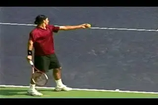

**Great balance and posture at the deepest point in the knee bend.**

This leads naturally into the full knee bend in a platform hitting
stance. As the ball releases, Federer shifts more weight forward and his
knees start to go down. The knee bend is quite deep, with his upper leg
at a 30 degree angle or more to his lower leg. This is the same or maybe
a little less than Sampras but more than some other great servers such
as Rusedski whose knee bends are limited by the pinpoint stance.

Look at Roger's balance at the deepest point of the bend. His weight
has shifted forward but it definitely not completely on the front foot.
His posture is still great He just looks balanced and strong. As we saw
in the Sampras articles, the alleged "arch" of the back in this part
of the motion is an illusion. As his knee bend deepens, the torso just
naturally inclines backwards at an angle. But look how the hips and
shoulders stay in line. Note also that the completion of the knee bend
coincides quite closely with the point of maximum body turn away from
the ball.

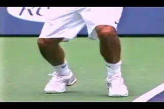

**The leg drive from the front foot creates air.**

As the racket drops, the weight shift continues onto the front foot.
Roger comes up on his back toes, and then his rear foot leaves the
court. As we saw in our analysis of the stances, ***the majority of
the push or drive in a platform stance is coming from the front leg. The
rear foot is literally being pulled off the
court.*** The leg drive off this front foot is very
powerful. Look how far he explodes upward. That is definitely a lot of
air. It is significantly more than Roddick or Pete, this is with the
same or less knee bend. We noted that Roger's racket drop isn't quite
as deep as these players, but he may be making up for it partially
through the explosiveness of his legs.

**[Like virtually every top player, Federer lands on his left front
foot.]** Watch how he actually lands partially on the baseline,
although on other balls he may land a few inches inside the court. More
on this below. As he lands, his right leg kicks back in the other
direction. The lower leg comes up until it is at about parallel to the
court or a little higher. Here, once again Roger takes the middle path.
His kick back with the opposite leg is a little more than Sampras but
less than Roddick.

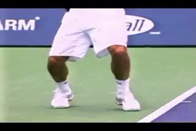

**The front foot landing with the back leg kicking back.**

**Landing**

As he gets up into the air look how beautifully he retains his posture!
**He is still almost completely straight up and down with his body in
line from the tips of his shoes to the tip of his racket. It looks like
he is defying gravity because he lifts off the court so
easily.**

Now watch Roger's incredible balance on his landing. Far and away Roger
lands with the best posture of any of the top pros. Every player lands
leaning forward to a certain extent, including Roger. But Roger is the
closest to truly straight up and down. **Body position and balance is
critical on the landing is because of the speed of the ball in the
modern game.** **The server hits a 130mph first
serve and lands inside the court with one foot in the air. The returner
rockets a 95mph return. How quickly can the server recover in order to
hit the first ground stroke in the rally?**

We saw above that Roger lands at most a few inches inside the court or
even with his heel still on the baseline. ***He's almost completely
upright which allows him to recover his balance, split, and better ready
for the first ball.***

What about that landing when it comes to the serve and volley? Isn't
one of the basic precepts of serving to drive your weight into the ball
and land as far forward into the court as possible to get to the net
more quickly? I heard that a lot as a junior player. A tour player I
know recently went to work on his serve and volley with a coach who was
a former top 10 player in the world. The coach advised him to try get
further into the court both at contact and at the landing, so he could
get closer to the net. Out of curiosity I pulled some video of the coach
in a pro tournament match and found that he himself landed only a few
inches inside the line.

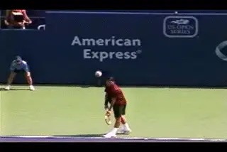

**A balanced landing means that Roger is ready to play.**

If you look at Sampras, or Rusedski, you'll see the same. ***In the
modern game, when the player's serve and volley they land on the front
foot, take 1 or occasionally 2 more steps, then split step for the first
volley. That's what puts the premium on the
landing.*** You've probably heard that you should
try to reach the service line to hit the first ball. But in pro tennis
that doesn't happen. The top players are all hitting the first volley
roughly half way between the baseline and service line. Ironically. a
player like Roddick who never serves and volleys usually lands more
inside the court--and more off **balance--than players like Federer or
Sampras.**

**Followthrough**

Finally, let's take a look at the followthrough on Roger's motion.
Again it's a great model because it is so natural, fluid, and relaxed.
Watch how his arm continues to flow after the completion of the
pronation, moving forward and then from the right back to the left. His
racket hand passes in front of his left leg and then actually continues
to move across his left side and upwards and behind him to about waist
level. At that point Roger catches the racket with his left hand to
begin his recovery to the ready position.

When Pete Sampras was at the top, a lot of players and coaches made a
big deal out of the fact that at least on some serves, Pete seemed to
finish on the right side of his body. That was actually quite rare, but
it was true that his finish was shorter than most players, and that his
racket hand tended to end up in line with his right leg, not his left. A
lot of players tried to copy that right side finish without having the
other elements that actually made it happen. These include an extreme
left ball position, and the racket motion more directly forward and
outward toward the net and less from left to right.

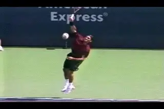

**A full, flowing followthrough is definitely something to model.**

That finish is the exact opposite of Roger. Remember what we saw about
Roger's ball position? His arm and racket move more from left to right.
Because he is so relaxed his arm just naturally swings back across his
body to the left. The followthrough is one more thing we can all learn
from Roger. Most players are too tight all the way through the motion,
including the finish. But it would be impossible to stay tense and make
that finish position.

So that takes us all the way through Roger's service motion. It may not
be as flashy as Andy Roddick. But you could certainly argue that it is
as effective or more effective as part of his incredible all court game.
That's a game we can all aspire to play at some level to a greater or
lesser extent. And the serve is a good place to start.

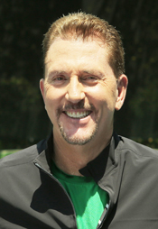

John Yandell is widely acknowledged as one of the leading videographers
and students of the modern game of professional tennis. His high speed
filming for Advanced Tennis and TPA have provided new visual
resources that have changed the way the game is studied and understood
by both players and coaches. He has done personal video analysis for
hundreds of high level competitive players, including Justine
Henin-Hardenne, Taylor Dent and John McEnroe, among others.

In addition to his role as Editor of TPA he is the author of
the critically acclaimed book Visual Tennis. The John Yandell Tennis
School is located in San Francisco, California.

---

<!-- prevnext-nav -->
[← Part 1](john-yandell-roger-federer-serve-part1.md)  |  [Advanced Tennis Index](index.md)  |  [The Upward Swing →](john-yandell-roger-federer-serve-the-upward-swing.md)
