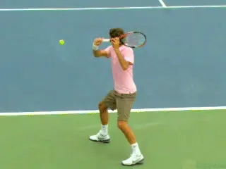
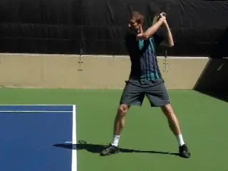
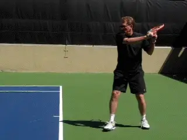
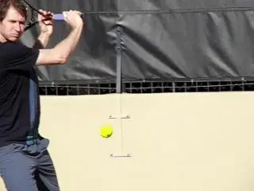
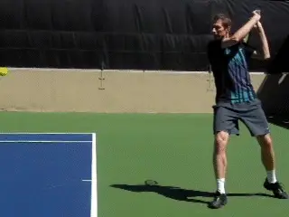
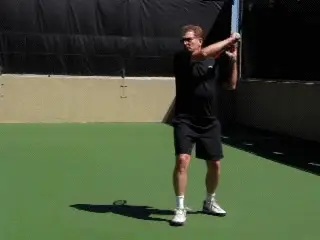
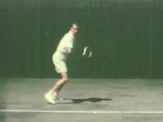

# The Pro Slice and Your Slice

# John Yandell

**The pro slice-necessary to deal with modern speed and spin?**

What would it be like to try to hit slice backhands against pro level
topspin? How would that affect your technique - not to mention your
psychological state of mind?

In the first article in this series, we saw the phenomenal levels of
underspin the top pros generate on their slice backhands, ranging up to
over 5000rpm, and averaging around 3500rpm. That makes the slice the
fastest spinning shot in the pro game. ([link](John%20Yandell-The%20Pro%20Slice-Spin%20Levels.docx).)

In the second article, we looked at how that spin is generated by
breaking down the stroke into technical components. We saw the amazing
wrap around backswings, the radically downward forward swings, the
shoulder high contact points, and the seemingly abrubt, sideways
direction change after contact with the across the body finishes.
([link](John%20Yandell-The%20Pro%20Slice-Stroke%20Components.docx).)

One of the open questions in teaching and playing is whether all those
technical elements are really necessary in the pro game. Or is it
possible, even in the modern game, to hit a flatter slice with a less
radical swing pattern--more on the model of Jack Kramer or Ken
Rosewall?

**Giancarlo's pro-style slice: ultra high wrap around backswing,
radical downward swing, racket tip ending below wrist, finish across the
body.**

For this article Giancarlo Andreani, our incredible video editor, and I
decided to experiment with that question. Giancarlo's slice is hit
pretty much dead on the pro model, with a wrap around backswing and a
downward swing that finishes across his body.

He played Division 1 college tennis, has been ranked in the Open
Division in Northern California, and played on USTA teams at the 5.0 and
5.5 level that have competed for national titles.

I learned to hit my slice in the 1960s with a wooden racket more on the
Rosewall model. So my backswing is more compact and the swing plane is
flatter than Giancarlo's. It was good enough to help me win two Norcal
4.5 singles tournaments 10 years apart (that was 7 matches in 9 days in
each one, thank you) and reach a top 20 ranking in both the 5.5 and
senior divisions.

So we wanted to see how our contrasting styles and levels of play worked
against pro levels of topspin. The answers we developed are far from
definitive. But I think they are interesting and suggestive and may help
you evaluate the kind of technical swing you want to develop for
yourself at your level.

**The Set Up**

Using our Ace Attack Ball Machine, we simulated topspin forehand at two
levels. ([link](http://www.sportsattack.com/tennis-machine/) for
more info on this amazing piece of equipment.) First we picked a ball
speed that we thought was equivalent to 5.0 pace in USTA competition in
Northern California.

We gave the ball enough topspin to jump off the court and a trajectory
that created contact heights between waist and chest levels. Then we
both tried to hit slice drives with as much pace as we could and still
keep the ball in the court.

**A slice from the 60's: backswing at shoulder level, a flatter swing
plane, more extension, and a higher finish with the racket tip above the
wrist.**

Interestingly either technical style worked fine on this ball. Giancarlo
definitely was creating more underspin, and some of his balls were
bouncing just inches off the court surface on the other side. My ball
was bouncing somewhat higher, but was still low.

The video shows the technical differences. Giancarlo's backswing is
like Federer's. His hand reaches the top of his head with his elbow
bent 90 degrees or maybe more, and the face of his racket is actually on
edge or perpendicular to the court.

In my backswing my racket hand reaches only about shoulder level. The
racket doesn't go nearly as far back, the elbow is bent less, and the
racket face is close to parallel to the court rather than turned on
edge.

In the forward swing, Giancarlo's racket tip comes all the way down
close to the top of his socks. As we saw with Federer and Nadal, the
racket is way below wrist level, and most often stays that way all the
way through the swing. In comparison, my racket tip stays at about waist
level with the racket tip still above my wrist.

Giancarlo's finish extends less distance outward to the target, is much
lower with his hand just above waist level, and crosses much further to
his left side. These are all the characteristics of the pro slice.

**Giancarlo's pro slice: translating 3500rpm of topspin off the court
into 3500rpm of underspin off the racket.**

My finish is extended more forward, is significantly higher, and crosses
much less to my left side. So yes, more of a classic slice drive.

**Pro Spin**

The second half of the experiment was to take the speed, spin, and
bounce height of the ball up closer to actual pro level, and see what
happened then both in terms of the type of ball we could both produce,
and in terms of the shapes of the swing.

We know from our high speed cameras studies that in the pro game, a
forehand drive typically comes off the court with about 3500rpm of
topspin. Using the Ace Attack, we were able to match that spin level.

We also gave the ball a higher trajectory with a higher launch point
than in the first experiment. This, in conjunction with the spin, caused
the ball to bounce higher with a contact point that was around shoulder
level.

So what happened then? For Giancarlo, the change in the ball didn't
create any real problems. In fact, his technical motion looked extremely
similar.

**When we cranked up the incoming ball and the contact height,
Giancarlo's swing stayed exactly the same.**

The same high wrap around backswing. The same downward swing pattern.
And the same finish, low and across the body with the racket tip still
below the hand.

The only difference was that on the super high balls, his extension
forward was somewhat reduced, so there was also probably some increase
in the sharpness of the downward swing angle.

He was producing some major underspin and again was able to control the
ball and generate low skidding bounces. Using the high speed camera in
we measured his out going spin and found it was in virtually the same
range as Federer and Nadal at around 3500rpm.

For me, the change initially caused major problems. I was sailing a lot
of balls long and floating some that went in much higher than in the
first scenario. I felt that I couldn't really take control of the ball
and make it do want I wanted. I felt I needed more racket speed - a lot
more.

So I started swinging faster. After hitting a few dozens balls, things
started to get better, and I was able to produce controlled shots on at
least some of the attempts.

**To gain some control I naturally raised my backswing and increased
the downward swing - but some classic elements
remained.**

What was interesting though was what this adjustment naturally did to my
technical swing pattern. I was not conscious of the changes, but the
video showed that on the pro level ball my motion had morphed somewhat
in the direction of Ginacarlo's.

My backswing was higher, reaching eye level. I was also rotating the
plane of the racket closer to on edge. My finish was also lower and
further across.

However my racket head didn't move as radically down as in the pro
model, and the tip stayed at around wrist level. Which may explain the
differences in spin levels. My shots had about a third less spin than
Giancarlo's, coming in at around 2400rpm.

Which probably explains the quality of the balls I was producing. I
simply wasn't able hit the same type of slice drives. The difference in
the pace between my ball and Giancarlo's was also much more pronounced
than in the first experiment.

**Conclusions?**

So those were interesting experiments. Based on our limited experience,
it does appear that there is a correlation between the speed and spin in
the modern game and the way technique has evolved on the slice backhand.

It may well be that the exaggerated backswings and sharp downward shape
of the forward swings are necessary to deal with the weight and height
of the pro ball.

And there is one more caveat that probably adds additional weight to
that hypothesis. Although I believe we simulated the spin and the
trajectory of the pro forehand quite accurately, we probably didn't
match the speed.

**Too bad we didn't have Jack Kramer to do the experiment with
Giancarlo and me.**

By timing the duration of the flight of the ball between the baselines
we estimated that the speed of our simulated forehands was probably only
about 80% of the actual tour velocities. If so then the difficulty of
hitting through the ball with an older style slice drive is probably
even greater.

Of course we didn't have Rosewall or Budge or Kramer out there for our
test, and it's obviously true that world class players could generate
significantly more racket head speed than I did in our tests.

Going back to the previous article we saw that on lower balls players
such as Novak Djokovic used swings that were closer to the classic
model. But that may actually reinforce the ideas that when the ball is
really high, hitting a slice on a 90mph forehand spinning at 3500rpm
requires more radical technique.

I tend to think that's true. But I'm not convinced that on many balls
in the pro game, players couldn't also drive more directly through if
they wished to or adapted their swings.

And then there is the converse point, for the rest of the world. What
happens in club tennis when players pattern their slice backhands on the
pros just for the sake of patterning them on the pros?

I think in many cases club players are hitting more underspin than they
actually may need, sacrificing pace, and adding difficulty and
complexity to the swing pattern that can produce inconsistency.

At that level I think the more traditional slice drives can still be a
very effective weapon in rallies, on approaches, and even in situations
like passing shots where players just assume heavy topspin is required.
Those are my thoughts, but what are yours - let us know in the Forum.

John Yandell is widely acknowledged as one of the leading videographers
and students of the modern game of professional tennis. His high speed
filming for Advanced Tennis and TPA have provided new visual
resources that have changed the way the game is studied and understood
by both players and coaches. He has done personal video analysis for
hundreds of high level competitive players, including Justine
Henin-Hardenne, Taylor Dent and John McEnroe, among others.

In addition to his role as Editor of TPA he is the author of
the critically acclaimed book Visual Tennis. The John Yandell Tennis
School is located in San Francisco, California.
