# The Pro Slice - Stroke Components

# John Yandell

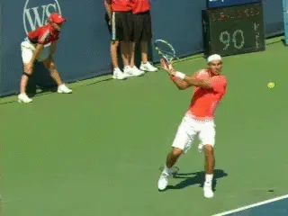

**The pro backhand slice - more spin than the fiercest forehands.**

In the first article in this series, we looked at the astounding levels
of spin on the pro slice backhand. We determined that slice backhands
were actually spinning as fast, and usually faster, than even the
fiercest topspin forehands. ([link](John%20Yandell-The%20Pro%20Slice-Spin%20Levels.docx).)

Looking at dozens of examples, we found Federer and Nadal both averaged
over 3500rpm. This is an even higher average spin rate than Nadal's
topspin forehand, which is 3200rpm. It's substantially higher than the
forehands of either Federer or Djokovic which are in the 2700-2800rpm
range.

In fact we measured one Federer slice backhand that equaled the fastest
spinning Pete Sampras second serve ever recorded - about 5300rpm. We
also noted that Novak Djokovic, although he still generated substantial
spin, hit his slice backhands with significantly less rotation than
Federer and Nadal, averaging 2800rpm, virtually the same as his
forehand.

Which all leads to the next question - **[how does this spin happen?
Let's break down the pro slice backhand into its technical
components.]** Let's see how Roger and Rafa do it, what
Novak does, and how they are all similar and different.

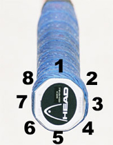

The relationships between the racket bevels, the heel pad and the index
knuckle determines the grip.

**Grip**

Grip for the slice can be a controversial issue, similar to what we saw
in discussing the volleys ([link](The%20Forehand%20Volley.docx)).
Let's use our trusty grip system again to see how this works.

This system lays out the 8 bevels of the racket handle, and the two key
points that connect the hand to the bevels. It's been widely copied by
our competitors, so if you see it somewhere else, remember, it was
(another) TPA first.

Some coaches prefer a relatively strong grip for the slice backhand,
with the heel pad on top of the frame and the index knuckle on the next
bevel down. This would be a 2 / 1 in TPA terminology. This is
what I personally would call an eastern backhand grip.

But in looking at the video of the three top players in the world, I
think they all are a little shy of this position. Each is somewhere on
the spectrum between the eastern backhand and what I call continental,
which shifts everything a half a bevel toward the forehand. Again, in
TPA terminology, what I think of as a continental would be a 2
1/2 - 1 1/2.

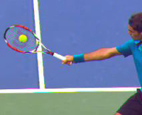

**Federer has his index knuckle close to the center of bevel 2 and much
but not all of his heel pad on top of the frame on bevel 1.**

It's important to note that many coaches will use these same names to
describe slightly different grips, and this is true for some of our
great contributors. And who knows, maybe their terms are better than
mine.

But if you encounter this, don't let it confuse you. Remember it's not
the name assigned to the grip, it's the grip itself and how the hand
connects with the racket that really matters.

Federer probably has the strongest grip of the three. His index knuckle
appears to be near the center of bevel 2, close to an eastern backhand,
but probably shifted slightly down.

The heel pad of his hand is mainly, but not completely, on top of the
frame on bevel 1.

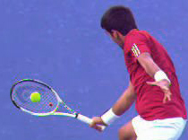

**Novak is a little weaker probably than Federer, with both his heel pad
and his knuckle shifted a little more downward toward the forehand.**

If you look from the rear view, you can see how the heel pad is shifted
a little bit downward. You can tell this because the top of the handle
is partially visible instead of completely covered by his hand. The heel
pad is mainly on bevel 1 but partially on bevel 2.

Djokovic's grip is pretty close to the same as Roger's, but I think
just slightly weaker. His index knuckle also appears to be mostly on
bevel 2 but shifted a little further down. From the rear view, you can
also see a little more of the top of the handle than with Roger, so the
heel pad is shifted down a little more toward bevel 2.

Compared toFederer or Djokovic, Nadal's grip is significantly weaker.
To me it appears that his index knuckle is on the edge between bevels 2
and 3. His heel pad appears to be partially on top but mostly on bevel
2. So Nadal's grip is shifted a little more to the forehand than even
what I call the continental in TPA terminology.

As with grips on all the strokes, these are just my best estimates based
on looking at high speed footage from multiple angles. It's very
difficult to be precise, and things look different sometimes from
different views.

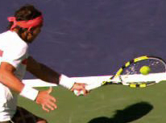

**Rafa has the slice grip shifted most toward the forehand. His knuckle
seems to be on the edge between bevels 2 and 3. Part of his heel pad is
on top of the handle, but it appears mostly on bevel 2.**

But it's the best we can do without asking the players to let me on
court to film them at close range in a tour match, which is unlikely to
happen. (Hey, maybe in practice someday, who knows?)

Also, telling the differences on the slice grips is particularly tricky
because they are typically less than the other groundstrokes. In fact,
as we'll see below, one of the best clues to understanding grips on the
slice is not to look at the hands, but rather the contact points.

So we can always evolve this discussion. And if you have other images or
a different viewpoint on the exact hand positions, let us know and post
them in the Forum.

Still, if we assume that my estimates are in the ball park, the next
question is this: how do the players establish them? And the answer is
in different ways.

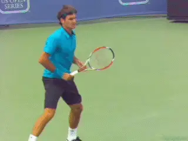

**A range of grips in the ready position before the shift for the slice
during the unit turn.**

Our three players all have different grips in the ready position and so
make different degrees of grip shift to get to the slice. Federer and
Djokovic appear to wait with intermediate grips, but Nadal is much
closer to his under the handle forehand grip in the ready position.

Federer's intermediate grip is shifted the more toward the top of the
frame than Novak, with his knuckle already on the edge between bevel 2
and 3. That makes sense given his modified eastern forehand grip.

Compared to Federer, Nadal waits with his hand still under the handle.
This may explain help explain why he doesn't shift as far on top as
Federer or Djokovic, since he has further to go.

Interestingly, Djokovic's forehand grip is as extreme as Nadal's. But
he waits in a position that is much closer to Federer, something like an
eastern forehand grip with the index knuckle on bevel 3. This may help
explain why even with his extreme forehand his slice grip is closer to
Roger's. ([link](John%20Yandell-Novak%20Djokovic's%20Forehand-A%20new%20Synthesis.docx)
for more on Djokovic's forehand grip and his forehand in general.)

It's got to be easier to make all the grip shifts, to the forehand,
backhand, slice, volley--from some position closer to the middle, and
probably the majority of the players do this. But, on the other hand,
Nadal makes his slice work with the less extreme grip. You wonder though
if it's truly a grip by choice, and if his starting position limits him
in how far he feels he can go.

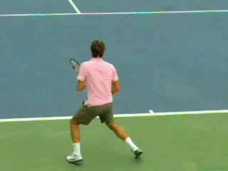

**A great checkpoint: shoulders square to net at the ball bounce.**

**Shift to Slice**

**[Regardless of the starting position, the players all start to shift
to their slice grips during the start of the motion. This is what we
call the unit turn, the sideways turning of the torso and
feet.]**

As with the other groundstrokes, the unit turn on the slice can start
with a wide variety of step combinations. ([link](John%20Yandell-Novak%20Djokovic's%20Forehand-Start%20of%20the%20Preparation.docx).)
Unlike the other groundies, on the slice the players also start to raise
their hands and racket upward. This makes sense when we see how high the
racket eventually reaches at the top of the backswing.

After this initial unit turn, as with the other groundstrokes, the
shoulders and the rest of the torso continue to rotate. At about the
time of the bounce on the court, the line of the shoulders reaches 90
degrees to the net or a little more. This is a good checkpoint for the
timing of the preparation.

But the shoulders continue to turn significantly further after the
bounce, going up to another 30 degrees or so when they are fully turned.
This is similar to the one-handed topspin backhand. ([link](The%20One%20Handed%20Topspin%20Backhand.docx).)

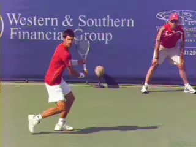

**The line of the stance and the line of the shoulders are parallel,
allowing more turn and forward rotation.**

**Stance**

The use of stances is also similar on the slice and the one-handed
backhand drive. Like the topspin drive, the slice can hit from a neutral
or even an open stance, but the majority of slices in pro tennis are hit
with a closed stance, with the player stepping forward and across the
body on a diagonal of about 30 to 45 degrees or even more.

The explanation for the closed stance on the slice is the same as for
topspin drive and is related to the shoulder turn. If you draw a line
across the tips of the feet, you'll see that it is roughly parallel to
a line across the shoulders. The shoulders turn 30 to 45 degrees past
perpendicular to the net, and the line across the feet is parallel and
along this same angle. ([link](The%20One%20Handed%20Topspin%20Backhand.docx).)

**Although players have less total body rotation on the one-hander
than the two-hander or the forehand, the closed stance and the line of
the torso nevertheless allows them to create significant forward hip and
shoulder rotation going into the contact.** If you
look at the line of the shoulders at contact, you see that they have
rotated 30 or 45 degrees from the full turn and are either sideways to
the net or slightly open.

**Backswing**

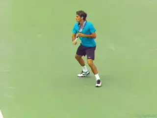

**The extreme wrap at the top of the backswing.**

When we look at the backswing, we start to understand how the amazingly
high levels of spin are generated on the pro slice. Looking first at
Federer and Nadal, we see the racket hand can reach eye level or even
higher. However, the precise height appears to vary depending on the
height, speed, and spin of the oncoming ball, and the amount of spin the
player is trying to hit.

Both Nadal and Federer often wrap the hitting arm almost completely
around the body at the top of the backswing. At maximum wrap, the elbow
can be 90 degrees.

The tip of the racket at this point actually crosses behind the
player's body. In the extreme case, the shaft of the racket is parallel
with the baseline, with the tip of the racket pointing perpendicular to
the sideline.

As with the height of the backswing, the exact amount of this wrap
around the body varies with the ball and the shot intention. In general
Federer tends to have the most wrap at the top of the backswing. Nadal
appears to have slightly less on most balls, although he definitely
reaches the extreme position with the shaft of the racket parallel to
the baseline in some examples.

**Djokovic**

When we look at Djokovic, we see something far less extreme. Novak
rarely raises his hand above the top of his shoulder, and typically his
hand reaches about the mid chest area, although it is sometimes lower as
well.

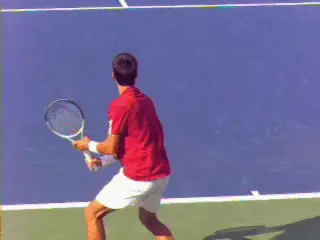

**Novak: less extreme backswing, lower contact points.**

His wrap around his torso in the backswing is also less than Federer and
Nadal. The tip of his racket rarely crosses behind his body. The angle
of the shaft of his racket to the baseline is also much less, more like
30 or 45 degrees.

This difference seems to be at least partially related to contact
height. **[Both Roger and Rafa often answer high topspin with slice.
This means that on some balls they make contact at shoulder level or
even slightly above, and many are at the mid chest level.]**

**[Djokovic on the other hand hits slice predominantly on lower balls,
waist level or a little higher at the highest.]** He seems more
likely to answer slice with slice than to try to use slice to neutralize
topspin. This is certainly consistent with his lower spin rate averages.

**Hitting Arm Structure**

So the top pro players have significant variations in the size of the
backswing and start the forward swing from different positions and
heights on different balls. But there is one key element in the forward
swing all three of our players share.

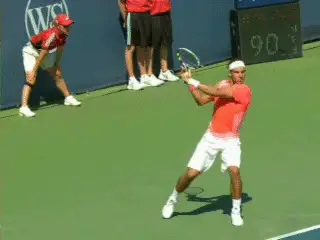

**The hitting arm structure is straight on the pro slice--and all good
slice backhands.**

***[This is the shape of the hitting arm prior to contact. It's
straight.]*** This straight arm hitting structure is critical,
just as we saw on the topspin backhand.

There are differences however in when the players reach this position.
Nadal gets his arm straight very quickly just at the start of the
forward swing. Federer is later, closer to contact. And, once again,
Djokovic is in between.

These are fractional differences in the timing, but the point is that
**they set the straight arm up well before contact and maintain this
position throughout the forward swing and well into the
followthrough.**

As the video shows, the elbow begins to relax and bend again only when
the players reach the recovery phase, with the racket moving backwards
away from the player.

This straight arm position is critical for an effective slice, and this
is especially true in club level tennis. Many players copy the extreme
wrap backswings of the pros, even when the ball is low.
**Unfortunately they miss the much more vital straight arm element and
come through contact with the arm bent, leading with the
elbow.**

**This leads to late contact, loss of power, lack of control, and
also, the inability to hit crosscourt. And maybe, tennis
elbow.** Other than that, it's not a problem.

For the club player I highly recommend two other great articles that
talk about the key elements on the slice and the arm postion, the first
by Scott Murphy ([link](https://www.tennisplayer.net/members/classiclessons/scott_murphy/scott_murphy_backhand_slice_images/scott_murphy_backhand_slice.html))
and the other by Trey Waltke ([link](https://www.tennisplayer.net/members/classiclessons/trey_waltke/the_slice_backhand/the_slice_backhand.html)).

**Swing Plane**

The most important step in understanding how the players are generating
3000plus rpm of spin on the slice backhand is to look at the swing plane
to the contact. We all know the clichés: **"swing low to high for
topspin and high to low for slice."** What is
stunning though is just how steep the downward plane of the swing
actually is in the pro slice.

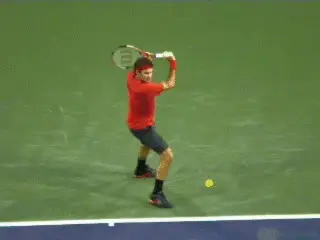

**Watch the front shoulder muscles bring the arm forward and down to
contact.**

Let's see how the players come out of the wrap around backswing and
start the racket down to the ball. Then let's follow the path of the
racket to the contact, see how far the swing continues down, then see
what happens in the followthrough.

We've already seen that at the start of the swing, the torso starts to
rotate forward and around, going from the closed position in line with
the stance to roughly sideways at contact. Obviously this rotation is
contributing somewhat to the motion toward contact.

**[But most of the downward and forward movement of the hitting arm
comes from the front shoulder.]** Watch how the players use the
front shoulder muscles. The hitting arm and racket are something like a
gate on the hinge of the shoulder. This movement from the shoulder is
what brings the hitting arm structure around, forward and down.

Notice as this happens how the elbow starts to straighten out. **[A
common mistake here at the club level is to pull the elbow forward as
the hitting arm is coming down. This makes achieving the straight arm
hitting position impossible.]**

It also causes the front shoulder to over rotate. The end result is late
contact with the hitting arm still bent. That's a recipe for a bad
slice and maybe tennis elbow. So let's just say it's a good idea to
get the hitting arm straight as soon as possible, closer to the timing
of Nadal on this critical element.

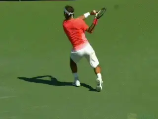

**The swing plane can be downward on a 50 degree angle.**

**Downward Angle**

Now let's look at that amazing downward angle. As the forward swing
starts, the racket hand comes down and around and aligning the racket
head behind the ball as it moves to the contact. What is amazing here is
how steep this downward motion actually is.

As usual, I'd love some 3D data from Brian Gordon that would make this
analysis more scientific, but some rough measurements off the high speed
video show the racket appears to be moving downward on angle of around
50 degrees.

Compare that with what we know about topspin. It is commonly accepted
that to create topspin on the forehand the racket needs to travel upward
on about a 30 degree angle. So the downward angle on the slice is much
steeper. And that makes sense since we already seen that the spin levels
are generally higher.

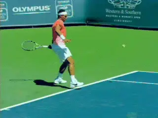

**The pro slice swing plane approximates Nadal's forehand.**

Interestingly, the swing plane on the slice is roughly the same angle as
on Nadal's most extreme forehands with the over the head finishes
(though moving in the other direction). Again, according to my very
rough measurements, that swing plane angle is around 50 degrees.
Whatever the precise measurements, it's obvioius the swing is radically
high to low.

**Sideways Component**

But there is another radical element, that is as surprising, maybe more
surprising. **[And this is the sideways motion in the swing.]**

Watch how far to the player's right the racket moves after contact (to
the left obviously for Nadal.) The swing actually appears to make
something like a 90 degree turn.

Watch how after contact the hitting arm can end up actually pointing at
the sideline! Do you think this means that there is significant sidespin
on the pro slice?

That has got to be the case. It's something like the windshield wiper
where most of the sideways movement occurs after contact. But the
sideways motion is starts, changing the angle of the racket path
slightly contact. We can see this in the path the ball takes through the
air, and the sideways movement we often see at the bounce.

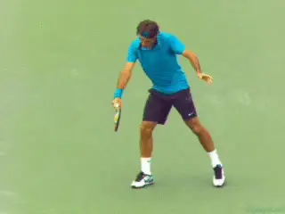

**Watch the arm and racket make a 90 degree turn after contact.**

What percentage is underspin and what percentage is sidespin in the pro
slice? That is going to have to await further analysis, but we can
imagine that on a slice backhand spinning at 3500rpm, the sidespin
component is significant, I'm thinking sometimes as much as 30
percent - similar to the maximum topspin component in a spin serve.
([link](https://www.tennisplayer.net/members/mystheavyball/john_yandell/speed_and_spin/speed_and_spin.html).)

The slice swing path - radically downward and radically sideways at the
same time--helps explain one aspect that appears quite odd when you
study the pro slice in super slow motion. This is the position of the
racket tip relative to the racket hand as the player moves into the
followthrough.

On a more classical slice drive, the racket tip finishes above the hand,
typically pointing up toward the sky at 30 to 45 degrees. You do see
this finish in the modern pro game, but only on a certain percentage of
balls.

On a large percentage of all pro slice backhands, the racket tip
actually points directly downward at the court all the way into the
followthrough. **[This means the shaft of the racket is literally at a
90 degree angle to the court surface.]**

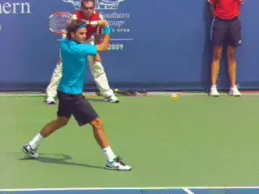

**With the extreme downward swing, the racket tip and finish pointing at
the court.**

This racket angle doesn't seem to be some independent technical element
that the players can vary. It appears to be an inherent component of the
path of the swing.

Because this position is so radical, the racket tip stays below the
level of the racket hand. Sometimes it is pointing at literally the same
angle at the end of the followthrough as at the contact.

**Novak**

They may be common, but these radical elements don't happen for all pro
players on all balls. When we compare Novak to Roger and Rafa, we see
that, as with the backswing, this effect is less frequent and less
extreme in Novak's slice backhand.

His racket and hand generally starts to the ball from a lower position,
and the angle of the downward swing appears substantially less. If we
look at his racket tip, we also see that it frequently finishes in the
traditional position, above the hand and pointing upward.

But again, an important caveat here is the average contact height for
Djokovic is much lower. This may explain why his swing shape is
different. Or his swing shape may explain why he doesn't hit as much
slice on higher balls.

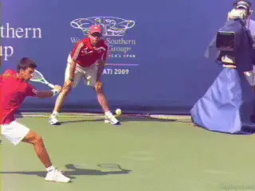

**A lower backswing and a more conventional finish with the racket tip
above the hand.**

**Contact**

When we look at the player's from the side view at contact, we can see
substantial differences in the three players. Also we can see a direct
relationship between the contact point and the players' grips.

In fact it's probably easier to discern the relative strength of the
grips by looking at the contact than by looking at the hands. The
stronger the grip the earlier the contact.

So Roger who has more of his hand on top of the handle makes contact
further in front than either Rafa or Novak. You can see this in the
amount of space between the hitting arm and the torso and front leg.

Rafa, with the weakest grip, makes contact the furthest back, barely at
the front edge of the leg. Novak is in between on the grip, and in
between on the contact as well, although closer to Roger than Nadal.

The important point here for all players is that there is no absolute
right contact point on the slice backhand. It's primarily grip
dependent, just as on the one-handed topspin drive. What would therefore
be late for one player with one grip can on time for another. So the
images of these players at contact can serve as models only after they
understand their own grip structure.

**Angle of the Racket Face**

Another disputed point in hitting and teaching the slice is the actual
angle of the racket face at contact. I have heard experts insist that
the racket face must be perpendicular to the court surface at contact to
create slice.

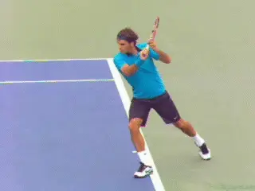

**Note the slightly open racket face - and the position of contact
related to grip.**

In fact that appears to be the case in a limited number of examples. But
in the vast majority of the high speed video clips in the archive, the
racket face is beveled back slightly, say at 15 degrees plus or minus
with the bottom edge of the racket therefore leading the top edge
slightly at contact.

To me this makes sense that the face stays slightly open. The physics of
the ball/string/racket interaction are undoubtedly quite complex in
determining the speed, angle of trajectory, and type and amount of spin.

But the beveled racket face probably allows players to hit through the
ball somewhat more and still generate high spin levels. Watching club
players who have become obsessed with the idea that the face must be
perpendicular at contact, you normally see the ball floats high and soft
with reduced pace, and sometimes, reduced spin as well.

**Torso**

Even though the hitting arm can come almost insanely far around and
point at the side fence after contact, the torso still stays relatively
sideways. We noted above that the shoulder rotate maybe 30 to 45 degrees
from the full turn position to the contact. There is a comparable amount
of rotation from the contact to the finish.

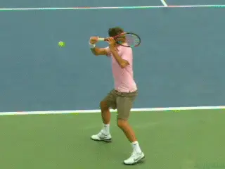

**The range of backward movement of the rear arm - and the torso
rotation after contact.**

This is related to the movement of the back arm. **[In general on any
one-handed backhand, whether a drive or slice, the arms oppose in the
forward swing. That is, the back arm moves backwards as the hitting arm
swings forward through the ball.]**

However, with our three players we can again see a range of movement
with the rear arm. This also seems to correlate with how far the torso
eventually comes around.

Roger's back arm motion is extreme to say the least. As his left arm
moves backwards it points at the back fence, but continues to move far
past that position, often pointing behind him at a 45 degrees or more.
If nothing else, that shows his incredible flexibility.

But it also seems to correlate with his relatively sideways torso
position.

Rafa's arm movement is far less and at the other end of the extreme.
Although his opposite arm does move backward somewhat, Rafa doesn't
even straighten it, keeping the elbow bent and tucked in toward his
waist. This is probably related to his increased torso rotation at the
end of the movement and also the way his feet seem to come around
further and sooner than Federer.

As we've seen, Djokovic's motion is in so many respects between either
Federer or Nadal, and the same applies here. Watch how his arm goes
straight back but not radically behind his body like Roger. This motion
moderates the front shoulder rotation, so it is also less than Nadal.

**Followthrough**

So a final complexity to look at on the pro slice is the high finish.
All three players finish with the racket hand substantially above
contact, sometimes reaching shoulder level even when the racket tip is
pointing down at the court. Other finishes can be higher still, reaching
eye level.

If the forward swing on the pro slice is radically downward and then
across--and if the upward motion can't affect the ball after it has
left the strings--why pro players still finish high?

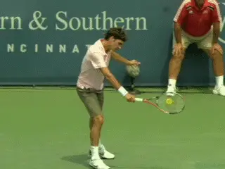

**After contact, the finish is high, often reaching shoulder level.**

The answer is there is no where left to go. ***All tennis swings need
a deceleration phase. The racket has to slow down gradually after
contact if the player wants to avoid putting dangerous stress on the
joints and the muscles.***

On most pro swings, the hitting arm and racket reach the bottom of the
potential range of motion shortly after contact. So the only way left to
go is up.

Players who aim for the contact and don't allow the racket to move
freely through the finish also probably lose racket head speed. **To
maximize acceleration, the swing needs to be free and relaxed, and this
means allow the arm and racket to continue and to move and this means
upward on the slice.**

As we will see when we start to compare the pro slice to the slice in
club game, the high finish has additional purpose when players drive
through the ball with underspin and lower levels of contact height and
ball speed. One question is whether this type of swing can even work in
the pro game, and if so would it be more or less effective on which
balls when. More on that question and whether it's possible to answer
later on.

All and all the slice backhand is a fascinating shot. At the pro level
it is difficult to understand and, I admit, something I've been putting
off tackling until now. And now, I'm glad I'm in! Stay tuned for more.

John Yandell is widely acknowledged as one of the leading videographers
and students of the modern game of professional tennis. His high speed
filming for Advanced Tennis and TPA have provided new visual
resources that have changed the way the game is studied and understood
by both players and coaches. He has done personal video analysis for
hundreds of high level competitive players, including Justine
Henin-Hardenne, Taylor Dent and John McEnroe, among others.

In addition to his role as Editor of TPA he is the author of
the critically acclaimed book Visual Tennis. The John Yandell Tennis
School is located in San Francisco, California.
