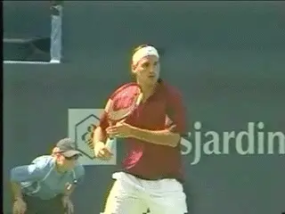

# John Yandell-Your forehand and the modern forehand-A Summary

**John Yandell\
Your Forehand and the Modern Forehand**

# A Summary

**Is it possible to summarize the modern forehand in one article? You be
the judge...**

Over the past 4 years we've used the high speed footage from Advanced
Tennis to explore the modern forehand in pro tennis in virtually every
aspect. Currently there are over a dozen detailed articles in the
Advanced Tennis section on the modern forehand. These cover the
commonalities and the differences among the top pro players.( [link](https://www.tennisplayer.net/members/avancedtennis/advtennis.html))

In this new series called "Your Forehand and the Modern Forehand,"
we've applied everything we've learned to your game and see what pro
elements are universal and which are a function of primarily of level of
play.

This marks the 12th full article devoted to the beautiful and
tremendously dynamic motion we call the forehand. We've covered
everything from grip to preparation to hittting arm positions, finishes,
wipers and more. Now in this last article, we try to summarize all the
components and see what we've learned.

John Yandell is widely acknowledged as one of the leading videographers
and students of the modern game of professional tennis. His high speed
filming for Advanced Tennis and TPA have provided new visual
resources that have changed the way the game is studied and understood
by both players and coaches. He has done personal video analysis for
hundreds of high level competitive players, including Justine
Henin-Hardenne, Taylor Dent and John McEnroe, among others.

In addition to his role as Editor of TPA he is the author of
the critically acclaimed book Visual Tennis. The John Yandell Tennis
School is located in San Francisco, California.

---

<!-- prevnext-nav -->
[← Part 2](john-yandell-modern-tennis-forehand-where-are-we-now-part-2.md)  |  [Advanced Tennis Index](index.md)  |  [Overview →](john-yandell-your-forehand-and-the-modern-forehand.md)
