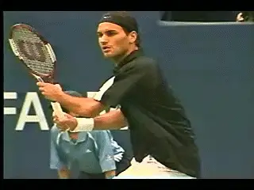

# John Yandell-Your forehand and the modern forehand-Preparation

**John Yandell\
Your Forehand and the Modern Forehand**

# Preparation

Over the past 4 years we've used the high speed footage from Advanced
Tennis to explore the modern forehand in pro tennis in virtually every
aspect. Currently there are over a dozen detailed articles in the
Advanced Tennis section on the modern forehand. These cover the
commonalities and the differences among the top pro players. ([link](https://www.tennisplayer.net/members/avancedtennis/advtennis.html).)

Last month we started a new series called "Your Forehand and the Modern
Forehand." The idea is to apply everything we've learned to your game
and see what pro elements are universal and which are a function of
primarily of level of play.

Although some readers have occasionally mistaken my intent, in my
previous articles I never said that every player should hit the forehand
like Roddick, or Nadal, or Federer--not in all respects anyway. I
stated repeatedly that my was just to try to understand the pro
forehand, a challenging goal to say the least. But now it's time to get
specific and see what pro elements you can incorporate to take your game
to the next level. In the first article, we started with an analysis of
Grip and Contact Height. ([link](https://www.tennisplayer.net/members/avancedtennis/john_yandell/your_forehand_and_the_modern_forehand/grip/your_forehand_and_the_modern_forehand_grip.html).)

This month we'll continue with Part 2 "Preparation." It's a subject
that is widely misunderstood. I think this article is the best analysis
of forehand preparation that I've done or seen on the site, or
honestly, anywhere else.

So see what you think and let's know by posting a comment in the Forum!

**What are the secrets to great preparation and why is it so
misundertood?**

****

John Yandell is widely acknowledged as one of the leading videographers
and students of the modern game of professional tennis. His high speed
filming for Advanced Tennis and TPA have provided new visual
resources that have changed the way the game is studied and understood
by both players and coaches. He has done personal video analysis for
hundreds of high level competitive players, including Justine
Henin-Hardenne, Taylor Dent and John McEnroe, among others.

In addition to his role as Editor of TPA he is the author of
the critically acclaimed book Visual Tennis. The John Yandell Tennis
School is located in San Francisco, California.

---

<!-- prevnext-nav -->
[← Grip and Contact Height](john-yandell-your-forehand-and-the-modern-forehand-grip-and-contact-height.md)  |  [Advanced Tennis Index](index.md)  |  [Shoulder Rotation →](john-yandell-your-forehand-and-the-modern-forehand-shoulder-rotation.md)
