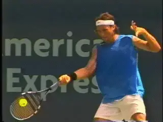

# John Yandell-Your forehand and the modern forehand-The Forward Swing Hand and Arm Rotation

**John Yandell\
Your Forehand and the Modern Forehand**

# The Forward Swing Hand and Arm Rotation

This month we'll start to look at the forward swing, possibly the most
complex and dynamic element in tennis. We'll try to understand what
really happens and why there is so much diversity among top players, by
breaking the forward swing into two components.

This month focuses on Hand and Arm Rotation, how the top player create
the windshield wiper finish, how to create it yourself, and how it
applies to your game. 

**How should you incorporate hand and arm rotation into your forehand?**

John Yandell is widely acknowledged as one of the leading videographers
and students of the modern game of professional tennis. His high speed
filming for Advanced Tennis and TPA have provided new visual
resources that have changed the way the game is studied and understood
by both players and coaches. He has done personal video analysis for
hundreds of high level competitive players, including Justine
Henin-Hardenne, Taylor Dent and John McEnroe, among others.

In addition to his role as Editor of TPA he is the author of
the critically acclaimed book Visual Tennis. The John Yandell Tennis
School is located in San Francisco, California.
